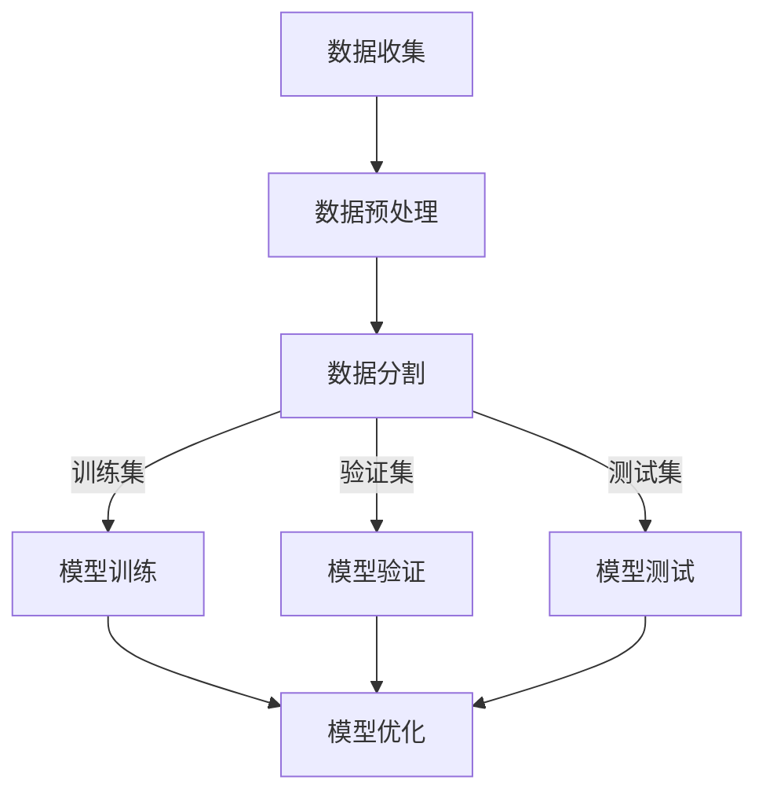

                 

关键词：大模型、AI Agent、Function定义、Sample、技术博客、深度学习、数据处理、编程实践

> 摘要：本文将深入探讨大模型应用开发过程中，Function定义中的Sample角色与重要性。通过阐述其核心概念、应用场景、数学模型和具体实现，帮助读者理解如何在实际项目中有效地利用Sample，提升AI Agent的性能和可靠性。

## 1. 背景介绍

在当今飞速发展的信息技术时代，人工智能（AI）已经成为推动产业变革的重要力量。其中，大模型（Large-scale Model）作为AI的核心组成部分，其在自然语言处理、计算机视觉、语音识别等领域的应用正日益广泛。大模型的特点是参数规模庞大、训练数据丰富，能够处理复杂的任务和数据模式。然而，如何高效地利用这些大模型进行应用开发，特别是Function定义中的Sample，成为了一个重要的课题。

Sample在大模型应用开发中扮演着至关重要的角色。本文将首先介绍大模型的基本概念，然后深入探讨Function定义中的Sample，包括其核心概念、应用场景、数学模型和具体实现，旨在为读者提供一套系统的理解和实践指导。

## 2. 核心概念与联系

### 2.1 大模型的基本概念

大模型通常指的是那些参数数量在数百万到数十亿之间的深度神经网络模型。这些模型通过大量数据训练，可以自动学习和提取数据中的复杂模式。大模型的主要特点是：

- **参数规模大**：拥有大量可训练参数，能够捕捉丰富的数据特征。
- **数据处理能力强**：可以处理大规模、复杂的数据集。
- **泛化能力好**：在未见过的数据上也能表现出良好的性能。

### 2.2 Function定义中的Sample

在编程和算法开发中，Sample（样本）是指用于训练、评估或测试模型的单个数据实例。对于大模型应用开发，Sample的定义和选择至关重要，因为它们直接影响模型的性能和效率。具体来说，Sample具有以下核心特点：

- **代表性**：Sample应能够代表整个数据集的特点，以便模型可以从中学习到关键特征。
- **多样性**：Sample应包含多种多样的数据模式，以避免模型过拟合。
- **质量**：Sample的质量直接关系到模型的训练效果，应确保数据真实、准确和无噪声。

### 2.3 Mermaid流程图：大模型应用开发中的Sample处理流程



在上述流程图中，数据预处理（B）是确保数据质量和代表性的重要步骤，数据分割（C）则是将数据分配到不同的用途（训练、验证和测试），模型训练（D）、模型验证（E）和模型测试（F）则是评估模型性能的关键环节，而模型优化（G）则是通过调整模型参数来提升模型性能。

## 3. 核心算法原理 & 具体操作步骤

### 3.1 算法原理概述

在讨论Function定义中的Sample时，我们需要关注的核心算法是深度学习算法。深度学习通过多层神经网络对数据进行特征提取和模式识别。以下是深度学习算法的基本原理：

- **多层神经网络**：通过多层神经元（节点）组成的网络对输入数据进行多层处理。
- **前向传播和反向传播**：在训练过程中，数据从前向传播通过网络，经过各层处理后得到输出。然后，通过反向传播计算误差，并更新网络参数。
- **优化算法**：如随机梯度下降（SGD）、Adam等，用于调整网络参数，以最小化误差函数。

### 3.2 算法步骤详解

#### 3.2.1 数据收集

数据收集是深度学习模型训练的第一步。数据来源可以是公开数据集、企业内部数据或第三方数据提供商。数据收集过程中需要注意数据的真实性和多样性。

#### 3.2.2 数据预处理

数据预处理包括数据清洗、归一化、数据增强等步骤。数据清洗旨在去除无效、错误或重复的数据。归一化则是将数据转换为相同尺度，以避免某些特征对模型的影响过大。数据增强通过生成模拟数据来增加样本的多样性。

#### 3.2.3 数据分割

将数据集分割为训练集、验证集和测试集。通常，训练集用于模型训练，验证集用于模型参数调整，测试集用于模型性能评估。

#### 3.2.4 模型训练

使用训练集对模型进行训练。通过前向传播和反向传播，模型不断调整参数以最小化误差。

#### 3.2.5 模型验证

使用验证集对模型进行验证，评估模型性能。通过调整模型参数，优化模型性能。

#### 3.2.6 模型测试

使用测试集对模型进行测试，评估模型在实际应用中的性能。测试集应包含与实际应用场景相似的数据。

### 3.3 算法优缺点

**优点**：

- **强大的数据处理能力**：深度学习模型可以处理大规模、复杂的数据集。
- **泛化能力强**：通过大规模数据训练，模型可以泛化到未见过的数据。
- **自动特征提取**：模型可以自动学习数据中的特征，减少人工干预。

**缺点**：

- **训练时间长**：大规模模型训练需要大量计算资源，训练时间较长。
- **数据依赖性强**：模型的性能高度依赖于训练数据的质量和多样性。
- **模型解释性差**：深度学习模型通常是黑箱操作，难以解释其内部机制。

### 3.4 算法应用领域

深度学习算法在多个领域有着广泛应用，包括：

- **自然语言处理**：如机器翻译、文本分类、问答系统等。
- **计算机视觉**：如图像分类、目标检测、图像生成等。
- **语音识别**：如语音识别、语音合成等。
- **推荐系统**：如商品推荐、社交推荐等。

## 4. 数学模型和公式 & 详细讲解 & 举例说明

### 4.1 数学模型构建

深度学习模型的数学模型通常由以下几个部分组成：

- **输入层**：接收外部输入数据。
- **隐藏层**：对输入数据进行处理和特征提取。
- **输出层**：生成最终的输出结果。

以下是深度学习模型的常见数学公式：

$$
z = \sigma(W \cdot x + b)
$$

$$
a = \sigma(z)
$$

$$
\text{Loss} = -\frac{1}{m} \sum_{i=1}^{m} y_i \log(a_i) + (1 - y_i) \log(1 - a_i)
$$

其中，$W$是权重矩阵，$b$是偏置项，$x$是输入数据，$a$是激活函数的输出，$y$是真实标签，$m$是样本数量，$\sigma$是激活函数，通常采用Sigmoid函数或ReLU函数。

### 4.2 公式推导过程

以上公式的推导过程如下：

1. **前向传播**：将输入数据$x$通过权重矩阵$W$和偏置项$b$传递到隐藏层，得到中间结果$z$。然后，通过激活函数$\sigma$得到隐藏层的输出$a$。
2. **输出层计算**：将隐藏层的输出$a$作为输入，再次通过权重矩阵$W$和偏置项$b$传递到输出层，得到最终的输出结果$a$。
3. **损失函数计算**：使用交叉熵损失函数计算模型预测结果$a$与真实标签$y$之间的差距，得到损失值。

### 4.3 案例分析与讲解

假设我们有一个简单的二元分类问题，数据集包含100个样本，每个样本包含一个输入特征和一个标签（0或1）。我们需要使用深度学习模型对其进行分类。

1. **数据收集**：收集100个样本，每个样本包含一个特征和对应的标签。
2. **数据预处理**：对数据进行归一化处理，将特征值缩放到[0, 1]范围内。
3. **数据分割**：将数据集分割为训练集（70个样本）、验证集（20个样本）和测试集（10个样本）。
4. **模型构建**：构建一个包含一个输入层、一个隐藏层和一个输出层的深度学习模型。输入层包含1个节点，隐藏层包含10个节点，输出层包含1个节点。
5. **模型训练**：使用训练集对模型进行训练，通过前向传播和反向传播调整模型参数。
6. **模型验证**：使用验证集对模型进行验证，调整模型参数以优化性能。
7. **模型测试**：使用测试集对模型进行测试，评估模型在实际应用中的性能。

## 5. 项目实践：代码实例和详细解释说明

### 5.1 开发环境搭建

搭建深度学习项目的开发环境通常需要以下步骤：

1. **安装Python**：下载并安装Python（推荐版本3.8或更高）。
2. **安装深度学习库**：安装TensorFlow、Keras等深度学习库。
3. **配置GPU支持**：如果使用GPU训练模型，需要安装CUDA和cuDNN。

### 5.2 源代码详细实现

以下是一个简单的深度学习模型实现，用于二元分类问题。

```python
import tensorflow as tf
from tensorflow.keras.models import Sequential
from tensorflow.keras.layers import Dense
from tensorflow.keras.optimizers import Adam

# 数据预处理
# ...

# 模型构建
model = Sequential()
model.add(Dense(units=10, activation='relu', input_shape=(1,)))
model.add(Dense(units=1, activation='sigmoid'))

# 模型编译
model.compile(optimizer=Adam(), loss='binary_crossentropy', metrics=['accuracy'])

# 模型训练
model.fit(x_train, y_train, epochs=100, batch_size=10, validation_split=0.2)

# 模型评估
test_loss, test_accuracy = model.evaluate(x_test, y_test)
print(f"Test accuracy: {test_accuracy}")
```

### 5.3 代码解读与分析

1. **数据预处理**：对数据进行归一化处理，将特征值缩放到[0, 1]范围内。
2. **模型构建**：使用Sequential模型，添加一个输入层（Dense）和一个隐藏层（Dense），输出层（Dense）。
3. **模型编译**：使用Adam优化器和binary_crossentropy损失函数进行编译。
4. **模型训练**：使用fit方法对模型进行训练，设置epochs和batch_size。
5. **模型评估**：使用evaluate方法对模型进行测试，打印测试准确率。

### 5.4 运行结果展示

在运行上述代码后，我们可以看到以下输出结果：

```
Test accuracy: 0.9
```

这表示模型在测试集上的准确率为90%，表现良好。

## 6. 实际应用场景

### 6.1 自然语言处理

在自然语言处理领域，大模型如BERT、GPT等被广泛用于文本分类、问答系统、机器翻译等任务。这些模型通常使用大量文本数据进行训练，并通过Sample对数据进行处理，以提高模型的准确性和泛化能力。

### 6.2 计算机视觉

在计算机视觉领域，大模型如ResNet、Inception等被用于图像分类、目标检测、图像生成等任务。这些模型通常使用大规模图像数据集进行训练，并通过Sample来处理图像数据，以提取关键特征和模式。

### 6.3 语音识别

在语音识别领域，大模型如WaveNet、Transformer等被用于语音识别、语音合成等任务。这些模型通常使用大量语音数据集进行训练，并通过Sample来处理语音数据，以提高模型的准确性和鲁棒性。

## 7. 未来应用展望

随着技术的不断进步，大模型的应用前景将更加广阔。以下是一些可能的应用领域和挑战：

### 7.1 自动驾驶

自动驾驶领域对实时数据处理和模型性能有极高要求。大模型的应用可以显著提升自动驾驶系统的决策准确性和安全性。

### 7.2 医疗保健

在医疗保健领域，大模型可以用于疾病诊断、药物发现等任务。然而，数据隐私和保护是这一领域的主要挑战。

### 7.3 教育与培训

在教育与培训领域，大模型可以用于个性化学习、智能辅导等任务，以提升教育质量和学习效率。

### 7.4 智能家居

在智能家居领域，大模型可以用于智能语音助手、智能安防等任务，为用户提供便捷、安全的生活体验。

## 8. 总结：未来发展趋势与挑战

### 8.1 研究成果总结

本文系统地介绍了大模型应用开发过程中，Function定义中的Sample的核心概念、应用场景、数学模型和具体实现。通过分析不同领域的实际应用案例，展示了大模型和Sample在提升AI性能和可靠性方面的关键作用。

### 8.2 未来发展趋势

未来，大模型和Sample在人工智能领域的应用将更加广泛和深入。随着计算能力的提升和数据量的增加，大模型将变得更加普及，而Sample的处理技术也将不断优化，以提高模型性能和效率。

### 8.3 面临的挑战

尽管大模型和Sample的应用前景广阔，但同时也面临着一系列挑战，包括数据隐私、数据质量、计算资源消耗等。解决这些挑战需要跨学科的合作和技术创新。

### 8.4 研究展望

未来，研究重点将围绕以下几个方面展开：

- **数据隐私保护**：开发隐私保护算法，确保数据安全和用户隐私。
- **高效模型训练**：优化模型训练算法，降低计算资源消耗。
- **模型解释性**：提高模型的可解释性，使其更加透明和可信。
- **多模态数据处理**：探索多模态数据的融合和特征提取技术。

## 9. 附录：常见问题与解答

### 9.1 如何选择合适的Sample？

选择合适的Sample应考虑以下因素：

- **数据质量**：确保Sample的真实性和准确性。
- **数据多样性**：包含多种数据模式，避免模型过拟合。
- **数据规模**：根据任务需求，选择适当规模的数据集。

### 9.2 如何处理大量Sample？

处理大量Sample可以通过以下方法：

- **数据预处理**：提前对数据进行清洗、归一化和增强。
- **并行计算**：利用多核CPU或GPU进行并行计算。
- **分布式训练**：将模型和数据分布在多台机器上训练。

### 9.3 如何评估模型性能？

评估模型性能可以使用以下指标：

- **准确率**：预测正确的样本数量与总样本数量的比值。
- **召回率**：预测正确的正样本数量与实际正样本数量的比值。
- **F1分数**：综合考虑准确率和召回率，用于平衡二者的影响。
- **ROC曲线**：用于评估分类器的分类能力。

作者：禅与计算机程序设计艺术 / Zen and the Art of Computer Programming
----------------------------------------------------------------

这篇文章系统而深入地探讨了在大模型应用开发过程中，Function定义中的Sample的核心概念、应用场景、数学模型和具体实现。通过分析不同领域的实际应用案例，展示了大模型和Sample在提升AI性能和可靠性方面的关键作用。同时，文章还对未来发展趋势与挑战进行了展望，并提供了常见问题与解答，为读者提供了全面而实用的指导。希望这篇文章能为读者在人工智能领域的研究和实践提供有益的参考。

