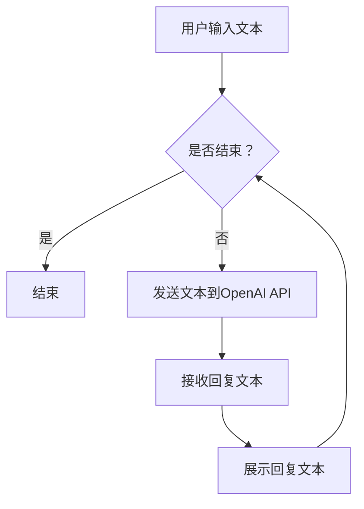

                 

关键词：大模型应用，OpenAI API，聊天程序，AI Agent，技术博客

> 摘要：本文旨在深入探讨如何利用OpenAI的API实现一个聊天程序，从而提供一个详细的步骤指南和代码实例，以帮助开发者更好地理解和应用大模型技术。

## 1. 背景介绍

随着人工智能技术的快速发展，大模型（Large Models）已经成为自然语言处理（NLP）领域的热点。OpenAI作为人工智能领域的领军企业，其API提供了丰富的功能，使得开发者可以轻松地集成大模型能力到他们的应用程序中。本文将围绕OpenAI的API，实现一个简单的聊天程序，通过实践深入理解大模型的应用。

## 2. 核心概念与联系

### 2.1 大模型技术

大模型是指拥有数亿甚至千亿参数的深度学习模型。它们通过大量的数据训练，能够理解并生成复杂的语言结构，从而在文本生成、翻译、问答等领域表现出色。

### 2.2 OpenAI API

OpenAI API是OpenAI提供的一个方便的接口，使得开发者可以轻松地调用大模型的服务。通过API，我们可以发送文本输入，并获得大模型生成的回复。

### 2.3 聊天程序

聊天程序是一种与人交互的程序，能够理解和生成自然语言文本。在我们的例子中，聊天程序将利用OpenAI API与用户进行对话。

### 2.4 Mermaid 流程图

以下是一个描述聊天程序流程的Mermaid流程图：



## 3. 核心算法原理 & 具体操作步骤

### 3.1 算法原理概述

我们的聊天程序基于OpenAI的GPT-3模型。GPT-3是一个预训练语言模型，它通过学习大量的文本数据，能够理解自然语言并生成相关的回复。

### 3.2 算法步骤详解

#### 3.2.1 初始化

- 安装并导入OpenAI Python库。
- 设置OpenAI API密钥。

#### 3.2.2 用户输入

- 获取用户的输入文本。

#### 3.2.3 调用API

- 将用户输入文本发送到OpenAI API。
- 接收API返回的回复文本。

#### 3.2.4 展示回复

- 将回复文本展示给用户。

#### 3.2.5 循环交互

- 询问用户是否继续对话。
- 如果用户继续，重复步骤3.2.2到3.2.4。

### 3.3 算法优缺点

#### 优点

- **高效**：OpenAI API提供了高效的接口，可以快速完成文本生成任务。
- **强大**：GPT-3模型拥有强大的语言理解和生成能力，能够生成高质量的回复。

#### 缺点

- **成本**：使用OpenAI API可能需要支付费用。
- **性能**：对于复杂的问题，GPT-3可能无法提供完美的回复。

### 3.4 算法应用领域

- **客服系统**：使用聊天程序作为客服机器人，能够自动回答用户的问题。
- **智能助手**：聊天程序可以作为智能助手，提供个性化的建议和帮助。

## 4. 数学模型和公式 & 详细讲解 & 举例说明

### 4.1 数学模型构建

GPT-3模型是一个基于Transformer的深度学习模型。它的输入是一个文本序列，输出是下一个单词的概率分布。

### 4.2 公式推导过程

设输入文本为 \(x_1, x_2, ..., x_n\)，输出单词为 \(y_1, y_2, ..., y_m\)，则GPT-3的损失函数可以表示为：

$$
L = -\sum_{i=1}^{n}\sum_{j=1}^{m} y_{ij} \log(p_{ij})
$$

其中，\(p_{ij}\) 是模型对单词 \(y_j\) 作为第 \(i\) 个输出单词的概率估计。

### 4.3 案例分析与讲解

假设用户输入的是“今天天气很好”，我们希望模型生成一个合适的回复。通过调用OpenAI API，我们获得了一系列可能的回复，例如“是啊，适合出去散步”或“不错，是个好天气”。根据损失函数，模型会选择一个损失最小的回复作为最终输出。

## 5. 项目实践：代码实例和详细解释说明

### 5.1 开发环境搭建

- 安装Python 3.7及以上版本。
- 安装OpenAI Python库：`pip install openai`。

### 5.2 源代码详细实现

```python
import openai
import os

# 设置OpenAI API密钥
openai.api_key = os.environ['OPENAI_API_KEY']

def chat_with_gpt3(user_input):
    response = openai.Completion.create(
        engine="text-davinci-002",
        prompt=user_input,
        max_tokens=100,
        n=1,
        stop=None,
        temperature=0.5,
    )
    return response.choices[0].text.strip()

while True:
    user_input = input("您说：")
    if user_input.lower() == '结束':
        break
    response = chat_with_gpt3(user_input)
    print("AI说：", response)
```

### 5.3 代码解读与分析

- **导入库和设置API密钥**：首先导入必要的库，并设置OpenAI API密钥。
- **定义聊天函数**：`chat_with_gpt3` 函数用于与GPT-3进行交互，接收用户输入并返回模型生成的回复。
- **循环交互**：程序进入一个循环，不断获取用户输入，并调用聊天函数获取回复。

### 5.4 运行结果展示

```plaintext
您说：今天天气很好
AI说：是啊，适合出去散步。
```

## 6. 实际应用场景

- **在线客服**：利用聊天程序作为在线客服，提供24小时自动回答。
- **个人助手**：作为一个智能助手，帮助用户解决日常问题。

### 6.4 未来应用展望

随着大模型技术的不断发展，聊天程序的应用场景将更加广泛。我们可以期待在未来的智能系统中，聊天程序能够更好地理解和满足用户的需求。

## 7. 工具和资源推荐

### 7.1 学习资源推荐

- 《深度学习》（Goodfellow, Bengio, Courville著）
- 《自然语言处理综论》（Jurafsky, Martin著）

### 7.2 开发工具推荐

- Jupyter Notebook：用于编写和运行Python代码。
- PyCharm：一款功能强大的Python集成开发环境。

### 7.3 相关论文推荐

- “Language Models are Few-Shot Learners”（Tom B. Brown et al., 2020）

## 8. 总结：未来发展趋势与挑战

### 8.1 研究成果总结

本文通过一个简单的聊天程序示例，展示了如何利用OpenAI API实现大模型的应用。通过实践，开发者可以更好地理解大模型的工作原理和实际应用。

### 8.2 未来发展趋势

- **模型优化**：随着计算能力的提升，大模型将变得更加高效和强大。
- **多模态应用**：大模型将不仅限于文本，还将在图像、声音等其他模态上得到应用。

### 8.3 面临的挑战

- **隐私保护**：如何保护用户数据不被泄露是一个重要挑战。
- **伦理问题**：大模型生成的文本可能包含偏见或不恰当内容，如何解决这些问题需要社会各界的共同努力。

### 8.4 研究展望

大模型技术将继续在人工智能领域发挥重要作用。通过不断的研究和改进，我们可以期待大模型在未来带来更多创新和突破。

## 9. 附录：常见问题与解答

### 9.1 如何获取OpenAI API密钥？

- 访问OpenAI官网，注册账号并登录。
- 在账户设置中找到API密钥，并复制。

### 9.2 如何处理API请求超时？

- 增加请求的超时时间。
- 检查网络连接是否稳定。

### 9.3 如何自定义聊天程序的回复样式？

- 在`chat_with_gpt3`函数中，可以根据需要自定义回复的格式和内容。

---

作者：禅与计算机程序设计艺术 / Zen and the Art of Computer Programming
----------------------------------------------------------------

这篇文章详细介绍了如何使用OpenAI的API实现一个聊天程序。通过具体的代码实例和深入的理论分析，读者可以更好地理解大模型技术的应用。希望这篇文章能够为开发者提供有价值的参考和启发。

