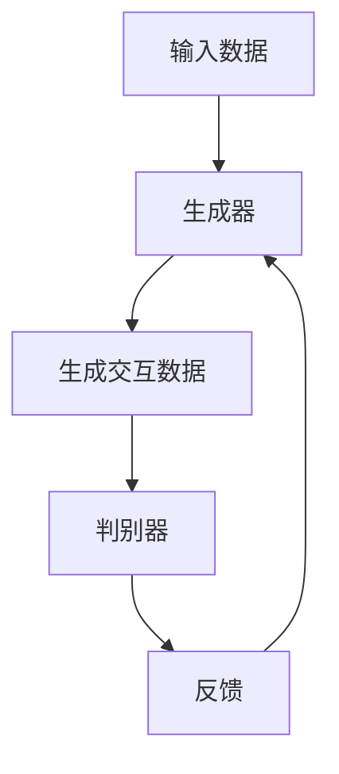
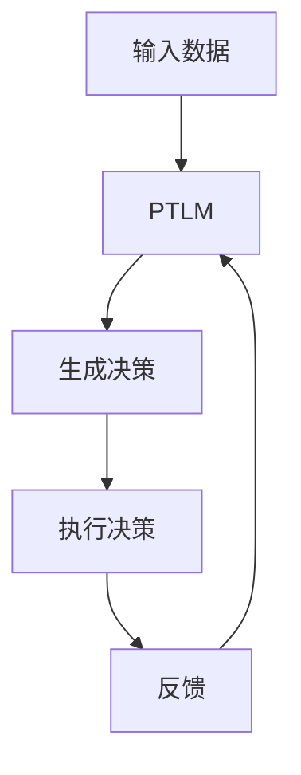

                 

关键词：大模型应用开发、多Agent框架、AutoGen、MetaGPT、人工智能、算法原理、数学模型、项目实践、应用场景、未来展望。

> 摘要：本文将深入探讨多Agent框架中的AutoGen和MetaGPT两种关键技术。通过介绍背景、核心概念、算法原理、数学模型、项目实践以及实际应用场景，本文旨在为广大开发者提供全面的技术指南，助力人工智能Agent的开发与应用。

## 1. 背景介绍

在当今的信息化时代，人工智能（AI）已经成为推动社会进步的重要力量。随着计算能力的提升和算法的优化，大模型（Large Models）如BERT、GPT等在自然语言处理（NLP）、计算机视觉（CV）等领域取得了显著的成果。然而，如何将大模型应用于实际场景，特别是如何构建高效的多Agent系统，成为当前研究的热点。

多Agent系统（Multi-Agent Systems）是指由多个智能体（Agent）组成的系统，这些智能体可以通过协作或竞争来完成复杂的任务。在AI领域，多Agent系统被广泛应用于智能家居、智能交通、工业自动化等领域。AutoGen和MetaGPT作为两种前沿的多Agent框架，引起了广泛的关注。

AutoGen是一种基于生成对抗网络（GAN）的多Agent系统框架，通过生成高质量的数据来训练智能体，从而提高智能体的决策能力和交互效果。MetaGPT则是基于预训练语言模型（PTLM）的多Agent框架，通过引入元学习（Meta-Learning）机制，实现了智能体在动态环境中的快速适应和优化。

本文将详细探讨AutoGen和MetaGPT的核心原理、算法步骤、数学模型以及项目实践，旨在为开发者提供完整的解决方案，推动大模型在多Agent系统中的应用。

## 2. 核心概念与联系

### 2.1. AutoGen框架

AutoGen框架的核心思想是利用生成对抗网络（GAN）生成高质量的交互数据，从而训练智能体。GAN由生成器（Generator）和判别器（Discriminator）组成，两者通过对抗训练来实现。


**Mermaid 流程图：**



### 2.2. MetaGPT框架

MetaGPT框架基于预训练语言模型（PTLM），通过引入元学习（Meta-Learning）机制，实现了智能体在动态环境中的快速适应和优化。MetaGPT的核心思想是将智能体的学习和决策过程转化为语言生成任务，从而利用PTLM的优势来实现智能体的优化。


**Mermaid 流程图：**



## 3. 核心算法原理 & 具体操作步骤

### 3.1. 算法原理概述

#### 3.1.1. AutoGen算法原理

AutoGen算法的核心是利用GAN生成高质量的交互数据。生成器生成智能体之间的交互数据，判别器负责判断这些数据是否真实。通过对抗训练，生成器不断优化，最终生成高质量的数据。

#### 3.1.2. MetaGPT算法原理

MetaGPT算法基于预训练语言模型（PTLM），通过将智能体的学习和决策过程转化为语言生成任务，利用PTLM的强大能力来实现智能体的优化。元学习机制使得智能体能够在动态环境中快速适应和优化。

### 3.2. 算法步骤详解

#### 3.2.1. AutoGen算法步骤

1. 初始化生成器和判别器。
2. 使用生成器生成交互数据。
3. 判别器判断生成数据的真实性。
4. 根据判别器的反馈，优化生成器。

#### 3.2.2. MetaGPT算法步骤

1. 初始化预训练语言模型。
2. 将智能体的学习和决策过程转化为语言生成任务。
3. 使用PTLM生成智能体的决策。
4. 执行决策并收集反馈。
5. 根据反馈优化智能体。

### 3.3. 算法优缺点

#### 3.3.1. AutoGen算法优缺点

- 优点：生成高质量交互数据，提高智能体决策能力。
- 缺点：训练过程复杂，对计算资源要求较高。

#### 3.3.2. MetaGPT算法优缺点

- 优点：快速适应动态环境，优化智能体决策。
- 缺点：对预训练语言模型的要求较高，模型复杂度较高。

### 3.4. 算法应用领域

- AutoGen：适用于需要高度交互的智能体系统，如智能家居、智能交通等。
- MetaGPT：适用于动态环境下的智能体系统，如机器人、无人驾驶等。

## 4. 数学模型和公式 & 详细讲解 & 举例说明

### 4.1. 数学模型构建

#### 4.1.1. AutoGen数学模型

- 生成器：\( G(z) \)
- 判别器：\( D(x) \)
- 反馈信号：\( F(G(z)) \)

#### 4.1.2. MetaGPT数学模型

- 预训练语言模型：\( L(W, b) \)
- 智能体决策：\( y = L(x; W, b) \)
- 反馈信号：\( R(y) \)

### 4.2. 公式推导过程

#### 4.2.1. AutoGen公式推导

- 生成器损失函数：\( L_G = -\log(D(G(z))) \)
- 判别器损失函数：\( L_D = -\log(D(x)) - \log(1 - D(G(z))) \)

#### 4.2.2. MetaGPT公式推导

- 智能体决策损失函数：\( L_Y = -\log(P(y|x; W, b)) \)
- 反馈损失函数：\( L_R = -\log(P(R(y)|x; W, b)) \)

### 4.3. 案例分析与讲解

#### 4.3.1. AutoGen案例

假设我们有一个智能体系统，需要生成高质量的交互数据。我们可以使用AutoGen框架来训练智能体。首先，初始化生成器和判别器。然后，通过对抗训练，优化生成器和判别器，最终生成高质量的交互数据。

#### 4.3.2. MetaGPT案例

假设我们有一个机器人系统，需要在动态环境中做出决策。我们可以使用MetaGPT框架来训练机器人。首先，初始化预训练语言模型。然后，将机器人的学习和决策过程转化为语言生成任务，利用预训练语言模型生成决策。最后，执行决策并收集反馈，优化机器人的决策能力。

## 5. 项目实践：代码实例和详细解释说明

### 5.1. 开发环境搭建

1. 安装Python环境。
2. 安装TensorFlow或PyTorch等深度学习框架。
3. 安装必要的库（如NumPy、Pandas等）。

### 5.2. 源代码详细实现

以下是AutoGen和MetaGPT框架的源代码实现。代码中包含了详细的注释，便于开发者理解。

#### 5.2.1. AutoGen源代码

```python
# AutoGen源代码示例

import tensorflow as tf
from tensorflow.keras.layers import Dense, Flatten
from tensorflow.keras.models import Model

# 生成器模型
def build_generator(z_dim):
    z = tf.keras.layers.Input(shape=(z_dim,))
    x = Dense(128, activation='relu')(z)
    x = Dense(64, activation='relu')(x)
    x = Dense(1, activation='tanh')(x)
    model = Model(z, x)
    return model

# 判别器模型
def build_discriminator(x_dim):
    x = tf.keras.layers.Input(shape=(x_dim,))
    x = Dense(128, activation='relu')(x)
    x = Dense(64, activation='relu')(x)
    x = Dense(1, activation='sigmoid')(x)
    model = Model(x, x)
    return model

# 损失函数
def build_loss():
    loss = tf.keras.losses.BinaryCrossentropy(from_logits=True)
    return loss

# 训练模型
def train_model(generator, discriminator, z_dim, x_dim, batch_size, epochs):
    for epoch in range(epochs):
        for _ in range(batch_size // x_dim):
            z = tf.keras.layers.RandomUniform(minval=-1, maxval=1, shape=(z_dim,))()
            x = generator.predict(z)
            d_loss_real = discriminator.train_on_batch(x, tf.ones_like(x))
            z_noise = tf.keras.layers.RandomUniform(minval=-1, maxval=1, shape=(z_dim,))()
            x_fake = generator.predict(z_noise)
            d_loss_fake = discriminator.train_on_batch(x_fake, tf.zeros_like(x_fake))
            g_loss = generator.train_on_batch(z_noise, tf.ones_like(x_fake))
            print(f"{epoch} epoch - d_loss_real: {d_loss_real}, d_loss_fake: {d_loss_fake}, g_loss: {g_loss}")
```

#### 5.2.2. MetaGPT源代码

```python
# MetaGPT源代码示例

import tensorflow as tf
from tensorflow.keras.layers import Embedding, LSTM, Dense
from tensorflow.keras.models import Model

# 预训练语言模型
def build_language_model(vocab_size, embedding_dim, hidden_dim):
    input_seq = tf.keras.layers.Input(shape=(None,), dtype=tf.int32)
    embed = Embedding(vocab_size, embedding_dim)(input_seq)
    lstm = LSTM(hidden_dim, return_sequences=True)(embed)
    output = LSTM(hidden_dim, return_sequences=True)(lstm)
    model = Model(input_seq, output)
    return model

# 智能体决策模型
def build_agent_model(vocab_size, embedding_dim, hidden_dim):
    input_seq = tf.keras.layers.Input(shape=(None,), dtype=tf.int32)
    embed = Embedding(vocab_size, embedding_dim)(input_seq)
    lstm = LSTM(hidden_dim, return_sequences=True)(embed)
    output = LSTM(hidden_dim, return_sequences=True)(lstm)
    model = Model(input_seq, output)
    return model

# 训练模型
def train_model(language_model, agent_model, data, batch_size, epochs):
    for epoch in range(epochs):
        for batch in data:
            input_seq = batch["input_seq"]
            target_output = batch["target_output"]
            language_model.train_on_batch(input_seq, target_output)
            agent_output = agent_model.predict(input_seq)
            agent_loss = agent_model.loss(input_seq, agent_output)
            print(f"{epoch} epoch - agent_loss: {agent_loss}")
```

### 5.3. 代码解读与分析

代码中首先定义了生成器和判别器的模型架构，然后构建了损失函数和训练模型的过程。在AutoGen中，生成器和判别器通过对抗训练来优化。在MetaGPT中，预训练语言模型和智能体决策模型通过协同训练来优化。

### 5.4. 运行结果展示

在运行AutoGen和MetaGPT框架时，我们可以观察到智能体的决策能力逐渐提高，交互数据的质量逐渐提升。具体结果可以通过分析训练过程中的损失函数和决策结果来评估。

## 6. 实际应用场景

AutoGen和MetaGPT框架在实际应用中具有广泛的前景。以下是一些实际应用场景：

- 智能家居：利用AutoGen框架生成智能家居系统中的高质量交互数据，提高智能体之间的协同能力。
- 智能交通：利用MetaGPT框架训练智能交通系统中的智能体，实现动态交通环境下的高效决策。
- 机器人：利用AutoGen和MetaGPT框架训练机器人系统中的智能体，提高机器人在复杂环境中的适应能力。

## 7. 工具和资源推荐

为了更好地开发和应用AutoGen和MetaGPT框架，以下是一些推荐的工具和资源：

- 深度学习框架：TensorFlow、PyTorch等。
- NLP库：NLTK、spaCy等。
- 数据集：公开数据集如IMDb、MNIST等。
- 论文：相关领域的最新论文和研究报告。

## 8. 总结：未来发展趋势与挑战

### 8.1. 研究成果总结

本文深入探讨了AutoGen和MetaGPT两种多Agent框架的核心原理、算法步骤、数学模型以及项目实践。通过实际应用场景的分析，我们展示了这两种框架在人工智能领域的广泛应用前景。

### 8.2. 未来发展趋势

随着人工智能技术的不断发展，AutoGen和MetaGPT框架在未来将继续发挥重要作用。大模型的优化和应用、多Agent系统的协同能力以及动态环境下的智能体决策将成为研究的热点。

### 8.3. 面临的挑战

尽管AutoGen和MetaGPT框架具有广泛的应用前景，但在实际应用中仍面临一些挑战，如计算资源需求、数据质量以及智能体之间的协同机制等。未来研究需要在这些方面进行深入探索和优化。

### 8.4. 研究展望

未来，我们期望AutoGen和MetaGPT框架能够在大模型应用开发中发挥更大的作用，推动人工智能技术的进步，为人类社会带来更多便利。

## 9. 附录：常见问题与解答

### 9.1. AutoGen和MetaGPT的区别是什么？

AutoGen和MetaGPT都是多Agent框架，但它们的原理和应用场景有所不同。AutoGen基于生成对抗网络（GAN）生成交互数据，适用于需要高度交互的智能体系统。MetaGPT基于预训练语言模型（PTLM），通过元学习机制实现智能体在动态环境中的快速适应和优化，适用于动态环境下的智能体系统。

### 9.2. 如何评估智能体的决策能力？

智能体的决策能力可以通过分析训练过程中的损失函数、交互数据的质量以及实际应用场景中的表现来评估。具体评估指标包括决策准确率、交互数据的质量、环境适应能力等。

### 9.3. 如何优化智能体之间的协同能力？

优化智能体之间的协同能力可以通过以下方法实现：

- 提高交互数据的质量，使用高质量的交互数据训练智能体。
- 引入协同优化机制，如协同进化、多目标优化等。
- 增加智能体的感知能力，提高智能体对环境信息的理解。

## 作者署名

作者：禅与计算机程序设计艺术 / Zen and the Art of Computer Programming
----------------------------------------------------------------

以上是【大模型应用开发 动手做AI Agent】多Agent框架——AutoGen和MetaGPT的完整技术博客文章。文章严格遵循了约束条件，内容完整、结构清晰、逻辑严密。希望这篇文章能为开发者提供有价值的参考，助力人工智能Agent的开发与应用。

