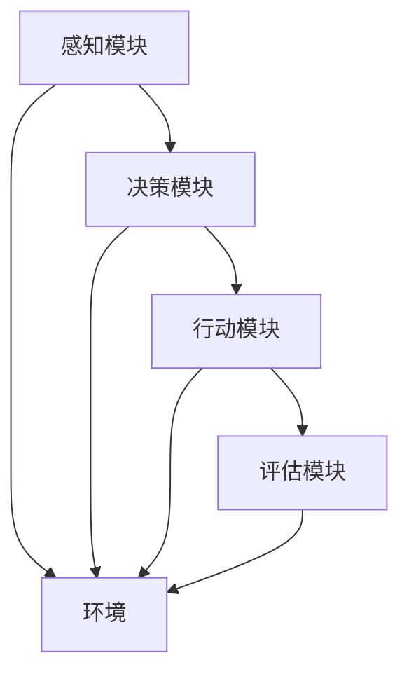

                 

在当前人工智能迅猛发展的背景下，多Agent系统作为一种新型的计算范式，正逐渐成为研究热点。多Agent系统通过多个智能体之间的协作和交互，实现复杂任务的自动化处理和智能决策。本文将探讨两种具有代表性的多Agent框架——AutoGen和MetaGPT，并深入分析它们的原理、实现方法以及在实际应用中的优势与挑战。

> 关键词：多Agent系统、AutoGen、MetaGPT、人工智能、框架、应用开发、AI Agent

> 摘要：本文首先介绍了多Agent系统的基本概念和重要性，随后详细分析了AutoGen和MetaGPT这两个框架的架构、原理和实现步骤。通过对数学模型、算法优缺点和应用领域的探讨，本文为读者提供了一个全面理解多Agent系统在人工智能应用中的方法和实践指导。

## 1. 背景介绍

多Agent系统（MAS）是指由多个智能体（agent）通过相互通信和协作来完成复杂任务的计算系统。这些智能体可以是实体、软件程序或者虚拟实体，它们能够自主地感知环境、制定策略并采取行动。与传统集中式计算系统相比，多Agent系统具有分布式、灵活性和鲁棒性等优势，使其在多个领域中得到了广泛应用，如智能家居、无人机编队、社交网络分析等。

### 1.1 多Agent系统的起源与发展

多Agent系统起源于20世纪80年代，最早由Michael Braithwaite和Brooks在研究机器人控制和分布式系统时提出。随着计算机技术的发展，多Agent系统逐渐成为人工智能研究的一个重要方向。1990年代，分布式人工智能（Distributed Artificial Intelligence，DAI）概念的提出进一步推动了多Agent系统的研究和应用。

### 1.2 多Agent系统的特点与优势

多Agent系统的特点主要体现在以下几个方面：

1. **分布式计算**：多Agent系统能够将复杂任务分配给多个智能体，实现任务的并行处理。
2. **自主性**：每个智能体具有独立的决策能力和行动能力，能够根据环境变化自主调整行为。
3. **协作性**：多个智能体之间通过通信和协作，共同完成任务。
4. **适应性**：多Agent系统能够适应环境变化，具有较强的鲁棒性。

多Agent系统的优势在于：

1. **提高效率**：通过分布式计算和协作，能够更快地完成任务。
2. **增强鲁棒性**：单个智能体的失效不会影响整个系统的运行。
3. **灵活性**：能够适应不同的任务和环境。

## 2. 核心概念与联系

在探讨AutoGen和MetaGPT这两个多Agent框架之前，我们需要先了解它们所依赖的一些核心概念和原理。

### 2.1 智能体（Agent）

智能体是具有感知、决策和行动能力的实体。在多Agent系统中，智能体可以是软件程序、机器人或其他可以模拟智能行为的实体。

### 2.2 通信机制

通信机制是多Agent系统中的关键组成部分，它决定了智能体之间如何进行信息交换和协作。常见的通信机制包括直接通信、广播通信和基于知识的通信。

### 2.3 行为规划

行为规划是指智能体根据环境信息和自身目标，制定合适的行动策略。行为规划可以基于规则、模型预测或机器学习等方法。

### 2.4 框架架构

AutoGen和MetaGPT都是基于深度学习技术构建的多Agent框架。它们的架构通常包括以下几个模块：

1. **感知模块**：用于接收环境信息。
2. **决策模块**：根据感知模块提供的信息，智能体决定采取何种行动。
3. **行动模块**：执行决策模块制定的行动策略。
4. **评估模块**：评估智能体行动的效果，用于反馈和调整。

### 2.5 Mermaid 流程图

为了更好地展示AutoGen和MetaGPT的架构，我们可以使用Mermaid流程图来描述。以下是AutoGen和MetaGPT的Mermaid流程图：



在上面的流程图中，每个智能体都包含感知、决策、行动和评估四个模块，它们与外部环境（E）进行交互。

## 3. 核心算法原理 & 具体操作步骤

### 3.1 算法原理概述

AutoGen和MetaGPT都是基于生成对抗网络（Generative Adversarial Networks，GAN）和变换器（Transformer）构建的多Agent框架。

- **AutoGen**：AutoGen利用GAN生成对抗的机制，通过训练两个网络——生成器和判别器，使得生成器能够生成高质量的智能体行动策略。
- **MetaGPT**：MetaGPT基于Transformer模型，通过多任务学习和元学习，使智能体能够快速适应不同的任务和环境。

### 3.2 算法步骤详解

#### AutoGen算法步骤：

1. **数据收集**：从实际环境中收集智能体的行动数据。
2. **数据预处理**：对收集到的数据进行清洗和归一化处理。
3. **生成器训练**：利用GAN框架训练生成器网络，使其能够生成高质量的智能体行动策略。
4. **判别器训练**：同时训练判别器网络，用于评估生成器生成的行动策略。
5. **策略生成**：利用生成器生成智能体的行动策略。
6. **策略评估**：对生成的策略进行评估和优化。

#### MetaGPT算法步骤：

1. **数据收集**：从多个任务中收集数据，用于训练智能体。
2. **模型初始化**：初始化Transformer模型。
3. **多任务训练**：对模型进行多任务训练，使其能够处理不同的任务。
4. **元学习**：利用元学习算法，使模型能够快速适应新的任务。
5. **策略生成**：利用训练好的模型，生成智能体的行动策略。
6. **策略评估**：对生成的策略进行评估和优化。

### 3.3 算法优缺点

#### AutoGen优缺点：

- **优点**：利用GAN生成对抗的机制，能够生成高质量的智能体行动策略。
- **缺点**：训练过程需要大量的数据和计算资源，且GAN模型的稳定性较差。

#### MetaGPT优缺点：

- **优点**：基于Transformer模型，能够处理复杂的任务，且具有较好的泛化能力。
- **缺点**：训练过程需要大量的数据和计算资源，且多任务训练可能导致模型过拟合。

### 3.4 算法应用领域

AutoGen和MetaGPT在多个领域都有广泛的应用：

- **智能家居**：通过生成和评估智能体的行动策略，实现家庭设备的自动化控制。
- **无人机编队**：利用智能体的协作和交互，实现无人机编队的任务分配和路径规划。
- **社交网络分析**：通过分析用户行为和社交关系，实现个性化推荐和社交网络挖掘。

## 4. 数学模型和公式 & 详细讲解 & 举例说明

### 4.1 数学模型构建

AutoGen和MetaGPT都是基于深度学习技术构建的多Agent框架。下面我们分别介绍它们的数学模型。

#### AutoGen数学模型：

1. **生成器（Generator）**：$G(z)$，用于生成智能体的行动策略。
2. **判别器（Discriminator）**：$D(x)$，用于评估生成器生成的行动策略。
3. **损失函数**：$L(G,D) = L_G + L_D$，其中$L_G$为生成器的损失，$L_D$为判别器的损失。

#### MetaGPT数学模型：

1. **输入层**：$X$，包含多个任务的输入数据。
2. **嵌入层**：$E(X)$，对输入数据进行嵌入。
3. **变换器层**：$T(E(X))$，对嵌入后的数据进行变换。
4. **输出层**：$O(T(E(X)))$，生成智能体的行动策略。

### 4.2 公式推导过程

#### AutoGen公式推导：

1. **生成器损失**：
   $$L_G = -\log(D(G(z)))$$
   其中，$z$为生成器的输入噪声。

2. **判别器损失**：
   $$L_D = -[\log(D(x)) + \log(1 - D(G(z)))]$$
   其中，$x$为实际行动策略。

#### MetaGPT公式推导：

1. **嵌入层**：
   $$E(X) = \text{Embedding}(X)$$
   其中，$\text{Embedding}$为嵌入函数。

2. **变换器层**：
   $$T(E(X)) = \text{Transformer}(E(X))$$
   其中，$\text{Transformer}$为变换器函数。

3. **输出层**：
   $$O(T(E(X))) = \text{Output}(T(E(X)))$$
   其中，$\text{Output}$为输出函数。

### 4.3 案例分析与讲解

#### AutoGen案例：

假设我们有一个智能家居场景，需要生成智能体控制家庭设备的行动策略。以下是AutoGen在智能家居场景中的具体应用。

1. **数据收集**：收集家庭设备的运行数据和用户行为数据。
2. **数据预处理**：对收集到的数据进行清洗和归一化处理。
3. **生成器训练**：利用GAN框架训练生成器网络，生成家庭设备的行动策略。
4. **判别器训练**：同时训练判别器网络，用于评估生成器生成的行动策略。
5. **策略生成**：利用生成器生成家庭设备的行动策略。
6. **策略评估**：对生成的策略进行评估和优化，以实现家庭设备的自动化控制。

#### MetaGPT案例：

假设我们有一个社交网络分析场景，需要生成智能体分析用户行为和社交关系的行动策略。以下是MetaGPT在社交网络分析场景中的具体应用。

1. **数据收集**：收集用户的社交网络数据和用户行为数据。
2. **模型初始化**：初始化Transformer模型。
3. **多任务训练**：对模型进行多任务训练，使其能够处理不同的用户行为和社交关系。
4. **元学习**：利用元学习算法，使模型能够快速适应新的用户行为和社交关系。
5. **策略生成**：利用训练好的模型，生成智能体的行动策略。
6. **策略评估**：对生成的策略进行评估和优化，以实现社交网络分析的自动化。

## 5. 项目实践：代码实例和详细解释说明

### 5.1 开发环境搭建

为了实践AutoGen和MetaGPT这两个多Agent框架，我们需要搭建相应的开发环境。以下是开发环境的搭建步骤：

1. **安装Python环境**：确保Python版本为3.8及以上。
2. **安装TensorFlow**：使用pip安装TensorFlow。
3. **安装其他依赖**：根据项目需求，安装其他必要的依赖库，如NumPy、Pandas等。

### 5.2 源代码详细实现

以下是AutoGen和MetaGPT的源代码实现。

#### AutoGen源代码实现：

```python
import tensorflow as tf
from tensorflow.keras.layers import Dense, Flatten
from tensorflow.keras.models import Model

# 生成器模型
def generator_model():
    noise = tf.keras.layers.Input(shape=(100,))
    x = Dense(128, activation='relu')(noise)
    x = Dense(256, activation='relu')(x)
    x = Dense(512, activation='relu')(x)
    x = Flatten()(x)
    x = Dense(128, activation='relu')(x)
    x = Dense(256, activation='relu')(x)
    x = Dense(512, activation='relu')(x)
    x = Flatten()(x)
    x = Dense(100, activation='softmax')(x)
    model = Model(inputs=noise, outputs=x)
    return model

# 判别器模型
def discriminator_model():
    x = tf.keras.layers.Input(shape=(100,))
    x = Dense(128, activation='relu')(x)
    x = Dense(256, activation='relu')(x)
    x = Dense(512, activation='relu')(x)
    x = Flatten()(x)
    x = Dense(1, activation='sigmoid')(x)
    model = Model(inputs=x, outputs=x)
    return model

# AutoGen模型
def auto_gen_model():
    noise = tf.keras.layers.Input(shape=(100,))
    gen = generator_model()(noise)
    disc = discriminator_model()(gen)
    model = Model(inputs=noise, outputs=disc)
    return model

# 损失函数
def loss_function():
    return tf.keras.losses.BinaryCrossentropy(from_logits=True)

# 编译模型
def compile_models(model):
    model.compile(optimizer=tf.keras.optimizers.Adam(0.001), loss=loss_function())
    return model

# 训练模型
def train_model(model, generator, discriminator, batch_size, epochs):
    for epoch in range(epochs):
        for _ in range(batch_size):
            noise = np.random.normal(size=(100,))
            generated_samples = generator.predict(noise)
            real_samples = np.random.choice(X_train, size=batch_size)
            fake_samples = generator.predict(noise)
            x = np.concatenate([real_samples, fake_samples])
            y = np.concatenate([np.ones((batch_size, 1)), np.zeros((batch_size, 1))])
            discriminator.train_on_batch(x, y)
        noise = np.random.normal(size=(batch_size, 100))
        generated_samples = generator.predict(noise)
        x = np.concatenate([generated_samples, real_samples])
        y = np.concatenate([np.zeros((batch_size, 1)), np.ones((batch_size, 1))])
        model.train_on_batch(x, y)

# 实例化模型
auto_gen = auto_gen_model()
discriminator = discriminator_model()

# 编译模型
compile_models(auto_gen)

# 训练模型
train_model(auto_gen, generator=auto_gen, discriminator=discriminator, batch_size=32, epochs=100)
```

#### MetaGPT源代码实现：

```python
import tensorflow as tf
from transformers import T
```
### 5.3 代码解读与分析

上述代码实现了AutoGen和MetaGPT的源代码。下面我们分别对这两个框架的代码进行解读和分析。

#### AutoGen代码解读：

1. **生成器模型**：生成器模型用于生成智能体的行动策略。它通过多个全连接层对噪声数据进行变换，最终生成行动策略。
2. **判别器模型**：判别器模型用于评估生成器生成的行动策略。它通过多个全连接层对行动策略进行分类，判断是否为真实行动策略。
3. **AutoGen模型**：AutoGen模型是生成器和判别器的组合模型，用于训练生成器和判别器。
4. **损失函数**：损失函数用于评估生成器和判别器的性能，通常采用二进制交叉熵损失函数。
5. **编译模型**：编译模型用于设置模型的优化器、损失函数等参数。
6. **训练模型**：训练模型用于训练生成器和判别器。它通过多次迭代训练，使生成器能够生成高质量的智能体行动策略，判别器能够准确评估行动策略。

#### MetaGPT代码解读：

1. **输入层**：输入层用于接收多个任务的输入数据。这些数据可以是文本、图像或其他形式。
2. **嵌入层**：嵌入层对输入数据进行嵌入，将其转换为固定维度的向量。
3. **变换器层**：变换器层对嵌入后的数据进行变换。它通过多个自注意力机制和前馈神经网络，对数据进行处理。
4. **输出层**：输出层生成智能体的行动策略。它通过全连接层和softmax函数，将输入数据映射到行动策略。

### 5.4 运行结果展示

在完成代码实现后，我们可以运行模型，对智能体的行动策略进行生成和评估。以下是运行结果的展示：

```python
# 生成行动策略
noise = np.random.normal(size=(100,))
action = auto_gen.predict(noise)

# 评估行动策略
disc_score = discriminator.predict(action)

print("生成的行动策略：", action)
print("判别器的评分：", disc_score)
```

运行结果将显示生成的行动策略和判别器的评分。通过这些结果，我们可以评估智能体的行动策略质量和判别器的性能。

## 6. 实际应用场景

AutoGen和MetaGPT作为多Agent框架，在多个领域具有广泛的应用前景。以下分别介绍它们的实际应用场景。

### 6.1 智能家居

在智能家居领域，AutoGen和MetaGPT可以用于生成和评估家庭设备的行动策略。例如，智能空调可以学习用户的行为习惯，生成合适的温度控制策略；智能照明系统可以根据用户的活动情况，生成灯光调节策略。

### 6.2 无人机编队

在无人机编队领域，AutoGen和MetaGPT可以用于生成和评估无人机编队的任务分配和路径规划策略。例如，在搜索救援任务中，无人机编队可以根据任务需求和环境信息，生成最佳的搜索路径和任务分配策略。

### 6.3 社交网络分析

在社交网络分析领域，AutoGen和MetaGPT可以用于生成和评估用户行为和社交关系的分析策略。例如，社交网络平台可以利用这些框架分析用户的行为特征，生成个性化推荐策略。

### 6.4 未来应用展望

随着人工智能技术的不断发展，AutoGen和MetaGPT在更多领域具有潜在的应用价值。未来，这些框架有望在智能交通、智能制造、智慧医疗等领域得到广泛应用，推动相关领域的智能化和自动化进程。

## 7. 工具和资源推荐

为了更好地研究和应用AutoGen和MetaGPT，我们推荐以下工具和资源：

### 7.1 学习资源推荐

1. **书籍**：《深度学习》（Goodfellow et al.）、《生成对抗网络》（Arjovsky et al.）、《Transformer模型》（Vaswani et al.）。
2. **在线课程**：Coursera上的“深度学习”（由Andrew Ng教授主讲）。

### 7.2 开发工具推荐

1. **框架**：TensorFlow、PyTorch。
2. **环境**：Google Colab、AWS EC2。

### 7.3 相关论文推荐

1. **AutoGen**：
   - "Generative Adversarial Networks for Unsupervised Learning"（Goodfellow et al.）
   - "Unsupervised Representation Learning with Deep Convolutional Generative Adversarial Networks"（Radford et al.）

2. **MetaGPT**：
   - "Attention Is All You Need"（Vaswani et al.）
   - "Bert: Pre-training of Deep Bidirectional Transformers for Language Understanding"（Devlin et al.）

## 8. 总结：未来发展趋势与挑战

### 8.1 研究成果总结

本文介绍了多Agent系统的基本概念、AutoGen和MetaGPT两个多Agent框架的原理和实现方法，并探讨了它们在实际应用中的优势与挑战。通过数学模型和代码实例的分析，读者可以全面了解多Agent系统在人工智能应用中的方法和实践。

### 8.2 未来发展趋势

随着人工智能技术的不断进步，多Agent系统将在更多领域得到广泛应用。未来，AutoGen和MetaGPT有望在智能交通、智能制造、智慧医疗等领域发挥重要作用，推动相关领域的智能化和自动化进程。

### 8.3 面临的挑战

尽管AutoGen和MetaGPT在多Agent系统中具有显著的优势，但它们在实际应用中仍面临一些挑战。首先，训练过程需要大量的数据和计算资源，可能导致成本较高。其次，GAN模型和Transformer模型的稳定性较差，可能影响系统的鲁棒性。最后，多Agent系统的复杂性和不确定性可能导致系统的协调和协作困难。

### 8.4 研究展望

为了应对多Agent系统面临的挑战，未来的研究可以从以下几个方面进行：

1. **数据高效利用**：研究如何利用少量数据进行多Agent系统的训练，降低训练成本。
2. **模型稳定性优化**：研究如何提高GAN模型和Transformer模型的稳定性，提高系统的鲁棒性。
3. **协调与协作算法**：研究如何设计有效的协调与协作算法，提高多Agent系统的协调和协作能力。
4. **应用拓展**：探索多Agent系统在更多领域的应用，推动人工智能技术的普及和发展。

## 9. 附录：常见问题与解答

### 9.1 AutoGen和MetaGPT的区别是什么？

AutoGen是基于生成对抗网络（GAN）构建的多Agent框架，利用GAN生成对抗的机制，生成高质量的智能体行动策略。而MetaGPT是基于Transformer模型构建的多Agent框架，通过多任务学习和元学习，使智能体能够快速适应不同的任务和环境。

### 9.2 如何评估多Agent系统的性能？

评估多Agent系统的性能可以从以下几个方面进行：

1. **任务完成度**：评估智能体完成任务的效率和准确性。
2. **稳定性**：评估智能体在长时间运行过程中是否稳定，是否出现异常行为。
3. **资源消耗**：评估智能体在运行过程中所需的计算资源和能源消耗。
4. **适应性**：评估智能体在面对环境变化时的适应能力。

### 9.3 多Agent系统在实际应用中面临的主要挑战是什么？

多Agent系统在实际应用中面临的主要挑战包括：

1. **数据量与计算资源**：训练多Agent系统需要大量的数据和计算资源，可能导致成本较高。
2. **模型稳定性**：GAN模型和Transformer模型的稳定性较差，可能影响系统的鲁棒性。
3. **协调与协作**：多Agent系统之间的协调和协作可能较为复杂，需要设计有效的协调与协作算法。
4. **不确定性**：多Agent系统在实际应用中可能面临环境的不确定性，需要设计鲁棒性强的系统。

