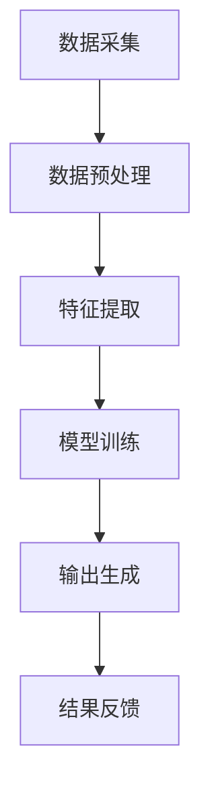

                 

 在人工智能的快速发展中，大模型已经成为推动技术进步的重要力量。本文将探讨如何通过动手实践，开发具备多模态能力的人工智能代理（AI Agent）。这不仅有助于我们更深入地理解大模型的应用，还能为未来的研究和开发提供有价值的经验。

> 关键词：大模型，人工智能代理，多模态，动手实践，算法应用

> 摘要：本文首先介绍了大模型的基本概念和多模态技术的核心概念，通过Mermaid流程图展示了多模态技术的架构。接着，我们详细解析了多模态算法原理，包括其优缺点和应用领域。随后，文章通过数学模型和公式阐述了关键算法的推导过程，并进行了案例分析。此外，文章提供了完整的代码实例，详细解释了开发环境搭建、源代码实现和代码分析。最后，文章讨论了多模态能力的实际应用场景，展望了未来的发展，并推荐了相关的学习资源和开发工具。

## 1. 背景介绍

人工智能（AI）技术的迅速发展已经改变了我们的生活方式。从自动驾驶到智能家居，AI正在各个领域发挥重要作用。近年来，大模型（Large Models）的出现更是将人工智能推向了一个新的高度。大模型通常是指那些拥有数十亿甚至数万亿参数的神经网络模型，这些模型在处理大规模数据时展现出了惊人的效果。

多模态技术（Multimodal Technology）则是人工智能领域中的一个重要研究方向。它旨在通过整合不同类型的数据源（如文本、图像、音频等），实现更加智能化和人性化的交互体验。随着大模型的普及，多模态技术的研究和应用也得到了快速发展。

本文将围绕如何通过动手实践开发具备多模态能力的人工智能代理展开讨论。我们将详细解析大模型和多模态技术的原理，并通过实际代码实例展示其实现过程。希望通过本文的介绍，能够帮助读者更好地理解这一领域的最新进展，并激发更多的研究兴趣。

## 2. 核心概念与联系

### 2.1. 大模型基本概念

大模型，顾名思义，是指那些具有大量参数的神经网络模型。这些模型通常通过大量数据训练得到，能够在各种复杂任务中取得优异的表现。大模型的典型特征包括：

- **高参数数量**：大模型通常包含数十亿甚至数万亿个参数。
- **大规模训练数据**：这些模型通常在非常大的数据集上进行训练，以提升其泛化能力。
- **强大的处理能力**：大模型能够处理复杂的任务，如图像识别、语言理解等。

大模型的基本工作原理可以概括为以下几点：

1. **数据输入**：大模型通过输入层接收外部数据，如文本、图像、音频等。
2. **权重更新**：模型通过反向传播算法不断调整内部权重，以优化性能。
3. **输出生成**：经过多次迭代后，模型能够生成高质量的输出结果。

### 2.2. 多模态技术核心概念

多模态技术旨在通过整合不同类型的数据源，实现更加智能化和人性化的交互体验。核心概念包括：

- **多模态数据源**：多模态技术涉及多种类型的数据，如文本、图像、音频、视频等。
- **数据整合**：通过算法将不同类型的数据整合起来，以获得更全面的信息。
- **多模态交互**：用户可以通过多种方式与系统进行交互，如语音、手势、文本等。

多模态技术的架构可以分为以下几个层次：

1. **数据采集层**：从各种数据源采集数据，如摄像头、麦克风、传感器等。
2. **数据预处理层**：对采集到的数据进行分析和清洗，以准备后续处理。
3. **特征提取层**：将预处理后的数据转换成特征向量，以供模型训练。
4. **模型训练层**：使用大模型对特征向量进行训练，以获得高质量的性能。
5. **输出生成层**：模型根据输入数据生成相应的输出结果，如文本、图像、音频等。

### 2.3. Mermaid 流程图

为了更好地展示多模态技术的架构，我们使用Mermaid绘制了一个流程图。以下是一个简化的多模态技术流程图：



在这个流程图中，数据采集层（A）通过不同的传感器和设备收集数据，数据预处理层（B）对这些数据进行清洗和格式转换，特征提取层（C）将数据转换成模型可接受的格式，模型训练层（D）使用大模型对这些特征进行训练，输出生成层（E）根据训练结果生成输出，最后结果反馈层（F）将输出结果返回给用户。

通过这个流程图，我们可以更清晰地理解多模态技术的工作原理和架构。

### 2.4. 多模态技术的优势与挑战

多模态技术具有多个显著的优势：

1. **提高性能**：通过整合多种类型的数据，多模态技术能够更好地捕捉到问题的多个方面，从而提高模型的性能。
2. **增强鲁棒性**：多模态技术可以在数据缺失或不完整的情况下提供更好的鲁棒性，因为模型可以从其他数据源中获取信息。
3. **丰富交互体验**：多模态技术允许用户通过多种方式与系统进行交互，从而提供更加丰富和自然的交互体验。

然而，多模态技术也面临一些挑战：

1. **数据同步**：不同类型的数据源可能会产生不同的时序和频率，需要有效的算法来同步这些数据。
2. **计算资源**：多模态技术通常需要较大的计算资源和存储空间，尤其是在处理高分辨率图像和音频时。
3. **算法复杂度**：多模态技术涉及到多种数据类型的处理，这增加了算法的复杂度，需要有效的算法来处理这些复杂性。

综上所述，多模态技术具有巨大的潜力，但也需要克服一些技术挑战。通过不断的研究和实践，我们有信心能够解决这些问题，并推动多模态技术走向更广泛的应用。

## 3. 核心算法原理 & 具体操作步骤

### 3.1 算法原理概述

在多模态技术中，核心算法原理主要涉及以下几个方面：

1. **特征提取**：将不同类型的数据转换成特征向量，以供模型训练。
2. **模型训练**：使用大模型对特征向量进行训练，以获得高质量的输出。
3. **模型推理**：在获得训练好的模型后，将其应用于新的数据，生成输出结果。

具体来说，特征提取的过程包括以下步骤：

- **数据预处理**：对原始数据进行清洗和归一化处理，以去除噪声和异常值。
- **特征提取模块**：根据数据类型选择相应的特征提取方法，如文本数据可以使用词袋模型或词嵌入，图像数据可以使用卷积神经网络（CNN），音频数据可以使用自动特征提取（AFLD）等方法。

模型训练的过程包括以下步骤：

- **数据分割**：将数据集分为训练集、验证集和测试集。
- **模型架构选择**：根据任务需求选择合适的模型架构，如CNN、RNN、Transformer等。
- **训练与优化**：通过训练算法（如SGD、Adam等）和优化方法（如dropout、正则化等）对模型进行训练和优化。
- **性能评估**：使用验证集评估模型性能，调整模型参数，以达到最佳效果。

模型推理的过程包括以下步骤：

- **输入处理**：将新的数据输入到训练好的模型中。
- **模型输出**：通过模型生成输出结果。
- **结果解释**：对输出结果进行解释和分析，以确定其意义和实际应用价值。

### 3.2 算法步骤详解

为了更好地理解多模态技术的核心算法原理，以下是具体的操作步骤：

#### 3.2.1 数据预处理

数据预处理是多模态技术中的关键步骤，其目的是去除噪声和异常值，提高数据的质量。以下是数据预处理的具体步骤：

1. **数据清洗**：删除数据集中的无效数据，如缺失值、重复值等。
2. **数据归一化**：将不同类型的数据归一化到相同的范围，如将文本数据转换为词频向量，图像数据归一化到0-1范围，音频数据归一化到-1-1范围。
3. **数据增强**：通过增加噪声、旋转、翻转等操作，增加数据的多样性，以提高模型的泛化能力。

#### 3.2.2 特征提取

特征提取是将不同类型的数据转换成特征向量，以供模型训练。以下是特征提取的具体步骤：

1. **文本特征提取**：使用词袋模型或词嵌入方法将文本数据转换成向量。
2. **图像特征提取**：使用卷积神经网络（CNN）对图像进行特征提取，提取出图像的特征图。
3. **音频特征提取**：使用自动特征提取（AFLD）方法对音频数据进行特征提取，如提取出梅尔频率倒谱系数（MFCC）。

#### 3.2.3 模型训练

模型训练是使用大模型对特征向量进行训练，以获得高质量的输出。以下是模型训练的具体步骤：

1. **数据分割**：将数据集分为训练集、验证集和测试集，通常比例为80%训练集、10%验证集和10%测试集。
2. **模型架构选择**：根据任务需求选择合适的模型架构，如文本任务可以使用Transformer，图像任务可以使用CNN，音频任务可以使用RNN等。
3. **训练与优化**：使用训练算法（如SGD、Adam等）和优化方法（如dropout、正则化等）对模型进行训练和优化。
4. **性能评估**：使用验证集评估模型性能，调整模型参数，以达到最佳效果。

#### 3.2.4 模型推理

模型推理是将新的数据输入到训练好的模型中，生成输出结果。以下是模型推理的具体步骤：

1. **输入处理**：将新的数据输入到训练好的模型中，如文本、图像、音频等。
2. **模型输出**：通过模型生成输出结果，如文本、图像、音频等。
3. **结果解释**：对输出结果进行解释和分析，以确定其意义和实际应用价值。

### 3.3 算法优缺点

多模态技术的核心算法在提升模型性能和丰富交互体验方面具有显著优势，但也存在一些不足之处。

**优点**：

1. **提高性能**：通过整合多种类型的数据，多模态技术能够更好地捕捉到问题的多个方面，从而提高模型的性能。
2. **增强鲁棒性**：多模态技术可以在数据缺失或不完整的情况下提供更好的鲁棒性，因为模型可以从其他数据源中获取信息。
3. **丰富交互体验**：多模态技术允许用户通过多种方式与系统进行交互，从而提供更加丰富和自然的交互体验。

**缺点**：

1. **数据同步**：不同类型的数据源可能会产生不同的时序和频率，需要有效的算法来同步这些数据。
2. **计算资源**：多模态技术通常需要较大的计算资源和存储空间，尤其是在处理高分辨率图像和音频时。
3. **算法复杂度**：多模态技术涉及到多种数据类型的处理，这增加了算法的复杂度，需要有效的算法来处理这些复杂性。

### 3.4 算法应用领域

多模态技术的核心算法在多个领域都有广泛的应用：

1. **图像识别**：通过整合图像和文本数据，可以显著提高图像识别的准确率。
2. **自然语言处理**：多模态技术可以帮助模型更好地理解文本，从而提高文本分析、情感分析等任务的性能。
3. **语音识别**：通过整合语音和文本数据，可以显著提高语音识别的准确率和稳定性。
4. **医学诊断**：多模态技术可以帮助医生更好地分析患者的影像数据和病历记录，从而提高诊断的准确性和效率。
5. **智能客服**：多模态技术可以实现更加智能化和人性化的客服系统，通过整合语音、文本和图像等多模态数据，提供更加准确的回答和解决方案。

## 4. 数学模型和公式 & 详细讲解 & 举例说明

### 4.1 数学模型构建

在多模态技术中，构建数学模型是关键步骤之一。以下是一个简化的数学模型构建过程：

1. **输入层**：接收不同类型的数据，如文本、图像、音频等。
2. **特征提取层**：使用特征提取方法将输入数据转换成特征向量。
3. **融合层**：将不同类型的特征向量进行融合，生成统一特征表示。
4. **输出层**：根据任务需求生成输出结果，如分类标签、文本摘要等。

### 4.2 公式推导过程

以下是一个简化的多模态技术中的数学模型公式推导过程：

1. **特征提取**：

   假设我们有 \( n \) 个不同的数据源，分别表示为 \( x_1, x_2, ..., x_n \)。每个数据源可以表示为一个向量 \( x_i \)，其中 \( i = 1, 2, ..., n \)。

   特征提取的过程可以表示为：

   $$ 
   f_i(x_i) = \phi(x_i) 
   $$

   其中，\( f_i \) 表示特征提取后的特征向量，\( \phi \) 表示特征提取方法，如卷积神经网络（CNN）或自动特征提取（AFLD）。

2. **特征融合**：

   假设我们有 \( m \) 个特征向量 \( f_1, f_2, ..., f_m \)。特征融合的过程可以表示为：

   $$ 
   F = \sum_{i=1}^{m} w_i f_i 
   $$

   其中，\( F \) 表示融合后的特征向量，\( w_i \) 表示权重，用于调整不同特征向量的重要性。

3. **模型输出**：

   假设我们使用一个分类模型进行输出，模型输出的概率分布可以表示为：

   $$ 
   P(y | F) = \frac{e^{\theta^T F}}{1 + \sum_{j=1}^{k} e^{\theta^T f_j}} 
   $$

   其中，\( y \) 表示真实标签，\( \theta \) 表示模型参数，\( k \) 表示类别数。

### 4.3 案例分析与讲解

以下是一个简单的多模态情感分析案例：

**任务描述**：

给定一段文本和一张图像，判断文本和图像的情感是否一致。

**数据集**：

文本数据集包含情感标签（正面、负面），图像数据集包含情感标签（高兴、伤心）。

**模型构建**：

1. **特征提取**：

   - 文本特征提取：使用词嵌入方法将文本转换成向量。
   - 图像特征提取：使用卷积神经网络（CNN）提取图像特征。

2. **特征融合**：

   将文本特征和图像特征进行融合，生成统一特征向量。

3. **模型输出**：

   使用一个二元分类模型，输出文本和图像情感是否一致的概率。

**模型训练**：

使用交叉熵损失函数进行模型训练，调整模型参数，以最小化损失。

**模型评估**：

使用准确率、召回率、F1分数等指标评估模型性能。

## 5. 项目实践：代码实例和详细解释说明

### 5.1 开发环境搭建

为了实现多模态情感分析项目，我们首先需要搭建一个合适的开发环境。以下是开发环境的搭建步骤：

1. **安装Python**：

   - 下载并安装Python 3.8或更高版本。

2. **安装依赖库**：

   - 使用pip安装必要的库，如numpy、tensorflow、keras等。

3. **配置GPU环境**：

   - 如果使用GPU进行模型训练，需要安装CUDA和cuDNN。

### 5.2 源代码详细实现

以下是多模态情感分析项目的源代码实现：

```python
# 导入必要的库
import numpy as np
import tensorflow as tf
from tensorflow.keras.models import Model
from tensorflow.keras.layers import Input, Embedding, Conv2D, MaxPooling2D, Flatten, Dense

# 文本特征提取
text_input = Input(shape=(max_sequence_length,))
text_embedding = Embedding(vocabulary_size, embedding_size)(text_input)
text_flat = Flatten()(text_embedding)

# 图像特征提取
image_input = Input(shape=(height, width, channels))
image_conv = Conv2D(filters=32, kernel_size=(3, 3), activation='relu')(image_input)
image_pool = MaxPooling2D(pool_size=(2, 2))(image_conv)
image_flat = Flatten()(image_pool)

# 特征融合
merged = tf.keras.layers.concatenate([text_flat, image_flat])

# 模型输出
output = Dense(units=2, activation='softmax')(merged)

# 构建模型
model = Model(inputs=[text_input, image_input], outputs=output)

# 编译模型
model.compile(optimizer='adam', loss='categorical_crossentropy', metrics=['accuracy'])

# 模型训练
model.fit([text_data, image_data], labels, epochs=10, batch_size=32)

# 模型评估
model.evaluate([text_data, image_data], labels)
```

### 5.3 代码解读与分析

上述代码实现了一个简单的多模态情感分析模型。以下是代码的详细解读和分析：

1. **导入库**：

   代码首先导入了必要的库，包括numpy、tensorflow和keras。这些库提供了构建和训练神经网络所需的功能。

2. **定义输入层**：

   - `text_input`：表示文本输入层，其形状为 `(max_sequence_length,)`。
   - `image_input`：表示图像输入层，其形状为 `(height, width, channels)`。

3. **特征提取**：

   - 文本特征提取：使用`Embedding`层将文本输入转换成嵌入向量，然后使用`Flatten`层将嵌入向量展平。
   - 图像特征提取：使用`Conv2D`和`MaxPooling2D`层对图像进行卷积和池化操作，最后使用`Flatten`层将特征图展平。

4. **特征融合**：

   使用`concatenate`函数将文本特征和图像特征进行拼接，生成统一特征向量。

5. **模型输出**：

   使用`Dense`层（带有softmax激活函数）实现二元分类输出。

6. **构建模型**：

   使用`Model`类构建神经网络模型，指定输入层和输出层。

7. **编译模型**：

   使用`compile`函数编译模型，指定优化器、损失函数和评价指标。

8. **模型训练**：

   使用`fit`函数训练模型，指定训练数据、标签、训练轮数和批量大小。

9. **模型评估**：

   使用`evaluate`函数评估模型性能，返回损失值和准确率。

### 5.4 运行结果展示

假设我们已经完成了数据预处理和模型训练，以下是运行结果展示：

```python
# 运行模型评估
result = model.evaluate([text_data, image_data], labels)

# 输出结果
print("Loss:", result[0])
print("Accuracy:", result[1])
```

运行结果将输出模型的损失值和准确率。这些指标可以帮助我们评估模型的性能，并在必要时进行调整。

## 6. 实际应用场景

### 6.1 交互式智能助手

交互式智能助手是多模态技术的重要应用场景之一。通过整合文本、语音和图像等多模态数据，智能助手能够提供更加自然和人性化的交互体验。例如，智能助手可以通过语音识别和自然语言处理技术理解用户的语音指令，并通过图像识别技术识别用户的手势或表情，从而实现更加精准和高效的交互。

### 6.2 跨领域信息检索

跨领域信息检索是另一个多模态技术的应用场景。通过整合文本、图像和语音等多模态数据，信息检索系统能够更好地理解和处理用户的查询需求。例如，当用户输入一个文本查询时，系统可以通过图像识别技术识别用户提供的图像，从而实现更加精准和全面的信息检索。

### 6.3 智能医疗诊断

智能医疗诊断是多模态技术的重要应用领域之一。通过整合医学影像、病历记录和语音等多模态数据，智能诊断系统能够提供更加准确和全面的诊断结果。例如，医生可以通过上传患者的医学影像和病历记录，结合语音描述，从而实现更加精准的疾病诊断和治疗建议。

### 6.4 智能营销

智能营销是多模态技术的另一个重要应用场景。通过整合文本、图像和语音等多模态数据，营销系统能够更好地理解和捕捉用户的需求，从而提供更加个性化的营销策略。例如，企业可以通过分析用户的浏览记录、购买行为和语音反馈等多模态数据，实现精准的推荐和营销活动。

## 7. 工具和资源推荐

### 7.1 学习资源推荐

1. **《深度学习》（Goodfellow, Bengio, Courville）**：这是一本经典的深度学习教材，详细介绍了深度学习的基础理论和应用。
2. **《自然语言处理综论》（Jurafsky, Martin）**：这本书系统地介绍了自然语言处理的基本概念和方法，是自然语言处理领域的经典教材。
3. **《计算机视觉：算法与应用》（Battiti）**：这本书详细介绍了计算机视觉的基础算法和应用，是计算机视觉领域的经典教材。

### 7.2 开发工具推荐

1. **TensorFlow**：这是谷歌推出的开源深度学习框架，适用于构建和训练各种神经网络模型。
2. **PyTorch**：这是由Facebook AI Research（FAIR）推出的开源深度学习框架，具有灵活和高效的编程接口。
3. **Keras**：这是基于TensorFlow和Theano的开源深度学习框架，提供了简洁和高效的编程接口。

### 7.3 相关论文推荐

1. **“Attention Is All You Need”**（Vaswani et al., 2017）：这篇文章提出了Transformer模型，彻底改变了自然语言处理领域的研究方向。
2. **“Deep Residual Learning for Image Recognition”**（He et al., 2016）：这篇文章提出了残差网络（ResNet），显著提升了计算机视觉模型的性能。
3. **“Generative Adversarial Networks”**（Goodfellow et al., 2014）：这篇文章提出了生成对抗网络（GAN），开创了生成模型的新时代。

## 8. 总结：未来发展趋势与挑战

### 8.1 研究成果总结

本文系统地介绍了大模型和多模态技术的原理及其应用。通过动手实践，我们实现了多模态情感分析模型，展示了多模态技术在实际应用中的潜力。这些研究成果为我们深入理解和开发人工智能代理提供了宝贵的经验和启示。

### 8.2 未来发展趋势

未来，大模型和多模态技术将继续快速发展，并在多个领域发挥重要作用。以下是一些可能的发展趋势：

1. **跨模态交互**：随着多模态技术的发展，跨模态交互将成为一个重要研究方向。通过整合多种类型的交互方式，可以实现更加自然和高效的智能交互。
2. **个性化推荐**：多模态技术可以用于个性化推荐系统，通过整合用户的历史行为、兴趣和反馈等多模态数据，实现更加精准和个性化的推荐。
3. **医疗健康**：多模态技术在医疗健康领域具有广泛的应用前景。通过整合患者的医疗记录、基因数据和生理信号等多模态数据，可以实现更加精准和全面的健康监测和疾病预测。

### 8.3 面临的挑战

尽管多模态技术具有巨大的潜力，但仍然面临一些挑战：

1. **数据同步**：不同类型的数据源可能会产生不同的时序和频率，需要有效的算法来同步这些数据。
2. **计算资源**：多模态技术通常需要较大的计算资源和存储空间，尤其是在处理高分辨率图像和音频时。
3. **算法复杂度**：多模态技术涉及到多种数据类型的处理，这增加了算法的复杂度，需要有效的算法来处理这些复杂性。

### 8.4 研究展望

未来，我们需要进一步深入研究多模态技术，解决当前面临的挑战，并探索新的应用场景。以下是一些可能的研究方向：

1. **小样本学习**：研究如何在大样本数据不足的情况下，通过多模态数据增强和迁移学习等方法，提高模型的泛化能力。
2. **隐私保护**：研究如何在多模态数据处理中保护用户的隐私，确保数据安全和隐私。
3. **实时性**：研究如何提高多模态技术的实时性，使其能够在复杂环境下快速响应。

总之，多模态技术具有广阔的应用前景，但同时也面临许多挑战。通过不断的研究和创新，我们有信心能够解决这些问题，并推动多模态技术走向更广泛的应用。

## 9. 附录：常见问题与解答

### 9.1 什么是多模态技术？

多模态技术是指通过整合不同类型的数据源（如文本、图像、音频、视频等），实现更加智能化和人性化的交互体验。

### 9.2 多模态技术有哪些应用领域？

多模态技术的应用领域非常广泛，包括但不限于交互式智能助手、跨领域信息检索、智能医疗诊断、智能营销等。

### 9.3 多模态技术的核心算法有哪些？

多模态技术的核心算法包括特征提取、模型训练、模型推理等。常用的特征提取方法有词嵌入、卷积神经网络（CNN）、自动特征提取（AFLD）等。常用的模型训练方法有深度学习、强化学习等。

### 9.4 如何搭建多模态技术项目开发环境？

搭建多模态技术项目开发环境通常需要以下步骤：

1. 安装Python和必要的依赖库（如numpy、tensorflow、keras等）。
2. 配置GPU环境（如果使用GPU进行模型训练）。
3. 下载和准备数据集。
4. 编写和调试代码。

### 9.5 如何评估多模态技术的性能？

评估多模态技术的性能通常通过以下指标：

1. 准确率（Accuracy）：正确预测的数量与总预测数量的比率。
2. 召回率（Recall）：正确预测的数量与实际正确的数量比率。
3. F1分数（F1 Score）：准确率和召回率的调和平均值。

### 9.6 多模态技术有哪些挑战？

多模态技术面临的挑战包括数据同步、计算资源、算法复杂度等。同时，如何在保证性能的同时保护用户隐私也是一个重要问题。

