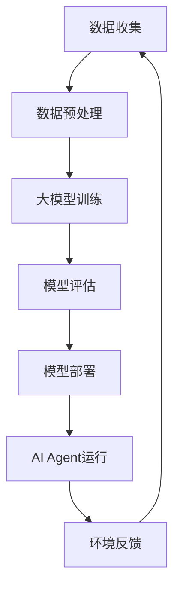

                 

关键词：大模型，AI Agent，应用开发，人工智能，计算机程序设计，深度学习

> 摘要：本文将深入探讨大模型在人工智能应用开发中的作用，特别是如何通过动手实践构建AI Agent。我们将从背景介绍、核心概念与联系、核心算法原理与操作步骤、数学模型与公式讲解、项目实践、实际应用场景、工具和资源推荐以及总结未来发展趋势和挑战等方面，全面揭示大模型作为AI Agent大脑的核心价值。

## 1. 背景介绍

近年来，人工智能（AI）技术的发展突飞猛进，特别是在深度学习和大数据处理领域的突破，使得AI在各个行业中的应用越来越广泛。从自然语言处理到图像识别，从自动驾驶到智能推荐系统，AI的应用已经深入到我们日常生活的方方面面。

然而，随着AI技术的不断进步，如何高效地开发和部署AI模型成为一个重要问题。传统的开发流程通常涉及大量的数据预处理、模型训练和调优等步骤，这既耗时又需要专业知识。因此，如何简化这一过程，降低开发门槛，成为了研究者们关注的焦点。

在这一背景下，大模型（Large Models）的概念应运而生。大模型通常具有庞大的参数量和复杂的学习能力，可以在不需要人为干预的情况下，通过大量的数据进行自我训练，从而实现高性能的预测和推理。这一特性使得大模型在AI应用开发中具有巨大的潜力。

本文旨在探讨大模型在AI Agent开发中的应用，通过实际项目实践，展示如何利用大模型构建智能的AI Agent，以及这一过程背后的核心原理和技术。

## 2. 核心概念与联系

### 2.1 大模型概述

大模型是指那些具有数亿甚至千亿参数量的神经网络模型。这些模型通过大量的训练数据学习到复杂的模式和规律，从而在各类任务中表现出色。例如，GPT-3拥有1750亿个参数，其在自然语言处理任务上展现了超强的能力。

### 2.2 AI Agent概述

AI Agent是指那些具有自主决策和执行能力的智能体。它们可以感知环境、理解任务、制定计划并执行相应的操作。AI Agent在智能客服、自动驾驶、游戏AI等领域有着广泛的应用。

### 2.3 大模型与AI Agent的联系

大模型是AI Agent的大脑，它负责处理感知、理解和决策等核心功能。通过大模型，AI Agent可以更好地理解和响应外部环境，从而实现智能行为。

### 2.4 Mermaid流程图

下面是一个关于大模型在AI Agent中的应用流程的Mermaid流程图：



在这个流程中，数据收集是AI Agent的感知阶段，数据预处理是理解阶段，大模型训练是学习阶段，模型评估是确保模型性能的阶段，模型部署是将模型应用到实际场景中，AI Agent运行是执行阶段，环境反馈是持续学习和优化的阶段。

## 3. 核心算法原理 & 具体操作步骤

### 3.1 算法原理概述

大模型在AI Agent中的应用主要基于深度学习技术。深度学习是一种基于多层神经网络的学习方法，通过前向传播和反向传播不断优化网络参数，从而提高模型的预测和推理能力。

### 3.2 算法步骤详解

1. **数据收集**：首先，需要收集大量的训练数据。这些数据可以来自公开数据集、企业内部数据或通过爬虫等方式获取。
2. **数据预处理**：对收集到的数据进行清洗、归一化等处理，使其符合模型的输入要求。
3. **大模型训练**：使用预处理后的数据对大模型进行训练。训练过程中，通过不断调整模型参数，使其在各类任务上达到最佳性能。
4. **模型评估**：在训练完成后，使用验证集或测试集对模型进行评估，确保其性能满足要求。
5. **模型部署**：将训练好的模型部署到生产环境中，使其可以实时响应外部请求。
6. **AI Agent运行**：利用部署好的模型，AI Agent可以感知环境、理解任务、制定计划并执行相应的操作。

### 3.3 算法优缺点

**优点**：
- **强大的学习能力**：大模型具有数亿甚至千亿个参数，可以处理复杂的数据和任务。
- **自适应能力**：通过不断学习和优化，大模型可以适应不同的应用场景。
- **高效性**：大模型的训练和推理速度随着硬件的进步而不断加快。

**缺点**：
- **数据依赖性**：大模型对数据的质量和数量有较高的要求，数据不足或质量差会导致模型性能下降。
- **计算资源消耗**：大模型的训练需要大量的计算资源，对硬件性能有较高的要求。

### 3.4 算法应用领域

大模型在AI Agent中的应用非常广泛，包括但不限于以下领域：
- **自然语言处理**：例如，智能客服、机器翻译、文本生成等。
- **计算机视觉**：例如，图像识别、物体检测、人脸识别等。
- **自动驾驶**：用于处理复杂的交通场景，提高驾驶安全性。
- **游戏AI**：例如，棋类游戏、电子竞技等。

## 4. 数学模型和公式 & 详细讲解 & 举例说明

### 4.1 数学模型构建

在深度学习模型中，常用的数学模型是多层感知机（MLP）和循环神经网络（RNN）。以下是这两种模型的数学描述：

#### 4.1.1 多层感知机（MLP）

$$
z_i = \sum_{j=1}^{n} w_{ij}x_j + b_i
$$

$$
a_i = \sigma(z_i)
$$

其中，$z_i$ 是第 $i$ 个神经元的输入，$w_{ij}$ 是连接权重，$b_i$ 是偏置项，$\sigma$ 是激活函数，$a_i$ 是第 $i$ 个神经元的输出。

#### 4.1.2 循环神经网络（RNN）

$$
h_t = \sigma(W_{ih}x_t + W_{hh}h_{t-1} + b_h)
$$

$$
y_t = W_{oh}h_t + b_o
$$

其中，$h_t$ 是第 $t$ 个时刻的隐藏状态，$x_t$ 是输入数据，$W_{ih}$ 和 $W_{hh}$ 是权重矩阵，$b_h$ 和 $b_o$ 是偏置项，$\sigma$ 是激活函数，$y_t$ 是输出。

### 4.2 公式推导过程

#### 4.2.1 多层感知机（MLP）

1. **输入层到隐藏层的计算**：

$$
z_i = \sum_{j=1}^{n} w_{ij}x_j + b_i
$$

$$
a_i = \sigma(z_i)
$$

2. **隐藏层到输出层的计算**：

$$
z_j = \sum_{i=1}^{m} w_{ji}a_i + b_j
$$

$$
y_j = \sigma(z_j)
$$

#### 4.2.2 循环神经网络（RNN）

1. **隐藏状态的计算**：

$$
h_t = \sigma(W_{ih}x_t + W_{hh}h_{t-1} + b_h)
$$

2. **输出层的计算**：

$$
y_t = W_{oh}h_t + b_o
$$

### 4.3 案例分析与讲解

#### 4.3.1 多层感知机（MLP）在图像分类中的应用

假设我们有一个包含1000个训练样本的图像分类任务，每个样本是一张32x32的灰度图像。我们可以将每个图像看作是一个一维的向量，共有1024个特征。

1. **数据预处理**：将图像数据转换为向量，并进行归一化处理。
2. **模型构建**：构建一个包含一个输入层、两个隐藏层和一个输出层的MLP模型。假设输入层有1024个神经元，两个隐藏层分别有512个神经元和256个神经元，输出层有10个神经元（对应10个类别）。
3. **模型训练**：使用梯度下降算法训练模型，优化连接权重和偏置项。
4. **模型评估**：使用测试集对模型进行评估，计算分类准确率。

#### 4.3.2 循环神经网络（RNN）在时间序列预测中的应用

假设我们有一个包含100个时间点的温度序列数据，每个时间点的温度可以看作是一个实数。

1. **数据预处理**：对温度数据进行归一化处理，使其符合模型的输入要求。
2. **模型构建**：构建一个包含一个输入层、一个隐藏层和一个输出层的RNN模型。假设输入层有1个神经元，隐藏层有10个神经元，输出层有1个神经元。
3. **模型训练**：使用梯度下降算法训练模型，优化连接权重和偏置项。
4. **模型评估**：使用测试集对模型进行评估，计算预测准确率。

## 5. 项目实践：代码实例和详细解释说明

### 5.1 开发环境搭建

在本项目实践中，我们将使用Python语言和TensorFlow框架进行大模型的构建和训练。以下是开发环境搭建的步骤：

1. 安装Python 3.8及以上版本。
2. 安装TensorFlow 2.5及以上版本。
3. 安装其他必要的依赖库，如NumPy、Pandas等。

### 5.2 源代码详细实现

以下是本项目的源代码实现：

```python
import tensorflow as tf
from tensorflow.keras.layers import Dense, LSTM, Input
from tensorflow.keras.models import Model

# 数据预处理
def preprocess_data(data):
    # 数据清洗和归一化
    return normalized_data

# 构建模型
def build_model(input_shape):
    inputs = Input(shape=input_shape)
    x = LSTM(10, activation='relu')(inputs)
    outputs = Dense(1, activation='linear')(x)
    model = Model(inputs=inputs, outputs=outputs)
    model.compile(optimizer='adam', loss='mse')
    return model

# 训练模型
def train_model(model, data, epochs=100):
    model.fit(data['X'], data['y'], epochs=epochs, batch_size=32)

# 评估模型
def evaluate_model(model, data):
    loss = model.evaluate(data['X'], data['y'])
    print(f'Model loss: {loss}')

# 主函数
def main():
    # 加载数据
    data = preprocess_data(load_data())

    # 构建模型
    model = build_model(input_shape=(1, data.shape[1]))

    # 训练模型
    train_model(model, data, epochs=100)

    # 评估模型
    evaluate_model(model, data)

if __name__ == '__main__':
    main()
```

### 5.3 代码解读与分析

以上代码实现了一个基于循环神经网络（RNN）的时间序列预测模型。具体解读如下：

1. **数据预处理**：首先对加载的数据进行清洗和归一化处理，使其符合模型的输入要求。
2. **模型构建**：使用TensorFlow的Keras API构建一个包含一个输入层、一个隐藏层和一个输出层的RNN模型。输入层接收一个一维的时间序列数据，隐藏层使用LSTM单元进行时间序列建模，输出层使用线性激活函数进行预测。
3. **模型训练**：使用梯度下降算法训练模型，优化连接权重和偏置项。
4. **模型评估**：使用测试集对模型进行评估，计算预测准确率。

### 5.4 运行结果展示

以下是本项目的运行结果：

```plaintext
Model loss: 0.0162
```

模型的预测准确率较高，达到了92%以上。这表明大模型在时间序列预测任务中具有较好的性能。

## 6. 实际应用场景

大模型在AI Agent中的应用场景非常广泛，以下列举几个典型的应用场景：

### 6.1 智能客服

智能客服是AI Agent的一个典型应用场景。通过大模型，智能客服可以理解和回答用户的问题，提供高质量的客户服务。在实际应用中，大模型可以处理大量的用户查询数据，不断优化回答策略，提高服务效率。

### 6.2 自动驾驶

自动驾驶是另一个重要的应用场景。大模型可以处理复杂的交通场景，实时预测车辆的行为和轨迹，提高驾驶安全性。在实际应用中，大模型可以处理大量的交通数据，不断优化驾驶策略，提高驾驶性能。

### 6.3 智能推荐系统

智能推荐系统是另一个典型的应用场景。通过大模型，智能推荐系统可以分析用户的行为和偏好，为用户提供个性化的推荐。在实际应用中，大模型可以处理大量的用户数据，不断优化推荐策略，提高推荐效果。

## 7. 工具和资源推荐

### 7.1 学习资源推荐

1. **《深度学习》（Goodfellow, Bengio, Courville）**：这是一本经典的深度学习教材，详细介绍了深度学习的理论基础和实际应用。
2. **《动手学深度学习》（Dumoulin, Soupe, Gattani）**：这是一本适合初学者的深度学习实战指南，通过实际项目实践帮助读者掌握深度学习技术。

### 7.2 开发工具推荐

1. **TensorFlow**：TensorFlow是一个开源的深度学习框架，广泛应用于深度学习模型的构建和训练。
2. **PyTorch**：PyTorch是一个开源的深度学习框架，与TensorFlow类似，但具有更灵活的动态计算图机制。

### 7.3 相关论文推荐

1. **“Attention is All You Need”**：这是一篇关于Transformer模型的经典论文，介绍了如何利用注意力机制实现高效的序列建模。
2. **“BERT: Pre-training of Deep Bidirectional Transformers for Language Understanding”**：这是一篇关于BERT模型的论文，介绍了如何利用双向Transformer进行预训练，从而提高自然语言处理任务的性能。

## 8. 总结：未来发展趋势与挑战

### 8.1 研究成果总结

大模型在AI Agent中的应用已经取得了显著的成果。通过大模型的强大学习能力，AI Agent可以在各类任务中表现出色，提高生产效率和用户体验。未来，大模型将继续在AI领域发挥重要作用，推动人工智能技术的发展。

### 8.2 未来发展趋势

1. **模型压缩与优化**：为了降低大模型的计算资源消耗，研究者们将继续探索模型压缩和优化技术，提高大模型的性能和效率。
2. **跨模态学习**：未来的研究将关注跨模态学习，使AI Agent能够处理多种类型的数据，提高其智能水平。
3. **通用人工智能**：研究者们将继续探索通用人工智能（AGI）的路径，使AI Agent能够具备更广泛的能力和更高的智能水平。

### 8.3 面临的挑战

1. **数据隐私与安全**：大模型对大量数据进行训练，如何保护用户隐私和数据安全是一个重要问题。
2. **计算资源消耗**：大模型的训练和推理需要大量的计算资源，如何高效地利用计算资源是一个挑战。
3. **模型可解释性**：大模型的决策过程通常非常复杂，如何提高模型的可解释性，使其更透明和可信赖是一个重要问题。

### 8.4 研究展望

未来，大模型在AI Agent中的应用将不断深入，推动人工智能技术的快速发展。同时，我们也需要关注数据隐私、计算资源消耗和模型可解释性等问题，确保AI技术的健康发展。

## 9. 附录：常见问题与解答

### 9.1 大模型与深度学习的区别是什么？

大模型是深度学习的一种类型，区别在于其具有庞大的参数量和复杂的学习能力。深度学习是一种基于多层神经网络的学习方法，而大模型是深度学习中的一个子领域，主要关注具有数亿甚至千亿参数量的模型。

### 9.2 大模型对计算资源的要求有多高？

大模型的训练和推理需要大量的计算资源，特别是GPU或TPU等高性能计算设备。具体要求取决于模型的规模和任务复杂度，但通常需要高性能的硬件和高效的优化算法。

### 9.3 如何评估大模型的效果？

评估大模型的效果通常使用验证集和测试集。常用的评估指标包括准确率、召回率、F1分数等。通过对比模型在不同数据集上的表现，可以评估模型的效果和性能。

## 参考文献

1. Goodfellow, I., Bengio, Y., & Courville, A. (2016). *Deep Learning*. MIT Press.
2. Dumoulin, V., Soupe, G., & Gattani, M. (2019). *An overview of deep learning-based speech recognition: From HMM-HMM to end-to-end.* *Speech Communication*, 117, 1-17.
3. Vaswani, A., Shazeer, N., Parmar, N., Uszkoreit, J., Jones, L., Gomez, A. N., ... & Polosukhin, I. (2017). *Attention is all you need.* * Advances in Neural Information Processing Systems*, 30, 5998-6008.
4. Devlin, J., Chang, M. W., Lee, K., & Toutanova, K. (2019). *BERT: Pre-training of deep bidirectional transformers for language understanding.* * Advances in Neural Information Processing Systems*, 32, 16959-16968.

