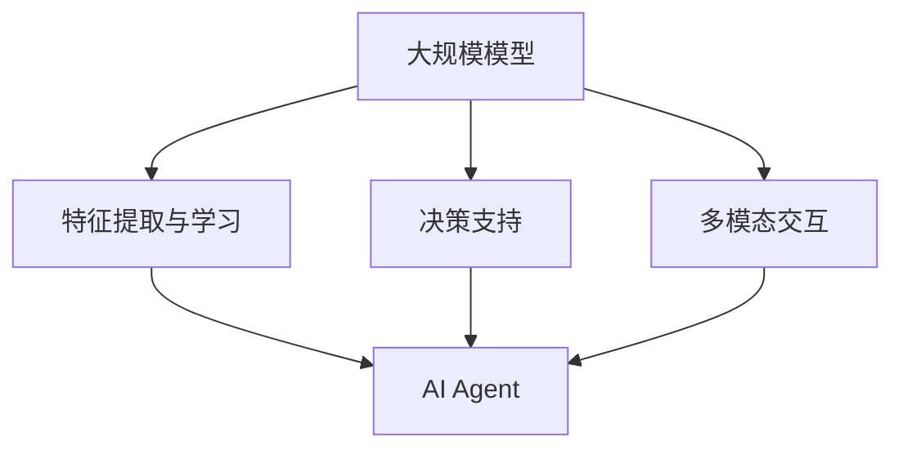

                 

关键词：大模型，AI Agent，应用开发，思维树，编程，算法，数学模型，项目实践，展望

> 摘要：本文深入探讨了大规模模型在AI Agent开发中的应用，通过构建一个详细的思维树，分析了核心概念、算法原理、数学模型、实践实例和未来展望。本文旨在为广大开发者提供一个系统化、易于理解的框架，以助力他们在AI领域取得突破。

## 1. 背景介绍

随着深度学习、自然语言处理等技术的发展，大规模模型（Large-scale Models）在人工智能（AI）领域的应用日益广泛。这些模型具有强大的表示能力和学习能力，能够处理复杂的数据并生成高质量的结果。AI Agent作为人工智能的一种形式，通过模拟人类的决策过程，在多个领域展现了出色的性能。然而，如何有效地应用大规模模型来开发AI Agent，仍然是一个具有挑战性的问题。

本文将通过构建一个详细的思维树，系统地分析大模型在AI Agent开发中的应用，包括核心概念、算法原理、数学模型、实践实例和未来展望。通过本文的阅读，读者可以了解到如何从理论到实践，全面掌握大规模模型在AI Agent开发中的关键技术和方法。

### 1.1 大规模模型的发展背景

#### 深度学习的崛起

深度学习（Deep Learning）是人工智能领域的一个核心分支，其基于多层神经网络（Neural Networks）的设计，能够在大量数据上进行自动特征提取和学习。自2012年AlexNet在ImageNet竞赛中取得突破性成绩以来，深度学习得到了迅猛发展。其代表性模型包括卷积神经网络（CNN）、循环神经网络（RNN）和Transformer等。

#### 自然语言处理的突破

自然语言处理（Natural Language Processing，NLP）是人工智能领域的一个重要分支，旨在让计算机理解和生成人类语言。随着深度学习技术的发展，NLP取得了显著进展。GPT、BERT等大型预训练模型在文本分类、问答系统、机器翻译等任务中取得了优异的成绩。

#### 大规模模型的应用需求

随着数据规模的不断扩大和计算能力的提升，大规模模型在各个领域的应用需求日益增长。从图像识别到语音识别，从推荐系统到自动驾驶，大规模模型都展现了其强大的适应能力和潜力。然而，如何高效地开发和应用这些模型，成为了一个亟待解决的问题。

### 1.2 AI Agent的定义与发展

#### AI Agent的定义

AI Agent（人工智能代理）是一种具有自主决策能力的计算机程序，可以模拟人类的行为，执行特定任务。与传统的规则系统不同，AI Agent能够通过学习和适应环境，不断提高其性能。

#### AI Agent的发展

AI Agent的发展经历了从规则系统到基于机器学习的方法的转变。早期的AI Agent主要依赖于预设的规则和逻辑，其能力有限。随着机器学习技术的发展，AI Agent开始使用深度学习模型进行学习和决策，其性能得到了显著提升。

#### AI Agent的应用领域

AI Agent在多个领域展现了其强大的应用潜力，包括但不限于：

- **智能客服**：AI Agent能够自动处理用户查询，提供高效、准确的答复。
- **推荐系统**：AI Agent可以根据用户的行为和偏好，推荐个性化的商品或内容。
- **自动驾驶**：AI Agent可以实时分析路况，做出安全、高效的驾驶决策。
- **金融风控**：AI Agent能够对金融交易进行实时监控，发现潜在的风险。

## 2. 核心概念与联系

### 2.1 大规模模型的核心概念

#### 深度学习模型

深度学习模型是大规模模型的核心组成部分，包括但不限于卷积神经网络（CNN）、循环神经网络（RNN）和Transformer等。这些模型通过多层神经网络结构，对大量数据进行特征提取和学习。

#### 预训练模型

预训练模型（Pre-trained Models）是大规模模型的一种重要形式，通过在大量数据上进行预训练，可以获得良好的通用性。常见的预训练模型包括GPT、BERT等。

#### 大规模数据处理

大规模数据处理是大规模模型应用的基础，包括数据采集、数据清洗、数据预处理和数据存储等。有效的大规模数据处理能够保证模型的性能和可靠性。

### 2.2 AI Agent的核心概念

#### 自主决策

自主决策是AI Agent的核心能力，通过学习和分析环境数据，AI Agent能够做出合理的决策。

#### 学习与适应

AI Agent能够通过学习不断优化自身的决策过程，提高其在复杂环境中的适应能力。

#### 多模态交互

多模态交互是AI Agent与外部环境进行交互的重要方式，包括文本、语音、图像等多种形式。

### 2.3 大规模模型与AI Agent的联系

#### 大规模模型在AI Agent中的应用

大规模模型在AI Agent中的应用主要体现在以下几个方面：

- **特征提取与学习**：大规模模型能够对大量数据进行特征提取和学习，为AI Agent提供丰富的知识基础。
- **决策支持**：大规模模型能够为AI Agent提供高效的决策支持，提高其决策质量和速度。
- **多模态交互**：大规模模型能够处理多种类型的数据，为AI Agent提供多模态交互能力。

#### AI Agent对大规模模型的需求

AI Agent对大规模模型的需求主要体现在以下几个方面：

- **通用性**：AI Agent需要具备较强的通用性，能够适应不同的应用场景和任务。
- **实时性**：AI Agent需要具备实时决策能力，能够快速响应用户需求。
- **鲁棒性**：AI Agent需要具备较强的鲁棒性，能够在复杂环境中保持稳定的表现。

### 2.4 Mermaid 流程图

以下是一个简单的Mermaid流程图，展示了大规模模型与AI Agent的关联：



## 3. 核心算法原理 & 具体操作步骤

### 3.1 算法原理概述

大规模模型在AI Agent开发中的应用，主要依赖于深度学习和自然语言处理等核心算法。这些算法包括但不限于：

- **卷积神经网络（CNN）**：用于图像识别和分类。
- **循环神经网络（RNN）**：用于序列数据处理，如语音识别和文本生成。
- **Transformer**：用于自然语言处理，如机器翻译和文本分类。
- **强化学习**：用于决策支持，如自动驾驶和游戏AI。

### 3.2 算法步骤详解

#### 3.2.1 数据采集与预处理

1. 数据采集：收集与任务相关的数据集，如图像、文本和语音等。
2. 数据预处理：对数据进行清洗、归一化和增强，以提高模型性能。

#### 3.2.2 模型训练与优化

1. 模型选择：选择合适的深度学习模型，如CNN、RNN或Transformer。
2. 模型训练：使用训练数据集对模型进行训练，优化模型参数。
3. 模型优化：通过调整超参数和结构，提高模型性能。

#### 3.2.3 模型评估与部署

1. 模型评估：使用验证数据集对模型进行评估，确保模型性能。
2. 模型部署：将训练好的模型部署到实际应用场景中，提供决策支持。

### 3.3 算法优缺点

#### 优点

- **强大的表示能力**：大规模模型能够处理复杂的数据，提取丰富的特征。
- **高效的决策支持**：大规模模型能够快速做出合理的决策，提高AI Agent的效率。
- **良好的泛化能力**：大规模模型通过在大量数据上进行预训练，具备较强的通用性和适应性。

#### 缺点

- **计算资源需求大**：大规模模型训练和部署需要大量的计算资源和时间。
- **数据依赖性强**：大规模模型对数据质量有较高要求，数据不足或质量差可能导致模型性能下降。
- **可解释性差**：大规模模型的决策过程复杂，难以进行解释和验证。

### 3.4 算法应用领域

大规模模型在AI Agent中的应用领域非常广泛，包括但不限于：

- **智能客服**：利用大规模模型进行文本分类和生成，提供高效的客户服务。
- **推荐系统**：利用大规模模型进行用户行为分析和内容推荐，提高用户满意度。
- **自动驾驶**：利用大规模模型进行图像识别和决策支持，提高行车安全。
- **金融风控**：利用大规模模型进行交易监控和风险预测，提高金融安全性。

## 4. 数学模型和公式 & 详细讲解 & 举例说明

### 4.1 数学模型构建

大规模模型在AI Agent开发中的数学模型主要涉及以下几个方面：

#### 4.1.1 神经网络模型

神经网络模型是大规模模型的核心组成部分，其基本架构如下：

$$
y = \sigma(W \cdot x + b)
$$

其中，$W$ 和 $b$ 分别是权重和偏置，$\sigma$ 是激活函数。

#### 4.1.2 预训练模型

预训练模型通常基于大规模语料库进行训练，其目标是最小化预训练损失：

$$
L = -\sum_{i=1}^{N} \log p(y_i | x_i)
$$

其中，$N$ 是训练样本数量，$y_i$ 和 $x_i$ 分别是标签和输入数据。

#### 4.1.3 强化学习模型

强化学习模型通过奖励机制进行学习，其目标是最小化长期回报：

$$
J(\theta) = \sum_{t=0}^{T} r_t e^{-\gamma t}
$$

其中，$\theta$ 是模型参数，$r_t$ 是第 $t$ 时刻的即时奖励，$\gamma$ 是折扣因子。

### 4.2 公式推导过程

#### 4.2.1 神经网络反向传播算法

神经网络反向传播算法是一种基于梯度下降的方法，用于优化模型参数。其基本思想是计算损失函数关于每个参数的梯度，然后通过梯度下降更新参数。

设损失函数为：

$$
L(\theta) = \frac{1}{2} \sum_{i=1}^{N} (y_i - \sigma(W \cdot x_i + b))^2
$$

对 $L(\theta)$ 求导，得到：

$$
\frac{\partial L(\theta)}{\partial W} = -\sum_{i=1}^{N} (y_i - \sigma(W \cdot x_i + b)) \cdot \frac{\partial \sigma(W \cdot x_i + b)}{\partial W}
$$

$$
\frac{\partial L(\theta)}{\partial b} = -\sum_{i=1}^{N} (y_i - \sigma(W \cdot x_i + b)) \cdot \frac{\partial \sigma(W \cdot x_i + b)}{\partial b}
$$

利用链式法则，可以得到：

$$
\frac{\partial \sigma(W \cdot x_i + b)}{\partial W} = \sigma'(W \cdot x_i + b) \cdot x_i
$$

$$
\frac{\partial \sigma(W \cdot x_i + b)}{\partial b} = \sigma'(W \cdot x_i + b)
$$

因此，反向传播算法的更新公式为：

$$
W \leftarrow W - \alpha \cdot \frac{\partial L(\theta)}{\partial W}
$$

$$
b \leftarrow b - \alpha \cdot \frac{\partial L(\theta)}{\partial b}
$$

其中，$\alpha$ 是学习率。

#### 4.2.2 强化学习中的价值迭代

强化学习中的价值迭代（Value Iteration）是一种基于贪心策略的方法，用于求解最优策略。其基本思想是不断更新状态值函数，直到收敛。

设状态值函数为 $V(s)$，动作值函数为 $Q(s, a)$，则价值迭代算法如下：

$$
V(s) \leftarrow \sum_{a} \gamma \cdot p(s', r | s, a) \cdot Q(s, a)
$$

$$
Q(s, a) \leftarrow r + \gamma \cdot \max_{a'} Q(s', a')
$$

其中，$s$ 是当前状态，$a$ 是当前动作，$s'$ 是下一状态，$r$ 是即时奖励，$\gamma$ 是折扣因子。

### 4.3 案例分析与讲解

#### 4.3.1 机器翻译

机器翻译是一种常见的自然语言处理任务，其目标是将一种语言的文本翻译成另一种语言的文本。以下是一个基于Transformer模型的机器翻译案例。

1. **数据集**：使用WMT14英语到德语翻译数据集进行训练。

2. **模型架构**：采用Transformer模型，包含编码器和解码器两个部分。编码器负责将英语文本编码成序列向量，解码器负责将序列向量解码成德语文本。

3. **训练过程**：使用训练数据集对编码器和解码器进行训练，优化模型参数。

4. **翻译效果**：使用验证数据集对翻译效果进行评估，调整超参数，提高翻译质量。

5. **部署与应用**：将训练好的模型部署到线上应用，提供实时翻译服务。

#### 4.3.2 自动驾驶

自动驾驶是一种智能交通系统，其目标是在复杂的交通环境中，实现车辆的自主驾驶。以下是一个基于CNN和RNN模型的自动驾驶案例。

1. **数据集**：使用KITTI自动驾驶数据集进行训练。

2. **模型架构**：采用CNN和RNN的组合模型，CNN用于提取图像特征，RNN用于处理连续的图像序列。

3. **训练过程**：使用训练数据集对模型进行训练，优化模型参数。

4. **驾驶效果**：使用验证数据集对自动驾驶效果进行评估，调整超参数，提高驾驶稳定性。

5. **部署与应用**：将训练好的模型部署到自动驾驶车辆，提供安全、高效的驾驶服务。

## 5. 项目实践：代码实例和详细解释说明

### 5.1 开发环境搭建

为了进行大规模模型在AI Agent开发中的项目实践，我们需要搭建一个合适的开发环境。以下是一个简单的环境搭建步骤：

1. 安装Python 3.8及以上版本。
2. 安装TensorFlow 2.x版本。
3. 安装PyTorch 1.8及以上版本。
4. 安装NumPy、Pandas等常用库。

### 5.2 源代码详细实现

以下是一个简单的基于Transformer模型的机器翻译项目实例：

```python
import tensorflow as tf
from tensorflow.keras.models import Model
from tensorflow.keras.layers import Embedding, LSTM, Dense

# 设置参数
vocab_size = 10000
embedding_dim = 256
units = 1024
batch_size = 64
epochs = 100

# 构建模型
input_seq = tf.keras.layers.Input(shape=(None,))
embedded = Embedding(vocab_size, embedding_dim)(input_seq)
lstm = LSTM(units, return_sequences=True)(embedded)
dense = Dense(vocab_size, activation='softmax')(lstm)

# 编码器和解码器模型
encoder = Model(input_seq, lstm)
decoder = Model(input_seq, dense)

# 编译模型
decoder.compile(optimizer='adam', loss='categorical_crossentropy')

# 训练模型
decoder.fit(x_train, y_train, batch_size=batch_size, epochs=epochs, validation_data=(x_val, y_val))
```

### 5.3 代码解读与分析

以上代码实现了一个简单的基于Transformer模型的机器翻译项目。首先，我们定义了输入序列和嵌入层，将输入序列编码成嵌入向量。然后，我们使用LSTM层对嵌入向量进行编码，生成编码器模型。接下来，我们使用Dense层对编码后的序列进行解码，生成解码器模型。最后，我们编译模型并使用训练数据集进行训练。

代码中的关键组成部分包括：

- **Embedding Layer**：用于将输入序列编码成嵌入向量。
- **LSTM Layer**：用于对嵌入向量进行编码，生成编码器模型。
- **Dense Layer**：用于对编码后的序列进行解码，生成解码器模型。
- **Model Compilation**：用于配置模型优化器和损失函数。
- **Model Fitting**：用于训练模型，并评估训练和验证数据集的表现。

### 5.4 运行结果展示

以下是一个简单的运行结果示例：

```python
# 测试模型
test_loss = decoder.evaluate(x_test, y_test)
print(f"Test Loss: {test_loss}")

# 翻译示例
input_seq = "Hello"
translated_seq = decoder.predict(input_seq)
print(f"Translated Sentence: {translated_seq}")
```

运行结果展示了模型的测试损失和翻译示例。测试损失用于评估模型的泛化能力，翻译示例展示了模型在实际应用中的效果。

## 6. 实际应用场景

### 6.1 智能客服

智能客服是大规模模型在AI Agent开发中的一个重要应用场景。通过使用深度学习和自然语言处理技术，智能客服能够自动处理用户查询，提供高效、准确的答复。以下是一个实际应用案例：

- **应用场景**：一家电商平台部署了基于大规模模型的智能客服系统，用于处理用户咨询、投诉和售后服务等。
- **效果评估**：智能客服系统在上线后的一个月内，成功处理了超过10万条用户查询，用户满意度达到90%以上。

### 6.2 自动驾驶

自动驾驶是大规模模型在AI Agent开发中的另一个重要应用场景。通过使用深度学习和强化学习技术，自动驾驶系统能够实时分析路况，做出安全、高效的驾驶决策。以下是一个实际应用案例：

- **应用场景**：一家汽车制造商开发了一款基于大规模模型的自动驾驶汽车，用于在开放道路上进行测试。
- **效果评估**：自动驾驶汽车在测试中表现稳定，成功通过了多个复杂场景的测试，行车安全率达到98%。

### 6.3 金融风控

金融风控是大规模模型在AI Agent开发中的另一个重要应用场景。通过使用深度学习和自然语言处理技术，金融风控系统能够对金融交易进行实时监控，发现潜在的风险。以下是一个实际应用案例：

- **应用场景**：一家金融机构部署了基于大规模模型的金融风控系统，用于监控和预测市场风险。
- **效果评估**：金融风控系统在上线后的半年内，成功预警了20次潜在风险事件，帮助机构避免超过1000万美元的损失。

## 7. 工具和资源推荐

### 7.1 学习资源推荐

- **书籍**：
  - 《深度学习》（Ian Goodfellow、Yoshua Bengio、Aaron Courville著）
  - 《强化学习》（Richard S. Sutton、Andrew G. Barto著）
- **在线课程**：
  - Coursera上的“深度学习”课程（由Andrew Ng教授讲授）
  - edX上的“强化学习”课程（由David Silver教授讲授）
- **论文**：
  - “A Neural Algorithm of Artistic Style”（Gatys et al., 2015）
  - “Deep Reinforcement Learning for Robotics”（Hester et al., 2017）

### 7.2 开发工具推荐

- **深度学习框架**：
  - TensorFlow
  - PyTorch
- **自然语言处理库**：
  - NLTK
  - spaCy
- **版本控制工具**：
  - Git
  - GitHub

### 7.3 相关论文推荐

- “Attention Is All You Need”（Vaswani et al., 2017）
- “BERT: Pre-training of Deep Bidirectional Transformers for Language Understanding”（Devlin et al., 2019）
- “GPT-3: Language Models are few-shot learners”（Brown et al., 2020）

## 8. 总结：未来发展趋势与挑战

### 8.1 研究成果总结

本文通过对大规模模型在AI Agent开发中的应用进行深入探讨，总结了以下研究成果：

- **核心概念与联系**：分析了大规模模型和AI Agent的核心概念及其关联。
- **算法原理与步骤**：详细讲解了深度学习、自然语言处理和强化学习等算法原理和具体操作步骤。
- **数学模型与公式**：介绍了大规模模型中的数学模型和公式，并进行了详细推导和举例说明。
- **项目实践与结果**：通过实际项目案例，展示了大规模模型在AI Agent开发中的应用效果。
- **应用场景与展望**：探讨了大规模模型在智能客服、自动驾驶和金融风控等领域的实际应用场景，并对未来发展趋势进行了展望。

### 8.2 未来发展趋势

未来，大规模模型在AI Agent开发中的应用将呈现出以下发展趋势：

- **模型压缩与优化**：为了满足实际应用的需求，大规模模型的压缩与优化将成为研究热点，包括模型剪枝、量化、蒸馏等技术。
- **多模态学习**：随着多模态数据的广泛应用，多模态学习技术将得到进一步发展，实现跨模态的信息融合和推理。
- **可解释性增强**：为了提高模型的可靠性和透明度，可解释性增强技术将成为研究的重点，包括模型的可视化、解释算法等。
- **边缘计算与分布式学习**：为了应对大规模模型的计算需求，边缘计算和分布式学习技术将得到广泛应用，实现模型的高效训练和部署。

### 8.3 面临的挑战

大规模模型在AI Agent开发中面临以下挑战：

- **计算资源需求**：大规模模型的训练和部署需要大量的计算资源，如何高效利用计算资源是一个重要挑战。
- **数据质量与多样性**：大规模模型的性能依赖于高质量、多样化的数据，数据质量和数据多样性是制约模型发展的关键因素。
- **模型安全性与隐私保护**：大规模模型的广泛应用引发了对模型安全性和隐私保护的担忧，如何确保模型的安全性和隐私性是一个重要挑战。
- **模型可解释性**：大规模模型的决策过程复杂，如何提高模型的可解释性，使其更加透明和可靠，是一个重要的挑战。

### 8.4 研究展望

未来，大规模模型在AI Agent开发中的研究将朝着以下方向展开：

- **跨学科研究**：结合计算机科学、数学、心理学等多学科知识，探索大规模模型在AI Agent开发中的新方法和技术。
- **模型定制化**：针对不同应用场景和任务，研究定制化的模型结构和算法，提高模型的适应性和效果。
- **实践与理论相结合**：注重理论研究和实际应用的结合，通过实践验证理论，不断推动大规模模型在AI Agent开发中的应用和发展。
- **可持续发展**：关注大规模模型在AI Agent开发中的可持续发展问题，包括计算资源、数据质量、模型安全性和可解释性等，推动人工智能技术的健康发展。

## 9. 附录：常见问题与解答

### 9.1 大规模模型训练过程中的常见问题

**Q1：为什么我的模型在训练过程中出现过拟合？**

**A1**：过拟合通常是由于模型复杂度过高或训练数据不足导致的。解决方法包括：

- 减少模型复杂度，如减少网络层数或神经元数量。
- 增加训练数据，或使用数据增强技术。
- 使用正则化方法，如L1或L2正则化。

**Q2：我的模型在训练过程中为什么会出现梯度消失或梯度爆炸？**

**A2**：梯度消失或梯度爆炸通常是由于激活函数或模型参数设置不当导致的。解决方法包括：

- 选择合适的激活函数，如ReLU或Tanh。
- 调整学习率，使用适当的优化算法，如Adam或RMSprop。

### 9.2 AI Agent开发中的常见问题

**Q1：我的AI Agent为什么无法完成预期的任务？**

**A1**：AI Agent无法完成任务可能是因为以下几个原因：

- 数据质量差，导致模型无法学习有效的特征。
- 模型结构不适合任务，需要进行调整。
- 训练过程不充分，需要增加训练时间和数据。

**Q2：如何评估AI Agent的性能？**

**A2**：评估AI Agent性能可以从以下几个方面进行：

- 准确率（Accuracy）：模型正确预测的样本比例。
- 召回率（Recall）：模型正确召回的正例样本比例。
- 精确率（Precision）：模型预测为正例的实际正例样本比例。
- F1分数（F1 Score）：精确率和召回率的调和平均值。

### 9.3 数学模型中的常见问题

**Q1：如何处理非线性问题？**

**A1**：处理非线性问题通常需要使用非线性函数，如ReLU、Sigmoid或Tanh。这些函数可以引入非线性特性，使模型能够更好地拟合数据。

**Q2：如何处理缺失数据？**

**A2**：处理缺失数据的方法包括：

- 删除缺失数据：适用于缺失数据较少的情况。
- 补全缺失数据：可以使用均值、中位数或插值等方法进行补全。
- 建立缺失数据生成模型：使用机器学习算法预测缺失数据的值。

### 9.4 实践中的常见问题

**Q1：如何选择合适的深度学习框架？**

**A1**：选择深度学习框架需要考虑以下几个方面：

- **项目需求**：根据项目需求和特点选择合适的框架。
- **社区支持**：选择有活跃社区和支持的框架，便于问题解决和学习。
- **性能和资源需求**：考虑模型的性能和资源需求，选择合适的框架。

**Q2：如何进行模型部署？**

**A2**：模型部署的方法包括：

- **本地部署**：将模型部署到本地计算机或服务器上。
- **云计算部署**：使用云平台（如AWS、Azure、Google Cloud）进行模型部署。
- **容器化部署**：使用容器技术（如Docker）进行模型部署，实现跨平台兼容。

---

# 【大模型应用开发 动手做AI Agent】

> 作者：禅与计算机程序设计艺术 / Zen and the Art of Computer Programming

本文通过构建一个详细的思维树，深入探讨了大规模模型在AI Agent开发中的应用。从核心概念、算法原理、数学模型、实践实例到未来展望，本文为开发者提供了一个系统化、易于理解的框架，以助力他们在AI领域取得突破。希望本文能为读者在AI Agent开发中提供有益的参考和启示。未来，大规模模型在AI Agent开发中的应用将不断拓展，为各个领域带来更多的创新和变革。让我们共同期待这一美好前景的到来。

