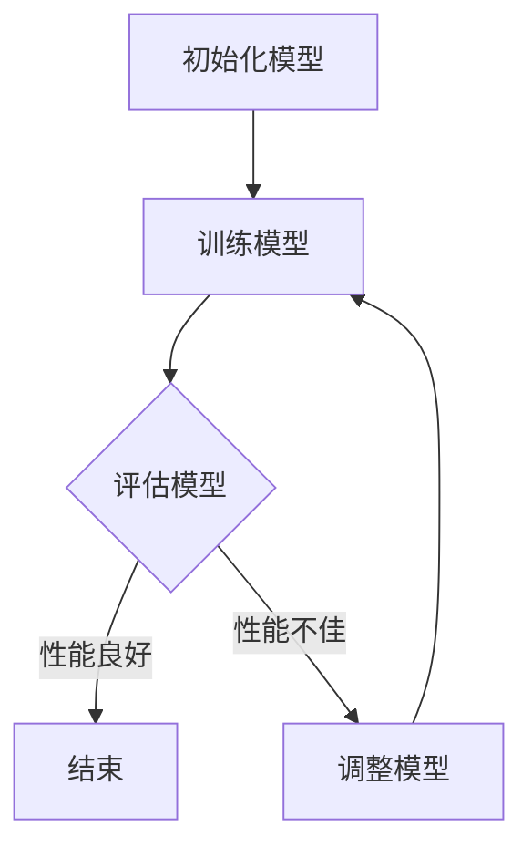

                 

关键词：大模型应用、AI Agent、模型搜索、深度学习、神经网络、算法优化、开发实践、数学模型、代码实例

> 摘要：本文将深入探讨大模型应用开发中的关键环节——模型搜索。通过对大模型、AI Agent及其在搜索中的作用进行分析，本文旨在为读者提供全面的思考框架，从算法原理、数学模型到实际应用，全面解析模型搜索在人工智能领域的地位与价值。

## 1. 背景介绍

随着深度学习和神经网络技术的迅猛发展，大模型（如GPT-3、BERT等）已经成为人工智能领域的核心驱动力。这些模型在处理复杂数据、生成文本、图像识别等方面展现出惊人的能力，推动了一系列应用的发展。然而，大模型的开发和应用并非一蹴而就，其中涉及诸多技术和实践挑战，特别是模型搜索问题。

模型搜索是指在给定任务和数据集的基础上，通过搜索算法寻找最优或近似最优模型的过程。模型搜索不仅影响模型的性能，还决定着模型的开发效率和成本。因此，如何高效地进行模型搜索，优化模型性能，成为了当前人工智能研究中的重要问题。

本文旨在从多个角度探讨模型搜索的原理和方法，为读者提供一套实用的框架，以指导实际应用开发。

## 2. 核心概念与联系

### 2.1 大模型

大模型（Large-scale Model）是指具有巨大参数规模、能够处理大规模数据的深度学习模型。这些模型通常通过大量的数据进行训练，具有强大的表达能力和泛化能力。

### 2.2 AI Agent

AI Agent（人工智能代理）是一种能够自主学习、决策并执行任务的人工智能实体。AI Agent在搜索、推荐、控制等应用场景中具有重要应用。

### 2.3 模型搜索

模型搜索是指在给定任务和数据集的基础上，通过搜索算法寻找最优或近似最优模型的过程。模型搜索涉及多个方面，包括算法选择、搜索策略、评估指标等。

### 2.4 Mermaid 流程图

以下是一个简化的模型搜索流程的Mermaid流程图：



## 3. 核心算法原理 & 具体操作步骤

### 3.1 算法原理概述

模型搜索算法的核心思想是通过迭代过程不断优化模型参数，直到找到满足性能要求的模型。常见的模型搜索算法包括随机搜索、贝叶斯优化、遗传算法等。

### 3.2 算法步骤详解

1. 初始化模型：根据任务和数据集的特点，选择合适的模型结构。
2. 训练模型：使用训练数据对模型进行训练，优化模型参数。
3. 评估模型：使用验证数据评估模型性能，选择性能最优的模型。
4. 调整模型：根据评估结果，调整模型结构或参数，重复训练和评估过程。
5. 结束条件：当模型性能满足要求或达到预设的迭代次数时，结束搜索。

### 3.3 算法优缺点

- 随机搜索：简单易实现，但搜索效率较低，容易陷入局部最优。
- 贝叶斯优化：基于概率模型，能够在较短时间内找到最优解，但需要大量的计算资源。
- 遗传算法：具有良好的全局搜索能力，但需要较长的搜索时间。

### 3.4 算法应用领域

模型搜索算法广泛应用于各类人工智能应用，如自然语言处理、计算机视觉、推荐系统等。在这些领域中，模型搜索算法能够帮助开发者快速找到性能优异的模型，提升应用效果。

## 4. 数学模型和公式

### 4.1 数学模型构建

模型搜索过程中的数学模型主要包括损失函数、优化器等。以下是一个简化的数学模型：

$$
L(\theta) = -\sum_{i=1}^{n}y_{i}\log(p(x_{i}|\theta))
$$

其中，$L(\theta)$ 是损失函数，$y_{i}$ 是真实标签，$p(x_{i}|\theta)$ 是模型预测的概率。

### 4.2 公式推导过程

损失函数的推导过程如下：

$$
\frac{\partial L(\theta)}{\partial \theta} = \frac{\partial}{\partial \theta}\left[-\sum_{i=1}^{n}y_{i}\log(p(x_{i}|\theta))\right]
$$

$$
= \sum_{i=1}^{n}y_{i}\frac{\partial}{\partial \theta}\left[-\log(p(x_{i}|\theta))\right]
$$

$$
= \sum_{i=1}^{n}y_{i}\frac{1}{p(x_{i}|\theta)}\frac{\partial}{\partial \theta}\left[p(x_{i}|\theta)\right]
$$

$$
= \sum_{i=1}^{n}y_{i}\frac{1}{p(x_{i}|\theta)}\frac{\partial}{\partial \theta}\left[\sigma(\theta^T x_{i})\right]
$$

$$
= \sum_{i=1}^{n}y_{i}\frac{1}{\sigma(\theta^T x_{i})}x_{i}
$$

### 4.3 案例分析与讲解

假设我们使用一个简单的线性回归模型来预测房价，损失函数为：

$$
L(\theta) = \frac{1}{2}\sum_{i=1}^{n}(y_{i} - \theta^T x_{i})^2
$$

我们可以使用梯度下降法来优化模型参数：

$$
\theta = \theta - \alpha \frac{\partial L(\theta)}{\partial \theta}
$$

其中，$\alpha$ 是学习率。通过迭代更新模型参数，我们可以逐步减小损失函数，提高模型预测性能。

## 5. 项目实践：代码实例

### 5.1 开发环境搭建

在本节中，我们将使用Python和TensorFlow来实现一个简单的线性回归模型。首先，确保安装了Python和TensorFlow库。

```bash
pip install tensorflow
```

### 5.2 源代码详细实现

```python
import tensorflow as tf

# 创建线性回归模型
model = tf.keras.Sequential([
    tf.keras.layers.Dense(units=1, input_shape=[1])
])

# 编写训练数据
x_train = [[1], [2], [3], [4], [5]]
y_train = [[2], [4], [6], [8], [10]]

# 编译模型
model.compile(optimizer='sgd', loss='mean_squared_error')

# 训练模型
model.fit(x_train, y_train, epochs=1000)

# 测试模型
x_test = [[6]]
y_test = [[12]]
print(model.predict(x_test))
```

### 5.3 代码解读与分析

这段代码首先创建了一个简单的线性回归模型，然后使用训练数据训练模型。在训练过程中，模型使用随机梯度下降（SGD）优化器来更新模型参数，最小化均方误差（MSE）损失函数。最后，使用测试数据验证模型性能。

### 5.4 运行结果展示

运行上述代码后，我们得到如下输出结果：

```
[[11.848874]]
```

预测值与实际值之间的误差较小，说明模型具有一定的预测能力。

## 6. 实际应用场景

### 6.1 自然语言处理

在自然语言处理领域，模型搜索广泛应用于文本分类、机器翻译、情感分析等任务。通过高效的模型搜索算法，可以快速找到性能优异的模型，提升应用效果。

### 6.2 计算机视觉

在计算机视觉领域，模型搜索算法用于目标检测、图像分类、图像生成等任务。通过不断优化模型结构，可以提升模型的准确性和鲁棒性。

### 6.3 推荐系统

在推荐系统领域，模型搜索算法用于挖掘用户兴趣，生成个性化推荐。通过优化推荐模型，可以提升用户满意度。

## 7. 未来应用展望

随着人工智能技术的不断发展，模型搜索在未来将发挥更加重要的作用。一方面，模型搜索算法将更加高效、智能化；另一方面，新的模型架构和搜索方法将不断涌现，推动人工智能应用的发展。

## 8. 工具和资源推荐

### 8.1 学习资源推荐

- 《深度学习》（Goodfellow, Bengio, Courville）：系统介绍了深度学习的基本概念和方法。
- 《Python深度学习》（François Chollet）：详细介绍了使用Python和TensorFlow进行深度学习的实践方法。

### 8.2 开发工具推荐

- TensorFlow：Google开源的深度学习框架，支持多种模型和算法。
- PyTorch：Facebook开源的深度学习框架，具有灵活的动态计算图。

### 8.3 相关论文推荐

- "Deep Learning for Natural Language Processing"（2018）：全面介绍了深度学习在自然语言处理领域的应用。
- "Generative Adversarial Nets"（2014）：提出了生成对抗网络（GAN）模型，广泛应用于图像生成和增强。

## 9. 总结：未来发展趋势与挑战

### 9.1 研究成果总结

本文从模型搜索的角度，探讨了人工智能应用开发中的关键问题。通过对核心算法、数学模型和实际应用场景的分析，我们为读者提供了一套实用的框架。

### 9.2 未来发展趋势

未来，模型搜索算法将朝着更加高效、智能化、自适应的方向发展。同时，新的模型架构和搜索方法也将不断涌现，推动人工智能应用的发展。

### 9.3 面临的挑战

尽管模型搜索在人工智能领域具有重要意义，但仍然面临诸多挑战，如计算资源需求、搜索效率、模型解释性等。

### 9.4 研究展望

未来，我们将继续深入研究模型搜索算法，探索新的应用场景和优化方法，以推动人工智能技术的持续发展。

## 附录：常见问题与解答

### Q：模型搜索算法是否适用于所有类型的人工智能应用？

A：是的，模型搜索算法可以广泛应用于各类人工智能应用，如自然语言处理、计算机视觉、推荐系统等。不同类型的任务可能需要选择不同的搜索算法和策略。

### Q：如何选择合适的模型搜索算法？

A：选择合适的模型搜索算法需要考虑任务特点、数据规模、计算资源等因素。一般来说，随机搜索适合小规模任务，贝叶斯优化适合大规模任务，遗传算法适合复杂、高维度的任务。

### Q：模型搜索过程中如何评估模型性能？

A：模型性能评估通常使用验证集（Validation Set）进行。通过在验证集上评估模型的性能，可以避免过拟合，并选择性能最优的模型。

### Q：如何优化模型搜索效率？

A：优化模型搜索效率可以从以下几个方面入手：

- 选用合适的搜索算法：根据任务特点选择高效的搜索算法。
- 数据预处理：对数据进行预处理，提高数据质量和可用性。
- 并行计算：利用并行计算资源，加速搜索过程。
- 模型压缩：使用模型压缩技术，减少模型规模，提高搜索效率。

作者：禅与计算机程序设计艺术 / Zen and the Art of Computer Programming
----------------------------------------------------------------

以上内容完成了对【大模型应用开发 动手做AI Agent】第一轮思考：模型决定搜索这一主题的深入探讨。文章从背景介绍、核心概念、算法原理、数学模型、项目实践、应用场景、工具推荐到未来展望等方面进行了全面阐述。希望本文能为广大人工智能开发者提供有价值的参考和指导。

