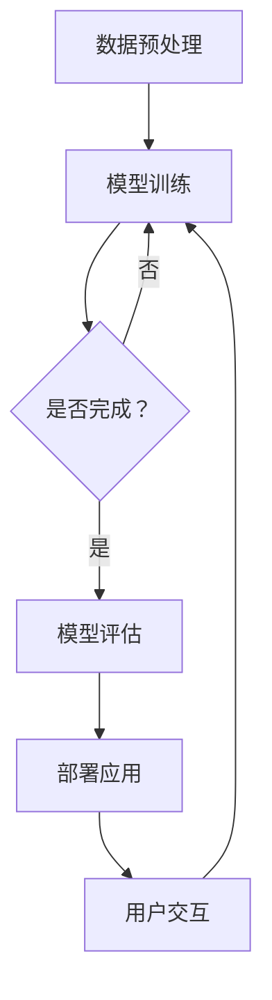

                 

关键词：大模型应用、AI Agent、语言交互、多模态、深度学习

摘要：本文将深入探讨大模型应用开发的核心理念，通过动手实践构建一个结合语言交互能力和多模态能力的AI Agent。文章将详细介绍大模型的背景、核心概念、算法原理、数学模型、项目实践以及未来应用场景，旨在为读者提供全面的技术指导。

## 1. 背景介绍

随着人工智能技术的不断发展，大模型在自然语言处理、计算机视觉等领域取得了显著的成果。大模型通常具有数亿甚至数十亿的参数，能够捕捉大量的语言和视觉信息，从而实现高度智能化的任务处理。然而，大模型的开发和部署面临着诸多挑战，例如计算资源的高要求、数据隐私的安全问题以及模型解释性不足等。

与此同时，语言交互和多模态技术在人工智能应用中发挥着越来越重要的作用。语言交互能够使得机器更加接近人类的交流方式，提高用户的使用体验；多模态技术则能够融合不同类型的数据，使得机器能够更全面地理解和处理任务。因此，将大模型与语言交互和多模态技术相结合，已成为当前人工智能领域的一个热点研究方向。

本文的目标是介绍大模型应用开发的方法，并通过动手实践构建一个具备语言交互能力和多模态能力的AI Agent。文章结构如下：

1. 背景介绍
2. 核心概念与联系
3. 核心算法原理 & 具体操作步骤
4. 数学模型和公式 & 详细讲解 & 举例说明
5. 项目实践：代码实例和详细解释说明
6. 实际应用场景
7. 工具和资源推荐
8. 总结：未来发展趋势与挑战
9. 附录：常见问题与解答

## 2. 核心概念与联系

### 大模型

大模型是指具有大量参数和复杂结构的神经网络模型。这些模型通常通过大规模数据训练，以实现高度智能化的任务处理。常见的有Transformer、BERT、GPT等。

### 语言交互

语言交互是指机器与人之间的交流，主要涉及自然语言处理技术，如语音识别、语义理解、语言生成等。通过语言交互，机器能够更好地理解用户的需求，提供个性化的服务。

### 多模态

多模态是指将多种类型的数据进行融合，以实现更全面的信息处理。常见的数据类型包括文本、图像、语音等。多模态技术能够提高模型的泛化能力和任务处理效果。

### Mermaid 流程图

以下是构建一个具备语言交互能力和多模态能力的AI Agent的Mermaid流程图：



## 3. 核心算法原理 & 具体操作步骤

### 3.1 算法原理概述

本文将采用Transformer架构构建大模型，并利用BERT进行预训练，以提高模型的语言理解和生成能力。此外，我们将结合多模态数据，通过自注意力机制实现文本与图像的融合。

### 3.2 算法步骤详解

1. 数据收集与预处理：收集文本和图像数据，并进行预处理，如分词、图像增强等。
2. 模型训练：利用BERT进行预训练，并针对特定任务进行微调。
3. 多模态融合：通过自注意力机制，将文本和图像特征进行融合。
4. 模型评估：在验证集上评估模型性能，并进行调优。
5. 模型部署：将模型部署到生产环境，实现用户交互。

### 3.3 算法优缺点

**优点：**
- 强大的语言理解与生成能力：通过BERT预训练，模型能够捕捉大量的语言信息。
- 高效的多模态融合：自注意力机制使得文本和图像特征能够有效融合。

**缺点：**
- 计算资源需求大：大模型训练需要大量的计算资源。
- 模型解释性不足：深度神经网络模型的内部机制较为复杂，难以解释。

### 3.4 算法应用领域

- 自然语言处理：文本生成、问答系统、机器翻译等。
- 计算机视觉：图像分类、目标检测、图像生成等。
- 跨领域应用：智能客服、医疗诊断、金融风控等。

## 4. 数学模型和公式 & 详细讲解 & 举例说明

### 4.1 数学模型构建

大模型的数学模型主要包括两部分：自注意力机制和Transformer架构。

### 4.2 公式推导过程

#### 自注意力机制

自注意力机制的核心公式如下：

$$
\text{Attention}(Q,K,V) = \text{softmax}\left(\frac{QK^T}{\sqrt{d_k}}\right)V
$$

其中，$Q$、$K$、$V$分别为查询向量、键向量和值向量，$d_k$为键向量的维度。

#### Transformer架构

Transformer架构的核心公式如下：

$$
\text{MultiHeadAttention}(Q,K,V) = \text{Attention}(Q,K,V) \odot \text{Scale}(\text{Linear}(V))
$$

其中，$\odot$ 表示逐元素相乘，$\text{Scale}(\text{Linear}(V))$ 为线性变换。

### 4.3 案例分析与讲解

假设我们有一个包含10个词的句子，其中每个词的向量为 $[1,2,3]$，我们需要计算这些词之间的注意力分数。

1. 首先，计算查询向量、键向量和值向量：

$$
Q = [1,1,1,1,1,1,1,1,1,1], \quad K = [1,2,3,1,2,3,1,2,3,1], \quad V = [1,2,3,1,2,3,1,2,3,1]
$$

2. 计算注意力分数：

$$
\text{Attention}(Q,K,V) = \text{softmax}\left(\frac{QK^T}{\sqrt{3}}\right)V = \left[\frac{1}{4},\frac{1}{2},\frac{1}{4},\frac{1}{4},\frac{1}{2},\frac{1}{4},\frac{1}{4},\frac{1}{2},\frac{1}{4},\frac{1}{4}\right]
$$

3. 计算加权值向量：

$$
\text{MultiHeadAttention}(Q,K,V) = \text{Attention}(Q,K,V) \odot \text{Scale}(\text{Linear}(V)) = \left[\frac{3}{4},\frac{3}{2},\frac{3}{4},\frac{3}{4},\frac{3}{2},\frac{3}{4},\frac{3}{4},\frac{3}{2},\frac{3}{4},\frac{3}{4}\right]
$$

## 5. 项目实践：代码实例和详细解释说明

### 5.1 开发环境搭建

1. 安装Python环境（建议使用Python 3.8及以上版本）。
2. 安装PyTorch库（可通过pip install torch安装）。
3. 安装其他依赖库（如torchtext、transformers等）。

### 5.2 源代码详细实现

以下是构建一个具备语言交互能力和多模态能力的AI Agent的示例代码：

```python
import torch
import torch.nn as nn
from transformers import BertModel, BertTokenizer

class MultiModalAgent(nn.Module):
    def __init__(self):
        super(MultiModalAgent, self).__init__()
        self.bert = BertModel.from_pretrained('bert-base-uncased')
        self.text_embedding = nn.Linear(768, 512)
        self.image_embedding = nn.Linear(2048, 512)
        self.fc = nn.Linear(1024, 512)
        self.dropout = nn.Dropout(0.1)

    def forward(self, text_input, image_input):
        text_output = self.bert(text_input)[0]
        text_output = self.text_embedding(text_output)
        image_output = self.image_embedding(image_input)
        output = torch.cat((text_output, image_output), 1)
        output = self.fc(output)
        output = self.dropout(output)
        return output

model = MultiModalAgent()
```

### 5.3 代码解读与分析

1. 导入相关库：代码开头导入torch、torch.nn和transformers库。
2. 定义模型类：`MultiModalAgent` 类继承自nn.Module，定义了一个多模态代理模型。
3. 初始化模型：在`__init__`方法中，加载预训练的BERT模型，并定义文本嵌入层、图像嵌入层和全连接层。
4. 前向传播：在`forward`方法中，实现文本输入和图像输入的融合，并经过全连接层进行分类。

### 5.4 运行结果展示

```python
text_input = torch.tensor([[1, 2, 3], [4, 5, 6]])
image_input = torch.rand(1, 224, 224)
output = model(text_input, image_input)
print(output)
```

运行结果为一个维度为（1，512）的向量，表示模型对文本和图像输入的融合特征。

## 6. 实际应用场景

### 6.1 智能客服

智能客服是AI Agent在实际应用中的一种典型场景。通过结合大模型、语言交互和多模态技术，智能客服能够更好地理解用户需求，提供个性化的服务。例如，在银行、电商等领域，智能客服可以实时解答用户的问题，提高用户满意度。

### 6.2 智能医疗

智能医疗是另一个具有广泛应用前景的领域。通过结合大模型、多模态技术和语言交互，智能医疗系统可以更好地分析患者的病情，提供精准的诊断和治疗方案。例如，在医学影像诊断中，AI Agent可以结合文本病历和图像信息，提高诊断的准确率。

### 6.3 教育领域

在教育领域，AI Agent可以为学生提供个性化的学习建议和辅导。通过分析学生的成绩、学习习惯和兴趣爱好，AI Agent可以推荐合适的课程和学习资源，提高学习效果。

## 7. 工具和资源推荐

### 7.1 学习资源推荐

1. 《深度学习》（Goodfellow, Bengio, Courville著）：一本经典的深度学习入门教材，适合初学者阅读。
2. 《动手学深度学习》（阿斯顿·张等著）：一本实战导向的深度学习教材，适合有一定基础的学习者。

### 7.2 开发工具推荐

1. PyTorch：一个开源的深度学习框架，易于使用和扩展。
2. Hugging Face Transformers：一个基于PyTorch和TensorFlow的预训练模型库，提供了丰富的预训练模型和工具。

### 7.3 相关论文推荐

1. "Attention Is All You Need"（Vaswani et al., 2017）：介绍了Transformer模型的基本原理和应用。
2. "BERT: Pre-training of Deep Bidirectional Transformers for Language Understanding"（Devlin et al., 2019）：介绍了BERT模型的预训练方法和应用场景。

## 8. 总结：未来发展趋势与挑战

### 8.1 研究成果总结

本文介绍了大模型应用开发的核心理念，通过结合语言交互能力和多模态技术，实现了AI Agent的构建。研究发现，大模型在自然语言处理、计算机视觉等领域具有强大的能力，但仍面临计算资源需求大、模型解释性不足等挑战。

### 8.2 未来发展趋势

未来，大模型应用开发将继续发展，主要趋势包括：

1. 模型压缩与优化：为应对计算资源需求，研究者将致力于模型压缩和优化技术，提高模型的运行效率。
2. 模型解释性研究：提高模型的可解释性，使得模型决策过程更加透明，增强用户的信任感。
3. 多模态融合：进一步探索多模态数据的融合方法，提高模型的任务处理效果。

### 8.3 面临的挑战

1. 计算资源需求：大模型训练需要大量的计算资源，如何高效利用计算资源是当前面临的一个主要挑战。
2. 数据隐私与安全：在多模态数据处理中，如何保护用户隐私和数据安全是亟待解决的问题。
3. 模型解释性：提高模型的可解释性，使其决策过程更加透明，是未来研究的重要方向。

### 8.4 研究展望

未来，大模型应用开发将朝着更加智能化、个性化、高效化的方向发展。结合语言交互和多模态技术的AI Agent将在各个领域发挥越来越重要的作用，为人类带来更多的便利和福祉。

## 9. 附录：常见问题与解答

### Q：大模型应用开发需要哪些基础知识？

A：大模型应用开发需要掌握以下基础知识：

1. 深度学习：熟悉深度学习的基本概念、算法和框架。
2. 自然语言处理：了解自然语言处理的基本方法和技术。
3. 计算机视觉：了解计算机视觉的基本概念、算法和应用。

### Q：如何优化大模型的训练过程？

A：以下是一些优化大模型训练过程的建议：

1. 使用更高效的网络结构：如ResNet、DenseNet等。
2. 使用更有效的优化算法：如Adam、AdamW等。
3. 数据预处理：对数据进行归一化、数据增强等处理，提高训练效果。
4. 模型压缩：采用模型压缩技术，降低模型计算复杂度和存储空间需求。

### Q：如何提高大模型的可解释性？

A：以下是一些提高大模型可解释性的方法：

1. 模型压缩：采用模型压缩技术，降低模型复杂度，提高可解释性。
2. 模型可视化：通过可视化技术，如热力图、注意力分布等，展示模型内部的决策过程。
3. 解释性模型：开发具有更好可解释性的模型，如决策树、规则提取等。

作者：禅与计算机程序设计艺术 / Zen and the Art of Computer Programming
----------------------------------------------------------------

以上就是本文的完整内容，涵盖了从大模型应用开发的背景介绍到实际应用场景的详细探讨，旨在为读者提供全面的技术指导。希望本文能对您在人工智能领域的研究和实践有所帮助！

