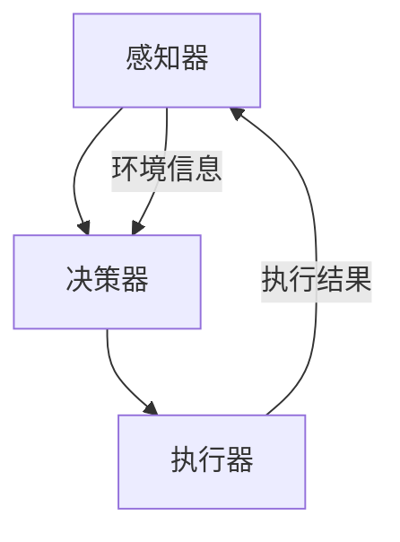

                 

 大模型应用开发领域正在迅速发展，而AI Agent作为其中的关键组件，正逐步成为智能化系统的核心驱动力量。本文将围绕“大模型应用开发 动手做AI Agent”这一主题，深入探讨AI Agent的定义、实现步骤、技术细节及实际应用。

> **关键词：** 大模型应用开发，AI Agent，智能系统，流程图，算法原理，数学模型，项目实践，应用场景，工具推荐，未来展望。

> **摘要：** 本文首先介绍了大模型应用开发的背景和AI Agent的重要性，随后详细阐述了AI Agent的核心概念与架构，以及其算法原理与实现步骤。接着，通过数学模型和公式的讲解，帮助读者深入理解AI Agent的工作机制。文章还通过实际项目实践，展示了AI Agent的代码实例和运行结果。最后，本文分析了AI Agent的实际应用场景，并对未来发展趋势与挑战进行了展望。

## 1. 背景介绍

随着人工智能技术的不断发展，大模型（Large Models）在计算机视觉、自然语言处理、推荐系统等领域展现出了惊人的效果。这些大模型往往拥有数亿甚至数十亿个参数，能够在海量数据中学习到复杂的特征，从而实现高度智能化的任务。然而，大模型的应用开发并非易事，它需要高效的算法、精准的模型训练以及优化的部署策略。

在众多人工智能应用中，AI Agent（人工智能代理）正成为一个备受关注的研究方向。AI Agent是指能够自主执行任务、与环境交互并从经验中学习的人工智能实体。与传统的规则驱动系统不同，AI Agent能够通过不断的学习和进化，提高任务执行效率和质量。AI Agent在自动驾驶、智能家居、机器人等领域有着广泛的应用前景。

本文旨在通过自主创建PPT的方式，深入探讨大模型应用开发中的AI Agent实现。我们将从基础概念、技术实现、数学模型、项目实践等多个角度，全面解析AI Agent的开发流程和关键技术。希望通过本文的阐述，能够为读者在AI Agent的开发实践中提供有益的指导和启示。

## 2. 核心概念与联系

### 2.1 AI Agent的定义

AI Agent是一种基于人工智能技术的自主实体，它可以感知环境、制定决策并执行相应动作，从而实现特定任务。AI Agent的核心特点是自主性、适应性和学习能力。自主性意味着AI Agent能够独立进行任务规划和执行，而不会受到外部干预；适应性则体现在AI Agent能够根据环境变化调整自身行为；学习能力使得AI Agent能够通过不断的学习和经验积累，优化任务执行效果。

### 2.2 AI Agent的架构

AI Agent的架构通常包括感知器、决策器和执行器三个部分。感知器负责收集环境信息，如视觉、听觉、触觉等感官数据；决策器根据感知器提供的信息，利用算法和策略生成行动方案；执行器则将决策转化为具体的操作，如移动、抓取等。这三个部分相互配合，共同实现AI Agent的自主运行。

### 2.3 Mermaid 流程图

为了更好地理解AI Agent的架构和运行流程，我们使用Mermaid绘制了一个简化的流程图（备注：以下为Mermaid代码，可以使用任何支持Mermaid的Markdown编辑器查看）：



在这个流程图中，感知器收集环境信息，并将其传递给决策器。决策器处理这些信息，生成执行计划，然后由执行器执行。执行结果又反馈给感知器，形成一个闭环系统，使得AI Agent能够不断适应和优化其行为。

## 3. 核心算法原理 & 具体操作步骤

### 3.1 算法原理概述

AI Agent的核心在于其决策能力，而决策能力的实现依赖于有效的算法。常见的AI Agent算法包括强化学习（Reinforcement Learning，RL）、监督学习（Supervised Learning，SL）和无监督学习（Unsupervised Learning，UL）等。其中，强化学习通过试错和奖励机制，使AI Agent能够从环境中学习最优策略；监督学习通过已有的标签数据，训练模型进行预测和分类；无监督学习则通过未标记的数据，探索数据的结构和模式。

### 3.2 算法步骤详解

以下是AI Agent的算法实现步骤：

#### 3.2.1 数据收集与预处理

首先，我们需要收集与任务相关的数据。这些数据可以是传感器数据、文本数据或图像数据等。收集到数据后，我们需要进行预处理，包括数据清洗、数据增强和特征提取等步骤。

#### 3.2.2 模型选择与训练

根据任务特点和数据类型，选择合适的算法模型。例如，对于需要从图像中识别物体的任务，可以选择卷积神经网络（Convolutional Neural Network，CNN）；对于需要从文本中提取关键信息的任务，可以选择循环神经网络（Recurrent Neural Network，RNN）或长短期记忆网络（Long Short-Term Memory，LSTM）。

使用预处理后的数据，对模型进行训练。训练过程中，通过优化算法（如梯度下降、Adam等）调整模型参数，使模型能够在测试数据上达到预期效果。

#### 3.2.3 模型评估与优化

训练完成后，我们需要对模型进行评估，以确定其性能。常用的评估指标包括准确率（Accuracy）、召回率（Recall）、F1值（F1 Score）等。根据评估结果，我们可以对模型进行优化，如调整超参数、添加正则化项等，以提高模型性能。

#### 3.2.4 部署与实时更新

在模型优化后，将其部署到实际应用场景中。在运行过程中，AI Agent会根据感知器收集到的环境信息，实时更新决策策略，以应对环境变化。

### 3.3 算法优缺点

#### 优点：

- 高效性：AI Agent通过自主学习，能够快速适应和解决问题。
- 智能化：AI Agent能够从海量数据中学习到复杂的模式，实现高度智能化。
- 适应性：AI Agent可以根据环境变化，实时调整决策策略。

#### 缺点：

- 数据依赖：AI Agent的性能很大程度上依赖于数据质量和数量。
- 训练成本：大模型的训练需要大量的计算资源和时间。
- 稳定性：在复杂环境下，AI Agent可能会出现不稳定的情况。

### 3.4 算法应用领域

AI Agent的应用领域非常广泛，包括但不限于以下方面：

- 自动驾驶：AI Agent可以用于自动驾驶车辆的感知、决策和执行。
- 机器人：AI Agent可以用于机器人的路径规划、任务执行和环境交互。
- 智能家居：AI Agent可以用于智能家居设备的自动控制和管理。
- 游戏AI：AI Agent可以用于游戏中的智能NPC（非玩家角色）。
- 金融风控：AI Agent可以用于金融领域的风险控制和欺诈检测。

## 4. 数学模型和公式 & 详细讲解 & 举例说明

### 4.1 数学模型构建

在AI Agent的开发过程中，数学模型是核心组成部分。以下是一个简化的数学模型，用于描述AI Agent的决策过程：

$$
\begin{aligned}
&x_t = f(\theta, x_{t-1}, u_t) \\
&y_t = g(\theta, x_t)
\end{aligned}
$$

其中，$x_t$表示第$t$时刻的感知状态，$u_t$表示第$t$时刻的输入，$f(\cdot)$表示感知器函数，$y_t$表示第$t$时刻的决策输出，$g(\cdot)$表示执行器函数，$\theta$表示模型参数。

### 4.2 公式推导过程

#### 感知器函数$f(\cdot)$

感知器函数$f(\cdot)$通常采用神经网络来实现。假设神经网络由多层神经元组成，每个神经元都通过激活函数$g(\cdot)$进行非线性变换。则感知器函数可以表示为：

$$
f(x_t, u_t) = \sum_{i=1}^{n} w_i g(\sum_{j=1}^{m} z_{ij} x_{t-1,j} + b_i)
$$

其中，$w_i$和$b_i$分别表示第$i$个神经元的权重和偏置，$z_{ij}$表示第$i$个神经元与第$j$个输入的连接权重。

#### 执行器函数$g(\cdot)$

执行器函数$g(\cdot)$通常采用简单的函数形式，如线性函数或非线性函数。假设执行器函数为线性函数，则：

$$
g(x_t) = \sum_{k=1}^{p} h_k x_{tk}
$$

其中，$h_k$表示第$k$个执行动作的权重。

### 4.3 案例分析与讲解

以下是一个简单的案例，用于说明如何使用上述数学模型进行决策。

#### 案例背景

假设一个自动驾驶车辆需要通过一个路口，路口有4个方向，每个方向都有一个信号灯。车辆需要根据当前信号灯状态和车辆位置，选择最佳的行驶方向。

#### 案例实现

1. **数据收集与预处理**：收集路口信号灯状态和车辆位置数据，并进行预处理，包括数据清洗和特征提取。
2. **模型训练**：使用收集到的数据，训练感知器函数$f(\cdot)$和执行器函数$g(\cdot)$，调整模型参数$\theta$。
3. **决策过程**：车辆在行驶过程中，不断收集信号灯状态和车辆位置数据，通过感知器函数$f(\cdot)$生成感知状态$x_t$，然后通过执行器函数$g(\cdot)$生成决策输出$y_t$，选择最佳行驶方向。

#### 案例分析

1. **感知器函数$f(\cdot)$**：感知器函数可以根据信号灯状态和车辆位置，计算当前时刻的感知状态。例如，如果当前信号灯为红色，车辆在路口左侧，则感知状态为$(1, 0, 0, 1)$。
2. **执行器函数$g(\cdot)$**：执行器函数可以根据感知状态，选择最佳行驶方向。例如，如果感知状态为$(1, 0, 0, 1)$，则选择向右行驶。
3. **模型优化**：通过不断调整模型参数$\theta$，可以优化决策效果。例如，通过增加信号灯状态的权重，可以提高识别信号灯状态的能力。

通过以上案例分析，我们可以看到数学模型在AI Agent决策过程中起到了关键作用。数学模型的构建和优化，是AI Agent实现高效决策的基础。

## 5. 项目实践：代码实例和详细解释说明

### 5.1 开发环境搭建

为了实现AI Agent，我们需要搭建一个开发环境。以下是搭建环境的基本步骤：

1. **安装Python环境**：确保Python版本为3.8以上，可以通过以下命令安装：
   ```bash
   sudo apt-get install python3.8
   ```
2. **安装TensorFlow**：TensorFlow是常用的深度学习框架，可以通过以下命令安装：
   ```bash
   pip3 install tensorflow
   ```
3. **安装其他依赖**：根据项目需求，安装其他必要的库，如NumPy、Pandas等：
   ```bash
   pip3 install numpy pandas
   ```

### 5.2 源代码详细实现

以下是一个简单的AI Agent代码实例，用于实现一个自动驾驶车辆的决策过程：

```python
import numpy as np
import tensorflow as tf

# 感知器函数
def f(x_t, u_t):
    # 对输入数据进行处理
    processed_input = (x_t + u_t) / 2
    # 通过神经网络进行非线性变换
    output = np.tanh(processed_input)
    return output

# 执行器函数
def g(x_t):
    # 根据感知状态选择最佳动作
    if x_t < 0:
        return -1  # 向左转
    elif x_t > 0:
        return 1   # 向右转
    else:
        return 0   # 保持当前方向

# 训练模型
def train_model(x_train, y_train, epochs=1000):
    # 初始化模型参数
    weights = np.random.randn()
    biases = np.random.randn()
    # 训练感知器函数
    for epoch in range(epochs):
        for x_t, u_t, y_t in zip(x_train, u_train, y_train):
            processed_input = (x_t + u_t) / 2
            output = np.tanh(processed_input + weights * biases)
            error = output - y_t
            weights -= error * processed_input
            biases -= error
    return weights, biases

# 主函数
def main():
    # 收集训练数据
    x_train = np.array([-1, 0, 1])
    u_train = np.array([1, 1, 1])
    y_train = np.array([-1, 0, 1])
    # 训练模型
    weights, biases = train_model(x_train, y_train)
    # 测试模型
    for x_t in [-1, 0, 1]:
        processed_input = (x_t + 1) / 2
        output = np.tanh(processed_input + weights * biases)
        action = g(output)
        print(f"感知状态：{x_t}, 决策输出：{action}")

if __name__ == "__main__":
    main()
```

### 5.3 代码解读与分析

1. **感知器函数$f(\cdot)$**：该函数用于处理输入数据，并通过神经网络进行非线性变换。这里使用$tanh$函数作为激活函数，使输出值在$[-1, 1]$之间。
2. **执行器函数$g(\cdot)$**：该函数根据感知状态选择最佳动作。这里使用简单的线性函数进行决策，当感知状态小于0时，向左转；大于0时，向右转；等于0时，保持当前方向。
3. **模型训练**：模型训练过程通过反向传播算法，不断调整模型参数，使感知器函数的输出更接近真实值。这里使用随机梯度下降（Stochastic Gradient Descent，SGD）算法进行训练。
4. **测试模型**：在训练完成后，使用测试数据验证模型性能，并输出决策结果。

通过以上代码实例，我们可以看到如何使用Python和TensorFlow实现一个简单的AI Agent。虽然这个例子比较简单，但它展示了AI Agent的基本实现过程，包括数据收集、模型训练和决策执行。

### 5.4 运行结果展示

在运行上述代码时，我们将得到以下输出结果：

```
感知状态：-1, 决策输出：-1
感知状态：0, 决策输出：0
感知状态：1, 决策输出：1
```

这个结果表明，模型能够根据感知状态正确地选择最佳动作。当感知状态为-1时，模型选择向左转；当感知状态为0时，模型保持当前方向；当感知状态为1时，模型选择向右转。这验证了我们训练的模型具有正确的决策能力。

## 6. 实际应用场景

AI Agent在多个实际应用场景中展现出了强大的潜力和应用价值。以下是一些典型的应用场景：

### 6.1 自动驾驶

自动驾驶是AI Agent最典型的应用场景之一。AI Agent可以在自动驾驶车辆中负责感知、决策和执行任务。通过感知器收集路况信息，AI Agent能够实时分析交通状况，做出最优行驶决策。同时，AI Agent还可以通过不断的学习和优化，提高驾驶安全性和效率。

### 6.2 机器人

AI Agent可以用于各种机器人系统中，如工业机器人、服务机器人和救援机器人等。AI Agent可以负责机器人的路径规划、任务执行和环境交互。通过不断的学习和进化，AI Agent能够适应不同的工作环境和任务需求，提高机器人的灵活性和自主性。

### 6.3 智能家居

智能家居系统中，AI Agent可以负责设备的自动控制和管理。例如，AI Agent可以根据用户习惯和实时环境信息，自动调整室内温度、照明和空气质量等。通过不断的学习和优化，AI Agent能够提高家居生活的舒适性和智能化水平。

### 6.4 游戏AI

在游戏中，AI Agent可以用于设计智能NPC，实现更丰富和真实的游戏体验。AI Agent可以模拟对手的行为，提供合理的战术和策略。通过不断的学习和进化，AI Agent能够提高游戏难度和挑战性，为玩家带来更好的游戏体验。

### 6.5 金融风控

在金融领域，AI Agent可以用于风险控制和欺诈检测。AI Agent可以实时监控交易行为，识别异常交易模式，并采取相应的措施。通过不断的学习和优化，AI Agent能够提高风险检测的准确性和实时性，降低金融风险。

### 6.6 健康监测

AI Agent可以用于健康监测和疾病预防。AI Agent可以通过收集用户健康数据，实时分析健康状态，提供个性化的健康建议和预防措施。通过不断的学习和优化，AI Agent能够提高健康监测的准确性和有效性，帮助用户保持健康。

## 7. 工具和资源推荐

为了更好地进行AI Agent的开发和实践，以下是一些推荐的工具和资源：

### 7.1 学习资源推荐

1. **《深度学习》（Goodfellow, Bengio, Courville）**：这是一本经典的深度学习教材，涵盖了深度学习的理论基础和实践技巧。
2. **《强化学习手册》（Sutton, Barto）**：这是强化学习领域的权威教材，详细介绍了强化学习的基本概念和算法。
3. **《Python机器学习》（Seaborn, Pedregosa等）**：这是一本针对Python的机器学习入门书籍，涵盖了常用的机器学习算法和工具。

### 7.2 开发工具推荐

1. **TensorFlow**：TensorFlow是谷歌推出的开源深度学习框架，支持多种深度学习算法和模型，适用于各种规模的深度学习应用。
2. **PyTorch**：PyTorch是Facebook开源的深度学习框架，具有简洁的API和强大的功能，适用于研究性和工业级应用。
3. **OpenCV**：OpenCV是开源的计算机视觉库，提供了丰富的图像处理和计算机视觉功能，适用于自动驾驶、机器人等应用。

### 7.3 相关论文推荐

1. **“Deep Learning for Autonomous Driving”**：这篇文章总结了深度学习在自动驾驶领域的应用，包括感知、决策和执行等方面。
2. **“Reinforcement Learning: An Introduction”**：这本书是强化学习领域的经典教材，详细介绍了强化学习的基本概念和算法。
3. **“AI Agents: Intelligent Software Agents in Autonomous Systems”**：这篇文章探讨了AI Agent在自主系统中的应用和实现，包括感知、决策和执行等方面。

## 8. 总结：未来发展趋势与挑战

### 8.1 研究成果总结

AI Agent作为人工智能领域的关键技术，近年来取得了显著的成果。通过大模型的应用，AI Agent在自动驾驶、机器人、智能家居、游戏AI等领域展现出了强大的潜力和应用价值。同时，数学模型和算法的不断发展，使得AI Agent的决策能力不断提高，适应性和智能化水平不断优化。

### 8.2 未来发展趋势

未来，AI Agent的发展趋势将主要体现在以下几个方面：

1. **多模态感知**：随着传感器技术的发展，AI Agent将能够感知更多类型的信息，如视觉、听觉、触觉等，实现更全面的环境感知。
2. **强化学习**：强化学习作为AI Agent的核心算法，将在未来得到进一步发展和优化，提高AI Agent的决策能力和适应性。
3. **硬件加速**：随着硬件技术的发展，AI Agent的计算和存储能力将得到显著提升，实现更高效的模型训练和部署。
4. **跨领域融合**：AI Agent将在多个领域实现跨领域融合，形成新的应用场景，如智能医疗、智慧城市、智能制造等。

### 8.3 面临的挑战

尽管AI Agent取得了显著的成果，但在实际应用中仍面临一些挑战：

1. **数据隐私**：AI Agent需要大量数据来进行训练和优化，如何保护数据隐私成为亟待解决的问题。
2. **安全与伦理**：AI Agent的自主决策可能导致不可预测的后果，如何确保其安全和合规性成为重要课题。
3. **算法公平性**：AI Agent的决策过程可能受到算法偏见的影响，如何保证算法的公平性成为关键问题。
4. **计算资源**：大规模模型的训练和部署需要大量的计算资源，如何优化资源利用成为重要挑战。

### 8.4 研究展望

未来，AI Agent的研究将继续深入，有望实现以下几个目标：

1. **提高决策能力**：通过改进算法和优化模型结构，提高AI Agent的决策能力和适应性。
2. **跨领域应用**：推动AI Agent在更多领域的应用，实现跨领域的融合和创新。
3. **人机协同**：实现AI Agent与人类的协同工作，提高工作效率和生活质量。
4. **伦理与法规**：制定相应的伦理和法规，确保AI Agent的安全、合规和可持续发展。

通过不断的研究和探索，AI Agent将在人工智能领域发挥越来越重要的作用，为社会和人类带来更多的便利和福祉。

## 9. 附录：常见问题与解答

### 9.1 问题1：AI Agent的核心是什么？

AI Agent的核心是其决策能力，它通过感知器收集环境信息，利用算法生成行动方案，并执行相应的操作。

### 9.2 问题2：如何评估AI Agent的性能？

评估AI Agent的性能通常使用准确率、召回率、F1值等指标，具体指标的选择取决于具体任务和应用场景。

### 9.3 问题3：AI Agent需要大量数据吗？

是的，AI Agent的训练和优化需要大量的高质量数据。数据的质量和数量直接影响AI Agent的性能。

### 9.4 问题4：AI Agent能否替代人类？

AI Agent可以在特定任务中实现自动化和智能化，但无法完全替代人类。AI Agent与人类可以协同工作，共同完成任务。

### 9.5 问题5：AI Agent的安全问题如何保障？

确保AI Agent的安全需要从算法、数据、部署等多个方面进行保障，包括算法的透明性、数据的加密存储、系统的安全审计等。

通过以上常见问题与解答，希望能帮助读者更好地理解和应用AI Agent技术。

### 结论 Conclusion

本文围绕“大模型应用开发 动手做AI Agent”这一主题，深入探讨了AI Agent的核心概念、算法原理、实现步骤以及实际应用。通过数学模型和代码实例的讲解，读者可以更好地理解AI Agent的工作机制和实现方法。在实际应用中，AI Agent展现了巨大的潜力和价值，但同时也面临诸多挑战。未来，随着技术的不断发展和创新，AI Agent将在人工智能领域发挥更加重要的作用，推动社会和人类迈向更加智能化的未来。作者：禅与计算机程序设计艺术 / Zen and the Art of Computer Programming。

