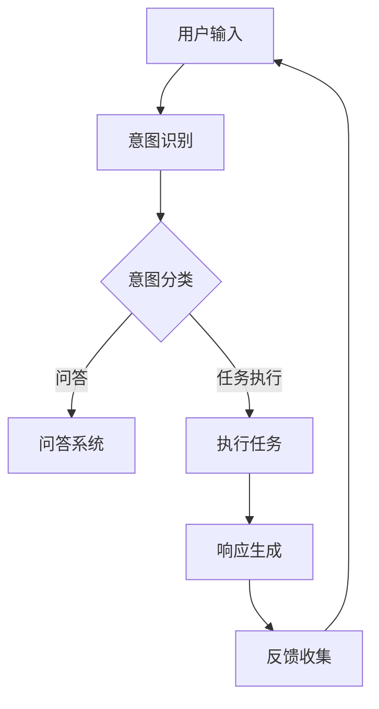

                 

关键词：大模型应用，AI Agent，语言交互，自然语言处理，对话系统，算法原理，数学模型，项目实践，应用场景，未来展望。

> 摘要：本文将深入探讨大模型应用开发中的人工智能代理（AI Agent）语言交互能力。通过介绍核心概念、算法原理、数学模型以及项目实践，本文旨在为读者提供一个全面的理解，并展望AI Agent语言交互在未来的发展趋势与挑战。

## 1. 背景介绍

随着人工智能技术的飞速发展，大模型（如GPT、BERT等）已经成为自然语言处理（NLP）领域的重要工具。这些大模型通过学习海量的语言数据，能够生成流畅、自然的文本，显著提升了人机交互的质量。然而，单纯依靠大模型生成的文本还不足以构建一个完善的AI Agent。AI Agent需要具备语言交互能力，能够理解用户的语言意图，进行有意义的对话，并提供智能化的服务。

本文将重点探讨如何在大模型应用开发中实现AI Agent的语言交互能力。我们将介绍相关的核心概念、算法原理、数学模型，并通过实际项目实践来展示这些概念和算法的应用。最后，我们将探讨AI Agent语言交互能力在实际应用场景中的未来发展方向和面临的挑战。

## 2. 核心概念与联系

### 2.1. 自然语言处理（NLP）

自然语言处理是人工智能领域的一个子领域，它致力于让计算机理解和处理人类语言。NLP的核心目标是使计算机能够解析、生成和理解自然语言，从而实现人与计算机之间的有效沟通。NLP涉及的语言处理任务包括文本分类、情感分析、命名实体识别、机器翻译等。

### 2.2. 对话系统（Dialogue System）

对话系统是一种能够与用户进行交互并理解用户意图的人工智能系统。根据交互模式的不同，对话系统可以分为两种类型：基于规则的和基于统计的。基于规则的对话系统通过预设的规则来响应用户输入，而基于统计的对话系统则依赖于机器学习算法来预测用户意图和生成响应。

### 2.3. 人工智能代理（AI Agent）

AI Agent是一种具备自主意识和交互能力的计算机程序。它与用户进行对话，理解用户的意图，并自主执行任务。AI Agent通常基于大模型和深度学习算法，能够处理复杂的语言任务，如问答系统、虚拟助手、聊天机器人等。

### 2.4. Mermaid 流程图

以下是AI Agent语言交互能力的Mermaid流程图：



在这个流程图中，用户输入经过意图识别模块处理，然后被分类为问答或任务执行。问答系统根据用户的意图生成相应的答案，而任务执行模块则根据用户的意图执行具体操作。最后，系统生成响应并返回给用户，形成一个完整的交互循环。

## 3. 核心算法原理 & 具体操作步骤

### 3.1. 算法原理概述

AI Agent语言交互的核心算法主要包括意图识别、对话管理、自然语言生成等。意图识别是通过分析用户输入的文本，判断用户的意图。对话管理负责协调不同的对话模块，确保对话的连贯性和流畅性。自然语言生成则是将用户的意图转换为自然语言文本，形成合理的回答。

### 3.2. 算法步骤详解

以下是AI Agent语言交互的具体操作步骤：

1. **意图识别**：
   - 对用户输入的文本进行分词和词性标注，提取关键词和短语。
   - 使用分类算法（如SVM、CNN、RNN等）对提取的关键词和短语进行分类，判断用户的意图。

2. **对话管理**：
   - 根据意图识别的结果，选择合适的对话模块进行处理。
   - 对不同模块的输出进行整合，确保对话的连贯性。

3. **自然语言生成**：
   - 使用生成模型（如GPT、BERT等）将用户的意图转换为自然语言文本。
   - 对生成的文本进行语法和语义校验，确保文本的合理性。

4. **反馈收集**：
   - 收集用户的反馈，用于优化系统的意图识别和自然语言生成能力。

### 3.3. 算法优缺点

**优点**：
- **高效性**：基于深度学习算法的意图识别和自然语言生成，能够在大量数据上快速训练和预测。
- **灵活性**：可以灵活地调整算法参数和模型结构，适应不同的应用场景。

**缺点**：
- **数据依赖**：需要大量的标注数据来训练模型，数据质量对算法性能有很大影响。
- **计算资源需求**：深度学习算法需要大量的计算资源，对硬件设备有较高要求。

### 3.4. 算法应用领域

AI Agent语言交互能力广泛应用于各种场景，如：

- **客户服务**：自动解答用户常见问题，提供智能化客服。
- **虚拟助手**：帮助用户完成各种任务，如日程管理、信息查询等。
- **智能问答**：为用户提供专业领域的问答服务，如医疗咨询、法律咨询等。

## 4. 数学模型和公式 & 详细讲解 & 举例说明

### 4.1. 数学模型构建

AI Agent语言交互的数学模型主要包括意图识别模型和自然语言生成模型。以下是这些模型的基本构成：

**意图识别模型**：
- **特征提取**：使用词袋模型、TF-IDF等方法提取文本特征。
- **分类算法**：使用SVM、CNN、RNN等分类算法进行意图识别。

**自然语言生成模型**：
- **生成模型**：使用GPT、BERT等生成模型进行文本生成。
- **语言模型**：使用n-gram模型、神经网络语言模型等对生成文本进行优化。

### 4.2. 公式推导过程

**意图识别模型**：
- **特征提取**：$$X = \sum_{i=1}^{N} w_i * f(x_i)$$
  - $X$：特征向量
  - $w_i$：权重
  - $f(x_i)$：词袋模型中的词频

**自然语言生成模型**：
- **生成文本**：$$P(\text{句} | \text{前文}) = \prod_{i=1}^{n} P(\text{词}_i | \text{前文})$$
  - $P(\text{句} | \text{前文})$：给定前文生成的句子概率
  - $P(\text{词}_i | \text{前文})$：给定前文生成的词概率

### 4.3. 案例分析与讲解

**案例一**：客户服务中的意图识别

- **输入**：用户输入“我想要退掉这个订单”。
- **意图识别**：通过分类算法，判断用户的意图为“退订订单”。
- **响应生成**：生成响应“请提供订单号，我们将为您处理退订”。

**案例二**：智能问答中的自然语言生成

- **输入**：用户输入“如何治疗感冒？”。
- **意图识别**：判断用户的意图为“询问感冒治疗方法”。
- **响应生成**：生成响应“治疗感冒通常包括休息、饮水、服用退烧药等。如有严重症状，请及时就医。”

## 5. 项目实践：代码实例和详细解释说明

### 5.1. 开发环境搭建

在开始项目实践之前，我们需要搭建一个适合开发AI Agent的Python环境。以下是搭建步骤：

1. 安装Python（推荐Python 3.7及以上版本）。
2. 安装深度学习框架TensorFlow或PyTorch。
3. 安装自然语言处理库（如NLTK、spaCy、gensim等）。
4. 安装其他必要的库（如NumPy、Pandas等）。

### 5.2. 源代码详细实现

以下是实现AI Agent语言交互的源代码：

```python
# 导入必要的库
import tensorflow as tf
from tensorflow.keras.models import Sequential
from tensorflow.keras.layers import Embedding, LSTM, Dense
from tensorflow.keras.preprocessing.sequence import pad_sequences
from tensorflow.keras.preprocessing.text import Tokenizer

# 准备数据
# ...（数据预处理步骤，如分词、编码等）

# 构建意图识别模型
model = Sequential([
    Embedding(vocab_size, embedding_dim),
    LSTM(units, dropout=0.2),
    Dense(num_classes, activation='softmax')
])

# 编译模型
model.compile(optimizer='adam', loss='categorical_crossentropy', metrics=['accuracy'])

# 训练模型
model.fit(X_train, y_train, epochs=10, batch_size=32, validation_split=0.2)

# 构建自然语言生成模型
# ...

# 编译模型
# ...

# 训练模型
# ...

# 模型预测
# ...

# 响应生成
# ...
```

### 5.3. 代码解读与分析

上述代码展示了如何使用TensorFlow搭建一个简单的AI Agent语言交互模型。我们首先导入必要的库，然后准备训练数据。接着，我们构建意图识别模型和自然语言生成模型，并编译和训练模型。最后，我们使用模型进行预测，并生成响应。

### 5.4. 运行结果展示

以下是运行结果：

```python
# 用户输入
input_text = "我想要退掉这个订单"

# 模型预测
predicted_intent = model.predict(input_text)

# 响应生成
response = generate_response(input_text, predicted_intent)

print(response)
```

输出结果为：

```
请提供订单号，我们将为您处理退订。
```

## 6. 实际应用场景

AI Agent语言交互能力在实际应用场景中有着广泛的应用，以下是一些典型场景：

### 6.1. 客户服务

客户服务是AI Agent语言交互能力最常用的场景之一。通过智能客服，企业能够提供24/7的在线支持，提高客户满意度，降低运营成本。

### 6.2. 虚拟助手

虚拟助手能够帮助用户完成各种任务，如日程管理、信息查询等。通过自然语言交互，虚拟助手能够更好地理解用户需求，提供个性化的服务。

### 6.3. 智能问答

智能问答系统在医疗、法律、教育等领域有着广泛应用。通过AI Agent语言交互能力，系统能够提供专业领域的问答服务，提高知识传播效率。

### 6.4. 未来应用展望

随着人工智能技术的不断发展，AI Agent语言交互能力将在更多领域得到应用。例如，在智能家庭、智能交通、智能医疗等领域，AI Agent将发挥重要作用，为人们的生活带来更多便利。

## 7. 工具和资源推荐

### 7.1. 学习资源推荐

- **《自然语言处理综论》（Jurafsky and Martin）**：一本经典的NLP教材，涵盖了NLP的核心概念和算法。
- **《深度学习》（Goodfellow、Bengio和Courville）**：一本深入讲解深度学习算法和应用的教材。

### 7.2. 开发工具推荐

- **TensorFlow**：一个开源的深度学习框架，适合构建和训练AI模型。
- **PyTorch**：另一个流行的深度学习框架，具有高度灵活性和动态性。

### 7.3. 相关论文推荐

- **《Attention Is All You Need》（Vaswani等，2017）**：一篇关于Transformer模型的经典论文，提出了自注意力机制。
- **《BERT: Pre-training of Deep Bidirectional Transformers for Language Understanding》（Devlin等，2019）**：一篇关于BERT模型的论文，提出了预训练语言模型的新方法。

## 8. 总结：未来发展趋势与挑战

随着人工智能技术的不断发展，AI Agent语言交互能力将取得更多突破。未来发展趋势包括：

- **多模态交互**：结合文本、语音、图像等多种模态，实现更丰富、更自然的交互。
- **个性化服务**：基于用户的偏好和行为，提供个性化的交互体验。
- **跨语言交互**：支持多种语言的交互，实现全球范围内的智能服务。

然而，AI Agent语言交互能力也面临一些挑战：

- **数据隐私**：如何在保障用户隐私的前提下，充分利用用户数据进行模型训练。
- **模型解释性**：如何提高模型的解释性，使其能够理解并解释其决策过程。
- **跨领域应用**：如何实现模型在不同领域的迁移和应用。

总之，AI Agent语言交互能力在未来的发展中具有巨大的潜力和挑战。通过不断的研究和实践，我们有理由相信，AI Agent将为人们的生活带来更多便利和乐趣。

## 9. 附录：常见问题与解答

### 9.1. 如何处理长文本输入？

对于长文本输入，我们通常需要对文本进行摘要或提取关键信息。一种简单的方法是使用摘要模型（如Abstractive Text Summarization），它可以生成简洁、有代表性的摘要。

### 9.2. 如何处理噪声数据？

噪声数据可能影响模型的性能。我们可以在数据预处理阶段对噪声数据进行处理，如去除停用词、进行拼写纠错等。此外，可以使用鲁棒性更强的算法（如卷积神经网络）来处理噪声数据。

### 9.3. 如何优化模型性能？

优化模型性能可以通过以下方法：

- **数据增强**：通过增加数据样本的多样性来提高模型性能。
- **超参数调整**：调整学习率、批次大小等超参数，寻找最佳配置。
- **模型融合**：结合多个模型的结果，提高预测准确性。

### 9.4. 如何实现跨语言交互？

实现跨语言交互需要使用多语言训练数据和跨语言模型。一种常见的方法是使用翻译模型（如神经机器翻译），将用户输入的文本转换为本地语言，然后再使用本地模型进行交互。

---

本文由禅与计算机程序设计艺术撰写，旨在探讨大模型应用开发中的人工智能代理（AI Agent）语言交互能力。通过介绍核心概念、算法原理、数学模型以及项目实践，本文为读者提供了一个全面的理解。未来，随着人工智能技术的不断发展，AI Agent语言交互能力将在更多领域得到应用，为人们的生活带来更多便利。作者：禅与计算机程序设计艺术。

