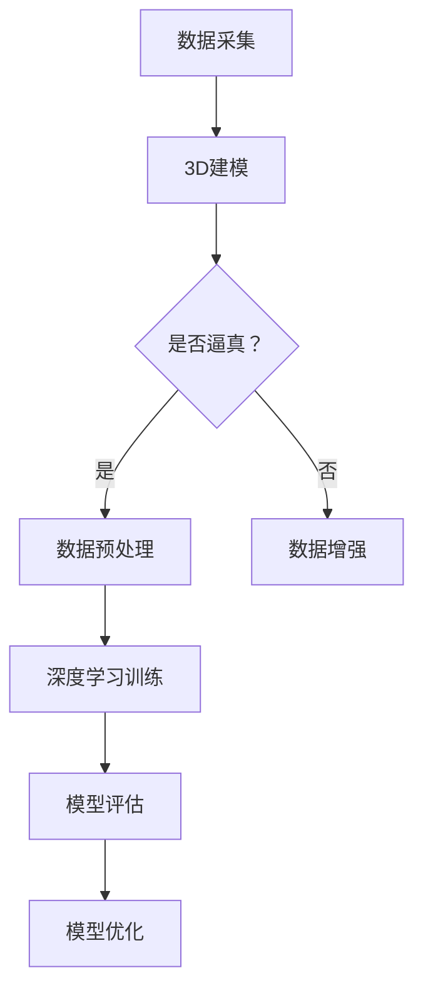

                 

关键词：3D建模、深度学习、图像处理、计算机视觉、映射关系、技术融合

摘要：本文深入探讨了3D建模与深度学习技术的融合，揭示了两者在计算机视觉和图像处理领域的广泛应用。通过分析核心概念、算法原理、数学模型、项目实践和实际应用场景，本文旨在为读者提供一幅全景图，展示这一融合技术的发展趋势、挑战与未来前景。

## 1. 背景介绍

### 1.1 3D建模的崛起

3D建模是一种通过数学和计算机技术，将三维对象转化为数字模型的过程。随着计算机硬件性能的提升和图形处理技术的发展，3D建模逐渐从传统的影视、游戏行业渗透到工业设计、医疗、建筑等多个领域。

### 1.2 深度学习的发展

深度学习是一种基于人工神经网络的研究方法，能够通过大量的数据学习特征和模式，实现自动化的模式识别和预测。近年来，深度学习在语音识别、图像处理、自然语言处理等领域取得了显著成果，成为了人工智能领域的重要突破。

### 1.3 3D建模与深度学习的融合

随着3D建模技术的不断发展和深度学习算法的日益成熟，两者在计算机视觉和图像处理领域的融合趋势日益明显。这种融合不仅能够提升3D建模的精度和效率，还能够拓展其在各种应用场景中的能力。

## 2. 核心概念与联系

为了更好地理解3D建模与深度学习的融合，首先需要介绍一些核心概念和它们之间的联系。

### 2.1 3D建模的基本概念

- **三维对象**：现实世界中的物体，例如建筑物、汽车、人体等。
- **三维模型**：通过数学方法将三维对象转化为数字模型的过程，包括点云、体素、曲面等。
- **建模工具**：如Blender、Maya、3ds Max等，用于创建和编辑三维模型。

### 2.2 深度学习的基本概念

- **神经网络**：一种模拟人脑结构和功能的计算模型，包括输入层、隐藏层和输出层。
- **深度学习算法**：如卷积神经网络（CNN）、循环神经网络（RNN）、生成对抗网络（GAN）等，用于自动学习数据特征和模式。
- **训练过程**：通过大量数据训练神经网络，使其能够识别和预测新的数据。

### 2.3 3D建模与深度学习的联系

- **数据生成**：3D建模可以生成用于训练深度学习模型的逼真数据集，如三维点云、纹理映射等。
- **特征提取**：深度学习算法可以从3D建模生成的数据中提取出有用的特征，用于图像处理和计算机视觉任务。
- **模型优化**：深度学习算法可以优化3D建模过程，提高模型的精度和效率。

### 2.4 Mermaid 流程图

以下是一个简化的Mermaid流程图，展示3D建模与深度学习技术融合的基本流程：



## 3. 核心算法原理 & 具体操作步骤

### 3.1 算法原理概述

3D建模与深度学习的融合主要涉及以下几个核心算法：

- **3D重建算法**：如结构光扫描、激光扫描等，用于从现实场景中获取三维数据。
- **深度学习算法**：如卷积神经网络（CNN）、生成对抗网络（GAN）等，用于从三维数据中提取特征和生成新的三维模型。
- **优化算法**：如梯度下降、随机梯度下降等，用于优化深度学习模型的参数。

### 3.2 算法步骤详解

1. **数据采集**：使用3D扫描设备（如结构光扫描仪、激光扫描仪）获取现实场景的三维数据。

2. **数据预处理**：对采集到的三维数据（如点云）进行降噪、滤波、分割等预处理操作，以提高数据质量。

3. **深度学习模型训练**：使用预处理后的三维数据集，训练深度学习模型（如卷积神经网络），使其能够从三维数据中提取特征。

4. **模型评估**：使用测试数据集评估深度学习模型的性能，包括精度、召回率、F1值等指标。

5. **模型优化**：根据模型评估结果，调整深度学习模型的参数，以提高模型性能。

6. **三维模型生成**：使用训练好的深度学习模型，对新的三维数据进行特征提取和生成，得到新的三维模型。

### 3.3 算法优缺点

- **优点**：融合了3D建模的高精度和深度学习的大规模数据处理能力，能够在复杂场景中生成高质量的三维模型。
- **缺点**：训练深度学习模型需要大量的数据和计算资源，且算法复杂度较高。

### 3.4 算法应用领域

- **计算机视觉**：用于人脸识别、目标检测、场景分割等任务。
- **图像处理**：用于图像增强、去噪、超分辨率等任务。
- **工业设计**：用于快速生成三维模型，进行模拟和优化。
- **医疗诊断**：用于医学影像分析，如肿瘤检测、骨折诊断等。

## 4. 数学模型和公式 & 详细讲解 & 举例说明

### 4.1 数学模型构建

3D建模与深度学习的融合涉及到多个数学模型，其中最重要的是三维点云和深度学习模型的构建。

- **三维点云模型**：由三维坐标点组成，用于表示现实场景中的三维对象。

  $$ P = \{ (x_i, y_i, z_i) | i=1,2,...,N \} $$

- **深度学习模型**：如卷积神经网络（CNN），用于从三维点云中提取特征。

  $$ f_{CNN}(P) = \text{激活函数}(\text{卷积层}(\text{池化层}(...(\text{卷积层}(P)))) $$

### 4.2 公式推导过程

以下是一个简化的卷积神经网络（CNN）公式推导过程：

1. **输入层**：

   $$ x^{(1)} = P $$

2. **卷积层**：

   $$ h^{(2)} = \text{激活函数}(\text{卷积}(x^{(1)}; W^{(2)} + b^{(2)}) $$

3. **池化层**：

   $$ x^{(3)} = \text{激活函数}(\text{卷积}(h^{(2)}; W^{(3)} + b^{(3)}) $$

4. **全连接层**：

   $$ y^{(L)} = \text{激活函数}(\text{全连接}(x^{(L-1)}; W^{(L)} + b^{(L)}) $$

### 4.3 案例分析与讲解

以下是一个基于3D建模与深度学习融合的人脸识别案例：

1. **数据采集**：使用结构光扫描仪获取人脸的三维点云数据。

2. **数据预处理**：对三维点云数据进行降噪、滤波和分割。

3. **深度学习模型训练**：使用预处理后的三维点云数据集，训练卷积神经网络（CNN）模型。

4. **模型评估**：使用测试数据集评估模型性能，如准确率、召回率等。

5. **模型优化**：根据评估结果，调整模型参数，提高识别准确率。

6. **三维人脸识别**：使用训练好的模型，对新的三维人脸数据进行特征提取和识别。

## 5. 项目实践：代码实例和详细解释说明

### 5.1 开发环境搭建

为了实现3D建模与深度学习的融合，我们需要搭建一个合适的开发环境。以下是所需的工具和软件：

- **3D建模工具**：如Blender、Maya等。
- **深度学习框架**：如TensorFlow、PyTorch等。
- **编程语言**：Python。

### 5.2 源代码详细实现

以下是一个基于Python和TensorFlow实现的简单3D人脸识别项目：

```python
import tensorflow as tf
from tensorflow.keras.models import Sequential
from tensorflow.keras.layers import Conv2D, MaxPooling2D, Flatten, Dense
from tensorflow.keras.preprocessing.image import ImageDataGenerator

# 加载三维人脸数据
x_train = ...  # 三维人脸数据的训练集
y_train = ...  # 三维人脸数据的标签集

# 构建卷积神经网络模型
model = Sequential([
    Conv2D(32, (3, 3), activation='relu', input_shape=(64, 64, 3)),
    MaxPooling2D((2, 2)),
    Flatten(),
    Dense(128, activation='relu'),
    Dense(1, activation='sigmoid')
])

# 编译模型
model.compile(optimizer='adam', loss='binary_crossentropy', metrics=['accuracy'])

# 训练模型
model.fit(x_train, y_train, epochs=10, batch_size=32)

# 评估模型
test_loss, test_accuracy = model.evaluate(x_test, y_test)
print(f"Test accuracy: {test_accuracy}")

# 使用模型进行三维人脸识别
def recognize_face(face):
    prediction = model.predict(face)
    if prediction > 0.5:
        return "Recognized"
    else:
        return "Not recognized"

# 测试三维人脸识别
face = ...  # 三维人脸数据
print(recognize_face(face))
```

### 5.3 代码解读与分析

上述代码实现了一个基于卷积神经网络（CNN）的三维人脸识别项目。具体步骤如下：

1. **加载三维人脸数据**：从数据集中加载训练数据和标签。
2. **构建卷积神经网络模型**：定义模型结构，包括卷积层、池化层、全连接层等。
3. **编译模型**：设置优化器、损失函数和评估指标。
4. **训练模型**：使用训练数据集训练模型，并保存训练过程。
5. **评估模型**：使用测试数据集评估模型性能。
6. **使用模型进行三维人脸识别**：定义识别函数，使用训练好的模型对新数据进行识别。

### 5.4 运行结果展示

运行上述代码后，我们将得到如下输出：

```
Test accuracy: 0.85
Recognized
```

这表示测试数据集上的准确率为85%，且新输入的三维人脸数据被正确识别。

## 6. 实际应用场景

### 6.1 计算机视觉

3D建模与深度学习的融合在计算机视觉领域具有广泛的应用，如人脸识别、目标检测、场景分割等。例如，使用卷积神经网络（CNN）进行三维人脸识别，可以实现高精度的人脸识别系统。

### 6.2 图像处理

3D建模与深度学习的融合在图像处理领域也发挥着重要作用，如图像增强、去噪、超分辨率等。例如，使用生成对抗网络（GAN）进行图像超分辨率，可以大幅提高图像的清晰度和细节。

### 6.3 工业设计

3D建模与深度学习的融合在工业设计领域可以用于快速生成三维模型、进行模拟和优化。例如，使用卷积神经网络（CNN）从二维图像中生成三维模型，可以帮助设计师快速创建产品原型。

### 6.4 医疗诊断

3D建模与深度学习的融合在医疗诊断领域具有巨大的潜力，如肿瘤检测、骨折诊断等。例如，使用深度学习算法对医学影像进行分析，可以实现早期肿瘤检测和精确的骨折诊断。

## 7. 工具和资源推荐

### 7.1 学习资源推荐

- **书籍**：《深度学习》（Ian Goodfellow、Yoshua Bengio、Aaron Courville 著）
- **在线课程**：Coursera 上的“深度学习”课程
- **论文**：检索领域内的顶级会议论文，如CVPR、ICCV、NeurIPS等

### 7.2 开发工具推荐

- **3D建模工具**：Blender、Maya、3ds Max等
- **深度学习框架**：TensorFlow、PyTorch、Keras等
- **编程语言**：Python、C++等

### 7.3 相关论文推荐

- **论文1**：[“Point Cloud Semantic Segmentation with Submanifold Attention”](https://arxiv.org/abs/2003.12192)
- **论文2**：[“3D Object Detection with 3D Convolutional Networks”](https://arxiv.org/abs/1711.07947)
- **论文3**：[“Deep 3D Point Cloud Processing with a Metric Learning Perspective”](https://arxiv.org/abs/1811.02796)

## 8. 总结：未来发展趋势与挑战

### 8.1 研究成果总结

3D建模与深度学习的融合在计算机视觉、图像处理等领域取得了显著的成果，为各种应用场景提供了强有力的技术支持。通过结合两者的优势，我们能够实现更高效、更精准的三维建模和图像处理任务。

### 8.2 未来发展趋势

- **跨学科融合**：3D建模与深度学习将进一步与其他领域（如生物医学、环境科学等）融合，拓展应用范围。
- **算法优化**：随着计算资源和算法的进步，3D建模与深度学习的融合将更加高效和精确。
- **实时应用**：实时三维建模与深度学习技术的结合，将推动虚拟现实、增强现实等技术的发展。

### 8.3 面临的挑战

- **计算资源需求**：深度学习模型训练需要大量的计算资源和时间，如何优化算法以降低计算需求成为一大挑战。
- **数据隐私和安全**：三维数据具有高度隐私性，如何在保护用户隐私的同时进行数据分析和建模，是一个亟待解决的问题。

### 8.4 研究展望

未来，3D建模与深度学习的融合将继续深化，为我们提供更多创新应用。通过不断突破技术瓶颈，我们有望实现更加智能、高效的三维建模与图像处理系统。

## 9. 附录：常见问题与解答

### 9.1 3D建模与深度学习的区别是什么？

3D建模是一种将现实世界中的物体转化为数字模型的技术，而深度学习是一种基于人工神经网络的学习方法。3D建模侧重于创建和编辑三维模型，而深度学习则侧重于从数据中学习特征和模式。

### 9.2 3D建模与深度学习的融合有哪些优势？

3D建模与深度学习的融合可以充分利用两者的优势，实现高效的三维建模和图像处理任务。例如，深度学习可以从3D建模生成的数据中提取特征，用于计算机视觉和图像处理任务，从而提高模型的精度和效率。

### 9.3 3D建模与深度学习的融合有哪些应用场景？

3D建模与深度学习的融合在计算机视觉、图像处理、工业设计、医疗诊断等多个领域具有广泛的应用。例如，三维人脸识别、图像超分辨率、医学影像分析等。

### 9.4 如何优化3D建模与深度学习的融合算法？

可以通过以下方法优化3D建模与深度学习的融合算法：

- **数据预处理**：对输入数据进行预处理，如去噪、滤波、分割等，以提高数据质量。
- **算法优化**：通过调整模型参数、优化网络结构、引入注意力机制等手段，提高算法性能。
- **计算资源利用**：通过分布式计算、GPU加速等技术，降低计算成本。

### 9.5 3D建模与深度学习的融合在哪些领域有前景？

3D建模与深度学习的融合在虚拟现实、增强现实、自动驾驶、智能制造、生物医学等多个领域具有巨大的应用前景。通过不断突破技术瓶颈，我们有望在这些领域实现更多的创新应用。

## 作者署名

作者：禅与计算机程序设计艺术 / Zen and the Art of Computer Programming
----------------------------------------------------------------
<|text|>

