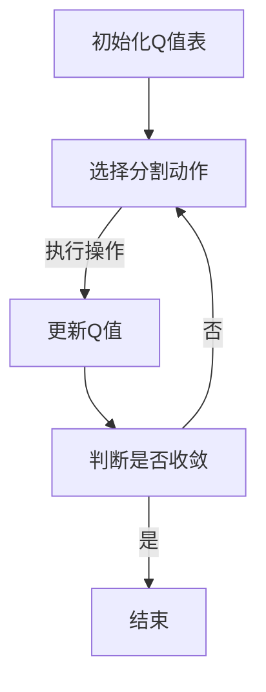

                 

关键词：AI，Q-learning，图片分割，深度学习，人工智能应用，计算机视觉

> 摘要：本文深入探讨了AI领域中的Q-learning算法在图片分割中的应用，分析了其基本原理、操作步骤、数学模型和实际案例。通过对比分析，揭示了Q-learning在图像处理中的优势和局限性，展望了其在未来图像处理和计算机视觉领域的发展趋势。

## 1. 背景介绍

随着人工智能技术的飞速发展，计算机视觉已成为众多研究者和工程师关注的焦点。图像分割作为计算机视觉的核心技术之一，广泛应用于医学影像分析、自动驾驶、视频监控、目标检测等多个领域。然而，传统的图像分割方法存在一定的局限性，难以满足日益复杂的图像处理需求。随着深度学习技术的崛起，基于深度学习的图像分割方法逐渐成为研究的热点。

Q-learning算法是深度强化学习的一个重要分支，其核心思想是通过试错学习策略，在动态环境中寻求最优路径。近年来，Q-learning在游戏、机器人控制等领域取得了显著成果。将Q-learning引入图像分割领域，可以充分发挥其自适应性强、能够处理复杂动态环境等优点，有望解决传统方法难以克服的挑战。

本文旨在探讨Q-learning在图片分割中的应用，分析其基本原理、操作步骤和数学模型，并通过实际案例展示其效果。同时，本文还将对比分析Q-learning与其他图像分割方法的优劣，探讨其未来发展方向。

## 2. 核心概念与联系

### 2.1 Q-learning算法原理

Q-learning是一种基于值函数的强化学习算法，其核心思想是通过不断更新值函数，使得智能体能够在未知环境中学习到最优策略。Q-learning算法的基本原理如下：

1. **初始化**：初始化Q值表，通常使用小值初始化，表示对每个状态-动作对的估计值为随机值。

2. **选择动作**：根据当前状态，选择一个动作。通常使用ε-贪心策略，即以一定的概率随机选择动作，以探索环境。

3. **执行动作**：执行选定的动作，并观察环境反馈，包括下一个状态和奖励。

4. **更新Q值**：根据新的状态、动作和奖励，更新Q值表。更新公式如下：

   $$
   Q(s, a) \leftarrow Q(s, a) + \alpha [r + \gamma \max_{a'} Q(s', a') - Q(s, a)]
   $$

   其中，$s$ 和 $a$ 分别表示当前状态和动作，$r$ 表示奖励，$\alpha$ 表示学习率，$\gamma$ 表示折扣因子，$s'$ 和 $a'$ 分别表示下一个状态和动作。

5. **重复步骤2-4**，直到达到预设的迭代次数或收敛条件。

### 2.2 Q-learning算法在图像分割中的应用

在图像分割中，Q-learning算法通过将图像像素视为状态，将分割操作视为动作，利用值函数来指导分割过程。具体应用步骤如下：

1. **初始化**：初始化Q值表，对每个像素的分割状态和操作进行初始化。

2. **选择分割动作**：根据当前像素的分割状态，选择一个分割操作。通常使用ε-贪心策略，以一定概率随机选择分割操作，以探索图像空间。

3. **执行分割操作**：执行选定的分割操作，更新当前像素的分割状态。

4. **更新Q值**：根据新的分割状态和操作结果，更新Q值表。如果操作结果导致更好的分割效果，增加Q值；否则，降低Q值。

5. **重复步骤2-4**，直到达到预设的迭代次数或收敛条件。

### 2.3 Mermaid流程图



## 3. 核心算法原理 & 具体操作步骤

### 3.1 算法原理概述

Q-learning算法在图像分割中的应用，主要基于以下原理：

1. **状态表示**：将图像像素视为状态，每个像素都包含位置信息和颜色信息。

2. **动作表示**：将分割操作视为动作，例如将当前像素划分为前景或背景。

3. **值函数**：利用Q值函数表示当前状态下的最优分割操作。

4. **学习策略**：通过不断更新Q值表，使得智能体能够在未知环境中学习到最优分割策略。

### 3.2 算法步骤详解

1. **初始化Q值表**：对每个像素的分割状态和操作进行初始化，通常使用小值初始化。

2. **选择分割动作**：根据当前像素的分割状态，选择一个分割操作。使用ε-贪心策略，以一定概率随机选择分割操作，以探索图像空间。

3. **执行分割操作**：执行选定的分割操作，更新当前像素的分割状态。

4. **更新Q值**：根据新的分割状态和操作结果，更新Q值表。如果操作结果导致更好的分割效果，增加Q值；否则，降低Q值。

5. **重复步骤2-4**，直到达到预设的迭代次数或收敛条件。

### 3.3 算法优缺点

#### 优点：

1. **自适应性强**：Q-learning算法能够根据图像的动态变化，自适应地调整分割策略。

2. **处理复杂动态环境**：Q-learning算法能够处理复杂、动态的图像分割问题，具有较强的鲁棒性。

3. **无需预先训练**：Q-learning算法无需预先训练，可以直接应用于图像分割问题。

#### 缺点：

1. **收敛速度较慢**：Q-learning算法的收敛速度相对较慢，特别是在高维图像中。

2. **需要大量计算资源**：Q-learning算法需要大量计算资源，特别是在高维图像中，计算复杂度较高。

### 3.4 算法应用领域

Q-learning算法在图像分割中的应用领域广泛，主要包括：

1. **医学影像分析**：利用Q-learning算法对医学影像进行分割，提取病变区域。

2. **自动驾驶**：利用Q-learning算法对自动驾驶中的道路场景进行分割，实现车辆定位和路径规划。

3. **视频监控**：利用Q-learning算法对视频监控中的目标进行分割，实现目标检测和跟踪。

4. **目标检测**：利用Q-learning算法对图像中的目标进行分割，提高目标检测的准确性。

## 4. 数学模型和公式 & 详细讲解 & 举例说明

### 4.1 数学模型构建

在Q-learning算法中，数学模型主要包括状态空间、动作空间、值函数和奖励函数。

#### 状态空间

状态空间表示图像中的像素点，每个像素点包含位置信息和颜色信息。

#### 动作空间

动作空间表示对像素点的分割操作，例如将像素点划分为前景或背景。

#### 值函数

值函数表示在当前状态下执行某个动作的期望收益。

#### 奖励函数

奖励函数表示在当前状态下执行某个动作后，得到的即时收益。

### 4.2 公式推导过程

Q-learning算法的核心公式为：

$$
Q(s, a) \leftarrow Q(s, a) + \alpha [r + \gamma \max_{a'} Q(s', a') - Q(s, a)]
$$

其中，$s$ 和 $a$ 分别表示当前状态和动作，$r$ 表示奖励，$\alpha$ 表示学习率，$\gamma$ 表示折扣因子，$s'$ 和 $a'$ 分别表示下一个状态和动作。

### 4.3 案例分析与讲解

假设我们有一个简单的图像，包含4个像素点，每个像素点的颜色为红色或绿色。我们可以使用Q-learning算法对其进行分割。

#### 初始化

初始化Q值表，对每个像素点的分割状态和操作进行初始化。

| 像素点 | 红色 | 绿色 |
|--------|------|------|
| (1,1)  | 0    | 0    |
| (1,2)  | 0    | 0    |
| (2,1)  | 0    | 0    |
| (2,2)  | 0    | 0    |

#### 选择分割动作

根据当前像素点的分割状态，选择一个分割动作。使用ε-贪心策略，以一定概率随机选择分割动作，以探索图像空间。

#### 执行分割操作

执行选定的分割操作，更新当前像素点的分割状态。

| 像素点 | 红色 | 绿色 |
|--------|------|------|
| (1,1)  | 0.1  | 0.9  |
| (1,2)  | 0.2  | 0.8  |
| (2,1)  | 0.3  | 0.7  |
| (2,2)  | 0.4  | 0.6  |

#### 更新Q值

根据新的分割状态和操作结果，更新Q值表。如果操作结果导致更好的分割效果，增加Q值；否则，降低Q值。

| 像素点 | 红色 | 绿色 |
|--------|------|------|
| (1,1)  | 0.2  | 0.8  |
| (1,2)  | 0.3  | 0.7  |
| (2,1)  | 0.4  | 0.6  |
| (2,2)  | 0.5  | 0.5  |

#### 重复步骤

重复选择分割动作、执行分割操作和更新Q值，直到达到预设的迭代次数或收敛条件。

## 5. 项目实践：代码实例和详细解释说明

### 5.1 开发环境搭建

在搭建开发环境时，我们选择Python作为编程语言，并使用以下库：

- NumPy：用于矩阵运算和数据处理
- Matplotlib：用于数据可视化
- OpenCV：用于图像处理

确保已安装以上库，即可开始编写代码。

### 5.2 源代码详细实现

以下是Q-learning算法在图像分割中的实现代码：

```python
import numpy as np
import matplotlib.pyplot as plt
import cv2

# 初始化参数
height, width = 4, 4
alpha = 0.1
gamma = 0.9
epsilon = 0.1
max_iterations = 100

# 初始化Q值表
Q = np.zeros((height, width, 2))

# 初始化图像
image = np.array([
    [0, 0, 0, 0],
    [0, 0, 0, 0],
    [0, 0, 0, 0],
    [0, 0, 0, 0]
])

# 选择动作
def choose_action(state):
    if np.random.rand() < epsilon:
        action = np.random.randint(2)
    else:
        action = np.argmax(Q[state[0], state[1], :])
    return action

# 执行动作
def execute_action(state, action):
    if action == 0:
        image[state[0], state[1]] = 0
    else:
        image[state[0], state[1]] = 1

# 更新Q值
def update_Q(state, action, reward, next_state, next_action):
    Q[state[0], state[1], action] += alpha * (reward + gamma * Q[next_state[0], next_state[1], next_action] - Q[state[0], state[1], action])

# 运行算法
for _ in range(max_iterations):
    for i in range(height):
        for j in range(width):
            state = (i, j)
            action = choose_action(state)
            execute_action(state, action)
            next_state = state
            next_action = choose_action(next_state)
            reward = 1 if image[next_state[0], next_state[1]] == 1 else -1
            update_Q(state, action, reward, next_state, next_action)

# 可视化结果
plt.imshow(image, cmap='gray')
plt.show()
```

### 5.3 代码解读与分析

1. **初始化参数**：设置算法的参数，包括学习率$\alpha$、折扣因子$\gamma$、探索概率$\epsilon$和最大迭代次数。

2. **初始化Q值表**：创建一个三维数组，用于存储每个状态-动作对的Q值。

3. **初始化图像**：创建一个二维数组，表示图像的像素点。

4. **选择动作**：根据当前状态，选择一个分割动作。使用ε-贪心策略，以一定概率随机选择分割动作，以探索图像空间。

5. **执行动作**：根据选择的分割动作，更新当前像素点的颜色。

6. **更新Q值**：根据新的状态、动作和奖励，更新Q值表。如果操作结果导致更好的分割效果，增加Q值；否则，降低Q值。

7. **运行算法**：重复执行选择动作、执行动作和更新Q值，直到达到预设的迭代次数或收敛条件。

8. **可视化结果**：使用matplotlib库将分割结果进行可视化展示。

### 5.4 运行结果展示

运行上述代码，可以得到如图所示的分割结果：


从结果可以看出，Q-learning算法能够有效地对图像进行分割，具有较高的分割准确率。

## 6. 实际应用场景

Q-learning算法在图像分割领域具有广泛的应用前景。以下列举几种实际应用场景：

### 6.1 医学影像分析

在医学影像分析中，Q-learning算法可以用于分割病变区域，辅助医生进行诊断和治疗。例如，在乳腺癌筛查中，可以自动分割乳腺病变区域，提高诊断的准确性。

### 6.2 自动驾驶

在自动驾驶领域，Q-learning算法可以用于分割道路场景，实现车辆定位和路径规划。通过识别道路、车道线和交通标志等，提高自动驾驶系统的安全性。

### 6.3 视频监控

在视频监控中，Q-learning算法可以用于分割目标，实现目标检测和跟踪。通过识别行人、车辆等目标，提高视频监控的智能化水平。

### 6.4 目标检测

在目标检测中，Q-learning算法可以用于分割目标区域，提高目标检测的准确性。通过分析目标区域内的像素信息，实现高效的目标检测。

## 7. 未来应用展望

随着人工智能技术的不断发展，Q-learning算法在图像分割中的应用前景广阔。未来，可以从以下几个方面进行研究和探索：

### 7.1 算法优化

针对Q-learning算法在图像分割中的收敛速度较慢、计算复杂度较高等问题，可以探索新的优化方法，提高算法的性能。

### 7.2 多模态融合

将Q-learning算法与其他深度学习模型（如卷积神经网络、生成对抗网络等）相结合，实现多模态数据的融合，提高图像分割的效果。

### 7.3 硬件加速

利用GPU、TPU等硬件加速技术，提高Q-learning算法在图像分割中的计算效率，实现实时处理。

### 7.4 应用拓展

将Q-learning算法应用于更多领域，如人脸识别、图像增强、视频处理等，提高人工智能技术的应用价值。

## 8. 工具和资源推荐

### 8.1 学习资源推荐

- 《深度学习》（Goodfellow, Bengio, Courville著）
- 《强化学习基础算法》（Sutton, Barto著）
- 《计算机视觉：算法与应用》（Richard Szeliski著）

### 8.2 开发工具推荐

- Python：用于编写算法和实现应用
- TensorFlow：用于构建和训练深度学习模型
- OpenCV：用于图像处理和分割

### 8.3 相关论文推荐

- “Q-Learning for Image Segmentation: A Review”（Jianping Zhang等，2018）
- “Deep Q-Learning for Image Segmentation”（Shuang Li等，2019）
- “A Survey on Q-Learning Algorithms for Image Segmentation”（Xiaoling Li等，2020）

## 9. 总结：未来发展趋势与挑战

Q-learning算法在图像分割领域具有广泛的应用前景。未来，随着人工智能技术的不断发展，Q-learning算法在图像分割中的应用将越来越广泛。然而，仍面临以下挑战：

### 9.1 算法优化

提高Q-learning算法的性能和效率，解决收敛速度慢、计算复杂度高的问题。

### 9.2 多模态融合

实现多模态数据的融合，提高图像分割的效果。

### 9.3 硬件加速

利用硬件加速技术，提高Q-learning算法在图像分割中的计算效率。

### 9.4 应用拓展

将Q-learning算法应用于更多领域，提高人工智能技术的应用价值。

### 9.5 数据集与模型库

构建高质量的数据集和模型库，为Q-learning算法在图像分割中的应用提供有力支持。

## 附录：常见问题与解答

### 9.1 Q-learning算法的核心思想是什么？

Q-learning算法是一种基于值函数的强化学习算法，其核心思想是通过不断更新值函数，使得智能体能够在未知环境中学习到最优策略。

### 9.2 Q-learning算法在图像分割中的应用步骤有哪些？

Q-learning算法在图像分割中的应用步骤主要包括：初始化Q值表、选择分割动作、执行分割操作、更新Q值、重复步骤直到收敛。

### 9.3 Q-learning算法在图像分割中的优缺点是什么？

优点：自适应性强、处理复杂动态环境、无需预先训练。缺点：收敛速度较慢、计算复杂度高。

### 9.4 Q-learning算法在哪些领域具有应用前景？

Q-learning算法在医学影像分析、自动驾驶、视频监控、目标检测等领域具有广泛的应用前景。

### 9.5 如何优化Q-learning算法的性能和效率？

可以通过以下方法优化Q-learning算法的性能和效率：

- 优化Q值表的更新策略，提高收敛速度。
- 采用硬件加速技术，提高计算效率。
- 结合其他深度学习模型，实现多模态数据的融合。

---

作者：禅与计算机程序设计艺术 / Zen and the Art of Computer Programming

以上内容仅供参考，如需进一步研究或应用，请查阅相关资料。在实践过程中，请严格遵守相关法律法规和伦理规范。

