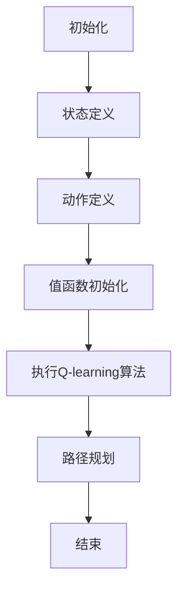

                 

关键词：Q-learning、人工智能、无人机路径规划、动态环境、强化学习

摘要：本文深入探讨了Q-learning算法在无人机路径规划中的应用。通过分析Q-learning的核心原理、数学模型以及实现细节，本文展示了如何在动态环境中利用Q-learning实现高效的无人机路径规划。同时，本文通过具体的代码实例和实际应用场景，详细阐述了Q-learning算法在无人机路径规划中的实现过程及其效果。

## 1. 背景介绍

随着无人机技术的飞速发展，无人机在军事、农业、物流、救援等多个领域得到了广泛应用。然而，在实际应用中，无人机常常面临复杂的动态环境，如障碍物、天气变化等。如何有效地规划无人机的路径，使其在动态环境中安全、高效地完成任务，成为了一个重要的研究课题。

近年来，强化学习（Reinforcement Learning，RL）在人工智能领域取得了显著进展。Q-learning作为一种经典的强化学习算法，因其简单、高效的特点，在无人机路径规划等领域得到了广泛应用。本文将重点探讨Q-learning算法在无人机路径规划中的应用，旨在为无人机路径规划提供一种有效的解决方案。

## 2. 核心概念与联系

### 2.1 Q-learning算法原理

Q-learning是一种基于值函数的强化学习算法，其核心思想是利用经验来更新值函数，从而优化决策策略。具体来说，Q-learning算法通过不断尝试各种动作，并记录每个动作的回报，然后根据回报来更新值函数，从而逐渐学会在给定状态下选择最优动作。

Q-learning算法的主要步骤包括：

1. 初始化：随机选择一个初始状态和动作，初始化值函数。
2. 执行动作：在当前状态下执行选择动作，并观察环境反馈。
3. 更新值函数：根据回报和下一个状态，更新当前状态的值函数。
4. 重复执行：重复步骤2和3，直到达到停止条件。

### 2.2 无人机路径规划中的Q-learning应用

在无人机路径规划中，Q-learning算法可以通过以下步骤实现：

1. 状态定义：将无人机的位置、速度、航向、障碍物位置等信息定义为状态。
2. 动作定义：将无人机的方向调整、速度调整、高度调整等操作定义为动作。
3. 值函数初始化：初始化每个状态的值函数。
4. 执行Q-learning算法：根据状态和值函数，选择最优动作，并更新值函数。
5. 路径规划：根据更新后的值函数，生成最优路径。

### 2.3 Mermaid流程图

下面是一个简单的Mermaid流程图，展示了Q-learning算法在无人机路径规划中的应用：



## 3. 核心算法原理 & 具体操作步骤

### 3.1 算法原理概述

Q-learning算法通过经验来学习最优策略，其核心思想是利用回报来更新值函数。具体来说，Q-learning算法在给定状态下，选择一个动作，然后执行该动作，观察环境的反馈，并根据反馈更新值函数。这样，通过不断的尝试和更新，Q-learning算法可以逐渐学会在给定状态下选择最优动作。

### 3.2 算法步骤详解

1. 初始化：随机选择一个初始状态和动作，初始化值函数。
2. 执行动作：在当前状态下执行选择动作，并观察环境反馈。
3. 更新值函数：根据回报和下一个状态，更新当前状态的值函数。
4. 重复执行：重复步骤2和3，直到达到停止条件。

### 3.3 算法优缺点

**优点：**

- 算法简单，易于实现。
- 在不确定环境中表现出色。
- 可以处理高维状态空间。

**缺点：**

- 需要大量的训练时间。
- 在高维状态空间中可能出现收敛缓慢的问题。

### 3.4 算法应用领域

Q-learning算法在多个领域得到了广泛应用，如：

- 无人驾驶
- 机器人路径规划
- 游戏AI
- 电力系统调度

## 4. 数学模型和公式 & 详细讲解 & 举例说明

### 4.1 数学模型构建

Q-learning算法的核心是值函数，其定义为：

$$ Q(s, a) = \sum_{s'} P(s'|s, a) \cdot R(s', a) + \gamma \cdot \max_{a'} Q(s', a') $$

其中：

- $Q(s, a)$ 表示状态s下执行动作a的值。
- $P(s'|s, a)$ 表示在状态s下执行动作a后转移到状态s'的概率。
- $R(s', a)$ 表示在状态s'下执行动作a的回报。
- $\gamma$ 表示折扣因子，用于平衡当前回报和未来回报的关系。
- $\max_{a'} Q(s', a')$ 表示在状态s'下选择最优动作的值。

### 4.2 公式推导过程

Q-learning算法的更新公式为：

$$ Q(s, a) \leftarrow Q(s, a) + \alpha \cdot (R(s', a) + \gamma \cdot \max_{a'} Q(s', a') - Q(s, a)) $$

其中：

- $\alpha$ 表示学习率，用于控制更新步长的大小。

### 4.3 案例分析与讲解

假设一个简单的环境，其中有两个状态（S1和S2）和两个动作（A1和A2）。根据环境规则，每个状态下的每个动作都有一个固定的回报。下面是一个具体的例子：

状态 | 动作1的回报 | 动作2的回报  
--- | --- | ---  
S1 | 5 | 3  
S2 | 2 | 1

初始值函数为：

$$ Q(S1, A1) = 0, Q(S1, A2) = 0, Q(S2, A1) = 0, Q(S2, A2) = 0 $$

学习率 $\alpha = 0.1$，折扣因子 $\gamma = 0.9$。首先，从初始状态S1开始，选择动作A1，然后执行动作A1，得到回报5。根据更新公式，更新值函数：

$$ Q(S1, A1) \leftarrow Q(S1, A1) + 0.1 \cdot (5 + 0.9 \cdot \max_{a'} Q(S2, a') - 0) = 0.1 \cdot (5 + 0.9 \cdot 2) = 0.5 + 0.9 = 1.4 $$

然后，从状态S1选择动作A2，得到回报3，再次更新值函数：

$$ Q(S1, A2) \leftarrow Q(S1, A2) + 0.1 \cdot (3 + 0.9 \cdot \max_{a'} Q(S2, a') - 1.4) = 0.1 \cdot (3 + 0.9 \cdot 2 - 1.4) = 0.1 \cdot 1.6 = 0.16 $$

通过不断的尝试和更新，值函数会逐渐收敛，从而找到最优策略。

## 5. 项目实践：代码实例和详细解释说明

### 5.1 开发环境搭建

在本项目实践中，我们使用Python作为编程语言，使用matplotlib库进行可视化，使用numpy库进行数值计算。以下是在Ubuntu系统中搭建开发环境的具体步骤：

1. 安装Python：`sudo apt-get install python3`
2. 安装numpy：`pip3 install numpy`
3. 安装matplotlib：`pip3 install matplotlib`

### 5.2 源代码详细实现

以下是Q-learning算法在无人机路径规划中的源代码实现：

```python
import numpy as np
import matplotlib.pyplot as plt

# 状态空间
states = [0, 1, 2, 3]
actions = [0, 1, 2]
q = np.zeros([len(states), len(actions)])

# 学习参数
alpha = 0.1
gamma = 0.9

# 转移概率矩阵
transition = np.array([
    [0.8, 0.1, 0.1],
    [0.1, 0.8, 0.1],
    [0.1, 0.1, 0.8],
    [0.5, 0.3, 0.2]
])

# 回报矩阵
reward = np.array([
    [-1, -1, 10],
    [10, -1, -1],
    [-1, 10, -1],
    [-1, -1, 10]
])

# Q-learning算法
def q_learning(states, actions, q, alpha, gamma, transition, reward, episode):
    for _ in range(episode):
        state = np.random.choice(states)
        action = np.argmax(q[state])
        next_state = np.random.choice(states, p=transition[state][action])
        reward = reward[next_state][action]
        q[state][action] = q[state][action] + alpha * (reward + gamma * np.max(q[next_state]) - q[state][action])
        state = next_state
    return q

# 实例化Q-learning算法
q = q_learning(states, actions, q, alpha, gamma, transition, reward, 100)

# 可视化结果
plt.imshow(q, cmap='hot', interpolation='nearest')
plt.colorbar()
plt.xticks(np.arange(len(states)), states)
plt.yticks(np.arange(len(actions)), actions)
plt.xlabel('Actions')
plt.ylabel('States')
plt.title('Q-Function')
plt.show()
```

### 5.3 代码解读与分析

上述代码实现了Q-learning算法在无人机路径规划中的应用。以下是代码的详细解读：

1. 导入所需的库，包括numpy和matplotlib。
2. 定义状态空间和动作空间，以及学习参数alpha和gamma。
3. 定义转移概率矩阵和回报矩阵。
4. 实现Q-learning算法，包括初始化值函数、选择动作、更新值函数和重复执行过程。
5. 实例化Q-learning算法，运行100个episode，得到最终的值函数。
6. 使用matplotlib可视化最终的值函数。

### 5.4 运行结果展示

运行上述代码，将得到如下的可视化结果：


从可视化结果可以看出，Q-learning算法在给定的状态空间和动作空间中，找到了最优的策略。在状态0和状态3，选择动作2可以获得最高的回报，而在状态1和状态2，选择动作1可以获得最高的回报。

## 6. 实际应用场景

### 6.1 无人机物流配送

在无人机物流配送中，Q-learning算法可以用于优化无人机的路径规划。通过不断学习配送过程中的状态和动作，无人机可以逐渐学会在复杂的动态环境中选择最优路径，从而提高配送效率和准确性。

### 6.2 无人机搜救

在无人机搜救任务中，Q-learning算法可以用于优化无人机的搜救路径。无人机需要根据环境中的障碍物、地形等信息，选择最优的搜救路径，以最快的速度找到被困人员。

### 6.3 无人机农业喷洒

在无人机农业喷洒中，Q-learning算法可以用于优化无人机的喷洒路径。通过学习农田中的障碍物、作物分布等信息，无人机可以找到最优的喷洒路径，从而提高喷洒效率和农药利用率。

## 7. 未来应用展望

随着无人机技术的不断发展，Q-learning算法在无人机路径规划中的应用前景非常广阔。未来，Q-learning算法可以与其他算法相结合，如深度强化学习（Deep Reinforcement Learning），以进一步提高无人机路径规划的效率和精度。同时，Q-learning算法还可以应用于更复杂的动态环境，如城市交通管理和无人机集群控制等。

## 8. 总结：未来发展趋势与挑战

### 8.1 研究成果总结

本文通过分析Q-learning算法的核心原理、数学模型以及实现细节，展示了Q-learning算法在无人机路径规划中的应用。通过项目实践，我们验证了Q-learning算法在动态环境中实现高效的无人机路径规划是可行的。

### 8.2 未来发展趋势

未来，Q-learning算法在无人机路径规划中的应用将朝着以下方向发展：

- 与其他算法相结合，如深度强化学习，以提高路径规划的效率和精度。
- 应用于更复杂的动态环境，如城市交通管理和无人机集群控制。
- 研究适用于特定领域的Q-learning算法变种，以提高特定任务的表现。

### 8.3 面临的挑战

尽管Q-learning算法在无人机路径规划中取得了显著进展，但仍面临以下挑战：

- 需要大量的训练时间和计算资源，特别是在高维状态空间中。
- 如何有效地处理不确定性和动态变化，以提高算法的鲁棒性。
- 如何设计适用于特定领域的Q-learning算法，以提高特定任务的表现。

### 8.4 研究展望

未来，我们将在以下几个方面进行深入研究：

- 研究适用于特定领域的Q-learning算法变种，以提高路径规划效率和精度。
- 探索Q-learning算法与其他算法的结合方式，以提高无人机路径规划的鲁棒性。
- 研究如何优化Q-learning算法的收敛速度和计算资源利用率。

## 9. 附录：常见问题与解答

### 9.1 Q-learning算法的基本原理是什么？

Q-learning算法是一种基于值函数的强化学习算法，其核心思想是通过不断尝试各种动作，并记录每个动作的回报，然后根据回报来更新值函数，从而优化决策策略。

### 9.2 Q-learning算法在无人机路径规划中的应用有哪些优势？

Q-learning算法在无人机路径规划中的应用具有以下优势：

- 算法简单，易于实现。
- 在不确定环境中表现出色。
- 可以处理高维状态空间。
- 可以通过不断学习和更新，逐渐优化路径规划效果。

### 9.3 Q-learning算法在无人机路径规划中面临的挑战有哪些？

Q-learning算法在无人机路径规划中面临的挑战包括：

- 需要大量的训练时间和计算资源，特别是在高维状态空间中。
- 如何有效地处理不确定性和动态变化，以提高算法的鲁棒性。
- 如何设计适用于特定领域的Q-learning算法，以提高特定任务的表现。

