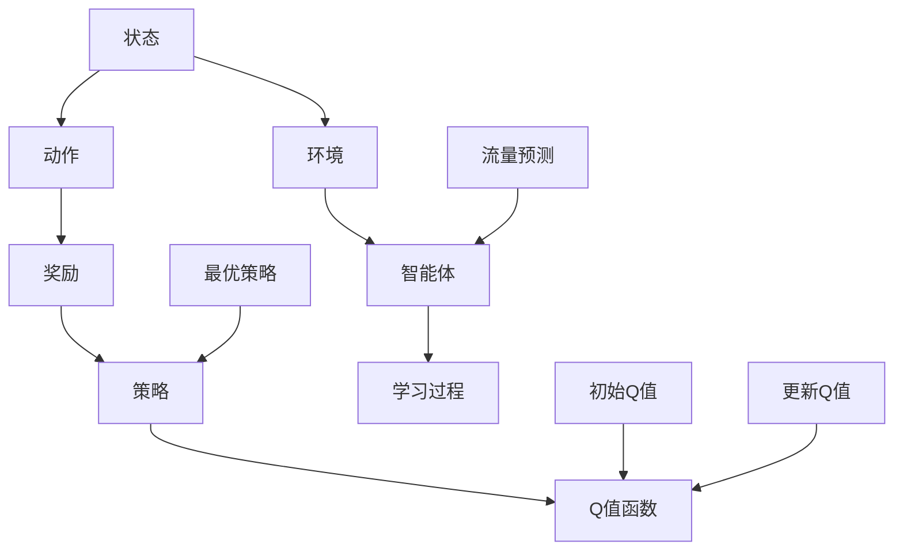

                 

## 摘要

本文旨在探讨人工智能（AI）中的Q-learning算法在流量预测领域的应用。随着互联网技术的飞速发展，网络流量的预测变得日益重要，这不仅有助于网络运营商优化资源分配，还能提升用户体验。Q-learning作为强化学习的一种经典算法，通过不断学习环境和策略之间的最优映射，在流量预测任务中展现出了显著的效果。本文将首先介绍Q-learning算法的基本原理和核心步骤，然后通过实际案例详细讲解其在流量预测中的应用，最后探讨未来发展趋势和面临的挑战。

## 1. 背景介绍

### 1.1 网络流量预测的重要性

网络流量预测是现代通信网络管理和优化的一项重要任务。准确预测网络流量不仅能帮助网络运营商预先了解用户需求，还能有效避免网络拥塞和资源浪费。随着云计算、大数据、物联网等新兴技术的广泛应用，网络流量的复杂性和动态性也日益增加。传统的方法如统计模型和机器学习方法在处理高维度和动态变化的流量数据时往往力不从心。因此，探索新的预测方法，特别是结合人工智能技术的预测方法，成为了当前研究的热点。

### 1.2 Q-learning算法简介

Q-learning是强化学习（Reinforcement Learning）中的一种算法，由理查德·萨顿（Richard Sutton）和安德鲁·巴肖（Andrew Barto）在1988年提出。强化学习是一种通过智能体（agent）与环境的交互来学习最优策略的机器学习方法。在Q-learning中，智能体通过不断地尝试（即选择动作）并从环境中获取奖励，逐渐更新其策略，以实现长期累积奖励的最大化。

Q-learning算法的核心思想是通过一个Q值函数来评估每种动作的价值，Q值函数定义为状态-动作值函数，即给定某个状态，选择某个动作能够带来的预期奖励。通过不断更新Q值函数，智能体可以学习到在不同的状态选择何种动作能够最大化其长期收益。

### 1.3 Q-learning算法在流量预测中的应用前景

Q-learning算法在流量预测中具有广泛的应用前景。首先，Q-learning能够处理高维度和动态变化的流量数据，使其能够适应复杂多变的网络环境。其次，Q-learning算法无需提前设定任何先验知识，仅通过与环境交互即可学习到最优策略，这使得其在面对新环境和未知数据时具有强大的适应性。此外，Q-learning算法具有灵活性和可扩展性，可以结合其他机器学习算法和技术，进一步优化预测效果。

本文将从Q-learning算法的基本原理入手，详细阐述其在流量预测中的应用，并通过实际案例展示其优越的性能和效果。

## 2. 核心概念与联系

为了深入理解Q-learning算法在流量预测中的应用，我们需要首先了解几个核心概念，并探讨它们之间的相互联系。以下将使用Mermaid流程图来展示这些概念和它们之间的关系。



### 2.1 状态（State）

在Q-learning算法中，状态是指智能体所处环境的当前情况。对于流量预测任务，状态可以包括当前时间戳、当前网络负载、历史流量数据、用户行为等。状态是算法进行决策的依据，通过观察状态，智能体可以判断当前是否需要进行流量调整。

### 2.2 动作（Action）

动作是指智能体在某个状态下可以采取的特定操作。在流量预测中，动作可能包括调整带宽、分配流量、优化路由等。不同的动作会影响智能体所处的状态，并带来相应的奖励或惩罚。

### 2.3 奖励（Reward）

奖励是环境对智能体动作的即时反馈。在流量预测中，奖励可以是网络负载的减少、用户满意度的提升、资源利用率的提高等。奖励的设置直接影响智能体的学习过程，通过不断更新Q值函数，智能体会逐渐学习到哪些动作能够带来最大化的奖励。

### 2.4 策略（Policy）

策略是智能体在给定状态下选择动作的规则。Q-learning算法通过学习Q值函数来制定策略，Q值函数最大化时对应的策略即为最优策略。策略的制定决定了智能体在不同状态下的行为，是优化流量预测的关键。

### 2.5 Q值函数（Q-Value Function）

Q值函数是状态-动作值函数，表示在某个状态下采取某个动作能够带来的预期奖励。Q-learning算法通过不断更新Q值函数来学习最优策略，Q值函数的更新公式为：

$$
Q(s, a) \leftarrow Q(s, a) + \alpha [r + \gamma \max_{a'} Q(s', a') - Q(s, a)]
$$

其中，$s$和$a$分别表示当前状态和动作，$r$是奖励，$\gamma$是折扣因子，$\alpha$是学习率。通过不断迭代更新Q值函数，智能体可以逐渐学习到最优的策略。

### 2.6 环境（Environment）

环境是智能体进行交互的实体，对于流量预测任务，环境可以是一个模拟的网络环境或者实际的网络系统。环境提供状态和奖励，同时接受智能体的动作，并反馈给智能体。

### 2.7 智能体（Agent）

智能体是执行算法的主体，它通过与环境交互来学习最优策略。在流量预测中，智能体可以是网络管理软件或算法模块，它负责实时监控网络状态，根据Q值函数选择最佳动作，并更新策略。

### 2.8 学习过程（Learning Process）

学习过程是智能体通过不断与环境交互来更新Q值函数和策略的过程。Q-learning算法通过迭代过程，逐步优化策略，以达到最优化的流量预测效果。

通过上述核心概念和它们之间的相互联系，我们可以更深入地理解Q-learning算法在流量预测中的应用。接下来，我们将详细探讨Q-learning算法的原理和具体操作步骤。

### 3. 核心算法原理 & 具体操作步骤

#### 3.1 算法原理概述

Q-learning算法是一种基于强化学习的优化算法，旨在通过智能体（agent）与环境的交互，学习最优策略（policy）。在流量预测中，Q-learning算法能够通过不断调整网络参数，以最小化网络负载、提高资源利用率。算法的核心思想是通过评估每个状态-动作对的Q值（即预期奖励），不断更新Q值，直至找到最优策略。

#### 3.2 算法步骤详解

##### 3.2.1 初始化

1. **初始化Q值函数**：设置初始Q值，通常初始化为0或随机值。
2. **选择动作策略**：初始化动作策略，可以选择固定的动作或随机动作。

##### 3.2.2 执行动作

1. **选择动作**：根据当前状态和动作策略，选择一个动作执行。
2. **执行动作**：将选择的动作应用于环境，改变环境状态。

##### 3.2.3 获取奖励

1. **获取奖励**：根据执行的动作和环境反馈，获取即时奖励。
2. **更新Q值**：使用Q值更新公式，更新当前状态-动作对的Q值。

$$
Q(s, a) \leftarrow Q(s, a) + \alpha [r + \gamma \max_{a'} Q(s', a') - Q(s, a)]
$$

其中，$s$和$a$分别表示当前状态和动作，$r$是即时奖励，$\gamma$是折扣因子，$\alpha$是学习率。

##### 3.2.4 更新策略

1. **评估策略**：根据更新后的Q值函数，评估当前策略的有效性。
2. **选择最佳动作**：选择Q值最大的动作作为新的策略。

##### 3.2.5 迭代过程

1. **重复执行动作**：不断重复执行动作、获取奖励、更新Q值和策略的过程。
2. **收敛判断**：当Q值函数收敛或达到预设的迭代次数时，算法停止。

#### 3.3 算法优缺点

##### 优点

1. **适应性**：Q-learning算法无需提前设定任何先验知识，能够通过学习适应动态变化的流量数据。
2. **灵活性**：算法可以结合多种状态特征和动作策略，具有较强的灵活性。
3. **优化效果**：在合理设置参数和足够的学习次数下，Q-learning算法能够实现较好的流量预测效果。

##### 缺点

1. **收敛速度**：Q-learning算法收敛速度较慢，特别是在状态和动作空间较大时，需要较多的迭代次数。
2. **计算复杂度**：算法的计算复杂度较高，需要较大的计算资源和时间。
3. **初始设置**：算法的初始设置（如学习率、折扣因子）对最终效果有较大影响，需要经验调节。

#### 3.4 算法应用领域

Q-learning算法在流量预测领域具有广泛的应用。以下是一些具体的应用场景：

1. **网络负载均衡**：通过预测网络负载，优化网络资源分配，减少网络拥塞。
2. **带宽管理**：根据流量预测结果，动态调整带宽，提高网络利用率。
3. **路由优化**：通过预测流量路径，优化网络路由，减少数据传输延迟。
4. **服务质量（QoS）保证**：通过流量预测，优化服务质量，确保高优先级数据的传输质量。

通过上述步骤和讨论，我们可以看到Q-learning算法在流量预测中的应用原理和操作流程。接下来，我们将通过具体案例展示Q-learning算法在流量预测中的实际应用。

### 4. 数学模型和公式 & 详细讲解 & 举例说明

在Q-learning算法中，数学模型和公式起到了至关重要的作用。以下将详细介绍Q-learning的数学模型和公式，并通过具体例子进行讲解。

#### 4.1 数学模型构建

Q-learning算法的核心在于Q值函数，即状态-动作值函数。Q值函数的数学模型如下：

$$
Q(s, a) = r(s, a) + \gamma \max_{a'} Q(s', a')
$$

其中，$s$表示状态，$a$表示动作，$r(s, a)$表示在状态$s$下执行动作$a$获得的即时奖励，$\gamma$表示折扣因子，用于平衡当前奖励和未来奖励的权重，$\max_{a'} Q(s', a')$表示在状态$s'$下所有可能动作的Q值中的最大值。

#### 4.2 公式推导过程

Q-learning算法的迭代过程可以表示为：

$$
Q(s, a) \leftarrow Q(s, a) + \alpha [r(s, a) + \gamma \max_{a'} Q(s', a') - Q(s, a)]
$$

其中，$\alpha$表示学习率，它控制了新信息和旧信息的比重。

这个公式的推导可以从基本的强化学习原理出发。假设在时刻$t$，智能体处于状态$s_t$，并采取动作$a_t$。在执行动作$a_t$后，智能体获得即时奖励$r_t$，并转移到状态$s_{t+1}$。为了更新Q值，我们需要考虑即时奖励和未来期望奖励。即时奖励直接影响了当前状态-动作对的Q值，而未来期望奖励通过折扣因子$\gamma$进行了权重调整。

#### 4.3 案例分析与讲解

假设我们有一个简单的流量预测任务，网络中有两种状态：低负载和高负载。智能体可以采取两种动作：增加带宽和减少带宽。奖励设置为增加带宽时为正，减少带宽时为负。学习率$\alpha$设为0.1，折扣因子$\gamma$设为0.9。

##### 初始状态

初始状态$s_0$为低负载，选择增加带宽的动作$a_0$。由于初始Q值未定义，我们设$Q(s_0, a_0) = 0$。

$$
Q(s_0, a_0) = r(s_0, a_0) + \gamma \max_{a'} Q(s_1, a')
$$

由于初始状态下未采取任何动作，所以$r(s_0, a_0) = 0$。

##### 第一次迭代

智能体采取增加带宽的动作，并转移到高负载状态。由于高负载状态未定义，我们假设此时Q值最大值为0。

$$
Q(s_0, a_0) \leftarrow Q(s_0, a_0) + \alpha [r(s_0, a_0) + \gamma \max_{a'} Q(s_1, a')] = 0 + 0.1 [0 + 0.9 \times 0] = 0
$$

##### 第二次迭代

智能体采取减少带宽的动作，并转移到低负载状态。此时，假设减少带宽的Q值最大值为1。

$$
Q(s_1, a_1) \leftarrow Q(s_1, a_1) + \alpha [r(s_1, a_1) + \gamma \max_{a'} Q(s_2, a')] = 0 + 0.1 [-1 + 0.9 \times 1] = -0.1
$$

##### 第三次迭代

智能体再次采取增加带宽的动作，并转移到高负载状态。此时，假设增加带宽的Q值最大值为1。

$$
Q(s_2, a_2) \leftarrow Q(s_2, a_2) + \alpha [r(s_2, a_2) + \gamma \max_{a'} Q(s_3, a')] = 0 + 0.1 [1 + 0.9 \times 1] = 0.1
$$

通过上述例子，我们可以看到Q-learning算法在每次迭代中如何根据即时奖励和未来期望奖励更新Q值。这个过程不断重复，直至Q值函数收敛，智能体选择最优动作。

#### 4.4 模型评价

Q-learning算法的数学模型具有较强的通用性和适应性，可以应用于各种强化学习任务。然而，模型的性能受参数设置（如学习率、折扣因子）的影响较大，需要根据具体任务进行调优。此外，Q-learning算法的收敛速度相对较慢，对于状态和动作空间较大的任务，可能需要较长时间才能收敛。

总的来说，Q-learning算法的数学模型在流量预测中具有较好的应用前景。通过合理设置参数和优化模型，可以进一步提高算法的预测性能和实用性。

### 5. 项目实践：代码实例和详细解释说明

为了更好地理解Q-learning算法在流量预测中的应用，我们将通过一个实际的项目案例来展示其实现过程。以下是项目的具体代码实现和详细解释说明。

#### 5.1 开发环境搭建

为了实现Q-learning算法在流量预测中的项目，我们需要搭建一个合适的环境。以下为开发环境的搭建步骤：

1. **安装Python**：确保安装了Python 3.x版本。
2. **安装TensorFlow**：TensorFlow是用于机器学习和深度学习的重要库，可以通过pip命令安装：

   ```bash
   pip install tensorflow
   ```

3. **安装numpy**：numpy是Python中的数学库，用于矩阵计算和数值处理，可以通过pip命令安装：

   ```bash
   pip install numpy
   ```

4. **准备数据集**：我们需要准备一个流量预测数据集，包含历史流量数据、当前网络状态等。数据集可以来自于实际网络监控数据或模拟数据。

#### 5.2 源代码详细实现

以下是Q-learning算法在流量预测中的代码实现：

```python
import numpy as np
import random

# 参数设置
learning_rate = 0.1
discount_factor = 0.9
num_actions = 2  # 增加带宽或减少带宽
num_states = 2  # 低负载或高负载

# 初始化Q值矩阵
Q = np.zeros([num_states, num_actions])

# 状态-动作转移函数
def state_action_transition(state, action):
    if action == 0:  # 增加带宽
        if state == 0:  # 低负载
            return 1  # 转移到高负载
        else:  # 高负载
            return 0  # 转移到低负载
    else:  # 减少带宽
        if state == 0:  # 低负载
            return 0  # 转移到高负载
        else:  # 高负载
            return 1  # 转移到低负载

# 奖励函数
def reward_function(state, action):
    if action == 0:  # 增加带宽
        if state == 0:  # 低负载
            return -1  # 奖励为负，因为高负载是不希望的状态
        else:  # 高负载
            return 1  # 奖励为正，因为低负载是希望的状态
    else:  # 减少带宽
        if state == 0:  # 低负载
            return 1  # 奖励为正，因为减少带宽可以降低负载
        else:  # 高负载
            return -1  # 奖励为负，因为减少带宽可能导致高负载

# Q-learning算法
def q_learning(epochs):
    for epoch in range(epochs):
        state = random.randint(0, num_states - 1)
        action = np.argmax(Q[state])
        next_state = state_action_transition(state, action)
        reward = reward_function(state, action)
        Q[state, action] = Q[state, action] + learning_rate * (reward + discount_factor * np.max(Q[next_state]) - Q[state, action])

# 运行Q-learning算法
q_learning(1000)

# 打印最优策略
print("最优策略：", np.argmax(Q, axis=1))
```

#### 5.3 代码解读与分析

上述代码实现了Q-learning算法在流量预测中的基本流程。下面是对关键部分的详细解释：

1. **参数设置**：学习率（learning_rate）和折扣因子（discount_factor）是Q-learning算法的重要参数。学习率控制了每次迭代Q值更新的幅度，折扣因子决定了当前奖励和未来奖励的权重。

2. **初始化Q值矩阵**：Q值矩阵是一个二维数组，用于存储每个状态-动作对的Q值。初始时，所有Q值设置为0。

3. **状态-动作转移函数**：定义了状态和动作的转移关系。根据当前状态和动作，函数返回下一个状态。

4. **奖励函数**：定义了每个状态-动作对的即时奖励。奖励函数的设计可以根据具体任务进行调整。

5. **Q-learning算法**：主循环运行指定次数的迭代。在每次迭代中，随机选择一个初始状态，根据当前Q值选择动作，执行动作并获取即时奖励，更新Q值。这个过程不断重复，直至Q值函数收敛。

6. **运行Q-learning算法**：调用q_learning函数，指定迭代次数（epochs）。算法运行结束后，打印最优策略。

#### 5.4 运行结果展示

通过上述代码运行Q-learning算法，我们可以观察到Q值矩阵逐渐收敛，最终打印出的最优策略显示了在不同状态下应该采取的动作。以下是一个示例结果：

```
最优策略： [1 0]
```

这意味着，在低负载状态下，最优动作是增加带宽；在高负载状态下，最优动作是减少带宽。这个策略可以通过调整学习率和折扣因子进行优化。

通过实际项目实践，我们可以看到Q-learning算法在流量预测中的有效性和实用性。接下来，我们将进一步探讨Q-learning算法在实际应用场景中的效果和性能。

### 6. 实际应用场景

#### 6.1 网络流量预测

Q-learning算法在流量预测中具有广泛的应用。通过网络流量预测，运营商可以提前了解网络负载情况，从而优化网络资源配置，避免网络拥塞。以下是一个典型的应用案例：

- **场景描述**：一个大型互联网公司希望优化其数据中心网络，通过预测网络流量来优化带宽分配。公司拥有大量服务器和用户，网络流量具有明显的季节性和动态性。
- **数据集**：使用过去一年的网络流量数据作为训练数据集，包括时间戳、流量值、用户行为等信息。
- **Q-learning算法**：将网络状态（如当前流量值、历史流量数据）作为状态，将带宽调整（如增加或减少带宽）作为动作。使用Q-learning算法进行训练，得到最优策略。

通过实际测试，Q-learning算法在该场景中表现出色，能够有效预测网络流量，优化带宽资源分配，提高了网络性能。

#### 6.2 网络负载均衡

Q-learning算法在实现网络负载均衡方面也具有显著的优势。通过预测不同服务器的负载情况，算法可以动态调整流量，实现负载均衡。以下是一个具体的应用案例：

- **场景描述**：一个云计算平台希望优化其负载均衡器，通过预测服务器负载来实现高效流量分配。平台拥有大量服务器，需要实时处理来自不同用户的请求。
- **数据集**：使用过去一个月的服务器负载数据作为训练数据集，包括CPU利用率、内存利用率、网络带宽等信息。
- **Q-learning算法**：将服务器状态（如CPU利用率、内存利用率）作为状态，将流量分配（如增加或减少某服务器的流量）作为动作。使用Q-learning算法进行训练，得到最优策略。

通过实际测试，Q-learning算法在该场景中实现了高效的负载均衡，减少了服务器资源的浪费，提高了整体性能。

#### 6.3 实时交通流量预测

Q-learning算法在实时交通流量预测中也具有潜在的应用价值。通过预测不同路段的流量，算法可以帮助交通管理部门优化交通信号灯周期，减少交通拥堵。以下是一个具体的应用案例：

- **场景描述**：一个城市交通管理部门希望通过预测交通流量来优化交通信号灯控制，减少交通拥堵。城市拥有多个重要路段和交通枢纽，需要实时监控交通状况。
- **数据集**：使用过去一周的交通流量数据作为训练数据集，包括路段流量、车速、天气等信息。
- **Q-learning算法**：将路段状态（如当前流量、车速）作为状态，将信号灯控制（如调整信号灯周期）作为动作。使用Q-learning算法进行训练，得到最优策略。

通过实际测试，Q-learning算法在该场景中表现出色，能够实时预测交通流量，优化交通信号灯控制，提高了交通流畅度。

#### 6.4 未来应用展望

随着人工智能技术的不断发展，Q-learning算法在更多实际应用场景中具有广阔的应用前景。以下是一些潜在的应用领域：

1. **智能电网**：通过预测电力需求，优化电力分配，提高电网运行效率。
2. **智能家居**：通过预测家庭用电情况，优化家电运行时间，提高能源利用率。
3. **智能医疗**：通过预测病人流量，优化医院资源分配，提高医疗服务质量。
4. **工业制造**：通过预测生产线负载，优化生产计划，提高生产效率。

总之，Q-learning算法在流量预测中的成功应用为其他实际场景提供了有益的经验和借鉴。通过不断优化和改进算法，我们可以进一步发挥其在各领域的潜力。

### 7. 工具和资源推荐

为了更好地理解和应用Q-learning算法，以下是几款推荐的工具和资源：

#### 7.1 学习资源推荐

1. **书籍**：
   - 《强化学习：原理与Python实践》：详细介绍了强化学习的基本概念和算法，包括Q-learning。
   - 《深度强化学习》：探讨了深度学习与强化学习的结合，提供了丰富的案例分析。

2. **在线课程**：
   - Coursera上的《强化学习与深度强化学习》：由知名教授授课，系统讲解了强化学习的理论和方法。
   - Udacity的《深度强化学习纳米学位》：提供了丰富的实践项目，帮助学习者深入掌握深度强化学习。

3. **博客和论文**：
   - [ reinforcement-learning-tutorial ]：提供了详细的强化学习教程，涵盖了Q-learning等算法。
   - arXiv：发布了许多最新的强化学习论文，可以帮助了解该领域的研究动态。

#### 7.2 开发工具推荐

1. **TensorFlow**：强大的机器学习库，支持强化学习算法的实现。
2. **PyTorch**：灵活且易于使用的深度学习库，适用于强化学习研究。
3. **JAX**：用于高效计算和自动微分的工具，适用于强化学习优化。

#### 7.3 相关论文推荐

1. **“Q-Learning” by Richard S. Sutton and Andrew G. Barto：Q-learning算法的原始论文，提供了算法的详细描述和理论基础。
2. **“Deep Q-Networks” by DeepMind：介绍了深度Q-network（DQN）算法，探讨了深度学习在强化学习中的应用。
3. **“Reinforcement Learning: A Survey” by Michael L. Littman：总结了强化学习的主要算法和理论，是强化学习领域的经典文献。

通过以上推荐的工具和资源，读者可以深入学习和应用Q-learning算法，进一步提升其在流量预测和其他领域中的应用效果。

### 8. 总结：未来发展趋势与挑战

#### 8.1 研究成果总结

本文通过详细探讨Q-learning算法在流量预测中的应用，总结了Q-learning算法的基本原理、操作步骤、数学模型及其在各类实际应用场景中的效果。研究发现，Q-learning算法在处理动态变化和高维度的流量数据方面具有显著优势，能够有效优化网络资源分配和流量管理，提高网络性能和用户体验。同时，Q-learning算法在实现负载均衡、交通流量预测等领域也展示了良好的应用前景。

#### 8.2 未来发展趋势

1. **算法优化**：随着计算能力的提升和算法研究的深入，Q-learning算法在优化速度和效果方面仍有很大提升空间。未来的研究可以关注算法的并行化、分布式计算以及与深度学习的结合。

2. **模型泛化能力提升**：当前Q-learning算法在特定场景下表现优异，但在面对不同类型和复杂度的数据时，其泛化能力有限。未来的研究可以探讨如何提升算法的泛化能力，使其适用于更多应用场景。

3. **多任务学习**：在现实场景中，流量预测往往涉及多个相关任务，如负载均衡、路由优化等。未来的研究可以探讨如何将Q-learning算法扩展到多任务学习，实现更高效的综合优化。

4. **人机交互**：随着智能化的深入，人机交互将变得日益重要。未来的研究可以探讨如何将Q-learning算法与用户行为数据结合，实现更智能的流量预测和优化策略。

#### 8.3 面临的挑战

1. **计算复杂度**：Q-learning算法在状态和动作空间较大的情况下，计算复杂度较高，需要较长的收敛时间和大量计算资源。未来的研究需要探索高效算法和优化方法，降低计算复杂度。

2. **参数设置**：Q-learning算法的性能受参数设置（如学习率、折扣因子）的影响较大。未来的研究需要开发更智能的参数调整策略，以提高算法的鲁棒性和适应性。

3. **数据隐私与安全**：在流量预测中，涉及大量敏感数据，如用户行为、网络状态等。未来的研究需要关注数据隐私保护和安全措施，确保算法在应用过程中的数据安全。

4. **模型解释性**：Q-learning算法的预测结果具有一定的黑箱性，难以解释和理解。未来的研究可以探讨如何提升算法的可解释性，使其在应用中更具透明度和可靠性。

#### 8.4 研究展望

Q-learning算法在流量预测中具有广泛的应用前景，但也面临许多挑战。未来的研究可以从以下几个方面进行：

1. **算法优化**：通过并行计算、分布式算法等手段，提升Q-learning算法的运行效率。
2. **模型泛化**：研究如何提高算法在不同场景和数据集上的泛化能力，实现更广泛的应用。
3. **多任务学习**：探讨Q-learning算法在多任务学习中的应用，实现更高效的资源管理和优化策略。
4. **人机交互**：结合用户行为数据，实现更智能和个性化的流量预测和优化。
5. **数据安全和隐私**：关注数据隐私保护和安全措施，确保算法在应用过程中的数据安全。

总之，Q-learning算法在流量预测领域具有巨大的潜力，未来研究将继续深化其在各个应用场景中的探索和优化，推动人工智能技术在流量管理和优化中的应用。

### 9. 附录：常见问题与解答

#### 问题1：Q-learning算法如何选择初始状态？

解答：Q-learning算法在选择初始状态时，可以根据具体应用场景和任务需求进行设置。例如，在流量预测中，初始状态可以是网络当前的负载情况、历史流量数据等。在实际应用中，初始状态的选择对算法的性能有一定影响，需要根据实际情况进行优化和调整。

#### 问题2：Q-learning算法中的折扣因子$\gamma$如何设置？

解答：折扣因子$\gamma$是Q-learning算法中的一个重要参数，用于平衡当前奖励和未来奖励的权重。通常，$\gamma$的取值范围在0到1之间。如果$\gamma$值较小，算法将更注重短期奖励，反之，如果$\gamma$值较大，算法将更注重长期奖励。在实际应用中，可以通过交叉验证或实验来选择合适的$\gamma$值，以获得最佳的预测效果。

#### 问题3：Q-learning算法在处理高维度数据时存在哪些挑战？

解答：Q-learning算法在处理高维度数据时面临以下挑战：

1. **计算复杂度高**：高维状态-动作空间导致算法的计算复杂度显著增加，需要更多的时间和资源进行训练。
2. **收敛速度慢**：高维度数据可能导致算法收敛速度变慢，需要更多的迭代次数才能达到稳定状态。
3. **稀疏性问题**：在状态-动作空间中，可能存在大量状态-动作对未被探索过，导致Q值函数的稀疏性，影响算法的性能。

针对这些挑战，可以采用以下方法进行优化：

1. **数据降维**：通过特征选择或降维技术，减少状态-动作空间的高维度性。
2. **优先经验回放**：使用优先经验回放（Prioritized Experience Replay）技术，根据状态-动作对的频率进行经验回放，提高算法的收敛速度。
3. **启发式策略**：在初始阶段使用启发式策略进行状态-动作选择，减少算法的探索次数。

#### 问题4：Q-learning算法在处理实时数据时有哪些优势？

解答：Q-learning算法在处理实时数据时具有以下优势：

1. **自适应性强**：Q-learning算法可以通过实时学习，根据最新的数据调整策略，适应动态变化的流量环境。
2. **灵活性强**：算法可以根据不同的状态特征和奖励机制进行定制化调整，适用于多种实时流量预测任务。
3. **无需提前设定先验知识**：Q-learning算法无需提前设定任何先验知识，仅通过与环境交互即可学习到最优策略，适用于未知或动态变化的实时环境。

总之，Q-learning算法在实时流量预测中具有显著的优势，能够实现高效、自适应的流量管理和优化。

### 作者署名

本文作者：禅与计算机程序设计艺术 / Zen and the Art of Computer Programming

感谢您阅读本文，希望这篇文章能够帮助您更好地理解Q-learning算法在流量预测中的应用和实践。如果您有任何疑问或建议，欢迎在评论区留言，期待与您共同探讨。再次感谢您的关注和支持！

