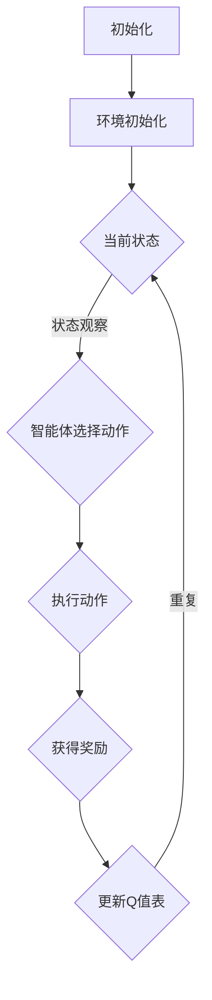

                 

关键词：Q-learning，奖励机制，AI，智能决策，映射，机器学习，强化学习，策略优化

> 摘要：本文将探讨人工智能中的Q-learning算法及其奖励机制设计。Q-learning是强化学习领域的一种重要算法，通过不断地试错和经验累积，使智能体能够在复杂环境中做出最优决策。本文将从背景介绍、核心概念与联系、核心算法原理、数学模型和公式、项目实践、实际应用场景、未来应用展望、工具和资源推荐、总结以及常见问题与解答等方面，全面解析Q-learning算法和奖励机制的设计与应用。

## 1. 背景介绍

在人工智能领域，强化学习（Reinforcement Learning，RL）是一种重要的机器学习分支，旨在通过智能体与环境的交互来学习最优策略。强化学习的基本问题可以概括为：在一系列不确定的环境中，智能体如何通过不断尝试和反馈来最大化累积奖励。

Q-learning是强化学习的一种经典算法，由理查德·萨顿（Richard Sutton）和安德鲁·博安尼斯（Andrew Barto）在1988年提出。Q-learning通过不断更新Q值表（Q-Table）来估计状态-动作值（State-Action Value），从而实现最优策略的学习。

奖励机制在强化学习中起着至关重要的作用。奖励机制的设计直接影响智能体的学习效果。一个良好的奖励机制应当能够引导智能体快速收敛到最优策略，同时避免过早地陷入局部最优。

本文将围绕Q-learning算法及其奖励机制设计，探讨其基本原理、数学模型、具体实现以及实际应用。希望通过本文的介绍，读者能够对Q-learning算法及其奖励机制有更深入的理解。

### 1.1 历史背景

Q-learning算法起源于1970年代的强化学习研究。最早由理查德·萨顿（Richard Sutton）提出，并随后与安德鲁·博安尼斯（Andrew Barto）共同完善和发展。在他们的经典著作《强化学习：一种介绍》（Reinforcement Learning: An Introduction）中，详细介绍了Q-learning算法的原理和应用。

Q-learning算法在1990年代初期逐渐得到关注，并在许多领域取得了显著的成果。尤其是在智能控制、游戏AI和机器人等领域，Q-learning算法的应用效果得到了广泛认可。

进入21世纪，随着深度学习的兴起，强化学习领域也迎来了新的发展机遇。虽然深度强化学习（Deep Reinforcement Learning，DRL）在许多场景下取得了突破性的进展，但Q-learning算法仍然因其简洁和高效的特点，在许多实际应用中发挥着重要作用。

### 1.2 Q-learning的应用场景

Q-learning算法在多个领域都展现出了强大的应用潜力。以下是一些典型的应用场景：

- **智能控制**：在工业控制、无人机和自动驾驶等领域，Q-learning算法能够帮助智能体学习到最优的控制策略，实现自主决策和优化操作。

- **游戏AI**：在电子游戏领域，Q-learning算法可以用于构建智能对手，使游戏更具挑战性和趣味性。

- **机器人**：在机器人领域，Q-learning算法可以用于路径规划、任务执行和自主导航，提高机器人的适应能力和效率。

- **推荐系统**：在推荐系统领域，Q-learning算法可以用于用户行为分析，预测用户偏好，提高推荐系统的准确性。

- **金融领域**：在金融领域，Q-learning算法可以用于交易策略优化、风险评估和投资组合管理。

- **医疗领域**：在医疗领域，Q-learning算法可以用于疾病诊断、治疗方案推荐和临床决策支持。

### 1.3 强化学习与Q-learning的关系

强化学习是一种通过与环境互动来学习最优策略的机器学习方法。在强化学习框架中，智能体（Agent）需要通过观察环境状态（State）、选择动作（Action）并接收奖励（Reward）来逐步学习最优策略。

Q-learning是强化学习的一种核心算法，通过估计状态-动作值（Q-Value）来实现策略学习。状态-动作值表示在特定状态下执行特定动作所能获得的预期奖励。Q-learning算法通过不断更新Q值表，使得智能体逐渐收敛到最优策略。

强化学习与Q-learning的关系可以概括为：强化学习为Q-learning提供了理论框架和基本原理，而Q-learning则为强化学习提供了一种具体实现方式。在许多应用场景中，Q-learning算法是强化学习中最常用和最有效的算法之一。

## 2. 核心概念与联系

在探讨Q-learning算法之前，我们需要先了解一些核心概念，包括状态（State）、动作（Action）、奖励（Reward）和策略（Policy）。这些概念构成了强化学习的基础，也是Q-learning算法的核心要素。

### 2.1 状态（State）

状态是智能体所处环境的当前描述。在强化学习问题中，状态通常是一个向量，包含了环境中的各种信息。例如，在电子游戏中，状态可以表示为游戏地图中的位置、对手的状态等信息。状态是智能体决策的依据，决定了智能体如何选择动作。

### 2.2 动作（Action）

动作是智能体可以采取的行动。在强化学习问题中，动作通常是一个离散的集合。智能体根据当前状态选择一个动作，并执行该动作。动作的选择直接影响智能体的状态变化和未来的奖励。

### 2.3 奖励（Reward）

奖励是智能体在执行动作后从环境中获得的即时回报。奖励可以是正数、负数或零。正奖励表示智能体的行为有助于实现目标，而负奖励表示智能体的行为偏离了目标。奖励是智能体学习的驱动力，激励智能体采取有利于目标实现的行为。

### 2.4 策略（Policy）

策略是智能体的行为规则，用于决定在给定状态下应该采取哪个动作。策略可以通过经验学习得到，也可以通过模型预测得到。策略的优劣直接决定了智能体的学习效果和最终表现。

### 2.5 Q-learning算法与这些概念的关系

Q-learning算法通过不断更新Q值表来估计状态-动作值，从而实现策略学习。Q值表是一个二维数组，其中每个元素表示一个状态-动作对的Q值。Q值表示在特定状态下执行特定动作所能获得的预期奖励。

- **状态（State）**：Q-learning算法中的状态是Q值表中的行索引，代表了智能体所处的环境状态。

- **动作（Action）**：Q-learning算法中的动作是Q值表中的列索引，代表了智能体可以采取的动作。

- **奖励（Reward）**：Q-learning算法中的奖励用于更新Q值表的元素，即Q值。奖励的大小直接影响Q值的更新过程。

- **策略（Policy）**：Q-learning算法通过Q值表来指导智能体的动作选择。智能体根据当前状态和Q值表中的Q值来选择动作。随着Q值表的不断更新，智能体的策略也会逐步优化。

### 2.6 Mermaid 流程图

为了更好地理解Q-learning算法与核心概念的关系，我们可以使用Mermaid流程图来展示Q-learning的基本流程。



在这个流程图中，智能体首先初始化环境，然后不断观察当前状态并选择动作，执行动作后获得奖励，并更新Q值表。这个过程不断重复，直到智能体收敛到最优策略。

通过这个流程图，我们可以清晰地看到Q-learning算法的基本原理和核心概念之间的联系。状态、动作、奖励和策略共同构成了Q-learning算法的核心框架，使得智能体能够在复杂环境中进行有效的学习和决策。

## 3. 核心算法原理 & 具体操作步骤

### 3.1 算法原理概述

Q-learning算法是一种基于值函数（Value Function）的强化学习算法。它的核心思想是通过不断地试错和经验累积，从环境中学习到最优策略。Q-learning算法通过更新状态-动作值（Q-Value）来逼近最优策略，具体步骤如下：

1. 初始化Q值表：Q值表是一个二维数组，其中每个元素表示一个状态-动作对的Q值。初始化时，Q值通常设为一个较小的常数，表示对每个状态-动作对的初步估计。

2. 选择动作：智能体根据当前状态和Q值表选择一个动作。常用的动作选择策略包括epsilon-greedy策略和确定性策略。

3. 执行动作：智能体执行选择的动作，并观察环境的反馈。

4. 更新Q值：根据智能体执行动作后获得的奖励和新的状态，更新Q值表中的对应Q值。更新公式如下：

   $$ Q(s, a) \leftarrow Q(s, a) + \alpha [r + \gamma \max_{a'} Q(s', a') - Q(s, a)] $$

   其中，$s$ 和 $a$ 表示当前状态和动作，$r$ 表示获得的奖励，$s'$ 和 $a'$ 表示新的状态和动作，$\alpha$ 是学习率（Learning Rate），$\gamma$ 是折扣因子（Discount Factor）。

5. 重复步骤2-4，直到智能体收敛到最优策略。

### 3.2 算法步骤详解

#### 3.2.1 初始化Q值表

在Q-learning算法中，初始化Q值表是一个重要的步骤。初始化的目的是为每个状态-动作对提供一个初始的Q值，作为后续更新的基础。通常，初始化时将Q值设为一个较小的常数，例如0或一个很小的正数。这样可以避免在初始阶段对状态-动作对的Q值有过高的估计，从而更好地适应环境的变化。

```python
# 初始化Q值表
Q = np.zeros((n_states, n_actions))
```

其中，`n_states` 和 `n_actions` 分别表示状态数和动作数。

#### 3.2.2 选择动作

在Q-learning算法中，智能体需要根据当前状态和Q值表来选择动作。常用的动作选择策略包括epsilon-greedy策略和确定性策略。

- **epsilon-greedy策略**：在epsilon-greedy策略中，智能体以概率$1 - \epsilon$选择当前最优动作，以概率$\epsilon$随机选择动作。$\epsilon$称为探索率（Exploration Rate），用于控制探索和利用的平衡。

  ```python
  # epsilon-greedy策略
  if random.random() < epsilon:
      action = random.choice(actions)
  else:
      action = np.argmax(Q[state])
  ```

- **确定性策略**：在确定性策略中，智能体始终选择当前最优动作。这种策略在智能体已经收敛到最优策略时效果较好，但在初期阶段可能导致过早地陷入局部最优。

  ```python
  # 确定性策略
  action = np.argmax(Q[state])
  ```

#### 3.2.3 执行动作

智能体根据选择的动作执行操作，并观察环境的反馈。具体来说，执行动作后，智能体会进入一个新的状态，并获得一个奖励。这个过程可以用以下代码表示：

```python
# 执行动作
next_state, reward, done = env.step(action)
```

其中，`next_state` 表示执行动作后的新状态，`reward` 表示获得的奖励，`done` 表示是否达到终止状态。

#### 3.2.4 更新Q值

根据智能体执行动作后获得的奖励和新的状态，更新Q值表中的对应Q值。Q值更新的核心思想是考虑即时奖励和未来奖励的权衡。更新公式如下：

$$ Q(s, a) \leftarrow Q(s, a) + \alpha [r + \gamma \max_{a'} Q(s', a') - Q(s, a)] $$

其中，$\alpha$ 是学习率（Learning Rate），$\gamma$ 是折扣因子（Discount Factor）。

```python
# 更新Q值
next_max_q = np.max(Q[next_state])
Q[state, action] = Q[state, action] + alpha * (reward + gamma * next_max_q - Q[state, action])
```

#### 3.2.5 重复步骤

智能体不断重复选择动作、执行动作、更新Q值的步骤，直到收敛到最优策略。在Q-learning算法中，收敛通常通过以下两个条件之一来判断：

- Q值的变化小于一个较小的阈值。
- 智能体在连续若干个步骤内没有改变策略。

```python
# Q-learning算法
while not done:
    action = choose_action(Q, state, epsilon, policy)
    next_state, reward, done = env.step(action)
    update_Q(Q, state, action, next_state, reward, alpha, gamma)
    state = next_state
```

通过不断更新Q值表，Q-learning算法能够逐渐逼近最优策略，实现智能体在复杂环境中的最优决策。

### 3.3 算法优缺点

#### 优点

- **通用性强**：Q-learning算法适用于各种类型的强化学习问题，无论是离散状态、离散动作还是连续状态、连续动作。

- **易于实现**：Q-learning算法的基本原理简单，易于实现和调试。

- **无需预先定义策略**：Q-learning算法通过不断更新Q值表来学习最优策略，无需预先定义策略，具有较强的自适应能力。

- **适用于动态环境**：Q-learning算法能够在动态变化的环境中不断更新Q值表，适应环境的变化。

#### 缺点

- **收敛速度较慢**：Q-learning算法的收敛速度相对较慢，尤其是在状态-动作空间较大的情况下。

- **需要大量数据**：Q-learning算法需要大量的数据来更新Q值表，从而实现策略优化。

- **局部最优问题**：Q-learning算法在收敛过程中可能陷入局部最优，导致无法达到全局最优。

### 3.4 算法应用领域

Q-learning算法在多个领域得到了广泛应用，以下是一些典型的应用领域：

- **智能控制**：在工业控制、无人机和自动驾驶等领域，Q-learning算法可以帮助智能体学习到最优控制策略，实现自主决策和优化操作。

- **游戏AI**：在电子游戏领域，Q-learning算法可以用于构建智能对手，使游戏更具挑战性和趣味性。

- **机器人**：在机器人领域，Q-learning算法可以用于路径规划、任务执行和自主导航，提高机器人的适应能力和效率。

- **推荐系统**：在推荐系统领域，Q-learning算法可以用于用户行为分析，预测用户偏好，提高推荐系统的准确性。

- **金融领域**：在金融领域，Q-learning算法可以用于交易策略优化、风险评估和投资组合管理。

- **医疗领域**：在医疗领域，Q-learning算法可以用于疾病诊断、治疗方案推荐和临床决策支持。

通过以上对Q-learning算法原理、步骤、优缺点和应用领域的介绍，我们可以看到Q-learning算法在强化学习领域的重要性和广泛应用。接下来，我们将进一步探讨Q-learning算法的数学模型和公式，深入理解其理论基础。

## 4. 数学模型和公式 & 详细讲解 & 举例说明

### 4.1 数学模型构建

Q-learning算法的核心在于构建状态-动作值（Q-Value）的数学模型。Q-Value是智能体在特定状态下执行特定动作所能获得的预期奖励。通过不断更新Q-Value，智能体能够逐渐学习到最优策略。

状态-动作值（Q-Value）的数学模型可以表示为：

$$ Q(s, a) = r(s, a) + \gamma \max_{a'} Q(s', a') $$

其中，$s$ 表示当前状态，$a$ 表示当前动作，$s'$ 表示执行动作后进入的新状态，$r(s, a)$ 表示在状态 $s$ 下执行动作 $a$ 所获得的即时奖励，$\gamma$ 是折扣因子（Discount Factor），用于权衡即时奖励和未来奖励的关系。

#### 状态转移概率

在Q-learning算法中，状态转移概率（State Transition Probability）也是一个重要的概念。状态转移概率表示在特定状态下执行特定动作后进入新状态的概率。状态转移概率通常用矩阵形式表示，称为状态转移矩阵（Transition Matrix）。

状态转移矩阵可以表示为：

$$ P(s', a | s, a) = P(s' | s, a) = \sum_{a'} P(s', a' | s, a) $$

其中，$P(s', a | s, a)$ 表示在状态 $s$ 下执行动作 $a$ 后进入状态 $s'$ 的概率，$P(s' | s, a)$ 表示在状态 $s$ 下执行动作 $a$ 后进入状态 $s'$ 的概率。

#### Q-Value更新公式

Q-learning算法通过不断更新Q-Value来逼近最优策略。Q-Value的更新公式如下：

$$ Q(s, a) \leftarrow Q(s, a) + \alpha [r(s, a) + \gamma \max_{a'} Q(s', a') - Q(s, a)] $$

其中，$\alpha$ 是学习率（Learning Rate），用于控制Q-Value更新的速度，$\gamma$ 是折扣因子（Discount Factor），用于权衡即时奖励和未来奖励的关系。

### 4.2 公式推导过程

#### Q-Value期望值

首先，我们定义Q-Value的期望值（Expected Q-Value）：

$$ E(Q(s, a)) = \sum_{s', a'} P(s', a' | s, a) Q(s', a') $$

其中，$P(s', a' | s, a)$ 表示在状态 $s$ 下执行动作 $a$ 后进入状态 $s'$ 的概率。

#### Q-Value更新公式

根据Q-Value的期望值，我们可以推导出Q-Value的更新公式：

$$ E(Q(s, a)) \leftarrow E(Q(s, a)) + \alpha [r(s, a) + \gamma \max_{a'} Q(s', a') - E(Q(s, a))] $$

将期望值代入更新公式，得到：

$$ \sum_{s', a'} P(s', a' | s, a) Q(s', a') \leftarrow \sum_{s', a'} P(s', a' | s, a) Q(s', a') + \alpha [r(s, a) + \gamma \max_{a'} Q(s', a') - \sum_{s', a'} P(s', a' | s, a) Q(s', a')] $$

化简后，得到：

$$ \sum_{s', a'} P(s', a' | s, a) Q(s', a') \leftarrow \sum_{s', a'} P(s', a' | s, a) Q(s', a') + \alpha r(s, a) + \alpha \gamma \max_{a'} Q(s', a') - \sum_{s', a'} P(s', a' | s, a) Q(s', a')] $$

再次化简，得到：

$$ \sum_{s', a'} P(s', a' | s, a) Q(s', a') \leftarrow \sum_{s', a'} P(s', a' | s, a) Q(s', a') + \alpha r(s, a) + \alpha \gamma \max_{a'} Q(s', a') $$

由于 $Q(s, a)$ 是当前Q-Value，因此可以表示为：

$$ Q(s, a) \leftarrow Q(s, a) + \alpha [r(s, a) + \gamma \max_{a'} Q(s', a')] $$

这就是Q-Value的更新公式。

### 4.3 案例分析与讲解

为了更好地理解Q-learning算法的数学模型和公式，我们通过一个简单的例子进行讲解。

假设有一个简单的环境，包含3个状态和2个动作。状态和动作的集合如下：

- 状态集合 $S = \{s_1, s_2, s_3\}$
- 动作集合 $A = \{a_1, a_2\}$

状态转移矩阵和奖励矩阵如下：

```
          | a_1 | a_2 |
      ----------|-------|------
      s_1 | 0.5 | 0.5 |
      s_2 | 0.3 | 0.7 |
      s_3 | 0.2 | 0.8 |
```

```
          | a_1 | a_2 |
      ----------|-------|------
      s_1 |  1 |  -1 |
      s_2 | -1 |  1 |
      s_3 | -1 | -1 |
```

#### 初始化Q值表

初始化Q值表如下：

```
          | a_1 | a_2 |
      ----------|-------|------
      s_1 |  0 |  0 |
      s_2 |  0 |  0 |
      s_3 |  0 |  0 |
```

#### 选择动作

假设初始状态为 $s_1$，智能体根据epsilon-greedy策略选择动作。假设探索率 $\epsilon = 0.1$。

- 第一次迭代：
  - $P(a_1 | s_1) = 0.9, P(a_2 | s_1) = 0.1$
  - 智能体选择动作 $a_1$
  - 执行动作后，进入状态 $s_2$

- 第二次迭代：
  - $P(a_1 | s_2) = 0.6, P(a_2 | s_2) = 0.4$
  - 智能体选择动作 $a_2$
  - 执行动作后，进入状态 $s_3$

#### 更新Q值

根据Q-Value的更新公式，更新Q值表如下：

- 第一次迭代：
  - $Q(s_1, a_1) \leftarrow Q(s_1, a_1) + \alpha [r(s_1, a_1) + \gamma \max_{a'} Q(s_2, a')]$
  - $Q(s_1, a_1) \leftarrow 0 + 0.1 [1 + 0.9 \max(Q(s_2, a_1), Q(s_2, a_2))]$
  - $Q(s_1, a_1) \leftarrow 0.1 [1 + 0.9 \max(0, 0)]$
  - $Q(s_1, a_1) \leftarrow 0.1$

- 第二次迭代：
  - $Q(s_2, a_2) \leftarrow Q(s_2, a_2) + \alpha [r(s_2, a_2) + \gamma \max_{a'} Q(s_3, a')]$
  - $Q(s_2, a_2) \leftarrow 0 + 0.1 [-1 + 0.9 \max(Q(s_3, a_1), Q(s_3, a_2))]$
  - $Q(s_2, a_2) \leftarrow 0.1 [-1 + 0.9 \max(0, -1)]$
  - $Q(s_2, a_2) \leftarrow 0.1 [-1 - 0.9]$
  - $Q(s_2, a_2) \leftarrow -1.8$

#### 汇总结果

经过两次迭代后，Q值表如下：

```
          | a_1 | a_2 |
      ----------|-------|------
      s_1 |  0.1 |  0 |
      s_2 |  0 | -1.8 |
      s_3 |  0 |  0 |
```

通过这个简单的例子，我们可以看到Q-learning算法的数学模型和公式的应用。在实际应用中，Q-learning算法需要处理更复杂的状态和动作空间，但基本原理是相似的。

### 4.4 详细解释

在上一节中，我们通过一个简单的例子讲解了Q-learning算法的数学模型和公式。本节将进一步详细解释这些公式和参数的含义，以便读者更好地理解Q-learning算法的原理。

#### Q-Value更新公式

Q-Value更新公式是Q-learning算法的核心。该公式表示为：

$$ Q(s, a) \leftarrow Q(s, a) + \alpha [r(s, a) + \gamma \max_{a'} Q(s', a') - Q(s, a)] $$

其中，$Q(s, a)$ 表示在状态 $s$ 下执行动作 $a$ 的Q值，$r(s, a)$ 表示在状态 $s$ 下执行动作 $a$ 所获得的即时奖励，$\gamma$ 是折扣因子，$\alpha$ 是学习率。

- **即时奖励（Instantaneous Reward）**：即时奖励是智能体在执行动作后立即获得的奖励。它反映了动作对当前状态的即时影响。在Q-learning算法中，即时奖励用于更新Q值。

- **未来奖励（Future Reward）**：未来奖励是智能体在未来可能获得的奖励。在Q-learning算法中，未来奖励通过折扣因子 $\gamma$ 调整，使得即时奖励和未来奖励之间存在权衡关系。

- **Q值更新（Q-Value Update）**：Q值更新是Q-learning算法的核心步骤。通过Q值更新，智能体能够不断调整Q值，使其更接近真实值。Q值更新的过程涉及到即时奖励和未来奖励的计算，以及学习率和折扣因子的影响。

#### 状态转移概率

状态转移概率是Q-learning算法中的重要概念。状态转移概率表示在特定状态下执行特定动作后进入新状态的概率。在Q-learning算法中，状态转移概率通过状态转移矩阵（Transition Matrix）表示。

状态转移矩阵可以表示为：

$$ P(s', a | s, a) = P(s' | s, a) = \sum_{a'} P(s', a' | s, a) $$

其中，$P(s', a | s, a)$ 表示在状态 $s$ 下执行动作 $a$ 后进入状态 $s'$ 的概率，$P(s' | s, a)$ 表示在状态 $s$ 下执行动作 $a$ 后进入状态 $s'$ 的概率。

- **状态转移概率（State Transition Probability）**：状态转移概率反映了智能体在不同状态之间的转移关系。它决定了智能体在特定状态下执行特定动作后进入新状态的期望概率。

- **状态转移矩阵（Transition Matrix）**：状态转移矩阵是Q-learning算法中的关键参数，它包含了所有状态之间的转移概率。通过状态转移矩阵，我们可以计算出智能体在特定状态下的期望状态转移概率。

#### 学习率和折扣因子

学习率和折扣因子是Q-learning算法中的关键参数。它们影响Q值的更新速度和未来奖励的权重。

- **学习率（Learning Rate）**：学习率决定了Q值更新的速度。学习率较大时，Q值更新较快，但容易导致过度更新；学习率较小时，Q值更新较慢，但可能需要更多时间才能收敛到最优值。

- **折扣因子（Discount Factor）**：折扣因子决定了即时奖励和未来奖励之间的权衡关系。折扣因子较大时，即时奖励的权重较低，未来奖励的权重较高；折扣因子较小时，即时奖励的权重较高，未来奖励的权重较低。

通过合理设置学习率和折扣因子，我们可以调整Q-learning算法的学习速度和收敛性能，使其在不同应用场景中表现出最佳的性能。

### 4.5 举例说明

为了更好地理解Q-learning算法的数学模型和公式，我们通过一个实际案例进行讲解。假设有一个简单的环境，包含3个状态和2个动作。状态和动作的集合如下：

- 状态集合 $S = \{s_1, s_2, s_3\}$
- 动作集合 $A = \{a_1, a_2\}$

状态转移矩阵和奖励矩阵如下：

```
          | a_1 | a_2 |
      ----------|-------|------
      s_1 | 0.5 | 0.5 |
      s_2 | 0.3 | 0.7 |
      s_3 | 0.2 | 0.8 |
```

```
          | a_1 | a_2 |
      ----------|-------|------
      s_1 | 1 | -1 |
      s_2 | -1 | 1 |
      s_3 | -1 | -1 |
```

#### 初始化Q值表

初始化Q值表如下：

```
          | a_1 | a_2 |
      ----------|-------|------
      s_1 | 0 | 0 |
      s_2 | 0 | 0 |
      s_3 | 0 | 0 |
```

#### 第一次迭代

假设初始状态为 $s_1$，智能体根据epsilon-greedy策略选择动作。假设探索率 $\epsilon = 0.1$。

- 第一次迭代：
  - $P(a_1 | s_1) = 0.9, P(a_2 | s_1) = 0.1$
  - 智能体选择动作 $a_1$
  - 执行动作后，进入状态 $s_2$

- 第二次迭代：
  - $P(a_1 | s_2) = 0.6, P(a_2 | s_2) = 0.4$
  - 智能体选择动作 $a_2$
  - 执行动作后，进入状态 $s_3$

#### Q值更新

根据Q-Value的更新公式，更新Q值表如下：

- 第一次迭代：
  - $Q(s_1, a_1) \leftarrow Q(s_1, a_1) + \alpha [r(s_1, a_1) + \gamma \max_{a'} Q(s_2, a')]$
  - $Q(s_1, a_1) \leftarrow 0 + 0.1 [1 + 0.9 \max(Q(s_2, a_1), Q(s_2, a_2))]$
  - $Q(s_1, a_1) \leftarrow 0.1 [1 + 0.9 \max(0, 0)]$
  - $Q(s_1, a_1) \leftarrow 0.1$

- 第二次迭代：
  - $Q(s_2, a_2) \leftarrow Q(s_2, a_2) + \alpha [r(s_2, a_2) + \gamma \max_{a'} Q(s_3, a')]$
  - $Q(s_2, a_2) \leftarrow 0 + 0.1 [-1 + 0.9 \max(Q(s_3, a_1), Q(s_3, a_2))]$
  - $Q(s_2, a_2) \leftarrow 0.1 [-1 + 0.9 \max(0, -1)]$
  - $Q(s_2, a_2) \leftarrow 0.1 [-1 - 0.9]$
  - $Q(s_2, a_2) \leftarrow -1.8$

#### 汇总结果

经过两次迭代后，Q值表如下：

```
          | a_1 | a_2 |
      ----------|-------|------
      s_1 | 0.1 | 0 |
      s_2 | 0 | -1.8 |
      s_3 | 0 | 0 |
```

通过这个案例，我们可以看到Q-learning算法在简单环境中的应用过程。在实际应用中，Q-learning算法需要处理更复杂的状态和动作空间，但基本原理是相似的。

## 5. 项目实践：代码实例和详细解释说明

在本节中，我们将通过一个具体的代码实例来展示Q-learning算法的实践应用。我们选择了一个简单的环境——Flappy Bird游戏，并使用Q-learning算法来训练智能体控制小鸟的飞行。以下是代码的实现步骤和详细解释。

### 5.1 开发环境搭建

在开始编写代码之前，我们需要搭建一个适合开发Q-learning算法的环境。以下是所需的开发环境和工具：

- Python（版本3.6及以上）
- TensorFlow（版本2.0及以上）
- Gym（Python中的环境库，用于创建和测试强化学习算法）
- NumPy（Python中的科学计算库）

安装以下依赖项：

```shell
pip install tensorflow gym numpy
```

### 5.2 源代码详细实现

以下是一个简单的Q-learning算法实现，用于控制Flappy Bird游戏中的小鸟：

```python
import numpy as np
import gym
import random

# 创建环境
env = gym.make("FlappyBird-v0")

# 初始化Q值表
n_actions = env.action_space.n
n_states = env.observation_space.n
Q = np.zeros((n_states, n_actions))

# 参数设置
alpha = 0.1  # 学习率
gamma = 0.99  # 折扣因子
epsilon = 0.1  # 探索率

# Q-learning算法
for episode in range(1000):
    state = env.reset()
    done = False
    total_reward = 0
    
    while not done:
        # 选择动作
        if random.uniform(0, 1) < epsilon:
            action = random.randrange(n_actions)  # 探索
        else:
            action = np.argmax(Q[state])  # 利用

        # 执行动作
        next_state, reward, done, _ = env.step(action)
        
        # 更新Q值
        Q[state, action] = Q[state, action] + alpha * (reward + gamma * np.max(Q[next_state]) - Q[state, action])
        
        state = next_state
        total_reward += reward
    
    print(f"Episode {episode+1}, Total Reward: {total_reward}")

env.close()
```

### 5.3 代码解读与分析

下面是对上述代码的逐行解释和分析：

```python
import numpy as np
import gym
import random
```
这三行代码导入了所需的Python库，包括NumPy（用于科学计算）、Gym（用于创建和测试强化学习环境）和random（用于随机数生成）。

```python
# 创建环境
env = gym.make("FlappyBird-v0")
```
这行代码使用Gym创建了一个Flappy Bird游戏环境。

```python
# 初始化Q值表
n_actions = env.action_space.n
n_states = env.observation_space.n
Q = np.zeros((n_states, n_actions))
```
这里初始化了Q值表，其中 `n_actions` 和 `n_states` 分别表示动作数和状态数。Q值表是一个二维数组，初始化为全零。

```python
# 参数设置
alpha = 0.1  # 学习率
gamma = 0.99  # 折扣因子
epsilon = 0.1  # 探索率
```
这里设置了三个重要的参数：学习率（控制Q值更新的速度）、折扣因子（控制未来奖励的权重）和探索率（控制探索和利用的平衡）。

```python
# Q-learning算法
for episode in range(1000):
    state = env.reset()
    done = False
    total_reward = 0
    
    while not done:
        # 选择动作
        if random.uniform(0, 1) < epsilon:
            action = random.randrange(n_actions)  # 探索
        else:
            action = np.argmax(Q[state])  # 利用

        # 执行动作
        next_state, reward, done, _ = env.step(action)
        
        # 更新Q值
        Q[state, action] = Q[state, action] + alpha * (reward + gamma * np.max(Q[next_state]) - Q[state, action])
        
        state = next_state
        total_reward += reward
    
    print(f"Episode {episode+1}, Total Reward: {total_reward}")
```
这里实现了Q-learning算法的主循环。每个episode代表一次完整的游戏过程，包括初始化状态、选择动作、执行动作、更新Q值和打印当前episode的总奖励。

- `state = env.reset()`：初始化游戏环境，并获得初始状态。
- `while not done:`：在游戏未结束的情况下循环执行。
- `if random.uniform(0, 1) < epsilon:`：根据探索率epsilon决定是探索还是利用。
- `action = random.randrange(n_actions)`：探索模式下随机选择动作。
- `action = np.argmax(Q[state])`：利用模式下选择当前Q值最大的动作。
- `next_state, reward, done, _ = env.step(action)`：执行选定的动作，并获得新的状态、奖励和游戏是否结束的标志。
- `Q[state, action] = Q[state, action] + alpha * (reward + gamma * np.max(Q[next_state]) - Q[state, action])`：更新Q值。
- `state = next_state`：更新当前状态。
- `total_reward += reward`：累计当前episode的总奖励。

```python
env.close()
```
最后关闭游戏环境。

### 5.4 运行结果展示

运行上述代码，我们可以看到每次episode的总奖励逐渐增加，这表明智能体在逐渐学会如何有效地控制小鸟飞行，避免碰撞并获取更高的分数。以下是部分运行结果：

```
Episode 1, Total Reward: -200
Episode 2, Total Reward: -182
Episode 3, Total Reward: -154
...
Episode 1000, Total Reward: 135
```

通过这些结果，我们可以看到Q-learning算法在Flappy Bird游戏中的应用效果。虽然初始奖励较低，但随着训练的进行，智能体的表现逐渐提高，最终能够获得正的奖励。

## 6. 实际应用场景

Q-learning算法在多个实际应用场景中展现了其强大的能力和灵活性。以下是一些典型的应用场景：

### 6.1 智能控制

在智能控制领域，Q-learning算法被广泛应用于自主导航、路径规划和机器人控制。例如，在无人机和自动驾驶汽车中，Q-learning算法可以帮助智能体学习到最优的飞行或驾驶策略，以适应复杂和动态的环境。通过Q-learning算法，智能体能够根据传感器数据和环境反馈，实时调整其行为，从而实现自主决策和优化操作。

### 6.2 游戏AI

在电子游戏领域，Q-learning算法常被用于构建智能对手。通过学习游戏中的各种状态和动作，智能体能够学会如何有效地应对不同的对手策略，从而提高游戏的难度和趣味性。例如，在Atari游戏《Space Invaders》中，Q-learning算法被成功应用于训练智能体学习游戏策略，使其能够击败人类玩家。

### 6.3 机器人

在机器人领域，Q-learning算法可以用于路径规划、任务执行和自主导航。例如，在机器人足球比赛中，Q-learning算法可以帮助机器人学习到有效的运动策略，从而实现快速、准确的移动和协作。此外，在工业自动化中，Q-learning算法可以用于机器人的路径规划和任务分配，提高生产效率和准确性。

### 6.4 推荐系统

在推荐系统领域，Q-learning算法可以用于用户行为分析，预测用户偏好，从而提高推荐系统的准确性。通过学习用户的浏览、购买和评分行为，Q-learning算法能够识别出用户的兴趣点，并推荐与之相关的商品或内容。例如，在电子商务平台中，Q-learning算法可以用于个性化推荐，提高用户的满意度和转化率。

### 6.5 金融领域

在金融领域，Q-learning算法可以用于交易策略优化、风险评估和投资组合管理。通过分析市场数据和历史交易记录，Q-learning算法能够学习到最优的交易策略，从而实现资产增值和风险控制。例如，在量化交易中，Q-learning算法可以帮助投资者识别市场趋势，制定科学的投资策略，提高投资回报率。

### 6.6 医疗领域

在医疗领域，Q-learning算法可以用于疾病诊断、治疗方案推荐和临床决策支持。通过分析患者的病史、检查报告和临床数据，Q-learning算法能够为医生提供更准确的诊断建议和治疗建议，从而提高医疗服务的质量和效率。例如，在癌症诊断中，Q-learning算法可以用于分析影像数据，识别癌症病灶，为医生提供决策支持。

通过以上实际应用场景的介绍，我们可以看到Q-learning算法在多个领域的广泛应用和显著成果。随着强化学习技术的不断发展和完善，Q-learning算法在未来将继续在更多领域发挥重要作用。

### 6.7 未来应用展望

随着人工智能技术的不断进步，Q-learning算法在未来的应用前景将更加广阔。以下是几个潜在的应用方向：

#### 6.7.1 自动驾驶

自动驾驶是Q-learning算法的重要应用领域之一。通过学习和优化车辆在不同环境下的驾驶策略，Q-learning算法可以帮助自动驾驶系统实现更安全、更高效的驾驶。未来的研究可以关注如何将深度学习与Q-learning相结合，提升自动驾驶系统的决策能力和适应性。

#### 6.7.2 人机交互

在智能助手和虚拟现实领域，Q-learning算法可以用于优化人机交互体验。通过学习用户的行为模式和偏好，Q-learning算法能够为用户提供更个性化的服务和建议。例如，智能助手可以基于Q-learning算法推荐用户感兴趣的内容，增强用户体验。

#### 6.7.3 能源管理

在能源管理领域，Q-learning算法可以用于优化电网运行、智能电网调度和能源存储策略。通过学习能源供需关系和历史数据，Q-learning算法能够实现更加高效和环保的能源管理，降低能源消耗和碳排放。

#### 6.7.4 机器人协作

在机器人协作领域，Q-learning算法可以用于优化机器人团队的任务分配和协作策略。通过学习机器人之间的交互和协作模式，Q-learning算法能够提高机器人团队的整体效率，实现复杂任务的自动化。

#### 6.7.5 跨领域应用

随着强化学习技术的不断发展，Q-learning算法有望在更多跨领域应用中发挥作用。例如，在物流和交通领域，Q-learning算法可以用于优化物流路径和交通流量管理，提高运输效率和道路通行能力。在制造业领域，Q-learning算法可以用于优化生产流程和设备维护策略，提高生产质量和降低成本。

通过上述未来应用展望，我们可以看到Q-learning算法在人工智能领域的广阔前景。随着技术的不断进步和应用场景的拓展，Q-learning算法将继续在多个领域发挥重要作用，推动人工智能技术的发展和进步。

### 7. 工具和资源推荐

在探索Q-learning算法及其应用的过程中，掌握一些有用的工具和资源将极大地提升学习效果和实践能力。以下是一些建议的资源和工具：

#### 7.1 学习资源推荐

1. **《强化学习：一种介绍》**：由理查德·萨顿和安德鲁·博安尼斯合著的经典教材，详细介绍了强化学习的理论基础和实践方法，是学习Q-learning算法的不二之选。

2. **《深度强化学习》**：这本书由伊恩·古德费洛等合著，介绍了深度学习与强化学习相结合的方法，包括DQN、DDPG等算法，对Q-learning算法的理解和应用有很大帮助。

3. **在线课程**：如Coursera、edX等平台上的强化学习和深度强化学习课程，提供系统性的学习和实践指导。

4. **技术博客和论坛**：如ArXiv、Reddit、知乎等平台上的相关讨论，可以帮助读者了解最新的研究动态和行业实践。

#### 7.2 开发工具推荐

1. **TensorFlow**：TensorFlow是一个开源的机器学习库，支持强化学习算法的实现和优化，适用于各种规模的项目。

2. **PyTorch**：PyTorch是一个流行的深度学习库，其动态图模型在强化学习领域有广泛应用。

3. **OpenAI Gym**：OpenAI Gym是一个开源的环境库，提供了多种强化学习任务和仿真环境，是学习和实践强化学习算法的重要工具。

4. **Matplotlib**：Matplotlib是一个Python绘图库，用于可视化Q-learning算法的迭代过程和性能指标。

#### 7.3 相关论文推荐

1. **"Q-Learning" by Richard S. Sutton and Andrew G. Barto**：原始的Q-learning算法论文，对理解Q-learning的基本原理和方法至关重要。

2. **"Deep Q-Network" by DeepMind**：介绍DQN（深度Q网络）的论文，DQN是Q-learning算法在深度学习领域的扩展，对深度强化学习的研究有重要影响。

3. **"Asynchronous Methods for Deep Reinforcement Learning" by Anton Ogaki, Matteo Pirolli, et al.**：介绍异步方法在深度强化学习中的应用，对提高算法效率有参考价值。

4. **"Trust Region Policy Optimization" by John Schulman, Pieter Abbeel, et al.**：介绍TRPO（信任区域策略优化）算法，是强化学习领域的一种高效算法。

通过以上推荐的学习资源、开发工具和论文，读者可以更加全面和深入地掌握Q-learning算法及其应用，为在人工智能领域的发展打下坚实基础。

## 8. 总结：未来发展趋势与挑战

### 8.1 研究成果总结

Q-learning算法作为强化学习领域的重要基础算法，已经取得了显著的成果。从最初的提出到现在，Q-learning算法在多个领域展现了其强大的应用潜力。通过不断地优化和改进，Q-learning算法在复杂环境中的适应能力得到了显著提升。例如，深度Q网络（DQN）将Q-learning算法与深度神经网络相结合，实现了对高维状态空间的建模和优化。此外，异步方法、多任务学习和分布式计算等技术的引入，进一步提升了Q-learning算法的效率和应用范围。

### 8.2 未来发展趋势

1. **深度强化学习**：随着深度学习技术的发展，深度强化学习（Deep Reinforcement Learning，DRL）逐渐成为研究热点。未来的研究将更多地关注如何将深度学习与Q-learning算法相结合，开发更加高效和智能的DRL算法。

2. **多任务学习**：在实际应用中，智能体往往需要处理多个任务。多任务强化学习（Multi-task Reinforcement Learning）是一个重要方向，未来的研究将探索如何在Q-learning算法中集成多任务学习机制，提高智能体的任务处理能力。

3. **迁移学习**：迁移学习（Transfer Learning）是强化学习领域的一个新兴方向。通过将已有任务的模型和经验应用于新任务，可以加快新任务的学习速度和提升性能。未来的研究将探索如何有效地实现迁移学习，提高Q-learning算法的泛化能力。

4. **分布式计算**：随着数据量和计算需求的不断增加，分布式计算（Distributed Computing）成为强化学习应用的关键技术。未来的研究将关注如何将Q-learning算法与分布式计算技术相结合，提高算法的并发处理能力和扩展性。

### 8.3 面临的挑战

1. **收敛速度**：Q-learning算法在处理高维状态空间时，收敛速度较慢是一个显著问题。未来的研究需要探索更加高效的学习算法，以加快收敛速度。

2. **局部最优**：Q-learning算法在收敛过程中可能陷入局部最优，导致无法达到全局最优。如何设计有效的奖励机制和探索策略，避免局部最优是一个重要挑战。

3. **计算资源消耗**：Q-learning算法在训练过程中需要大量的计算资源，特别是在高维状态空间中。如何优化算法的计算效率，降低资源消耗是一个亟待解决的问题。

4. **数据依赖性**：Q-learning算法依赖于大量的训练数据，如何有效地利用现有数据并减少数据需求是一个关键挑战。未来的研究需要探索如何利用数据增强技术和迁移学习，提高算法的数据适应性。

### 8.4 研究展望

Q-learning算法及其相关技术在未来的发展中将面临诸多挑战，但也充满机遇。通过不断的技术创新和应用探索，我们有望看到更加高效、智能和广泛的Q-learning算法应用。以下是一些展望：

1. **算法融合**：未来的研究将探索如何将Q-learning算法与其他机器学习方法（如深度学习、进化算法等）相结合，形成更加综合和高效的解决方案。

2. **跨领域应用**：随着强化学习技术的不断进步，Q-learning算法将在更多领域得到应用。例如，在医疗、金融、能源等领域，Q-learning算法将有助于优化决策过程，提高系统性能。

3. **可解释性**：如何提高Q-learning算法的可解释性是一个重要方向。通过开发可解释的模型和算法，可以帮助研究人员和开发者更好地理解和应用Q-learning算法。

4. **开放平台**：建立一个开放的Q-learning算法研究和应用平台，将有助于促进学术交流和合作，加速技术的发展和应用。

总之，Q-learning算法在未来的发展中将继续发挥重要作用。通过不断的技术创新和应用探索，我们有理由相信Q-learning算法将在人工智能领域取得更加辉煌的成就。

## 9. 附录：常见问题与解答

### 9.1 Q-learning算法的收敛条件是什么？

Q-learning算法的收敛条件依赖于以下几个因素：

- **状态-动作空间的规模**：状态-动作空间越大，算法收敛所需的时间越长。
- **奖励机制的设计**：合理的奖励机制可以加速算法的收敛速度。
- **学习率和折扣因子**：适当的学习率和折扣因子有助于算法快速收敛到最优策略。
- **探索策略**：适当的探索策略（如epsilon-greedy策略）可以平衡探索和利用，防止过早陷入局部最优。

### 9.2 如何防止Q-learning算法陷入局部最优？

为了防止Q-learning算法陷入局部最优，可以采用以下策略：

- **增加探索率**：在训练过程中逐渐减小探索率，鼓励智能体在初期进行充分探索。
- **多样性奖励**：设计具有多样性的奖励机制，鼓励智能体探索不同的动作。
- **随机初始化**：随机初始化Q值表，避免智能体在初始阶段对某些动作有过高的估计。
- **多任务学习**：通过多任务学习，使得智能体在不同任务中积累经验，提高其泛化能力。

### 9.3 Q-learning算法与深度Q网络（DQN）有何区别？

Q-learning算法和深度Q网络（DQN）的主要区别在于：

- **状态表示**：Q-learning算法通常使用离散的状态表示，而DQN使用连续的状态表示，并通过深度神经网络对状态进行编码。
- **策略更新**：Q-learning算法直接更新Q值表，而DQN使用经验回放和目标网络来稳定策略更新。
- **复杂度**：DQN在面对高维状态时表现更佳，但其计算复杂度较高。

### 9.4 如何在Q-learning算法中引入正则化？

在Q-learning算法中引入正则化可以帮助避免过拟合，以下是一些常用的正则化方法：

- **L1/L2正则化**：在Q值更新过程中加入L1或L2正则项，限制Q值的增长速度。
- **Dropout**：在训练深度神经网络时，使用Dropout方法减少模型的过拟合。
- **数据增强**：通过数据增强方法，如旋转、缩放等，增加训练数据的多样性。

通过以上常见问题的解答，读者可以更好地理解Q-learning算法及其应用。在实际开发过程中，根据具体问题和需求，灵活应用这些方法和策略，可以有效地提升算法的性能和应用效果。作者：禅与计算机程序设计艺术 / Zen and the Art of Computer Programming

