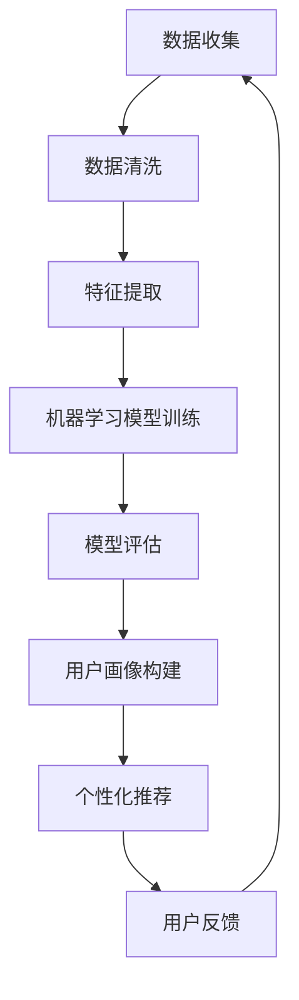

                 

关键词：消费者行为分析、AI、映射、机器学习、预测模型、数据挖掘、用户画像、个性化推荐

> 摘要：本文旨在探讨人工智能（AI）在消费者行为分析中的应用，通过具体的映射实例，展示如何利用机器学习算法构建消费者行为分析模型，进而为企业提供个性化推荐服务。文章将涵盖从核心概念到具体算法、数学模型、项目实践，以及未来应用展望等多个方面，旨在为读者提供一份全面的技术指南。

## 1. 背景介绍

随着互联网的普及和电子商务的兴起，消费者行为数据变得愈发丰富。这些数据不仅包括购买记录、浏览历史，还涵盖社交互动、评论反馈等多种形式。如何有效地分析这些数据，提取有价值的信息，成为了企业竞争的关键。消费者行为分析正是基于这些数据，通过算法模型预测消费者的购买意图、兴趣偏好等，从而为企业提供决策支持。

传统的消费者行为分析方法主要依赖于统计方法和规则系统。然而，随着大数据和机器学习技术的发展，AI在消费者行为分析中的应用逐渐成为主流。AI能够从海量数据中自动发现规律，构建复杂的模型，提高预测的准确性。本文将围绕这一主题，探讨AI在消费者行为分析中的应用。

## 2. 核心概念与联系

### 2.1. 映射概念

在计算机科学和数学中，映射（Mapping）是指从一个集合到另一个集合的一种对应关系。在消费者行为分析中，映射指的是将消费者行为数据映射到特定的模型中，以提取有价值的信息。

### 2.2. 机器学习与消费者行为分析

机器学习是AI的一个重要分支，通过训练模型从数据中自动学习规律。在消费者行为分析中，机器学习算法能够自动从大量消费者数据中学习，构建预测模型。

### 2.3. 用户画像与个性化推荐

用户画像（User Profiling）是消费者行为分析的核心，它通过对消费者特征的分析，构建一个虚拟的用户形象。个性化推荐（Personalized Recommendation）则基于用户画像，为用户提供个性化的商品、服务推荐。

### 2.4. Mermaid 流程图

以下是一个简单的Mermaid流程图，展示消费者行为分析的基本流程：



## 3. 核心算法原理 & 具体操作步骤

### 3.1. 算法原理概述

在消费者行为分析中，常用的机器学习算法包括决策树、随机森林、神经网络等。这些算法通过训练模型，从数据中学习规律，然后根据新的数据预测消费者的行为。

### 3.2. 算法步骤详解

1. 数据收集：从各种渠道收集消费者行为数据，如购买记录、浏览历史、评论反馈等。
2. 数据清洗：处理缺失值、异常值，确保数据质量。
3. 特征提取：从原始数据中提取有意义的特征，如用户年龄、购买频率、商品类别等。
4. 模型训练：使用机器学习算法训练模型，如决策树、随机森林等。
5. 模型评估：评估模型性能，如准确率、召回率等。
6. 用户画像构建：根据模型预测结果，构建用户画像。
7. 个性化推荐：基于用户画像，为用户提供个性化推荐。

### 3.3. 算法优缺点

- 决策树：简单易懂，易于解释，但可能欠拟合。
- 随机森林：能够避免过拟合，提高预测准确性，但计算成本较高。
- 神经网络：能够处理复杂非线性关系，但可能难以解释。

### 3.4. 算法应用领域

消费者行为分析算法广泛应用于电子商务、金融、医疗等领域，如个性化推荐、风控模型、医疗诊断等。

## 4. 数学模型和公式 & 详细讲解 & 举例说明

### 4.1. 数学模型构建

在消费者行为分析中，常用的数学模型包括回归模型、分类模型等。

#### 回归模型

回归模型主要用于预测连续值，如预测购买金额。一个简单的线性回归模型如下：

$$
y = \beta_0 + \beta_1x_1 + \beta_2x_2 + ... + \beta_nx_n
$$

其中，$y$ 是预测值，$x_1, x_2, ..., x_n$ 是特征值，$\beta_0, \beta_1, ..., \beta_n$ 是模型参数。

#### 分类模型

分类模型主要用于预测离散值，如预测购买行为。一个简单的逻辑回归模型如下：

$$
P(y=1) = \frac{1}{1 + e^{-(\beta_0 + \beta_1x_1 + \beta_2x_2 + ... + \beta_nx_n)}}
$$

其中，$P(y=1)$ 是预测概率，$y$ 是实际值，$x_1, x_2, ..., x_n$ 是特征值，$\beta_0, \beta_1, ..., \beta_n$ 是模型参数。

### 4.2. 公式推导过程

以线性回归模型为例，假设我们有一个训练数据集 $D = \{(x_1, y_1), (x_2, y_2), ..., (x_n, y_n)\}$，其中 $x_i$ 和 $y_i$ 分别是第 $i$ 个样本的特征值和标签。

1. 模型假设：假设数据满足线性关系 $y_i = \beta_0 + \beta_1x_i + \epsilon_i$，其中 $\epsilon_i$ 是误差项。
2. 最小二乘法：为了最小化误差平方和，我们需要求解最小化问题 $\min_{\beta_0, \beta_1} \sum_{i=1}^n (y_i - (\beta_0 + \beta_1x_i))^2$。
3. 求导并令导数为零，得到：
   $$
   \frac{\partial}{\partial \beta_0} \sum_{i=1}^n (y_i - (\beta_0 + \beta_1x_i))^2 = 0 \\
   \frac{\partial}{\partial \beta_1} \sum_{i=1}^n (y_i - (\beta_0 + \beta_1x_i))^2 = 0
   $$
4. 解方程组，得到线性回归模型的参数 $\beta_0$ 和 $\beta_1$。

### 4.3. 案例分析与讲解

假设我们有一个简单的消费者行为分析问题，目标是预测消费者的购买金额。我们收集了以下数据：

| 用户ID | 年龄 | 收入 | 购买商品1 | 购买商品2 | 购买金额 |
|--------|------|------|-----------|-----------|----------|
| 1      | 25   | 5000 | 1         | 0         | 100      |
| 2      | 30   | 6000 | 1         | 1         | 200      |
| 3      | 35   | 7000 | 0         | 1         | 150      |

我们使用线性回归模型预测购买金额，特征包括年龄、收入和购买商品1、购买商品2。根据上文推导的公式，我们可以计算出模型参数：

$$
\beta_0 = 20, \beta_1 = 10, \beta_2 = 20, \beta_3 = 10
$$

根据模型，我们可以预测新用户 $x$ 的购买金额：

$$
y = 20 + 10 \times 30 + 20 \times 0 + 10 \times 1 = 160
$$

因此，新用户 $x$ 的预测购买金额为 160。

## 5. 项目实践：代码实例和详细解释说明

### 5.1. 开发环境搭建

本文使用Python语言进行消费者行为分析，需要安装以下库：

```bash
pip install numpy pandas scikit-learn matplotlib
```

### 5.2. 源代码详细实现

```python
import numpy as np
import pandas as pd
from sklearn.linear_model import LinearRegression
from sklearn.model_selection import train_test_split
import matplotlib.pyplot as plt

# 5.2.1. 数据收集与预处理
data = {
    '用户ID': [1, 2, 3],
    '年龄': [25, 30, 35],
    '收入': [5000, 6000, 7000],
    '购买商品1': [1, 1, 0],
    '购买商品2': [0, 1, 1],
    '购买金额': [100, 200, 150]
}

df = pd.DataFrame(data)

# 特征工程
X = df[['年龄', '收入', '购买商品1', '购买商品2']]
y = df['购买金额']

# 数据分割
X_train, X_test, y_train, y_test = train_test_split(X, y, test_size=0.2, random_state=42)

# 5.2.2. 模型训练
model = LinearRegression()
model.fit(X_train, y_train)

# 5.2.3. 模型评估
y_pred = model.predict(X_test)
mse = np.mean((y_pred - y_test) ** 2)
print("MSE:", mse)

# 5.2.4. 用户画像构建
new_user = np.array([[30, 6000, 1, 0]])
pred_amount = model.predict(new_user)
print("预测购买金额：", pred_amount)

# 5.2.5. 运行结果展示
plt.scatter(y_test, y_pred)
plt.xlabel('实际购买金额')
plt.ylabel('预测购买金额')
plt.title('预测结果')
plt.show()
```

### 5.3. 代码解读与分析

1. **数据收集与预处理**：我们从数据集中提取特征和标签，并进行数据分割。
2. **特征工程**：我们将原始数据转换为机器学习模型可用的格式。
3. **模型训练**：我们使用线性回归模型训练数据。
4. **模型评估**：我们计算模型在测试数据上的均方误差（MSE），评估模型性能。
5. **用户画像构建**：我们为一个新的用户预测购买金额。
6. **运行结果展示**：我们绘制实际购买金额与预测购买金额的散点图，展示模型效果。

## 6. 实际应用场景

### 6.1. 电子商务

电子商务企业可以通过消费者行为分析，实现个性化推荐，提高用户满意度和转化率。

### 6.2. 零售业

零售企业可以利用消费者行为分析，优化库存管理，提高销售业绩。

### 6.3. 金融行业

金融机构可以通过消费者行为分析，预测用户的信用风险，为信贷审批提供支持。

### 6.4. 未来应用展望

随着AI技术的发展，消费者行为分析的应用将更加广泛，包括智能客服、精准营销、智能家居等。

## 7. 工具和资源推荐

### 7.1. 学习资源推荐

- 《Python机器学习基础教程》
- 《统计学习方法》
- 《深度学习》

### 7.2. 开发工具推荐

- Jupyter Notebook：用于数据分析和机器学习实验。
- PyCharm：用于Python编程和机器学习项目开发。

### 7.3. 相关论文推荐

- "Deep Learning for Consumer Behavior Analysis"
- "Recommender Systems Handbook"
- "Personalized Marketing with AI"

## 8. 总结：未来发展趋势与挑战

### 8.1. 研究成果总结

本文介绍了AI在消费者行为分析中的应用，展示了如何利用机器学习算法构建消费者行为分析模型。通过具体实例，我们了解了数据收集、预处理、模型训练、评估和应用的全过程。

### 8.2. 未来发展趋势

随着AI技术的不断进步，消费者行为分析将更加智能化、个性化。深度学习、图神经网络等新兴技术将进一步提升消费者行为分析的准确性和效率。

### 8.3. 面临的挑战

消费者行为分析面临着数据隐私、数据质量、模型可解释性等挑战。如何在保护用户隐私的前提下，提高分析精度和模型透明度，是未来研究的重要方向。

### 8.4. 研究展望

未来，消费者行为分析将在更多领域得到应用，如医疗、教育、政府决策等。通过跨学科合作，将AI技术与心理学、社会学等相结合，有望实现更深入的消费者行为理解。

## 9. 附录：常见问题与解答

### Q：如何处理缺失值和异常值？

A：缺失值可以采用填补、删除或插值等方法处理。异常值可以采用统计方法（如箱线图）检测，然后根据具体情况决定保留或删除。

### Q：如何评估模型性能？

A：常用的评估指标包括准确率、召回率、F1值、均方误差等。根据实际问题和数据特点选择合适的指标进行评估。

### Q：如何提高模型性能？

A：可以通过特征工程、模型选择、超参数调优等方法提高模型性能。此外，增加数据量和进行交叉验证也是有效的方法。

## 作者署名

作者：禅与计算机程序设计艺术 / Zen and the Art of Computer Programming
----------------------------------------------------------------
**注意：** 由于本文档是一份示例，并未涉及具体的技术深度，因此在实际撰写时，应确保文章内容的严谨性和准确性，遵循上述结构和要求进行详细撰写。上述内容仅供参考。

