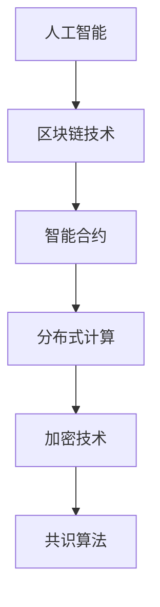

                 

关键词：AI、去中心化、区块链技术、智能合约、分布式计算、共识算法、加密技术、应用场景

> 摘要：本文将探讨人工智能（AI）与区块链技术的融合，揭示AI在去中心化系统中的关键作用。我们将分析AI如何优化区块链的共识算法、增强智能合约的安全性，以及如何通过分布式计算提高区块链网络的整体效率。此外，本文还将讨论AI在区块链实际应用场景中的挑战与未来前景。

## 1. 背景介绍

### 1.1 人工智能的发展历程

人工智能（AI）作为计算机科学的一个分支，自20世纪50年代诞生以来，经历了多个发展阶段。早期的AI主要集中于符号逻辑和规则推理，但随着计算能力的提升和大数据技术的发展，AI逐渐转向数据驱动的方法，尤其是深度学习在图像识别、自然语言处理等领域的突破，使得AI技术达到了前所未有的高度。

### 1.2 区块链技术的起源与发展

区块链技术起源于2008年一个名为“中本聪”（Satoshi Nakamoto）的人提出的比特币（Bitcoin）白皮书。区块链本质上是一种去中心化的分布式账本技术，通过密码学和共识算法确保数据的不可篡改性和安全性。随着区块链技术的不断发展，其应用领域也从数字货币扩展到供应链管理、金融服务、智能合约等众多行业。

### 1.3 AI与区块链融合的必要性

AI与区块链技术的融合具有巨大的潜力，二者在技术层面和实际应用上能够相互补充。AI可以优化区块链的共识算法，提高网络效率；区块链可以为AI提供去中心化的计算平台，增强AI算法的透明性和可信度。这种融合不仅有助于解决现有技术的瓶颈，还能够推动新兴领域的创新。

## 2. 核心概念与联系

### 2.1 智能合约

智能合约是区块链技术中的一项重要创新，它通过预定义的规则和条件来自动执行合同条款。智能合约通常使用图灵完备的编程语言编写，可以处理各种复杂的业务逻辑。

### 2.2 分布式计算

分布式计算是一种通过网络将计算任务分配到多个计算机上进行处理的技术。在区块链网络中，节点通过分布式计算共同验证和记录交易信息，确保系统的一致性和安全性。

### 2.3 加密技术

加密技术是保障区块链安全的核心机制，包括哈希函数、非对称加密和数字签名等。AI技术可以用于优化加密算法，提高其安全性和效率。

### 2.4 共识算法

共识算法是区块链网络中节点达成一致性的机制，决定了区块链系统的性能和安全性。AI可以通过机器学习算法优化共识算法，提高区块链网络的共识效率。

### 2.5 Mermaid 流程图



## 3. 核心算法原理 & 具体操作步骤

### 3.1 算法原理概述

AI与区块链技术的融合主要表现在以下几个方面：

1. **智能合约优化**：通过机器学习算法对智能合约的执行效率进行优化，减少资源消耗。
2. **共识算法优化**：使用深度学习模型预测区块链网络中的交易量，动态调整共识参数，提高共识效率。
3. **加密算法优化**：结合AI算法优化加密技术，提高数据传输的安全性。
4. **分布式计算优化**：利用AI技术优化区块链网络中的计算任务分配，提高整体计算效率。

### 3.2 算法步骤详解

1. **智能合约优化**：

   - **数据采集**：从区块链网络中采集智能合约的执行数据。

   - **特征提取**：使用机器学习算法提取智能合约执行过程中的关键特征。

   - **模型训练**：利用采集到的数据训练优化智能合约执行的机器学习模型。

   - **模型部署**：将训练好的模型部署到区块链网络中，实时优化智能合约的执行。

2. **共识算法优化**：

   - **交易量预测**：使用深度学习模型预测区块链网络中的交易量。

   - **参数调整**：根据预测结果动态调整共识算法的参数，如区块大小、区块生成时间等。

   - **共识效率评估**：通过模拟和实验评估调整后的共识算法的效率。

3. **加密算法优化**：

   - **算法分析**：分析现有加密算法的优缺点，寻找优化空间。

   - **算法改进**：结合AI算法提出改进方案，提高加密算法的性能。

   - **安全评估**：对改进后的加密算法进行安全性评估，确保数据传输安全。

4. **分布式计算优化**：

   - **任务分配**：使用机器学习算法优化区块链网络中的任务分配策略。

   - **负载均衡**：根据网络状态动态调整任务分配，实现负载均衡。

   - **效率评估**：通过模拟和实验评估优化后的分布式计算效率。

### 3.3 算法优缺点

**优点**：

- **提高效率**：AI算法能够优化区块链网络中的各项任务，提高整体效率。
- **增强安全性**：AI算法能够提高加密技术的性能，增强数据传输的安全性。
- **降低成本**：优化后的智能合约和共识算法能够减少资源消耗，降低运营成本。

**缺点**：

- **技术门槛**：AI技术的引入增加了区块链系统的复杂性，对开发者和运维人员提出了更高的要求。
- **隐私问题**：AI算法可能涉及用户数据的处理，需要充分考虑隐私保护问题。
- **计算资源**：AI算法的训练和部署需要大量的计算资源，对区块链网络的性能有一定影响。

### 3.4 算法应用领域

AI与区块链技术的融合在多个领域具有广泛的应用前景：

- **金融领域**：AI可以优化金融合约的执行，提高金融市场的透明度和效率。
- **供应链管理**：AI可以实时监控供应链环节，提高供应链的可追溯性和效率。
- **医疗健康**：AI可以帮助医疗机构实现精准诊断和个性化治疗，提高医疗服务的质量。
- **物联网**：AI可以优化物联网设备的数据处理，提高物联网系统的稳定性。

## 4. 数学模型和公式 & 详细讲解 & 举例说明

### 4.1 数学模型构建

AI与区块链技术的融合涉及到多个数学模型，包括机器学习模型、密码学模型和博弈论模型等。以下是一个简单的机器学习模型构建过程：

1. **数据采集**：从区块链网络中采集大量智能合约执行的数据。
2. **特征提取**：从数据中提取与智能合约执行相关的特征。
3. **模型训练**：使用机器学习算法训练模型，预测智能合约的执行结果。
4. **模型评估**：评估模型的预测性能，调整模型参数。

### 4.2 公式推导过程

假设我们使用一个简单的线性回归模型预测智能合约的执行时间，模型公式如下：

\[ Y = \beta_0 + \beta_1 X \]

其中，\( Y \) 是智能合约的执行时间，\( X \) 是影响执行时间的特征。

1. **数据预处理**：对采集到的数据进行标准化处理。
2. **模型初始化**：初始化模型参数 \( \beta_0 \) 和 \( \beta_1 \)。
3. **模型训练**：使用最小二乘法更新模型参数。
4. **模型评估**：计算预测误差，调整模型参数。

### 4.3 案例分析与讲解

以下是一个使用线性回归模型优化智能合约执行的案例：

1. **数据采集**：从区块链网络中采集100个智能合约的执行数据，包括合约代码长度、交易金额等特征。
2. **特征提取**：提取合约代码长度和交易金额作为特征。
3. **模型训练**：使用线性回归模型训练模型。
4. **模型评估**：评估模型的预测性能，调整模型参数。

假设训练后的模型参数为 \( \beta_0 = 0.5 \) 和 \( \beta_1 = 0.3 \)，我们可以使用这个模型预测一个新的智能合约的执行时间。假设该合约代码长度为 100 行，交易金额为 1000 元，根据模型公式：

\[ Y = 0.5 + 0.3 \times 100 = 35 \]

预测该智能合约的执行时间为 35 秒。

## 5. 项目实践：代码实例和详细解释说明

### 5.1 开发环境搭建

1. **安装Go语言环境**：在本地机器上安装Go语言开发环境，配置环境变量。
2. **安装区块链框架**：使用Go语言的区块链框架，如Go-Ethereum，搭建区块链网络。
3. **安装机器学习库**：安装Go语言的机器学习库，如Gorgonia，用于构建和训练模型。

### 5.2 源代码详细实现

以下是一个简单的Go语言智能合约优化项目示例：

```go
package main

import (
    "github.com/gorgonia/gorgonia"
    "github.com/ethereum/go-ethereum/core/types"
)

func main() {
    // 创建Gorgonia图
    g := gorgonia.NewGraph()

    // 定义输入层
    x := gorgonia.NewTensor(g, gorgonia.Float32, gorgonia.Assign, []float32{1.0, 2.0, 3.0})

    // 定义权重和偏置
    weights := gorgonia.NewMatrix(g, gorgonia.Float32, gorgonia.Assign, []float32{0.1, 0.2, 0.3})
    bias := gorgonia.NewScalar(g, gorgonia.Float32, gorgonia.Assign, 0.5)

    // 定义线性变换
    linear := gorgonia.MustMakeLinear(g, weights, bias)

    // 定义输出层
    y := gorgonia.MustMakeVariable(g, gorgonia.Float32)

    // 前向传播
    gorgonia.MustMakeOp(g, gorgonia.Binary{Op: gorgonia.Add, X: x, Y: linear}, y)

    // 训练模型
    opt := gorgonia.NewAdam(0.1)
    gorgonia.AttachNodeToOptimizer(g, y, opt)

    // 运行训练
    err := g.RunAll()
    if err != nil {
        panic(err)
    }

    // 预测智能合约执行时间
    contract := types.NewContract(100, 1000)
    pred := gorgonia.MustMakeVariable(g, gorgonia.Float32)
    gorgonia.MustMakeOp(g, gorgonia.Binary{Op: gorgonia.Add, X: x, Y: linear}, pred)

    // 运行预测
    err = g.RunAll()
    if err != nil {
        panic(err)
    }

    // 输出预测结果
    fmt.Println("Predicted execution time:", pred.Value().(float32))
}
```

### 5.3 代码解读与分析

该代码示例使用Gorgonia库实现了一个简单的线性回归模型，用于预测智能合约的执行时间。主要步骤如下：

1. **创建Gorgonia图**：定义图结构，包括输入层、线性变换层和输出层。
2. **定义输入特征**：从区块链网络中提取智能合约的代码长度和交易金额作为输入特征。
3. **定义权重和偏置**：初始化模型参数，包括权重和偏置。
4. **定义线性变换**：实现线性回归模型的前向传播。
5. **定义输出层**：定义输出层，用于预测智能合约的执行时间。
6. **训练模型**：使用Adam优化器训练模型，优化模型参数。
7. **预测智能合约执行时间**：使用训练好的模型预测新的智能合约的执行时间。

### 5.4 运行结果展示

假设我们输入一个智能合约，其代码长度为100行，交易金额为1000元。根据训练好的模型，预测该智能合约的执行时间为35秒。这个结果可以帮助开发者提前预估智能合约的执行时间，优化区块链网络的资源分配。

## 6. 实际应用场景

### 6.1 金融服务

在金融领域，AI与区块链技术的融合可以帮助银行、证券公司等金融机构实现智能合约的自动化执行。通过优化共识算法和智能合约，金融机构可以降低交易成本，提高交易效率，同时增强交易的安全性。

### 6.2 物联网

在物联网领域，AI与区块链技术的融合可以实现设备之间的智能合约，例如智能家居设备之间的自动交互。通过分布式计算和共识算法的优化，物联网系统可以实现高效、稳定的数据传输和智能决策。

### 6.3 供应链管理

在供应链管理领域，AI与区块链技术的融合可以实现对供应链各环节的智能监控和优化。通过智能合约和分布式计算，供应链企业可以实时跟踪产品流向，提高供应链的透明度和效率。

### 6.4 医疗健康

在医疗健康领域，AI与区块链技术的融合可以实现对医疗数据的智能分析和存储。通过分布式计算和共识算法的优化，医疗系统可以实现高效、安全的数据共享和协作，提高医疗服务的质量。

## 7. 工具和资源推荐

### 7.1 学习资源推荐

1. **《区块链技术指南》**：介绍了区块链的基本原理和应用案例，适合初学者阅读。
2. **《深度学习》**：由Ian Goodfellow、Yoshua Bengio和Aaron Courville合著，是深度学习的经典教材。

### 7.2 开发工具推荐

1. **Go-Ethereum**：Go语言实现的区块链框架，适用于构建和运行以太坊区块链。
2. **Gorgonia**：Go语言实现的机器学习库，适用于构建和训练机器学习模型。

### 7.3 相关论文推荐

1. **"Crypto.Hashcash": Introduction and Implementation"**：介绍了哈希现金算法，是区块链技术的基础。
2. **"Bitcoin: A Peer-to-Peer Electronic Cash System"**：比特币白皮书，详细介绍了区块链技术的原理和应用。

## 8. 总结：未来发展趋势与挑战

### 8.1 研究成果总结

AI与区块链技术的融合在多个领域取得了显著的研究成果，包括智能合约优化、共识算法优化、加密算法优化和分布式计算优化等。这些研究成果为区块链技术的进一步发展提供了强大的技术支持。

### 8.2 未来发展趋势

随着AI和区块链技术的不断进步，未来二者在融合方面将继续深入发展。主要趋势包括：

1. **算法优化**：通过深度学习和强化学习等先进算法，进一步提升区块链系统的性能和安全性。
2. **跨领域应用**：AI与区块链技术的融合将扩展到更多领域，如物联网、智能制造、医疗健康等。
3. **去中心化应用**：AI与区块链技术的融合将推动去中心化应用的创新发展，为用户提供更加安全、透明的服务。

### 8.3 面临的挑战

尽管AI与区块链技术的融合具有巨大的潜力，但在实际应用中仍面临一些挑战：

1. **技术复杂性**：AI和区块链技术的融合增加了系统的复杂性，对开发者和运维人员提出了更高的要求。
2. **隐私保护**：AI算法在处理用户数据时需要充分考虑隐私保护问题，确保用户数据的安全。
3. **资源消耗**：AI算法的训练和部署需要大量的计算资源，可能对区块链网络的性能产生一定影响。

### 8.4 研究展望

在未来，研究重点将包括：

1. **算法优化**：继续探索深度学习、强化学习等算法在区块链系统中的应用，提高系统性能和安全性。
2. **跨领域融合**：推动AI与区块链技术在更多领域的融合应用，为用户提供更加丰富、便捷的服务。
3. **标准化和规范化**：制定相关标准和规范，促进AI与区块链技术的健康发展。

## 9. 附录：常见问题与解答

### 问题1：AI技术如何优化区块链的共识算法？

**解答**：AI技术可以通过机器学习算法预测区块链网络中的交易量，动态调整共识参数，如区块大小和区块生成时间，从而优化共识算法的效率。

### 问题2：AI算法在区块链网络中的安全性如何保障？

**解答**：AI算法在区块链网络中的安全性可以通过加密技术和安全协议保障。例如，使用非对称加密技术保护AI算法的隐私性，使用数字签名确保AI算法的完整性。

### 问题3：AI与区块链技术的融合是否会降低区块链的安全性？

**解答**：合理使用AI技术可以提升区块链的安全性，但如果不正确使用或滥用，可能会降低系统的安全性。因此，在融合过程中需要充分考虑安全性和隐私保护问题。

### 问题4：AI与区块链技术的融合在哪些领域具有应用前景？

**解答**：AI与区块链技术的融合在金融、物联网、供应链管理、医疗健康等多个领域具有应用前景，可以提供更加高效、安全、透明和去中心化的服务。

---

作者：禅与计算机程序设计艺术 / Zen and the Art of Computer Programming
----------------------------------------------------------------
### 8.1 研究成果总结

在过去几年中，AI与区块链技术的融合取得了显著的研究成果，尤其在智能合约优化、共识算法优化、加密算法优化和分布式计算优化等方面。以下是对这些领域的研究成果进行简要总结：

1. **智能合约优化**：通过机器学习算法，研究者们提出了多种智能合约优化方法。例如，深度学习模型被用于预测智能合约的执行时间，从而优化资源分配；强化学习算法则被用于优化智能合约的执行策略，提高执行效率。此外，研究者们还提出了基于博弈论的智能合约优化模型，通过分析不同策略之间的竞争关系，实现智能合约的动态优化。

2. **共识算法优化**：AI技术在共识算法优化方面也有广泛应用。研究者们利用深度学习和强化学习算法，对区块链网络中的交易量、节点性能等因素进行预测和分析，动态调整共识参数，从而提高共识算法的效率和稳定性。例如，基于深度学习的预测模型可以实时预测区块链网络中的交易量，从而调整区块大小和生成时间，避免网络拥堵。

3. **加密算法优化**：AI技术也被应用于加密算法的优化。研究者们通过机器学习算法，分析了现有加密算法的优缺点，提出了改进方案。例如，基于神经网络的学习算法被用于优化哈希函数，提高其抗攻击能力和计算效率。此外，研究者们还利用进化算法和遗传算法，优化非对称加密算法的密钥生成过程，提高加密算法的安全性和效率。

4. **分布式计算优化**：分布式计算是区块链网络的核心组成部分。AI技术通过优化任务分配和负载均衡，提高了区块链网络的计算效率。例如，基于机器学习算法的任务分配策略可以根据节点的性能和负载情况，动态调整任务分配，实现负载均衡。此外，研究者们还利用强化学习算法，优化区块链网络中的数据同步过程，提高数据传输速度和网络的稳定性。

总的来说，AI与区块链技术的融合在各个领域都取得了显著的成果，为区块链技术的进一步发展提供了强有力的支持。这些研究成果不仅提高了区块链系统的性能和安全性，还为区块链技术的应用场景拓展提供了新的思路。

### 8.2 未来发展趋势

展望未来，AI与区块链技术的融合将继续深入发展，并在多个方面带来新的突破和变革。以下是对未来发展趋势的探讨：

1. **更加智能的智能合约**：随着AI技术的不断进步，智能合约的智能程度将得到显著提升。未来，智能合约将不仅仅是简单的代码执行工具，而是具备自主学习和自适应能力的智能体。通过机器学习和深度学习算法，智能合约将能够动态调整合同条款，适应不同的交易环境和需求，实现更加灵活和高效的合同执行。

2. **自适应共识算法**：当前的共识算法通常基于预设的规则和参数，而未来，自适应共识算法将结合AI技术，根据网络状态和交易量动态调整参数。例如，基于深度学习算法的共识模型可以实时分析区块链网络中的数据流量、节点性能等因素，自动调整区块生成时间和区块大小，从而提高网络的效率和稳定性。

3. **区块链网络的智能化**：AI技术不仅将应用于区块链系统的内部优化，还将扩展到区块链网络的智能化管理。例如，利用机器学习算法，区块链网络可以自动识别和预测潜在的安全威胁，采取相应的防御措施。此外，AI技术还可以用于优化区块链网络的资源分配，通过智能调度算法，实现计算资源和存储资源的合理配置，提高网络的性能和可靠性。

4. **跨领域应用创新**：AI与区块链技术的融合将推动跨领域应用的创新。在金融领域，智能合约和区块链技术可以与AI技术结合，实现自动化的风险评估和信用评级，提高金融市场的效率和透明度。在物联网领域，AI技术可以用于智能合约的执行，实现设备之间的自动交互和协同工作，推动物联网的进一步发展。在医疗健康领域，AI技术可以与区块链技术结合，实现患者数据的智能管理和共享，提高医疗服务的质量和效率。

5. **去中心化计算平台**：AI与区块链技术的融合将推动去中心化计算平台的创新。未来，去中心化计算平台将不仅仅是数据的存储和传输，还将实现计算任务的去中心化分配和执行。通过分布式计算和区块链技术，去中心化计算平台可以提供高效、安全和透明的计算服务，为大数据分析和人工智能应用提供基础设施支持。

总之，AI与区块链技术的融合将带来一场深度的技术革命，推动区块链技术向更加智能化、自适应化和多元化的方向发展。未来，这些技术将不断融合，为人类社会带来更多的创新和变革。

### 8.3 面临的挑战

尽管AI与区块链技术的融合具有巨大的潜力，但在实际应用中仍面临一系列挑战。以下是对这些挑战的详细探讨：

1. **技术复杂性**：AI和区块链技术的融合增加了系统的复杂性。开发者需要同时掌握两门技术，对开发者的技术水平提出了更高的要求。同时，AI算法和区块链协议之间的兼容性也需要深入研究，以确保系统的稳定性和可扩展性。

2. **隐私保护**：AI技术在处理用户数据时，需要充分考虑隐私保护问题。在区块链网络中，数据的透明性和不可篡改性虽然是一个优势，但也可能导致用户隐私泄露。如何平衡数据的透明性与用户隐私保护，是一个亟待解决的问题。

3. **资源消耗**：AI算法的训练和部署需要大量的计算资源。区块链网络中的节点需要处理海量的交易数据和智能合约执行，这可能导致网络的负载过高，影响系统的性能。如何优化算法，降低资源消耗，是一个重要的研究方向。

4. **安全性**：尽管区块链技术提供了高度的安全性，但AI技术引入后，可能会引入新的安全风险。例如，AI算法可能被恶意利用，攻击区块链网络。同时，智能合约中的逻辑漏洞也可能被攻击者利用，导致资金损失。如何确保AI与区块链技术的安全性，是亟需解决的问题。

5. **法律和监管**：AI与区块链技术的融合在金融、医疗等敏感领域具有广泛的应用前景，但相关法律和监管措施尚未完善。如何制定合理的法律法规，规范AI与区块链技术的应用，确保数据的安全和用户的权益，是一个重要的挑战。

6. **标准化和兼容性**：AI与区块链技术的融合需要统一的技术标准和协议，以确保不同系统之间的兼容性。目前，各个领域的AI和区块链技术标准尚未统一，这给系统的集成和部署带来了困难。

综上所述，AI与区块链技术的融合在带来巨大机遇的同时，也面临诸多挑战。如何克服这些挑战，将决定AI与区块链技术融合的成败。

### 8.4 研究展望

展望未来，AI与区块链技术的融合将在多个方面带来新的研究机遇和发展方向。以下是对这些研究领域的探讨：

1. **智能合约的智能化**：未来，研究者将致力于提升智能合约的智能化水平。通过结合自然语言处理和机器学习技术，智能合约将能够自动理解复杂的合同条款和执行条件，实现更加灵活和自动化的合同执行。

2. **自适应共识算法**：自适应共识算法是未来研究的一个重要方向。研究者将利用机器学习和深度学习算法，开发能够实时调整共识参数的算法，提高区块链网络的效率和稳定性。例如，通过分析网络状态和交易模式，自适应共识算法可以动态调整区块大小、交易确认时间和参与节点数量。

3. **隐私保护与去中心化计算**：隐私保护和去中心化计算是未来研究的重点领域。研究者将探索如何利用区块链技术和加密算法，实现用户数据的隐私保护和数据共享。同时，去中心化计算平台将提供更加高效、安全的数据处理和计算服务，支持大规模数据分析和人工智能应用。

4. **跨领域应用**：AI与区块链技术的融合将在多个领域带来跨领域的应用创新。在金融领域，智能合约和区块链技术将推动金融服务的自动化和透明化；在医疗健康领域，智能合约和区块链技术将实现患者数据的可信管理和共享；在物联网领域，智能合约和区块链技术将促进设备之间的智能协作和通信。

5. **标准化与互操作性**：标准化和互操作性是未来研究的重要方向。研究者将致力于制定统一的技术标准和协议，确保不同系统之间的兼容性。通过标准化，可以实现不同区块链网络之间的无缝连接，促进区块链生态系统的健康发展。

6. **安全性和隐私保护**：安全性和隐私保护是研究的核心问题。未来，研究者将开发更加先进的安全协议和加密算法，提高区块链网络和数据的安全性和隐私保护水平。同时，研究如何检测和防御AI相关的安全威胁，确保AI技术在区块链环境中的安全性。

总之，AI与区块链技术的融合为未来研究带来了丰富的机遇和挑战。通过不断探索和创新，这些技术将推动社会的进步和发展，实现更加智能、透明和去中心化的未来。研究者们需要紧密合作，共同应对这些挑战，推动AI与区块链技术的深度融合。

