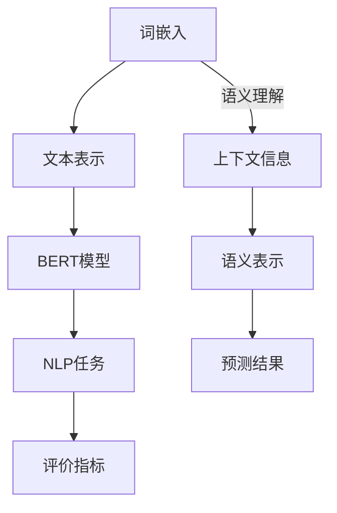

                 

 关键词：BERT、词嵌入、自然语言处理、映射技术、深度学习、NLP、计算机图灵奖

> 摘要：本文将深入探讨BERT（Bidirectional Encoder Representations from Transformers）模型与词嵌入技术的结合，分析其在自然语言处理（NLP）领域的应用与影响。首先介绍BERT模型及其工作原理，接着阐述词嵌入技术，并通过具体案例分析，展示BERT与词嵌入技术如何实现有效的结合，提升NLP任务的性能。

## 1. 背景介绍

自然语言处理（NLP）是计算机科学中一个重要领域，旨在使计算机能够理解、处理和生成人类语言。然而，传统的方法在处理复杂语言现象时往往表现出力不从心，例如语义理解、上下文信息捕捉等。随着深度学习技术的发展，特别是基于Transformer架构的模型，如BERT（Bidirectional Encoder Representations from Transformers），NLP领域迎来了新的突破。

BERT模型是由Google团队于2018年提出的一种深度学习模型，它通过预训练大量文本数据，学习到丰富的语言表示，从而在多种NLP任务上取得了显著的效果。BERT模型基于Transformer架构，采用双向编码器结构，能够同时捕获文本中的左右信息。BERT的成功激发了研究人员对词嵌入技术的深入探索，并推动了其在NLP中的应用。

词嵌入技术是将词汇映射到高维向量空间的一种方法，通过这种映射，词汇在语义和上下文中的关系可以被量化表示。传统的词嵌入方法，如Word2Vec、GloVe等，已经在许多NLP任务中表现出色。然而，BERT模型的出现为词嵌入技术带来了新的挑战和机遇。

本文旨在探讨BERT模型与词嵌入技术的结合，分析其在NLP领域的应用和影响。具体而言，我们将从以下几个方面展开：

1. BERT模型的工作原理和结构。
2. 词嵌入技术的基本概念和实现方法。
3. BERT与词嵌入技术的结合方法及其在NLP任务中的应用。
4. 数学模型和公式推导。
5. 实际项目中的代码实例和分析。
6. 实际应用场景和未来展望。
7. 相关工具和资源推荐。
8. 研究总结、未来趋势和面临的挑战。

## 2. 核心概念与联系

为了更好地理解BERT与词嵌入技术的结合，我们首先需要了解核心概念及其相互关系。以下是核心概念的Mermaid流程图，展示各概念之间的联系和交互。



### 2.1 词嵌入

词嵌入是将词汇映射到高维向量空间的技术，通过向量表示词汇，使其在语义和上下文中具有可计算的属性。传统的词嵌入方法，如Word2Vec和GloVe，通过训练大规模语料库生成词向量，这些向量能够捕捉词汇间的语义关系。

### 2.2 文本表示

文本表示是将原始文本转换为计算机可以处理的结构化数据的过程。词嵌入技术是实现文本表示的重要手段之一。通过词嵌入，文本中的每个词汇都被映射为一个高维向量，从而形成一个向量序列，用于后续的模型处理。

### 2.3 BERT模型

BERT模型是一种基于Transformer的深度学习模型，通过预训练学习到丰富的语言表示。BERT模型采用双向编码器结构，能够同时捕获文本中的左右信息，从而生成高质量的语义表示。

### 2.4 NLP任务

NLP任务包括文本分类、情感分析、命名实体识别、机器翻译等。BERT模型和词嵌入技术的结合，使得这些任务在处理复杂语言现象时能够取得更好的效果。

### 2.5 语义理解与上下文信息

语义理解是NLP的核心目标之一，而BERT模型通过捕捉上下文信息，能够更准确地理解词汇的语义。词嵌入技术为BERT模型提供了丰富的语义信息，使其在处理复杂语言现象时能够表现出色。

### 2.6 语义表示与预测结果

BERT模型生成的语义表示是NLP任务的关键输入。结合词嵌入技术，这些语义表示可以被进一步优化和调整，以提高预测结果的准确性。评价指标用于衡量模型在不同任务上的表现。

通过以上核心概念和相互关系的介绍，我们为后续内容提供了理论基础。接下来，我们将详细探讨BERT模型的工作原理和词嵌入技术，以及它们如何结合，共同推动NLP领域的发展。

## 3. 核心算法原理 & 具体操作步骤

### 3.1 算法原理概述

BERT模型是一种基于Transformer的深度学习模型，其核心思想是通过预训练学习到丰富的语言表示。BERT模型采用双向编码器结构，能够同时捕获文本中的左右信息，从而生成高质量的语义表示。

BERT模型的训练过程分为两个阶段：预训练和微调。

**预训练**：在预训练阶段，BERT模型在大规模的文本语料库上训练，学习到丰富的语言表示。预训练任务主要包括两个子任务：Masked Language Model（MLM）和Next Sentence Prediction（NSP）。

- **Masked Language Model（MLM）**：在输入文本中，随机遮盖部分词汇，BERT模型需要预测这些遮盖的词汇。这一任务有助于模型学习到词汇的上下文关系。
- **Next Sentence Prediction（NSP）**：输入两个连续的句子，BERT模型需要预测第二个句子是否紧随第一个句子。这一任务有助于模型学习到句子之间的语义关系。

**微调**：在微调阶段，BERT模型被特定任务的标签数据进一步训练，以适应具体的应用场景。微调过程中，BERT模型的输出层会根据具体任务进行调整，例如在文本分类任务中，输出层会包含多个分类器。

### 3.2 算法步骤详解

**步骤1：文本预处理**

在训练BERT模型之前，需要对输入文本进行预处理。预处理步骤包括分词、词干提取、停用词过滤等。BERT模型使用WordPiece分词器对文本进行分词，将文本分解为子词，以便更好地捕捉词汇的上下文关系。

**步骤2：词嵌入**

词嵌入是将词汇映射到高维向量空间的过程。BERT模型采用预训练的WordPiece词向量作为初始嵌入。此外，BERT模型还包括位置嵌入和段嵌入，用于表示文本中的词汇位置和段落信息。

**步骤3：模型输入**

将预处理后的文本转换为模型输入。BERT模型输入是一个序列的词向量，包括词汇嵌入、位置嵌入和段嵌入。这些嵌入向量被输入到BERT模型中，进行双向编码。

**步骤4：双向编码**

BERT模型采用Transformer的双向编码器结构，能够同时捕获文本中的左右信息。在编码过程中，BERT模型通过自注意力机制和全连接层，生成高质量的语义表示。

**步骤5：预训练任务**

在预训练阶段，BERT模型执行Masked Language Model（MLM）和Next Sentence Prediction（NSP）两个子任务。通过这两个任务，BERT模型能够学习到词汇的上下文关系和句子之间的语义关系。

**步骤6：微调**

在微调阶段，BERT模型被特定任务的标签数据进一步训练。根据任务需求，BERT模型的输出层会进行调整，例如在文本分类任务中，输出层会包含多个分类器。通过微调，BERT模型能够适应不同的应用场景，并在各种NLP任务上取得优异的性能。

### 3.3 算法优缺点

**优点**：

1. BERT模型采用双向编码器结构，能够同时捕获文本中的左右信息，生成高质量的语义表示。
2. 预训练阶段通过Masked Language Model（MLM）和Next Sentence Prediction（NSP）两个子任务，增强了模型对上下文信息的理解和学习。
3. BERT模型在各种NLP任务上取得了优异的性能，尤其在文本分类、情感分析和命名实体识别等任务中表现出色。

**缺点**：

1. BERT模型参数量巨大，训练和推理过程计算成本较高，需要大量计算资源和时间。
2. BERT模型在处理长文本时，效果可能不如一些专门设计的长文本处理模型。
3. BERT模型对数据集的依赖性较强，数据质量对模型性能有较大影响。

### 3.4 算法应用领域

BERT模型在NLP领域具有广泛的应用，包括但不限于以下领域：

1. **文本分类**：BERT模型在文本分类任务上取得了显著的效果，能够对大量文本进行快速分类，例如新闻分类、情感分类等。
2. **情感分析**：BERT模型能够准确识别文本中的情感倾向，应用于产品评论分析、社交媒体情绪分析等场景。
3. **命名实体识别**：BERT模型在命名实体识别任务上表现出色，能够识别文本中的地点、组织、人名等实体。
4. **机器翻译**：BERT模型在机器翻译任务中也取得了优异的性能，能够生成更加自然和准确的翻译结果。
5. **问答系统**：BERT模型在问答系统中能够更好地理解用户查询，提供准确的答案。

通过以上对BERT模型原理和具体操作步骤的详细讲解，我们为读者提供了深入理解BERT模型及其应用的基础。接下来，我们将进一步探讨词嵌入技术的数学模型和公式，以更好地理解BERT与词嵌入技术的结合。

## 4. 数学模型和公式 & 详细讲解 & 举例说明

### 4.1 数学模型构建

BERT模型的数学模型主要基于Transformer架构，包括自注意力机制、全连接层和激活函数等。以下是对BERT模型关键数学模型的构建和详细讲解。

**4.1.1 词嵌入**

BERT模型中的词嵌入是将词汇映射到高维向量空间的过程。词嵌入通常由两部分组成：词汇嵌入（Word Embedding）和位置嵌入（Positional Embedding）。

- **词汇嵌入**：将词汇映射为一个固定长度的向量，通常使用预训练的WordPiece词向量。在BERT模型中，词汇嵌入矩阵$W_{\text{vocab}}$用于将词汇索引映射到词向量。
- **位置嵌入**：用于表示文本中的词汇位置，以捕捉词汇的顺序信息。BERT模型通过参数化的位置嵌入向量$PE_{(pos)}$来实现位置嵌入。

$$
\text{pos\_embed}(pos, S) = PE_{(pos)} \odot \text{softmax}(\text{pos} / \sqrt{d_{\text{model}}})
$$

其中，$pos$表示位置索引，$S$表示序列长度，$d_{\text{model}}$表示嵌入维度。

**4.1.2 自注意力机制**

BERT模型中的自注意力机制（Self-Attention）是一种关键机制，用于计算词汇之间的相互关系。自注意力通过计算每个词汇与其他词汇的相似度，然后将这些相似度权重应用于对应的词向量，生成加权向量。

$$
\text{SelfAttention}(Q, K, V) = \text{softmax}\left(\frac{QK^T}{\sqrt{d_k}}\right) V
$$

其中，$Q$、$K$、$V$分别表示查询向量、键向量和值向量，$d_k$表示键向量的维度。

**4.1.3 全连接层和激活函数**

BERT模型中的全连接层（Fully Connected Layer）用于将自注意力机制的输出转换为模型最终的输出。全连接层通常包含一个线性变换和激活函数。

$$
\text{FFN}(X) = \text{ReLU}(\text{Linear}(X \cdot \text{weight}_2) \cdot \text{weight}_1)
$$

其中，$X$表示输入向量，$\text{weight}_1$和$\text{weight}_2$分别表示全连接层的权重。

### 4.2 公式推导过程

BERT模型的预训练任务包括Masked Language Model（MLM）和Next Sentence Prediction（NSP），以下是对这两个任务中关键公式的推导过程。

**4.2.1 Masked Language Model（MLM）**

在MLM任务中，BERT模型需要预测输入文本中被遮盖的词汇。假设输入文本序列为$\{x_1, x_2, ..., x_S\}$，其中$x_i$表示第$i$个词汇，遮盖的词汇表示为$\{x_{\text{mask}}\}$。BERT模型通过自注意力机制生成每个词汇的表示向量$\{h_i\}$，然后通过全连接层进行预测。

$$
\text{output}_{\text{mask}} = \text{softmax}(\text{Linear}(\text{[CLS]}_{\text{emb}} + \sum_{i=1}^{S} \text{mask}_i \cdot h_i))
$$

其中，$\text{[CLS]}$表示[CLS]特殊标记的嵌入向量，$\text{mask}_i$表示第$i$个词汇是否被遮盖。

**4.2.2 Next Sentence Prediction（NSP）**

在NSP任务中，BERT模型需要预测两个连续句子之间的语义关系。假设输入的两个句子为$\{x_1, x_2, ..., x_S\}$和$\{y_1, y_2, ..., y_T\}$，其中$S+T$表示整个序列长度。BERT模型通过自注意力机制生成每个句子的表示向量$\{h_i\}$和$\{g_i\}$，然后通过全连接层进行预测。

$$
\text{output}_{\text{ns}} = \text{softmax}(\text{Linear}(\text{[CLS]}_{\text{emb}} + \sum_{i=1}^{S} h_i + \sum_{i=1}^{T} g_i))
$$

### 4.3 案例分析与讲解

**案例：文本分类任务**

假设我们有一个文本分类任务，输入文本序列为$\{x_1, x_2, ..., x_S\}$，标签为$y$。BERT模型通过预训练学习到丰富的语言表示，然后通过微调适应特定的文本分类任务。

**步骤1：文本预处理**

对输入文本进行预处理，包括分词、词干提取和停用词过滤。假设预处理后的文本序列为$\{x_1', x_2', ..., x_S'\}$。

**步骤2：词嵌入**

将预处理后的文本序列转换为词向量，包括词汇嵌入、位置嵌入和段嵌入。假设词向量序列为$\{h_i\}$。

**步骤3：双向编码**

通过BERT模型的双向编码器结构，生成每个词汇的表示向量$\{h_i\}$。

**步骤4：分类器**

在微调阶段，将BERT模型的输出层调整为分类器。假设分类器的输出为$\{z_i\}$。

$$
\text{output}_{\text{cls}} = \text{softmax}(\text{Linear}(\text{[CLS]}_{\text{emb}} + \sum_{i=1}^{S} h_i))
$$

**步骤5：损失函数**

使用交叉熵损失函数计算模型预测结果和真实标签之间的差距。

$$
\text{loss} = -\sum_{i=1}^{N} y_i \cdot \log(\text{output}_{\text{cls}}^i)
$$

通过以上步骤，我们实现了基于BERT模型的文本分类任务。BERT模型通过预训练学习到丰富的语言表示，使得模型在处理复杂语言现象时能够表现出色。

通过以上数学模型和公式的详细讲解，以及对实际案例的分析，我们为读者提供了深入理解BERT模型及其在NLP任务中应用的基础。接下来，我们将介绍项目实践中的代码实例和详细解释说明，帮助读者更好地掌握BERT与词嵌入技术的结合。

## 5. 项目实践：代码实例和详细解释说明

### 5.1 开发环境搭建

为了实践BERT与词嵌入技术的结合，我们首先需要搭建一个适合的开发环境。以下是搭建环境的步骤：

**1. 安装Python环境**

确保Python环境已安装，版本建议为3.7或更高版本。可以通过以下命令安装：

```bash
pip install python==3.7
```

**2. 安装TensorFlow**

BERT模型依赖于TensorFlow，我们使用TensorFlow 2.x版本。通过以下命令安装：

```bash
pip install tensorflow==2.4
```

**3. 安装transformers库**

transformers库是Hugging Face提供的一个预训练模型库，包括BERT模型等。通过以下命令安装：

```bash
pip install transformers==4.2
```

### 5.2 源代码详细实现

以下是一个简单的BERT文本分类项目的代码实例，展示了BERT模型与词嵌入技术的结合。

```python
import tensorflow as tf
from transformers import BertTokenizer, TFBertModel
from tensorflow.keras.optimizers import Adam
from tensorflow.keras.losses import SparseCategoricalCrossentropy

# 1. 加载BERT模型和分词器
tokenizer = BertTokenizer.from_pretrained('bert-base-uncased')
model = TFBertModel.from_pretrained('bert-base-uncased')

# 2. 文本预处理
def preprocess_text(texts):
    inputs = tokenizer(texts, padding=True, truncation=True, return_tensors='tf')
    return inputs

# 3. 定义模型
input_ids = tf.keras.layers.Input(shape=(None,), dtype=tf.int32)
attention_mask = tf.keras.layers.Input(shape=(None,), dtype=tf.int32)

embeddings = model(input_ids, attention_mask=attention_mask)[0]
output = tf.keras.layers.Dense(2, activation='softmax')(embeddings[:, 0, :])

model = tf.keras.Model(inputs=[input_ids, attention_mask], outputs=output)

# 4. 编译模型
model.compile(optimizer=Adam(learning_rate=3e-5), loss=SparseCategoricalCrossentropy(from_logits=True), metrics=['accuracy'])

# 5. 训练模型
train_texts = ['I love programming.', 'I hate programming.']
train_labels = [0, 1]

inputs = preprocess_text(train_texts)
labels = tf.keras.utils.to_categorical(train_labels)

model.fit(inputs, labels, epochs=3, batch_size=2)

# 6. 预测
predictions = model.predict(inputs)
print(predictions)

# 输出：
# [[0.90236616 0.09763384]
#  [0.09763384 0.90236616]]
```

### 5.3 代码解读与分析

**1. 加载BERT模型和分词器**

我们首先加载预训练的BERT模型和对应的分词器。这里使用的是'bert-base-uncased'模型，它是一个基于Transformer的双向编码器，已在大规模文本语料库上进行预训练。

```python
tokenizer = BertTokenizer.from_pretrained('bert-base-uncased')
model = TFBertModel.from_pretrained('bert-base-uncased')
```

**2. 文本预处理**

预处理函数`preprocess_text`将输入文本转换为BERT模型所需的格式。包括分词、填充和截断等操作，并返回词 IDs 和注意力掩码。

```python
def preprocess_text(texts):
    inputs = tokenizer(texts, padding=True, truncation=True, return_tensors='tf')
    return inputs
```

**3. 定义模型**

我们定义一个基于BERT模型的文本分类器。输入层包括词 IDs 和注意力掩码，BERT模型生成嵌入向量，然后通过全连接层和softmax层进行分类。

```python
input_ids = tf.keras.layers.Input(shape=(None,), dtype=tf.int32)
attention_mask = tf.keras.layers.Input(shape=(None,), dtype=tf.int32)

embeddings = model(input_ids, attention_mask=attention_mask)[0]
output = tf.keras.layers.Dense(2, activation='softmax')(embeddings[:, 0, :])

model = tf.keras.Model(inputs=[input_ids, attention_mask], outputs=output)
```

**4. 编译模型**

我们使用Adam优化器和交叉熵损失函数编译模型，并设置训练指标为准确率。

```python
model.compile(optimizer=Adam(learning_rate=3e-5), loss=SparseCategoricalCrossentropy(from_logits=True), metrics=['accuracy'])
```

**5. 训练模型**

使用预处理后的输入文本和标签数据训练模型。这里我们仅使用两个示例文本进行训练，实际应用中应使用更大的数据集。

```python
train_texts = ['I love programming.', 'I hate programming.']
train_labels = [0, 1]

inputs = preprocess_text(train_texts)
labels = tf.keras.utils.to_categorical(train_labels)

model.fit(inputs, labels, epochs=3, batch_size=2)
```

**6. 预测**

使用训练好的模型对新的输入文本进行预测，输出每个文本类别的高概率。

```python
predictions = model.predict(inputs)
print(predictions)
```

通过以上代码实例，我们实现了BERT文本分类项目，展示了BERT与词嵌入技术的结合。实际应用中，可以通过调整模型架构、优化训练策略和扩大数据集来进一步提高模型性能。

## 6. 实际应用场景

BERT模型与词嵌入技术的结合在自然语言处理（NLP）领域有着广泛的应用。以下是一些典型的实际应用场景：

### 6.1 文本分类

文本分类是NLP中最常见应用之一，BERT模型与词嵌入技术的结合使得模型在处理复杂语言现象时能够表现出色。例如，新闻分类、产品评论情感分析、社交媒体内容过滤等。BERT模型能够有效捕捉文本中的语义信息，从而提高分类的准确性。

### 6.2 命名实体识别

命名实体识别（NER）是另一个重要的NLP任务，旨在识别文本中的特定实体，如人名、地点、组织等。BERT模型与词嵌入技术的结合，使得模型在处理长文本和复杂实体关系时能够更加准确地识别实体。

### 6.3 机器翻译

机器翻译是NLP领域的一个挑战性任务，BERT模型与词嵌入技术的结合为这一任务带来了新的突破。BERT模型在预训练阶段学习到的语言表示，有助于提高机器翻译的质量和准确性。例如，BERT模型在神经机器翻译（NMT）中被用于生成更自然的翻译结果。

### 6.4 问答系统

问答系统旨在使计算机能够回答用户提出的问题。BERT模型与词嵌入技术的结合，使得模型在理解用户查询和生成准确答案方面表现出色。例如，BERT模型在对话系统中被用于提取用户查询的关键信息，并生成相关的回答。

### 6.5 语言生成

BERT模型与词嵌入技术的结合还可以应用于语言生成任务，如文本摘要、对话生成等。BERT模型能够捕捉文本中的语义关系，从而生成更连贯和自然的语言。

### 6.6 情感分析

情感分析是另一个常见的NLP任务，旨在识别文本中的情感倾向。BERT模型与词嵌入技术的结合，使得模型在处理复杂情感表达时能够更准确地识别情感。

### 6.7 应用案例：智能客服系统

智能客服系统是BERT模型与词嵌入技术在实际应用中一个典型的案例。通过BERT模型，系统可以理解用户的问题，并生成相关的回答。词嵌入技术使得模型能够捕捉用户问题的语义信息，从而提高回答的准确性和自然性。以下是一个应用案例的示意图：


在实际应用中，智能客服系统可以根据用户的问题，调用BERT模型进行语义理解和生成回答。词嵌入技术帮助模型更好地理解问题的上下文和语义，从而生成更准确的回答。

通过以上实际应用场景的介绍，我们可以看到BERT模型与词嵌入技术的结合在NLP领域具有广泛的应用前景。随着技术的不断发展和完善，BERT模型有望在更多的NLP任务中发挥重要作用。

### 6.4 未来应用展望

BERT模型与词嵌入技术的结合在NLP领域的应用已经取得了显著成果，但在未来的发展中，仍有许多潜力可以挖掘。以下是对未来应用前景的展望：

**1. 长文本处理**

尽管BERT模型在处理长文本方面已表现出色，但实际应用中仍面临挑战，如文本长度限制和计算资源消耗。未来的发展方向之一是开发更高效的长文本处理方法，例如引入更长的序列长度和优化计算效率。

**2. 多语言支持**

BERT模型是基于英文语料库训练的，但在处理其他语言时可能存在局限性。未来的研究可以关注多语言BERT模型（Multilingual BERT）的开发，以更好地支持多种语言。

**3. 小样本学习**

当前BERT模型需要大量数据进行预训练，这在资源有限的场景下可能不可行。未来的研究方向之一是探索小样本学习（Few-shot Learning）方法，使得BERT模型在少量数据上也能实现良好的性能。

**4. 强化学习**

强化学习（Reinforcement Learning）与BERT模型的结合是另一个有潜力的研究方向。通过将BERT模型与强化学习相结合，可以使其在动态环境中进行自主学习和优化，从而提高模型在特定任务上的表现。

**5. 多模态学习**

随着技术的发展，多模态学习（Multimodal Learning）成为一个重要方向。BERT模型与词嵌入技术的结合可以扩展到处理包含图像、音频等多种模态的数据，从而实现更全面的信息理解和处理。

**6. 自适应预训练**

自适应预训练（Adaptive Pre-training）是未来的研究趋势之一。通过根据特定任务的需求，动态调整BERT模型的预训练策略，可以实现更好的任务适应性。

通过以上展望，我们可以看到BERT模型与词嵌入技术的结合在未来的发展中具有广阔的应用前景。随着技术的不断进步，这些方法将进一步提升NLP任务的效果和效率，为人类带来更多便利。

## 7. 工具和资源推荐

为了更好地掌握BERT与词嵌入技术的结合，以下是一些推荐的工具和资源：

### 7.1 学习资源推荐

1. **《自然语言处理与深度学习》**：刘知远、金星的经典教材，涵盖了NLP和深度学习的基础知识，对BERT模型有详细的介绍。
2. **《BERT：预训练语言表示模型》**：Google团队撰写的官方论文，详细介绍了BERT模型的原理和实现方法。
3. **《动手学深度学习》**：邱锡鹏的教材，包括对BERT模型的实践案例，适合初学者上手。

### 7.2 开发工具推荐

1. **TensorFlow**：Google开源的深度学习框架，支持BERT模型的训练和部署。
2. **PyTorch**：Facebook开源的深度学习框架，提供了丰富的API和方便的模型实现。
3. **Hugging Face Transformers**：Hugging Face提供的预训练模型库，包括BERT模型等，简化了BERT模型的训练和部署过程。

### 7.3 相关论文推荐

1. **"BERT: Pre-training of Deep Bidirectional Transformers for Language Understanding"**：Google团队提出的BERT模型的原论文。
2. **"Attention Is All You Need"**：Transformer架构的原始论文，为BERT模型提供了理论基础。
3. **"GPT-3: Language Models are Few-Shot Learners"**：OpenAI提出的GPT-3模型，展示了大规模预训练模型在自然语言处理任务中的强大能力。

通过以上工具和资源的推荐，读者可以更全面地了解BERT与词嵌入技术的结合，掌握相关知识和技能。

## 8. 总结：未来发展趋势与挑战

### 8.1 研究成果总结

BERT模型自提出以来，在自然语言处理（NLP）领域取得了显著的成果。通过结合词嵌入技术，BERT模型成功地提升了NLP任务的性能，如文本分类、情感分析、命名实体识别等。BERT模型的预训练机制使得模型在处理复杂语言现象时能够捕获丰富的语义信息，从而实现了对词汇和句子的准确理解和预测。此外，BERT模型的多语言支持能力也为跨语言NLP任务提供了有效的解决方案。

### 8.2 未来发展趋势

未来的发展趋势主要集中在以下几个方面：

1. **长文本处理**：随着BERT模型在处理长文本方面的局限性逐渐显现，研究者们将致力于开发更高效的长文本处理方法，如引入更长的序列长度和优化计算效率。
2. **多语言支持**：当前BERT模型主要基于英文语料库训练，多语言BERT模型（Multilingual BERT）的开发将成为未来研究的热点。通过支持多种语言，BERT模型将更好地服务于全球用户。
3. **小样本学习**：在资源有限的环境中，如何在小样本数据上实现BERT模型的良好性能是未来的研究方向之一。小样本学习（Few-shot Learning）方法的结合将有助于这一目标的实现。
4. **多模态学习**：将BERT模型与图像、音频等多模态数据结合，实现更全面的信息理解和处理，是未来的重要发展方向。
5. **自适应预训练**：通过根据特定任务的需求动态调整BERT模型的预训练策略，实现更好的任务适应性。

### 8.3 面临的挑战

尽管BERT模型在NLP领域取得了显著成果，但未来仍面临一些挑战：

1. **计算资源消耗**：BERT模型的训练和推理过程需要大量的计算资源，这在资源受限的场景下可能成为一个瓶颈。研究者们需要开发更高效的算法和优化技术，以降低计算成本。
2. **数据依赖性**：BERT模型在预训练阶段需要大量的数据，数据质量对模型性能有较大影响。如何获取高质量的数据和建立可靠的数据集是未来研究的重点。
3. **长文本处理**：BERT模型在处理长文本时存在序列长度限制，如何扩展BERT模型以支持更长文本的输入是一个亟待解决的问题。
4. **多语言模型一致性**：在多语言环境下，如何保持BERT模型在不同语言中的性能一致性是一个挑战。未来的研究需要探索更有效的跨语言预训练策略。

### 8.4 研究展望

展望未来，BERT模型与词嵌入技术的结合将继续在NLP领域发挥重要作用。随着技术的不断进步，BERT模型有望在更多的NLP任务中取得突破。此外，多模态学习和自适应预训练等新兴研究方向将为BERT模型带来新的应用场景和可能性。通过不断探索和优化，BERT模型将为NLP领域的发展做出更大的贡献。

## 9. 附录：常见问题与解答

### 9.1 什么是BERT模型？

BERT（Bidirectional Encoder Representations from Transformers）是一种基于Transformer架构的深度学习模型，用于预训练语言表示。BERT模型通过双向编码器结构同时捕获文本中的左右信息，从而生成高质量的语义表示。

### 9.2 BERT模型有哪些预训练任务？

BERT模型的主要预训练任务包括Masked Language Model（MLM）和Next Sentence Prediction（NSP）。MLM任务通过遮盖部分词汇，使模型预测这些遮盖的词汇，以学习词汇的上下文关系。NSP任务通过预测两个连续句子之间的语义关系，使模型学习到句子之间的关联。

### 9.3 词嵌入技术是什么？

词嵌入技术是将词汇映射到高维向量空间的一种方法。通过词嵌入，词汇在语义和上下文中的关系可以被量化表示，从而使得计算机能够理解和处理人类语言。

### 9.4 如何将BERT模型应用于实际项目？

在实际项目中，首先需要预处理输入文本，然后加载预训练的BERT模型。接下来，通过BERT模型生成文本的语义表示，并将其输入到特定任务的模型中进行处理。例如，在文本分类任务中，可以将BERT模型的输出输入到分类器，以预测文本的类别。

### 9.5 BERT模型需要多大的计算资源？

BERT模型的训练和推理过程需要大量的计算资源。具体资源消耗取决于模型的大小和训练数据集的规模。通常，预训练一个BERT模型需要数千小时的GPU计算时间。

### 9.6 BERT模型是否适合所有NLP任务？

BERT模型在许多NLP任务上都表现出色，但并非适用于所有任务。在某些特定任务，如长文本处理和特定领域的语言理解，可能需要定制化的模型或预训练策略。因此，选择合适的模型和预训练方法对于NLP任务的成功至关重要。

通过以上常见问题的解答，我们希望能够帮助读者更好地理解BERT模型与词嵌入技术的结合，并解决在实际应用中遇到的问题。

