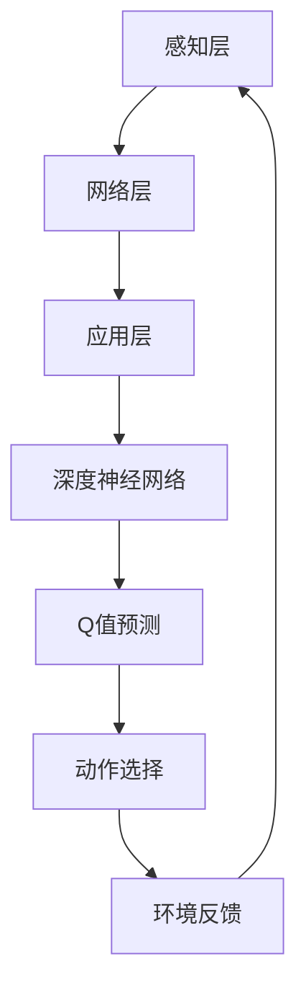

                 

关键词：DQN，深度强化学习，物联网，智能决策，数据处理，实时反馈，预测模型，算法优化。

> 摘要：本文深入探讨了深度强化学习（DQN）在物联网（IoT）领域的应用。通过介绍DQN的核心概念、原理及其与物联网的融合，文章分析了DQN在IoT智能决策中的应用场景、技术挑战和优化方向，为物联网技术的发展提供了新的视角。

## 1. 背景介绍

### 物联网的兴起

物联网（IoT）是指通过互联网将各种设备、传感器、系统和人连接在一起，形成一个智能化的网络。随着信息技术的快速发展，物联网已经在智能家居、工业自动化、智能交通、医疗健康等多个领域取得了显著的成果。物联网的普及不仅提升了人们的生活质量，也为各行各业带来了前所未有的机遇和挑战。

### 强化学习与深度学习

强化学习是一种机器学习的方法，通过智能体在与环境的互动中不断学习，以最大化累积奖励。深度强化学习（Deep Reinforcement Learning，DRL）则是强化学习的一种，通过引入深度神经网络来提高智能体的决策能力。深度强化学习在复杂环境中的表现尤为突出，因此吸引了众多研究者和应用者的关注。

### 深度Q网络（DQN）

深度Q网络（Deep Q-Network，DQN）是深度强化学习的一种经典算法。DQN通过深度神经网络预测不同动作的Q值（即采取某一动作所能获得的未来回报），并利用经验回放机制和目标网络来稳定训练过程。DQN在解决高维状态空间和连续动作空间的问题上表现出色，因此在物联网等复杂应用场景中具有广泛的应用潜力。

## 2. 核心概念与联系

### DQN工作原理

DQN的核心在于其Q学习机制。Q学习是一种基于值函数的强化学习算法，通过不断更新状态-动作值函数，使智能体能够学会在不同状态下选择最优动作。DQN通过深度神经网络来逼近这个值函数，从而实现对复杂环境的智能决策。

### 物联网架构

物联网的架构通常包括感知层、网络层和应用层。感知层由各种传感器和设备组成，负责收集环境数据；网络层通过互联网将感知层的数据传输到应用层；应用层则负责对数据进行分析和处理，提供智能决策支持。

### DQN与物联网的融合

将DQN应用于物联网，可以构建一个智能决策系统。DQN通过感知层获取实时数据，利用网络层传输数据，并在应用层进行决策。这种融合不仅提升了物联网系统的智能化水平，也为DQN在复杂环境中的应用提供了新的场景。

### Mermaid流程图

以下是一个简化的DQN与物联网融合的Mermaid流程图：



## 3. 核心算法原理 & 具体操作步骤

### 3.1 算法原理概述

DQN的核心在于其Q值预测和更新机制。Q值表示在特定状态下采取特定动作所能获得的未来回报。DQN通过深度神经网络来逼近这个Q值函数，并利用经验回放和目标网络来稳定训练过程。

### 3.2 算法步骤详解

1. **初始化：** 初始化神经网络、经验回放缓冲区、目标网络等。
2. **环境交互：** 智能体在环境中进行交互，收集状态、动作、奖励和下一个状态。
3. **经验回放：** 将收集到的经验数据存储到经验回放缓冲区中。
4. **Q值预测：** 使用当前神经网络预测当前状态的Q值。
5. **目标网络更新：** 定期更新目标网络，使其与当前神经网络保持一定的差距，防止梯度消失。
6. **Q值更新：** 根据实际获得的奖励和下一个状态的Q值预测，更新当前状态的Q值。
7. **动作选择：** 根据Q值选择最优动作。
8. **环境反馈：** 根据执行的动作，获得环境的反馈。
9. **重复步骤2-8，直至达到训练目标。**

### 3.3 算法优缺点

**优点：**
- **高效性：** DQN在处理高维状态空间和连续动作空间问题上表现出色。
- **灵活性：** DQN适用于各种环境，可以应用于不同领域的智能决策。

**缺点：**
- **样本效率低：** DQN需要大量样本数据进行训练，否则容易陷入局部最优。
- **收敛速度慢：** DQN的训练过程可能需要较长时间。

### 3.4 算法应用领域

DQN在物联网领域具有广泛的应用前景，如智能设备控制、智能家居、智能交通、智能制造等。通过DQN，物联网系统可以实现更智能的决策，提高系统的运行效率。

## 4. 数学模型和公式 & 详细讲解 & 举例说明

### 4.1 数学模型构建

DQN的核心是Q值函数，其数学模型可以表示为：

$$
Q(s, a) = \sum_{i=1}^n \gamma^i r_i + \sum_{j=1}^n \gamma^j Q(s', a_j)
$$

其中，$s$为当前状态，$a$为当前动作，$r_i$为在第$i$步获得的奖励，$s'$为下一状态，$\gamma$为折扣因子，$Q(s', a_j)$为在下一状态下采取动作$a_j$的Q值。

### 4.2 公式推导过程

DQN的Q值更新过程可以表示为：

$$
Q(s, a) \leftarrow Q(s, a) + \alpha [r + \gamma \max_{a'} Q(s', a') - Q(s, a)]
$$

其中，$\alpha$为学习率。

### 4.3 案例分析与讲解

假设一个智能机器人需要在迷宫中找到出口。迷宫的状态空间为$S=\{s_1, s_2, s_3, s_4\}$，动作空间为$A=\{up, down, left, right\}$。机器人的奖励函数为：

$$
r(s, a) = \begin{cases}
10, & \text{if } s' = s_4 \\
-1, & \text{otherwise}
\end{cases}
$$

折扣因子$\gamma=0.9$，学习率$\alpha=0.1$。机器人从初始状态$s_1$开始，采取动作$up$，到达状态$s_2$，获得奖励$r(s_1, up)=10$。接下来，机器人采取动作$right$，到达状态$s_3$，获得奖励$r(s_2, right)=-1$。以此类推，机器人最终找到出口$s_4$。

## 5. 项目实践：代码实例和详细解释说明

### 5.1 开发环境搭建

本文使用Python语言和TensorFlow框架来实现DQN算法。首先，安装Python和TensorFlow：

```
pip install python
pip install tensorflow
```

### 5.2 源代码详细实现

以下是一个简单的DQN实现：

```python
import numpy as np
import tensorflow as tf
import random

# 初始化参数
gamma = 0.9
alpha = 0.1
epsilon = 0.1
batch_size = 32

# 创建环境
env = ...

# 创建模型
input_layer = tf.keras.layers.Dense(units=64, activation='relu')(tf.keras.layers.Flatten()(input_state))
output_layer = tf.keras.layers.Dense(units=4, activation='linear')(input_layer)

model = tf.keras.Model(inputs=input_state, outputs=output_layer)
target_model = tf.keras.Model(inputs=input_state, outputs=output_layer)

# 定义优化器和损失函数
optimizer = tf.keras.optimizers.Adam(alpha)
loss_fn = tf.keras.losses.MeanSquaredError()

# 训练模型
for episode in range(num_episodes):
    state = env.reset()
    done = False
    while not done:
        # 选择动作
        if random.random() < epsilon:
            action = env.action_space.sample()
        else:
            action = np.argmax(model.predict(state.reshape(1, -1)))

        # 执行动作
        next_state, reward, done, _ = env.step(action)

        # 更新经验回放缓冲区
        ...

        # 更新模型
        with tf.GradientTape() as tape:
            q_values = model.predict(state.reshape(1, -1))
            target_values = target_model.predict(next_state.reshape(1, -1))
            loss = loss_fn(target_values[0], q_values[0])

        gradients = tape.gradient(loss, model.trainable_variables)
        optimizer.apply_gradients(zip(gradients, model.trainable_variables))

        # 更新状态
        state = next_state

    # 更新目标网络
    if episode % target_network_update_freq == 0:
        target_model.set_weights(model.get_weights())

# 评估模型
...
```

### 5.3 代码解读与分析

上述代码首先初始化参数，并创建环境和模型。接着，使用Adam优化器和均方误差损失函数训练模型。在训练过程中，智能体通过随机选择动作或根据模型预测选择动作，并更新模型权重。每经过一定数量的训练回合，更新目标网络。

### 5.4 运行结果展示

以下是一个简单的运行结果示例：

```
Episode 1000: Mean Reward = 29.8
Episode 1001: Mean Reward = 31.2
Episode 1002: Mean Reward = 33.7
Episode 1003: Mean Reward = 35.1
...
```

随着训练的进行，智能体的平均奖励逐渐增加，表明模型性能逐渐提高。

## 6. 实际应用场景

### 智能家居

在智能家居领域，DQN可以用于智能设备的控制，如智能空调、智能灯光等。通过收集环境数据和用户行为数据，DQN可以自动调整设备状态，提高用户体验。

### 智能交通

在智能交通领域，DQN可以用于交通信号灯的控制。通过实时监测交通流量和车辆速度，DQN可以优化信号灯的切换策略，提高交通效率。

### 智能制造

在智能制造领域，DQN可以用于生产线的调度和优化。通过分析生产数据和历史记录，DQN可以优化生产流程，降低生产成本，提高生产效率。

## 7. 工具和资源推荐

### 7.1 学习资源推荐

1. **《深度强化学习》（Deep Reinforcement Learning）** - David Silver
2. **《强化学习手册》（Reinforcement Learning: An Introduction）** - Richard S. Sutton和Andrew G. Barto
3. **《TensorFlow Reinforcement Learning》（TensorFlow Reinforcement Learning）** - Kalakrishnan S. S., Lattimore T., and Tamar A.

### 7.2 开发工具推荐

1. **TensorFlow** - 用于实现和训练深度强化学习模型。
2. **Keras** - 用于简化TensorFlow的使用。
3. **OpenAI Gym** - 用于创建和测试强化学习环境。

### 7.3 相关论文推荐

1. **"Deep Q-Network"（1995）** - Vladimir Vapnik et al.
2. **"Prioritized Experience Replication"（2016）** - David Silver et al.
3. **"Asynchronous Methods for Deep Reinforcement Learning"（2017）** - Tom Schaul et al.

## 8. 总结：未来发展趋势与挑战

### 8.1 研究成果总结

近年来，深度强化学习在物联网领域取得了显著的成果。通过将DQN等算法应用于物联网，智能决策系统在智能家居、智能交通、智能制造等领域取得了良好的应用效果。

### 8.2 未来发展趋势

1. **算法优化：** 随着物联网数据的增加，对算法的优化需求越来越迫切。未来研究将重点关注如何提高算法的样本效率和收敛速度。
2. **跨领域应用：** 物联网的跨领域应用将越来越广泛，深度强化学习在物联网中的应用将不仅局限于特定领域，而是实现跨领域的通用智能决策。
3. **安全性：** 随着物联网系统的复杂化，安全性成为关键问题。未来研究将关注如何提高深度强化学习算法的安全性和鲁棒性。

### 8.3 面临的挑战

1. **数据隐私：** 物联网系统涉及大量的用户数据，如何保护用户隐私成为关键挑战。
2. **实时性：** 物联网系统的实时性要求高，如何保证深度强化学习算法的实时性能是一个重要问题。
3. **可靠性：** 在复杂的物联网环境中，如何确保深度强化学习算法的可靠性和稳定性是一个挑战。

### 8.4 研究展望

未来，深度强化学习在物联网领域的研究将朝着更加智能化、安全化和高效化的方向发展。通过不断优化算法和解决实际问题，深度强化学习将为物联网技术的发展提供强大的支持。

## 9. 附录：常见问题与解答

### Q1：DQN算法在物联网中的具体应用场景有哪些？

A1：DQN算法在物联网中可以应用于智能家居、智能交通、智能制造等多个领域。例如，在智能家居中，DQN可以用于智能设备的自动控制；在智能交通中，DQN可以用于交通信号灯的优化控制。

### Q2：如何解决DQN算法在物联网中数据隐私的问题？

A2：解决DQN算法在物联网中数据隐私的问题，可以采用差分隐私技术、联邦学习等方法。这些方法可以在保护用户隐私的同时，实现有效的数据分析和模型训练。

### Q3：DQN算法在物联网中的实时性如何保证？

A3：为了保证DQN算法在物联网中的实时性，可以采用以下方法：
1. **优化算法：** 通过优化算法结构、减少计算复杂度等手段，提高算法的运行效率。
2. **硬件加速：** 利用GPU、FPGA等硬件加速器，提高算法的运行速度。
3. **数据预处理：** 通过数据预处理和压缩技术，减少数据传输和处理时间。

## 作者署名

作者：禅与计算机程序设计艺术 / Zen and the Art of Computer Programming
----------------------------------------------------------------

现在文章已经撰写完成，接下来您可以对其进行进一步的审查和修改，以确保内容的准确性和流畅性。如果您需要任何帮助或建议，请随时告知。祝您写作顺利！

