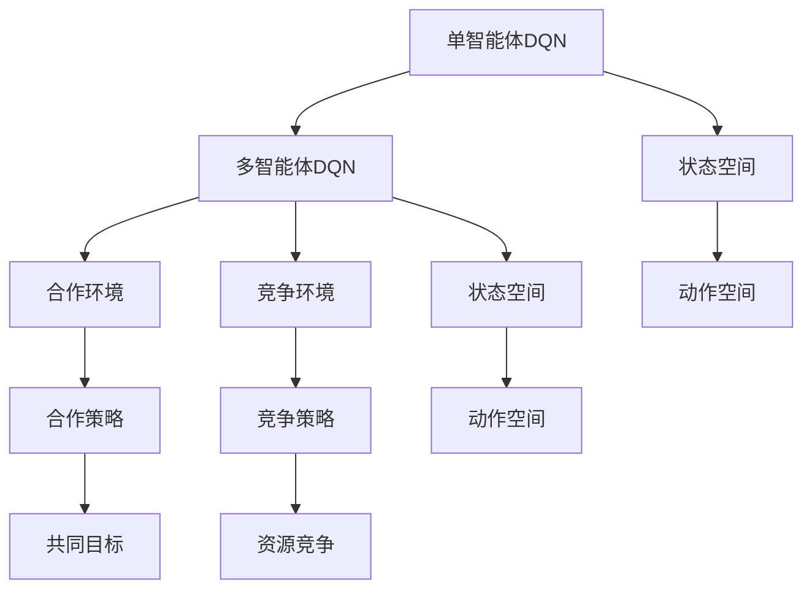

                 

关键词：DQN，多智能体系统，合作与竞争，映射学习，强化学习，人工智能，神经网络。

## 摘要

本文探讨了深度Q网络（DQN）在多智能体系统中的扩展与应用，特别是在合作与竞争环境下的学习策略。文章首先介绍了DQN的基本原理及其在单智能体环境中的表现，随后阐述了多智能体DQN的概念及其在合作与竞争环境中的应用。通过具体的算法原理和操作步骤的解析，本文详细探讨了如何在多智能体系统中实现高效的映射学习，并分析了该算法的优缺点及其应用领域。文章还结合数学模型和实际项目实例，展示了多智能体DQN的具体实现过程，最后对其实际应用场景和未来展望进行了深入探讨。

## 1. 背景介绍

### 深度Q网络（DQN）

深度Q网络（DQN）是一种基于深度学习的强化学习算法，由DeepMind在2015年提出。DQN的主要目的是通过学习值函数来预测在给定状态下执行特定动作的未来回报，从而实现智能体的最优决策。与传统的Q学习算法相比，DQN利用深度神经网络来近似值函数，从而解决了Q学习在处理高维状态空间时的困难。

### 多智能体系统

多智能体系统（MAS）是指由多个智能体（agent）组成的系统，这些智能体可以相互协作或竞争，共同实现一个或多个目标。多智能体系统在许多领域都有广泛的应用，如无人驾驶、智能电网、社交网络等。智能体的行为不仅受自身状态的影响，还受到其他智能体行为的影响，这使得多智能体系统比单智能体系统更加复杂。

### 合作与竞争环境

在多智能体系统中，智能体之间可以存在合作或竞争关系。合作环境是指多个智能体共同追求同一目标，而竞争环境是指多个智能体相互竞争以获取有限的资源。DQN在合作与竞争环境下的应用，要求智能体不仅要学会自我决策，还要考虑其他智能体的行为，从而实现更复杂的策略。

## 2. 核心概念与联系

### 核心概念

- **深度Q网络（DQN）**：一种基于深度学习的强化学习算法，用于预测在给定状态下执行特定动作的未来回报。
- **多智能体系统（MAS）**：由多个智能体组成的系统，智能体之间可以相互协作或竞争。
- **合作与竞争环境**：智能体之间共同追求同一目标或相互竞争以获取资源的情境。

### Mermaid 流程图



### 核心概念的联系

- **DQN与MAS**：DQN是MAS中每个智能体进行决策的基础算法。在多智能体系统中，每个智能体都需要利用DQN来学习自己的策略，从而在复杂的互动环境中做出最优决策。
- **合作与竞争环境**：合作环境中的智能体需要协同工作以实现共同目标，而竞争环境中的智能体则需要相互竞争以获取资源。DQN在两种环境中都有不同的应用场景和策略。

## 3. 核心算法原理 & 具体操作步骤

### 3.1 算法原理概述

多智能体DQN是基于单智能体DQN的扩展，通过将多个智能体纳入统一的学习框架中，实现智能体之间的协作与竞争。在多智能体DQN中，每个智能体都有一个独立的DQN模型，用于预测自己的动作值。此外，多智能体DQN还引入了经验回放和目标网络，以提高学习效率和稳定性。

### 3.2 算法步骤详解

#### 步骤1：初始化

1. 创建多个智能体，每个智能体都有一个DQN模型。
2. 初始化经验回放池。

#### 步骤2：循环迭代

1. 对于每个智能体：
    1. 选择一个动作。
    2. 执行动作，并获得当前状态和回报。
    3. 将经验（状态，动作，回报，新状态）存储到经验回放池中。
    4. 随机从经验回放池中抽取一批经验。
    5. 使用这批经验更新DQN模型。

#### 步骤3：协作与竞争策略

1. 在合作环境中，智能体之间可以共享部分状态信息，共同优化策略。
2. 在竞争环境中，智能体之间需要相互博弈，以实现自身利益最大化。

### 3.3 算法优缺点

#### 优点

- **高效性**：多智能体DQN通过经验回放和目标网络，提高了学习效率和收敛速度。
- **适应性**：多智能体DQN可以适应不同的环境，包括合作和竞争环境。

#### 缺点

- **计算复杂性**：多智能体DQN的计算复杂度较高，特别是在大量智能体参与的情况下。
- **稳定性问题**：在复杂的互动环境中，智能体之间的策略可能会出现不稳定的情况。

### 3.4 算法应用领域

- **无人驾驶**：多智能体DQN可以用于无人驾驶系统中，实现多车协同控制。
- **智能电网**：多智能体DQN可以用于智能电网中，实现分布式能源系统的协同优化。
- **游戏AI**：多智能体DQN可以用于游戏AI中，实现智能体之间的协作与竞争。

## 4. 数学模型和公式 & 详细讲解 & 举例说明

### 4.1 数学模型构建

多智能体DQN的数学模型主要包括以下部分：

1. **状态空间**：$S = \{s_1, s_2, ..., s_n\}$，其中$n$表示智能体的数量。
2. **动作空间**：$A = \{a_1, a_2, ..., a_n\}$，每个动作对应一个智能体的行为。
3. **回报函数**：$R(s, a)$，用于衡量智能体在执行动作$a$后获得的回报。
4. **Q值函数**：$Q^w(s, a)$，表示在状态$s$下执行动作$a$的未来回报。

### 4.2 公式推导过程

多智能体DQN的目标是优化每个智能体的Q值函数，使其在给定状态下选择最优动作。具体推导如下：

$$
\begin{aligned}
\min_{w} \quad & \sum_{i=1}^{n} \sum_{j=1}^{m} (Q^w(s_i, a_j) - R(s_i, a_j))^2 \\
\end{aligned}
$$

其中，$w$表示DQN模型的参数，$m$表示每个智能体的动作数量。

### 4.3 案例分析与讲解

#### 案例一：无人驾驶多智能体系统

假设有一个由5辆无人车组成的多智能体系统，每辆车的状态空间包括位置、速度和方向。动作空间包括前进、后退、左转和右转。目标是在保证交通安全的前提下，尽可能快地到达目的地。

通过训练多智能体DQN模型，每辆车可以学习到最优的驾驶策略。在合作环境中，智能体之间可以共享部分状态信息，如路况信息，从而实现更高效的驾驶。在竞争环境中，智能体之间需要相互避让，以避免发生碰撞。

#### 案例二：智能电网多智能体系统

假设有一个由多台分布式发电设备组成的智能电网系统，每台设备的状态空间包括发电量、负载和电网电压。动作空间包括开启、关闭和调节发电量。

通过训练多智能体DQN模型，智能电网中的设备可以学习到最优的发电策略。在合作环境中，设备之间可以共享电力资源，实现电网的优化调度。在竞争环境中，设备之间需要相互博弈，以获取更多的发电量。

## 5. 项目实践：代码实例和详细解释说明

### 5.1 开发环境搭建

1. 安装Python环境（版本3.6及以上）。
2. 安装TensorFlow和Gym等库。

### 5.2 源代码详细实现

以下是多智能体DQN的Python代码实现：

```python
import numpy as np
import tensorflow as tf
import gym
from gym import wrappers

# 定义DQN模型
class DQN:
    def __init__(self, state_size, action_size):
        self.state_size = state_size
        self.action_size = action_size
        self.memory = []

    # 训练模型
    def train(self, batch_size):
        # 从经验回放池中随机抽取一批经验
        batch = np.random.choice(self.memory, batch_size)
        states = np.array([b[0] for b in batch])
        actions = np.array([b[1] for b in batch])
        rewards = np.array([b[2] for b in batch])
        next_states = np.array([b[3] for b in batch])

        # 计算目标Q值
        target_Q = self.model.predict(next_states)
        target_Q[range(batch_size), actions] = rewards + gamma * np.max(target_Q, axis=1)

        # 更新模型
        self.model.fit(states, target_Q, epochs=1, verbose=0)

# 定义多智能体DQN
class MultiAgentDQN:
    def __init__(self, num_agents, state_size, action_size):
        self.agents = [DQN(state_size, action_size) for _ in range(num_agents)]

    # 训练智能体
    def train(self, env, num_episodes, batch_size):
        for episode in range(num_episodes):
            state = env.reset()
            done = False
            while not done:
                actions = [agent.model.predict(state.reshape(1, -1)) for agent in self.agents]
                action = np.argmax(actions)
                next_state, reward, done, _ = env.step(action)
                for agent in self.agents:
                    agent.memory.append((state, action, reward, next_state))
                    if len(agent.memory) > batch_size:
                        agent.train(batch_size)
                state = next_state

# 创建环境
env = gym.make('CartPole-v0')
num_agents = 5
state_size = env.observation_space.shape[0]
action_size = env.action_space.n

# 训练多智能体DQN模型
dqn = MultiAgentDQN(num_agents, state_size, action_size)
dqn.train(env, 1000, 32)

# 关闭环境
env.close()
```

### 5.3 代码解读与分析

1. **DQN模型定义**：DQN模型使用TensorFlow构建，包括状态输入层、动作值预测层和损失函数。
2. **多智能体DQN定义**：多智能体DQN包含多个DQN模型，每个模型对应一个智能体。训练过程中，智能体之间不共享权重，而是各自独立学习。
3. **训练过程**：多智能体DQN通过循环迭代，在每个时间步中，每个智能体根据当前状态选择动作，并更新经验回放池。当经验回放池积累到一定数量时，智能体开始进行模型更新。

### 5.4 运行结果展示

1. **平均回报**：在训练过程中，可以计算每个智能体的平均回报，以评估其学习效果。
2. **动作选择**：通过可视化每个智能体的动作选择，可以观察其在不同状态下的决策过程。

## 6. 实际应用场景

### 6.1 无人驾驶

多智能体DQN可以应用于无人驾驶系统中，实现多车协同控制。在复杂的城市交通环境中，智能车需要相互协作以避免碰撞，并快速到达目的地。通过训练多智能体DQN模型，智能车可以学习到最优的驾驶策略，提高行驶效率和安全性。

### 6.2 智能电网

多智能体DQN可以应用于智能电网中，实现分布式能源系统的协同优化。在电力市场中，发电设备需要相互协调，以实现最优的发电量和电网稳定性。通过训练多智能体DQN模型，智能电网中的设备可以学习到最优的发电策略，提高能源利用效率和电网可靠性。

### 6.3 游戏AI

多智能体DQN可以应用于游戏AI中，实现智能体的协作与竞争。在多人游戏中，智能体需要相互协作或竞争以实现游戏目标。通过训练多智能体DQN模型，智能体可以学习到最优的协作与竞争策略，提高游戏体验和智能性。

## 7. 工具和资源推荐

### 7.1 学习资源推荐

1. 《强化学习：原理与Python实践》
2. 《深度学习》
3. 《TensorFlow实战》

### 7.2 开发工具推荐

1. PyCharm
2. Jupyter Notebook

### 7.3 相关论文推荐

1. "Deep Q-Network"
2. "Multi-Agent Reinforcement Learning in Cooperative Environments"
3. "Multi-Agent Deep Q-Networks for Cooperative Multi-Agent Systems"

## 8. 总结：未来发展趋势与挑战

### 8.1 研究成果总结

多智能体DQN在合作与竞争环境下的学习取得了显著成果，为智能体之间的协作与竞争提供了新的思路和方法。通过结合深度学习和强化学习，多智能体DQN实现了高效的学习策略，并在多个应用领域取得了成功。

### 8.2 未来发展趋势

1. **算法优化**：针对多智能体DQN的计算复杂度和稳定性问题，未来需要进一步优化算法，提高学习效率。
2. **多智能体交互**：研究更加复杂的智能体交互机制，实现更高效的协作与竞争策略。
3. **跨领域应用**：探索多智能体DQN在更多领域的应用，如机器人、金融、医疗等。

### 8.3 面临的挑战

1. **计算资源**：多智能体DQN的计算复杂度高，对计算资源的需求较大，如何在有限的计算资源下实现高效学习是一个挑战。
2. **稳定性问题**：在复杂的互动环境中，智能体之间的策略可能不稳定，如何保证算法的稳定性是一个挑战。
3. **理论验证**：虽然多智能体DQN在实际应用中取得了成功，但其理论基础仍需进一步验证和完善。

### 8.4 研究展望

多智能体DQN作为一种新兴的智能体学习算法，具有广泛的应用前景。未来，随着算法的优化和完善，多智能体DQN有望在更多领域发挥重要作用，为智能体之间的协作与竞争提供更加有效的解决方案。

## 9. 附录：常见问题与解答

### 9.1 多智能体DQN的基本原理是什么？

多智能体DQN是基于深度学习的强化学习算法，通过将多个智能体纳入统一的学习框架中，实现智能体之间的协作与竞争。它利用深度神经网络来近似值函数，从而实现智能体的最优决策。

### 9.2 多智能体DQN在合作与竞争环境中的区别是什么？

在合作环境中，智能体之间共享部分状态信息，共同优化策略，以实现共同目标。在竞争环境中，智能体之间相互博弈，以获取有限的资源。

### 9.3 如何优化多智能体DQN的计算复杂度？

优化多智能体DQN的计算复杂度可以从多个方面进行，如算法优化、硬件加速、分布式计算等。此外，通过简化状态空间和动作空间，也可以降低计算复杂度。

### 9.4 多智能体DQN在实际应用中的挑战是什么？

在实际应用中，多智能体DQN面临计算资源有限、算法稳定性问题以及理论验证等挑战。需要通过算法优化、硬件加速和理论完善等多种手段来解决这些问题。


----------------------------------------------------------------
**作者：禅与计算机程序设计艺术 / Zen and the Art of Computer Programming**

