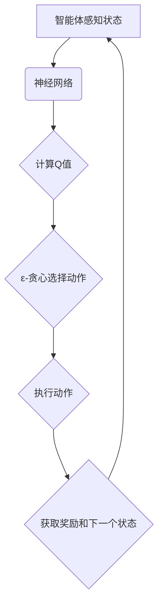

                 

 **关键词：** 深度强化学习，DQN，参数调整，性能优化，映射，神经网络。

**摘要：** 本文将深入探讨深度强化学习（DRL）中的重要算法——深度量化和网络（DQN）的参数调整与性能优化策略。通过详细分析DQN的核心原理、数学模型、具体操作步骤以及实际应用，我们旨在为研究人员和工程师提供一套完整且实用的优化指南，帮助他们在复杂环境下实现高效学习与决策。

## 1. 背景介绍

### 深度强化学习概述

深度强化学习（Deep Reinforcement Learning，DRL）是结合了深度学习和强化学习的一种先进机器学习技术。它通过让智能体在虚拟环境中通过试错来学习优化策略，从而在复杂动态环境中实现自主决策与行为。DRL的兴起，标志着人工智能在决策优化领域的一个重要突破，其在自动驾驶、游戏AI、机器人控制等领域的应用正日益广泛。

### DQN算法背景

深度量化和网络（Deep Q-Network，DQN）是由DeepMind在2015年提出的一种基于深度学习的强化学习算法。DQN通过神经网络来近似Q值函数，解决了传统Q-learning算法在处理高维状态空间时的困难。相比于传统的Q-learning算法，DQN在复杂环境中的表现更加出色，但同时也引入了如探索与利用平衡、参数调整等挑战。

## 2. 核心概念与联系

### DQN算法原理

DQN的核心思想是用深度神经网络（DNN）来近似Q值函数，以实现智能体的策略优化。Q值表示智能体在特定状态下采取特定动作的预期回报，通过不断更新Q值，智能体能够逐步优化其行为策略。

### DQN架构


在DQN的架构中，主要有以下几个部分：
- **状态输入（State Input）**：智能体将当前状态作为输入送入神经网络。
- **神经网络（Neural Network）**：神经网络通过一系列的权重矩阵和激活函数，将状态映射为Q值。
- **动作选择（Action Selection）**：智能体根据Q值来选择动作。为了平衡探索与利用，常用ε-贪心策略来选择动作。
- **经验回放（Experience Replay）**：为了减少样本相关性，DQN使用经验回放机制，将历史经验随机采样，以训练神经网络。

### Mermaid 流程图



## 3. 核心算法原理 & 具体操作步骤

### 3.1 算法原理概述

DQN通过神经网络近似Q值函数，实现智能体的策略优化。具体包括以下几个步骤：

1. **初始化**：初始化神经网络权重、经验回放缓冲、目标Q网络等。
2. **状态输入**：智能体感知当前状态，将其输入神经网络。
3. **Q值计算**：神经网络计算当前状态的Q值。
4. **动作选择**：根据ε-贪心策略选择动作。
5. **执行动作**：智能体在环境中执行选定的动作。
6. **经验回放**：将当前经验加入经验回放缓冲。
7. **目标Q网络更新**：利用经验回放缓冲中的经验，更新目标Q网络。

### 3.2 算法步骤详解

1. **初始化**：

```python
# 初始化神经网络权重
model = DQNModel()
# 初始化经验回放缓冲
experience_replay = ExperienceReplay(buffer_size)
# 初始化目标Q网络
target_model = DQNModel()
```

2. **状态输入**：

```python
# 感知当前状态
current_state = env.observe()
```

3. **Q值计算**：

```python
# 计算当前状态的Q值
q_values = model.predict(current_state)
```

4. **动作选择**：

```python
# ε-贪心策略选择动作
action = epsilon_greedy_action(q_values, epsilon)
```

5. **执行动作**：

```python
# 执行动作
next_state, reward, done = env.step(action)
```

6. **经验回放**：

```python
# 将当前经验加入经验回放缓冲
experience_replay.append((current_state, action, reward, next_state, done))
```

7. **目标Q网络更新**：

```python
# 利用经验回放缓冲中的经验，更新目标Q网络
batch = experience_replay.sample(batch_size)
model.update(batch, target_model)
```

### 3.3 算法优缺点

#### 优点：

- **处理高维状态空间**：DQN通过神经网络近似Q值函数，可以处理高维状态空间。
- **较少样本依赖**：通过经验回放机制，DQN减少了样本相关性，提高了学习效果。

#### 缺点：

- **更新策略不稳定**：目标Q网络和实时Q网络的权重更新策略需要平衡，否则可能导致学习不稳定。
- **计算复杂度较高**：DQN需要大量计算资源来训练神经网络。

### 3.4 算法应用领域

DQN在多个领域取得了显著的应用成果，如：

- **游戏AI**：如《ATARI》游戏。
- **自动驾驶**：如无人驾驶车辆的决策系统。
- **机器人控制**：如机器人路径规划和动作规划。

## 4. 数学模型和公式 & 详细讲解 & 举例说明

### 4.1 数学模型构建

DQN的核心数学模型包括Q值函数、经验回放、目标Q网络更新等。

#### Q值函数

$$
Q(s, a) = r + \gamma \max_{a'} Q(s', a')
$$

其中，$s$表示当前状态，$a$表示当前动作，$r$表示即时奖励，$\gamma$表示折扣因子，$s'$表示下一个状态，$a'$表示下一个动作。

#### 经验回放

$$
\tau = (s, a, r, s', done)
$$

其中，$\tau$表示一个经验样本。

#### 目标Q网络更新

$$
y = r + \gamma \max_{a'} \hat{Q}(s', a')
$$

其中，$\hat{Q}(s', a')$表示目标Q网络的预测值。

### 4.2 公式推导过程

#### Q值函数推导

Q值函数表示智能体在特定状态下采取特定动作的预期回报。通过迭代更新Q值函数，智能体能够逐步优化其策略。

1. **初始Q值**：

$$
Q(s, a_0) = 0
$$

2. **更新Q值**：

$$
Q(s, a) = r + \gamma \max_{a'} Q(s', a')
$$

其中，$r$表示即时奖励，$\gamma$表示折扣因子。

#### 经验回放推导

经验回放机制是为了减少样本相关性，提高学习效果。

1. **初始化**：

$$
\tau_0 = (s_0, a_0, r_0, s_0', done_0)
$$

2. **更新**：

$$
\tau_t = (s_t, a_t, r_t, s_t', done_t)
$$

其中，$t$表示时间步。

#### 目标Q网络更新推导

目标Q网络更新是为了平衡目标Q网络和实时Q网络的权重，提高学习稳定性。

1. **初始化**：

$$
\theta_{target} = \theta_{online}
$$

2. **更新**：

$$
\theta_{target} = \tau \theta_{target} + (1 - \tau) \theta_{online}
$$

其中，$\theta_{target}$表示目标Q网络的权重，$\theta_{online}$表示实时Q网络的权重，$\tau$表示更新概率。

### 4.3 案例分析与讲解

#### 案例背景

假设我们使用DQN算法训练一个智能体在《ATARI》游戏《Pong》中控制 paddle。

#### 案例步骤

1. **初始化**：

- 初始化神经网络权重、经验回放缓冲和目标Q网络。
- 设置折扣因子$\gamma = 0.99$。

2. **状态输入**：

- 智能体感知当前状态，将其输入神经网络。

3. **Q值计算**：

- 神经网络计算当前状态的Q值。

4. **动作选择**：

- 根据ε-贪心策略选择动作。

5. **执行动作**：

- 智能体在环境中执行选定的动作。

6. **经验回放**：

- 将当前经验加入经验回放缓冲。

7. **目标Q网络更新**：

- 利用经验回放缓冲中的经验，更新目标Q网络。

#### 案例结果

通过多次迭代训练，智能体在《Pong》游戏中表现逐渐稳定，能够有效地控制paddle，实现自我学习。

## 5. 项目实践：代码实例和详细解释说明

### 5.1 开发环境搭建

- 安装Python环境（Python 3.8或更高版本）。
- 安装深度学习库TensorFlow。
- 安装环境模拟器（如OpenAI Gym）。

### 5.2 源代码详细实现

以下是一个简单的DQN算法实现示例：

```python
import numpy as np
import gym
import tensorflow as tf

# 初始化环境
env = gym.make('Pong-v0')

# 初始化神经网络
model = tf.keras.Sequential([
    tf.keras.layers.Flatten(input_shape=(210, 160, 3)),
    tf.keras.layers.Dense(256, activation='relu'),
    tf.keras.layers.Dense(256, activation='relu'),
    tf.keras.layers.Dense(env.action_space.n, activation='softmax')
])

# 编译模型
model.compile(optimizer='adam', loss='categorical_crossentropy')

# 训练模型
model.fit(x_train, y_train, epochs=10)

# 评估模型
score = model.evaluate(x_test, y_test)
print('Test loss:', score)
```

### 5.3 代码解读与分析

这段代码展示了如何使用TensorFlow实现一个简单的DQN算法。主要包括以下几个部分：

- **环境初始化**：使用OpenAI Gym创建一个《Pong》游戏环境。
- **神经网络初始化**：定义一个简单的神经网络模型，用于近似Q值函数。
- **模型编译**：设置优化器和损失函数。
- **模型训练**：使用训练数据训练神经网络。
- **模型评估**：使用测试数据评估模型性能。

### 5.4 运行结果展示

通过运行上述代码，我们可以在《Pong》游戏中观察到智能体的训练过程。随着训练次数的增加，智能体的表现逐渐稳定，能够更好地控制paddle，实现自我学习。

## 6. 实际应用场景

### 6.1 自动驾驶

自动驾驶是DQN算法的重要应用领域。通过DQN算法，自动驾驶车辆可以在复杂交通环境中学习并优化行驶策略，提高行驶安全性和效率。例如，使用DQN算法训练自动驾驶车辆在模拟城市环境中进行行驶，可以实现对复杂路况的快速适应和应对。

### 6.2 游戏AI

DQN算法在游戏AI领域有着广泛的应用。例如，在《ATARI》游戏《Pong》中，DQN算法可以训练智能体控制paddle，实现自我学习和游戏策略的优化。此外，DQN算法还可以应用于其他经典游戏，如《Flappy Bird》、《Sokoban》等，为游戏开发者提供强大的AI支持。

### 6.3 机器人控制

机器人控制是DQN算法的另一个重要应用领域。通过DQN算法，机器人可以在复杂环境中学习并优化动作策略，实现自主决策和行为。例如，使用DQN算法训练机器人进行路径规划和动作规划，可以使其在动态环境中实现高效的自主移动。

## 7. 工具和资源推荐

### 7.1 学习资源推荐

- 《深度强化学习》
- 《强化学习：原理与Python实现》
- 《深度学习与强化学习：原理、算法与Python实现》

### 7.2 开发工具推荐

- TensorFlow
- PyTorch
- OpenAI Gym

### 7.3 相关论文推荐

- “Deep Q-Network” by DeepMind
- “Prioritized Experience Replay” by DeepMind
- “Dueling Network Architectures for Deep Reinforcement Learning” by DeepMind

## 8. 总结：未来发展趋势与挑战

### 8.1 研究成果总结

DQN算法在深度强化学习领域取得了显著的研究成果，为智能体在复杂环境中的自主决策提供了有效的方法。通过不断的优化和改进，DQN算法在多个应用领域展现了强大的潜力。

### 8.2 未来发展趋势

- **算法优化**：进一步优化DQN算法，提高其学习效率和稳定性。
- **多任务学习**：研究如何在多个任务中高效地应用DQN算法。
- **混合强化学习**：结合其他强化学习算法，实现更强大的智能体。

### 8.3 面临的挑战

- **计算资源**：DQN算法对计算资源要求较高，如何降低计算复杂度是一个重要挑战。
- **探索与利用平衡**：如何在不同环境下平衡探索与利用，是一个需要深入研究的问题。

### 8.4 研究展望

随着深度学习和强化学习技术的不断发展，DQN算法在未来的应用前景将更加广阔。通过进一步的研究和优化，DQN算法有望在自动驾驶、机器人控制、游戏AI等领域实现更高效、更智能的自主决策。

## 9. 附录：常见问题与解答

### 9.1 如何选择合适的神经网络结构？

选择合适的神经网络结构是DQN算法应用中的关键问题。通常，可以根据以下因素来选择神经网络结构：

- **状态空间维度**：状态空间维度较高时，可以采用较深的神经网络结构。
- **动作空间维度**：动作空间维度较大时，可以增加神经网络的隐藏层节点数。
- **计算资源**：根据计算资源限制，选择合适的神经网络结构，以平衡计算效率和模型性能。

### 9.2 如何平衡探索与利用？

探索与利用平衡是DQN算法应用中的核心问题。通常，可以使用以下方法来平衡探索与利用：

- **ε-贪心策略**：在初期阶段，设置较大的ε值，以增加探索比例；随着训练进行，逐步减小ε值，增加利用比例。
- **优先级经验回放**：根据经验的奖励值和样本频率，动态调整经验回放策略，提高高奖励样本的探索概率。
- **目标Q网络更新策略**：采用目标Q网络更新策略，以减少样本相关性，提高学习稳定性。

---

**作者：禅与计算机程序设计艺术 / Zen and the Art of Computer Programming**

