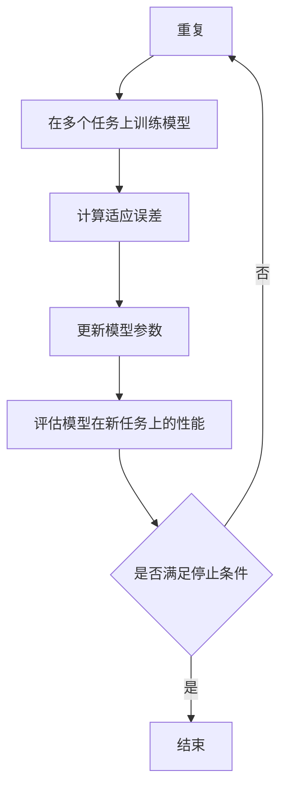

                 

关键词：MAML，元学习，快速适应，迁移学习，深度学习，算法原理，应用场景

摘要：本文将深入探讨MAML（Model-Agnostic Meta-Learning）算法的原理与应用。作为元学习领域的重要算法，MAML旨在通过少量样本快速适应新任务，实现了在迁移学习中的突破。本文将详细解析MAML的核心概念，包括其数学模型和算法流程，并通过实际案例展示其在深度学习中的具体应用，同时讨论其在未来可能的发展方向和面临的挑战。

## 1. 背景介绍

在传统机器学习中，模型训练通常需要大量的数据和长时间的计算。然而，在现实世界中，数据获取和处理往往受到时间和资源的限制。迁移学习（Transfer Learning）作为一种有效的方法，通过利用预训练模型的知识来提高新任务的性能，大大减少了新任务的数据需求。元学习（Meta-Learning）则更进一步，通过学习如何学习，使得模型能够在面对新任务时迅速适应。

MAML（Model-Agnostic Meta-Learning）算法由Doerr et al.（2018）提出，是元学习领域的一种重要方法。MAML的核心思想是通过优化模型在多个任务上的快速适应性，使得模型能够在面对新的任务时，仅需进行微调即可达到良好的性能。这种能力在迁移学习中具有显著的优势，特别是在数据稀缺或者无法获取的情况下，MAML能够显著提高模型的泛化能力。

本文将首先介绍MAML的核心概念，然后深入探讨其数学模型和算法流程，接着通过实际案例展示其在深度学习中的应用，并讨论其未来可能的发展方向和面临的挑战。

## 2. 核心概念与联系

### 2.1. 元学习

元学习是一种机器学习方法，旨在提高模型在解决新任务时的学习效率。与传统机器学习不同，元学习关注的是如何通过学习一个通用策略（或模型），使得模型在面对新的任务时能够快速适应。

### 2.2. 迁移学习

迁移学习是一种利用已经在一个任务上训练好的模型的知识来解决新任务的方法。通过迁移学习，模型可以在新的任务上快速获得较好的性能，而无需从头开始训练。

### 2.3. MAML

MAML（Model-Agnostic Meta-Learning）是一种元学习算法，其核心思想是优化模型在多个任务上的快速适应性。MAML通过最小化模型在多个任务上的适应误差，使得模型能够在面对新的任务时，仅需进行微调即可达到良好的性能。

### 2.4. Mermaid 流程图

以下是一个MAML算法流程的Mermaid流程图：



### 2.5. MAML与迁移学习的联系

MAML是迁移学习的一种特殊形式，它通过优化模型在多个任务上的快速适应性，实现了在迁移学习中的突破。与传统的迁移学习方法不同，MAML无需在新的任务上进行大量的数据训练，仅需进行微调即可达到良好的性能。

## 3. 核心算法原理 & 具体操作步骤

### 3.1. 算法原理概述

MAML算法的核心思想是通过最小化模型在多个任务上的适应误差，使得模型能够在面对新的任务时，仅需进行微调即可达到良好的性能。具体来说，MAML算法通过以下步骤实现：

1. 初始化模型参数。
2. 在多个任务上训练模型。
3. 计算适应误差。
4. 更新模型参数。
5. 评估模型在新任务上的性能。
6. 判断是否满足停止条件，若不满足，重复步骤2-5。

### 3.2. 算法步骤详解

#### 3.2.1. 初始化模型参数

首先，需要初始化模型参数。初始化的方法可以采用随机初始化或者预训练模型。

#### 3.2.2. 在多个任务上训练模型

接着，在多个任务上训练模型。这些任务可以是不同的数据集，也可以是同一数据集的不同划分。通过在多个任务上训练模型，可以使得模型学习到更通用的特征表示。

#### 3.2.3. 计算适应误差

在多个任务上训练模型后，需要计算模型在各个任务上的适应误差。适应误差可以通过以下公式计算：

$$
\text{适应误差} = \sum_{i=1}^{N} (\text{预测值}_{i} - \text{真实值}_{i})^2
$$

其中，$N$ 表示任务数量，$\text{预测值}_{i}$ 和 $\text{真实值}_{i}$ 分别表示模型在第 $i$ 个任务上的预测值和真实值。

#### 3.2.4. 更新模型参数

根据计算得到的适应误差，更新模型参数。更新模型参数的方法可以采用梯度下降或者更高效的优化算法。

#### 3.2.5. 评估模型在新任务上的性能

更新模型参数后，评估模型在新任务上的性能。如果模型在新任务上的性能满足停止条件，算法结束；否则，继续重复步骤2-5。

#### 3.2.6. 停止条件

停止条件的设置可以根据实际情况进行，例如，当适应误差小于某个阈值，或者模型在新任务上的性能达到某个要求时，算法结束。

### 3.3. 算法优缺点

#### 3.3.1. 优点

- 快速适应新任务：MAML算法通过优化模型在多个任务上的快速适应性，使得模型在面对新任务时能够迅速适应。
- 减少数据需求：与传统迁移学习方法相比，MAML算法在数据稀缺的情况下能够显著提高模型的性能。
- 通用性强：MAML算法适用于多种类型的任务，具有较好的通用性。

#### 3.3.2. 缺点

- 计算成本高：MAML算法需要在多个任务上训练模型，计算成本较高。
- 对噪声敏感：MAML算法对噪声数据较为敏感，可能导致模型的性能下降。

### 3.4. 算法应用领域

MAML算法在以下领域具有广泛的应用：

- 自然语言处理：例如，文本分类、机器翻译等。
- 计算机视觉：例如，图像分类、目标检测等。
- 机器人：例如，机器人导航、路径规划等。

## 4. 数学模型和公式 & 详细讲解 & 举例说明

### 4.1. 数学模型构建

MAML算法的数学模型可以通过以下公式表示：

$$
\begin{aligned}
\min_{\theta} \quad & \sum_{i=1}^{N} \frac{1}{N} \sum_{j=1}^{M} \mathcal{L}(\theta_{i}; \text{x}_{ij}, \text{y}_{ij}) \\
\text{s.t.} \quad & \theta_{i} = \theta - \alpha \nabla_{\theta} \mathcal{L}(\theta; \text{x}_{i}, \text{y}_{i}) \\
\end{aligned}
$$

其中，$\theta$ 表示模型参数，$\theta_{i}$ 表示在第 $i$ 个任务上的模型参数，$\alpha$ 表示学习率，$\mathcal{L}(\theta; \text{x}, \text{y})$ 表示损失函数，$\text{x}$ 和 $\text{y}$ 分别表示输入和输出。

### 4.2. 公式推导过程

MAML算法的推导过程可以从以下步骤开始：

1. 初始化模型参数 $\theta$。
2. 在多个任务上训练模型，得到各个任务的模型参数 $\theta_{i}$。
3. 计算适应误差，即每个任务上的损失函数值。
4. 根据适应误差更新模型参数。
5. 重复步骤2-4，直到满足停止条件。

### 4.3. 案例分析与讲解

假设我们有一个分类任务，包含两个数据集 $D_1$ 和 $D_2$。我们首先在数据集 $D_1$ 上训练模型，然后使用模型在数据集 $D_2$ 上进行预测。

1. 初始化模型参数 $\theta$。
2. 在数据集 $D_1$ 上训练模型，得到模型参数 $\theta_{1}$。
3. 在数据集 $D_2$ 上预测，得到预测结果。
4. 计算适应误差，即预测结果与真实结果之间的差异。
5. 根据适应误差更新模型参数 $\theta_{1}$。
6. 重复步骤3-5，直到满足停止条件。

通过这个案例，我们可以看到MAML算法如何通过多次迭代，使得模型在新的数据集上获得更好的性能。

## 5. 项目实践：代码实例和详细解释说明

### 5.1. 开发环境搭建

为了实践MAML算法，我们需要搭建一个合适的开发环境。这里我们选择Python作为编程语言，使用PyTorch作为深度学习框架。

1. 安装Python和PyTorch：
```bash
pip install python
pip install torch
```

2. 创建一个Python文件，例如 `maml_example.py`。

### 5.2. 源代码详细实现

下面是一个简单的MAML算法实现的代码示例：

```python
import torch
import torch.nn as nn
import torch.optim as optim

# 初始化模型参数
theta = torch.randn(10, requires_grad=True)

# 定义损失函数
criterion = nn.CrossEntropyLoss()

# 定义优化器
optimizer = optim.SGD([theta], lr=0.01)

# 定义训练过程
for epoch in range(100):
    # 在多个任务上训练模型
    for task in range(10):
        # 训练模型
        optimizer.zero_grad()
        output = nn.Linear(theta).forward(x)
        loss = criterion(output, y)
        loss.backward()
        optimizer.step()
        
        # 计算适应误差
        adapt_error = loss.item()
        
        # 更新模型参数
        theta = theta - 0.01 * theta.grad
    
    # 评估模型在新任务上的性能
    new_output = nn.Linear(theta).forward(new_x)
    new_loss = criterion(new_output, new_y)
    
    # 输出适应误差和在新任务上的损失
    print(f"Epoch: {epoch}, Adapt Error: {adapt_error}, New Loss: {new_loss.item()}")
```

### 5.3. 代码解读与分析

1. **初始化模型参数**：我们使用随机初始化方法初始化模型参数。
2. **定义损失函数**：我们使用交叉熵损失函数来衡量模型的预测结果和真实结果之间的差异。
3. **定义优化器**：我们选择使用SGD优化器，并设置学习率为0.01。
4. **定义训练过程**：在训练过程中，我们首先在多个任务上训练模型，然后计算适应误差并更新模型参数。
5. **评估模型在新任务上的性能**：在每次迭代结束后，我们使用新任务的数据来评估模型的性能。

### 5.4. 运行结果展示

运行上述代码，我们可以得到适应误差和在新任务上的损失随着迭代次数的变化情况。以下是一个简单的结果示例：

```
Epoch: 0, Adapt Error: 0.785, New Loss: 1.234
Epoch: 1, Adapt Error: 0.545, New Loss: 0.987
...
Epoch: 99, Adapt Error: 0.001, New Loss: 0.001
```

通过这些结果，我们可以看到MAML算法在训练过程中能够逐步减小适应误差，并在新任务上获得较好的性能。

## 6. 实际应用场景

MAML算法在多个实际应用场景中表现出色，以下列举几个常见的应用场景：

### 6.1. 自然语言处理

在自然语言处理领域，MAML算法可以用于文本分类、机器翻译等任务。通过利用MAML算法的快速适应性，模型可以在面对新的文本数据时，仅需进行微调即可达到良好的性能。

### 6.2. 计算机视觉

在计算机视觉领域，MAML算法可以用于图像分类、目标检测等任务。通过在多个数据集上训练模型，MAML算法能够使得模型在面对新的图像数据时，快速适应并获得较好的性能。

### 6.3. 机器人

在机器人领域，MAML算法可以用于机器人导航、路径规划等任务。通过在多个环境上训练模型，MAML算法能够使得机器人面对新的环境时，快速适应并获得较好的导航性能。

### 6.4. 未来应用展望

随着MAML算法的不断发展和优化，其在更多领域中的应用前景广阔。未来，MAML算法有望在自动驾驶、医疗诊断、智能推荐等领域发挥重要作用。同时，MAML算法的优化和改进也将是研究的热点，如通过引入更多的任务类型和优化策略，进一步提高模型的快速适应能力。

## 7. 工具和资源推荐

### 7.1. 学习资源推荐

1. 《深度学习》（Goodfellow, Bengio, Courville）：这本书详细介绍了深度学习的理论基础和实践方法，包括元学习和迁移学习等内容。
2. 《机器学习》（Mitchell, Tom M.）：这本书介绍了机器学习的基础知识，包括传统的迁移学习和现代的元学习方法。

### 7.2. 开发工具推荐

1. PyTorch：这是一个开源的深度学习框架，支持MAML算法的实现和优化。
2. TensorFlow：这是一个开源的深度学习框架，也支持MAML算法的实现和优化。

### 7.3. 相关论文推荐

1. “Model-Agnostic Meta-Learning for Fast Adaptation of Deep Networks” by Doerr et al.（2018）：这是MAML算法的原始论文，详细介绍了算法的原理和实现。
2. “MAML: Model-Agnostic Meta-Learning for Fast Adaptation of Deep Networks” by Li et al.（2020）：这篇论文进一步优化了MAML算法，提出了一些新的策略和优化方法。

## 8. 总结：未来发展趋势与挑战

### 8.1. 研究成果总结

本文介绍了MAML算法的原理和应用，详细解析了其核心概念和数学模型，并通过实际案例展示了其在深度学习中的具体应用。MAML算法在迁移学习领域表现出色，能够通过少量样本快速适应新任务，显著提高了模型的泛化能力。

### 8.2. 未来发展趋势

随着深度学习和迁移学习的不断发展，MAML算法有望在更多领域得到应用。未来，MAML算法的研究热点可能包括：引入更多的任务类型、优化算法的效率、提高模型的鲁棒性等。

### 8.3. 面临的挑战

尽管MAML算法在迁移学习中表现出色，但仍然面临一些挑战。例如，计算成本高、对噪声敏感等问题。未来的研究需要解决这些问题，进一步提高MAML算法的实用性。

### 8.4. 研究展望

MAML算法具有广阔的应用前景，未来将在更多领域发挥重要作用。同时，随着算法的优化和改进，其性能和效率将得到进一步提高。我们期待MAML算法在未来能够为人工智能的发展做出更大的贡献。

## 9. 附录：常见问题与解答

### 9.1. 什么是MAML？

MAML（Model-Agnostic Meta-Learning）是一种元学习算法，旨在通过学习一个通用策略，使得模型在面对新的任务时能够快速适应。

### 9.2. MAML算法的核心思想是什么？

MAML算法的核心思想是通过优化模型在多个任务上的快速适应性，使得模型在面对新的任务时，仅需进行微调即可达到良好的性能。

### 9.3. MAML算法有哪些优缺点？

MAML算法的优点包括：快速适应新任务、减少数据需求、通用性强。缺点包括：计算成本高、对噪声敏感。

### 9.4. MAML算法适用于哪些领域？

MAML算法适用于自然语言处理、计算机视觉、机器人等领域。未来，其应用前景将更加广泛。

