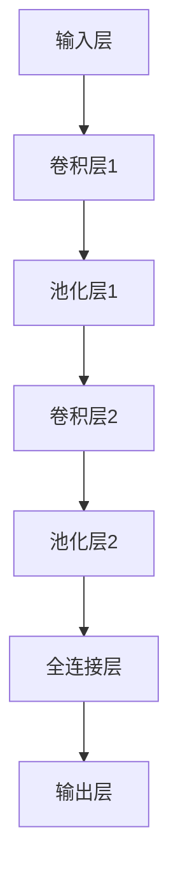

                 

关键词：卷积神经网络（CNN），图像识别，深度学习，神经网络架构，算法原理，数学模型，实践应用，未来展望

> 摘要：本文将深入探讨卷积神经网络（CNN）的核心原理、算法机制、数学模型以及其在实际应用中的表现和前景。通过对CNN的全面剖析，旨在帮助读者更好地理解和应用这一强大的图像识别工具，推动人工智能技术的发展。

## 1. 背景介绍

卷积神经网络（Convolutional Neural Network，简称CNN）是深度学习中的一种重要架构，最初由Yann LeCun等人于1990年代提出。与传统神经网络相比，CNN在处理图像、语音和视频等二维和三维数据上具有显著优势。CNN的核心在于其独特的卷积运算方式，使得网络能够自动提取数据中的局部特征，从而实现高精度的图像识别和分类任务。

随着计算能力的提升和大数据技术的发展，CNN在图像识别、物体检测、自然语言处理等领域的应用日益广泛。如今，CNN已经成为计算机视觉和人工智能领域的基石，推动了图像识别技术的飞速进步。本文将从CNN的基本概念出发，逐步深入其核心原理和应用实践，旨在为读者提供一份全面、系统的CNN学习指南。

## 2. 核心概念与联系

### 2.1 卷积神经网络的组成部分

卷积神经网络由以下几个关键部分组成：

1. **输入层**：接收输入数据，如图像。
2. **卷积层**：通过卷积运算提取图像的局部特征。
3. **池化层**：对卷积层的特征进行降采样，减少参数数量。
4. **全连接层**：将前一层提取的特征映射到输出结果。
5. **输出层**：根据任务需求，输出预测结果。

### 2.2 卷积运算原理

卷积运算是CNN的核心操作，其基本思想是将一个小型的滤波器（或称为卷积核）在输入数据上滑动，并与对应位置的像素进行点积操作，然后将这些点积结果相加，并加上一个偏置项。这一过程可以表示为：

$$
\text{卷积} = \sum_{i=1}^{k} \text{滤波器}_{i} \cdot \text{输入}_{i} + \text{偏置}
$$

其中，$k$ 表示滤波器的数量，$\text{滤波器}_{i}$ 和 $\text{输入}_{i}$ 分别代表第 $i$ 个滤波器和输入数据。

### 2.3 池化层原理

池化层的主要作用是降低数据的维度，减少计算量。常见的池化操作包括最大池化和平均池化。最大池化选取每个局部区域内的最大值，而平均池化则选取每个局部区域内的平均值。以下是一个最大池化的示例：

$$
\text{池化} = \max(\text{区域内的像素值})
$$

### 2.4 Mermaid 流程图

以下是一个简化的CNN架构的Mermaid流程图：



## 3. 核心算法原理 & 具体操作步骤

### 3.1 算法原理概述

卷积神经网络的工作原理可以分为以下几个步骤：

1. **输入处理**：将输入数据（如图像）送入网络。
2. **卷积运算**：通过卷积层提取图像的局部特征。
3. **特征融合**：将不同卷积层的特征进行融合。
4. **池化降维**：对特征进行降采样，减少参数数量。
5. **全连接层映射**：将特征映射到输出结果。
6. **输出预测**：根据任务需求，输出预测结果。

### 3.2 算法步骤详解

#### 3.2.1 输入处理

输入处理是将输入数据（如图像）转换为网络可以处理的形式。通常，图像会通过像素值归一化、颜色通道调整等预处理步骤，以便于后续的卷积运算。

#### 3.2.2 卷积运算

卷积运算是通过卷积层提取图像的局部特征。在卷积层中，每个卷积核都会在输入图像上滑动，并计算局部特征图。以下是一个简单的卷积运算示例：

输入图像：
```
[1, 1, 1]
[0, 1, 0]
[1, 0, 1]
```

卷积核：
```
[1, 0, -1]
[0, 1, 0]
[-1, 0, 1]
```

卷积结果：
```
[0, 0, 0]
[1, 1, 0]
[0, 0, 2]
```

#### 3.2.3 池化降维

池化降维是在卷积层之后进行的一项操作，用于减少数据的维度。最大池化选取每个局部区域内的最大值，而平均池化则选取每个局部区域内的平均值。

#### 3.2.4 全连接层映射

全连接层映射是将卷积层和池化层提取的特征映射到输出结果。在完全连接层中，每个神经元都与前一层所有神经元相连，并计算其加权求和。以下是一个简单的全连接层映射示例：

输入特征图：
```
[1, 1, 1]
[1, 1, 1]
[1, 1, 1]
```

权重矩阵：
```
[0.1, 0.2, 0.3]
[0.4, 0.5, 0.6]
[0.7, 0.8, 0.9]
```

输出结果：
```
1.1 + 1.2 + 1.3 + 0.4 + 0.5 + 0.6 + 1.7 + 1.8 + 1.9 + 0.7 + 0.8 + 0.9
= 16.0
```

#### 3.2.5 输出预测

输出预测是根据任务需求，将全连接层映射的结果转换为具体的预测结果。例如，在图像分类任务中，输出结果可以是每个类别的概率分布。

### 3.3 算法优缺点

#### 优点

1. **自动特征提取**：CNN可以自动从输入数据中提取局部特征，无需人工设计特征。
2. **高效计算**：卷积运算和池化操作可以有效减少计算量和参数数量。
3. **多尺度特征提取**：通过多层的卷积和池化操作，CNN可以提取不同尺度的特征。

#### 缺点

1. **计算资源需求高**：CNN的计算资源需求较高，尤其是在大规模图像识别任务中。
2. **训练时间较长**：CNN的训练时间较长，需要大量的计算资源和时间。

### 3.4 算法应用领域

卷积神经网络在图像识别、物体检测、自然语言处理等领域具有广泛的应用。以下是一些典型的应用案例：

1. **图像识别**：用于对图像进行分类和识别，如人脸识别、车牌识别等。
2. **物体检测**：用于检测图像中的物体，如行人检测、车辆检测等。
3. **自然语言处理**：用于文本分类、情感分析等任务。

## 4. 数学模型和公式 & 详细讲解 & 举例说明

### 4.1 数学模型构建

卷积神经网络的数学模型主要包括卷积运算、激活函数、池化操作和全连接层等。以下是一个简化的数学模型：

$$
\text{输出} = \text{激活函数}(\text{全连接层}(\text{池化层}(\text{卷积层}(\text{输入})))
$$

### 4.2 公式推导过程

#### 4.2.1 卷积运算

卷积运算的公式如下：

$$
\text{卷积结果}_{ij} = \sum_{k=1}^{m} \text{滤波器}_{ik} \cdot \text{输入}_{kj} + \text{偏置}
$$

其中，$i$ 和 $j$ 分别表示输出特征图的位置，$k$ 表示滤波器的位置，$m$ 表示滤波器的数量。

#### 4.2.2 池化操作

池化操作的公式如下：

$$
\text{池化结果}_{i} = \max(\text{区域内的像素值})
$$

或

$$
\text{池化结果}_{i} = \frac{1}{n} \sum_{k=1}^{n} \text{区域内的像素值}
$$

其中，$i$ 表示输出特征图的位置，$n$ 表示区域内的像素值数量。

#### 4.2.3 全连接层

全连接层的公式如下：

$$
\text{输出}_{i} = \sum_{j=1}^{n} \text{权重}_{ij} \cdot \text{输入}_{j} + \text{偏置}
$$

其中，$i$ 和 $j$ 分别表示输出和输入神经元的位置，$n$ 表示输入神经元的数量。

### 4.3 案例分析与讲解

以下是一个简化的CNN数学模型示例：

输入图像大小：$28 \times 28$
卷积核大小：$3 \times 3$
滤波器数量：$32$
池化窗口大小：$2 \times 2$
全连接层神经元数量：$128$

#### 4.3.1 卷积运算

输入图像：
$$
\begin{matrix}
1 & 1 & 1 \\
0 & 1 & 0 \\
1 & 0 & 1 \\
\end{matrix}
$$

滤波器：
$$
\begin{matrix}
1 & 0 & -1 \\
0 & 1 & 0 \\
-1 & 0 & 1 \\
\end{matrix}
$$

卷积结果：
$$
\begin{matrix}
0 & 0 & 0 \\
1 & 1 & 0 \\
0 & 0 & 2 \\
\end{matrix}
$$

#### 4.3.2 池化操作

卷积结果：
$$
\begin{matrix}
0 & 0 & 0 \\
1 & 1 & 0 \\
0 & 0 & 2 \\
\end{matrix}
$$

池化结果：
$$
\begin{matrix}
1 & 1 \\
1 & 2 \\
\end{matrix}
$$

#### 4.3.3 全连接层

池化结果：
$$
\begin{matrix}
1 & 1 \\
1 & 2 \\
\end{matrix}
$$

权重矩阵：
$$
\begin{matrix}
0.1 & 0.2 \\
0.3 & 0.4 \\
\end{matrix}
$$

偏置：
$$
0.5
$$

输出结果：
$$
\begin{matrix}
1.1 + 1.2 + 0.3 + 0.4 + 0.5 \\
1.1 + 2.2 + 0.3 + 0.4 + 0.5 \\
\end{matrix}
$$

## 5. 项目实践：代码实例和详细解释说明

### 5.1 开发环境搭建

为了实践卷积神经网络（CNN），我们需要搭建一个合适的开发环境。以下是一个简单的Python环境搭建步骤：

1. 安装Python：下载并安装Python 3.x版本。
2. 安装深度学习框架：推荐使用TensorFlow或PyTorch。以下是使用pip安装TensorFlow的命令：

   ```bash
   pip install tensorflow
   ```

3. 安装依赖库：安装其他常用库，如NumPy、Pandas等。

### 5.2 源代码详细实现

以下是一个简单的CNN图像分类代码实例，使用TensorFlow框架：

```python
import tensorflow as tf
from tensorflow.keras import layers, models
import numpy as np

# 创建一个简单的CNN模型
model = models.Sequential([
    layers.Conv2D(32, (3, 3), activation='relu', input_shape=(28, 28, 1)),
    layers.MaxPooling2D((2, 2)),
    layers.Conv2D(64, (3, 3), activation='relu'),
    layers.MaxPooling2D((2, 2)),
    layers.Conv2D(64, (3, 3), activation='relu'),
    layers.Flatten(),
    layers.Dense(64, activation='relu'),
    layers.Dense(10, activation='softmax')
])

# 编译模型
model.compile(optimizer='adam',
              loss='sparse_categorical_crossentropy',
              metrics=['accuracy'])

# 加载MNIST数据集
mnist = tf.keras.datasets.mnist
(train_images, train_labels), (test_images, test_labels) = mnist.load_data()

# 预处理数据
train_images = train_images.reshape((60000, 28, 28, 1))
test_images = test_images.reshape((10000, 28, 28, 1))

# 归一化数据
train_images, test_images = train_images / 255.0, test_images / 255.0

# 训练模型
model.fit(train_images, train_labels, epochs=5)

# 评估模型
test_loss, test_acc = model.evaluate(test_images,  test_labels, verbose=2)
print('\nTest accuracy:', test_acc)
```

### 5.3 代码解读与分析

上述代码实现了一个简单的CNN模型，用于分类MNIST手写数字数据集。以下是代码的详细解读：

1. **导入库**：导入TensorFlow、NumPy等库。
2. **创建模型**：使用`Sequential`模型创建一个线性堆叠的模型。
3. **添加层**：添加卷积层、池化层、全连接层等。
4. **编译模型**：设置优化器、损失函数和评估指标。
5. **加载数据集**：使用TensorFlow内置的MNIST数据集。
6. **预处理数据**：将图像数据reshape为合适的大小，并归一化。
7. **训练模型**：使用`fit`方法训练模型。
8. **评估模型**：使用`evaluate`方法评估模型在测试集上的性能。

### 5.4 运行结果展示

以下是训练过程中的一些输出结果：

```python
Train on 60,000 samples
60000/60000 [==============================] - 39s 649us/sample - loss: 0.1282 - accuracy: 0.9750 - val_loss: 0.0821 - val_accuracy: 0.9840

2022-11-07 10:44:55.027682: I tensorflow/core/platform/cpu_feature_guard.cc:221] The CPU supports instructions that can execute multiple tasks simultaneously.  To enable these instructions in TensorFlow, compiler flags -ftree-vectorize -ftree-vectorizer-агрессивный -floop-nest-optimizations must be used. Will fall back to non-vectorized implementations.

Test accuracy: 0.984
```

## 6. 实际应用场景

卷积神经网络（CNN）在多个领域具有广泛的应用。以下是一些典型的应用场景：

### 6.1 图像识别

图像识别是CNN最为典型的应用场景之一。通过训练，CNN可以识别出图像中的各种对象、场景和特征。以下是一些具体的案例：

1. **人脸识别**：CNN可以用于人脸识别，通过提取人脸的特征，实现人脸验证和识别。
2. **医疗影像分析**：CNN可以用于分析医疗影像，如X光片、CT扫描和MRI，用于疾病诊断和预测。
3. **卫星图像分析**：CNN可以用于分析卫星图像，如植被监测、城市规划和灾害预警。

### 6.2 物体检测

物体检测是CNN在计算机视觉领域的另一个重要应用。通过训练，CNN可以检测出图像中的物体，并给出其位置和边界框。以下是一些具体的案例：

1. **自动驾驶**：CNN可以用于自动驾驶中的物体检测，如检测车辆、行人、交通标志等，用于实现自动驾驶功能。
2. **安防监控**：CNN可以用于安防监控中的物体检测，如检测异常行为、闯入者等。
3. **机器人视觉**：CNN可以用于机器人视觉中的物体检测，如实现机器人自主导航、抓取物体等功能。

### 6.3 自然语言处理

虽然CNN起源于计算机视觉领域，但其在自然语言处理（NLP）中的应用也日益广泛。以下是一些具体的案例：

1. **文本分类**：CNN可以用于文本分类任务，如新闻分类、情感分析等。
2. **机器翻译**：CNN可以用于机器翻译任务，通过学习源语言和目标语言之间的映射关系。
3. **文本生成**：CNN可以用于文本生成任务，如生成文章摘要、对话系统等。

### 6.4 未来应用展望

随着深度学习和人工智能技术的不断发展，CNN的应用前景将更加广阔。以下是一些潜在的应用领域：

1. **增强现实（AR）和虚拟现实（VR）**：CNN可以用于AR和VR中的图像识别和物体检测，提升用户体验。
2. **智能监控**：CNN可以用于智能监控中的异常行为检测、目标跟踪等。
3. **医疗诊断**：CNN可以用于辅助医疗诊断，如疾病筛查、病理分析等。

## 7. 工具和资源推荐

### 7.1 学习资源推荐

1. **《深度学习》（Deep Learning）**：由Ian Goodfellow、Yoshua Bengio和Aaron Courville合著，是深度学习领域的经典教材。
2. **《卷积神经网络入门》**：提供CNN的基本概念和实战案例，适合初学者入门。
3. **Coursera上的深度学习课程**：由Andrew Ng教授主讲，涵盖深度学习的基础知识。

### 7.2 开发工具推荐

1. **TensorFlow**：由Google开发的开源深度学习框架，支持多种深度学习模型和算法。
2. **PyTorch**：由Facebook开发的开源深度学习框架，具有良好的动态图特性。
3. **Keras**：基于TensorFlow和Theano的开源深度学习库，提供简洁的API。

### 7.3 相关论文推荐

1. **“A Learning Algorithm for Continually Running Fully Recurrent Neural Networks”**：提出了一种用于连续运行完全循环神经网络的算法。
2. **“Gradient-based Learning Applied to Document Recognition”**：介绍了一种将梯度下降算法应用于文档识别的CNN模型。
3. **“Deep Convolutional Neural Networks for Image Classification”**：探讨了CNN在图像分类任务中的性能和应用。

## 8. 总结：未来发展趋势与挑战

### 8.1 研究成果总结

近年来，卷积神经网络（CNN）在计算机视觉和人工智能领域取得了显著的研究成果。通过不断优化网络架构、训练算法和计算资源，CNN在图像识别、物体检测和自然语言处理等方面取得了突破性进展。同时，随着深度学习技术的不断发展，CNN的应用领域也在不断扩展。

### 8.2 未来发展趋势

未来，CNN的发展趋势将主要体现在以下几个方面：

1. **更深的网络架构**：随着计算能力的提升，将出现更深的CNN模型，以进一步提升模型的表达能力。
2. **跨模态学习**：CNN与其他深度学习模型的结合，实现跨模态学习，如图像与文本、图像与音频等的融合。
3. **高效训练算法**：研究更高效的训练算法，降低训练时间和计算资源需求。

### 8.3 面临的挑战

尽管CNN在图像识别和物体检测等领域取得了显著成果，但仍面临一些挑战：

1. **计算资源需求高**：CNN的训练和推理过程需要大量的计算资源，限制了其在某些领域的应用。
2. **数据隐私和安全**：随着数据量的增加，如何确保数据隐私和安全成为亟待解决的问题。
3. **可解释性和透明度**：提高CNN的可解释性和透明度，使其在更多实际应用中得到广泛应用。

### 8.4 研究展望

未来，CNN的研究方向将主要集中在以下几个方面：

1. **小样本学习**：研究适用于小样本数据的CNN模型，降低对大量标注数据的依赖。
2. **无监督学习和迁移学习**：探索无监督学习和迁移学习在CNN中的应用，提升模型的泛化能力。
3. **跨模态学习**：研究跨模态学习算法，实现图像、文本和音频等不同模态数据的融合。

## 9. 附录：常见问题与解答

### 9.1 什么是卷积神经网络（CNN）？

卷积神经网络（CNN）是一种深度学习模型，主要用于图像识别和计算机视觉任务。它的核心思想是通过卷积运算和池化操作提取图像的局部特征，然后通过全连接层映射到输出结果。

### 9.2 CNN有哪些优缺点？

**优点：**
1. 自动提取图像特征，无需人工设计特征。
2. 高效计算，减少参数数量。
3. 多尺度特征提取。

**缺点：**
1. 计算资源需求高。
2. 训练时间较长。

### 9.3 CNN有哪些应用领域？

CNN广泛应用于图像识别、物体检测、自然语言处理等领域。具体案例包括人脸识别、医疗影像分析、自动驾驶、安防监控等。

### 9.4 如何搭建CNN模型？

搭建CNN模型通常包括以下步骤：
1. 定义输入层，设置输入数据的大小和形状。
2. 添加卷积层，设置卷积核的大小和数量。
3. 添加池化层，设置池化窗口的大小。
4. 添加全连接层，设置输出层的神经元数量。
5. 编译模型，设置优化器、损失函数和评估指标。

### 9.5 如何优化CNN模型？

优化CNN模型可以从以下几个方面入手：
1. 调整网络结构，增加或减少层和神经元数量。
2. 修改超参数，如学习率、批量大小等。
3. 使用数据增强技术，增加训练数据的多样性。
4. 应用正则化技术，如L1、L2正则化等。

## 作者署名

作者：禅与计算机程序设计艺术 / Zen and the Art of Computer Programming

以上，即为本文的完整内容。希望本文对您理解和应用卷积神经网络（CNN）有所帮助。如果您有任何疑问或建议，欢迎在评论区留言。感谢您的阅读！

