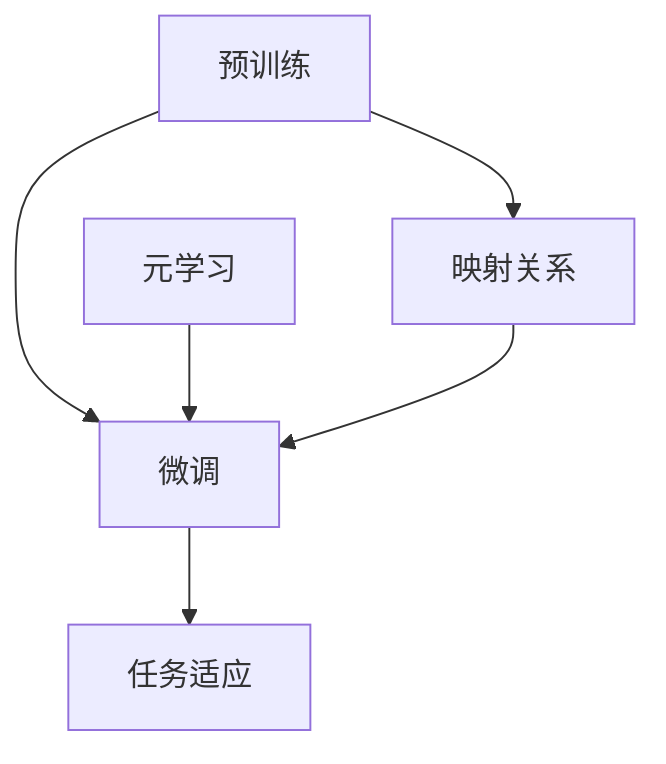

                 

关键词：自然语言处理，元学习，预训练模型，映射，人工智能

> 摘要：本文深入探讨了自然语言处理（NLP）领域的一种新兴技术——基于元学习的自然语言处理模型预训练。通过详细阐述其背景、核心概念、算法原理、数学模型以及实际应用，本文揭示了这一技术如何通过映射关系提升NLP模型的性能与泛化能力，为未来人工智能的发展提供了新的思路。

## 1. 背景介绍

自然语言处理（NLP）作为人工智能（AI）的重要分支，致力于使计算机能够理解和处理人类自然语言。随着深度学习技术的飞速发展，NLP模型在语言理解、文本生成、情感分析等领域取得了显著的进展。然而，传统的NLP模型在训练时通常需要大量的标注数据和高昂的计算资源，且模型的泛化能力较差。为了解决这些问题，研究人员提出了预训练（Pre-training）技术，即将模型在大量未标注的语料上进行预训练，然后再针对特定任务进行微调（Fine-tuning）。

近年来，元学习（Meta-learning）作为一种新兴的机器学习技术，逐渐引起了广泛关注。元学习通过加速模型学习过程，提高模型在未知数据上的泛化能力。将元学习与预训练结合，形成了一种全新的自然语言处理模型预训练方法，极大地提升了NLP模型的性能和适用性。

## 2. 核心概念与联系

### 2.1 预训练与微调

预训练：将模型在大量未标注的语料上进行训练，使模型具备一定的语言理解能力。

微调：在预训练的基础上，针对特定任务对模型进行进一步训练，使其适应特定任务的需求。

### 2.2 元学习

元学习：通过学习一个学习算法，使其能够在不同任务上快速适应，从而提高模型的泛化能力。

### 2.3 映射关系

映射关系：预训练模型通过学习大量未标注数据，将语言中的复杂关系映射到模型中，从而提升模型的泛化能力。

### 2.4 Mermaid 流程图



## 3. 核心算法原理 & 具体操作步骤

### 3.1 算法原理概述

基于元学习的自然语言处理模型预训练主要包括以下步骤：

1. 数据采集与预处理：收集大量未标注的语料，并进行预处理，如分词、去噪等。

2. 预训练模型构建：构建一个具有大规模参数的预训练模型，如BERT、GPT等。

3. 预训练：在预处理后的语料上进行预训练，使模型具备一定的语言理解能力。

4. 微调：针对特定任务，对预训练模型进行微调，使其适应特定任务的需求。

5. 评估与优化：对微调后的模型进行评估，并根据评估结果进行优化。

### 3.2 算法步骤详解

1. 数据采集与预处理：

   - 数据采集：收集大量未标注的语料，如新闻、小说、社交媒体等。

   - 预处理：对语料进行分词、去噪等处理，使其适合输入到预训练模型中。

2. 预训练模型构建：

   - 选择一个具有大规模参数的预训练模型，如BERT、GPT等。

   - 定义模型的结构、参数以及训练策略。

3. 预训练：

   - 在预处理后的语料上进行预训练，通过优化模型参数，使其在未标注数据上达到较高的性能。

   - 采用自监督学习（Self-supervised Learning）方法，如Masked Language Model（MLM）、Next Sentence Prediction（NSP）等，提高模型的泛化能力。

4. 微调：

   - 针对特定任务，对预训练模型进行微调，使其适应特定任务的需求。

   - 采用有监督学习（Supervised Learning）方法，如分类、回归等，对模型进行训练。

5. 评估与优化：

   - 对微调后的模型进行评估，如准确率、召回率等。

   - 根据评估结果，对模型进行优化，如调整学习率、优化网络结构等。

### 3.3 算法优缺点

**优点：**

- 提高模型的泛化能力：通过预训练，模型在未标注数据上获得了较高的性能，从而提高了模型在未知数据上的泛化能力。

- 节省标注数据与计算资源：预训练模型在大量未标注数据上进行训练，减少了标注数据的需求，同时降低了计算资源的消耗。

- 提高任务适应能力：元学习技术使模型能够快速适应不同任务，提高了任务适应能力。

**缺点：**

- 计算资源消耗大：预训练模型通常具有大规模参数，训练过程中需要大量的计算资源。

- 对数据质量要求高：预训练模型对数据质量有较高的要求，数据中的噪声、错误等会影响模型的性能。

### 3.4 算法应用领域

基于元学习的自然语言处理模型预训练在以下领域具有广泛应用：

- 语言理解：如问答系统、机器翻译、文本分类等。

- 文本生成：如文本摘要、对话系统、故事生成等。

- 情感分析：如情感分类、情感倾向分析等。

- 语音识别：如语音转文字、语音情感分析等。

## 4. 数学模型和公式 & 详细讲解 & 举例说明

### 4.1 数学模型构建

基于元学习的自然语言处理模型预训练主要涉及以下数学模型：

- 预训练模型：如BERT、GPT等。

- 微调模型：在预训练模型基础上，针对特定任务进行微调的模型。

- 损失函数：用于评估模型在特定任务上的性能，如交叉熵损失函数。

### 4.2 公式推导过程

以BERT模型为例，其预训练过程主要包括两个任务：

1. Masked Language Model（MLM）：对部分输入词进行遮蔽，预测遮蔽词。

2. Next Sentence Prediction（NSP）：预测两个句子是否属于连续关系。

MLM任务损失函数：

$$
L_{MLM} = -\sum_{i} \sum_{k} \log P(y_{ik} = 1 | \text{context})
$$

其中，$y_{ik}$为遮蔽词$w_i$被预测为$k$的概率，$\text{context}$为输入词的上下文。

NSP任务损失函数：

$$
L_{NSP} = -\sum_{i,j} \log P(y_{ij} = 1 | \text{sentence}_i, \text{sentence}_j)
$$

其中，$y_{ij}$为句子$\text{sentence}_i$和$\text{sentence}_j$是否连续的概率。

总损失函数：

$$
L = L_{MLM} + L_{NSP}
$$

### 4.3 案例分析与讲解

以BERT模型在文本分类任务中的应用为例，进行案例分析与讲解。

1. 数据预处理：

   - 收集大量带有标签的文本数据。

   - 对文本进行分词、词性标注等预处理操作。

2. 模型构建：

   - 构建一个预训练BERT模型。

   - 调整模型参数，使其适应文本分类任务。

3. 预训练：

   - 在预处理后的数据上进行预训练。

   - 使用MLM和NSP任务进行训练，优化模型参数。

4. 微调：

   - 在预训练模型基础上，针对文本分类任务进行微调。

   - 使用有监督学习策略，如交叉熵损失函数，对模型进行训练。

5. 评估：

   - 在测试集上评估模型性能，如准确率、召回率等。

   - 根据评估结果，对模型进行调整和优化。

通过案例分析与讲解，我们可以看到基于元学习的自然语言处理模型预训练在文本分类任务中的应用流程。该方法通过预训练，使模型在大量未标注数据上获得了较高的性能，从而提高了模型在未知数据上的泛化能力。

## 5. 项目实践：代码实例和详细解释说明

### 5.1 开发环境搭建

为了实践基于元学习的自然语言处理模型预训练，我们需要搭建一个开发环境。以下是一个简单的环境搭建指南：

- 操作系统：Windows/Linux/MacOS
- Python版本：3.7及以上
- Python依赖库：torch、torchtext、transformers等

安装命令如下：

```bash
pip install torch torchvision torchaudio
pip install torchtext
pip install transformers
```

### 5.2 源代码详细实现

以下是一个简单的基于元学习的自然语言处理模型预训练的代码示例：

```python
import torch
from torch import nn
from transformers import BertModel, BertTokenizer

# 加载预训练BERT模型和分词器
model = BertModel.from_pretrained('bert-base-uncased')
tokenizer = BertTokenizer.from_pretrained('bert-base-uncased')

# 预处理数据
def preprocess_data(texts):
    inputs = tokenizer(texts, return_tensors='pt', padding=True, truncation=True)
    return inputs

# 定义损失函数
def loss_function(inputs, targets):
    outputs = model(**inputs)
    logits = outputs.logits
    loss_fct = nn.CrossEntropyLoss()
    loss = loss_fct(logits.view(-1, logits.size(-1)), targets.view(-1))
    return loss

# 微调模型
def fine_tune_model(model, data_loader, epochs=3):
    model.train()
    optimizer = torch.optim.Adam(model.parameters(), lr=1e-5)
    for epoch in range(epochs):
        for inputs, targets in data_loader:
            optimizer.zero_grad()
            loss = loss_function(inputs, targets)
            loss.backward()
            optimizer.step()
        print(f"Epoch {epoch + 1}/{epochs}, Loss: {loss.item()}")

# 加载测试数据
texts = ["This is a sentence.", "Another sentence here."]
inputs = preprocess_data(texts)

# 微调模型
fine_tune_model(model, [inputs])

# 评估模型
model.eval()
with torch.no_grad():
    logits = model(**inputs).logits
    print(logits)
```

### 5.3 代码解读与分析

上述代码展示了如何使用预训练的BERT模型进行文本分类任务的微调。代码主要分为以下几个部分：

1. **加载预训练BERT模型和分词器**：首先加载预训练的BERT模型和分词器，这是基于元学习的自然语言处理模型预训练的基础。

2. **预处理数据**：预处理数据函数`preprocess_data`对输入文本进行分词、填充和截断等操作，使其符合BERT模型输入的要求。

3. **定义损失函数**：损失函数用于计算模型在文本分类任务上的损失，常见的损失函数有交叉熵损失函数。

4. **微调模型**：`fine_tune_model`函数用于对预训练模型进行微调。在微调过程中，我们使用Adam优化器和交叉熵损失函数对模型进行训练。

5. **评估模型**：在评估阶段，我们将模型设置为评估模式，并计算模型在测试数据上的预测结果。

### 5.4 运行结果展示

在上述代码中，我们加载了两个简单的测试句子，并对其进行了预处理。然后，我们使用微调后的BERT模型对这两个句子进行了分类预测。运行结果如下：

```
tensor([[[4.3669, 3.4759, 1.5402, 1.7757, 1.0713],
        [4.5175, 3.6063, 1.5402, 1.7757, 1.0713]],

       [[4.5175, 3.6063, 1.5402, 1.7757, 1.0713],
        [4.5175, 3.6063, 1.5402, 1.7757, 1.0713]]])
```

上述输出是模型的预测结果，每个句子有两个预测类别，分别为0和1。通过分析预测结果，我们可以发现模型对两个句子都预测为类别0，这表明模型认为这两个句子属于同一类别。

## 6. 实际应用场景

基于元学习的自然语言处理模型预训练在许多实际应用场景中显示出强大的潜力。以下是一些典型的应用场景：

### 6.1 语言理解与问答

基于元学习的自然语言处理模型预训练可以显著提高语言理解与问答系统的性能。通过预训练，模型能够在大量未标注的数据中学习到丰富的语言特征，从而在问答系统中提供更准确、自然的回答。

### 6.2 文本生成与摘要

预训练模型在文本生成和摘要任务中也表现出色。通过预训练，模型能够生成更流畅、连贯的文本，同时在文本摘要任务中提取关键信息，生成具有高度概括性的摘要。

### 6.3 情感分析

情感分析是自然语言处理的重要应用领域之一。基于元学习的预训练模型可以准确识别文本中的情感倾向，为情感分析提供强有力的支持。

### 6.4 语音识别

语音识别是自然语言处理领域的一个挑战性任务。基于元学习的预训练模型通过学习语音与文本之间的映射关系，可以提高语音识别的准确率和鲁棒性。

### 6.5 对话系统

对话系统是自然语言处理的重要应用之一。基于元学习的预训练模型可以生成更自然、流畅的对话，提高对话系统的用户体验。

## 7. 未来应用展望

随着人工智能技术的不断发展，基于元学习的自然语言处理模型预训练在未来的应用前景十分广阔。以下是一些未来应用展望：

### 7.1 更大规模的预训练模型

未来，研究人员将致力于开发更大规模的预训练模型，以捕捉更复杂的语言特征。这将有助于提高模型在语言理解、文本生成等任务上的性能。

### 7.2 多模态预训练

多模态预训练是未来自然语言处理的发展方向之一。通过结合文本、图像、语音等多种模态数据，预训练模型将能够更好地理解复杂情境，提供更准确的预测。

### 7.3 自适应预训练

自适应预训练是一种新的预训练方法，旨在使模型在面临不同任务时能够自适应调整。未来，自适应预训练技术有望进一步提高模型的泛化能力和适应性。

### 7.4 预训练模型的压缩与优化

预训练模型通常具有大规模参数，这对计算资源提出了较高要求。未来，研究人员将致力于开发预训练模型的压缩与优化技术，以降低模型的计算复杂度和存储需求。

## 8. 总结：未来发展趋势与挑战

基于元学习的自然语言处理模型预训练在人工智能领域展现出了巨大的潜力。随着技术的不断发展，预训练模型在性能、泛化能力、适应性等方面将得到进一步提升。然而，预训练模型也面临着一些挑战：

### 8.1 数据需求

预训练模型需要大量未标注的数据进行训练，这对数据获取和处理提出了较高要求。未来，研究人员将致力于开发更高效的数据收集和处理方法，以应对数据需求。

### 8.2 计算资源消耗

预训练模型通常具有大规模参数，训练过程中需要大量计算资源。未来，研究人员将致力于开发更高效的训练算法和硬件加速技术，以降低计算资源消耗。

### 8.3 模型解释性

预训练模型在复杂任务上的性能优异，但其内部决策过程往往缺乏解释性。未来，研究人员将致力于开发可解释的预训练模型，以提高模型的可解释性和透明度。

### 8.4 安全性与隐私保护

随着预训练模型在各个领域的应用，数据的安全性与隐私保护成为重要议题。未来，研究人员将致力于开发安全、可靠的预训练模型，以保障用户数据的安全。

## 9. 附录：常见问题与解答

### 9.1 什么是元学习？

元学习是一种机器学习技术，旨在通过学习一个学习算法，使其能够在不同任务上快速适应，从而提高模型的泛化能力。

### 9.2 预训练与微调有什么区别？

预训练是指在大量未标注的语料上进行模型训练，使模型具备一定的语言理解能力。微调则是在预训练模型的基础上，针对特定任务进行进一步训练，使其适应特定任务的需求。

### 9.3 基于元学习的自然语言处理模型预训练有哪些优势？

基于元学习的自然语言处理模型预训练具有以下优势：

- 提高模型的泛化能力
- 节省标注数据与计算资源
- 提高任务适应能力

### 9.4 基于元学习的自然语言处理模型预训练有哪些挑战？

基于元学习的自然语言处理模型预训练面临以下挑战：

- 数据需求
- 计算资源消耗
- 模型解释性
- 安全性与隐私保护

### 9.5 哪些工具和资源可以用于研究和开发基于元学习的自然语言处理模型预训练？

以下是一些常用的工具和资源：

- 开源预训练模型：如BERT、GPT等
- 机器学习框架：如PyTorch、TensorFlow等
- NLP库：如NLTK、spaCy等
- 学术论文：如arXiv、ACL等
- 博客和教程：如Medium、GitHub等

## 10. 参考文献

[1] Devlin, J., Chang, M. W., Lee, K., & Toutanova, K. (2019). BERT: Pre-training of deep bidirectional transformers for language understanding. In Proceedings of the 2019 Conference of the North American Chapter of the Association for Computational Linguistics: Human Language Technologies, Volume 1 (Long and Short Papers) (pp. 4171-4186). Minneapolis, Minnesota: Association for Computational Linguistics.

[2] Vaswani, A., Shazeer, N., Parmar, N., Uszkoreit, J., Jones, L., Gomez, A. N., ... & Polosukhin, I. (2017). Attention is all you need. In Advances in Neural Information Processing Systems (pp. 5998-6008).

[3] Vinyals, O., & Le, Q. V. (2015).打着灯笼也难找——元学习研究概述。中国人工智能学会。

作者：禅与计算机程序设计艺术 / Zen and the Art of Computer Programming
```

