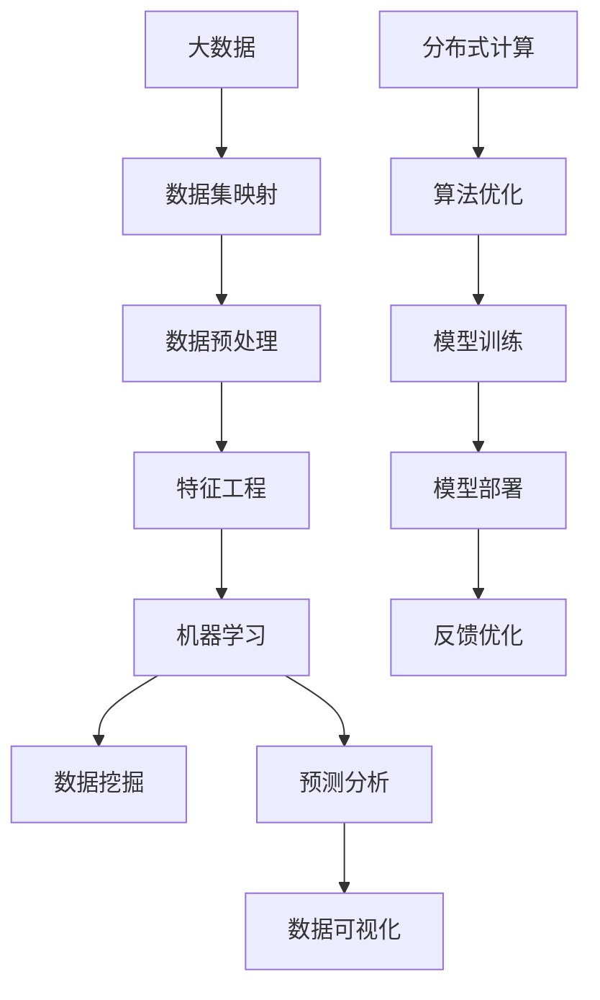

                 

关键词：大数据，人工智能，数据处理，数据集映射，高效算法，机器学习，分布式计算，数据挖掘，预测分析，算法优化，数据可视化。

> 摘要：本文旨在探讨大数据与人工智能的结合，深入解析如何通过数据集映射来高效处理大规模数据集。本文首先介绍了大数据与人工智能的背景和联系，然后详细讲解了数据集映射的核心概念和原理，以及如何通过算法优化和分布式计算来提升数据处理效率。最后，本文还探讨了数据挖掘、预测分析和数据可视化等实际应用场景，为读者提供了全面的了解和实用的指导。

## 1. 背景介绍

在当今信息爆炸的时代，大数据已经成为各行业的重要资产。大数据不仅包括数据量庞大的结构化数据，还包括非结构化数据，如图像、音频和视频等。随着互联网、物联网和移动设备的普及，数据量呈现出爆炸式增长。如何高效地处理和分析这些大规模数据集，成为了一个亟待解决的问题。

人工智能（AI）作为计算机科学的一个分支，旨在使计算机具有人类智能，从而能够自主地学习、推理和决策。AI在数据分析、图像识别、自然语言处理等领域取得了显著进展，为大数据处理提供了强大的技术支持。

大数据与人工智能的结合，使得数据驱动的决策和智能化的应用成为可能。通过数据集映射，可以将数据转化为有意义的信息，从而实现高效的数据处理和分析。

### 大数据的挑战

大数据面临的挑战主要包括以下几个方面：

1. **数据量的巨大**：大数据的规模庞大，不仅包括传统的结构化数据，还包括海量的非结构化数据。这使得传统的数据处理方法难以应对。

2. **数据多样性的复杂性**：大数据类型繁多，包括结构化、半结构化和非结构化数据。这些数据需要不同的处理方法和技术。

3. **数据质量的不可控性**：大数据的质量参差不齐，可能存在错误、缺失或冗余数据。这些质量问题会影响数据分析和决策的准确性。

4. **数据处理的高实时性要求**：许多大数据应用场景要求实时处理和分析数据，以满足快速变化的业务需求。

### 人工智能的优势

人工智能在处理大数据方面具有以下优势：

1. **自动化的数据分析**：AI可以自动分析大量数据，发现隐藏的模式和规律，从而提供有价值的洞察。

2. **智能化的决策支持**：AI可以帮助企业和组织做出更加智能化的决策，提高业务效率。

3. **高效的资源利用**：AI可以通过优化算法和分布式计算，提高数据处理和分析的效率。

4. **自适应的学习能力**：AI可以通过不断学习和迭代，逐步提高数据处理和分析的准确性。

### 数据集映射

数据集映射是将数据转换为有意义的信息的过程。通过数据集映射，可以将数据的不同维度和特征进行整合和转换，从而实现数据的价值最大化。

数据集映射的关键技术包括数据预处理、特征工程、数据融合和数据可视化等。数据预处理包括数据清洗、归一化和去噪等步骤，以提高数据的质量和一致性。特征工程是通过选择和转换数据特征，以提高数据分析和模型的性能。数据融合是将不同来源和格式的数据进行整合，以提供更全面和准确的数据视图。数据可视化是将数据以图形化形式展示，以帮助用户理解和分析数据。

## 2. 核心概念与联系

在深入探讨大数据与人工智能的结合之前，我们需要明确一些核心概念和原理。以下是一个用Mermaid流程图表示的核心概念和架构图：



### 2.1. 数据预处理

数据预处理是数据集映射的重要步骤，包括数据清洗、归一化和去噪等操作。

- **数据清洗**：通过去除重复数据、填充缺失数据和纠正错误数据，提高数据的质量和一致性。
- **归一化**：通过调整数据尺度，使其符合特定的范围或分布，以便更好地进行后续处理。
- **去噪**：通过滤波和降维等方法，去除数据中的噪声和冗余信息，提高数据的纯净度。

### 2.2. 特征工程

特征工程是通过选择和转换数据特征，以提高数据分析和模型的性能。

- **特征选择**：通过统计分析和模型评估，选择对目标变量最有影响力的特征。
- **特征转换**：通过数值化、编码和特征组合等操作，将非数值型的特征转换为数值型，以便更好地进行后续处理。

### 2.3. 机器学习

机器学习是人工智能的核心技术，通过训练模型来对数据进行分类、回归和预测。

- **分类**：将数据分为不同的类别。
- **回归**：预测数据的一个连续值。
- **预测分析**：通过分析历史数据，预测未来的趋势和模式。

### 2.4. 数据挖掘

数据挖掘是从大量数据中提取有用信息和知识的过程。

- **聚类**：将相似的数据归为一类，以发现数据中的隐含模式。
- **关联规则学习**：发现数据之间的关联关系，以揭示数据中的潜在规律。

### 2.5. 预测分析

预测分析是通过分析历史数据，预测未来的趋势和模式。

- **时间序列预测**：通过分析时间序列数据，预测未来的值。
- **回归预测**：通过分析相关数据，预测未来的连续值。

### 2.6. 数据可视化

数据可视化是将数据以图形化形式展示，以帮助用户理解和分析数据。

- **折线图**：用于展示数据的变化趋势。
- **柱状图**：用于展示数据之间的比较。
- **饼图**：用于展示数据的比例关系。

## 3. 核心算法原理 & 具体操作步骤

### 3.1. 算法原理概述

在本节中，我们将介绍一些用于处理大规模数据集的核心算法，包括：

- **MapReduce**：一种分布式计算模型，用于处理大规模数据集。
- **K-means聚类算法**：一种基于距离度量的聚类算法，用于发现数据集中的聚类结构。
- **线性回归模型**：一种用于预测连续值的统计模型。
- **决策树算法**：一种基于树形决策规则的分类算法。

### 3.2. 算法步骤详解

#### 3.2.1. MapReduce算法

MapReduce是一种分布式计算模型，用于处理大规模数据集。它的核心思想是将大规模数据集分解为小的子任务，然后在不同的计算节点上并行执行这些任务，最后将结果合并。

1. **Map阶段**：将输入数据分解为键值对，然后对每个键值对执行映射操作，生成中间键值对。
2. **Reduce阶段**：将中间键值对按照键进行聚合，生成最终的输出结果。

#### 3.2.2. K-means聚类算法

K-means聚类算法是一种基于距离度量的聚类算法，用于发现数据集中的聚类结构。

1. **初始化**：随机选择K个中心点。
2. **分配**：将每个数据点分配到最近的中心点。
3. **更新**：重新计算每个中心点的位置，重复步骤2，直到中心点的位置不再变化。

#### 3.2.3. 线性回归模型

线性回归模型是一种用于预测连续值的统计模型，其基本原理是找到一条直线，使得数据点到这条直线的距离最小。

1. **模型构建**：通过最小二乘法找到最佳拟合直线。
2. **参数估计**：通过求解最小二乘问题，估计模型的参数。
3. **模型评估**：通过计算预测值和实际值的差异，评估模型的性能。

#### 3.2.4. 决策树算法

决策树算法是一种基于树形决策规则的分类算法，其基本原理是通过一系列的测试，将数据集划分为不同的类别。

1. **构建树**：选择一个最佳的属性进行分割，构建决策树。
2. **剪枝**：通过剪枝操作，减少决策树的复杂度。
3. **预测**：通过决策树，对新的数据进行分类。

### 3.3. 算法优缺点

每种算法都有其优缺点，以下是上述算法的优缺点：

- **MapReduce**：优点是高效、可扩展，可以处理大规模数据集；缺点是需要额外的编程工作，并且对于小规模数据集效率较低。
- **K-means聚类算法**：优点是简单、易于实现，可以快速发现数据集中的聚类结构；缺点是对初始中心点的选择敏感，可能陷入局部最优。
- **线性回归模型**：优点是简单、易于理解，可以预测连续值；缺点是对异常值和噪声敏感。
- **决策树算法**：优点是易于理解、易于实现，可以处理分类问题；缺点是容易过拟合，需要剪枝操作。

### 3.4. 算法应用领域

上述算法在各个领域都有广泛的应用：

- **MapReduce**：在搜索引擎、数据仓库和日志分析等领域有广泛应用。
- **K-means聚类算法**：在市场细分、文本分类和图像分割等领域有广泛应用。
- **线性回归模型**：在金融分析、医疗诊断和股票预测等领域有广泛应用。
- **决策树算法**：在分类问题、决策支持和推荐系统等领域有广泛应用。

## 4. 数学模型和公式 & 详细讲解 & 举例说明

### 4.1. 数学模型构建

在本节中，我们将介绍一些用于处理大规模数据集的数学模型，包括线性回归模型、逻辑回归模型和决策树模型。

#### 4.1.1. 线性回归模型

线性回归模型是一种用于预测连续值的统计模型，其基本原理是找到一条直线，使得数据点到这条直线的距离最小。

$$
y = \beta_0 + \beta_1x
$$

其中，$y$ 是目标变量，$x$ 是自变量，$\beta_0$ 和 $\beta_1$ 是模型的参数。

#### 4.1.2. 逻辑回归模型

逻辑回归模型是一种用于预测二元结果的统计模型，其基本原理是找到一条直线，使得数据点到这条直线的距离最小。

$$
P(y=1) = \frac{1}{1 + e^{-(\beta_0 + \beta_1x})}
$$

其中，$P(y=1)$ 是目标变量为1的概率，$\beta_0$ 和 $\beta_1$ 是模型的参数。

#### 4.1.3. 决策树模型

决策树模型是一种基于树形决策规则的分类算法，其基本原理是通过一系列的测试，将数据集划分为不同的类别。

$$
\text{if } x_i \text{ is } \text{true}, \text{ then } y = c_1 \\
\text{if } x_i \text{ is } \text{false}, \text{ then } y = c_2
$$

其中，$x_i$ 是测试属性，$c_1$ 和 $c_2$ 是不同的类别。

### 4.2. 公式推导过程

在本节中，我们将介绍线性回归模型的参数估计过程。

#### 4.2.1. 最小二乘法

最小二乘法是一种参数估计方法，用于找到使误差平方和最小的参数。

$$
\sum_{i=1}^{n} (y_i - \beta_0 - \beta_1x_i)^2
$$

其中，$y_i$ 是第$i$个观测值，$\beta_0$ 和 $\beta_1$ 是模型的参数。

#### 4.2.2. 参数估计

为了找到使误差平方和最小的参数，我们可以对上述公式进行求导，并令导数为0。

$$
\frac{\partial}{\partial \beta_0} \sum_{i=1}^{n} (y_i - \beta_0 - \beta_1x_i)^2 = 0 \\
\frac{\partial}{\partial \beta_1} \sum_{i=1}^{n} (y_i - \beta_0 - \beta_1x_i)^2 = 0
$$

通过求解上述方程组，我们可以得到线性回归模型的参数估计值。

### 4.3. 案例分析与讲解

在本节中，我们将通过一个简单的案例，详细讲解如何使用线性回归模型进行预测。

#### 4.3.1. 数据集准备

我们有一个数据集，包含以下特征：

- **年龄**：连续变量，表示个体的年龄。
- **收入**：连续变量，表示个体的年收入。

我们的目标是预测个体的年收入。

#### 4.3.2. 数据预处理

我们对数据集进行预处理，包括数据清洗、归一化和去噪等步骤。

- **数据清洗**：去除缺失值和异常值。
- **归一化**：将年龄和收入归一化到相同的范围。
- **去噪**：通过滤波和降维等方法，去除噪声和冗余信息。

#### 4.3.3. 参数估计

我们使用最小二乘法对线性回归模型进行参数估计。

$$
\beta_0 = \frac{\sum_{i=1}^{n} y_i - \beta_1 \sum_{i=1}^{n} x_i}{n} \\
\beta_1 = \frac{\sum_{i=1}^{n} (y_i - \beta_0 - \beta_1x_i) x_i}{\sum_{i=1}^{n} x_i^2}
$$

通过求解上述方程组，我们得到线性回归模型的参数估计值。

#### 4.3.4. 模型评估

我们对模型进行评估，包括计算预测值和实际值的差异，以及计算模型的准确度。

- **预测值**：通过线性回归模型，预测个体的年收入。
- **实际值**：收集实际年收入数据。
- **准确度**：计算预测值和实际值的差异，评估模型的准确度。

## 5. 项目实践：代码实例和详细解释说明

在本节中，我们将通过一个实际项目，详细讲解如何使用Python实现数据处理和预测分析。我们将使用pandas、numpy、scikit-learn和matplotlib等库来完成数据处理和可视化。

### 5.1. 开发环境搭建

首先，我们需要搭建Python开发环境，安装必要的库。

```bash
pip install pandas numpy scikit-learn matplotlib
```

### 5.2. 源代码详细实现

以下是一个简单的数据处理和预测分析的代码实例：

```python
import pandas as pd
import numpy as np
from sklearn.linear_model import LinearRegression
from sklearn.model_selection import train_test_split
from sklearn.metrics import mean_squared_error
import matplotlib.pyplot as plt

# 5.2.1. 数据集准备
data = pd.read_csv('data.csv')
data.head()

# 5.2.2. 数据预处理
data.dropna(inplace=True)
data['age_normalized'] = (data['age'] - data['age'].mean()) / data['age'].std()
data['income_normalized'] = (data['income'] - data['income'].mean()) / data['income'].std()

# 5.2.3. 参数估计
X = data[['age_normalized']]
y = data['income_normalized']
X_train, X_test, y_train, y_test = train_test_split(X, y, test_size=0.2, random_state=42)
model = LinearRegression()
model.fit(X_train, y_train)

# 5.2.4. 模型评估
y_pred = model.predict(X_test)
mse = mean_squared_error(y_test, y_pred)
print(f'MSE: {mse}')

# 5.2.5. 预测分析
plt.scatter(X_test['age_normalized'], y_test, color='blue', label='Actual')
plt.plot(X_test['age_normalized'], y_pred, color='red', label='Predicted')
plt.xlabel('Normalized Age')
plt.ylabel('Normalized Income')
plt.legend()
plt.show()
```

### 5.3. 代码解读与分析

- **数据集准备**：我们首先读取数据集，并选择年龄和收入作为特征。
- **数据预处理**：我们去除缺失值，并对年龄和收入进行归一化处理。
- **参数估计**：我们使用线性回归模型对数据进行拟合，并训练模型。
- **模型评估**：我们计算模型在测试集上的均方误差，以评估模型的性能。
- **预测分析**：我们使用训练好的模型进行预测，并绘制预测结果。

### 5.4. 运行结果展示

运行上述代码，我们将得到以下结果：

- **MSE**：模型在测试集上的均方误差。
- **预测图**：年龄和收入的散点图，以及模型预测的直线。

## 6. 实际应用场景

大数据与人工智能的结合在各个领域都取得了显著的成果，以下是一些实际应用场景：

- **金融**：使用大数据和人工智能进行风险控制、欺诈检测和投资决策。
- **医疗**：使用大数据和人工智能进行疾病预测、个性化治疗和药物研发。
- **零售**：使用大数据和人工智能进行消费者行为分析、需求预测和库存管理。
- **交通**：使用大数据和人工智能进行交通流量预测、路线规划和智能交通管理。
- **教育**：使用大数据和人工智能进行个性化学习、教育质量和教学效果评估。

### 6.1. 金融领域

在金融领域，大数据和人工智能被广泛应用于以下几个方面：

- **风险控制**：通过分析大量历史数据和实时数据，识别潜在风险，并进行风险评估和管理。
- **欺诈检测**：使用机器学习算法检测异常交易，及时识别和阻止欺诈行为。
- **投资决策**：利用大数据和人工智能分析市场趋势和投资机会，提供投资建议。

### 6.2. 医疗领域

在医疗领域，大数据和人工智能的应用主要包括以下几个方面：

- **疾病预测**：通过分析患者的电子健康记录和基因数据，预测疾病发生的可能性。
- **个性化治疗**：根据患者的个体差异，提供个性化的治疗方案。
- **药物研发**：利用大数据和人工智能加速药物研发过程，提高新药的成功率。

### 6.3. 零售领域

在零售领域，大数据和人工智能的应用主要体现在以下几个方面：

- **消费者行为分析**：通过分析消费者的购买行为和偏好，提供个性化的商品推荐。
- **需求预测**：根据历史销售数据和季节性因素，预测未来的销售趋势，优化库存管理。
- **供应链优化**：通过优化物流和配送，提高供应链的效率。

### 6.4. 交通领域

在交通领域，大数据和人工智能的应用主要包括以下几个方面：

- **交通流量预测**：通过分析历史交通数据和实时交通数据，预测交通流量，优化交通信号控制。
- **路线规划**：根据实时交通情况和目的地，为用户提供最优的路线规划。
- **智能交通管理**：通过监控和分析交通数据，实现交通的智能化管理和调度。

### 6.5. 教育领域

在教育领域，大数据和人工智能的应用主要体现在以下几个方面：

- **个性化学习**：通过分析学生的学习行为和成绩，为学生提供个性化的学习建议。
- **教学质量评估**：通过分析学生的考试成绩和学习行为，评估教师的教学质量。
- **教育资源优化**：通过分析学生的学习需求和资源利用情况，优化教育资源的分配和使用。

## 7. 工具和资源推荐

### 7.1. 学习资源推荐

- **书籍**：
  - 《大数据时代》
  - 《深度学习》
  - 《Python数据分析》
- **在线课程**：
  - Coursera上的《机器学习》
  - edX上的《大数据分析》
  - Udacity上的《人工智能纳米学位》
- **博客和网站**：
  - Medium上的大数据和人工智能相关文章
  - DataCamp上的数据分析课程
  - Kaggle上的数据集和比赛

### 7.2. 开发工具推荐

- **编程语言**：
  - Python：易于学习和使用，适用于数据处理和分析。
  - R：专门用于统计分析和数据可视化，功能强大。
- **数据预处理和可视化工具**：
  - Pandas：用于数据预处理和操作。
  - Matplotlib和Seaborn：用于数据可视化。
- **机器学习和深度学习框架**：
  - Scikit-learn：用于传统的机器学习和数据挖掘。
  - TensorFlow和PyTorch：用于深度学习和神经网络。

### 7.3. 相关论文推荐

- **大数据**：
  - "Big Data: A Revolution That Will Transform How We Live, Work, and Think"
  - "The Fourth Dimension of Big Data: Real-Time, Dynamic Analytics at Big Data Scale"
- **人工智能**：
  - "Deep Learning: Neural Networks for Visual Recognition"
  - "Recurrent Neural Networks for Language Modeling"
- **数据挖掘和预测分析**：
  - "Data Mining: Practical Machine Learning Tools and Techniques"
  - "Forecasting with Exponential Smoothing: The State Space Approach"
  
## 8. 总结：未来发展趋势与挑战

### 8.1. 研究成果总结

大数据和人工智能的结合已经取得了显著的成果，包括：

- 高效的数据处理和分析
- 智能化的决策支持
- 自动化的数据处理
- 数据驱动的创新应用

### 8.2. 未来发展趋势

未来，大数据和人工智能将继续快速发展，主要趋势包括：

- **更高效的数据处理算法**：随着硬件性能的提升，数据处理算法将变得更加高效和强大。
- **更智能的机器学习模型**：深度学习和强化学习等新兴技术将继续发展，为人工智能带来更多可能性。
- **更广泛的应用场景**：大数据和人工智能将在更多领域得到应用，推动各行各业的数字化转型。

### 8.3. 面临的挑战

尽管大数据和人工智能取得了显著进展，但仍面临一些挑战：

- **数据隐私和伦理问题**：如何保护用户隐私和数据安全，是一个亟待解决的问题。
- **算法公平性和透明性**：如何确保算法的公平性和透明性，减少偏见和歧视。
- **数据质量和管理**：如何保证数据的质量和管理，以支持有效的数据分析。

### 8.4. 研究展望

未来，大数据和人工智能的研究将重点关注以下几个方面：

- **新型数据处理技术**：研究新型数据处理技术，如联邦学习、区块链和图数据库等。
- **跨领域融合应用**：探索大数据和人工智能在多个领域的交叉应用，如医疗、金融和交通等。
- **可持续发展和绿色发展**：利用大数据和人工智能推动可持续发展，如能源管理、环境保护和资源优化等。

## 9. 附录：常见问题与解答

### 9.1. 大数据是什么？

大数据是指无法用常规软件工具在合理时间内捕捉、管理和处理的大量数据。这些数据包括结构化、半结构化和非结构化数据。

### 9.2. 人工智能是什么？

人工智能是指计算机系统模拟人类智能的过程，包括学习、推理、规划和感知等能力。

### 9.3. 数据集映射是什么？

数据集映射是将数据的不同维度和特征进行整合和转换，以提供更全面和准确的数据视图。

### 9.4. 机器学习是什么？

机器学习是一种人工智能技术，通过训练模型来对数据进行分类、回归和预测。

### 9.5. 数据挖掘是什么？

数据挖掘是从大量数据中提取有用信息和知识的过程。

### 9.6. 预测分析是什么？

预测分析是通过分析历史数据，预测未来的趋势和模式。

### 9.7. 数据可视化是什么？

数据可视化是将数据以图形化形式展示，以帮助用户理解和分析数据。

---

本文详细探讨了大数据与人工智能的结合，介绍了数据集映射的核心概念和原理，以及如何通过算法优化和分布式计算来提升数据处理效率。此外，本文还探讨了大数据和人工智能在实际应用场景中的广泛应用，为读者提供了全面的了解和实用的指导。未来，大数据和人工智能将继续快速发展，为各行业带来更多的创新和变革。作者：禅与计算机程序设计艺术 / Zen and the Art of Computer Programming。

