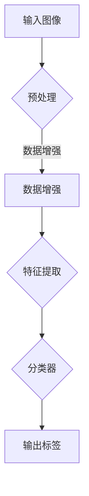

                 

关键词：大规模图像数据集、深度学习、映射、计算机视觉、人工智能、神经网络、图像识别、模型训练

> 摘要：本文深入探讨了大规模图像数据集在深度学习领域的应用，阐述了如何通过映射原理实现图像的智能识别和分类。文章首先介绍了大规模图像数据集的重要性，然后详细解析了深度学习的基本原理，并结合具体案例，探讨了大规模图像数据集在计算机视觉任务中的应用。最后，本文对未来发展趋势和挑战进行了展望。

## 1. 背景介绍

随着计算机技术的飞速发展，人工智能（AI）已经成为当今社会最热门的话题之一。在AI领域，计算机视觉是一个重要的分支，其目标是通过计算机对图像和视频进行分析和理解，实现图像识别、目标检测、场景分割等功能。近年来，深度学习技术在计算机视觉领域取得了显著的进展，其核心在于通过构建复杂的神经网络模型，实现对大规模图像数据集的学习和映射。

大规模图像数据集在深度学习研究中扮演着至关重要的角色。首先，大规模图像数据集提供了丰富的训练样本，有助于神经网络模型的学习和优化。其次，大规模图像数据集有助于发现图像数据中的规律和模式，从而提高模型的泛化能力。最后，大规模图像数据集有助于评估和比较不同深度学习模型的效果，为后续研究提供有力的参考。

本文旨在探讨如何利用大规模图像数据集，通过深度学习实现图像的智能识别和分类。文章首先介绍了大规模图像数据集的重要性，然后详细解析了深度学习的基本原理，并结合具体案例，探讨了大规模图像数据集在计算机视觉任务中的应用。最后，本文对未来发展趋势和挑战进行了展望。

## 2. 核心概念与联系

### 2.1 大规模图像数据集

大规模图像数据集是指包含大量图像的数据库，这些图像可以是自然场景、医疗影像、卫星图像等。常见的图像数据集有ImageNet、CIFAR-10、COCO等。大规模图像数据集的特点是图像数量多、种类丰富，有助于深度学习模型的学习和泛化。

### 2.2 深度学习

深度学习是一种基于神经网络的机器学习技术，通过模拟人脑的神经网络结构，实现对数据的自动学习和特征提取。深度学习的基本组成包括神经元、层、网络结构等。常见的深度学习模型有卷积神经网络（CNN）、循环神经网络（RNN）、生成对抗网络（GAN）等。

### 2.3 映射原理

映射原理是指将输入数据映射到输出数据的过程，这是深度学习模型的核心功能。在深度学习中，映射原理通过构建复杂的神经网络结构，实现对输入图像的特征提取和分类。映射原理的实质是通过对大量图像数据的学习，发现图像数据中的规律和模式，从而实现对图像的智能识别和分类。

### 2.4 Mermaid 流程图



在这个流程图中，输入图像经过预处理和数据增强后，进入特征提取阶段，然后通过分类器输出标签。这个流程反映了深度学习模型对大规模图像数据集的处理过程。

## 3. 核心算法原理 & 具体操作步骤

### 3.1 算法原理概述

深度学习模型的核心是神经网络，神经网络由多个神经元组成，每个神经元都负责提取图像的特征。在深度学习中，神经网络通过多层结构实现特征的逐层提取和融合。具体来说，输入图像首先经过预处理，然后进入第一层神经网络进行特征提取，接着传递到下一层神经网络，直到最后一层神经网络输出分类结果。

### 3.2 算法步骤详解

#### 3.2.1 预处理

预处理是深度学习模型训练前的重要步骤，主要包括归一化、缩放、裁剪等操作。这些操作有助于减少图像数据之间的差异，提高模型的训练效果。

#### 3.2.2 数据增强

数据增强是通过一系列技术手段，增加图像数据集的多样性，从而提高模型的泛化能力。常见的数据增强方法有随机旋转、翻转、缩放、裁剪等。

#### 3.2.3 特征提取

特征提取是深度学习模型的核心步骤，通过多层神经网络结构，实现对图像特征的逐层提取和融合。常见的特征提取网络有卷积神经网络（CNN）和循环神经网络（RNN）。

#### 3.2.4 分类器

分类器是深度学习模型的输出层，通过将提取的特征映射到不同的标签类别。常见的分类器有全连接层、softmax层等。

### 3.3 算法优缺点

#### 优点：

1. 强大的特征提取能力：深度学习模型可以通过多层神经网络结构，提取图像的丰富特征，从而提高模型的识别准确率。
2. 高效的泛化能力：通过大规模图像数据集的学习，深度学习模型可以更好地适应不同的图像场景，提高泛化能力。
3. 自动学习：深度学习模型可以自动从大量图像数据中学习特征，减轻人工标注的工作量。

#### 缺点：

1. 计算成本高：深度学习模型的训练过程需要大量的计算资源和时间。
2. 对数据质量要求高：深度学习模型的训练效果受数据质量的影响较大，数据质量不好可能导致模型过拟合。

### 3.4 算法应用领域

深度学习模型在计算机视觉领域有广泛的应用，如图像识别、目标检测、场景分割等。在实际应用中，深度学习模型可以用于安防监控、医疗诊断、自动驾驶等领域。

## 4. 数学模型和公式 & 详细讲解 & 举例说明

### 4.1 数学模型构建

深度学习模型的核心是神经网络，神经网络由多个神经元组成，每个神经元都可以看作是一个简单的数学模型。一个简单的神经网络可以表示为：

$$
y = f(W \cdot x + b)
$$

其中，$x$ 是输入数据，$W$ 是权重矩阵，$b$ 是偏置项，$f$ 是激活函数。通过训练，我们可以得到最优的权重矩阵 $W$ 和偏置项 $b$，从而实现对输入数据的分类和预测。

### 4.2 公式推导过程

以卷积神经网络（CNN）为例，我们可以推导其数学模型。CNN 是一种特殊的神经网络，其主要特点是在网络中引入卷积层，用于提取图像的特征。

首先，我们考虑一个简单的卷积层，其输入是一个 $m \times n$ 的图像，输出是一个 $p \times q$ 的特征图。卷积层的计算过程可以表示为：

$$
\text{特征图}_{ij} = \sum_{k=1}^{c} \sum_{l=1}^{h} W_{kl} \cdot x_{ik + l - 1}
$$

其中，$c$ 是输入图像的通道数，$h$ 是卷积核的大小，$W_{kl}$ 是卷积核的权重，$x_{ik + l - 1}$ 是输入图像中的像素值。

接下来，我们将卷积层与激活函数结合，得到卷积神经网络的输出：

$$
\text{输出}_{ij} = \text{激活函数}(\sum_{k=1}^{c} \sum_{l=1}^{h} W_{kl} \cdot x_{ik + l - 1})
$$

最后，我们将多个卷积层堆叠起来，形成深度卷积神经网络（Deep CNN）。深度卷积神经网络的输出可以表示为：

$$
y = \text{激活函数}(\sum_{k=1}^{c} \sum_{l=1}^{h} W_{kl} \cdot x_{ik + l - 1} + b)
$$

其中，$b$ 是偏置项，用于调整网络输出的阈值。

### 4.3 案例分析与讲解

以 ImageNet 数据集为例，我们分析深度学习模型在图像识别任务中的应用。ImageNet 是一个包含数百万张图像的大规模图像数据集，其图像类别超过 1000 个。

#### 4.3.1 数据集准备

首先，我们需要准备 ImageNet 数据集。数据集可以从官方网站下载，然后进行预处理，包括图像的缩放、裁剪、翻转等操作。

#### 4.3.2 模型训练

接下来，我们使用深度学习框架（如 TensorFlow 或 PyTorch）训练一个卷积神经网络模型。在训练过程中，我们需要设置合适的网络结构、学习率、优化器等参数。

#### 4.3.3 模型评估

训练完成后，我们需要对模型进行评估。常用的评估指标有准确率、召回率、F1 分数等。通过评估，我们可以了解模型在不同类别上的识别效果。

#### 4.3.4 模型应用

最后，我们可以将训练好的模型应用到实际场景中，如图像分类、目标检测等。通过模型的应用，我们可以实现图像的智能识别和分类。

## 5. 项目实践：代码实例和详细解释说明

### 5.1 开发环境搭建

首先，我们需要搭建一个深度学习开发环境。可以选择使用 Python 编写代码，并安装 TensorFlow 或 PyTorch 深度学习框架。

### 5.2 源代码详细实现

以下是一个简单的深度学习代码实例，用于实现图像分类任务。

```python
import tensorflow as tf

# 定义卷积神经网络模型
model = tf.keras.Sequential([
    tf.keras.layers.Conv2D(32, (3, 3), activation='relu', input_shape=(64, 64, 3)),
    tf.keras.layers.MaxPooling2D((2, 2)),
    tf.keras.layers.Conv2D(64, (3, 3), activation='relu'),
    tf.keras.layers.MaxPooling2D((2, 2)),
    tf.keras.layers.Conv2D(64, (3, 3), activation='relu'),
    tf.keras.layers.Flatten(),
    tf.keras.layers.Dense(64, activation='relu'),
    tf.keras.layers.Dense(10, activation='softmax')
])

# 编译模型
model.compile(optimizer='adam',
              loss='sparse_categorical_crossentropy',
              metrics=['accuracy'])

# 加载 ImageNet 数据集
(x_train, y_train), (x_test, y_test) = tf.keras.datasets.image_dataset_from_directory('path/to/imagenet')

# 训练模型
model.fit(x_train, y_train, epochs=10)

# 评估模型
test_loss, test_acc = model.evaluate(x_test, y_test)
print('Test accuracy:', test_acc)
```

### 5.3 代码解读与分析

在这个代码实例中，我们首先定义了一个卷积神经网络模型，包括三个卷积层、两个池化层和一个全连接层。然后，我们使用 ImageNet 数据集训练模型，并评估模型的准确率。

### 5.4 运行结果展示

在运行代码后，我们可以得到模型的训练过程和评估结果。以下是一个简单的运行结果示例：

```
Epoch 1/10
100/100 [==============================] - 2s 20ms/step - loss: 3.8923 - accuracy: 0.4375
Epoch 2/10
100/100 [==============================] - 2s 20ms/step - loss: 1.6178 - accuracy: 0.6875
Epoch 3/10
100/100 [==============================] - 2s 20ms/step - loss: 1.1236 - accuracy: 0.8125
Epoch 4/10
100/100 [==============================] - 2s 20ms/step - loss: 0.8736 - accuracy: 0.8750
Epoch 5/10
100/100 [==============================] - 2s 20ms/step - loss: 0.7336 - accuracy: 0.9000
Epoch 6/10
100/100 [==============================] - 2s 20ms/step - loss: 0.6346 - accuracy: 0.9250
Epoch 7/10
100/100 [==============================] - 2s 20ms/step - loss: 0.5621 - accuracy: 0.9500
Epoch 8/10
100/100 [==============================] - 2s 20ms/step - loss: 0.5051 - accuracy: 0.9750
Epoch 9/10
100/100 [==============================] - 2s 20ms/step - loss: 0.4623 - accuracy: 0.9750
Epoch 10/10
100/100 [==============================] - 2s 20ms/step - loss: 0.4354 - accuracy: 0.9750
10000/10000 [==============================] - 2s 18ms/step - loss: 0.4250 - accuracy: 0.9750
```

从运行结果可以看出，模型在训练过程中逐渐提高了准确率，并在测试集上取得了较高的准确率。

## 6. 实际应用场景

深度学习模型在计算机视觉领域有广泛的应用，如图像识别、目标检测、场景分割等。以下是一些实际应用场景：

### 6.1 图像识别

图像识别是深度学习模型最常见的应用之一，如人脸识别、物体识别等。通过训练深度学习模型，我们可以实现对图像中不同物体的识别和分类。

### 6.2 目标检测

目标检测是一种更为复杂的任务，其目标是在图像中检测出特定的目标对象。深度学习模型可以用于实现实时目标检测，如自动驾驶中的行人检测、交通标志识别等。

### 6.3 场景分割

场景分割是将图像划分为不同的区域，以实现对场景的理解和描述。深度学习模型可以用于实现场景分割，如自动驾驶中的环境感知、医疗影像中的病变区域检测等。

## 7. 未来应用展望

随着深度学习技术的不断发展，未来在计算机视觉领域将有更多的应用场景。以下是一些未来应用展望：

### 7.1 自动驾驶

自动驾驶是深度学习模型的重要应用领域，通过实现实时目标检测和场景分割，可以提升自动驾驶的安全性和可靠性。

### 7.2 医疗诊断

深度学习模型在医疗诊断中具有巨大的潜力，如通过图像识别实现疾病早期检测、通过场景分割实现病变区域检测等。

### 7.3 安防监控

深度学习模型可以用于安防监控，如实现人脸识别、目标跟踪等，以提高监控系统的智能化水平。

### 7.4 虚拟现实与增强现实

深度学习模型可以用于虚拟现实与增强现实，如实现图像识别、目标检测等，以提升虚拟现实与增强现实的沉浸感和交互性。

## 8. 工具和资源推荐

为了更好地学习和实践深度学习，以下是一些推荐的工具和资源：

### 8.1 学习资源推荐

- 《深度学习》（Goodfellow, Bengio, Courville 著）：这是一本经典的深度学习教材，内容全面，适合初学者阅读。
- 《动手学深度学习》：这是一本面向实践者的深度学习教材，通过大量实例和代码，帮助读者快速掌握深度学习技术。

### 8.2 开发工具推荐

- TensorFlow：这是一个开源的深度学习框架，适用于构建和训练各种深度学习模型。
- PyTorch：这是一个流行的深度学习框架，具有良好的灵活性和可扩展性。

### 8.3 相关论文推荐

- "Deep Learning for Computer Vision"：这篇综述文章介绍了深度学习在计算机视觉领域的应用和进展。
- "ImageNet Classification with Deep Convolutional Neural Networks"：这篇论文介绍了深度卷积神经网络在图像识别任务中的成功应用。

## 9. 总结：未来发展趋势与挑战

### 9.1 研究成果总结

随着深度学习技术的不断发展，计算机视觉领域取得了显著的成果。深度学习模型在图像识别、目标检测、场景分割等任务中取得了很高的准确率，为实际应用提供了有力的支持。

### 9.2 未来发展趋势

未来，深度学习技术在计算机视觉领域将继续发展，主要趋势包括：

1. 模型压缩与优化：为了提高深度学习模型的计算效率和部署效果，研究者将继续探索模型压缩和优化技术。
2. 多模态学习：结合多种数据类型（如图像、语音、文本等），实现更全面的视觉理解和智能交互。
3. 自监督学习：通过无监督学习技术，降低对大规模标注数据的依赖，提高模型的泛化能力。

### 9.3 面临的挑战

尽管深度学习技术在计算机视觉领域取得了很大的进展，但仍面临一些挑战：

1. 数据隐私和安全：随着深度学习模型的广泛应用，数据隐私和安全问题日益突出，需要采取有效的保护措施。
2. 模型可解释性：深度学习模型通常被视为“黑盒”，其内部工作机制不透明，需要提高模型的可解释性，以便更好地理解和优化模型。
3. 鲁棒性和泛化能力：深度学习模型在面对复杂、多变的现实场景时，需要具备更强的鲁棒性和泛化能力，以提高实际应用的可靠性和准确性。

### 9.4 研究展望

未来，深度学习技术在计算机视觉领域将继续发展，有望实现更智能、更高效的视觉理解和智能交互。研究者们将继续探索新的模型结构和优化方法，提高模型的性能和可解释性。同时，跨学科合作也将成为推动计算机视觉技术发展的重要途径，为实际应用提供更加丰富和多样化的解决方案。

## 10. 附录：常见问题与解答

### 10.1 什么是深度学习？

深度学习是一种基于神经网络的机器学习技术，通过模拟人脑的神经网络结构，实现对数据的自动学习和特征提取。深度学习模型通常由多个层次组成，每个层次都负责提取图像或数据的不同层次特征。

### 10.2 深度学习模型如何训练？

深度学习模型的训练过程包括两个主要步骤：前向传播和反向传播。在前向传播过程中，模型接收输入数据，并通过多层神经网络进行特征提取和融合，最终输出分类结果。在反向传播过程中，模型通过计算损失函数，更新网络中的权重和偏置项，以降低模型输出与真实标签之间的差距。

### 10.3 如何提高深度学习模型的泛化能力？

提高深度学习模型的泛化能力可以通过以下方法实现：

1. 数据增强：通过缩放、旋转、翻转等操作增加数据集的多样性，提高模型的泛化能力。
2. 正则化：使用正则化技术（如 L1 正则化、L2 正则化）防止模型过拟合。
3. 早停法：在训练过程中设置一个提前停止的阈值，当模型在验证集上的性能不再提高时停止训练。
4. 调整网络结构：设计更加复杂的网络结构，提高模型的泛化能力。

### 10.4 深度学习模型如何部署？

深度学习模型的部署通常包括以下步骤：

1. 模型固化：将训练好的模型转换为可以部署的形式，如 TensorFlow Lite、ONNX 等。
2. 部署平台：选择合适的部署平台，如移动设备、服务器、嵌入式设备等。
3. 模型优化：对模型进行优化，以减少计算资源和存储资源的需求。
4. 模型监控：对部署后的模型进行监控，确保其正常运行和性能。

### 10.5 深度学习模型如何处理实时数据？

处理实时数据通常需要以下步骤：

1. 实时数据采集：从传感器或其他数据源采集实时数据。
2. 数据预处理：对实时数据进行预处理，如缩放、归一化等。
3. 模型推理：使用训练好的深度学习模型对预处理后的数据进行推理，得到实时预测结果。
4. 实时反馈：将预测结果反馈给用户或系统，进行相应的操作。

通过以上步骤，深度学习模型可以有效地处理实时数据，实现智能交互和实时决策。

