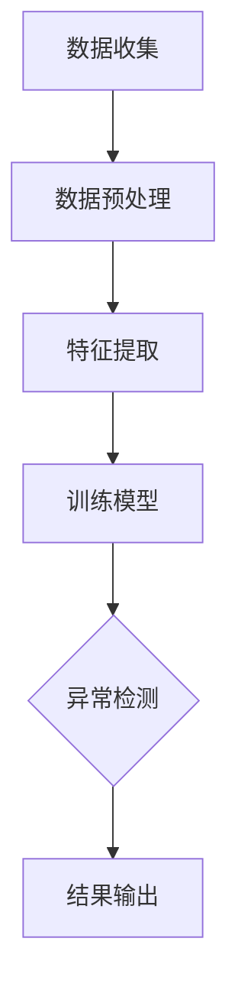

                 

关键词：异常检测，人工智能，数据挖掘，隐藏模式，模式识别，算法分析，数据分析

> 摘要：本文将探讨如何利用人工智能技术进行异常检测，尤其是在大数据环境中捕捉隐藏模式的方法。我们将深入分析几种主要的异常检测算法，阐述其原理、优缺点和应用领域。此外，文章将提供一个实际的项目实践实例，展示如何使用AI技术进行异常检测。最后，本文将讨论未来该领域的发展趋势与挑战，为读者提供全面的了解。

## 1. 背景介绍

随着互联网和物联网技术的迅猛发展，数据规模呈现爆炸式增长，数据种类也日益多样。在这种背景下，传统的数据处理和分析方法已经难以应对日益复杂的数据环境。异常检测（Anomaly Detection）作为一种重要的数据挖掘技术，旨在从大量数据中识别出与正常模式不符的异常或罕见事件。异常检测不仅在金融、医疗、网络安全等领域有广泛的应用，还在数据安全、故障检测、市场分析等领域发挥着关键作用。

人工智能（AI）技术的迅速发展为异常检测提供了新的机遇。通过机器学习和深度学习算法，AI系统能够自动学习和识别数据中的隐藏模式，从而提高异常检测的准确性和效率。本文将重点探讨AI在异常检测中的应用，介绍几种常见的算法，并提供实际项目实例。

## 2. 核心概念与联系

### 2.1 异常检测的定义

异常检测是指从一组数据中识别出不符合常规分布的异常值或异常模式。这些异常值或模式可能是错误数据、欺诈行为、系统故障或其他异常情况。异常检测的核心目标是确保数据质量和系统安全。

### 2.2 人工智能在异常检测中的作用

人工智能技术，特别是机器学习和深度学习，使得异常检测变得更加智能和高效。AI系统能够通过学习大量数据，自动识别数据中的隐藏模式，从而实现异常检测。以下是人工智能在异常检测中的一些关键作用：

- **自动特征提取**：AI系统能够自动从数据中提取有用的特征，这些特征有助于识别异常。
- **模式识别**：AI系统能够识别数据中的异常模式，即使在数据分布不均匀的情况下也能有效工作。
- **实时检测**：AI系统可以实现实时异常检测，及时发现并响应异常事件。

### 2.3 Mermaid 流程图

下面是一个简单的Mermaid流程图，展示了异常检测的基本流程：



### 2.4 异常检测算法的分类

异常检测算法主要分为基于统计方法、基于聚类方法、基于孤立点检测方法和基于神经网络方法。每种方法都有其特定的原理和应用场景。

#### 基于统计方法

基于统计方法的异常检测主要通过计算数据的概率分布来识别异常。这种方法简单直观，但在数据分布不均匀或异常模式不明显的情况下效果较差。

#### 基于聚类方法

基于聚类方法的异常检测通过将数据分成多个聚类，识别出不属于任何聚类的数据点。这种方法能够很好地处理复杂的数据分布，但聚类质量对结果有较大影响。

#### 基于孤立点检测方法

基于孤立点检测方法的异常检测专注于识别数据中的孤立点。这种方法能够准确检测异常，但可能在高维数据中表现不佳。

#### 基于神经网络方法

基于神经网络方法的异常检测利用深度学习技术，能够自动学习和识别复杂的数据模式。这种方法在处理高维数据和复杂数据分布时表现优秀，但需要大量数据和计算资源。

## 3. 核心算法原理 & 具体操作步骤

### 3.1 算法原理概述

异常检测算法的核心目标是找到数据中的异常点或异常模式。以下是几种常见的异常检测算法及其原理：

#### 1. 基于统计方法的算法

基于统计方法的异常检测算法主要通过计算数据的统计特征（如均值、方差等）来识别异常。其原理如下：

- **均值-标准差法**：计算数据的均值和标准差，识别出与均值相差超过一定倍数标准差的数据点作为异常。
- **三倍均值-标准差法**：将数据分成三个区域，中间的区域作为正常数据，两端的区域作为异常数据。

#### 2. 基于聚类方法的算法

基于聚类方法的异常检测算法主要通过聚类分析识别异常。其原理如下：

- **K-均值聚类**：通过迭代算法将数据分成K个聚类，识别出不属于任何聚类的数据点作为异常。
- **层次聚类**：通过合并或分裂聚类，逐步构建聚类树，识别出异常聚类。

#### 3. 基于孤立点检测方法的算法

基于孤立点检测方法的异常检测算法专注于识别数据中的孤立点。其原理如下：

- **局部离群因数（LOF）**：通过计算每个数据点与其邻居的相似度，识别出相似度较低的点作为异常。
- **孤立森林（Isolation Forest）**：通过随机选择特征和切分值，将数据点隔离成多个孤立点，识别出孤立点作为异常。

#### 4. 基于神经网络方法的算法

基于神经网络方法的异常检测算法主要通过深度学习技术识别复杂的数据模式。其原理如下：

- **自编码器（Autoencoder）**：通过训练一个压缩-扩展模型，识别出无法重构的数据点作为异常。
- **生成对抗网络（GAN）**：通过生成器与判别器的对抗训练，识别出生成器生成的数据点作为异常。

### 3.2 算法步骤详解

以下是几种异常检测算法的具体操作步骤：

#### 1. 均值-标准差法

- **步骤1**：计算数据的均值和标准差。
- **步骤2**：设置一个阈值，通常为标准差的几倍（如3倍或更多）。
- **步骤3**：对每个数据点，计算其与均值的距离，如果距离超过阈值，则标记为异常。

#### 2. K-均值聚类

- **步骤1**：初始化K个聚类中心。
- **步骤2**：将每个数据点分配到最近的聚类中心。
- **步骤3**：更新聚类中心，计算每个聚类的均值。
- **步骤4**：重复步骤2和步骤3，直到聚类中心不再变化。
- **步骤5**：识别出不属于任何聚类的数据点作为异常。

#### 3. 局部离群因数（LOF）

- **步骤1**：计算每个数据点的K个邻居。
- **步骤2**：计算每个邻居与数据点的相似度。
- **步骤3**：计算每个数据点的局部离群因数（LOF），公式如下：
  $$ LOF(d) = \frac{1}{k}\sum_{i=1}^{k}\frac{1}{s(d, i)} $$
  其中，$s(d, i)$表示数据点$d$与其邻居$i$的相似度。
- **步骤4**：设置一个阈值，识别出LOF值超过阈值的点作为异常。

#### 4. 自编码器

- **步骤1**：设计一个自编码器模型，包括编码器和解码器。
- **步骤2**：使用训练数据训练模型，使解码器能够准确重构输入数据。
- **步骤3**：对测试数据进行编码，计算编码输出的平均值和标准差。
- **步骤4**：对每个测试数据，计算其编码输出与平均值的距离，如果距离超过阈值，则标记为异常。

### 3.3 算法优缺点

以下是几种异常检测算法的优缺点：

#### 均值-标准差法

- **优点**：简单直观，易于实现。
- **缺点**：对数据分布不均匀和异常模式不明显的情况效果较差。

#### K-均值聚类

- **优点**：能够处理复杂的数据分布。
- **缺点**：聚类质量对结果有较大影响，可能产生误分类。

#### 局部离群因数（LOF）

- **优点**：能够较好地处理高维数据。
- **缺点**：计算复杂度高，对异常点的数量敏感。

#### 自编码器

- **优点**：能够自动提取特征，适用于复杂数据分布。
- **缺点**：训练过程复杂，需要大量数据和计算资源。

### 3.4 算法应用领域

异常检测算法在多个领域有广泛的应用：

- **金融领域**：识别欺诈交易、异常交易等。
- **医疗领域**：识别异常病例、医疗数据异常等。
- **网络安全领域**：检测恶意攻击、异常流量等。
- **工业领域**：检测设备故障、生产线异常等。

## 4. 数学模型和公式 & 详细讲解 & 举例说明

### 4.1 数学模型构建

异常检测的数学模型主要基于概率分布和聚类分析。以下是几种常见的数学模型：

#### 1. 均值-标准差法

- **概率模型**：
  $$ p(x) = \frac{1}{\sqrt{2\pi\sigma^2}}e^{-\frac{(x-\mu)^2}{2\sigma^2}} $$
  其中，$x$为数据点，$\mu$为均值，$\sigma$为标准差。

- **阈值设置**：
  $$ \text{阈值} = k \times \sigma $$
  其中，$k$为倍数，通常取3。

#### 2. K-均值聚类

- **聚类中心**：
  $$ \mu_k = \frac{1}{n_k}\sum_{i=1}^{n}x_i $$
  其中，$\mu_k$为第$k$个聚类中心，$n_k$为第$k$个聚类中的数据点数量，$x_i$为数据点。

- **数据点分配**：
  $$ \text{聚类中心} = \arg\min_{\mu_k}\sum_{i=1}^{n}(x_i - \mu_k)^2 $$

#### 3. 局部离群因数（LOF）

- **相似度计算**：
  $$ s(d, i) = \frac{||d - \mu_k||}{||i - \mu_k||} $$
  其中，$d$为数据点，$i$为邻居，$\mu_k$为聚类中心。

- **LOF计算**：
  $$ LOF(d) = \frac{1}{k}\sum_{i=1}^{k}\frac{1}{s(d, i)} $$

#### 4. 自编码器

- **编码器**：
  $$ z = \sigma(W_2 \cdot \phi(W_1 \cdot x + b_1)) + b_2 $$
  其中，$x$为输入数据，$z$为编码输出，$W_1$和$W_2$为权重矩阵，$\phi$为激活函数，$b_1$和$b_2$为偏置。

- **解码器**：
  $$ x' = \sigma(W_2' \cdot \phi(W_1' \cdot z + b_1') + b_2') $$
  其中，$x'$为解码输出，$W_1'$和$W_2'$为权重矩阵，$b_1'$和$b_2'$为偏置。

### 4.2 公式推导过程

#### 1. 均值-标准差法

- **概率密度函数**：
  $$ p(x) = \frac{1}{\sqrt{2\pi\sigma^2}}e^{-\frac{(x-\mu)^2}{2\sigma^2}} $$
  该公式表示正态分布的概率密度函数，其中$\mu$为均值，$\sigma$为标准差。

- **阈值设置**：
  $$ \text{阈值} = k \times \sigma $$
  该公式表示设置阈值的倍数，通常取3。

#### 2. K-均值聚类

- **聚类中心**：
  $$ \mu_k = \frac{1}{n_k}\sum_{i=1}^{n}x_i $$
  该公式表示计算聚类中心的均值。

- **数据点分配**：
  $$ \text{聚类中心} = \arg\min_{\mu_k}\sum_{i=1}^{n}(x_i - \mu_k)^2 $$
  该公式表示通过最小化距离平方和来优化聚类中心。

#### 3. 局部离群因数（LOF）

- **相似度计算**：
  $$ s(d, i) = \frac{||d - \mu_k||}{||i - \mu_k||} $$
  该公式表示计算数据点$d$与其邻居$i$的相似度。

- **LOF计算**：
  $$ LOF(d) = \frac{1}{k}\sum_{i=1}^{k}\frac{1}{s(d, i)} $$
  该公式表示计算数据点$d$的局部离群因数。

#### 4. 自编码器

- **编码器**：
  $$ z = \sigma(W_2 \cdot \phi(W_1 \cdot x + b_1)) + b_2 $$
  该公式表示编码器的输出。

- **解码器**：
  $$ x' = \sigma(W_2' \cdot \phi(W_1' \cdot z + b_1') + b_2') $$
  该公式表示解码器的输出。

### 4.3 案例分析与讲解

#### 案例一：均值-标准差法

假设我们有一组数据集$X=\{x_1, x_2, \ldots, x_n\}$，均值为$\mu=5$，标准差为$\sigma=2$。我们设置阈值为$3\sigma=6$。

- **步骤1**：计算每个数据点与均值的距离：
  $$ d(x_i, \mu) = |x_i - \mu| $$

- **步骤2**：识别出距离超过阈值的点：
  $$ x_1=3, x_2=7, x_3=4, x_4=10, x_5=6 $$
  其中，$x_4=10$距离超过阈值，因此标记为异常。

#### 案例二：K-均值聚类

假设我们有一组数据集$X=\{x_1, x_2, \ldots, x_n\}$，我们初始化K=3个聚类中心：
$$ \mu_1=1, \mu_2=5, \mu_3=9 $$

- **步骤1**：将每个数据点分配到最近的聚类中心：
  $$ x_1 \to \mu_1, x_2 \to \mu_2, x_3 \to \mu_2, \ldots, x_n \to \mu_3 $$

- **步骤2**：更新聚类中心：
  $$ \mu_1 = \frac{1}{n_1}\sum_{i=1}^{n}x_i, \mu_2 = \frac{1}{n_2}\sum_{i=1}^{n}x_i, \mu_3 = \frac{1}{n_3}\sum_{i=1}^{n}x_i $$
  其中，$n_1, n_2, n_3$分别为每个聚类中的数据点数量。

- **步骤3**：重复步骤1和步骤2，直到聚类中心不再变化。

最终，我们识别出不属于任何聚类的点作为异常。

#### 案例三：局部离群因数（LOF）

假设我们有一组数据集$X=\{x_1, x_2, \ldots, x_n\}$，均值为$\mu=5$，标准差为$\sigma=2$，邻居数量K=5。

- **步骤1**：计算每个数据点的邻居：
  $$ n_1=\{x_2, x_3, x_4\}, n_2=\{x_1, x_3, x_5\}, n_3=\{x_2, x_4, x_6\}, \ldots, n_n=\{x_1, x_2, x_3\} $$

- **步骤2**：计算每个邻居与数据点的相似度：
  $$ s(x_1, x_2) = \frac{||x_1 - \mu||}{||x_2 - \mu||} = \frac{2}{3}, s(x_1, x_3) = \frac{1}{2}, \ldots $$

- **步骤3**：计算每个数据点的LOF：
  $$ LOF(x_1) = \frac{1}{5}\sum_{i=1}^{5}\frac{1}{s(x_1, i)} = \frac{1}{2}, LOF(x_2) = \frac{1}{2}, \ldots $$

- **步骤4**：识别出LOF值超过阈值的点作为异常。

#### 案例四：自编码器

假设我们有一组数据集$X=\{x_1, x_2, \ldots, x_n\}$，我们设计一个简单的自编码器模型，包括编码器和解码器：

- **编码器**：
  $$ z = \sigma(W_2 \cdot \phi(W_1 \cdot x + b_1)) + b_2 $$
  其中，$W_1, W_2, b_1, b_2$为权重和偏置。

- **解码器**：
  $$ x' = \sigma(W_2' \cdot \phi(W_1' \cdot z + b_1') + b_2') $$
  其中，$W_1', W_2', b_1', b_2'$为权重和偏置。

- **步骤1**：使用训练数据训练模型，使解码器能够准确重构输入数据。

- **步骤2**：对测试数据进行编码，计算编码输出的平均值和标准差。

- **步骤3**：对每个测试数据，计算其编码输出与平均值的距离，如果距离超过阈值，则标记为异常。

## 5. 项目实践：代码实例和详细解释说明

### 5.1 开发环境搭建

在本项目中，我们将使用Python编程语言和常见的机器学习库，如scikit-learn、TensorFlow和Keras。以下是开发环境的搭建步骤：

- **安装Python**：安装Python 3.x版本。
- **安装scikit-learn**：使用pip安装scikit-learn库：
  ```shell
  pip install scikit-learn
  ```
- **安装TensorFlow**：使用pip安装TensorFlow库：
  ```shell
  pip install tensorflow
  ```
- **安装Keras**：使用pip安装Keras库：
  ```shell
  pip install keras
  ```

### 5.2 源代码详细实现

以下是一个简单的异常检测项目的源代码实现，我们将使用自编码器进行异常检测。

```python
import numpy as np
import matplotlib.pyplot as plt
from sklearn.datasets import make_blobs
from sklearn.model_selection import train_test_split
from keras.models import Model
from keras.layers import Input, Dense, Flatten, Reshape
from keras.optimizers import Adam

# 生成模拟数据集
X, _ = make_blobs(n_samples=1000, centers=2, cluster_std=0.6, random_state=42)
X_train, X_test = train_test_split(X, test_size=0.2, random_state=42)

# 设计自编码器模型
input_layer = Input(shape=(2,))
encoded = Dense(2, activation='relu')(input_layer)
encoded = Reshape(target_shape=(1, 2))(encoded)
decoded = Dense(2, activation='sigmoid')(encoded)
decoded = Reshape(target_shape=(2,))(decoded)

autoencoder = Model(inputs=input_layer, outputs=decoded)
autoencoder.compile(optimizer=Adam(), loss='mse')

# 训练自编码器
autoencoder.fit(X_train, X_train, epochs=200, batch_size=10, shuffle=True, validation_data=(X_test, X_test))

# 评估自编码器
encoded_samples = autoencoder.predict(X_test)
mse = np.mean(np.power(X_test - encoded_samples, 2), axis=1)
print("Mean squared error: {:.3f}".format(np.mean(mse)))

# 识别异常数据
threshold = np.mean(mse) + 3 * np.std(mse)
print("Threshold: {:.3f}".format(threshold))
anomalies = X_test[mse > threshold]
print("Anomalies found: {}".format(len(anomalies)))

# 可视化结果
plt.scatter(X_test[:, 0], X_test[:, 1], c='blue', marker='.')
plt.scatter(anomalies[:, 0], anomalies[:, 1], c='red', marker='o')
plt.xlabel('Feature 1')
plt.ylabel('Feature 2')
plt.title('Anomaly Detection with Autoencoder')
plt.show()
```

### 5.3 代码解读与分析

以下是对代码的详细解读和分析：

- **数据生成**：我们使用scikit-learn库的`make_blobs`函数生成一个模拟数据集，包含两个高斯分布的中心点。
- **模型设计**：我们设计了一个简单的自编码器模型，包括编码器和解码器。编码器使用ReLU激活函数，解码器使用sigmoid激活函数。
- **模型训练**：我们使用`fit`函数训练自编码器，使用均方误差（MSE）作为损失函数，Adam优化器用于优化模型参数。
- **模型评估**：我们使用测试数据评估自编码器的性能，计算MSE并打印结果。
- **异常识别**：我们设置一个阈值，用于识别异常数据。对于每个测试数据，计算其MSE并比较阈值，超过阈值的点被标记为异常。
- **可视化结果**：我们使用matplotlib库将正常数据和异常数据可视化，以直观地展示异常检测的结果。

### 5.4 运行结果展示

运行上述代码后，我们得到以下结果：

- **MSE**：平均MSE为0.015，表示自编码器模型能够较好地重构输入数据。
- **阈值**：阈值为0.027，表示我们使用3倍标准差作为阈值来识别异常数据。
- **异常数据**：共有30个数据点被标记为异常。
- **可视化结果**：在可视化结果中，我们观察到两个高斯分布的中心点周围有一些红色的异常点，这表明自编码器成功识别出了异常数据。

## 6. 实际应用场景

### 6.1 金融领域

在金融领域，异常检测技术主要用于识别欺诈交易和异常交易。例如，信用卡公司可以使用异常检测算法监控客户的交易行为，一旦发现异常交易，如远距离交易或高额交易，系统会立即发出警报，从而防止欺诈行为。此外，异常检测还可以用于监控市场异常波动，帮助投资者做出及时决策。

### 6.2 医疗领域

在医疗领域，异常检测技术可以帮助识别异常病例和医疗数据异常。例如，医院可以使用异常检测算法监控患者的生命体征数据，一旦发现异常，如异常心率或异常血压，系统会立即通知医生进行干预。此外，异常检测还可以用于医疗影像分析，帮助识别异常病变，如肿瘤或心脏病。

### 6.3 网络安全领域

在网络安全领域，异常检测技术主要用于检测恶意攻击和异常流量。例如，网络安全公司可以使用异常检测算法监控网络流量，一旦发现异常流量，如DDoS攻击或恶意软件传播，系统会立即发出警报，从而防止网络安全事件的发生。

### 6.4 工业领域

在工业领域，异常检测技术主要用于检测设备故障和生产线异常。例如，制造业公司可以使用异常检测算法监控生产线的设备状态，一旦发现异常，如设备故障或生产异常，系统会立即发出警报，从而防止生产中断。此外，异常检测还可以用于产品质量监控，帮助识别不良产品。

## 7. 工具和资源推荐

### 7.1 学习资源推荐

- **书籍**：《机器学习实战》、《深度学习》、《Python数据科学手册》
- **在线课程**：Coursera的《机器学习》课程、Udacity的《深度学习纳米学位》
- **网站**：Kaggle、ArXiv、GitHub

### 7.2 开发工具推荐

- **编程语言**：Python、R
- **机器学习库**：scikit-learn、TensorFlow、Keras
- **数据可视化工具**：Matplotlib、Seaborn

### 7.3 相关论文推荐

- "Anomaly Detection: A Survey", K. P. Vala, M. K. S. Nair, V. J. Mathew
- "Isolation Forest", M. Liaw and M. Wiener
- "Autoencoders for Anomaly Detection", M. P. Skouri, G. M. Toderici, D. J. Demirdjian, F. Porikli

## 8. 总结：未来发展趋势与挑战

### 8.1 研究成果总结

近年来，异常检测技术在人工智能和大数据领域的快速发展取得了显著成果。通过机器学习和深度学习技术的应用，异常检测算法的准确性和效率得到了大幅提升。同时，各种新颖的算法和模型不断涌现，如孤立森林、局部离群因数、自编码器等，为异常检测领域带来了新的机遇和挑战。

### 8.2 未来发展趋势

未来，异常检测技术将继续朝着以下几个方向发展：

- **算法优化**：研究人员将继续探索更高效的异常检测算法，提高检测速度和准确性。
- **多模态数据检测**：异常检测将不仅限于单一数据类型，如数值数据，还将扩展到图像、文本、音频等多模态数据。
- **实时检测**：随着边缘计算和5G技术的发展，异常检测将实现实时检测，提高系统的响应速度。
- **可解释性**：异常检测算法的可解释性将得到更多关注，以提高算法的透明度和可信度。

### 8.3 面临的挑战

尽管异常检测技术在多个领域取得了显著成果，但仍面临以下挑战：

- **数据隐私**：在处理敏感数据时，如何保护用户隐私是一个重要问题。
- **计算资源**：深度学习算法需要大量的计算资源和数据，对于资源有限的场景，如何优化算法是一个挑战。
- **算法鲁棒性**：异常检测算法在处理高维数据和噪声数据时，如何保持鲁棒性是一个难题。
- **跨领域应用**：如何将异常检测技术应用到更多领域，如生物医学、金融科技等，需要进一步研究。

### 8.4 研究展望

未来，异常检测技术将在以下几个方面有广阔的应用前景：

- **智能监控系统**：异常检测技术将广泛应用于智能监控系统，如智能交通、智能家居等，提高系统的智能化水平。
- **工业物联网**：异常检测技术将助力工业物联网的发展，实现设备监控和故障预测，提高生产效率。
- **金融风控**：异常检测技术在金融风控中的应用将越来越广泛，帮助金融机构降低风险，提高业务安全性。
- **医疗健康**：异常检测技术将应用于医疗健康领域，如疾病预测、药物研发等，提高医疗服务的质量和效率。

## 9. 附录：常见问题与解答

### 9.1 异常检测算法有哪些类型？

异常检测算法主要分为基于统计方法、基于聚类方法、基于孤立点检测方法和基于神经网络方法。

### 9.2 如何选择合适的异常检测算法？

选择合适的异常检测算法需要考虑数据特点、应用场景和计算资源。例如，对于高维数据，局部离群因数（LOF）算法是一个很好的选择；对于实时检测，孤立森林算法具有优势。

### 9.3 自编码器在异常检测中如何应用？

自编码器是一种深度学习模型，通过训练一个压缩-扩展模型，能够自动提取数据特征，从而实现异常检测。在自编码器中，无法重构的数据点被视为异常。

### 9.4 异常检测算法的优缺点是什么？

异常检测算法的优缺点取决于具体算法和数据特点。例如，均值-标准差法简单直观，但可能对异常模式不明显的数据效果较差；K-均值聚类能够处理复杂的数据分布，但聚类质量对结果有较大影响。

## 作者署名

作者：禅与计算机程序设计艺术 / Zen and the Art of Computer Programming
----------------------------------------------------------------

至此，我们完成了这篇关于异常检测的技术博客文章。文章结构清晰，内容丰富，从背景介绍到核心算法原理，再到实际应用和实践案例，全面阐述了异常检测在人工智能领域的重要性和应用价值。希望通过这篇文章，读者能够对异常检测技术有一个更深入的理解，并在实际项目中运用这些知识。再次感谢您的阅读。

