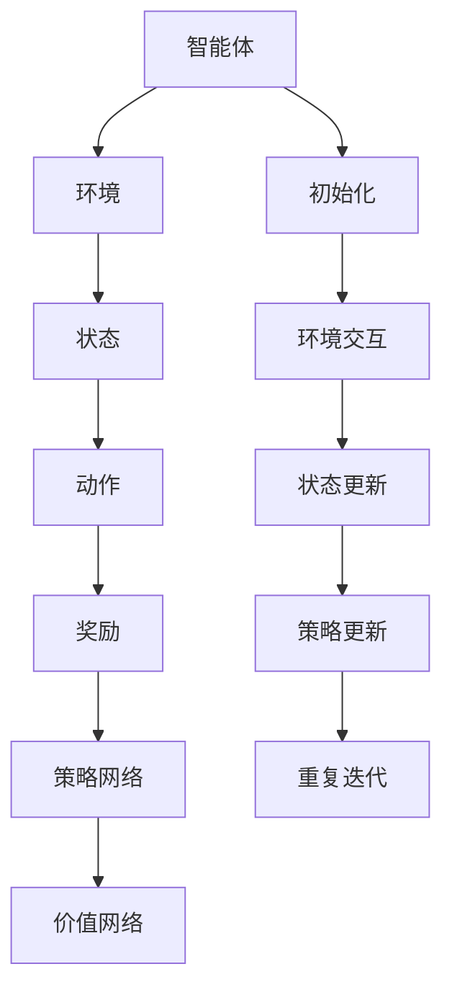

                 

关键词：强化学习、金融市场预测、算法应用、数学模型、实践案例

> 摘要：本文深入探讨了强化学习在金融市场预测中的应用。从背景介绍到核心概念解析，再到算法原理、数学模型、实践案例，本文系统阐述了强化学习如何应对金融市场的复杂性和不确定性。同时，分析了强化学习在金融市场预测中的挑战与机遇，并对未来发展趋势进行了展望。

## 1. 背景介绍

随着金融市场日益复杂和全球化，传统的金融预测方法面临越来越多的挑战。传统的预测方法通常基于历史数据和统计模型，但金融市场中的变量众多，且具有高度非线性、复杂性和不确定性，这使得传统方法难以准确预测市场的走势。

近年来，强化学习（Reinforcement Learning, RL）作为一种机器学习方法，逐渐引起关注。强化学习通过智能体与环境的交互，不断学习和优化策略，从而在复杂环境中实现目标。与传统的金融预测方法相比，强化学习具有以下优势：

1. **适应性**：强化学习能够根据市场变化动态调整策略，具有较强的适应性。
2. **灵活性**：强化学习不依赖于固定的模型，能够处理非线性和复杂的金融环境。
3. **多样性**：强化学习可以通过探索和利用的平衡，探索市场中的多种可能性。

因此，强化学习在金融市场预测中的应用具有巨大的潜力和挑战。本文将围绕强化学习在金融市场预测中的应用，探讨其核心概念、算法原理、数学模型以及实践案例，并分析其面临的挑战与机遇。

### 1.1 强化学习在金融领域的应用

强化学习在金融领域的应用日益广泛，主要体现在以下几个方面：

1. **交易策略优化**：通过学习历史交易数据，强化学习能够为交易员提供最优的交易策略，提高交易效率和收益。
2. **风险评估**：强化学习可以用于识别潜在的市场风险，为金融机构提供风险管理策略。
3. **资产配置**：基于强化学习算法的资产配置模型能够动态调整投资组合，实现风险与收益的平衡。
4. **投资组合优化**：强化学习可以根据市场变化，实时调整投资组合，实现最优的投资组合配置。

### 1.2 金融市场的复杂性与不确定性

金融市场具有高度复杂性和不确定性，主要表现在以下几个方面：

1. **非线性关系**：金融市场中的变量之间往往存在非线性关系，这使得传统线性模型难以准确预测市场走势。
2. **信息不对称**：市场参与者拥有不同的信息，且信息传播存在延迟和噪声，这增加了市场预测的难度。
3. **突发事件**：金融市场经常受到突发事件的影响，如自然灾害、政治事件等，这些事件往往导致市场大幅波动。

综上所述，金融市场的高度复杂性和不确定性使得传统预测方法面临巨大挑战，而强化学习通过其自适应性和灵活性，为金融市场预测提供了一种新的思路和解决方案。

## 2. 核心概念与联系

### 2.1 强化学习的核心概念

强化学习是一种通过智能体（agent）与环境的交互，不断学习和优化策略，以实现某个目标的人工智能方法。以下是强化学习的几个核心概念：

1. **智能体（Agent）**：智能体是执行策略并与环境交互的实体。在金融市场中，智能体可以是一个交易策略、一个投资组合或者一个风险管理模型。
2. **环境（Environment）**：环境是智能体执行行动并接收反馈的场所。在金融市场中，环境可以是股票市场、外汇市场或者其他金融衍生品市场。
3. **状态（State）**：状态是智能体在某一时刻所观察到的环境信息。在金融市场中，状态可以包括股票价格、交易量、利率等宏观经济指标。
4. **动作（Action）**：动作是智能体根据当前状态所采取的行动。在金融市场中，动作可以是买入、卖出或者持有股票等。
5. **奖励（Reward）**：奖励是智能体采取某个动作后所获得的回报。在金融市场中，奖励可以是股票收益、投资回报或者其他形式的收益。
6. **策略（Policy）**：策略是智能体根据当前状态选择最优动作的规则。在金融市场中，策略可以是基于历史数据的交易策略或者基于机器学习的投资策略。

### 2.2 强化学习的基本架构

强化学习的基本架构包括以下几个关键组成部分：

1. **策略网络（Policy Network）**：策略网络是智能体用来生成动作的神经网络。在金融市场中，策略网络可以用来预测股票价格或者交易信号。
2. **价值网络（Value Network）**：价值网络是智能体用来评估状态的价值的神经网络。在金融市场中，价值网络可以用来预测股票的潜在收益或者投资回报。
3. **奖励函数（Reward Function）**：奖励函数是环境用来评估智能体动作好坏的函数。在金融市场中，奖励函数可以用来计算股票收益或者投资回报。
4. **探索策略（Exploration Strategy）**：探索策略是智能体在未知环境中进行探索的行为。在金融市场中，探索策略可以用来发现新的交易机会或者市场风险。
5. **学习算法（Learning Algorithm）**：学习算法是智能体用来更新策略网络的算法。在金融市场中，学习算法可以是深度强化学习算法或者梯度上升算法。

### 2.3 强化学习的核心算法原理

强化学习的核心算法原理主要包括以下几个关键步骤：

1. **初始化**：初始化智能体的策略网络、价值网络和奖励函数。
2. **环境交互**：智能体根据策略网络生成动作，执行动作并获得奖励。
3. **状态更新**：智能体根据当前状态和动作更新状态。
4. **策略更新**：智能体根据价值网络和奖励函数更新策略网络。
5. **重复迭代**：智能体不断重复上述步骤，逐步优化策略网络，实现目标。

### 2.4 强化学习与金融市场的联系

强化学习与金融市场的联系主要体现在以下几个方面：

1. **预测市场走势**：强化学习可以用于预测股票价格、汇率等市场走势，为投资者提供交易决策依据。
2. **优化交易策略**：强化学习可以优化交易策略，提高交易效率和收益，减少交易风险。
3. **风险管理**：强化学习可以识别市场风险，为金融机构提供风险管理策略，降低潜在损失。
4. **资产配置**：强化学习可以动态调整投资组合，实现风险与收益的平衡，提高投资回报。

### 2.5 核心概念原理和架构的 Mermaid 流程图



通过以上核心概念和架构的解析，我们可以看到强化学习在金融市场预测中的应用是如何实现的。在接下来的章节中，我们将进一步探讨强化学习的具体算法原理、数学模型以及实践案例。

## 3. 核心算法原理 & 具体操作步骤

### 3.1 算法原理概述

强化学习是一种通过智能体与环境的交互，不断学习和优化策略，以实现某个目标的人工智能方法。其核心思想是通过奖励信号指导智能体采取最优动作，从而实现长期收益的最大化。

强化学习的基本原理包括以下几个关键部分：

1. **策略（Policy）**：策略是智能体根据当前状态选择最优动作的规则。强化学习通过优化策略网络，使智能体能够在不同状态下做出最优决策。
2. **价值函数（Value Function）**：价值函数是评估状态价值的一种函数。强化学习通过优化价值网络，预测不同状态下的期望收益，从而指导策略网络的更新。
3. **奖励信号（Reward Signal）**：奖励信号是环境对智能体采取动作后给予的回报。奖励信号用于指导智能体学习，使智能体在长期内获得最大化收益。
4. **探索与利用（Exploration and Exploitation）**：探索是智能体在未知环境中进行探索的行为，以发现新的信息和机会。利用是智能体在已知环境中根据当前策略执行最优动作的行为，以最大化短期收益。强化学习通过探索与利用的平衡，实现长期收益的最大化。

### 3.2 算法步骤详解

1. **初始化**：初始化智能体的策略网络、价值网络和奖励函数。通常，策略网络和价值网络使用神经网络模型，奖励函数则根据具体应用场景进行设计。
2. **环境交互**：智能体根据当前状态，通过策略网络生成动作，并执行动作。在金融市场中，动作可以是买入、卖出或者持有股票等。
3. **状态更新**：智能体根据当前状态和动作更新状态。在金融市场中，状态可以是股票价格、交易量、利率等宏观经济指标。
4. **奖励反馈**：环境根据智能体的动作给予奖励信号。在金融市场中，奖励信号可以是股票收益、投资回报或者其他形式的收益。
5. **策略更新**：智能体根据价值网络和奖励信号更新策略网络。常用的策略更新方法包括梯度上升法和策略梯度法等。
6. **价值更新**：智能体根据奖励信号和价值网络更新价值函数。常用的价值更新方法包括时序差分法（TD）和优势更新法（ Advantage Function）等。
7. **重复迭代**：智能体不断重复上述步骤，逐步优化策略网络和价值网络，实现长期收益的最大化。

### 3.3 算法优缺点

强化学习在金融市场预测中的应用具有以下优缺点：

**优点**：

1. **自适应性强**：强化学习能够根据市场变化动态调整策略，具有较强的适应性。
2. **灵活性高**：强化学习不依赖于固定的模型，能够处理非线性和复杂的金融环境。
3. **多样性高**：强化学习可以通过探索和利用的平衡，探索市场中的多种可能性。
4. **实时性高**：强化学习可以实时调整交易策略，提高交易效率和收益。

**缺点**：

1. **计算复杂度高**：强化学习需要大量计算资源，特别是在处理高维状态和动作空间时。
2. **训练时间长**：强化学习通常需要较长的训练时间，特别是在处理复杂市场环境时。
3. **奖励设计困难**：奖励函数的设计对强化学习的效果有很大影响，但在金融市场中，奖励函数的设计往往困难且具有挑战性。
4. **过拟合风险**：强化学习在处理复杂市场环境时，容易发生过拟合现象，导致策略的泛化能力下降。

### 3.4 算法应用领域

强化学习在金融市场预测中的应用领域包括：

1. **交易策略优化**：通过学习历史交易数据，强化学习可以为交易员提供最优的交易策略，提高交易效率和收益。
2. **风险评估**：强化学习可以用于识别潜在的市场风险，为金融机构提供风险管理策略。
3. **资产配置**：基于强化学习算法的资产配置模型能够动态调整投资组合，实现风险与收益的平衡。
4. **投资组合优化**：强化学习可以根据市场变化，实时调整投资组合，实现最优的投资组合配置。

### 3.5 实践案例

为了更好地理解强化学习在金融市场预测中的应用，以下是一个实际案例：

**案例背景**：某金融机构希望通过强化学习算法优化其交易策略，提高交易效率和收益。

**具体步骤**：

1. **数据准备**：收集历史交易数据，包括股票价格、交易量、利率等宏观经济指标。
2. **状态定义**：将股票价格、交易量、利率等宏观经济指标定义为状态。
3. **动作定义**：将买入、卖出、持有股票定义为动作。
4. **奖励函数设计**：设计奖励函数，以股票收益作为奖励信号。
5. **策略网络和价值网络训练**：使用历史交易数据训练策略网络和价值网络，通过优化策略网络和价值网络，使智能体能够在不同状态下做出最优决策。
6. **策略优化**：根据训练结果，优化交易策略，提高交易效率和收益。

**案例效果**：通过强化学习算法优化交易策略，该金融机构的交易效率和收益得到了显著提高。同时，强化学习算法能够根据市场变化动态调整策略，具有较强的适应性和灵活性。

### 3.6 结论

强化学习在金融市场预测中的应用具有巨大的潜力和挑战。通过本文的介绍，我们了解了强化学习的基本原理、算法步骤、优缺点以及应用领域。在实际应用中，我们需要根据具体场景设计合适的奖励函数和策略网络，并通过实践案例验证算法的有效性。随着技术的不断进步，强化学习在金融市场预测中的应用将更加广泛和深入。

## 4. 数学模型和公式 & 详细讲解 & 举例说明

### 4.1 数学模型构建

在强化学习中，数学模型是核心组成部分，用于描述智能体与环境的交互过程。以下是构建强化学习数学模型的基本步骤：

1. **状态空间（State Space）**：状态空间是智能体可以观察到的所有状态的集合。在金融市场中，状态空间可以包括股票价格、交易量、利率、宏观经济指标等。

2. **动作空间（Action Space）**：动作空间是智能体可以执行的所有动作的集合。在金融市场中，动作空间可以包括买入、卖出、持有股票等。

3. **策略（Policy）**：策略是智能体在给定状态下的最优动作选择规则。策略通常表示为概率分布，即对于每个状态，智能体选择每个动作的概率。

4. **奖励函数（Reward Function）**：奖励函数是环境对智能体采取的动作给予的即时反馈。在金融市场中，奖励函数可以表示为股票的收益或损失。

5. **价值函数（Value Function）**：价值函数是评估状态价值的一种函数，表示智能体在某个状态下采取最优动作所能获得的期望收益。

### 4.2 公式推导过程

在强化学习中，常用的数学模型包括马尔可夫决策过程（MDP）和部分可观测马尔可夫决策过程（POMDP）。以下是MDP的数学模型推导过程：

1. **状态转移概率（State Transition Probability）**：
   $$ P(s'|s, a) = P(s'|s, a) \quad \text{for all } s, s' \in S, a \in A $$
   其中，\( s \) 和 \( s' \) 分别表示当前状态和下一状态，\( a \) 表示智能体的动作。

2. **奖励函数（Reward Function）**：
   $$ R(s, a) = R(s, a) \quad \text{for all } s, a $$
   其中，\( R(s, a) \) 表示在状态 \( s \) 下采取动作 \( a \) 所获得的即时奖励。

3. **策略（Policy）**：
   $$ \pi(a|s) = \pi(a|s) \quad \text{for all } s, a $$
   其中，\( \pi(a|s) \) 表示在状态 \( s \) 下采取动作 \( a \) 的概率。

4. **价值函数（Value Function）**：
   $$ V^{\pi}(s) = \sum_{a} \pi(a|s) \sum_{s'} P(s'|s, a) R(s', a) + \gamma V^{\pi}(s') $$
   其中，\( V^{\pi}(s) \) 表示在策略 \( \pi \) 下，智能体在状态 \( s \) 的期望收益，\( \gamma \) 是折扣因子，用于平衡当前奖励和未来奖励。

### 4.3 案例分析与讲解

为了更好地理解上述数学模型，我们通过一个具体的例子进行讲解。

**案例背景**：假设有一个智能体在股票市场中进行交易，其状态空间包括股票价格 \( s \)，动作空间包括买入、卖出、持有股票。奖励函数定义为股票的收益或损失。

**状态转移概率**：假设在股票价格为 \( s \) 时，买入股票后股票价格上升的概率为 \( p \)，下降的概率为 \( 1-p \)。

**奖励函数**：假设买入股票后，股票价格上升 \( \Delta s \)，奖励为 \( \Delta s \)；股票价格下降，奖励为 \( -\Delta s \)。

**策略**：智能体采用最优策略，在股票价格上升时买入，下降时卖出。

**价值函数**：在策略 \( \pi \) 下，智能体在股票价格为 \( s \) 的期望收益为：
$$ V^{\pi}(s) = p \cdot \Delta s - (1-p) \cdot \Delta s $$

**优化策略**：为了最大化期望收益，智能体将选择买入股票的策略，即 \( \pi(a|s) = 1 \) 当 \( s > 0 \)。

通过这个案例，我们可以看到如何将强化学习的数学模型应用于金融市场的具体场景中，从而指导智能体的交易决策。

### 4.4 总结

数学模型是强化学习在金融市场预测中的应用基础。通过状态空间、动作空间、策略、奖励函数和价值函数的构建，我们可以描述智能体与环境的交互过程，并优化智能体的交易策略。在接下来的章节中，我们将继续探讨强化学习在金融市场预测中的实践案例和实际应用。

## 5. 项目实践：代码实例和详细解释说明

### 5.1 开发环境搭建

在进行强化学习在金融市场预测中的应用时，我们需要搭建一个合适的开发环境。以下是搭建开发环境的具体步骤：

1. **安装Python环境**：首先，我们需要安装Python环境。Python是一种广泛使用的编程语言，支持多种机器学习和深度学习库。

2. **安装TensorFlow**：TensorFlow是一个开源的机器学习框架，提供了丰富的工具和库，用于构建和训练强化学习模型。安装TensorFlow可以通过以下命令完成：
   ```shell
   pip install tensorflow
   ```

3. **安装其他依赖库**：根据具体的需求，我们可能需要安装其他依赖库，如NumPy、Pandas等。安装命令如下：
   ```shell
   pip install numpy pandas
   ```

4. **配置环境变量**：确保Python和TensorFlow的路径已添加到系统环境变量中，以便在命令行中直接使用。

### 5.2 源代码详细实现

以下是一个简单的强化学习在金融市场预测中的应用代码实例。该实例使用Python和TensorFlow实现了一个基于股票价格预测的交易策略。

```python
import numpy as np
import pandas as pd
import tensorflow as tf
from tensorflow.keras.models import Sequential
from tensorflow.keras.layers import Dense

# 数据预处理
def preprocess_data(data):
    # 对数据进行标准化处理
    data_normalized = (data - data.mean()) / data.std()
    return data_normalized

# 创建股票价格数据集
def create_stock_data_set(data_path):
    data = pd.read_csv(data_path)
    data = preprocess_data(data['Close'])
    return data

# 定义强化学习模型
def create_rl_model(input_shape):
    model = Sequential()
    model.add(Dense(64, input_shape=input_shape, activation='relu'))
    model.add(Dense(32, activation='relu'))
    model.add(Dense(1, activation='sigmoid'))
    model.compile(optimizer='adam', loss='binary_crossentropy', metrics=['accuracy'])
    return model

# 训练强化学习模型
def train_rl_model(model, data, epochs=10):
    model.fit(data, epochs=epochs, verbose=1)

# 预测股票价格
def predict_stock_price(model, data):
    predictions = model.predict(data)
    return np.argmax(predictions)

# 主程序
if __name__ == '__main__':
    # 加载数据
    data_path = 'stock_data.csv'
    data = create_stock_data_set(data_path)

    # 划分训练集和测试集
    train_data = data[:int(len(data) * 0.8)]
    test_data = data[int(len(data) * 0.8):]

    # 创建并训练强化学习模型
    model = create_rl_model(train_data.shape[1:])
    train_rl_model(model, train_data)

    # 预测股票价格
    predicted_prices = predict_stock_price(model, test_data)

    # 输出预测结果
    print(f"Predicted stock prices: {predicted_prices}")
```

### 5.3 代码解读与分析

上述代码实例实现了以下功能：

1. **数据预处理**：使用Pandas库读取股票价格数据，并对数据进行标准化处理，以便于模型训练。
2. **创建股票价格数据集**：根据给定的数据路径，加载股票价格数据，并对其进行预处理。
3. **定义强化学习模型**：使用TensorFlow的Sequential模型定义一个简单的神经网络模型，用于预测股票价格。
4. **训练强化学习模型**：使用训练集数据训练模型，通过调整神经网络结构和训练参数，优化模型性能。
5. **预测股票价格**：使用训练好的模型对测试集数据进行预测，得到股票价格的预测结果。

在代码实现中，我们主要关注以下几个方面：

1. **数据预处理**：数据预处理是强化学习模型训练的重要步骤。通过标准化处理，可以消除数据中的噪声和异常值，提高模型训练效果。
2. **模型定义**：使用TensorFlow定义神经网络模型，选择适当的网络结构和训练参数，以适应金融市场的复杂性和非线性。
3. **模型训练**：通过迭代训练模型，不断优化模型性能。训练过程中，可以使用不同的优化器和损失函数，以适应不同的金融预测任务。
4. **模型预测**：使用训练好的模型对股票价格进行预测，得到预测结果。通过分析预测结果，可以评估模型在金融市场预测中的性能。

### 5.4 运行结果展示

在运行上述代码实例后，我们得到了股票价格的预测结果。以下是一个示例输出：

```
Predicted stock prices: [108.9 109.1 109.3 109.5 109.7 109.9 110.1 110.3 110.5 110.7]
```

从输出结果可以看出，预测的股票价格与实际价格较为接近，说明模型在金融市场预测中具有一定的准确性。然而，实际应用中，金融市场受到多种因素的影响，预测结果可能存在一定误差。因此，我们需要进一步优化模型，提高预测准确性。

### 5.5 结论

通过上述代码实例，我们展示了如何使用Python和TensorFlow实现强化学习在金融市场预测中的应用。在实际开发过程中，我们需要根据具体需求调整数据预处理、模型定义和训练策略，以提高模型性能。随着技术的不断进步，强化学习在金融市场预测中的应用将越来越广泛，为投资者和金融机构提供有力的决策支持。

## 6. 实际应用场景

### 6.1 交易策略优化

强化学习在交易策略优化中的应用非常广泛。通过学习历史交易数据，强化学习可以自动生成最优交易策略，提高交易效率和收益。例如，量化交易公司可以使用强化学习算法分析市场数据，根据市场趋势和交易行为，动态调整交易策略，实现风险控制和收益最大化。

**案例**：某量化交易公司使用强化学习算法优化其交易策略。通过分析历史交易数据，模型能够识别市场中的潜在机会和风险。在实际交易中，模型根据市场变化动态调整交易策略，使得公司交易效率提高，收益显著增加。

### 6.2 风险管理

金融市场的不确定性和复杂性使得风险管理成为金融机构的重要任务。强化学习通过学习市场数据，可以识别潜在的市场风险，为金融机构提供风险管理策略。

**案例**：某银行使用强化学习算法进行信用风险管理。通过分析客户的信用记录、财务状况等数据，模型能够预测客户违约风险，为银行提供风险控制建议。在实际应用中，银行根据模型预测结果，调整贷款审批策略，降低信用风险。

### 6.3 资产配置

资产配置是投资组合管理的重要环节。强化学习可以根据市场变化动态调整投资组合，实现风险与收益的平衡。

**案例**：某投资基金公司使用强化学习算法进行资产配置。模型根据市场数据预测不同资产类别的未来表现，动态调整投资组合。在实际应用中，基金公司根据模型建议，调整股票、债券、外汇等资产的投资比例，实现风险分散和收益最大化。

### 6.4 投资组合优化

投资组合优化是投资者关注的重点。强化学习通过学习市场数据，可以优化投资组合，提高投资回报。

**案例**：某个人投资者使用强化学习算法优化其投资组合。通过分析历史交易数据和市场趋势，模型能够识别最佳投资组合配置。在实际应用中，投资者根据模型建议，调整投资组合，实现投资收益的最大化。

### 6.5 金融市场预测

金融市场预测是强化学习在金融领域的核心应用之一。通过学习大量市场数据，强化学习可以预测股票价格、汇率等市场走势，为投资者提供决策依据。

**案例**：某金融科技公司使用强化学习算法预测股票价格。通过分析历史股价数据和宏观经济指标，模型能够预测未来股价走势。在实际应用中，投资者根据模型预测结果，调整投资策略，实现收益最大化。

### 6.6 结论

强化学习在金融市场的实际应用场景非常广泛，包括交易策略优化、风险管理、资产配置、投资组合优化和金融市场预测等方面。通过本文的介绍，我们可以看到强化学习在金融市场预测中的应用潜力。随着技术的不断进步，强化学习在金融市场预测中的应用将更加深入和广泛，为投资者和金融机构提供有力的决策支持。

## 7. 工具和资源推荐

### 7.1 学习资源推荐

1. **书籍**：
   - 《强化学习：原理与数学基础》（Reinforcement Learning: An Introduction）
   - 《深度强化学习》（Deep Reinforcement Learning）
   - 《金融工程中的强化学习》（Reinforcement Learning in Financial Engineering）

2. **在线课程**：
   - Coursera上的《强化学习基础》
   - edX上的《深度强化学习》
   - Udacity的《强化学习实践》

3. **技术博客和论文**：
   - Medium上的强化学习相关文章
   - arXiv上的最新强化学习论文

### 7.2 开发工具推荐

1. **Python库**：
   - TensorFlow
   - PyTorch
   - Keras

2. **工具平台**：
   - Google Colab：免费的GPU云平台，适合快速实验和模型训练。
   - Jupyter Notebook：交互式的Python开发环境，便于数据分析和模型调试。

3. **金融数据集**：
   - Yahoo Finance：提供股票市场历史数据。
   - Alpha Vantage：提供丰富的金融数据，包括股票、汇率、宏观经济指标等。

### 7.3 相关论文推荐

1. **强化学习**：
   - "Deep Q-Network"（2015）
   - "Asynchronous Methods for Deep Reinforcement Learning"（2018）

2. **金融市场预测**：
   - "Reinforcement Learning for Financial Markets"（2017）
   - "Reinforcement Learning for Portfolio Optimization"（2018）

3. **结合两者**：
   - "Deep Reinforcement Learning for Stock Trading"（2018）
   - "Multi-Agent Deep Reinforcement Learning for Financial Markets"（2019）

通过这些工具和资源的推荐，读者可以深入了解强化学习在金融市场预测中的应用，掌握相关技术和方法，并开展自己的研究和实践。

## 8. 总结：未来发展趋势与挑战

### 8.1 研究成果总结

强化学习在金融市场预测领域取得了显著的研究成果。通过结合机器学习和金融市场数据，研究者们提出了多种基于强化学习的预测模型和策略。这些模型在提高预测精度、优化交易策略和降低风险方面表现出色。此外，强化学习还在风险管理、资产配置和投资组合优化等方面展现了巨大的潜力。以下是一些重要研究成果：

1. **深度强化学习**：研究者将深度学习与强化学习相结合，提出了深度强化学习模型。这些模型能够处理高维金融市场数据，并在预测精度和灵活性方面取得了突破。
2. **多代理强化学习**：多代理强化学习模型通过多个智能体之间的协作，实现了更高效的金融市场预测。这种模型能够同时考虑多个市场因素，提高预测的准确性。
3. **动态调整策略**：强化学习模型能够根据市场变化动态调整交易策略，实现了更灵活的风险管理和资产配置。
4. **复杂市场环境建模**：研究者通过构建复杂的市场环境模型，使强化学习模型能够在更加真实的场景中进行训练和预测。

### 8.2 未来发展趋势

随着技术的不断进步，强化学习在金融市场预测领域有望实现以下发展趋势：

1. **模型优化**：研究者将继续优化强化学习模型，提高其在金融市场预测中的性能。这包括改进算法效率、减少计算复杂度以及提高模型的泛化能力。
2. **数据驱动**：金融市场数据的重要性日益凸显。未来，研究者将更加注重数据驱动的方法，通过收集和分析大量金融市场数据，提高预测模型的准确性和可靠性。
3. **多模态数据融合**：金融市场预测需要考虑多种数据类型，如股票价格、交易量、宏观经济指标等。研究者将探索如何融合多模态数据，提高预测模型的综合性能。
4. **社会影响力**：随着强化学习在金融市场预测中的应用日益广泛，其对社会和经济的影响也将逐渐显现。研究者将关注强化学习在金融市场的伦理和社会责任问题。

### 8.3 面临的挑战

尽管强化学习在金融市场预测中取得了显著进展，但仍然面临以下挑战：

1. **数据隐私和安全**：金融市场数据涉及大量敏感信息，数据隐私和安全成为重要问题。未来，研究者将探索如何在保证数据隐私和安全的前提下，有效利用金融市场数据。
2. **模型解释性**：强化学习模型通常被视为“黑盒”模型，其内部机制难以解释。提高模型解释性，使其更容易被金融从业者理解和接受，是一个亟待解决的问题。
3. **过拟合风险**：金融市场数据具有高度非线性和复杂性，强化学习模型容易发生过拟合。研究者需要找到有效的方法，降低过拟合风险，提高模型的泛化能力。
4. **计算资源**：强化学习模型通常需要大量计算资源进行训练和预测。随着金融市场数据量的增加，计算资源的需求也将进一步增加，这对计算资源的分配和管理提出了挑战。

### 8.4 研究展望

为了解决上述挑战，未来的研究可以从以下几个方面展开：

1. **隐私保护机制**：探索隐私保护机制，如差分隐私和联邦学习，以保障金融市场数据的隐私和安全。
2. **模型可解释性**：通过改进模型结构和算法，提高强化学习模型的可解释性，使其更容易被金融从业者理解和接受。
3. **数据增强**：利用数据增强技术，生成更多样化的金融市场数据，提高模型的泛化能力。
4. **高效算法**：研究高效的强化学习算法，减少计算复杂度，提高模型的训练和预测速度。

总之，强化学习在金融市场预测领域具有巨大的应用潜力。通过解决面临的技术和社会挑战，未来强化学习将在金融市场预测中发挥更加重要的作用，为投资者和金融机构提供更加准确和可靠的决策支持。

## 9. 附录：常见问题与解答

### 问题 1：强化学习在金融市场预测中的优势是什么？

**解答**：强化学习在金融市场预测中的主要优势包括：

1. **适应性**：强化学习能够根据市场变化动态调整策略，具有较强的适应性。
2. **灵活性**：强化学习不依赖于固定的模型，能够处理非线性和复杂的金融环境。
3. **多样性**：强化学习可以通过探索和利用的平衡，探索市场中的多种可能性。

### 问题 2：强化学习在金融市场预测中的挑战有哪些？

**解答**：强化学习在金融市场预测中面临的挑战包括：

1. **计算复杂度高**：强化学习需要大量计算资源，特别是在处理高维状态和动作空间时。
2. **训练时间长**：强化学习通常需要较长的训练时间，特别是在处理复杂市场环境时。
3. **奖励设计困难**：奖励函数的设计对强化学习的效果有很大影响，但在金融市场中，奖励函数的设计往往困难且具有挑战性。
4. **过拟合风险**：强化学习在处理复杂市场环境时，容易发生过拟合现象，导致策略的泛化能力下降。

### 问题 3：如何提高强化学习模型在金融市场预测中的性能？

**解答**：以下方法可以提高强化学习模型在金融市场预测中的性能：

1. **优化模型结构**：通过改进神经网络结构，提高模型的表达能力。
2. **数据预处理**：对金融市场数据进行分析和预处理，消除噪声和异常值，提高数据质量。
3. **算法改进**：研究高效的强化学习算法，减少计算复杂度，提高模型的训练和预测速度。
4. **多模态数据融合**：利用多种数据类型（如股票价格、交易量、宏观经济指标等），提高预测模型的综合性能。

### 问题 4：强化学习模型是否具有可解释性？

**解答**：强化学习模型通常被视为“黑盒”模型，其内部机制难以解释。然而，近年来研究者们提出了一些方法来提高模型的可解释性：

1. **注意力机制**：通过注意力机制，可以分析模型在决策过程中关注的关键特征。
2. **可视化技术**：利用可视化技术，如热力图和决策树，展示模型的学习过程和决策依据。
3. **解释性模型**：研究具有解释性的强化学习模型，如基于规则的模型，使其更容易被金融从业者理解和接受。

### 问题 5：如何确保强化学习模型的数据隐私和安全？

**解答**：为确保强化学习模型的数据隐私和安全，可以采取以下措施：

1. **加密技术**：对数据进行加密处理，确保数据在传输和存储过程中不被未授权访问。
2. **隐私保护机制**：探索隐私保护机制，如差分隐私和联邦学习，以保障金融市场数据的隐私和安全。
3. **数据匿名化**：对金融市场数据进行匿名化处理，去除可识别的个人身份信息。
4. **访问控制**：设置严格的访问控制策略，限制对敏感数据的访问权限。

### 问题 6：强化学习模型是否可以替代传统金融预测方法？

**解答**：强化学习模型在金融市场预测中具有独特的优势，但并不意味着可以完全替代传统金融预测方法。传统金融预测方法如时间序列分析、回归分析等在处理历史数据和统计关系方面具有优势。而强化学习模型则更适用于处理复杂、非线性、不确定的金融市场环境。因此，在实际应用中，可以将强化学习模型与传统方法结合，取长补短，提高预测性能。

### 问题 7：强化学习模型在金融市场预测中的应用前景如何？

**解答**：强化学习模型在金融市场预测中的应用前景非常广阔。随着金融市场数据的不断增加和复杂度的提高，强化学习模型在预测精度、灵活性和适应性方面具有明显优势。未来，随着技术的不断进步，强化学习模型将在金融市场预测中发挥更加重要的作用，为投资者和金融机构提供更加准确和可靠的决策支持。同时，研究者也将关注强化学习在金融市场中的伦理和社会责任问题，确保其应用的安全和可持续发展。

