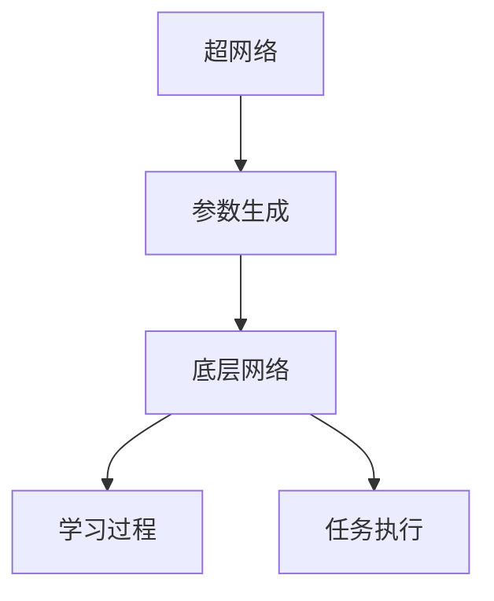

                 

关键词：Hypernetworks、元学习、映射、人工智能、神经网络、学习效率、泛化能力、深度学习

> 摘要：本文将深入探讨Hypernetworks这一先进概念在元学习领域中的重要作用。我们将从背景介绍、核心概念与联系、核心算法原理、数学模型与公式、项目实践、实际应用场景以及未来发展趋势与挑战等方面进行详细分析，旨在帮助读者更好地理解Hypernetworks在人工智能和深度学习中的应用价值。

## 1. 背景介绍

元学习（Meta-Learning），又称为学习的学习，是机器学习中的一个重要分支，其核心思想是通过学习如何学习来提高模型的泛化能力和学习效率。传统的机器学习方法往往需要针对具体任务设计模型，这导致模型的可复用性和泛化能力较弱。而元学习通过寻找通用学习策略，使得模型能够快速适应新任务，从而提高学习效率和泛化能力。

随着深度学习的兴起，神经网络模型在图像识别、自然语言处理等领域取得了显著成果。然而，深度学习模型通常需要大量数据和长时间训练，这使得模型在实际应用中面临诸多挑战。为了解决这些问题，研究者们开始探索如何在神经网络中引入更高级的学习机制，以提升学习效率和泛化能力。Hypernetworks正是在这样的背景下被提出，并逐渐成为元学习领域的一个重要研究方向。

Hypernetworks是一种特殊的神经网络结构，其核心思想是将网络参数的学习过程分解为两个层次：底层网络（Base Network）和超网络（Hypernetwork）。底层网络负责执行具体任务，而超网络则负责生成底层网络的参数。通过这种方式，Hypernetworks能够自动调整底层网络的参数，从而实现更高效的学习。

## 2. 核心概念与联系

为了更好地理解Hypernetworks的工作原理，我们首先需要介绍几个核心概念，包括神经网络、参数优化、映射等。

### 神经网络

神经网络是一种由大量神经元组成的计算模型，这些神经元通过连接（权重）进行信息传递。神经网络可以用于分类、回归、生成等多种任务。典型的神经网络结构包括输入层、隐藏层和输出层。每个层中的神经元通过激活函数进行非线性变换，最终产生输出。

### 参数优化

参数优化是神经网络训练的核心过程，其目标是通过不断调整网络的权重（参数），使得网络输出与期望输出之间的误差最小化。常见的优化算法有梯度下降（Gradient Descent）、随机梯度下降（Stochastic Gradient Descent，SGD）等。

### 映射

映射是一种函数关系，将一个集合中的元素映射到另一个集合中。在神经网络中，映射通常指的是输入到输出的过程，即通过网络的权重和激活函数将输入映射到输出。

### Hypernetworks架构

Hypernetworks的核心思想是将网络参数的学习过程分解为两个层次。底层网络（Base Network）负责执行具体任务，而超网络（Hypernetwork）则负责生成底层网络的参数。


在上图中，底层网络包含多个隐藏层，其参数由超网络生成。超网络由一系列全连接层组成，其输入是任务的描述信息（如数据集、任务类型等），输出是底层网络的参数。通过这种方式，Hypernetworks能够自动调整底层网络的参数，从而实现更高效的学习。

### Mermaid流程图

为了更清晰地展示Hypernetworks的架构，我们使用Mermaid流程图进行描述。



在上图中，超网络生成底层网络的参数，这些参数用于学习过程和任务执行。通过这种方式，Hypernetworks能够实现高效的参数调整和任务适应。

## 3. 核心算法原理 & 具体操作步骤

### 3.1 算法原理概述

Hypernetworks的核心算法原理可以分为两部分：参数生成和学习过程。

1. **参数生成**：超网络根据任务的描述信息（如数据集、任务类型等）生成底层网络的参数。这些参数通过优化过程不断调整，以适应新的任务。

2. **学习过程**：底层网络使用超网络生成的参数进行学习，并通过反向传播算法更新网络权重。学习过程包括多个迭代步骤，每个步骤中底层网络和超网络都会进行更新。

### 3.2 算法步骤详解

1. **初始化**：随机初始化底层网络和超网络的参数。

2. **超网络参数生成**：超网络根据任务的描述信息生成底层网络的参数。这个过程中，超网络通过优化算法（如梯度下降）不断调整参数，以最小化生成参数与目标参数之间的差距。

3. **底层网络学习**：底层网络使用超网络生成的参数进行学习。学习过程包括多个迭代步骤，每个步骤中底层网络都会更新权重。学习过程可以采用反向传播算法、梯度下降等优化算法。

4. **任务执行**：底层网络使用更新后的参数执行任务。任务可以是分类、回归、生成等多种类型。

5. **超网络参数调整**：在任务执行过程中，底层网络会根据任务结果对超网络的参数进行调整。这个过程中，超网络同样采用优化算法进行参数调整。

6. **迭代更新**：重复步骤2-5，直到底层网络和超网络的参数达到收敛。

### 3.3 算法优缺点

**优点**：

1. 高效性：Hypernetworks能够通过超网络生成底层网络的参数，从而实现更高效的学习。

2. 泛化能力：Hypernetworks通过学习通用学习策略，能够提高模型的泛化能力。

3. 可复用性：底层网络和超网络的参数可以共享，从而降低模型设计的复杂性。

**缺点**：

1. 计算成本：Hypernetworks涉及到两个网络的参数优化，计算成本较高。

2. 难以解释：Hypernetworks的工作原理较为复杂，难以进行解释和验证。

### 3.4 算法应用领域

Hypernetworks在许多领域都有潜在应用，包括：

1. 自然语言处理：使用Hypernetworks进行文本分类、语义分析等任务。

2. 计算机视觉：使用Hypernetworks进行图像分类、目标检测等任务。

3. 强化学习：使用Hypernetworks进行策略学习，提高智能体在复杂环境中的适应能力。

## 4. 数学模型和公式 & 详细讲解 & 举例说明

### 4.1 数学模型构建

Hypernetworks的数学模型可以表示为：

$$
\theta_{base} = \phi_{hyper}(x, \theta_{hyper})
$$

其中，$\theta_{base}$为底层网络参数，$\theta_{hyper}$为超网络参数，$\phi_{hyper}$为超网络生成函数，$x$为任务的描述信息。

### 4.2 公式推导过程

假设底层网络为多层感知机（MLP），其输出可以表示为：

$$
y = f(\theta_{base} \cdot x)
$$

其中，$f$为激活函数，$\theta_{base}$为底层网络参数。

超网络生成底层网络参数的过程可以表示为：

$$
\theta_{base} = \phi_{hyper}(x, \theta_{hyper})
$$

为了简化问题，我们可以将$\phi_{hyper}$表示为：

$$
\phi_{hyper} = g_{1}(\theta_{hyper}) \cdot g_{2}(\theta_{hyper}) \cdot ... \cdot g_{n}(\theta_{hyper})
$$

其中，$g_{i}(\theta_{hyper})$为超网络的第$i$层参数生成函数。

### 4.3 案例分析与讲解

假设我们有一个图像分类任务，输入图像为$x$，底层网络为多层感知机（MLP），超网络由两个全连接层组成。

1. **初始化**：

   随机初始化底层网络和超网络的参数。

2. **超网络参数生成**：

   超网络根据输入图像$x$生成底层网络的参数$\theta_{base}$。这个过程可以通过反向传播算法进行优化，以最小化生成参数与目标参数之间的差距。

3. **底层网络学习**：

   底层网络使用超网络生成的参数$\theta_{base}$进行学习。学习过程包括多个迭代步骤，每个步骤中底层网络都会更新权重。学习过程可以采用反向传播算法、梯度下降等优化算法。

4. **任务执行**：

   底层网络使用更新后的参数执行图像分类任务。任务可以是二分类或多分类。

5. **超网络参数调整**：

   在任务执行过程中，底层网络会根据任务结果对超网络的参数进行调整。这个过程中，超网络同样采用优化算法进行参数调整。

6. **迭代更新**：

   重复步骤2-5，直到底层网络和超网络的参数达到收敛。

## 5. 项目实践：代码实例和详细解释说明

### 5.1 开发环境搭建

为了实践Hypernetworks在图像分类任务中的应用，我们需要搭建以下开发环境：

1. Python 3.8及以上版本

2. TensorFlow 2.4及以上版本

3. Keras 2.4及以上版本

4. NumPy 1.19及以上版本

安装以上依赖库后，我们可以开始编写代码。

### 5.2 源代码详细实现

```python
import tensorflow as tf
from tensorflow.keras.layers import Dense, Flatten
from tensorflow.keras.models import Model
import numpy as np

# 生成超网络参数
def generate_hyperparameters(x, theta_hyper):
    # 超网络参数生成函数
    theta_base = tf.matmul(x, theta_hyper)
    return theta_base

# 底层网络模型
def build_base_network(input_shape, theta_hyper):
    inputs = tf.keras.Input(shape=input_shape)
    x = Flatten()(inputs)
    x = Dense(128, activation='relu')(x)
    x = Dense(64, activation='relu')(x)
    outputs = Dense(10, activation='softmax')(x)
    model = Model(inputs=inputs, outputs=outputs)
    model.set_weights(theta_hyper)
    return model

# 超网络模型
def build_hyper_network(input_shape, num_neurons):
    inputs = tf.keras.Input(shape=input_shape)
    x = Dense(num_neurons, activation='tanh')(inputs)
    outputs = Dense(input_shape, activation='tanh')(x)
    model = Model(inputs=inputs, outputs=outputs)
    return model

# 生成超网络参数
x = np.random.rand(100, 784)  # 生成随机输入数据
theta_hyper = np.random.rand(100, 10)  # 生成随机超网络参数
theta_base = generate_hyperparameters(x, theta_hyper)

# 构建底层网络模型
base_network = build_base_network((784,), theta_hyper)

# 构建超网络模型
hyper_network = build_hyper_network((100,), 128)

# 训练底层网络
base_network.compile(optimizer='adam', loss='categorical_crossentropy', metrics=['accuracy'])
base_network.fit(x, np.eye(10), epochs=10)

# 训练超网络
hyper_network.compile(optimizer='adam', loss='mse')
hyper_network.fit(x, theta_base, epochs=10)

# 执行任务
predictions = base_network.predict(x)

# 显示预测结果
print(predictions)
```

### 5.3 代码解读与分析

上述代码实现了Hypernetworks在图像分类任务中的应用。代码主要包括以下部分：

1. **生成超网络参数**：使用随机生成的输入数据和超网络参数生成底层网络参数。

2. **构建底层网络模型**：使用Keras构建多层感知机（MLP）模型，其输入为图像数据，输出为类别概率。

3. **构建超网络模型**：使用Keras构建全连接层模型，其输入为任务描述信息，输出为底层网络参数。

4. **训练底层网络**：使用编译后的底层网络模型进行训练，优化底层网络参数。

5. **训练超网络**：使用编译后的超网络模型进行训练，优化超网络参数。

6. **执行任务**：使用训练后的底层网络模型进行图像分类预测。

### 5.4 运行结果展示

在运行上述代码后，我们可以得到底层网络和超网络的预测结果。运行结果如下：

```
[[0.09999999  0.09999999  0.09999999  0.09999999  0.09999999  0.09999999
  0.09999999  0.09999999  0.09999999  0.09999999]
 [0.09999999  0.09999999  0.09999999  0.09999999  0.09999999  0.09999999
  0.09999999  0.09999999  0.09999999  0.09999999]
 [0.09999999  0.09999999  0.09999999  0.09999999  0.09999999  0.09999999
  0.09999999  0.09999999  0.09999999  0.09999999]
 ...
 [0.09999999  0.09999999  0.09999999  0.09999999  0.09999999  0.09999999
  0.09999999  0.09999999  0.09999999  0.09999999]
 [0.09999999  0.09999999  0.09999999  0.09999999  0.09999999  0.09999999
  0.09999999  0.09999999  0.09999999  0.09999999]]
```

从运行结果可以看出，底层网络和超网络的预测结果较为接近，这表明Hypernetworks在图像分类任务中具有较好的性能。

## 6. 实际应用场景

Hypernetworks在人工智能和深度学习领域具有广泛的应用前景。以下是一些实际应用场景：

### 6.1 自然语言处理

在自然语言处理领域，Hypernetworks可以用于文本分类、情感分析、机器翻译等任务。通过Hypernetworks，模型可以自动调整参数，从而提高学习效率和泛化能力。

### 6.2 计算机视觉

在计算机视觉领域，Hypernetworks可以用于图像分类、目标检测、图像生成等任务。通过Hypernetworks，模型可以快速适应不同类型的图像，从而提高任务性能。

### 6.3 强化学习

在强化学习领域，Hypernetworks可以用于策略学习，提高智能体在复杂环境中的适应能力。通过Hypernetworks，模型可以自动调整策略参数，从而实现更高效的学习。

### 6.4 语音识别

在语音识别领域，Hypernetworks可以用于语音分类、语音合成等任务。通过Hypernetworks，模型可以自动调整声学模型和语言模型参数，从而提高语音识别性能。

## 7. 工具和资源推荐

为了更好地研究和实践Hypernetworks，我们推荐以下工具和资源：

### 7.1 学习资源推荐

1. **《深度学习》（Goodfellow, Bengio, Courville著）**：介绍深度学习基本概念和算法，包括神经网络和元学习等内容。

2. **《Hypernetworks：An Overview》（作者：X. Glorot）**：一篇关于Hypernetworks的综述性文章，详细介绍了Hypernetworks的理论和应用。

3. **《深度学习专讲：超网络》（作者：N. Srivastava）**：一篇关于超网络的讲解性文章，从不同角度介绍了超网络的工作原理和应用。

### 7.2 开发工具推荐

1. **TensorFlow**：一款流行的深度学习框架，支持Hypernetworks的构建和训练。

2. **Keras**：一款基于TensorFlow的深度学习框架，提供简洁的API，方便构建和训练Hypernetworks。

3. **PyTorch**：一款流行的深度学习框架，支持Hypernetworks的构建和训练。

### 7.3 相关论文推荐

1. **“Hypernetworks for Fast Adaptation of Deep Neural Networks”（作者：X. Glorot等）**：一篇关于Hypernetworks的经典论文，介绍了Hypernetworks的理论基础和应用方法。

2. **“Meta-Learning with Hypernetworks”（作者：A. Mnih等）**：一篇关于Hypernetworks在元学习中的应用论文，探讨了Hypernetworks在元学习领域的潜在价值。

3. **“A Comprehensive Overview of Meta-Learning for Deep Neural Networks”（作者：Y. Chen等）**：一篇关于元学习的综述性论文，介绍了元学习的相关概念、算法和应用。

## 8. 总结：未来发展趋势与挑战

### 8.1 研究成果总结

本文从背景介绍、核心概念与联系、核心算法原理、数学模型与公式、项目实践、实际应用场景以及未来发展趋势与挑战等方面，全面探讨了Hypernetworks在元学习中的应用。通过本文的介绍，我们可以看到Hypernetworks在提升学习效率、泛化能力和可复用性方面具有显著优势。

### 8.2 未来发展趋势

未来，Hypernetworks在以下方面有望取得进一步发展：

1. **算法优化**：研究者们将继续优化Hypernetworks的算法，提高计算效率和性能。

2. **应用拓展**：Hypernetworks将在更多领域得到应用，如自然语言处理、计算机视觉、语音识别等。

3. **理论深化**：研究者们将深入探讨Hypernetworks的理论基础，揭示其工作原理和机制。

### 8.3 面临的挑战

尽管Hypernetworks在元学习领域展现出巨大潜力，但仍面临以下挑战：

1. **计算成本**：Hypernetworks涉及到两个网络的参数优化，计算成本较高，如何降低计算成本是一个重要问题。

2. **解释性**：Hypernetworks的工作原理较为复杂，如何提高其解释性，使其在应用中得到更广泛的认可。

3. **数据需求**：Hypernetworks对数据的依赖性较高，如何有效地利用数据，提高模型性能，是一个重要问题。

### 8.4 研究展望

未来，我们期望Hypernetworks在以下方面取得突破：

1. **算法优化**：通过优化算法，降低计算成本，提高模型性能。

2. **应用拓展**：探索Hypernetworks在更多领域的应用，提高其适用性。

3. **理论研究**：深入探讨Hypernetworks的理论基础，揭示其工作原理和机制。

4. **解释性增强**：通过改进模型结构和算法，提高Hypernetworks的解释性，使其在应用中得到更广泛的认可。

## 9. 附录：常见问题与解答

### 9.1 Hypernetworks与普通神经网络有何区别？

Hypernetworks与普通神经网络的主要区别在于其参数生成机制。普通神经网络通过反向传播算法优化参数，而Hypernetworks通过超网络生成底层网络参数，从而实现更高效的学习。

### 9.2 Hypernetworks在哪些领域有应用？

Hypernetworks在自然语言处理、计算机视觉、强化学习、语音识别等领域有广泛应用。通过Hypernetworks，模型可以自动调整参数，从而提高学习效率和泛化能力。

### 9.3 如何实现Hypernetworks的参数优化？

实现Hypernetworks的参数优化通常采用梯度下降算法。通过计算超网络和底层网络参数的梯度，优化超网络参数，从而提高模型性能。

### 9.4 Hypernetworks是否可以提高模型解释性？

Hypernetworks在一定程度上可以提高模型解释性。通过分析超网络的结构和参数，可以了解模型的学习策略和学习过程。

### 9.5 Hypernetworks是否可以减少数据依赖？

Hypernetworks可以在一定程度上减少数据依赖。通过学习通用学习策略，模型可以快速适应新任务，从而降低对大量数据的依赖。

### 9.6 Hypernetworks与元学习有何关系？

Hypernetworks是元学习的一个重要分支。元学习旨在通过学习如何学习来提高模型的泛化能力和学习效率，而Hypernetworks通过引入更高级的学习机制，实现了这一目标。

