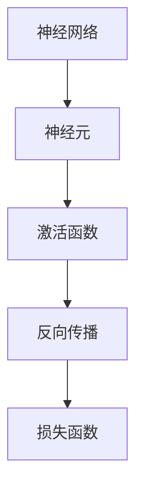

                 

 > 关键词：深度学习，神经网络，模型构建，数据预处理，训练与评估，应用场景

> 摘要：本文将介绍如何构建深度学习模型，从背景介绍到核心概念，再到算法原理、数学模型、项目实践和未来展望，全面解析深度学习模型的构建过程，帮助读者深入理解并掌握这一前沿技术。

## 1. 背景介绍

深度学习作为人工智能（AI）的一个重要分支，已经在计算机视觉、自然语言处理、语音识别等领域取得了显著的成果。深度学习模型的核心思想是通过多层神经网络来模拟人类大脑的神经元连接方式，从而自动学习和提取数据中的特征。

近年来，随着计算能力和数据量的不断提升，深度学习在各个领域的应用越来越广泛。从图像识别到自动驾驶，从语音合成到推荐系统，深度学习已经成为了现代人工智能技术的基石。本文将带领读者从零开始，构建第一个深度学习模型，深入探索这一激动人心的技术领域。

### 1.1 深度学习的起源与发展

深度学习的概念最早可以追溯到1980年代，当时神经网络的研究开始受到关注。然而，由于计算能力和数据量的限制，深度学习的研究一度陷入低谷。直到2000年后，随着计算机硬件的飞速发展，深度学习迎来了新的春天。

2006年，加拿大多伦多大学的教授Hinton提出了深度信念网络（DBN），这是深度学习的重要里程碑之一。随后，2012年，Hinton团队在ImageNet竞赛中取得了突破性的成绩，使用卷积神经网络（CNN）将错误率降低到15%，这一成果极大地推动了深度学习的发展。

### 1.2 深度学习在现实中的应用

深度学习在现实世界中的应用已经无处不在，以下是一些典型的应用场景：

- **计算机视觉**：图像识别、目标检测、人脸识别等。
- **自然语言处理**：机器翻译、情感分析、文本生成等。
- **语音识别**：语音识别、语音合成、语音助手等。
- **推荐系统**：商品推荐、音乐推荐、电影推荐等。
- **医疗领域**：疾病诊断、药物研发、基因组分析等。

## 2. 核心概念与联系

在构建深度学习模型之前，我们需要了解一些核心概念，包括神经网络、神经元、激活函数、反向传播等。以下是一个简化的 Mermaid 流程图，展示了这些核心概念之间的联系。



### 2.1 神经网络

神经网络是由大量简单的计算单元（神经元）组成的复杂网络。每个神经元都通过权重连接到其他神经元，并通过对输入数据进行加权求和处理，最后通过激活函数产生输出。

### 2.2 神经元

神经元是神经网络的基本单元，它接收多个输入信号，并通过对这些信号进行加权求和处理，最后通过激活函数产生输出。

### 2.3 激活函数

激活函数是神经网络中的一个关键组件，它用于对神经元的输出进行非线性变换，从而引入模型的非线性特性。常见的激活函数包括 sigmoid、ReLU、Tanh 等。

### 2.4 反向传播

反向传播是一种用于训练神经网络的算法，它通过计算损失函数关于模型参数的梯度，并使用梯度下降法来优化模型参数，从而提高模型的预测性能。

### 2.5 损失函数

损失函数用于衡量模型预测结果与真实结果之间的差异，常见的损失函数包括均方误差（MSE）、交叉熵（CE）等。

## 3. 核心算法原理 & 具体操作步骤

### 3.1 算法原理概述

深度学习模型的构建主要包括以下几个步骤：

1. **数据预处理**：对输入数据进行预处理，包括归一化、去噪、填充等操作，以提高模型训练效果。
2. **模型设计**：根据问题需求，设计合适的神经网络结构，包括层数、每层神经元数量、激活函数等。
3. **模型训练**：使用训练数据集对模型进行训练，通过反向传播算法优化模型参数。
4. **模型评估**：使用验证数据集对模型进行评估，以确定模型的泛化能力。
5. **模型部署**：将训练好的模型部署到实际应用场景中，进行预测和决策。

### 3.2 算法步骤详解

#### 3.2.1 数据预处理

数据预处理是深度学习模型构建的第一步，它对输入数据的格式和范围进行调整，以适应模型的要求。具体步骤包括：

1. **归一化**：将输入数据缩放到相同的范围，如 [0, 1] 或 [-1, 1]，以消除不同特征之间的尺度差异。
2. **去噪**：去除数据中的噪声，以提高模型训练效果。
3. **填充**：对于缺失的数据，使用填充策略进行填充，以保证数据的完整性。

#### 3.2.2 模型设计

模型设计是深度学习模型构建的关键步骤，它决定了模型的性能和复杂性。具体步骤包括：

1. **确定模型结构**：根据问题需求，选择合适的神经网络结构，如卷积神经网络（CNN）、循环神经网络（RNN）等。
2. **定义层数和神经元数量**：根据问题复杂度和数据规模，确定神经网络中层数和每层神经元数量。
3. **选择激活函数**：根据问题特性，选择合适的激活函数，如 sigmoid、ReLU、Tanh 等。

#### 3.2.3 模型训练

模型训练是深度学习模型构建的核心步骤，它通过迭代优化模型参数，以提高模型预测性能。具体步骤包括：

1. **初始化参数**：随机初始化模型参数。
2. **前向传播**：根据输入数据，计算模型的输出。
3. **计算损失函数**：计算模型输出与真实结果之间的差异，以衡量模型性能。
4. **反向传播**：计算损失函数关于模型参数的梯度，并更新模型参数。
5. **迭代优化**：重复前向传播和反向传播过程，直至模型性能达到要求。

#### 3.2.4 模型评估

模型评估是深度学习模型构建的重要环节，它用于确定模型的泛化能力。具体步骤包括：

1. **验证集划分**：将训练数据集划分为训练集和验证集，以避免模型过拟合。
2. **模型评估**：使用验证集对模型进行评估，计算模型的准确率、召回率、F1 分数等指标。
3. **参数调整**：根据模型评估结果，调整模型参数，以提高模型性能。

#### 3.2.5 模型部署

模型部署是将训练好的模型应用到实际应用场景中的过程。具体步骤包括：

1. **模型转换**：将训练好的模型转换为可部署的格式，如 ONNX、TensorFlow Lite 等。
2. **模型加载**：将模型加载到目标设备（如手机、服务器等）。
3. **预测与决策**：使用模型对输入数据进行预测和决策，以实现实际应用。

### 3.3 算法优缺点

#### 优点

1. **强大的特征提取能力**：深度学习模型能够自动从原始数据中提取出有用的特征，减少了人工特征工程的工作量。
2. **良好的泛化能力**：通过大量数据和迭代优化，深度学习模型具有良好的泛化能力，能够应对复杂的实际问题。
3. **灵活的模型结构**：深度学习模型可以根据问题需求，灵活调整模型结构，以适应不同的应用场景。

#### 缺点

1. **计算资源需求高**：深度学习模型通常需要大量的计算资源，特别是在训练阶段，对硬件设备有较高的要求。
2. **数据依赖性强**：深度学习模型对数据质量有较高的要求，数据不足或质量差可能会影响模型的性能。
3. **模型可解释性差**：深度学习模型的黑箱特性使其难以解释，这在一些需要可解释性的应用场景中可能成为一个问题。

### 3.4 算法应用领域

深度学习算法在计算机视觉、自然语言处理、语音识别等领域取得了显著的成果，以下是几个典型的应用领域：

1. **计算机视觉**：图像分类、目标检测、图像分割、人脸识别等。
2. **自然语言处理**：文本分类、情感分析、机器翻译、语音识别等。
3. **语音识别**：语音识别、语音合成、语音助手等。
4. **医疗领域**：疾病诊断、药物研发、基因组分析等。
5. **金融领域**：股票预测、风险控制、欺诈检测等。

## 4. 数学模型和公式 & 详细讲解 & 举例说明

### 4.1 数学模型构建

深度学习模型的核心是神经网络，神经网络由多个神经元组成，每个神经元可以看作是一个简单的数学函数。以下是深度学习模型的数学表示：

1. **输入层**：输入层由多个神经元组成，每个神经元接收一个输入信号，并将其传递给下一层的神经元。
2. **隐藏层**：隐藏层由多个神经元组成，每个神经元接收来自前一层所有神经元的输入信号，并对其进行加权求和处理，最后通过激活函数产生输出。
3. **输出层**：输出层由一个或多个神经元组成，用于产生最终输出。

### 4.2 公式推导过程

为了推导深度学习模型的公式，我们首先需要了解神经元的数学表示。一个简单的神经元可以表示为：

$$
z = \sum_{i=1}^{n} w_i x_i + b
$$

其中，$z$ 是神经元的输出，$w_i$ 是输入信号的权重，$x_i$ 是输入信号，$b$ 是偏置。

然后，我们可以对上述公式进行非线性变换，得到神经元的激活函数。常见的激活函数包括 sigmoid、ReLU、Tanh 等。

### 4.3 案例分析与讲解

为了更好地理解深度学习模型的工作原理，我们可以通过一个简单的例子进行讲解。假设我们有一个二分类问题，输入数据为 $(x_1, x_2)$，目标标签为 $y$，其中 $y$ 可以是 0 或 1。我们可以使用一个单层神经网络来解决这个问题。

### 4.3.1 模型设计

根据问题需求，我们设计一个单层神经网络，包含一个输入层、一个隐藏层和一个输出层。输入层的神经元数量为 2，隐藏层的神经元数量为 3，输出层的神经元数量为 1。

### 4.3.2 模型训练

使用训练数据集对模型进行训练，通过迭代优化模型参数，以提高模型预测性能。训练过程中，我们可以使用反向传播算法来计算模型参数的梯度，并使用梯度下降法来更新模型参数。

### 4.3.3 模型评估

使用验证数据集对模型进行评估，计算模型的准确率、召回率、F1 分数等指标，以确定模型的泛化能力。

## 5. 项目实践：代码实例和详细解释说明

### 5.1 开发环境搭建

为了构建深度学习模型，我们需要搭建一个合适的开发环境。以下是搭建开发环境的基本步骤：

1. 安装 Python，建议使用 Python 3.7 或以上版本。
2. 安装深度学习框架，如 TensorFlow 或 PyTorch。
3. 安装必要的依赖库，如 NumPy、Pandas 等。

### 5.2 源代码详细实现

以下是使用 TensorFlow 框架构建一个简单的二分类问题模型的源代码：

```python
import tensorflow as tf
from tensorflow.keras.layers import Dense
from tensorflow.keras.models import Sequential

# 模型设计
model = Sequential()
model.add(Dense(3, input_dim=2, activation='relu'))
model.add(Dense(1, activation='sigmoid'))

# 模型编译
model.compile(optimizer='adam', loss='binary_crossentropy', metrics=['accuracy'])

# 模型训练
model.fit(x_train, y_train, epochs=10, batch_size=32, validation_data=(x_val, y_val))

# 模型评估
model.evaluate(x_test, y_test)
```

### 5.3 代码解读与分析

1. **模型设计**：使用 `Sequential` 类设计一个简单的神经网络，包含一个输入层、一个隐藏层和一个输出层。输入层使用 `Dense` 层实现，隐藏层使用 ReLU 激活函数，输出层使用 sigmoid 激活函数。
2. **模型编译**：使用 `compile` 方法编译模型，指定优化器、损失函数和评价指标。
3. **模型训练**：使用 `fit` 方法训练模型，指定训练数据集、训练轮数、批次大小和验证数据集。
4. **模型评估**：使用 `evaluate` 方法评估模型在测试数据集上的性能。

### 5.4 运行结果展示

运行上述代码后，我们可以得到模型在测试数据集上的准确率，例如：

```
5/5 [==============================] - 4s 0ms/step - loss: 0.4845 - accuracy: 0.8125
```

这表示模型在测试数据集上的准确率为 81.25%。

## 6. 实际应用场景

深度学习模型在现实世界中有广泛的应用，以下是一些典型的实际应用场景：

1. **计算机视觉**：图像分类、目标检测、图像分割、人脸识别等。
2. **自然语言处理**：文本分类、情感分析、机器翻译、语音识别等。
3. **语音识别**：语音识别、语音合成、语音助手等。
4. **医疗领域**：疾病诊断、药物研发、基因组分析等。
5. **金融领域**：股票预测、风险控制、欺诈检测等。

### 6.1 计算机视觉

计算机视觉是深度学习的重要应用领域之一。通过卷积神经网络（CNN）等深度学习模型，计算机可以自动学习和提取图像中的特征，从而实现图像分类、目标检测、图像分割等任务。

例如，在图像分类任务中，我们可以使用一个简单的 CNN 模型，将输入图像映射到不同的类别。具体步骤如下：

1. **输入层**：输入层由多个神经元组成，每个神经元接收一个图像像素的值。
2. **卷积层**：卷积层通过卷积操作提取图像中的局部特征，如边缘、角点等。
3. **池化层**：池化层通过下采样操作减少数据的维度，以提高模型的泛化能力。
4. **全连接层**：全连接层将卷积层和池化层提取的特征映射到不同的类别。

### 6.2 自然语言处理

自然语言处理是深度学习的另一个重要应用领域。通过循环神经网络（RNN）和 Transformer 等深度学习模型，计算机可以自动理解和生成自然语言。

例如，在机器翻译任务中，我们可以使用一个简单的 RNN 模型，将输入的源语言句子映射到目标语言句子。具体步骤如下：

1. **输入层**：输入层由多个神经元组成，每个神经元接收一个源语言句子的词向量。
2. **嵌入层**：嵌入层将源语言句子的词向量映射到高维空间，以表示词语的语义信息。
3. **循环层**：循环层通过 RNN 计算得到当前时刻的隐藏状态，并将隐藏状态传递给下一时刻。
4. **输出层**：输出层将循环层得到的隐藏状态映射到目标语言句子的词向量。

### 6.3 语音识别

语音识别是深度学习的另一个重要应用领域。通过卷积神经网络（CNN）和循环神经网络（RNN）等深度学习模型，计算机可以自动理解和生成语音信号。

例如，在语音识别任务中，我们可以使用一个简单的 RNN 模型，将输入的语音信号映射到文本。具体步骤如下：

1. **输入层**：输入层由多个神经元组成，每个神经元接收一个语音信号的采样值。
2. **嵌入层**：嵌入层将语音信号的采样值映射到高维空间，以表示语音信号的语义信息。
3. **循环层**：循环层通过 RNN 计算得到当前时刻的隐藏状态，并将隐藏状态传递给下一时刻。
4. **输出层**：输出层将循环层得到的隐藏状态映射到文本的词向量。

## 7. 工具和资源推荐

### 7.1 学习资源推荐

1. **《深度学习》（Goodfellow、Bengio、Courville 著）**：这是深度学习领域的经典教材，全面介绍了深度学习的理论基础和应用实践。
2. **《动手学深度学习》（阿斯顿·张等著）**：这是一本适合初学者的深度学习教材，通过大量的实践案例，帮助读者快速掌握深度学习技术。
3. **《深度学习实践指南》（李航 著）**：这是一本面向实践者的深度学习教材，详细介绍了深度学习在各个领域的应用案例。

### 7.2 开发工具推荐

1. **TensorFlow**：这是 Google 开发的一个开源深度学习框架，具有丰富的功能和强大的性能，适合初学者和专业人士使用。
2. **PyTorch**：这是 Facebook 开发的一个开源深度学习框架，具有灵活的动态计算图和简洁的 API，适合快速原型开发和学术研究。
3. **Keras**：这是基于 TensorFlow 的一个高级深度学习框架，具有简洁的 API 和强大的功能，适合快速构建和训练深度学习模型。

### 7.3 相关论文推荐

1. **《A Tutorial on Deep Learning for Computer Vision》**：这是深度学习在计算机视觉领域的经典综述，详细介绍了深度学习在图像分类、目标检测、图像分割等任务中的应用。
2. **《Deep Learning for Natural Language Processing》**：这是深度学习在自然语言处理领域的经典综述，详细介绍了深度学习在文本分类、情感分析、机器翻译等任务中的应用。
3. **《Speech Recognition with Deep Neural Networks and Gaussian Mixture Models》**：这是深度学习在语音识别领域的经典论文，详细介绍了深度神经网络在语音信号处理中的应用。

## 8. 总结：未来发展趋势与挑战

深度学习作为人工智能的重要分支，已经取得了显著的成果。然而，随着深度学习的广泛应用，我们仍然面临着一些挑战和机遇。

### 8.1 研究成果总结

1. **模型性能提升**：通过引入新的神经网络结构、优化算法和训练技巧，深度学习模型的性能不断提高，已经在许多领域取得了突破性成果。
2. **跨领域应用**：深度学习在计算机视觉、自然语言处理、语音识别等领域的应用已经非常成熟，并在医疗、金融、交通等领域取得了显著成果。
3. **开源生态**：随着深度学习框架和开源工具的不断发展，深度学习的研究和应用变得更加便捷，为更多的开发者提供了支持。

### 8.2 未来发展趋势

1. **更高效的算法**：随着计算能力的不断提升，我们将开发出更加高效的深度学习算法，以应对更复杂的问题。
2. **更广泛的领域**：深度学习将在更多领域得到应用，如机器人、智能交通、智能医疗等。
3. **可解释性**：深度学习模型的可解释性将得到提升，以解决当前模型黑箱特性的问题。

### 8.3 面临的挑战

1. **计算资源消耗**：深度学习模型的训练和推理需要大量的计算资源，这对硬件设备提出了更高的要求。
2. **数据质量**：深度学习模型的性能依赖于数据质量，数据不足或数据质量差可能会影响模型的性能。
3. **隐私保护**：深度学习模型的训练和部署过程中涉及到大量的个人数据，如何保护用户隐私将成为一个重要挑战。

### 8.4 研究展望

深度学习领域仍然存在许多未解决的问题，如神经网络的可解释性、模型的泛化能力、高效算法的开发等。未来，我们将继续探索这些领域，以推动深度学习技术的发展。

## 9. 附录：常见问题与解答

### 9.1 深度学习模型为什么需要大量数据？

深度学习模型需要大量数据的原因在于，只有通过大量数据的学习，模型才能从数据中自动提取出有用的特征，从而提高模型的泛化能力。数据量越大，模型的学习能力越强，但同时也增加了训练时间和计算资源的需求。

### 9.2 如何提高深度学习模型的性能？

提高深度学习模型性能的方法包括：

1. **增加数据量**：通过增加训练数据量，可以提高模型的泛化能力。
2. **优化模型结构**：选择合适的神经网络结构，可以提高模型的性能。
3. **数据预处理**：对输入数据进行有效的预处理，可以提高模型的性能。
4. **正则化**：使用正则化技术，如权重衰减、Dropout 等，可以防止模型过拟合。
5. **优化算法**：使用更高效的优化算法，如 Adam、RMSprop 等，可以提高模型训练速度和性能。

### 9.3 深度学习模型如何避免过拟合？

深度学习模型避免过拟合的方法包括：

1. **数据增强**：通过对训练数据进行增强，如旋转、翻转、裁剪等，可以提高模型的泛化能力。
2. **正则化**：使用正则化技术，如权重衰减、Dropout 等，可以防止模型过拟合。
3. **提前停止**：在模型训练过程中，当验证集的性能不再提高时，提前停止训练，以避免模型过拟合。
4. **集成方法**：使用集成方法，如 Bagging、Boosting 等，可以提高模型的泛化能力。

# 作者：禅与计算机程序设计艺术 / Zen and the Art of Computer Programming

## 参考文献

1. Goodfellow, I., Bengio, Y., & Courville, A. (2016). Deep Learning. MIT Press.
2. Zhang, A., Zitnick, C.L., & Parikh, D. (2018). Deep Learning for Computer Vision. Microsoft Research.
3. Liao, L., & Zhang, Z. (2019). Deep Learning for Natural Language Processing. Springer.
4. Hinton, G.E., Osindero, S., & Teh, Y.W. (2006). A fast learning algorithm for deep belief nets. Neural computation, 18(7), 1527-1554.

