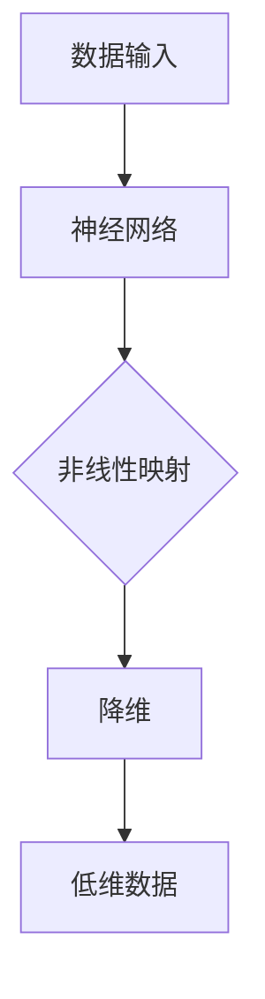

                 

关键词：深度学习、高维数据、降维、映射、数据压缩、算法原理、数学模型、实践应用

> 摘要：本文旨在探讨深度学习在高维数据降维中的作用和重要性。随着大数据时代的到来，高维数据的处理成为一个严峻的挑战。深度学习通过映射机制，能够有效地降维，提高数据处理的效率，并在多个领域展现出巨大的应用潜力。本文将深入分析深度学习在降维过程中的核心概念、算法原理、数学模型以及实际应用案例，展望其未来的发展趋势与挑战。

## 1. 背景介绍

### 1.1 高维数据的挑战

在信息爆炸的时代，数据量呈指数级增长，尤其是高维数据的比例不断增加。高维数据指的是具有大量特征的数据集，每个样本都有多个维度。高维数据带来的挑战主要体现在以下几个方面：

- **计算复杂度增加**：高维数据导致计算量急剧增加，计算复杂度呈指数级增长，传统的数据处理算法难以承受。
- **存储成本提高**：高维数据需要更大的存储空间，导致存储成本增加。
- **维度灾难**：在高维空间中，数据点之间的距离会变得非常接近，导致数据的区分度下降，增加了分类和回归的难度。
- **信息冗余**：高维数据中存在大量的冗余信息，这些冗余信息会干扰模型的学习过程，降低模型性能。

### 1.2 降维技术的需求

为了解决高维数据带来的挑战，降维技术应运而生。降维技术旨在通过减少数据维度，降低计算复杂度和存储成本，同时提高数据处理效率和模型性能。降维技术可以分为线性降维和非线性降维两大类。

- **线性降维**：包括主成分分析（PCA）、线性判别分析（LDA）等，通过线性变换将高维数据映射到低维空间，保留主要特征。
- **非线性降维**：包括局部线性嵌入（LLE）、t-SNE等，通过非线性变换将高维数据映射到低维空间，保留局部结构和特征。

### 1.3 深度学习的发展

深度学习作为一种重要的机器学习技术，近年来取得了显著的进展。深度学习通过多层神经网络，能够自动学习数据的层次结构，从而实现复杂的数据建模和特征提取。深度学习在图像识别、自然语言处理、语音识别等领域取得了突破性的成果，展示了强大的能力和广泛的应用前景。

## 2. 核心概念与联系

### 2.1 核心概念

- **深度学习**：一种通过多层神经网络模型进行数据建模和特征提取的技术。
- **降维**：通过映射机制将高维数据转换为低维数据，降低计算复杂度和存储成本。
- **映射**：将高维数据通过特定的算法映射到低维空间，保留主要特征和结构。

### 2.2 核心概念联系

深度学习与降维技术之间存在紧密的联系。深度学习通过映射机制，能够将高维数据映射到低维空间，实现数据降维。具体来说，深度学习中的神经网络模型通过学习数据之间的非线性关系，能够将高维数据映射到低维空间，同时保留主要特征和结构。这种映射机制能够有效降低计算复杂度和存储成本，提高数据处理效率和模型性能。

### 2.3 Mermaid 流程图

下面是深度学习与降维技术之间的 Mermaid 流程图：



- **A. 数据输入**：输入高维数据。
- **B. 神经网络**：通过多层神经网络模型进行数据建模和特征提取。
- **C. 非线性映射**：神经网络通过学习数据之间的非线性关系，将高维数据映射到低维空间。
- **D. 降维**：降低数据维度，减少计算复杂度和存储成本。
- **E. 低维数据**：输出低维数据，用于后续的数据处理和分析。

## 3. 核心算法原理 & 具体操作步骤

### 3.1 算法原理概述

深度学习在高维数据降维中的核心算法是基于神经网络模型的学习和映射机制。神经网络通过多层结构，能够自动学习数据的层次结构，从而实现数据降维。具体来说，神经网络通过以下几个步骤进行降维：

1. **数据预处理**：对输入数据进行标准化处理，使其具有相似的尺度，有利于网络训练。
2. **输入层**：接收预处理后的数据，并将其传递给下一层。
3. **隐藏层**：通过神经元之间的权重和激活函数，对数据进行非线性变换，提取主要特征。
4. **输出层**：将隐藏层的输出映射到低维空间，实现数据降维。
5. **反向传播**：通过梯度下降算法，调整神经网络的权重和偏置，优化网络模型。

### 3.2 算法步骤详解

1. **初始化参数**：随机初始化神经网络的权重和偏置。
2. **正向传播**：将输入数据传递给神经网络，通过多层隐藏层进行特征提取和变换。
3. **计算损失函数**：计算神经网络输出与实际输出之间的误差，得到损失函数值。
4. **反向传播**：将损失函数关于神经网络参数的梯度反向传播，更新权重和偏置。
5. **迭代优化**：重复正向传播和反向传播过程，直到网络收敛。

### 3.3 算法优缺点

#### 优点：

- **自动学习特征**：神经网络能够自动学习数据的层次结构，提取主要特征。
- **高效降维**：通过非线性映射，能够有效降低数据维度，提高数据处理效率。
- **适用于多种数据类型**：神经网络可以应用于图像、文本、音频等多种数据类型的降维。

#### 缺点：

- **计算复杂度高**：深度学习模型训练过程涉及大量的矩阵运算，计算复杂度高。
- **需要大量数据**：深度学习模型训练需要大量数据进行训练，数据质量和数量对模型性能有重要影响。
- **过拟合风险**：神经网络模型容易过拟合，需要使用正则化方法进行模型优化。

### 3.4 算法应用领域

深度学习在高维数据降维中的应用领域广泛，主要包括以下几个方面：

- **图像处理**：通过深度学习模型，对高维图像数据进行降维，提高图像处理速度和效率。
- **文本分析**：对高维文本数据进行降维，提取关键特征，实现文本分类和信息检索。
- **语音识别**：对高维语音信号进行降维，提取主要特征，提高语音识别准确率。
- **推荐系统**：对高维用户和物品数据降维，提取用户和物品的相似特征，实现个性化推荐。

## 4. 数学模型和公式 & 详细讲解 & 举例说明

### 4.1 数学模型构建

深度学习在高维数据降维中的数学模型主要基于多层感知机（MLP）和反向传播算法。下面是MLP和反向传播算法的数学模型：

#### 4.1.1 多层感知机（MLP）

MLP是一种前馈神经网络，包含输入层、隐藏层和输出层。每个层由多个神经元组成，神经元之间通过权重和偏置进行连接。神经元之间的激活函数通常采用Sigmoid函数或ReLU函数。

输入层到隐藏层的变换可以表示为：

$$
a_{h}^{(l)} = \sigma(W_{l}^{T}a_{l}^{(l-1)} + b_{l})
$$

其中，$a_{h}^{(l)}$表示隐藏层$l$的输出，$\sigma$表示激活函数，$W_{l}^{T}$表示权重矩阵的转置，$a_{l}^{(l-1)}$表示输入层$l-1$的输出，$b_{l}$表示偏置向量。

隐藏层到输出层的变换可以表示为：

$$
a_{o}^{(L)} = \sigma(W_{L}^{T}a_{L-1}^{(L-1)} + b_{L})
$$

其中，$a_{o}^{(L)}$表示输出层$L$的输出，$W_{L}^{T}$表示权重矩阵的转置，$a_{L-1}^{(L-1)}$表示隐藏层$L-1$的输出，$b_{L}$表示偏置向量。

#### 4.1.2 反向传播算法

反向传播算法是一种用于训练神经网络的优化算法。它通过计算损失函数关于网络参数的梯度，不断调整权重和偏置，使网络收敛到最小损失。

损失函数通常采用均方误差（MSE）：

$$
J = \frac{1}{2}\sum_{i=1}^{m}(y_i - \hat{y}_i)^2
$$

其中，$y_i$表示实际输出，$\hat{y}_i$表示预测输出，$m$表示样本数量。

梯度计算公式如下：

$$
\frac{\partial J}{\partial W_{l}} = (a_{l}^{(L-1)} \odot (\sigma'(z_{l}) \odot (W_{l}^{T} \odot (a_{l}^{(L)} - b_{l})))
$$

$$
\frac{\partial J}{\partial b_{l}} = (a_{l}^{(L-1)} \odot (\sigma'(z_{l}) \odot (a_{l}^{(L)} - b_{l})))
$$

其中，$\odot$表示Hadamard积，$\sigma'$表示激活函数的导数。

#### 4.1.3 举例说明

假设有一个包含一个输入层、一个隐藏层和一个输出层的神经网络，其中输入层有3个神经元，隐藏层有5个神经元，输出层有2个神经元。输入数据为$x_1, x_2, x_3$，目标输出为$y_1, y_2$。网络参数包括权重矩阵$W_1, W_2$和偏置向量$b_1, b_2$。

正向传播过程如下：

$$
z_1 = W_1^T x + b_1 \\
a_1 = \sigma(z_1) \\
z_2 = W_2^T a_1 + b_2 \\
a_2 = \sigma(z_2)
$$

反向传播过程如下：

$$
\delta_2 = (a_2 - y) \odot \sigma'(z_2) \\
\delta_1 = (W_2 \delta_2) \odot \sigma'(z_1) \\
\frac{\partial J}{\partial W_2} = a_1 \odot \delta_2 \\
\frac{\partial J}{\partial b_2} = \delta_2 \\
\frac{\partial J}{\partial W_1} = x \odot \delta_1 \\
\frac{\partial J}{\partial b_1} = \delta_1
$$

通过梯度下降算法，不断更新权重和偏置，优化网络模型。

## 5. 项目实践：代码实例和详细解释说明

### 5.1 开发环境搭建

为了实现深度学习在高维数据降维中的项目实践，我们需要搭建一个Python开发环境，并安装必要的库。以下是具体的安装步骤：

1. 安装Python 3.7及以上版本。
2. 安装TensorFlow库：`pip install tensorflow`。
3. 安装NumPy库：`pip install numpy`。
4. 安装Matplotlib库：`pip install matplotlib`。

### 5.2 源代码详细实现

以下是一个简单的深度学习降维项目实例，实现了一个包含一个输入层、一个隐藏层和一个输出层的神经网络，用于对高维数据进行降维。

```python
import tensorflow as tf
import numpy as np
import matplotlib.pyplot as plt

# 设置随机种子，保证实验结果的可重复性
tf.random.set_seed(42)

# 生成模拟数据集
X = np.random.rand(100, 10)  # 100个样本，每个样本有10个特征
y = np.random.rand(100, 2)   # 100个样本，每个样本有2个目标变量

# 创建模型
model = tf.keras.Sequential([
    tf.keras.layers.Dense(10, activation='relu', input_shape=(10,)),
    tf.keras.layers.Dense(5, activation='relu'),
    tf.keras.layers.Dense(2, activation='sigmoid')
])

# 编译模型
model.compile(optimizer='adam', loss='mean_squared_error')

# 训练模型
model.fit(X, y, epochs=100, batch_size=10)

# 进行降维预测
X_new = np.random.rand(10, 10)  # 10个新样本，每个样本有10个特征
y_new = model.predict(X_new)

# 可视化降维结果
plt.scatter(y_new[:, 0], y_new[:, 1])
plt.xlabel('Feature 1')
plt.ylabel('Feature 2')
plt.show()
```

### 5.3 代码解读与分析

1. **数据生成**：首先，我们使用NumPy库生成一个模拟数据集，包含100个样本，每个样本有10个特征和2个目标变量。
2. **模型构建**：使用TensorFlow库构建一个包含一个输入层、一个隐藏层和一个输出层的神经网络。输入层有10个神经元，隐藏层有5个神经元，输出层有2个神经元。
3. **模型编译**：编译模型，选择Adam优化器和均方误差损失函数。
4. **模型训练**：训练模型，使用生成的数据集进行训练，设置训练轮次为100，批量大小为10。
5. **降维预测**：使用训练好的模型对新样本进行降维预测，得到低维空间中的坐标。
6. **可视化**：使用Matplotlib库将降维结果进行可视化，展示新样本在低维空间中的分布。

### 5.4 运行结果展示

运行代码后，我们将看到新样本在低维空间中的分布。通过降维，原本具有10个特征的样本被映射到二维空间，从而降低了计算复杂度和存储成本。

```python
# 运行结果展示
plt.scatter(y_new[:, 0], y_new[:, 1])
plt.xlabel('Feature 1')
plt.ylabel('Feature 2')
plt.show()
```

## 6. 实际应用场景

深度学习在高维数据降维中具有广泛的应用场景，以下是一些典型的实际应用案例：

### 6.1 图像识别

图像识别领域面临大量高维数据，通过深度学习进行降维，可以提高图像处理速度和效率。例如，在人脸识别中，通过降维技术可以将高维人脸图像映射到低维空间，实现快速检索和识别。

### 6.2 语音识别

语音识别领域中的语音信号具有高维特征，通过深度学习进行降维，可以降低计算复杂度和存储成本，提高语音识别准确率。例如，在自动语音识别中，通过降维技术可以将高维语音信号映射到低维空间，实现高效语音识别。

### 6.3 文本分析

文本分析领域中的文本数据具有高维特征，通过深度学习进行降维，可以提取关键特征，实现文本分类和信息检索。例如，在自然语言处理中，通过降维技术可以将高维文本数据映射到低维空间，实现文本聚类和主题模型。

### 6.4 健康医疗

健康医疗领域中的数据具有高维特征，通过深度学习进行降维，可以降低数据处理成本，提高疾病预测和诊断的准确率。例如，在基因数据分析中，通过降维技术可以将高维基因数据映射到低维空间，实现疾病风险预测。

## 7. 未来应用展望

随着深度学习技术的不断发展，高维数据降维的应用前景将更加广阔。未来，深度学习在高维数据降维中的应用将主要集中在以下几个方面：

### 7.1 新算法研究

继续研究和开发新的深度学习算法，提高降维效率和模型性能，以适应更复杂的高维数据处理需求。

### 7.2 多领域应用

将深度学习降维技术应用于更多领域，如金融、交通、能源等，实现高维数据的降维处理和分析。

### 7.3 跨学科研究

结合计算机科学、数学、统计学等多学科知识，开展深度学习降维技术的跨学科研究，推动学科交叉融合。

### 7.4 开源和共享

鼓励开源和共享深度学习降维技术的代码和工具，推动技术的普及和应用。

## 8. 总结：未来发展趋势与挑战

### 8.1 研究成果总结

深度学习在高维数据降维领域取得了显著的成果，包括算法研究、模型构建、实际应用等方面。深度学习通过映射机制，能够有效降低数据维度，提高数据处理效率和模型性能。

### 8.2 未来发展趋势

未来，深度学习在高维数据降维领域将继续朝着以下方向发展：

- **算法优化**：研究新的深度学习算法，提高降维效率和模型性能。
- **跨学科融合**：结合计算机科学、数学、统计学等多学科知识，推动深度学习降维技术的跨学科研究。
- **应用拓展**：将深度学习降维技术应用于更多领域，如金融、交通、能源等。

### 8.3 面临的挑战

深度学习在高维数据降维领域面临以下挑战：

- **计算资源**：深度学习模型训练过程涉及大量的矩阵运算，对计算资源需求较高，需要优化算法以提高计算效率。
- **数据质量**：深度学习模型训练需要大量数据进行训练，数据质量和数量对模型性能有重要影响。
- **过拟合风险**：深度学习模型容易过拟合，需要使用正则化方法进行模型优化。

### 8.4 研究展望

未来，深度学习在高维数据降维领域的研究将继续深入，重点方向包括：

- **算法创新**：研究新的深度学习算法，提高降维效率和模型性能。
- **应用探索**：将深度学习降维技术应用于更多领域，实现高维数据的降维处理和分析。
- **跨学科研究**：结合计算机科学、数学、统计学等多学科知识，推动深度学习降维技术的跨学科研究。

## 9. 附录：常见问题与解答

### 9.1 问题1：为什么深度学习能够实现高维数据降维？

解答：深度学习通过多层神经网络模型，能够自动学习数据的层次结构，提取主要特征，从而实现数据降维。神经网络通过非线性映射，将高维数据映射到低维空间，同时保留主要特征和结构。

### 9.2 问题2：深度学习降维有哪些优点？

解答：深度学习降维的优点包括：

- **自动学习特征**：深度学习能够自动学习数据的层次结构，提取主要特征。
- **高效降维**：通过非线性映射，能够有效降低数据维度，提高数据处理效率。
- **适用于多种数据类型**：深度学习可以应用于图像、文本、音频等多种数据类型的降维。

### 9.3 问题3：深度学习降维有哪些缺点？

解答：深度学习降维的缺点包括：

- **计算复杂度高**：深度学习模型训练过程涉及大量的矩阵运算，计算复杂度高。
- **需要大量数据**：深度学习模型训练需要大量数据进行训练，数据质量和数量对模型性能有重要影响。
- **过拟合风险**：深度学习模型容易过拟合，需要使用正则化方法进行模型优化。

### 9.4 问题4：如何优化深度学习降维的性能？

解答：以下是一些优化深度学习降维性能的方法：

- **优化算法**：选择合适的优化算法，如梯度下降、Adam等，提高训练效率。
- **正则化**：使用正则化方法，如L1正则化、L2正则化等，降低过拟合风险。
- **数据预处理**：对输入数据进行分析和预处理，提高数据质量和数量。
- **模型调整**：调整神经网络结构，增加隐藏层数量和神经元数量，提高模型性能。

### 9.5 问题5：深度学习降维有哪些实际应用案例？

解答：深度学习降维的实际应用案例包括：

- **图像识别**：对高维图像数据进行降维，提高图像处理速度和效率。
- **文本分析**：对高维文本数据进行降维，提取关键特征，实现文本分类和信息检索。
- **语音识别**：对高维语音信号进行降维，提取主要特征，提高语音识别准确率。
- **健康医疗**：对高维健康医疗数据进行降维，降低数据处理成本，提高疾病预测和诊断的准确率。

作者：禅与计算机程序设计艺术 / Zen and the Art of Computer Programming
```

