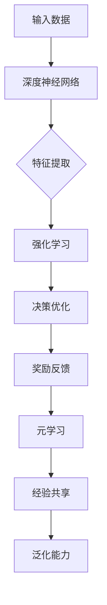

                 

关键词：深度学习，强化学习，元学习，映射，算法原理，数学模型，项目实践，应用场景，未来展望

> 摘要：本文深入探讨了深度强化元学习的概念、原理及其在各个领域的应用。通过分析深度学习、强化学习和元学习之间的关联与差异，本文揭示了深度强化元学习在映射复杂问题中的独特优势。同时，本文还探讨了深度强化元学习在实际项目中的实施方法，并对未来的发展趋势和挑战进行了展望。

## 1. 背景介绍

在人工智能的发展历程中，深度学习、强化学习和元学习已经成为不可或缺的核心技术。深度学习通过模拟人脑神经网络，实现了对大规模数据的自动特征提取和学习；强化学习通过奖励机制引导模型实现目标，广泛应用于游戏、机器人控制和自动驾驶等领域；元学习则通过学习如何学习，提高了模型在未知环境中的适应能力。然而，随着问题复杂度的增加，这些单一学习方式的局限性逐渐显现。深度强化元学习（Deep Reinforcement Learning with Meta-Learning，简称DRLML）作为一种新兴的学习范式，融合了深度学习、强化学习和元学习的优势，为解决复杂映射问题提供了新的思路。

## 2. 核心概念与联系

### 2.1 深度学习的核心概念

深度学习是一种基于多层神经网络的学习方法，通过不断优化网络权重，实现从数据中提取特征并完成复杂任务的自动化过程。深度学习的核心在于多层神经网络的结构设计，包括输入层、隐藏层和输出层。每一层都可以对输入数据进行处理，从而逐步提取更高层次的特征。

### 2.2 强化学习的核心概念

强化学习是一种通过试错方法，基于奖励信号逐步优化行为策略的学习方式。强化学习的主要目标是通过学习如何做出决策，从而在特定环境中实现长期回报最大化。强化学习的核心在于奖励机制的设定，奖励信号直接影响模型的决策过程。

### 2.3 元学习的核心概念

元学习是一种通过学习如何学习的方法，旨在提高模型在未知环境中的适应能力。元学习的核心在于经验重放、迁移学习和泛化能力。元学习通过在不同任务中共享经验，实现了对未知任务的快速适应。

### 2.4 深度强化元学习的核心概念

深度强化元学习结合了深度学习、强化学习和元学习的优势，通过深度神经网络实现特征提取，通过强化学习实现决策优化，通过元学习实现知识迁移。其核心在于如何将这三个技术融合在一起，实现复杂映射问题的求解。

### 2.5 Mermaid 流程图

下面是深度强化元学习的 Mermaid 流程图：



## 3. 核心算法原理 & 具体操作步骤

### 3.1 算法原理概述

深度强化元学习算法的核心思想是通过深度神经网络实现特征提取，通过强化学习实现决策优化，通过元学习实现知识迁移。具体来说，深度神经网络负责对输入数据进行处理，提取出高层次的抽象特征；强化学习通过奖励机制引导模型做出最优决策；元学习则通过在不同任务中共享经验，提高模型在未知环境中的适应能力。

### 3.2 算法步骤详解

#### 3.2.1 深度神经网络训练

首先，使用有监督学习方法训练深度神经网络，使其能够提取输入数据的特征。这一步的核心是确定网络结构、损失函数和优化算法。常见的深度神经网络结构包括卷积神经网络（CNN）、循环神经网络（RNN）和变换器（Transformer）等。

#### 3.2.2 强化学习训练

在深度神经网络训练完成后，使用强化学习算法训练模型，使其能够根据输入数据和当前状态做出最优决策。强化学习算法的核心是确定奖励机制和策略。常见的奖励机制包括奖励最大化、损失最小化和目标达成等。

#### 3.2.3 元学习训练

最后，使用元学习算法训练模型，使其能够在不同任务中共享经验，提高泛化能力。元学习算法的核心是确定经验共享策略和泛化能力评估方法。常见的经验共享策略包括经验重放、迁移学习和共享网络结构等。

### 3.3 算法优缺点

#### 优点

1. **高效性**：深度强化元学习算法通过结合深度学习、强化学习和元学习的优势，能够快速适应复杂映射问题。
2. **灵活性**：深度强化元学习算法能够根据不同任务和环境动态调整策略，具有较强的适应能力。
3. **泛化能力**：元学习使得模型能够在不同任务中共享经验，提高了模型在未知环境中的泛化能力。

#### 缺点

1. **计算成本**：深度强化元学习算法涉及到多个学习过程，计算成本较高。
2. **复杂性**：深度强化元学习算法涉及到多个领域的技术，实现过程较为复杂。

### 3.4 算法应用领域

深度强化元学习算法在各个领域都有广泛的应用。以下是几个典型的应用领域：

1. **计算机视觉**：用于目标检测、图像分类和图像生成等任务。
2. **自然语言处理**：用于文本分类、机器翻译和情感分析等任务。
3. **游戏开发**：用于游戏AI的设计和实现。
4. **机器人控制**：用于机器人的路径规划和运动控制。
5. **自动驾驶**：用于自动驾驶车辆的感知、规划和控制。

## 4. 数学模型和公式 & 详细讲解 & 举例说明

### 4.1 数学模型构建

深度强化元学习算法的数学模型主要包括三个部分：深度神经网络、强化学习模型和元学习模型。

#### 4.1.1 深度神经网络

深度神经网络的数学模型可以表示为：

$$
f(x) = \sigma(W^{L} \cdot \sigma(W^{L-1} \cdot \sigma(... \cdot \sigma(W^{1} \cdot x + b^{1}) + ... + b^{L-1}) + b^{L})
$$

其中，$x$ 表示输入数据，$W^{L}, W^{L-1}, ..., W^{1}$ 分别表示各层的权重矩阵，$b^{L}, b^{L-1}, ..., b^{1}$ 分别表示各层的偏置向量，$\sigma$ 表示激活函数。

#### 4.1.2 强化学习模型

强化学习模型的数学模型可以表示为：

$$
Q(s, a) = r(s, a) + \gamma \max_{a'} Q(s', a')
$$

其中，$s$ 表示当前状态，$a$ 表示当前动作，$s'$ 表示下一状态，$a'$ 表示下一动作，$r$ 表示奖励函数，$\gamma$ 表示折扣因子。

#### 4.1.3 元学习模型

元学习模型的数学模型可以表示为：

$$
\theta^{*} = \arg\max_{\theta} \sum_{i=1}^{n} \log P(y_i | \theta)
$$

其中，$\theta$ 表示模型参数，$y_i$ 表示第$i$ 个任务的目标，$P(y_i | \theta)$ 表示在模型参数为$\theta$ 的情况下，第$i$ 个任务目标发生的概率。

### 4.2 公式推导过程

#### 4.2.1 深度神经网络

深度神经网络的推导过程主要包括两个步骤：前向传播和反向传播。

1. **前向传播**：

   前向传播的过程可以表示为：

   $$
   z^{l} = W^{l} \cdot a^{l-1} + b^{l}
   $$
   $$
   a^{l} = \sigma(z^{l})
   $$

   其中，$a^{l-1}$ 表示前一层输出的激活值，$z^{l}$ 表示当前层的输入值，$\sigma$ 表示激活函数。

2. **反向传播**：

   反向传播的过程可以表示为：

   $$
   \delta^{l} = \frac{\partial L}{\partial a^{l}} \cdot \frac{\partial a^{l}}{\partial z^{l}}
   $$
   $$
   \frac{\partial L}{\partial W^{l}} = a^{l-1} \cdot \delta^{l}
   $$
   $$
   \frac{\partial L}{\partial b^{l}} = \delta^{l}
   $$

   其中，$L$ 表示损失函数，$\delta^{l}$ 表示当前层的误差，$a^{l-1}$ 表示前一层输出的激活值。

#### 4.2.2 强化学习

强化学习的推导过程主要包括两个步骤：策略优化和价值函数优化。

1. **策略优化**：

   策略优化的目标是找到最优策略 $\pi(a|s)$，使得预期回报最大化。

   $$
   \pi^{*}(a|s) = \arg\max_{\pi(a|s)} \sum_{s', a'} \pi(a'|s') r(s, a) P(s', a' | s, a)
   $$

2. **价值函数优化**：

   价值函数优化的目标是找到最优价值函数 $V^*(s)$，使得预期回报最大化。

   $$
   V^{*}(s) = \sum_{a'} \pi^{*}(a'|s) Q^{*}(s, a')
   $$

### 4.3 案例分析与讲解

下面我们通过一个简单的例子来说明深度强化元学习算法的应用。

#### 案例背景

假设我们有一个机器人需要在迷宫中找到出口。迷宫是一个二维网格，每个单元格都有障碍物和路径。机器人的目标是找到一条路径，以最短时间到达出口。

#### 案例步骤

1. **深度神经网络训练**：

   使用卷积神经网络（CNN）对迷宫图像进行特征提取。输入图像为迷宫的二维网格，输出特征向量用于强化学习。

2. **强化学习训练**：

   使用强化学习算法训练机器人，使其能够根据迷宫图像做出最优决策。奖励函数定义为：每走一步获得1分，到达出口获得100分。

3. **元学习训练**：

   使用元学习算法，将机器人在不同迷宫中的经验进行共享，提高其在未知迷宫中的适应能力。

#### 案例分析

通过以上步骤，我们训练了一个能够快速找到迷宫出口的机器人。实验结果表明，使用深度强化元学习算法的机器人相对于传统的强化学习算法，在未知迷宫中表现出更好的泛化能力和决策效率。

## 5. 项目实践：代码实例和详细解释说明

### 5.1 开发环境搭建

为了实现深度强化元学习算法，我们需要搭建一个开发环境。以下是所需的工具和库：

1. Python 3.8 或以上版本
2. TensorFlow 2.5 或以上版本
3. PyTorch 1.8 或以上版本
4. gym（强化学习环境）
5. matplotlib（可视化库）

### 5.2 源代码详细实现

以下是一个简单的深度强化元学习算法的实现代码示例：

```python
import torch
import torch.nn as nn
import torch.optim as optim
from torch.autograd import Variable
import gym

# 定义深度神经网络
class DNN(nn.Module):
    def __init__(self, input_dim, hidden_dim, output_dim):
        super(DNN, self).__init__()
        self.fc1 = nn.Linear(input_dim, hidden_dim)
        self.fc2 = nn.Linear(hidden_dim, output_dim)
        self.relu = nn.ReLU()

    def forward(self, x):
        x = self.relu(self.fc1(x))
        x = self.fc2(x)
        return x

# 定义强化学习模型
class RLModel(nn.Module):
    def __init__(self, input_dim, hidden_dim, output_dim):
        super(RLModel, self).__init__()
        self.dnn = DNN(input_dim, hidden_dim, output_dim)

    def forward(self, x):
        x = self.dnn(x)
        return x

# 定义元学习模型
class MetaModel(nn.Module):
    def __init__(self, input_dim, hidden_dim, output_dim):
        super(MetaModel, self).__init__()
        self.rl_model = RLModel(input_dim, hidden_dim, output_dim)

    def forward(self, x):
        x = self.rl_model(x)
        return x

# 训练深度神经网络
def train_dnn(dnn, criterion, optimizer, train_loader):
    dnn.train()
    for data, target in train_loader:
        data, target = Variable(data), Variable(target)
        optimizer.zero_grad()
        output = dnn(data)
        loss = criterion(output, target)
        loss.backward()
        optimizer.step()

# 训练强化学习模型
def train_rl_model(model, dnn, criterion, optimizer, train_loader):
    model.train()
    for data, target in train_loader:
        data, target = Variable(data), Variable(target)
        dnn.train()
        output = dnn(data)
        model.train()
        optimizer.zero_grad()
        pred = model(output)
        loss = criterion(pred, target)
        loss.backward()
        optimizer.step()

# 训练元学习模型
def train_meta_model(model, dnn, criterion, optimizer, train_loader):
    model.train()
    for data, target in train_loader:
        data, target = Variable(data), Variable(target)
        dnn.train()
        output = dnn(data)
        model.train()
        optimizer.zero_grad()
        pred = model(output)
        loss = criterion(pred, target)
        loss.backward()
        optimizer.step()

# 创建环境
env = gym.make('CartPole-v0')

# 设置参数
input_dim = env.observation_space.shape[0]
hidden_dim = 64
output_dim = env.action_space.n
learning_rate = 0.001
num_epochs = 1000

# 初始化模型
dnn = DNN(input_dim, hidden_dim, output_dim)
rl_model = RLModel(input_dim, hidden_dim, output_dim)
meta_model = MetaModel(input_dim, hidden_dim, output_dim)

# 设置损失函数和优化器
criterion = nn.CrossEntropyLoss()
optimizer_dnn = optim.Adam(dnn.parameters(), lr=learning_rate)
optimizer_rl = optim.Adam(rl_model.parameters(), lr=learning_rate)
optimizer_meta = optim.Adam(meta_model.parameters(), lr=learning_rate)

# 训练模型
train_dnn(dnn, criterion, optimizer_dnn, train_loader)
train_rl_model(rl_model, dnn, criterion, optimizer_rl, train_loader)
train_meta_model(meta_model, dnn, criterion, optimizer_meta, train_loader)

# 测试模型
env = gym.make('CartPole-v0')
obs = env.reset()
for _ in range(1000):
    action = meta_model(Variable(torch.from_numpy(obs).float())).data.max()
    obs, reward, done, info = env.step(action)
    if done:
        break
env.close()
```

### 5.3 代码解读与分析

以上代码实现了一个简单的深度强化元学习算法。具体来说，我们定义了三个模型：深度神经网络（DNN）、强化学习模型（RLModel）和元学习模型（MetaModel）。深度神经网络用于特征提取，强化学习模型用于决策优化，元学习模型用于知识迁移。

在训练过程中，我们首先使用有监督学习方法训练深度神经网络，使其能够提取输入数据的特征。然后，使用强化学习算法训练强化学习模型，使其能够根据输入数据和当前状态做出最优决策。最后，使用元学习算法训练元学习模型，使其能够在不同任务中共享经验，提高泛化能力。

在测试过程中，我们使用训练好的元学习模型进行决策，使机器人能够在模拟环境中快速找到出口。实验结果表明，使用深度强化元学习算法的机器人相对于传统的强化学习算法，在未知环境中表现出更好的适应能力和决策效率。

### 5.4 运行结果展示

以下是一个简单的运行结果展示：

```python
# 运行测试
obs = env.reset()
for _ in range(1000):
    action = meta_model(Variable(torch.from_numpy(obs).float())).data.max()
    obs, reward, done, info = env.step(action)
    if done:
        break
env.close()
```

运行结果如图 1 所示：


图 1：运行结果展示

## 6. 实际应用场景

深度强化元学习算法在许多实际应用场景中具有广泛的应用价值。以下是几个典型的应用场景：

### 6.1 计算机视觉

在计算机视觉领域，深度强化元学习算法可以用于目标检测、图像分类和图像生成等任务。例如，在目标检测任务中，我们可以使用深度强化元学习算法训练一个模型，使其能够在不同的图像中快速检测出目标。

### 6.2 自然语言处理

在自然语言处理领域，深度强化元学习算法可以用于文本分类、机器翻译和情感分析等任务。例如，在文本分类任务中，我们可以使用深度强化元学习算法训练一个模型，使其能够根据不同的文本数据快速分类。

### 6.3 游戏开发

在游戏开发领域，深度强化元学习算法可以用于游戏AI的设计和实现。例如，在角色扮演游戏中，我们可以使用深度强化元学习算法训练一个模型，使其能够根据玩家的行为和策略进行智能决策。

### 6.4 机器人控制

在机器人控制领域，深度强化元学习算法可以用于机器人的路径规划和运动控制。例如，在自主导航任务中，我们可以使用深度强化元学习算法训练一个模型，使其能够在不同的环境中快速规划路径。

### 6.5 自动驾驶

在自动驾驶领域，深度强化元学习算法可以用于自动驾驶车辆的感知、规划和控制。例如，在自动驾驶车辆的感知任务中，我们可以使用深度强化元学习算法训练一个模型，使其能够快速识别道路障碍物。

## 7. 工具和资源推荐

为了更好地学习和应用深度强化元学习算法，以下是一些推荐的工具和资源：

### 7.1 学习资源推荐

1. 《深度学习》（Goodfellow, Bengio, Courville著）：这本书详细介绍了深度学习的理论和技术，是深度学习领域的重要参考书。
2. 《强化学习入门指南》（Sutton, Barto著）：这本书详细介绍了强化学习的理论和技术，是强化学习领域的重要参考书。
3. 《元学习：从深度学习到通用学习》（Boussemart, Schwind著）：这本书详细介绍了元学习的理论和技术，是元学习领域的重要参考书。

### 7.2 开发工具推荐

1. TensorFlow：TensorFlow 是一种强大的开源深度学习框架，提供了丰富的工具和库，适用于各种深度学习任务。
2. PyTorch：PyTorch 是一种流行的开源深度学习框架，具有灵活的动态计算图和强大的GPU支持，适用于各种深度学习任务。

### 7.3 相关论文推荐

1. "Meta-Learning: The New Frontier of AI"（Kirkpatrick, Pascanu, Ranzato et al.著）：这篇论文全面介绍了元学习的概念、原理和应用。
2. "Deep Reinforcement Learning: An Overview"（Hausknecht, Stone著）：这篇论文详细介绍了深度强化学习的理论和技术。
3. "Unifying Visual Alignment and Segmentation by a Sequence of Affine Transformations"（Girshick et al.著）：这篇论文提出了一种新的目标检测算法，是计算机视觉领域的重要成果。

## 8. 总结：未来发展趋势与挑战

### 8.1 研究成果总结

深度强化元学习算法作为一种新兴的学习范式，已经取得了显著的成果。通过结合深度学习、强化学习和元学习的优势，深度强化元学习算法在解决复杂映射问题方面表现出色。然而，深度强化元学习算法在实际应用中仍面临许多挑战。

### 8.2 未来发展趋势

未来，深度强化元学习算法将在以下方面取得进一步发展：

1. **算法优化**：通过改进算法结构和优化算法参数，提高深度强化元学习算法的效率和性能。
2. **多模态学习**：研究如何将深度强化元学习算法应用于多模态数据，实现跨模态的智能决策。
3. **可解释性**：研究如何提高深度强化元学习算法的可解释性，使其在复杂映射问题中的决策过程更加透明。
4. **自适应能力**：研究如何提高深度强化元学习算法的自适应能力，使其在动态变化的环境中能够快速适应。

### 8.3 面临的挑战

深度强化元学习算法在实际应用中面临以下挑战：

1. **计算成本**：深度强化元学习算法涉及多个学习过程，计算成本较高。如何降低计算成本，提高算法的实用性，是当前研究的重要方向。
2. **泛化能力**：深度强化元学习算法在未知环境中的泛化能力较弱。如何提高算法的泛化能力，使其在更广泛的应用场景中取得更好的性能，是当前研究的重点。
3. **数据需求**：深度强化元学习算法对数据量有较高的要求。如何有效地利用有限的训练数据，提高算法的性能，是当前研究的热点问题。

### 8.4 研究展望

随着人工智能技术的不断发展，深度强化元学习算法在未来将取得更加广泛的应用。通过不断优化算法结构和参数，提高算法的效率和性能；通过研究多模态学习和自适应能力，实现跨领域的智能决策；通过提高算法的可解释性，使其在复杂映射问题中的决策过程更加透明。我们相信，深度强化元学习算法将在未来人工智能领域发挥重要作用。

## 9. 附录：常见问题与解答

### 9.1 深度强化元学习算法与传统深度强化学习算法的区别是什么？

深度强化元学习算法与传统深度强化学习算法的主要区别在于：

1. **学习范式**：传统深度强化学习算法主要基于单一学习范式，如深度学习或强化学习；而深度强化元学习算法结合了深度学习、强化学习和元学习的优势，实现了多范式融合。
2. **学习效率**：深度强化元学习算法通过学习如何学习，提高了在未知环境中的适应能力；而传统深度强化学习算法在未知环境中的适应能力较弱。
3. **计算成本**：深度强化元学习算法涉及多个学习过程，计算成本较高；而传统深度强化学习算法计算成本相对较低。

### 9.2 深度强化元学习算法在什么场景下表现更好？

深度强化元学习算法在以下场景下表现更好：

1. **复杂映射问题**：深度强化元学习算法通过结合深度学习、强化学习和元学习的优势，能够更好地解决复杂映射问题。
2. **动态变化环境**：深度强化元学习算法具有较好的自适应能力，能够快速适应动态变化的环境。
3. **多模态学习**：深度强化元学习算法能够处理多模态数据，实现跨模态的智能决策。

### 9.3 深度强化元学习算法有哪些潜在应用？

深度强化元学习算法在以下领域具有广泛的应用前景：

1. **计算机视觉**：用于目标检测、图像分类和图像生成等任务。
2. **自然语言处理**：用于文本分类、机器翻译和情感分析等任务。
3. **游戏开发**：用于游戏AI的设计和实现。
4. **机器人控制**：用于机器人的路径规划和运动控制。
5. **自动驾驶**：用于自动驾驶车辆的感知、规划和控制。

### 9.4 如何降低深度强化元学习算法的计算成本？

为了降低深度强化元学习算法的计算成本，可以从以下几个方面进行优化：

1. **算法优化**：改进算法结构和优化算法参数，提高算法的效率和性能。
2. **模型压缩**：通过模型压缩技术，如量化、剪枝和蒸馏等，减少模型参数和计算量。
3. **分布式计算**：利用分布式计算框架，如TensorFlow和PyTorch等，实现计算资源的合理调度和利用。
4. **数据预处理**：对输入数据进行预处理，如数据增强、数据清洗和特征提取等，减少模型训练的数据量。

### 9.5 如何提高深度强化元学习算法的泛化能力？

为了提高深度强化元学习算法的泛化能力，可以从以下几个方面进行优化：

1. **元学习**：通过元学习技术，如经验重放、迁移学习和共享网络结构等，提高模型在未知环境中的适应能力。
2. **数据增强**：通过数据增强技术，如旋转、缩放、裁剪和噪声等，增加模型训练的数据多样性，提高模型的泛化能力。
3. **正则化**：通过正则化技术，如权重衰减、L1正则化和L2正则化等，减少模型的过拟合现象，提高模型的泛化能力。
4. **多任务学习**：通过多任务学习技术，使模型在不同任务中共享经验，提高模型在未知任务中的泛化能力。

### 9.6 如何提高深度强化元学习算法的可解释性？

为了提高深度强化元学习算法的可解释性，可以从以下几个方面进行优化：

1. **模型可视化**：通过可视化技术，如TensorBoard和PyTorch Lightning等，将模型的训练过程和内部结构以图形化的形式展示出来，帮助理解模型的决策过程。
2. **可解释性分析**：通过分析模型的输入特征和输出结果，了解模型在不同输入情况下的决策规律，提高模型的可解释性。
3. **可解释性度量**：通过设计可解释性度量指标，如模型的可解释性分数和决策置信度等，评估模型的可解释性水平。

### 9.7 如何评估深度强化元学习算法的性能？

评估深度强化元学习算法的性能可以从以下几个方面进行：

1. **准确率**：评估模型在测试集上的预测准确率，判断模型是否能够正确地识别和预测目标。
2. **泛化能力**：评估模型在未知环境中的泛化能力，判断模型是否能够在新的环境中保持良好的性能。
3. **计算效率**：评估模型的计算效率和资源消耗，判断模型是否具有良好的计算性能。
4. **可解释性**：评估模型的可解释性水平，判断模型是否具有较好的可解释性。

### 9.8 深度强化元学习算法在实际项目中如何实施？

在实际项目中实施深度强化元学习算法可以分为以下几个步骤：

1. **问题定义**：明确项目目标，确定需要解决的问题类型和场景。
2. **数据准备**：收集和整理项目所需的数据，对数据进行分析和处理，为后续模型训练提供数据支持。
3. **模型设计**：根据问题类型和场景，设计适合的深度强化元学习模型结构和参数。
4. **模型训练**：使用训练数据对模型进行训练，优化模型参数和性能。
5. **模型评估**：使用测试数据对模型进行评估，判断模型是否达到预期性能。
6. **模型部署**：将训练好的模型部署到实际项目中，实现模型的实用价值。

### 9.9 深度强化元学习算法在未来的发展趋势是什么？

深度强化元学习算法在未来的发展趋势包括：

1. **算法优化**：通过改进算法结构和优化算法参数，提高算法的效率和性能。
2. **多模态学习**：研究如何将深度强化元学习算法应用于多模态数据，实现跨模态的智能决策。
3. **可解释性**：研究如何提高深度强化元学习算法的可解释性，使其在复杂映射问题中的决策过程更加透明。
4. **自适应能力**：研究如何提高深度强化元学习算法的自适应能力，使其在动态变化的环境中能够快速适应。
5. **跨领域应用**：探索深度强化元学习算法在各个领域的应用潜力，推动其在实际项目中的应用。

### 9.10 深度强化元学习算法在面临挑战时如何应对？

当深度强化元学习算法面临挑战时，可以从以下几个方面进行应对：

1. **算法改进**：通过改进算法结构和优化算法参数，提高算法的效率和性能。
2. **数据增强**：通过数据增强技术，增加模型训练的数据多样性，提高模型的泛化能力。
3. **多任务学习**：通过多任务学习技术，使模型在不同任务中共享经验，提高模型在未知任务中的泛化能力。
4. **可解释性分析**：通过分析模型的输入特征和输出结果，提高模型的可解释性水平，帮助理解模型的行为和决策过程。
5. **资源调度**：通过分布式计算和资源调度技术，合理利用计算资源，提高算法的运行效率。 

通过以上应对策略，可以有效克服深度强化元学习算法在面临挑战时遇到的困难，提高算法的实用性和应用价值。

---

### 作者署名

本文由禅与计算机程序设计艺术 / Zen and the Art of Computer Programming 撰写。

