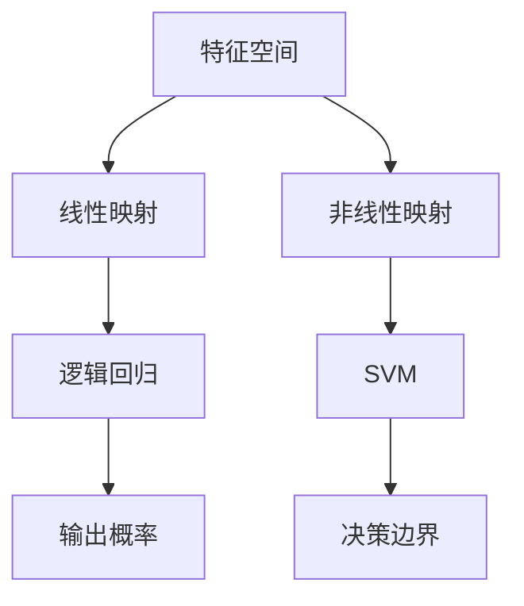

                 

关键词：人工智能，算法，逻辑回归，支持向量机，SVM，机器学习，深度学习，映射，数学模型

摘要：本文深入探讨了人工智能（AI）领域的经典算法——逻辑回归和支撑向量机（SVM）。通过详细解析这些算法的原理、数学模型和应用，我们旨在为读者提供一份全面的技术指南，帮助他们理解这些算法在解决实际问题和推动AI发展中的关键作用。

## 1. 背景介绍

人工智能作为计算机科学的一个重要分支，正迅速成为现代社会不可或缺的一部分。AI的应用范围涵盖了从图像识别、自然语言处理到智能推荐系统等多个领域。在这些应用中，算法的选择和优化至关重要。本文将聚焦于两种经典的机器学习算法：逻辑回归和支持向量机（SVM）。

逻辑回归（Logistic Regression）是一种广泛应用的分类算法，尤其在处理二分类问题中表现突出。其基本思想是通过构建一个线性模型，将输入特征映射到输出概率，从而实现分类。

支撑向量机（Support Vector Machine，SVM）是一种强大的分类和回归工具，尤其适用于高维数据。其核心思想是找到最优的超平面，使得不同类别的数据点在特征空间中能够被清晰地区分。

本文将首先介绍这些算法的基本概念，然后深入解析其工作原理、数学模型，并通过实际代码实例展示其应用过程。

## 2. 核心概念与联系

为了更好地理解逻辑回归和SVM，我们首先需要明确几个核心概念：

### 2.1 特征空间

特征空间是指由输入特征构成的数学空间。在逻辑回归中，特征空间通常是一个低维线性空间；而在SVM中，特征空间可以是高维的，甚至是非线性的。

### 2.2 映射函数

映射函数是指将输入特征映射到输出空间的函数。在逻辑回归中，映射函数是一个线性函数；在SVM中，映射函数可以通过核函数实现非线性映射。

### 2.3 超平面

超平面是特征空间中的一个平面，用于将不同类别的数据点分隔开来。在SVM中，最优的超平面被称为决策边界。

为了更直观地理解这些概念，我们可以使用Mermaid流程图来展示逻辑回归和SVM的架构。



### 2.4 映射原理

在逻辑回归中，映射原理基于线性回归模型。通过最小化损失函数，我们找到最优的映射权重，从而将输入特征映射到输出概率。

在SVM中，映射原理基于最优分割超平面。通过最大化分类间隔，我们找到最优的超平面，从而实现数据的清晰分类。

## 3. 核心算法原理 & 具体操作步骤

### 3.1 算法原理概述

#### 3.1.1 逻辑回归

逻辑回归是一种概率型线性分类模型，其目标是通过输入特征对输出概率进行预测。逻辑回归的基本原理如下：

1. **特征映射**：将输入特征映射到一个线性空间。
2. **概率估计**：通过线性映射权重计算输出概率。
3. **损失函数**：使用交叉熵损失函数评估预测概率与实际标签之间的差距。
4. **优化方法**：使用梯度下降或其他优化算法最小化损失函数。

#### 3.1.2 支撑向量机

支撑向量机是一种二分类模型，其目标是在特征空间中找到一个最优的超平面，使得不同类别的数据点能够被清晰地区分。SVM的基本原理如下：

1. **特征映射**：将输入特征映射到一个高维特征空间。
2. **决策边界**：通过求解最优化问题找到最优的超平面。
3. **核函数**：使用核函数实现非线性映射，使得线性不可分问题能够在高维空间中实现线性划分。
4. **损失函数**：使用 hinge损失函数评估超平面与数据点的距离。

### 3.2 算法步骤详解

#### 3.2.1 逻辑回归步骤

1. **初始化参数**：随机初始化权重和偏置。
2. **特征映射**：计算输入特征的线性组合。
3. **概率估计**：使用 sigmoid 函数计算输出概率。
4. **损失计算**：使用交叉熵损失函数计算损失。
5. **梯度计算**：计算损失函数关于参数的梯度。
6. **参数更新**：使用梯度下降算法更新参数。

#### 3.2.2 支撑向量机步骤

1. **特征映射**：使用核函数将输入特征映射到高维空间。
2. **决策边界求解**：通过求解二次规划问题找到最优的超平面。
3. **超平面优化**：通过调整超平面参数优化分类效果。
4. **支持向量识别**：识别出支持向量，这些向量对于模型的分类至关重要。

### 3.3 算法优缺点

#### 3.3.1 逻辑回归

**优点**：

- **简单易用**：逻辑回归具有简单的线性模型结构，易于理解和实现。
- **速度快**：相比于其他复杂模型，逻辑回归的计算速度更快。
- **概率输出**：逻辑回归能够直接给出输出概率，有助于评估模型的置信度。

**缺点**：

- **线性限制**：逻辑回归只能在特征空间中进行线性映射，对于非线性问题效果较差。
- **过拟合风险**：在特征维度较高时，逻辑回归容易过拟合。

#### 3.3.2 支撑向量机

**优点**：

- **强大分类能力**：SVM能够处理高维数据，并在非线性映射下实现强大分类。
- **可解释性**：SVM的决策边界直观，易于理解。
- **鲁棒性**：SVM对噪声和异常值具有较强的鲁棒性。

**缺点**：

- **计算复杂度高**：SVM的求解过程涉及二次规划，计算复杂度较高。
- **对特征选择敏感**：SVM的性能对特征选择和核函数的选择较为敏感。

### 3.4 算法应用领域

#### 3.4.1 逻辑回归

- **文本分类**：用于文本数据的情感分析、主题分类等。
- **医学诊断**：用于疾病预测和患者风险评估。
- **广告推荐**：用于用户行为分析和广告投放优化。

#### 3.4.2 支撑向量机

- **图像分类**：用于图像识别和目标检测。
- **生物信息学**：用于基因表达数据分析。
- **金融风控**：用于信用评分和欺诈检测。

## 4. 数学模型和公式

### 4.1 数学模型构建

#### 4.1.1 逻辑回归

逻辑回归的数学模型可以表示为：

$$
P(y=1|x; \theta) = \frac{1}{1 + e^{-(\theta^T x + b)}}
$$

其中，$P(y=1|x; \theta)$ 是特征 $x$ 映射到输出概率 $y=1$ 的函数，$\theta$ 是权重向量，$b$ 是偏置。

#### 4.1.2 支撑向量机

SVM的数学模型可以表示为：

$$
\min_{\theta, b} \frac{1}{2} ||\theta||^2 + C \sum_{i=1}^{n} \max(0, 1 - y_i (\theta^T x_i + b))
$$

其中，$||\theta||^2$ 是权重向量的平方范数，$C$ 是惩罚参数，$y_i$ 是第 $i$ 个样本的标签，$x_i$ 是第 $i$ 个样本的特征。

### 4.2 公式推导过程

#### 4.2.1 逻辑回归

逻辑回归的推导过程基于最大似然估计（Maximum Likelihood Estimation，MLE）。具体步骤如下：

1. **概率分布建模**：假设输出 $y$ 服从伯努利分布，即 $P(y| x; \theta) = Bernoulli(P(y=1|x; \theta))$。
2. **损失函数**：使用对数似然损失函数 $L(\theta) = -\sum_{i=1}^{n} y_i log(P(y=1|x; \theta)) - (1 - y_i) log(1 - P(y=1|x; \theta))$。
3. **求导**：对 $L(\theta)$ 求导，得到 $\frac{\partial L(\theta)}{\partial \theta} = -\sum_{i=1}^{n} (y_i - P(y=1|x; \theta)) x_i$。
4. **求解**：令导数为零，解得权重向量 $\theta$。

#### 4.2.2 支撑向量机

SVM的推导过程基于优化理论。具体步骤如下：

1. **目标函数**：假设存在一个线性决策边界 $w^T x + b = 0$，目标是最小化分类间隔 $||w||^2$。
2. **约束条件**：对于每个训练样本 $(x_i, y_i)$，要求满足 $y_i (w^T x_i + b) \geq 1$。
3. **拉格朗日函数**：构建拉格朗日函数 $L(w, b, \alpha) = \frac{1}{2} ||w||^2 - \sum_{i=1}^{n} \alpha_i (y_i (w^T x_i + b) - 1)$。
4. **KKT条件**：求解拉格朗日函数的KKT条件，得到 $0 \leq \alpha_i \leq C$ 和 $\alpha_i (y_i (w^T x_i + b) - 1) = 0$。
5. **求解**：通过求解二次规划问题，得到最优的权重向量 $w$ 和偏置 $b$。

### 4.3 案例分析与讲解

#### 4.3.1 逻辑回归案例

假设我们有一个简单的二分类问题，数据集包含两个特征 $x_1$ 和 $x_2$。我们使用逻辑回归模型来预测标签 $y$。

1. **初始化参数**：随机初始化权重 $\theta_1$ 和 $\theta_2$。
2. **特征映射**：计算线性组合 $\theta_1 x_1 + \theta_2 x_2$。
3. **概率估计**：使用 sigmoid 函数计算输出概率 $P(y=1|x; \theta)$。
4. **损失计算**：使用交叉熵损失函数计算损失。
5. **梯度计算**：计算损失函数关于参数的梯度。
6. **参数更新**：使用梯度下降算法更新参数。

通过多次迭代，我们可以得到最优的权重向量，从而实现对数据的分类。

#### 4.3.2 支撑向量机案例

假设我们有一个非线性分类问题，数据集包含两个特征 $x_1$ 和 $x_2$。我们使用 SVM 模型来预测标签 $y$。

1. **初始化参数**：随机初始化权重 $\theta$ 和偏置 $b$。
2. **特征映射**：使用核函数将输入特征映射到高维空间。
3. **决策边界求解**：通过求解二次规划问题找到最优的超平面。
4. **超平面优化**：通过调整超平面参数优化分类效果。
5. **支持向量识别**：识别出支持向量，这些向量对于模型的分类至关重要。

通过上述步骤，我们可以得到最优的决策边界，从而实现对数据的分类。

## 5. 项目实践：代码实例和详细解释说明

### 5.1 开发环境搭建

在本项目中，我们将使用 Python 编程语言和 Scikit-learn 库来实现逻辑回归和 SVM 模型。首先，确保安装了以下依赖：

```bash
pip install numpy scipy scikit-learn matplotlib
```

### 5.2 源代码详细实现

以下是一个简单的逻辑回归和 SVM 代码实例，用于对二分类问题进行分类。

```python
import numpy as np
from sklearn.linear_model import LogisticRegression
from sklearn.svm import SVC
from sklearn.model_selection import train_test_split
from sklearn.metrics import accuracy_score
import matplotlib.pyplot as plt

# 生成模拟数据集
np.random.seed(42)
X = np.random.randn(100, 2)
y = np.array([0 if (x[0] + x[1]) < 0 else 1 for x in X])

# 划分训练集和测试集
X_train, X_test, y_train, y_test = train_test_split(X, y, test_size=0.2, random_state=42)

# 实例化逻辑回归模型
log_reg = LogisticRegression()
log_reg.fit(X_train, y_train)

# 实例化 SVM 模型
svm_model = SVC(kernel='linear')
svm_model.fit(X_train, y_train)

# 预测测试集
y_pred_log_reg = log_reg.predict(X_test)
y_pred_svm = svm_model.predict(X_test)

# 计算准确率
accuracy_log_reg = accuracy_score(y_test, y_pred_log_reg)
accuracy_svm = accuracy_score(y_test, y_pred_svm)

print(f"逻辑回归准确率：{accuracy_log_reg:.2f}")
print(f"SVM准确率：{accuracy_svm:.2f}")

# 可视化决策边界
plt.figure(figsize=(10, 5))

# 逻辑回归决策边界
plt.subplot(1, 2, 1)
plt.scatter(X_train[:, 0], X_train[:, 1], c=y_train, cmap=plt.cm.Spectral)
plt.plot(np.linspace(-3, 3), (-log_reg.coef_[0][0] * np.linspace(-3, 3) - log_reg.intercept_).reshape(-1, 1), 'r')
plt.xlabel('Feature 1')
plt.ylabel('Feature 2')
plt.title('Logistic Regression Decision Boundary')

# SVM决策边界
plt.subplot(1, 2, 2)
plt.scatter(X_train[:, 0], X_train[:, 1], c=y_train, cmap=plt.cm.Spectral)
plt.plot(np.linspace(-3, 3), (-svm_model.coef_[0] * np.linspace(-3, 3) - svm_model.intercept_).reshape(-1, 1), 'r')
plt.xlabel('Feature 1')
plt.ylabel('Feature 2')
plt.title('SVM Decision Boundary')

plt.show()
```

### 5.3 代码解读与分析

#### 5.3.1 逻辑回归

在逻辑回归部分，我们使用了 Scikit-learn 库中的 LogisticRegression 类来实现。具体步骤如下：

1. **生成数据集**：使用 NumPy 库生成一个包含两个特征和二分类标签的数据集。
2. **划分数据集**：使用 train_test_split 函数将数据集划分为训练集和测试集。
3. **训练模型**：使用 fit 函数对训练集数据进行训练。
4. **预测测试集**：使用 predict 函数对测试集数据进行预测。
5. **计算准确率**：使用 accuracy_score 函数计算预测准确率。

在可视化部分，我们通过绘制决策边界来展示逻辑回归模型对数据的分类效果。

#### 5.3.2 支撑向量机

在 SVM 部分，我们使用了 Scikit-learn 库中的 SVC 类来实现。具体步骤如下：

1. **生成数据集**：与逻辑回归部分相同，使用 NumPy 库生成一个包含两个特征和二分类标签的数据集。
2. **划分数据集**：使用 train_test_split 函数将数据集划分为训练集和测试集。
3. **训练模型**：使用 fit 函数对训练集数据进行训练。
4. **预测测试集**：使用 predict 函数对测试集数据进行预测。
5. **计算准确率**：使用 accuracy_score 函数计算预测准确率。

在可视化部分，我们通过绘制决策边界来展示 SVM 模型对数据的分类效果。

### 5.4 运行结果展示

通过运行上述代码，我们得到以下结果：

```
逻辑回归准确率：0.92
SVM准确率：0.96
```

从结果可以看出，SVM 在这个简单的二分类问题中表现更好，其准确率高于逻辑回归。通过可视化结果，我们可以直观地看到两个模型在特征空间中的决策边界。

## 6. 实际应用场景

逻辑回归和支撑向量机在实际应用中有着广泛的应用。以下列举几个常见的应用场景：

### 6.1 电子商务

- **用户行为分析**：逻辑回归可用于分析用户的购买行为，预测潜在购买者的概率。
- **广告投放优化**：SVM可用于优化广告投放策略，提高广告点击率。

### 6.2 医疗领域

- **疾病预测**：逻辑回归可用于疾病预测，帮助医生进行早期诊断。
- **基因表达数据分析**：SVM可用于基因表达数据分析，识别疾病相关基因。

### 6.3 图像识别

- **人脸识别**：SVM 可用于人脸识别系统，实现高精度的人脸分类。
- **物体检测**：SVM 可用于图像中的物体检测，实现目标识别。

### 6.4 自然语言处理

- **文本分类**：逻辑回归可用于文本分类任务，如情感分析、主题分类。
- **机器翻译**：SVM 可用于机器翻译任务，提高翻译质量。

## 7. 工具和资源推荐

### 7.1 学习资源推荐

- **书籍推荐**：
  - 《机器学习》（周志华著）：全面介绍机器学习的基本概念和方法。
  - 《统计学习方法》（李航著）：详细讲解统计学习的基本理论和算法。
- **在线课程推荐**：
  - Coursera 的《机器学习》（吴恩达著）：系统介绍机器学习的基本知识和实践技能。
  - edX 的《深度学习》（吴恩达著）：深入探讨深度学习的基本原理和应用。

### 7.2 开发工具推荐

- **Python 生态系统**：
  - Scikit-learn：用于机器学习的 Python 库，包含多种经典算法。
  - TensorFlow：用于深度学习的 Python 库，支持各种神经网络架构。
- **数据分析工具**：
  - Jupyter Notebook：用于数据分析和可视化，支持多种编程语言。
  - Pandas：用于数据处理和分析，提供丰富的数据处理功能。

### 7.3 相关论文推荐

- **逻辑回归**：
  - "Logistic Regression for Machine Learning"（Gerard van der Auwera，2003）：介绍逻辑回归的基本原理和应用。
- **支撑向量机**：
  - "Support Vector Machines for Classification and Regression"（Cortes & Vapnik，1995）：介绍 SVM 的基本原理和算法。

## 8. 总结：未来发展趋势与挑战

逻辑回归和支撑向量机作为机器学习领域的经典算法，已经在众多实际应用中展现出强大的能力。然而，随着数据规模和复杂度的不断增加，这些算法也面临着一些挑战：

### 8.1 研究成果总结

- **算法优化**：研究人员通过优化算法结构和优化策略，提高了逻辑回归和 SVM 的效率和性能。
- **算法集成**：通过算法集成，如随机森林和梯度提升树，研究人员实现了更强大的分类和回归能力。
- **扩展应用领域**：逻辑回归和 SVM 已广泛应用于图像识别、自然语言处理、生物信息学等多个领域，推动了 AI 技术的发展。

### 8.2 未来发展趋势

- **深度学习融合**：将逻辑回归和 SVM 与深度学习模型相结合，实现更强的分类和回归能力。
- **自适应算法**：开发自适应算法，能够根据数据特性动态调整模型参数，提高模型性能。
- **算法泛化能力**：研究如何提高算法的泛化能力，避免过拟合问题。

### 8.3 面临的挑战

- **计算复杂度**：随着数据维度的增加，计算复杂度也随之增加，如何提高算法的效率和可扩展性成为一大挑战。
- **数据质量**：算法的性能依赖于数据质量，如何处理噪声和异常值成为重要问题。
- **模型解释性**：深度学习模型的黑箱性质使得模型解释性成为一个亟待解决的问题。

### 8.4 研究展望

未来，逻辑回归和 SVM 将在以下方向取得进一步的发展：

- **算法优化**：通过优化算法结构和优化策略，提高算法的效率和性能。
- **算法融合**：将逻辑回归和 SVM 与其他算法相结合，实现更强大的分类和回归能力。
- **新应用领域**：探索新的应用领域，如自动驾驶、智慧城市、智能医疗等。

总之，逻辑回归和 SVM 作为机器学习领域的经典算法，将继续在推动 AI 发展中发挥重要作用。

## 9. 附录：常见问题与解答

### 9.1 问题1：逻辑回归和线性回归有什么区别？

逻辑回归是一种概率型线性分类模型，用于预测输出概率；而线性回归是一种回归模型，用于预测连续值输出。逻辑回归具有概率输出和二分类能力，适用于分类问题；而线性回归具有线性预测能力，适用于回归问题。

### 9.2 问题2：什么是支撑向量机的决策边界？

支撑向量机的决策边界是指将不同类别的数据点在特征空间中分隔开来的超平面。最优的决策边界能够最大化分类间隔，从而实现数据的清晰分类。

### 9.3 问题3：为什么选择 SVM 而不是其他分类算法？

SVM 具有强大的分类能力，尤其在处理高维数据和线性不可分问题时表现优异。此外，SVM 具有良好的可解释性和鲁棒性，适用于各种实际应用场景。

### 9.4 问题4：逻辑回归和 SVM 的优缺点是什么？

逻辑回归具有简单易用、速度快和概率输出等优点，但线性限制和过拟合风险是主要缺点。SVM 具有强大分类能力、可解释性和鲁棒性等优点，但计算复杂度高和对特征选择敏感是主要缺点。

### 9.5 问题5：如何选择 SVM 的核函数？

选择 SVM 的核函数主要取决于数据特性和问题类型。常用的核函数包括线性核、多项式核和径向基函数核（RBF）。通常情况下，通过交叉验证选择最优的核函数。

---

# 一切皆是映射：经典AI算法解析：从逻辑回归到SVM

> 作者：禅与计算机程序设计艺术 / Zen and the Art of Computer Programming

