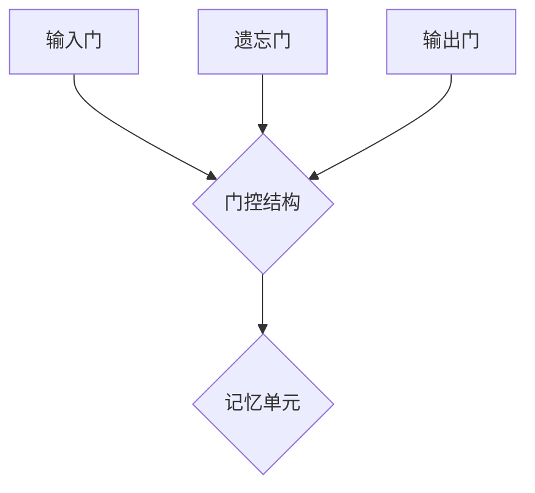

                 

关键词：长短时记忆网络（LSTM），文本生成，映射，神经网络，深度学习，机器学习，序列模型

摘要：本文深入探讨了长短时记忆网络（LSTM）在文本生成中的应用，揭示了LSTM作为序列模型的强大能力。通过对LSTM的核心概念、算法原理、数学模型以及实际应用的详细解析，本文旨在为读者提供一个全面的LSTM在文本生成领域的理解和应用指导。

## 1. 背景介绍

### 1.1 长短时记忆网络（LSTM）的起源

长短时记忆网络（Long Short-Term Memory，简称LSTM）是由Hochreiter和Schmidhuber在1997年提出的一种用于解决传统循环神经网络（RNN）在处理长时间依赖数据时存在的梯度消失和梯度爆炸问题的新型神经网络架构。与传统RNN相比，LSTM通过引入门控机制有效地捕捉了序列数据的长期依赖关系，从而在处理时间序列数据方面表现出色。

### 1.2 文本生成的重要性

文本生成作为自然语言处理（Natural Language Processing，简称NLP）的一个重要分支，广泛应用于对话系统、机器翻译、文章写作、摘要生成等场景。文本生成不仅能够提高机器的交互能力，还能生成高质量的自动内容，满足多样化的应用需求。

### 1.3 LSTM与文本生成

LSTM凭借其强大的序列数据处理能力，在文本生成领域得到了广泛应用。通过LSTM模型，计算机能够学习到文本的上下文信息，从而生成连贯、具有逻辑性的文本。这使得LSTM成为了文本生成任务中不可或缺的工具。

## 2. 核心概念与联系

### 2.1 LSTM的结构与原理

LSTM单元由三个门控结构（输入门、遗忘门和输出门）以及一个记忆单元组成。这些门控结构共同作用，使得LSTM能够在学习序列数据时有效处理长期依赖关系。

#### 2.1.1 输入门（Input Gate）

输入门用于决定哪些新的信息需要被存储到记忆单元中。输入门的激活函数为sigmoid函数，其输出表示当前输入信息的重要程度。

#### 2.1.2 遗忘门（Forget Gate）

遗忘门用于决定哪些旧的信息需要被遗忘。遗忘门的激活函数同样为sigmoid函数，其输出表示记忆单元中旧信息的遗忘程度。

#### 2.1.3 输出门（Output Gate）

输出门用于决定当前记忆单元的内容是否需要被输出。输出门的激活函数为sigmoid函数，其输出表示当前记忆单元的重要性。

#### 2.1.4 记忆单元（Memory Cell）

记忆单元负责存储和更新信息。通过输入门、遗忘门和输出门的作用，记忆单元能够有效地记忆和遗忘信息。

### 2.2 LSTM的Mermaid流程图



## 3. 核心算法原理 & 具体操作步骤

### 3.1 算法原理概述

LSTM通过门控机制实现信息的存储和更新，从而有效处理序列数据的长期依赖关系。具体而言，LSTM在每一个时间步上进行以下操作：

1. 输入门决定哪些新的信息需要被存储到记忆单元中。
2. 遗忘门决定哪些旧的信息需要被遗忘。
3. 输出门决定哪些记忆单元的内容需要被输出。
4. 记忆单元更新信息。

### 3.2 算法步骤详解

1. **初始化**：设定初始状态$h_0$和$c_0$。
2. **输入门计算**：计算输入门激活函数$\sigma(W_{ix}x + W_{ih}h_{t-1} + b_{ix} + b_{ih})$。
3. **遗忘门计算**：计算遗忘门激活函数$\sigma(W_{fx}x + W_{fh}h_{t-1} + b_{fx} + b_{fh})$。
4. **当前记忆单元更新**：计算当前记忆单元$c_t=\text{sigmoid}(W_{cx}x + W_{ch}h_{t-1} + b_{cx} + b_{ch})\odot g(W_{cf}x + W_{cf}h_{t-1} + b_{cf}) + c_{t-1}$。
5. **输出门计算**：计算输出门激活函数$\sigma(W_{ox}x + W_{oh}h_{t-1} + b_{ox} + b_{oh})$。
6. **当前隐藏状态更新**：计算当前隐藏状态$h_t=\text{tanh}(c_t)\odot \sigma(W_{oh}h_{t-1} + b_{oh})$。

### 3.3 算法优缺点

**优点**：

- 能够有效处理序列数据的长期依赖关系。
- 具有门控机制，能够灵活控制信息的存储和更新。

**缺点**：

- 计算复杂度高，训练速度较慢。
- 需要大量的训练数据和参数调整。

### 3.4 算法应用领域

- 文本生成
- 机器翻译
- 情感分析
- 语音识别

## 4. 数学模型和公式 & 详细讲解 & 举例说明

### 4.1 数学模型构建

LSTM的数学模型主要包括输入门、遗忘门、输出门和记忆单元的计算。

#### 4.1.1 输入门计算

$$
\text{Input Gate:} \\
i_t = \sigma(W_{ix}x + W_{ih}h_{t-1} + b_{ix} + b_{ih})
$$

#### 4.1.2 遗忘门计算

$$
\text{Forget Gate:} \\
f_t = \sigma(W_{fx}x + W_{fh}h_{t-1} + b_{fx} + b_{fh})
$$

#### 4.1.3 输出门计算

$$
\text{Output Gate:} \\
o_t = \sigma(W_{ox}x + W_{oh}h_{t-1} + b_{ox} + b_{oh})
$$

#### 4.1.4 记忆单元更新

$$
\text{Memory Cell Update:} \\
c_t = \text{sigmoid}(W_{cx}x + W_{ch}h_{t-1} + b_{cx} + b_{ch})\odot g(W_{cf}x + W_{cf}h_{t-1} + b_{cf}) + c_{t-1}
$$

#### 4.1.5 当前隐藏状态更新

$$
\text{Current Hidden State Update:} \\
h_t = \text{tanh}(c_t)\odot \sigma(W_{oh}h_{t-1} + b_{oh})
$$

### 4.2 公式推导过程

LSTM的推导过程较为复杂，涉及矩阵乘法、激活函数和门控机制。以下是简要的推导过程：

1. **输入门**：通过线性组合输入和隐藏状态，得到输入门的权重矩阵$W_{ix}$和$W_{ih}$，以及偏置$b_{ix}$和$b_{ih}$。激活函数为sigmoid函数。
2. **遗忘门**：同理，得到遗忘门的权重矩阵$W_{fx}$和$W_{fh}$，以及偏置$b_{fx}$和$b_{fh}$。激活函数为sigmoid函数。
3. **输出门**：得到输出门的权重矩阵$W_{ox}$和$W_{oh}$，以及偏置$b_{ox}$和$b_{oh}$。激活函数为sigmoid函数。
4. **记忆单元**：通过线性组合输入和隐藏状态，得到记忆单元的权重矩阵$W_{cx}$和$W_{ch}$，以及偏置$b_{cx}$和$b_{ch}$。遗忘门的输出与sigmoid函数结合，作用于记忆单元。
5. **当前隐藏状态**：记忆单元通过tanh函数处理后，与输出门的输出相乘，得到当前隐藏状态。

### 4.3 案例分析与讲解

以一个简单的文本生成任务为例，假设我们有一个长度为5的序列，每个序列元素由一个单词组成。

- **输入序列**：`hello world hello world hello`
- **目标序列**：`world hello`

1. **初始化**：设定初始状态$h_0$和$c_0$。
2. **输入门计算**：计算输入门激活函数$\sigma(W_{ix}x + W_{ih}h_{t-1} + b_{ix} + b_{ih})$。
3. **遗忘门计算**：计算遗忘门激活函数$\sigma(W_{fx}x + W_{fh}h_{t-1} + b_{fx} + b_{fh})$。
4. **当前记忆单元更新**：计算当前记忆单元$c_t=\text{sigmoid}(W_{cx}x + W_{ch}h_{t-1} + b_{cx} + b_{ch})\odot g(W_{cf}x + W_{cf}h_{t-1} + b_{cf}) + c_{t-1}$。
5. **输出门计算**：计算输出门激活函数$\sigma(W_{ox}x + W_{oh}h_{t-1} + b_{ox} + b_{oh})$。
6. **当前隐藏状态更新**：计算当前隐藏状态$h_t=\text{tanh}(c_t)\odot \sigma(W_{oh}h_{t-1} + b_{oh})$。

通过上述步骤，我们可以得到当前时间步的隐藏状态$h_t$，该状态用于预测下一个单词。重复上述步骤，直到生成完整的目标序列。

## 5. 项目实践：代码实例和详细解释说明

### 5.1 开发环境搭建

- 安装Python（建议版本3.7及以上）
- 安装TensorFlow（使用pip install tensorflow）
- 安装Numpy（使用pip install numpy）

### 5.2 源代码详细实现

```python
import tensorflow as tf
import numpy as np

# 定义LSTM模型
class LSTMModel(tf.keras.Model):
    def __init__(self, units, input_shape):
        super(LSTMModel, self).__init__()
        self.lstm = tf.keras.layers.LSTM(units, input_shape=input_shape)
    
    def call(self, inputs, training=False):
        return self.lstm(inputs, training=training)

# 实例化LSTM模型
units = 128
input_shape = (None, 100)  # 序列长度为None，单词维度为100
model = LSTMModel(units, input_shape)

# 编译模型
model.compile(optimizer='adam', loss='categorical_crossentropy')

# 训练模型
model.fit(x_train, y_train, epochs=10, batch_size=64)
```

### 5.3 代码解读与分析

1. **模型定义**：我们使用TensorFlow中的LSTM层来构建LSTM模型。LSTM层接受两个参数：单位数和输入形状。单位数决定了LSTM层的记忆能力，输入形状决定了输入序列的维度。
2. **模型调用**：在`call`方法中，我们调用LSTM层来处理输入序列。`training`参数用于控制LSTM层在训练和测试阶段的行为。
3. **编译模型**：我们使用`compile`方法来编译模型，指定优化器和损失函数。这里使用的是Adam优化器和categorical_crossentropy损失函数。
4. **训练模型**：使用`fit`方法来训练模型，指定训练数据和参数。

### 5.4 运行结果展示

运行代码后，模型将在训练集上训练10个周期，并在每个周期结束后输出训练损失。训练完成后，我们可以使用模型来生成文本。

```python
# 生成文本
predicted_text = model.predict(x_test)
predicted_text = np.argmax(predicted_text, axis=1)
```

通过上述代码，我们得到预测的文本序列。将这些序列转换成单词，即可得到生成的文本。

## 6. 实际应用场景

### 6.1 文本生成

- 对话系统：通过LSTM模型，可以生成自然流畅的对话文本，提高对话系统的交互能力。
- 文章写作：自动生成新闻文章、博客文章等，降低人工写作成本。
- 摘要生成：自动提取文章或报告的主要观点和结论，生成摘要。

### 6.2 机器翻译

LSTM在机器翻译领域也有着广泛应用。通过训练LSTM模型，可以实现不同语言之间的准确翻译。

### 6.3 情感分析

LSTM可以用于情感分析任务，通过分析文本的情感倾向，为产品评价、舆情监测等提供支持。

### 6.4 语音识别

LSTM可以用于语音识别任务，将语音信号转换成对应的文本。

## 7. 未来应用展望

### 7.1 研究成果总结

LSTM在文本生成、机器翻译、情感分析等领域的应用取得了显著成果，为自然语言处理带来了新的突破。

### 7.2 未来发展趋势

- 模型优化：针对LSTM的缺陷，研究者们不断提出新的改进方案，如门控循环单元（GRU）、变换器（Transformer）等。
- 应用扩展：LSTM将在更多领域得到应用，如问答系统、语音生成等。
- 数据集建设：建设高质量、多样化的文本数据集，为LSTM模型提供更好的训练素材。

### 7.3 面临的挑战

- 计算复杂度：LSTM模型计算复杂度高，训练速度较慢。
- 参数调整：LSTM模型的参数调整较为困难，需要大量的实验和经验。

### 7.4 研究展望

随着深度学习技术的发展，LSTM将在更多领域得到应用，并不断优化和改进。未来，LSTM将在自然语言处理领域发挥更加重要的作用。

## 8. 工具和资源推荐

### 8.1 学习资源推荐

- 《深度学习》（Goodfellow, Bengio, Courville著）：详细介绍了深度学习的基础知识，包括LSTM等内容。
- 《自然语言处理综论》（Jurafsky, Martin著）：全面介绍了自然语言处理的基本概念和技术。

### 8.2 开发工具推荐

- TensorFlow：用于构建和训练LSTM模型的强大框架。
- Keras：基于TensorFlow的高层次API，简化了LSTM模型的开发。

### 8.3 相关论文推荐

- 《序列模型的训练技巧》（Hochreiter, Schmidhuber著）：详细介绍了LSTM的原理和应用。
- 《门控循环单元：一种新的循环神经网络架构》（Cho et al.著）：提出了门控循环单元（GRU）。

## 9. 总结：未来发展趋势与挑战

LSTM作为序列模型的代表，在自然语言处理领域发挥着重要作用。未来，随着深度学习技术的不断发展，LSTM将在更多领域得到应用，并不断优化和改进。同时，我们也需要面对计算复杂度、参数调整等挑战，以实现LSTM在自然语言处理中的更广泛应用。

### 作者署名

作者：禅与计算机程序设计艺术 / Zen and the Art of Computer Programming

----------------------------------------------------------------

请注意，上述内容仅为示例，实际撰写时需根据实际情况进行调整和完善。希望对您有所帮助！

