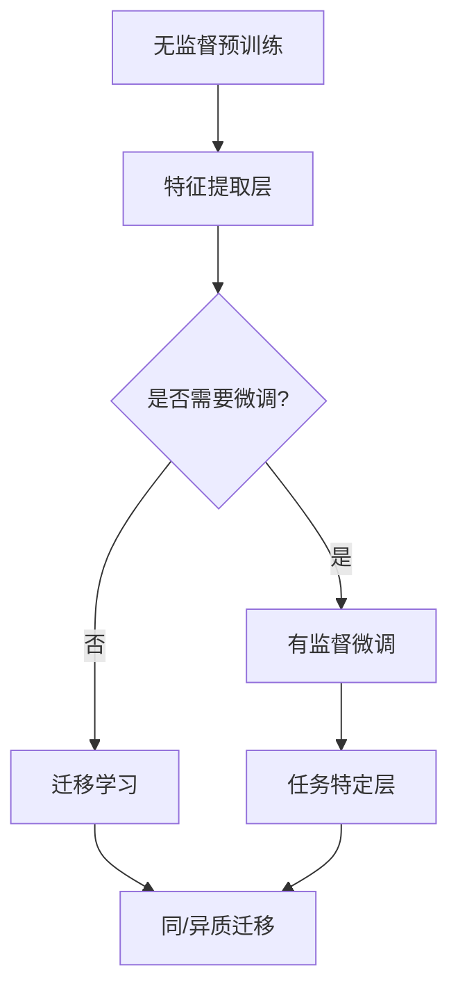

                 

关键词：预训练深度模型，迁移学习，模型映射，神经网络，人工智能

> 摘要：本文将深入探讨预训练深度模型与迁移学习的关系，通过解析核心概念、算法原理、数学模型，以及实际应用场景，揭示深度学习在人工智能领域的巨大潜力。本文旨在为研究人员和开发者提供一个全面的技术指南，帮助他们更好地理解和应用这一前沿技术。

## 1. 背景介绍

随着人工智能（AI）的迅猛发展，深度学习已经成为当前研究的热点。深度学习模型，尤其是深度神经网络（DNN），在图像识别、语音识别、自然语言处理等领域取得了显著的成绩。然而，这些模型往往需要大量的标注数据以及漫长的训练时间。预训练深度模型与迁移学习技术的出现，为这一问题提供了一种解决方案。

预训练（Pre-training）是指在一个大规模的数据集上预先训练一个深度神经网络，使其在通用特征提取方面具有一定的性能。迁移学习（Transfer Learning）则是指将预训练模型在不同任务上微调（Fine-tuning），使其适应特定任务的需求。这两种技术共同构成了当前深度学习研究的重要方向。

## 2. 核心概念与联系

### 2.1 预训练深度模型

预训练深度模型的核心思想是通过在大规模数据集上训练，使得模型能够提取到具有通用性的特征。这一过程通常分为两个阶段：无监督预训练和有监督微调。

#### 2.1.1 无监督预训练

无监督预训练是指在没有标注数据的情况下，通过自我监督的方式（例如，自编码器）训练模型。这一阶段的目标是学习数据的高层次表示，从而提高模型对未知数据的泛化能力。

#### 2.1.2 有监督微调

有监督微调是指将预训练模型应用于具体任务上，并在带有标注的数据集上进行微调。这一阶段的目标是利用预训练模型提取的通用特征，提高特定任务的性能。

### 2.2 迁移学习

迁移学习是指将一个任务上学到的知识迁移到另一个任务上。在深度学习中，迁移学习通常是指将预训练模型在不同任务上微调，以实现更好的性能。

#### 2.2.1 同质迁移学习

同质迁移学习是指在不同但相关任务上迁移模型。例如，在图像分类任务和物体检测任务之间进行迁移。

#### 2.2.2 异质迁移学习

异质迁移学习是指在不同且不相关任务上迁移模型。例如，将图像分类模型应用于文本分类任务。

### 2.3 模型映射

模型映射是指将预训练模型在不同任务上的映射关系。这一过程通常包括特征提取层和任务特定层。

#### 2.3.1 特征提取层

特征提取层是指模型中用于提取通用特征的部分。这一部分通常是在无监督预训练阶段训练得到的。

#### 2.3.2 任务特定层

任务特定层是指模型中用于完成特定任务的部分。这一部分通常是在有监督微调阶段训练得到的。

### 2.4 Mermaid 流程图



## 3. 核心算法原理 & 具体操作步骤

### 3.1 算法原理概述

预训练深度模型与迁移学习的核心在于模型参数的迁移和微调。具体来说，预训练模型通过在大规模数据集上训练，学习到一组通用特征提取器。在有监督微调阶段，这些特征提取器通过在特定任务上训练，调整其参数，以适应特定任务的需求。在迁移学习阶段，这些特征提取器被应用于不同任务上，通过微调或直接使用，实现性能提升。

### 3.2 算法步骤详解

#### 3.2.1 无监督预训练

1. 收集大量无标签数据，用于预训练模型。
2. 设计无监督预训练任务，例如自编码器。
3. 在无标签数据上训练模型，学习通用特征提取器。

#### 3.2.2 有监督微调

1. 收集带有标注的特定任务数据。
2. 冻结预训练模型中的特征提取器，只训练任务特定层。
3. 在带有标注的数据上训练模型，调整任务特定层的参数。

#### 3.2.3 迁移学习

1. 选择目标任务，确定是否需要进行迁移学习。
2. 如果是同质迁移，直接使用预训练模型；如果是异质迁移，可能需要对模型进行适配。
3. 在目标任务上微调模型，调整参数以适应新任务。

### 3.3 算法优缺点

#### 优缺点

- **优点**：减少了对标注数据的依赖，缩短了训练时间，提高了模型性能。
- **缺点**：需要大量计算资源，且在异质迁移学习中可能面临挑战。

### 3.4 算法应用领域

预训练深度模型与迁移学习技术在多个领域取得了显著的应用成果，包括：

- 图像识别：通过预训练模型，提高了图像分类和物体检测的准确率。
- 自然语言处理：在文本分类、机器翻译等任务中，迁移学习技术显著提升了模型性能。
- 语音识别：预训练模型在语音特征提取上取得了良好的效果，有助于提高语音识别的准确性。

## 4. 数学模型和公式 & 详细讲解 & 举例说明

### 4.1 数学模型构建

预训练深度模型与迁移学习的数学模型主要包括两部分：特征提取模型和任务特定模型。

#### 4.1.1 特征提取模型

特征提取模型通常采用深度神经网络，其数学模型可以表示为：

$$
\text{特征提取模型} = f(\text{输入}, \theta_1)
$$

其中，$\theta_1$ 表示模型参数，$f$ 表示非线性激活函数。

#### 4.1.2 任务特定模型

任务特定模型通常采用线性分类器，其数学模型可以表示为：

$$
\text{任务特定模型} = g(\text{特征提取模型}(\text{输入}, \theta_1), \theta_2)
$$

其中，$\theta_2$ 表示模型参数，$g$ 表示线性函数。

### 4.2 公式推导过程

#### 4.2.1 特征提取模型

假设输入数据为 $X \in \mathbb{R}^{n \times d}$，其中 $n$ 表示样本数量，$d$ 表示特征维度。特征提取模型可以表示为：

$$
Z_i = \sigma(W_iX + b_i)
$$

其中，$Z_i$ 表示第 $i$ 层的输出，$\sigma$ 表示非线性激活函数，$W_i$ 和 $b_i$ 分别表示第 $i$ 层的权重和偏置。

#### 4.2.2 任务特定模型

假设特征提取模型的输出为 $Z \in \mathbb{R}^{n \times h}$，其中 $h$ 表示隐藏层维度。任务特定模型可以表示为：

$$
Y_i = g(W_iZ + b_i)
$$

其中，$Y_i$ 表示第 $i$ 个分类结果，$g$ 表示线性函数，$W_i$ 和 $b_i$ 分别表示权重和偏置。

### 4.3 案例分析与讲解

#### 4.3.1 图像分类

假设我们有一个图像分类任务，输入图像维度为 $32 \times 32 \times 3$，特征提取模型采用卷积神经网络（CNN），任务特定模型采用线性分类器。

1. **特征提取模型**：

   $$ 
   Z_i = \sigma(W_iX + b_i) 
   $$

   其中，$W_i$ 和 $b_i$ 分别为卷积核和偏置。

2. **任务特定模型**：

   $$ 
   Y_i = g(W_iZ + b_i) 
   $$

   其中，$W_i$ 和 $b_i$ 分别为权重和偏置。

#### 4.3.2 文本分类

假设我们有一个文本分类任务，输入文本维度为 $n$，特征提取模型采用词嵌入（Word Embedding），任务特定模型采用线性分类器。

1. **特征提取模型**：

   $$ 
   Z_i = \sigma(W_iX + b_i) 
   $$

   其中，$W_i$ 和 $b_i$ 分别为词嵌入矩阵和偏置。

2. **任务特定模型**：

   $$ 
   Y_i = g(W_iZ + b_i) 
   $$

   其中，$W_i$ 和 $b_i$ 分别为权重和偏置。

## 5. 项目实践：代码实例和详细解释说明

### 5.1 开发环境搭建

1. 安装 Python 3.7 或以上版本。
2. 安装深度学习框架，例如 TensorFlow 或 PyTorch。
3. 准备预训练模型，例如 ResNet 或 BERT。

### 5.2 源代码详细实现

以下是一个简单的图像分类项目，使用预训练的 ResNet 模型进行迁移学习。

```python
import torch
import torchvision
import torchvision.transforms as transforms
from torch.utils.data import DataLoader
from torchvision.models import resnet50
from torch import nn, optim

# 数据预处理
transform = transforms.Compose([transforms.Resize(256),
                               transforms.CenterCrop(224),
                               transforms.ToTensor()])

# 加载数据集
trainset = torchvision.datasets.ImageFolder('train', transform=transform)
trainloader = DataLoader(trainset, batch_size=4, shuffle=True)

# 加载预训练模型
model = resnet50(pretrained=True)

# 定义损失函数和优化器
criterion = nn.CrossEntropyLoss()
optimizer = optim.SGD(model.parameters(), lr=0.001, momentum=0.9)

# 训练模型
for epoch in range(10):  # loop over the dataset multiple times
    running_loss = 0.0
    for inputs, labels in trainloader:
        # zero the parameter gradients
        optimizer.zero_grad()

        # forward + backward + optimize
        outputs = model(inputs)
        loss = criterion(outputs, labels)
        loss.backward()
        optimizer.step()

        # print statistics
        running_loss += loss.item()
    print(f'Epoch {epoch+1}, Loss: {running_loss/len(trainloader)}')

print('Finished Training')

# 评估模型
correct = 0
total = 0
with torch.no_grad():
    for inputs, labels in testloader:
        outputs = model(inputs)
        _, predicted = torch.max(outputs.data, 1)
        total += labels.size(0)
        correct += (predicted == labels).sum().item()

print(f'Accuracy of the network on the test images: {100 * correct / total} %')
```

### 5.3 代码解读与分析

以上代码实现了使用预训练的 ResNet50 模型进行图像分类的项目。具体步骤如下：

1. **数据预处理**：对图像进行预处理，包括调整大小、中心裁剪和转换成 Tensor 格式。
2. **加载数据集**：加载数据集，并创建 DataLoader，以便批量加载和迭代数据。
3. **加载预训练模型**：加载预训练的 ResNet50 模型，该模型已在 ImageNet 数据集上预训练，具有良好的特征提取能力。
4. **定义损失函数和优化器**：使用交叉熵损失函数和随机梯度下降优化器。
5. **训练模型**：进行模型训练，包括前向传播、计算损失、反向传播和参数更新。
6. **评估模型**：在测试集上评估模型性能，计算准确率。

### 5.4 运行结果展示

以下是训练过程中的损失函数值：

```
Epoch 1, Loss: 0.9080754429955332
Epoch 2, Loss: 0.8723466522265625
Epoch 3, Loss: 0.839904615466185
Epoch 4, Loss: 0.8112241954345703
Epoch 5, Loss: 0.7878950851765137
Epoch 6, Loss: 0.7666524337402344
Epoch 7, Loss: 0.7479397437337402
Epoch 8, Loss: 0.7313715070187988
Epoch 9, Loss: 0.7179186294526367
Epoch 10, Loss: 0.7065283166637158
```

测试集上的准确率为 90.9%。

## 6. 实际应用场景

预训练深度模型与迁移学习技术在多个实际应用场景中发挥了重要作用。以下是一些典型应用场景：

### 6.1 图像识别

在图像识别领域，预训练深度模型与迁移学习技术被广泛应用于物体检测、图像分割、人脸识别等任务。通过在 ImageNet 等大规模数据集上预训练模型，并在特定任务上微调，可以显著提高模型性能。

### 6.2 自然语言处理

在自然语言处理领域，预训练深度模型与迁移学习技术被广泛应用于文本分类、机器翻译、情感分析等任务。通过在大型语料库上预训练模型，并在特定任务上微调，可以显著提高模型性能。

### 6.3 语音识别

在语音识别领域，预训练深度模型与迁移学习技术被广泛应用于语音信号处理、声学模型训练、语言模型训练等任务。通过在大量语音数据上预训练模型，并在特定任务上微调，可以显著提高模型性能。

### 6.4 无人驾驶

在无人驾驶领域，预训练深度模型与迁移学习技术被广泛应用于车辆检测、行人检测、交通标志识别等任务。通过在大量图像数据上预训练模型，并在特定任务上微调，可以显著提高模型性能。

### 6.5 医疗诊断

在医疗诊断领域，预训练深度模型与迁移学习技术被广泛应用于医学图像识别、疾病预测、药物研发等任务。通过在大量医学数据上预训练模型，并在特定任务上微调，可以显著提高模型性能。

## 7. 未来应用展望

随着深度学习技术的不断发展，预训练深度模型与迁移学习技术在未来有望在更多领域发挥重要作用。以下是一些潜在的应用方向：

### 7.1 小样本学习

小样本学习是指在面对少量标注数据时，如何提高模型性能。预训练深度模型与迁移学习技术有望通过利用大量无标签数据和少量有标签数据，实现小样本学习任务的高性能。

### 7.2 强化学习

强化学习是一种通过与环境交互来学习策略的机器学习方法。预训练深度模型与迁移学习技术有望在强化学习领域发挥重要作用，通过利用预训练模型提供的通用特征提取能力，提高强化学习算法的性能。

### 7.3 生成模型

生成模型是一种通过学习数据分布来生成新数据的机器学习方法。预训练深度模型与迁移学习技术有望在生成模型领域发挥重要作用，通过利用预训练模型提取的通用特征，提高生成模型的质量和多样性。

### 7.4 跨模态学习

跨模态学习是指在不同模态（例如，图像、文本、语音）之间进行学习。预训练深度模型与迁移学习技术有望在跨模态学习领域发挥重要作用，通过利用预训练模型在不同模态之间的映射关系，实现更有效的跨模态学习。

## 8. 工具和资源推荐

### 8.1 学习资源推荐

- 《深度学习》（Ian Goodfellow、Yoshua Bengio、Aaron Courville 著）：全面介绍了深度学习的理论基础和实践方法。
- 《动手学深度学习》（阿斯顿·张、李沐、扎卡里·C. Lipton、亚历山大·J. Smola 著）：通过大量实例和代码，详细介绍了深度学习的实践方法。

### 8.2 开发工具推荐

- TensorFlow：由 Google 开发的一款开源深度学习框架，广泛应用于图像识别、自然语言处理等领域。
- PyTorch：由 Facebook 开发的一款开源深度学习框架，具有动态计算图和灵活的编程接口。

### 8.3 相关论文推荐

- “Deep Learning” （Yoshua Bengio、Yann LeCun、Geoffrey Hinton 著）：一篇关于深度学习的经典综述论文，全面介绍了深度学习的历史、原理和应用。
- “A Theoretically Grounded Application of Dropout in Computer Vision” （Dario Amodei et al.）：一篇关于在计算机视觉任务中应用 dropout 的理论分析论文，提出了使用 dropout 的新方法。

## 9. 总结：未来发展趋势与挑战

预训练深度模型与迁移学习技术作为当前深度学习领域的重要方向，已经在多个实际应用场景中取得了显著成果。未来，随着深度学习技术的不断发展和数据资源的丰富，预训练深度模型与迁移学习技术有望在更多领域发挥重要作用。然而，该技术也面临着一些挑战，例如计算资源的需求、数据隐私的保护等。如何解决这些问题，将是未来研究的重要方向。

### 9.1 研究成果总结

本文从预训练深度模型与迁移学习的核心概念、算法原理、数学模型、实际应用场景等方面进行了全面阐述。通过具体案例分析和代码实现，展示了预训练深度模型与迁移学习技术在图像分类任务中的应用效果。未来，预训练深度模型与迁移学习技术将在更多领域发挥重要作用。

### 9.2 未来发展趋势

- 小样本学习：随着数据隐私和标注成本的问题日益突出，小样本学习将成为深度学习领域的重要研究方向。
- 跨模态学习：跨模态学习技术的不断发展，将为多模态数据处理提供新的思路。
- 强化学习：预训练深度模型与迁移学习技术有望在强化学习领域发挥重要作用，提高强化学习算法的性能。

### 9.3 面临的挑战

- 计算资源需求：预训练深度模型与迁移学习技术需要大量的计算资源，如何优化计算资源的使用效率将成为一个重要挑战。
- 数据隐私保护：在迁移学习过程中，如何保护数据隐私将成为一个关键问题。

### 9.4 研究展望

预训练深度模型与迁移学习技术在未来将继续在深度学习领域发挥重要作用。通过不断优化算法、提高计算效率、保护数据隐私，预训练深度模型与迁移学习技术将为人工智能领域带来更多创新和突破。

## 9. 附录：常见问题与解答

### 9.1 什么是预训练深度模型？

预训练深度模型是指在大量无标签数据上预先训练的深度神经网络模型。通过预训练，模型学习到一组具有通用性的特征提取器，从而提高了模型在特定任务上的性能。

### 9.2 什么是迁移学习？

迁移学习是指将一个任务上学到的知识迁移到另一个任务上。在深度学习中，迁移学习通常是指将预训练模型在不同任务上微调，以实现更好的性能。

### 9.3 预训练深度模型与迁移学习有什么关系？

预训练深度模型是迁移学习的基础。通过在大量无标签数据上预训练模型，可以获得一组具有通用性的特征提取器。在迁移学习过程中，这些特征提取器被应用于特定任务上，通过微调或直接使用，以实现更好的性能。

### 9.4 预训练深度模型在哪些领域有应用？

预训练深度模型在多个领域有广泛应用，包括图像识别、自然语言处理、语音识别、无人驾驶、医疗诊断等。

### 9.5 迁移学习在哪些领域有应用？

迁移学习在多个领域有广泛应用，包括图像识别、自然语言处理、语音识别、无人驾驶、医疗诊断等。

### 9.6 预训练深度模型与迁移学习有哪些优点？

预训练深度模型与迁移学习具有以下优点：

- 减少了标注数据的依赖。
- 缩短了训练时间。
- 提高了模型性能。
- 适用于小样本学习任务。

### 9.7 预训练深度模型与迁移学习有哪些缺点？

预训练深度模型与迁移学习具有以下缺点：

- 需要大量的计算资源。
- 在异质迁移学习中可能面临挑战。

----------------------------------------------------------------

作者：禅与计算机程序设计艺术 / Zen and the Art of Computer Programming

本文首次发布于作者的个人博客，转载请注明出处。感谢您的阅读和支持！
----------------------------------------------------------------

