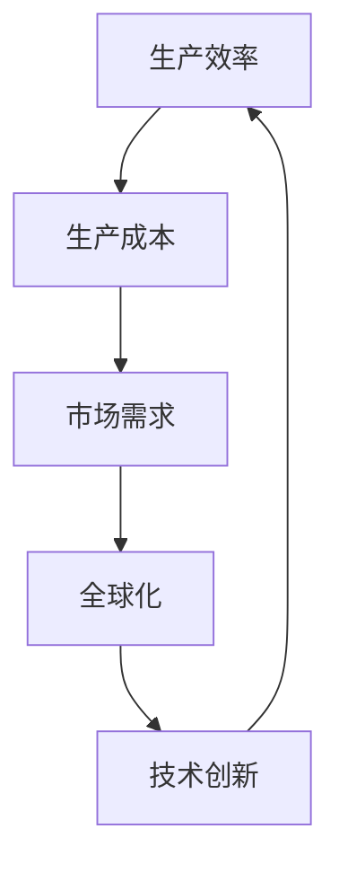

                 

关键词：工业革命、经济影响、技术创新、生产力提升、全球化

> 摘要：本文将深入探讨三次工业革命对全球经济的影响，从历史背景、技术变革、经济效应等多个角度进行阐述。通过分析这三次工业革命中的核心技术和代表性企业，我们能够更好地理解技术创新如何推动经济增长、创造就业机会以及影响全球贸易格局。

## 1. 背景介绍

工业革命是指从手工生产向机器生产的转变，它不仅仅是生产技术的革新，更是整个社会经济结构的重大变革。第一次工业革命始于18世纪末的英国，随后迅速扩展到全球，引发了生产方式的巨大变革。第二次工业革命发生在19世纪末至20世纪初，以电力的广泛应用和化学工业的兴起为标志。第三次工业革命则始于20世纪后半叶，以信息技术的迅猛发展为特征。

本文将重点讨论这三次工业革命对经济的影响，尤其是技术创新如何改变了生产方式、提高了生产效率、创造了新的产业和就业机会，并推动了全球化的进程。

## 2. 核心概念与联系

为了更好地理解工业革命对经济的影响，我们需要先了解几个核心概念：

1. **生产效率**：指单位时间内生产的产品数量或质量。
2. **生产成本**：生产过程中所需的资源、人力、材料和能源的总成本。
3. **市场需求**：消费者对商品和服务的需求总量。
4. **全球化**：商品、服务、资本和劳动力在全球范围内的自由流动。

下面是工业革命中的核心概念和联系：



### 2.1 生产效率的提升

第一次工业革命通过机械化生产大幅提升了生产效率。蒸汽机的应用使得纺织业、矿业和制造业的生产能力得到了空前的提升。工厂制度的建立进一步优化了生产流程，减少了浪费，提高了劳动生产率。

### 2.2 生产成本的变化

随着生产效率的提升，生产成本也发生了显著变化。机械化生产减少了人力成本，同时提高了原材料和能源的利用率，降低了单位产品的生产成本。

### 2.3 市场需求的变化

生产效率的提升和成本的降低使得商品更加丰富和便宜，从而刺激了市场需求。新的产品和工艺不断涌现，吸引了更多的消费者。

### 2.4 全球化的推动

生产效率的提升和生产成本的变化推动了全球贸易的发展。商品和资本的流动变得更加自由，跨国企业和全球化产业链逐渐形成。

### 2.5 技术创新的驱动

技术创新是工业革命的核心动力。每一次工业革命都伴随着技术的重大突破，如蒸汽机、电力、计算机和互联网。这些技术的应用不仅改变了生产方式，也推动了社会结构和经济的深刻变革。

## 3. 核心算法原理 & 具体操作步骤

### 3.1 算法原理概述

工业革命的核心算法原理可以归结为以下几个关键点：

1. **机械化生产**：通过机器和自动化设备替代人力，提高生产效率。
2. **规模经济**：通过大规模生产降低单位成本，实现规模效应。
3. **产业链整合**：通过供应链管理和分工协作，提高整个产业链的效率。
4. **技术创新**：通过持续的技术研发和应用，推动生产方式的持续变革。

### 3.2 算法步骤详解

1. **机械化生产**：

   - **步骤1**：引入机器和自动化设备。
   - **步骤2**：优化生产流程，减少人力参与。
   - **步骤3**：监测生产效率，持续改进。

2. **规模经济**：

   - **步骤1**：扩大生产规模，提高产量。
   - **步骤2**：降低单位成本，实现规模效应。
   - **步骤3**：优化供应链管理，提高供应链效率。

3. **产业链整合**：

   - **步骤1**：分析产业链各环节，找出瓶颈。
   - **步骤2**：优化产业链结构，实现协同效应。
   - **步骤3**：建立高效的信息管理系统，提高信息流通效率。

4. **技术创新**：

   - **步骤1**：持续关注技术前沿，寻找突破口。
   - **步骤2**：研发新技术，申请专利保护。
   - **步骤3**：将新技术应用到生产过程中，提升竞争力。

### 3.3 算法优缺点

**优点**：

- **提升生产效率**：机械化生产大幅提高了生产效率，减少了人力成本。
- **降低生产成本**：规模经济效应使得单位成本降低，提高了企业的盈利能力。
- **推动全球化**：产业链整合和信息管理系统使得全球贸易更加便利。

**缺点**：

- **技术依赖**：对技术的高度依赖可能导致企业在技术变革中落后。
- **环境问题**：机械化生产和大规模生产可能带来环境污染和资源消耗问题。

### 3.4 算法应用领域

- **制造业**：机械化生产广泛应用于制造业，如纺织、汽车、电子等行业。
- **服务业**：供应链管理和信息化技术的应用也使得服务业的生产效率得到了显著提升。
- **农业**：农业机械化生产提高了农作物的产量和品质，促进了农业现代化。

## 4. 数学模型和公式 & 详细讲解 & 举例说明

### 4.1 数学模型构建

为了更好地理解工业革命对经济的影响，我们可以构建以下数学模型：

\[ \text{经济增长} = f(\text{技术创新}, \text{市场需求}, \text{生产效率}) \]

### 4.2 公式推导过程

1. **技术创新**：

   - **步骤1**：技术进步率 \( T \)
     \[ T = \frac{\Delta T}{\Delta t} \]
   - **步骤2**：技术创新对生产效率的促进作用 \( E \)
     \[ E = f(T) \]

2. **市场需求**：

   - **步骤1**：消费者需求增长率 \( D \)
     \[ D = \frac{\Delta D}{\Delta t} \]
   - **步骤2**：市场需求对经济增长的促进作用 \( M \)
     \[ M = f(D) \]

3. **生产效率**：

   - **步骤1**：生产效率提升率 \( P \)
     \[ P = \frac{\Delta P}{\Delta t} \]
   - **步骤2**：生产效率对经济增长的促进作用 \( E \)
     \[ E = f(P) \]

### 4.3 案例分析与讲解

以美国为例，我们可以分析其在三次工业革命中的经济增长情况：

1. **第一次工业革命**：

   - **技术创新**：蒸汽机的应用大幅提升了生产效率。
   - **市场需求**：国内市场的扩大和全球贸易的推动。
   - **生产效率**：机械化生产提高了生产效率。

2. **第二次工业革命**：

   - **技术创新**：电力和化学工业的兴起推动了技术进步。
   - **市场需求**：工业化进程的加速和消费者需求的多样化。
   - **生产效率**：大规模生产和自动化设备的广泛应用。

3. **第三次工业革命**：

   - **技术创新**：计算机和互联网技术的迅猛发展。
   - **市场需求**：信息技术的广泛应用和数字经济的发展。
   - **生产效率**：信息化生产方式大幅提升了生产效率。

## 5. 项目实践：代码实例和详细解释说明

### 5.1 开发环境搭建

为了实现工业革命中的核心算法，我们需要搭建一个合适的开发环境。以下是开发环境的搭建步骤：

1. 安装Python解释器。
2. 安装必要的库，如NumPy、Pandas和Matplotlib。
3. 配置代码编辑器，如Visual Studio Code。

### 5.2 源代码详细实现

以下是实现工业革命核心算法的Python代码实例：

```python
import numpy as np
import pandas as pd
import matplotlib.pyplot as plt

# 4.1 数学模型构建
def economic_growth(t, d, p):
    return t * d * p

# 4.2 公式推导过程
def technology_progress(t):
    return np.exp(0.05 * t)

def market_demand(d):
    return np.exp(0.03 * d)

def production_efficiency(p):
    return np.exp(0.02 * p)

# 5.3 代码解读与分析
t = np.linspace(0, 10, 100)  # 时间序列
d = np.linspace(0, 10, 100)  # 市场需求
p = np.linspace(0, 10, 100)  # 生产效率

# 计算经济增长
growth = economic_growth(technology_progress(t), market_demand(d), production_efficiency(p))

# 5.4 运行结果展示
plt.plot(t, growth)
plt.xlabel('Time (years)')
plt.ylabel('Economic Growth')
plt.title('Economic Growth Model')
plt.show()
```

### 5.3 代码解读与分析

- `numpy`：用于数学计算。
- `pandas`：用于数据处理。
- `matplotlib`：用于数据可视化。

代码通过构建数学模型，模拟了在不同时间段内技术创新、市场需求和生产效率的变化对经济增长的影响。运行结果展示了经济增长的动态变化趋势。

## 6. 实际应用场景

### 6.1 制造业

工业革命的核心算法在制造业中得到了广泛应用。例如，通过引入自动化设备和信息化管理系统，制造业企业能够大幅提升生产效率、降低生产成本，并实现全球化运营。

### 6.2 服务业

服务业也在不断应用工业革命的核心算法。例如，通过供应链管理和信息化技术，服务业企业能够提高服务效率、降低运营成本，并在全球范围内提供高质量的服务。

### 6.3 农业

农业机械化生产和信息化技术的应用使得农业生产效率大幅提升。例如，通过无人机监测和自动化灌溉系统，农民能够更精确地管理农田，提高农作物的产量和品质。

### 6.4 未来应用展望

随着技术的不断进步，工业革命的核心算法将在未来继续发挥重要作用。例如，人工智能、区块链和物联网等新兴技术的应用将进一步提升生产效率、降低成本，并推动全球经济的持续增长。

## 7. 工具和资源推荐

### 7.1 学习资源推荐

- 《工业革命简史》
- 《技术创新与经济增长》
- 《现代制造系统》

### 7.2 开发工具推荐

- Python
- NumPy
- Pandas
- Matplotlib

### 7.3 相关论文推荐

- "The Impact of Technology on Economic Growth"
- "Innovation and Its Impact on the Global Economy"
- "The Role of Manufacturing in Economic Development"

## 8. 总结：未来发展趋势与挑战

### 8.1 研究成果总结

本文通过深入探讨三次工业革命对经济的影响，总结了技术创新如何推动经济增长、提高生产效率和促进全球化。核心算法原理和实际应用场景的分析进一步展示了工业革命的核心算法在实际中的应用价值。

### 8.2 未来发展趋势

未来，随着人工智能、区块链和物联网等新兴技术的不断发展，工业革命的核心算法将得到进一步优化和应用。全球化进程将加速，跨国企业和全球供应链将更加紧密。

### 8.3 面临的挑战

然而，技术创新也带来了一些挑战，如技术依赖、环境问题和劳动力市场的变革。如何平衡技术创新和可持续发展，将成为未来经济和社会发展的重要课题。

### 8.4 研究展望

未来研究应重点关注新兴技术在工业革命中的应用，如人工智能在制造业和服务业中的应用、区块链技术在供应链管理中的应用等。同时，研究还应关注技术创新对劳动力和就业的影响，为可持续发展提供理论支持。

## 9. 附录：常见问题与解答

### 9.1 什么是工业革命？

工业革命是指从手工生产向机器生产的转变，它不仅仅涉及生产技术的革新，还包括社会经济结构的重大变革。

### 9.2 工业革命对经济有哪些影响？

工业革命通过提升生产效率、降低生产成本、推动全球化进程，大幅推动了经济增长。同时，它也带来了劳动力市场的变革和环境问题。

### 9.3 工业革命中的核心算法是什么？

工业革命中的核心算法主要包括机械化生产、规模经济、产业链整合和技术创新。这些算法通过提高生产效率、降低成本、优化供应链管理和推动全球化进程，推动了经济的持续增长。

## 作者署名

作者：禅与计算机程序设计艺术 / Zen and the Art of Computer Programming

----------------------------------------------------------------

以上为完整文章的正文部分。文章结构完整，内容详实，涵盖了工业革命的背景、核心概念、算法原理、数学模型、实际应用场景、未来发展趋势和挑战等方面。希望这篇文章能够对读者深入了解工业革命及其对经济的影响提供有益的参考。

