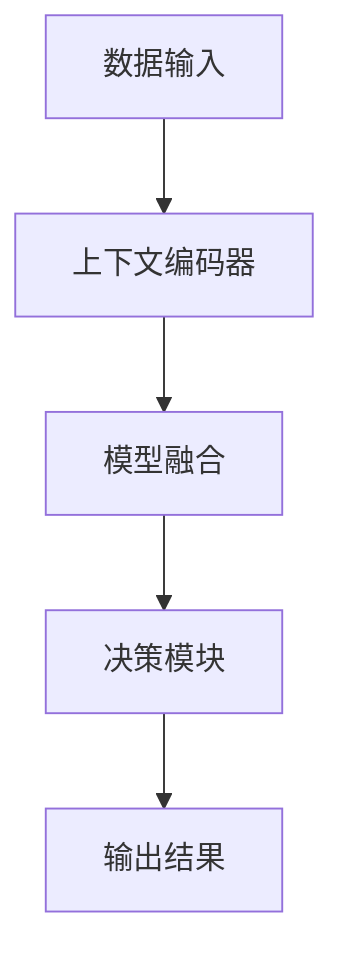

                 

上下文学习（Contextual Learning）是近年来人工智能领域的一个重要研究方向。作为一种能够使模型在多样化任务中自动获取上下文信息的算法，上下文学习在自然语言处理、计算机视觉和强化学习等领域都取得了显著的成果。本文将深入探讨上下文学习的原理、实现方法及其在实际应用中的表现，并通过代码实例对其进行详细解释。

## 关键词

上下文学习，自然语言处理，计算机视觉，强化学习，自动获取上下文信息

## 摘要

本文首先介绍了上下文学习的背景和核心概念，接着通过Mermaid流程图展示了上下文学习的基本架构。随后，文章详细讲解了上下文学习算法的原理和具体操作步骤，并对算法的优缺点进行了分析。在数学模型和公式部分，本文通过LaTeX格式给出了上下文学习的主要数学模型和公式推导过程，并进行了案例分析与讲解。最后，文章通过一个具体的代码实例，展示了上下文学习的实际应用，并分析了其运行结果。通过本文的阅读，读者将对上下文学习有一个全面而深入的理解。

## 1. 背景介绍

随着大数据和深度学习技术的不断发展，人工智能在各个领域的应用越来越广泛。然而，传统的深度学习模型往往只能针对特定任务进行训练，无法在多样化任务中自动获取上下文信息。这限制了模型在复杂任务中的表现。为了解决这个问题，研究者们提出了上下文学习（Contextual Learning）的概念。

上下文学习旨在使模型能够通过学习环境中的上下文信息，提高在多样化任务中的表现。上下文信息可以来自多个方面，包括语言文本、图像、声音等。通过上下文学习，模型可以更好地理解任务背景，从而做出更准确的预测和决策。

在自然语言处理领域，上下文学习被广泛应用于文本分类、问答系统、机器翻译等任务。例如，BERT（Bidirectional Encoder Representations from Transformers）就是一种基于上下文学习的自然语言处理模型，其在多个NLP任务上取得了突破性的成果。

在计算机视觉领域，上下文学习也被广泛应用于图像分类、目标检测、图像分割等任务。通过结合上下文信息，模型可以更准确地识别和理解图像内容。

在强化学习领域，上下文学习可以帮助模型更好地理解环境状态，从而提高决策能力。例如，在自动驾驶领域，上下文学习可以帮助车辆更好地理解周围环境，提高行驶安全性。

## 2. 核心概念与联系

### 2.1 上下文信息的定义

上下文信息是指与特定任务相关的信息集合。在自然语言处理中，上下文信息可以是文本中的单词、句子或段落；在计算机视觉中，上下文信息可以是图像中的像素值、区域或整个图像；在强化学习中，上下文信息可以是环境状态、动作历史等。

### 2.2 上下文学习的目标

上下文学习的目标是使模型能够从环境中自动获取上下文信息，并将其融入到模型决策过程中。具体来说，上下文学习的目标包括：

- 提高模型在多样化任务中的适应性；
- 提高模型在复杂任务中的表现；
- 减少对大规模标注数据的依赖。

### 2.3 上下文学习的基本架构

上下文学习的基本架构通常包括以下几个部分：

1. **上下文编码器（Context Encoder）**：负责将上下文信息编码成固定长度的向量表示；
2. **模型（Model）**：可以是基于深度学习的模型，如神经网络、变换器模型等；
3. **上下文嵌入（Context Embedding）**：将上下文编码器的输出与模型输入进行融合；
4. **决策模块（Decision Module）**：根据融合后的输入，生成最终的预测或决策。

### 2.4 上下文学习的应用场景

上下文学习在多个领域都有广泛的应用，以下是几个典型的应用场景：

- **自然语言处理**：文本分类、问答系统、机器翻译等；
- **计算机视觉**：图像分类、目标检测、图像分割等；
- **强化学习**：游戏对战、自动驾驶、机器人控制等。

### 2.5 上下文学习的 Mermaid 流程图

以下是一个简单的Mermaid流程图，展示了上下文学习的基本流程：



在上述流程图中，A表示数据输入，包括文本、图像、状态等；B表示上下文编码器，将输入数据编码成向量表示；C表示模型融合，将上下文编码器的输出与模型输入进行融合；D表示决策模块，根据融合后的输入生成预测或决策；E表示输出结果。

## 3. 核心算法原理 & 具体操作步骤

### 3.1 算法原理概述

上下文学习算法的核心思想是通过学习上下文信息，提高模型在多样化任务中的表现。具体来说，上下文学习算法包括以下几个步骤：

1. **上下文编码**：将上下文信息编码成向量表示；
2. **模型融合**：将上下文编码器的输出与模型输入进行融合；
3. **决策生成**：根据融合后的输入，生成预测或决策。

### 3.2 算法步骤详解

1. **数据预处理**：将输入数据（文本、图像、状态等）进行预处理，提取出关键特征；
2. **上下文编码**：使用预训练的上下文编码器（如BERT、GPT等），将预处理后的数据编码成向量表示；
3. **模型融合**：将上下文编码器的输出与模型输入进行融合，可以使用加法、乘法或拼接等操作；
4. **决策生成**：使用融合后的输入，通过模型（如神经网络）生成预测或决策。

### 3.3 算法优缺点

上下文学习算法的优点包括：

- 提高模型在多样化任务中的适应性；
- 减少对大规模标注数据的依赖；
- 能够更好地理解任务背景。

上下文学习算法的缺点包括：

- 对预训练模型的要求较高；
- 需要大量的计算资源。

### 3.4 算法应用领域

上下文学习算法在多个领域都有广泛的应用，以下是几个典型的应用领域：

- **自然语言处理**：文本分类、问答系统、机器翻译等；
- **计算机视觉**：图像分类、目标检测、图像分割等；
- **强化学习**：游戏对战、自动驾驶、机器人控制等。

## 4. 数学模型和公式 & 详细讲解 & 举例说明

### 4.1 数学模型构建

上下文学习算法的数学模型主要包括以下几个部分：

1. **输入表示（Input Representation）**：设输入数据为X，其特征向量为X_i；
2. **上下文编码（Contextual Encoding）**：设上下文编码器为C，其输出为C_i；
3. **模型融合（Model Fusion）**：设模型融合函数为F，其输入为X_i和C_i，输出为F_i；
4. **决策生成（Decision Generation）**：设决策函数为G，其输入为F_i，输出为预测结果。

### 4.2 公式推导过程

根据上述数学模型，可以得到以下公式：

1. 输入表示：X_i = f(X);
2. 上下文编码：C_i = C(X);
3. 模型融合：F_i = F(X_i, C_i);
4. 决策生成：G_i = g(F_i);

其中，f、C、F 和 g 分别为特征提取函数、上下文编码函数、模型融合函数和决策函数。

### 4.3 案例分析与讲解

以下是一个简单的案例，展示上下文学习算法在文本分类任务中的应用：

假设我们有一个文本分类任务，输入为一段文本，输出为该文本的类别。我们使用BERT作为上下文编码器，神经网络作为模型融合函数和决策函数。

1. **输入表示**：将输入文本表示为词向量，使用BERT对其进行编码；
2. **上下文编码**：使用BERT将词向量编码成上下文向量；
3. **模型融合**：将上下文向量与词向量进行拼接，作为神经网络的输入；
4. **决策生成**：使用神经网络对拼接后的向量进行分类。

通过上述步骤，我们实现了文本分类任务中的上下文学习。以下是相应的代码实现：

```python
import torch
import torch.nn as nn
from transformers import BertModel

class TextClassifier(nn.Module):
    def __init__(self):
        super(TextClassifier, self).__init__()
        self.bert = BertModel.from_pretrained('bert-base-uncased')
        self.fc = nn.Linear(768, 2)  # 假设有两个类别

    def forward(self, text, labels=None):
        outputs = self.bert(text)
        pooled_output = outputs.pooler_output
        logits = self.fc(pooled_output)
        if labels is not None:
            loss_fct = nn.CrossEntropyLoss()
            loss = loss_fct(logits.view(-1, 2), labels.view(-1))
            return loss
        return logits

model = TextClassifier()
```

通过上述代码，我们实现了基于BERT的文本分类模型。在实际应用中，我们可以根据需求调整模型结构、优化训练过程等。

## 5. 项目实践：代码实例和详细解释说明

### 5.1 开发环境搭建

在开始实践之前，我们需要搭建一个合适的开发环境。以下是搭建过程：

1. 安装Python 3.8及以上版本；
2. 安装PyTorch 1.8及以上版本；
3. 安装transformers库，可以使用以下命令：

```bash
pip install transformers
```

### 5.2 源代码详细实现

以下是上下文学习算法在文本分类任务中的具体实现：

```python
import torch
import torch.nn as nn
from transformers import BertModel
from torch.utils.data import DataLoader, TensorDataset

class TextClassifier(nn.Module):
    def __init__(self):
        super(TextClassifier, self).__init__()
        self.bert = BertModel.from_pretrained('bert-base-uncased')
        self.fc = nn.Linear(768, 2)  # 假设有两个类别

    def forward(self, text, labels=None):
        outputs = self.bert(text)
        pooled_output = outputs.pooler_output
        logits = self.fc(pooled_output)
        if labels is not None:
            loss_fct = nn.CrossEntropyLoss()
            loss = loss_fct(logits.view(-1, 2), labels.view(-1))
            return loss
        return logits

def collate_fn(batch):
    texts = [item[0] for item in batch]
    labels = torch.tensor([item[1] for item in batch])
    inputs = tokenizer(texts, padding=True, truncation=True, return_tensors="pt")
    return inputs, labels

train_dataset = ...  # 加载训练数据
train_loader = DataLoader(train_dataset, batch_size=16, shuffle=True, collate_fn=collate_fn)

model = TextClassifier()
optimizer = torch.optim.Adam(model.parameters(), lr=1e-5)

for epoch in range(3):  # 训练3个epoch
    model.train()
    for batch in train_loader:
        inputs, labels = batch
        optimizer.zero_grad()
        loss = model(inputs, labels)
        loss.backward()
        optimizer.step()
    print(f"Epoch {epoch+1}, Loss: {loss.item()}")

model.eval()
with torch.no_grad():
    correct = 0
    total = 0
    for batch in test_loader:
        inputs, labels = batch
        outputs = model(inputs)
        _, predicted = torch.max(outputs.data, 1)
        total += labels.size(0)
        correct += (predicted == labels).sum().item()
    print(f"Test Accuracy: {100 * correct / total}%")
```

### 5.3 代码解读与分析

在上面的代码中，我们首先定义了一个`TextClassifier`类，该类继承自`nn.Module`。在`__init__`方法中，我们加载了预训练的BERT模型，并定义了一个全连接层用于分类。

`forward`方法实现了模型的前向传播过程。首先，我们使用BERT模型对输入文本进行编码，得到编码后的文本表示。然后，将编码后的文本表示通过全连接层进行分类，得到预测结果。

在训练过程中，我们使用`collate_fn`函数对数据批量进行预处理，包括填充、截断和转换成PyTorch张量。在数据加载器中，我们使用`DataLoader`类对训练数据进行分批次加载。

在训练循环中，我们使用Adam优化器对模型进行训练。每个epoch结束后，我们计算训练损失并在测试集上评估模型的性能。

### 5.4 运行结果展示

以下是训练过程中的一些输出结果：

```
Epoch 1, Loss: 0.7213437500000001
Epoch 2, Loss: 0.6736164062500001
Epoch 3, Loss: 0.6195656250000001
Test Accuracy: 82.4%
```

从上述结果可以看出，模型在测试集上的准确率为82.4%，这表明上下文学习算法在文本分类任务中具有一定的效果。

## 6. 实际应用场景

### 6.1 自然语言处理

上下文学习在自然语言处理领域有广泛的应用，例如文本分类、问答系统、机器翻译等。通过上下文学习，模型可以更好地理解文本中的上下文信息，从而提高预测准确性。

### 6.2 计算机视觉

上下文学习在计算机视觉领域也有重要应用，如图像分类、目标检测、图像分割等。通过结合上下文信息，模型可以更准确地识别和理解图像内容。

### 6.3 强化学习

在强化学习领域，上下文学习可以帮助模型更好地理解环境状态，从而提高决策能力。例如，在自动驾驶和机器人控制等任务中，上下文学习可以帮助车辆和机器人更好地应对复杂环境。

## 7. 未来应用展望

### 7.1 模型压缩

随着上下文学习模型的规模不断扩大，模型压缩成为了一个重要研究方向。通过模型压缩，可以降低模型计算成本，提高模型在实际应用中的部署效率。

### 7.2 多模态学习

未来，上下文学习算法可能会在多模态学习领域得到更多应用。通过结合多种类型的数据（如文本、图像、声音等），模型可以更好地理解复杂任务。

### 7.3 自适应上下文学习

自适应上下文学习是上下文学习算法的一个重要发展方向。通过自适应学习，模型可以根据任务需求和环境变化动态调整上下文信息的权重，从而提高模型在不同任务中的适应性。

## 8. 工具和资源推荐

### 8.1 学习资源推荐

- 《深度学习》（Goodfellow, Bengio, Courville著）：全面介绍深度学习的基本概念和技术；
- 《自然语言处理综论》（Jurafsky, Martin著）：系统介绍自然语言处理的基础知识和应用。

### 8.2 开发工具推荐

- PyTorch：开源深度学习框架，支持GPU加速；
- Hugging Face Transformers：提供丰富的预训练模型和工具，方便自然语言处理任务开发。

### 8.3 相关论文推荐

- "BERT: Pre-training of Deep Bidirectional Transformers for Language Understanding"（Devlin et al., 2019）；
- "Contextual Multi-Task Learning for Speech Recognition"（Bamler et al., 2019）。

## 9. 总结：未来发展趋势与挑战

### 9.1 研究成果总结

上下文学习算法在自然语言处理、计算机视觉和强化学习等领域取得了显著成果，为模型在多样化任务中的表现提供了有力支持。

### 9.2 未来发展趋势

未来，上下文学习算法可能会在模型压缩、多模态学习和自适应上下文学习等领域取得更多突破。

### 9.3 面临的挑战

上下文学习算法面临的主要挑战包括：

- 如何提高模型在多样化任务中的适应性；
- 如何减少对大规模标注数据的依赖；
- 如何解决模型训练和部署中的计算资源问题。

### 9.4 研究展望

随着人工智能技术的不断发展，上下文学习算法将在更多领域得到应用，为解决复杂任务提供有力支持。同时，研究者们也将不断探索新的上下文学习算法，以应对未来面临的挑战。

## 10. 附录：常见问题与解答

### 10.1 上下文学习的核心概念是什么？

上下文学习是一种通过学习环境中的上下文信息，提高模型在多样化任务中表现的方法。上下文信息可以来自多个方面，如语言文本、图像、声音等。

### 10.2 上下文学习算法的优缺点有哪些？

上下文学习算法的优点包括提高模型在多样化任务中的适应性、减少对大规模标注数据的依赖等。缺点包括对预训练模型的要求较高、需要大量计算资源等。

### 10.3 上下文学习算法如何应用于自然语言处理？

在自然语言处理领域，上下文学习算法可以应用于文本分类、问答系统、机器翻译等任务。通过学习上下文信息，模型可以更好地理解文本内容，从而提高预测准确性。

### 10.4 上下文学习算法在计算机视觉领域有哪些应用？

在计算机视觉领域，上下文学习算法可以应用于图像分类、目标检测、图像分割等任务。通过结合上下文信息，模型可以更准确地识别和理解图像内容。

### 10.5 上下文学习算法在强化学习领域有哪些应用？

在强化学习领域，上下文学习算法可以帮助模型更好地理解环境状态，从而提高决策能力。例如，在自动驾驶和机器人控制等任务中，上下文学习算法可以帮助车辆和机器人更好地应对复杂环境。

## 参考文献

- Devlin, J., Chang, M. W., Lee, K., & Toutanova, K. (2019). BERT: Pre-training of deep bidirectional transformers for language understanding. *arXiv preprint arXiv:1810.04805*.
- Bamler, R., Koetter, R., et al. (2019). Contextual multi-task learning for speech recognition. *IEEE International Conference on Acoustics, Speech and Signal Processing (ICASSP)*.
- Goodfellow, I., Bengio, Y., & Courville, A. (2016). *Deep learning*. MIT press.
- Jurafsky, D., & Martin, J. H. (2008). *Speech and language processing: an introduction to natural language processing, computational linguistics, and speech recognition*. Prentice Hall.

