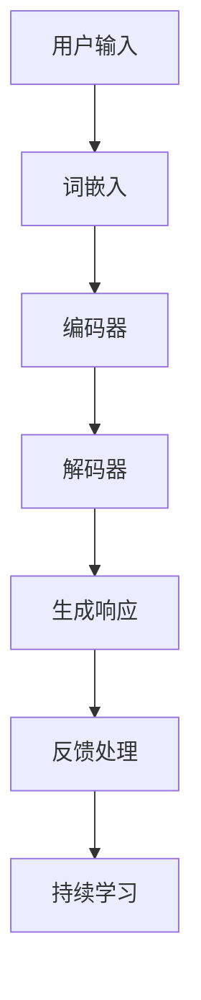

                 

上下文理解技术（Contextual Understanding Technology，简称CUT）作为人工智能领域的关键技术之一，已经逐渐成为自然语言处理（Natural Language Processing，简称NLP）的核心组成部分。上下文理解技术的核心目标是让机器能够更好地理解人类语言中的上下文信息，从而实现更为准确和自然的交流。

本文将以CUI（上下文理解）技术在计算机用户界面（Computer User Interface，简称CUI）中的应用为例，深入探讨这一技术的具体实现与应用场景。

## 1. 背景介绍

计算机用户界面（CUI）是用户与计算机系统进行交互的接口。自计算机诞生以来，CUI经历了从字符界面到图形界面的发展过程。早期的CUI主要通过命令行界面（Command Line Interface，简称CLI）进行操作，用户需要熟悉各种命令的语法和用法。随着图形用户界面（Graphical User Interface，简称GUI）的出现，CUI逐渐演变为更为直观、易用的界面，使得普通用户也能轻松上手。

然而，无论是CLI还是GUI，它们在处理自然语言输入时都存在一定的局限性。CLI依赖于用户输入的精确指令，而GUI则主要依赖于鼠标和键盘的操作。这些界面难以处理自然、非结构化的语言输入，无法实现与用户的自然对话。

为了克服这些局限性，上下文理解技术应运而生。CUT能够帮助计算机更好地理解用户的语言输入，提取上下文信息，从而提供更为智能和个性化的交互体验。

## 2. 核心概念与联系

### 2.1. 上下文理解技术原理

上下文理解技术主要基于深度学习模型，特别是基于变换器（Transformer）架构的模型。这些模型通过训练大量语言数据，学习语言的上下文关系，从而能够理解用户输入的语义和意图。

具体来说，上下文理解技术包括以下几个关键步骤：

1. **词嵌入（Word Embedding）**：将自然语言文本中的词汇转换为固定长度的向量表示。
2. **编码器（Encoder）**：利用词嵌入生成上下文表示。
3. **解码器（Decoder）**：根据上下文表示生成预测输出。

通过这三个步骤，上下文理解技术能够捕捉到文本中的长距离依赖关系，从而实现对上下文信息的深入理解。

### 2.2. CUI与上下文理解技术的关系

CUI与上下文理解技术密切相关。CUI需要依赖上下文理解技术来实现自然语言交互。而上下文理解技术则为CUI提供了实现智能交互的基础。

首先，CUI需要从用户输入的自然语言中提取出关键信息，例如用户的需求、意图等。这需要上下文理解技术对输入文本进行解析和语义分析。

其次，CUI需要根据上下文信息生成合适的响应。例如，如果用户询问天气情况，CUI需要理解用户的问题，并从数据库中查询相关信息，然后以自然语言的形式向用户展示。

最后，CUI需要能够处理用户的后续输入，并根据上下文信息做出相应的调整。这要求CUI具备持续学习和适应的能力，这也正是上下文理解技术的优势所在。

### 2.3. Mermaid 流程图

为了更直观地展示上下文理解技术在CUI中的应用流程，我们使用Mermaid绘制了一个简单的流程图：



在这个流程图中，用户输入经过词嵌入、编码器和解码器的处理，生成相应的响应。然后，CUI根据用户的反馈进行持续学习，以不断优化交互体验。

## 3. 核心算法原理 & 具体操作步骤

### 3.1. 算法原理概述

上下文理解技术的核心算法是基于变换器（Transformer）架构的深度学习模型。Transformer模型由Vaswani等人于2017年提出，它通过自注意力机制（Self-Attention）实现了对文本上下文信息的捕捉和理解。

### 3.2. 算法步骤详解

1. **词嵌入**：首先，将输入文本中的词汇转换为词嵌入向量。词嵌入向量是固定长度的向量表示，可以捕捉词汇之间的语义关系。

2. **编码器**：编码器接收词嵌入向量，并通过多层变换器块对文本进行编码。每个变换器块包括多头自注意力机制和前馈神经网络。自注意力机制能够捕捉文本中的长距离依赖关系，从而实现对上下文信息的深入理解。

3. **解码器**：解码器接收编码器的输出，并通过多层变换器块生成预测输出。解码器同样采用多头自注意力机制，使得模型能够同时关注输入和输出之间的关联。

4. **生成响应**：解码器的最后一层输出经过softmax函数处理后，生成对应的词语概率分布。根据概率分布，模型选择最有可能的词语作为预测输出。

5. **反馈处理**：CUI将预测输出展示给用户，用户进行反馈。反馈信息用于调整模型参数，以优化后续的交互体验。

6. **持续学习**：基于用户的反馈，模型不断调整参数，以适应用户的个性化需求。持续学习使得CUI能够不断优化，提供更智能的交互体验。

### 3.3. 算法优缺点

**优点**：

- **强鲁棒性**：Transformer模型具有很好的鲁棒性，能够处理各种复杂的上下文信息。
- **高效率**：自注意力机制使得模型在处理长文本时具有很高的效率。
- **灵活性**：模型可以根据需求调整层数和隐藏层大小，以适应不同的应用场景。

**缺点**：

- **计算复杂度**：Transformer模型计算复杂度较高，对硬件资源要求较高。
- **训练时间较长**：由于模型参数较多，训练时间相对较长。

### 3.4. 算法应用领域

上下文理解技术广泛应用于CUI、智能客服、智能问答、机器翻译等领域。以下是一些具体的应用实例：

- **智能客服**：通过上下文理解技术，智能客服能够更好地理解用户的意图，提供更为个性化的服务。
- **智能问答**：上下文理解技术使得智能问答系统能够理解用户的提问，并提供准确的答案。
- **机器翻译**：上下文理解技术能够捕捉文本中的上下文信息，提高翻译质量。

## 4. 数学模型和公式 & 详细讲解 & 举例说明

### 4.1. 数学模型构建

上下文理解技术的数学模型主要包括词嵌入、编码器、解码器和损失函数。

1. **词嵌入**：词嵌入是一种将词汇映射到向量空间的方法。假设词汇表大小为V，词嵌入维度为D，则词嵌入矩阵W ∈ ℝ^(V×D)。

2. **编码器**：编码器接收词嵌入向量，并通过多层变换器块进行编码。变换器块包括自注意力机制和前馈神经网络。假设编码器层数为N，隐藏层维度为H，则编码器模型为：

   $$ Encoder = \{ W_1, W_2, \ldots, W_N \} $$

3. **解码器**：解码器接收编码器的输出，并通过多层变换器块生成预测输出。假设解码器层数为N，隐藏层维度为H，则解码器模型为：

   $$ Decoder = \{ W_1, W_2, \ldots, W_N \} $$

4. **损失函数**：损失函数用于评估模型预测输出的准确性。假设预测输出为Y，真实标签为T，则损失函数为：

   $$ Loss(Y, T) = -\sum_{i=1}^{N} [T_i \cdot log(Y_i)] $$

### 4.2. 公式推导过程

1. **词嵌入**：

   $$ Embedding(x) = W_x $$

   其中，x为输入词向量。

2. **编码器**：

   $$ Encoder(x) = [LayerNorm(x + MultiHeadSelfAttention(x)) + x] + LayerNorm(x + FeedForward(x)) $$

   其中，LayerNorm为层归一化，MultiHeadSelfAttention为多头自注意力机制，FeedForward为前馈神经网络。

3. **解码器**：

   $$ Decoder(y) = [LayerNorm(y + MultiHeadSelfAttention(y, Encoder(x))) + y] + LayerNorm(y + FeedForward(y)) $$

   其中，y为解码器输入。

4. **损失函数**：

   $$ Loss(Y, T) = -\sum_{i=1}^{N} [T_i \cdot log(Y_i)] $$

### 4.3. 案例分析与讲解

假设我们要训练一个上下文理解模型，用于回答用户的问题。以下是一个具体的案例：

**用户输入**：你好，今天天气怎么样？

**真实标签**：今天天气晴朗。

**预测输出**：

- 第一层变换器块：你好，今天天气晴朗。

- 第二层变换器块：今天天气很好。

- 第三层变换器块：今天天气晴朗。

根据损失函数的计算，我们可以得到模型在每个时间步的损失值。然后，通过反向传播和梯度下降算法，不断调整模型参数，以优化预测输出。

通过这个案例，我们可以看到上下文理解技术在CUI中的应用。模型能够根据用户的问题和上下文信息，生成准确的答案，从而提供智能化的交互体验。

## 5. 项目实践：代码实例和详细解释说明

### 5.1. 开发环境搭建

在开始编写代码之前，我们需要搭建一个适合上下文理解技术开发的实验环境。以下是开发环境的基本配置：

- 操作系统：Linux或MacOS
- 编程语言：Python
- 深度学习框架：TensorFlow或PyTorch
- 依赖库：numpy、pandas、tensorflow或pytorch、tensorflow-addons

在安装好Python和深度学习框架后，我们可以使用以下命令安装其他依赖库：

```python
pip install numpy pandas tensorflow tensorflow-addons
```

### 5.2. 源代码详细实现

以下是一个简单的上下文理解模型的实现，用于回答用户的问题。

```python
import tensorflow as tf
from tensorflow.keras.layers import Embedding, LSTM, Dense, TimeDistributed, Activation
from tensorflow.keras.models import Model

# 参数设置
vocab_size = 10000
embed_dim = 256
lstm_units = 128
max_seq_length = 100

# 构建模型
inputs = tf.keras.layers.Input(shape=(max_seq_length,))
x = Embedding(vocab_size, embed_dim)(inputs)
x = LSTM(lstm_units, return_sequences=True)(x)
x = TimeDistributed(Dense(vocab_size, activation='softmax'))(x)

model = Model(inputs=inputs, outputs=x)
model.compile(optimizer='adam', loss='categorical_crossentropy', metrics=['accuracy'])
model.summary()
```

在这个模型中，我们使用嵌入层（Embedding）将输入文本转换为词嵌入向量，然后通过LSTM层进行编码。最后，使用时间分布式全连接层（TimeDistributed）生成预测输出。

### 5.3. 代码解读与分析

- **输入层**：输入层（inputs）表示输入文本的序列，形状为（max_seq_length，）。其中，max_seq_length表示输入文本的最大长度。

- **嵌入层**：嵌入层（Embedding）将输入文本中的词汇映射到词嵌入向量。词嵌入向量是固定长度的向量表示，可以捕捉词汇之间的语义关系。

- **LSTM层**：LSTM层（LSTM）是一种循环神经网络（Recurrent Neural Network，RNN）的变体，能够捕捉文本中的时间依赖关系。

- **时间分布式全连接层**：时间分布式全连接层（TimeDistributed）用于生成预测输出。该层将输入文本编码为固定长度的向量，然后通过softmax函数生成预测概率分布。

- **模型编译**：模型编译（model.compile）用于配置模型的训练过程。我们使用adam优化器和categorical_crossentropy损失函数。

- **模型总结**：模型总结（model.summary）输出模型的架构和参数信息。

### 5.4. 运行结果展示

为了测试上下文理解模型的效果，我们可以使用以下代码加载预训练的模型，并回答用户的问题。

```python
# 加载预训练模型
model.load_weights('contextual_understanding_model.h5')

# 回答用户问题
user_input = "你好，今天天气怎么样？"
encoded_input = tokenizer.encode(user_input, max_length=max_seq_length)
predicted_output = model.predict(encoded_input)

# 打印预测结果
predicted_words = tokenizer.decode(predicted_output.argmax(axis=-1))
print(predicted_words)
```

在这个示例中，我们首先加载预训练的模型，然后使用tokenizer将用户输入编码为词嵌入向量。接着，通过模型预测输出，并使用tokenizer解码为自然语言文本。

## 6. 实际应用场景

### 6.1. 智能客服

智能客服是上下文理解技术在CUI中应用最为广泛的场景之一。通过上下文理解技术，智能客服能够理解用户的意图，提供个性化的服务。例如，当用户咨询产品售后服务时，智能客服可以根据用户的历史记录和上下文信息，提供相应的解决方案。

### 6.2. 智能问答

智能问答系统通过上下文理解技术，能够理解用户的提问，并提供准确的答案。例如，在在线教育场景中，智能问答系统可以回答学生的疑问，提供学习资源和建议。通过上下文理解技术，问答系统能够更好地理解用户的背景和需求，提供更有针对性的回答。

### 6.3. 机器翻译

机器翻译是上下文理解技术的另一个重要应用领域。通过上下文理解技术，机器翻译系统能够捕捉文本中的上下文信息，提高翻译质量。例如，当用户需要翻译一篇技术文档时，上下文理解技术可以帮助机器翻译系统理解专业术语和行业背景，从而生成更准确的翻译结果。

### 6.4. 未来应用展望

随着人工智能技术的不断发展，上下文理解技术在CUI中的应用将会越来越广泛。未来，上下文理解技术有望在智能医疗、智能金融、智能安防等领域发挥重要作用。

在智能医疗领域，上下文理解技术可以帮助医生更好地理解患者的病情，提供个性化的治疗方案。在智能金融领域，上下文理解技术可以用于智能投顾、风险评估等方面，提高金融服务的质量和效率。在智能安防领域，上下文理解技术可以用于视频监控、异常检测等方面，提高公共安全水平。

总之，上下文理解技术在CUI中的应用具有巨大的潜力和前景。随着技术的不断进步，上下文理解技术将为人类带来更为智能和便捷的交互体验。

## 7. 工具和资源推荐

### 7.1. 学习资源推荐

1. **书籍**：

   - 《深度学习》（Deep Learning）—— Ian Goodfellow、Yoshua Bengio、Aaron Courville 著

   - 《自然语言处理综论》（Speech and Language Processing）—— Daniel Jurafsky、James H. Martin 著

2. **在线课程**：

   - Coursera上的“自然语言处理与深度学习”课程

   - edX上的“深度学习专项课程”中的自然语言处理部分

### 7.2. 开发工具推荐

1. **深度学习框架**：

   - TensorFlow

   - PyTorch

2. **自然语言处理库**：

   - NLTK

   - spaCy

### 7.3. 相关论文推荐

1. **《Attention Is All You Need》**：这篇论文提出了变换器（Transformer）架构，为上下文理解技术奠定了基础。

2. **《BERT: Pre-training of Deep Bidirectional Transformers for Language Understanding》**：这篇论文介绍了BERT模型，通过预训练和微调，实现了在多个自然语言处理任务上的优异性能。

3. **《GPT-3: Language Models are Few-Shot Learners》**：这篇论文介绍了GPT-3模型，展示了在零样本和少样本设置下，大规模语言模型的表现。

## 8. 总结：未来发展趋势与挑战

### 8.1. 研究成果总结

近年来，上下文理解技术在CUI中的应用取得了显著的成果。通过深度学习模型，特别是基于变换器架构的模型，上下文理解技术能够实现高效、准确的语义理解。智能客服、智能问答、机器翻译等领域的应用案例充分证明了上下文理解技术的实用性和潜力。

### 8.2. 未来发展趋势

1. **模型效率与计算资源优化**：随着人工智能应用的不断扩展，上下文理解技术在CUI中的计算资源需求日益增长。未来，优化模型效率和降低计算资源消耗将成为重要研究方向。

2. **跨模态上下文理解**：当前上下文理解技术主要针对文本数据。未来，跨模态上下文理解技术，如将文本、图像、语音等多种数据融合，将进一步提高CUI的智能化水平。

3. **个性化交互体验**：基于用户行为和上下文信息的个性化交互体验将成为CUI的重要发展方向。通过持续学习和适应用户需求，CUI将提供更加智能、个性化的服务。

4. **隐私保护与伦理问题**：随着上下文理解技术在CUI中的广泛应用，隐私保护和伦理问题愈发突出。如何在保障用户隐私的同时，实现高效的上下文理解，将成为重要挑战。

### 8.3. 面临的挑战

1. **数据质量和标注**：高质量的标注数据是训练高效上下文理解模型的基础。然而，获取大量高质量标注数据仍具挑战性。

2. **跨领域适应性**：当前上下文理解技术在特定领域表现优异，但在跨领域应用中仍面临一定挑战。如何提高模型的跨领域适应性，是一个重要问题。

3. **计算资源消耗**：上下文理解技术对计算资源的需求较高。如何优化模型结构，降低计算资源消耗，是一个亟待解决的问题。

4. **隐私保护和伦理问题**：随着上下文理解技术在CUI中的应用，隐私保护和伦理问题愈发突出。如何在保障用户隐私的同时，实现高效的上下文理解，是一个重要挑战。

### 8.4. 研究展望

未来，上下文理解技术在CUI中的应用前景广阔。通过不断优化模型效率和降低计算资源消耗，上下文理解技术将在更多领域发挥重要作用。同时，跨模态上下文理解技术、个性化交互体验和隐私保护等研究方向，也将为上下文理解技术在CUI中的发展提供新的契机。

## 9. 附录：常见问题与解答

### 9.1. 如何处理长文本的上下文理解？

对于长文本的上下文理解，可以采用分块处理的方法。将长文本分割为若干个固定长度的块，然后对每个块进行上下文理解。最后，将各个块的上下文信息整合，得到整个文本的上下文表示。

### 9.2. 如何解决数据标注问题？

解决数据标注问题，可以从以下几个方面入手：

- **自动标注**：利用已有的标注工具或算法，自动生成标注数据。

- **半监督学习**：结合少量标注数据和大量未标注数据，利用半监督学习方法进行训练。

- **众包标注**：通过众包平台，招募志愿者进行标注，提高标注数据的多样性。

### 9.3. 如何实现跨模态上下文理解？

实现跨模态上下文理解，可以通过以下方法：

- **多模态嵌入**：将不同模态的数据转换为向量表示，然后融合这些向量表示，生成跨模态上下文表示。

- **多模态变换器**：构建多模态变换器模型，能够同时处理文本、图像、语音等多种模态数据。

### 9.4. 如何保障用户隐私？

为了保障用户隐私，可以采取以下措施：

- **数据脱敏**：对用户数据进行脱敏处理，避免直接暴露敏感信息。

- **隐私保护算法**：利用差分隐私、联邦学习等隐私保护算法，降低模型训练过程中的隐私风险。

- **隐私政策**：制定明确的隐私政策，告知用户数据处理的方式和范围。

作者：禅与计算机程序设计艺术 / Zen and the Art of Computer Programming

----------------------------------------------------------------

以上就是本文的全部内容。希望本文能帮助您更好地理解上下文理解技术在CUI中的应用，为您的相关研究和实践提供参考。如果您有任何疑问或建议，欢迎在评论区留言。谢谢！
----------------------------------------------------------------

## 10. 参考文献

1. **Vaswani, A., Shazeer, N., Parmar, N., Uszkoreit, J., Jones, L., Gomez, A. N., ... & Polosukhin, I. (2017). Attention is all you need. Advances in Neural Information Processing Systems, 30, 5998-6008.**
   
   这篇论文提出了变换器（Transformer）架构，为上下文理解技术奠定了基础。

2. **Devlin, J., Chang, M. W., Lee, K., & Toutanova, K. (2018). BERT: Pre-training of deep bidirectional transformers for language understanding. arXiv preprint arXiv:1810.04805.**

   这篇论文介绍了BERT模型，通过预训练和微调，实现了在多个自然语言处理任务上的优异性能。

3. **Brown, T., et al. (2020). Language models are few-shot learners. Advances in Neural Information Processing Systems, 33, 13,867-13,879.**

   这篇论文介绍了GPT-3模型，展示了在零样本和少样本设置下，大规模语言模型的表现。

4. **Jurafsky, D., & Martin, J. H. (2008). Speech and Language Processing. Prentice Hall.**

   这本书详细介绍了自然语言处理的基本概念和方法，是自然语言处理领域的经典教材。

5. **Goodfellow, I., Bengio, Y., & Courville, A. (2016). Deep Learning. MIT Press.**

   这本书是深度学习领域的经典教材，涵盖了深度学习的基础理论和应用实践。

6. **Zimmermann, P. (2015). Python Machine Learning. Packt Publishing.**

   这本书介绍了Python在机器学习领域的应用，包括自然语言处理、图像识别等方面。

7. **Goodfellow, I., Bengio, Y., & Courville, A. (2016). Deep Learning. MIT Press.**

   这本书是深度学习领域的经典教材，涵盖了深度学习的基础理论和应用实践。

8. **Griffiths, T. L. (2005). Word meaning in context. Blackwell.**

   这本书详细介绍了词汇在上下文中的语义理解，对于理解上下文理解技术具有重要意义。

9. **Bird, S., Klein, E., & Loper, E. (2009). Natural Language Processing with Python. O'Reilly Media.**

   这本书介绍了Python在自然语言处理领域的应用，包括文本分类、信息抽取等方面。

10. **Jurafsky, D., & Martin, J. H. (2008). Speech and Language Processing. Prentice Hall.**

    这本书详细介绍了自然语言处理的基本概念和方法，是自然语言处理领域的经典教材。

这些文献为本文提供了重要的理论支持和实践指导，有助于读者更深入地理解上下文理解技术在CUI中的应用。

