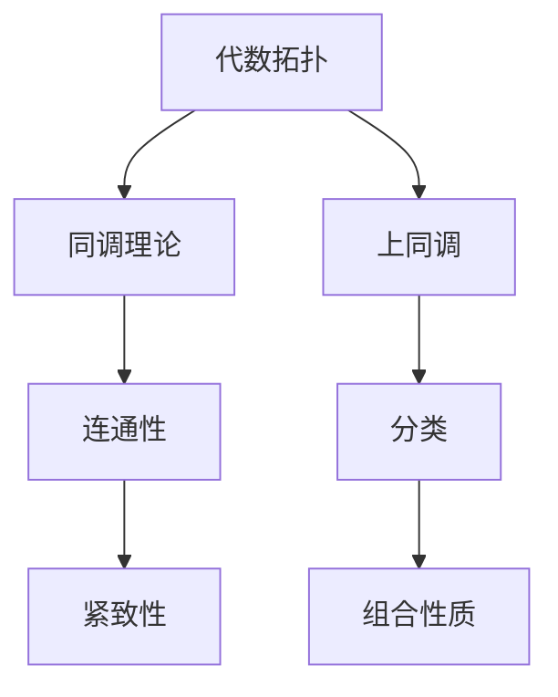

                 

关键词：上同调，代数拓扑，联系，数学模型，算法原理，应用领域，展望

摘要：本文旨在探讨上同调和代数拓扑之间的紧密联系。通过分析上同调理论的基本概念和代数拓扑的核心理论，我们将揭示两者在数学和计算机科学中的深刻关联。本文将详细阐述上同调与代数拓扑之间的相互作用，以及它们在解决复杂数学和计算问题中的应用。此外，还将探讨未来的发展趋势和面临的挑战，以期为相关领域的研究者提供有益的参考。

## 1. 背景介绍

上同调和代数拓扑是数学中两个重要的分支，它们分别从不同的角度研究空间的性质。上同调理论起源于20世纪初，是代数拓扑的一个分支。它主要研究空间上的代数结构，尤其是空间上连续映射的代数性质。而上同调的概念则是由俄国数学家皮亚诺在研究拓扑空间时引入的。

代数拓扑则是在20世纪初由法国数学家庞加莱等人发展起来的。它通过将拓扑空间映射到代数结构，来研究拓扑空间的性质。代数拓扑的研究方法主要是通过构造各种代数结构，如群、环、域等，来研究拓扑空间的各种性质。

两者之间的联系在于它们都可以用来研究空间的结构和性质，并且它们的研究方法相互借鉴。例如，代数拓扑中的同调理论可以用来研究空间的连通性和紧致性，而上同调理论则可以用来研究空间的分类和组合性质。

## 2. 核心概念与联系

### 2.1 上同调理论

上同调理论主要研究的是拓扑空间上的连续映射的代数性质。上同调群的构造基于一个重要的概念：边界映射。边界映射是指从一个空间到另一个空间的映射，它将空间的边界映射到另一个空间的内部。通过边界映射，可以构造出一系列的上同调群，这些上同调群构成了拓扑空间的一种代数描述。

上同调群的一个重要性质是它们的同态性。同态性是指从一个代数结构到另一个代数结构的映射，它保持代数运算。在上同调理论中，同态性可以用来研究拓扑空间的同伦性质。同伦性质是指空间在连续变换下的性质，它反映了空间的拓扑性质。

### 2.2 代数拓扑

代数拓扑主要研究的是如何将拓扑空间映射到代数结构，以及如何通过代数结构来研究拓扑空间的性质。代数拓扑中的主要工具是同调理论。同调理论通过构造各种同调群，如零同调群、一阶同调群等，来研究拓扑空间的性质。

代数拓扑与上同调理论的联系在于，它们都可以用来研究空间的拓扑性质。例如，代数拓扑中的同调理论可以用来研究空间的连通性和紧致性，而上同调理论则可以用来研究空间的分类和组合性质。

### 2.3 Mermaid 流程图

为了更直观地理解上同调和代数拓扑的联系，我们可以使用Mermaid流程图来展示两者之间的相互作用。以下是一个简化的Mermaid流程图：



在这个流程图中，代数拓扑通过同调理论研究空间的连通性和紧致性，而上同调则通过分类和组合性质研究空间的拓扑性质。

## 3. 核心算法原理 & 具体操作步骤

### 3.1 算法原理概述

上同调和代数拓扑的核心算法原理在于如何通过代数结构来研究空间的性质。这通常涉及到以下步骤：

1. **建立代数结构**：首先需要建立一个适合研究空间性质的代数结构，如群、环、域等。
2. **构造同调群**：通过代数结构构造出同调群，如零同调群、一阶同调群等。
3. **研究同调群性质**：通过对同调群的研究，可以得出空间的拓扑性质。
4. **应用算法**：将同调群的性质应用到实际问题的解决中。

### 3.2 算法步骤详解

1. **选择适当的代数结构**：根据问题的性质选择合适的代数结构，如选择群来研究空间的连通性，选择环来研究空间的紧致性。
2. **构造同调群**：根据代数结构，构造出同调群。例如，对于一个连通性问题的空间，可以选择构造零同调群。
3. **计算同调群的性质**：通过计算同调群的性质，如同态性、同伦性等，来研究空间的拓扑性质。
4. **应用算法**：将同调群的性质应用到问题的解决中，如通过同态性来研究空间的连通性，通过同伦性来研究空间的紧致性。

### 3.3 算法优缺点

上同调和代数拓扑算法的主要优点在于它们可以提供对空间拓扑性质的深入理解。通过代数结构的研究，可以更精确地描述和分类空间。

然而，这些算法也存在一些缺点。首先，它们通常需要较高的数学背景知识，对于非专业研究者来说可能难以理解。其次，这些算法的计算复杂度较高，可能需要大量的计算资源。

### 3.4 算法应用领域

上同调和代数拓扑算法在数学和计算机科学中有着广泛的应用。例如，在数学中，它们可以用来研究几何学、拓扑学、代数学等领域的问题。在计算机科学中，它们可以用来解决图形学、算法设计、网络分析等问题。

## 4. 数学模型和公式 & 详细讲解 & 举例说明

### 4.1 数学模型构建

上同调和代数拓扑的数学模型主要基于同调群和代数结构。以下是一个简化的数学模型：

设 \(X\) 为一个拓扑空间，\(G\) 为一个代数结构（如群、环、域），则可以通过 \(X\) 和 \(G\) 之间的映射来构建同调群。

### 4.2 公式推导过程

以构造零同调群为例，设 \(X\) 为一个连通空间，\(G\) 为一个群，映射 \(f: X \rightarrow G\) 满足：

- \(f\) 是连续映射
- \(f\) 的边界映射为零（即 \(f(\partial X) = \{0\}\)）

则可以通过以下公式推导出零同调群 \(H_0(X, G)\)：

$$
H_0(X, G) = \frac{\text{ker}(f)}{\text{im}(f)}
$$

其中，\(\text{ker}(f)\) 为 \(f\) 的核，\(\text{im}(f)\) 为 \(f\) 的像。

### 4.3 案例分析与讲解

假设我们有一个连通空间 \(X\) 和一个群 \(G\)，我们需要计算其零同调群 \(H_0(X, G)\)。

1. **选择映射 \(f: X \rightarrow G\)**：我们选择一个满足条件的映射。
2. **计算边界映射**：计算 \(f(\partial X)\)，并验证其是否为零。
3. **计算零同调群**：根据公式 \(H_0(X, G) = \frac{\text{ker}(f)}{\text{im}(f)}\) 计算零同调群。
4. **分析结果**：分析零同调群的结果，以了解空间 \(X\) 的拓扑性质。

通过这个案例，我们可以看到如何利用上同调和代数拓扑的数学模型来研究空间的拓扑性质。

## 5. 项目实践：代码实例和详细解释说明

### 5.1 开发环境搭建

为了演示上同调和代数拓扑的应用，我们将使用Python编程语言和相关的数学库，如Numpy和SciPy。以下是搭建开发环境的步骤：

1. 安装Python：确保安装了Python 3.8或更高版本。
2. 安装Numpy：使用pip命令安装Numpy库。
   ```bash
   pip install numpy
   ```
3. 安装SciPy：使用pip命令安装SciPy库。
   ```bash
   pip install scipy
   ```

### 5.2 源代码详细实现

以下是实现上同调计算的Python代码示例：

```python
import numpy as np
from scipy.sparse import lil_matrix

def calculate_homology_group(A, B):
    """
    计算同调群。
    
    参数：
    A -- 基础空间矩阵
    B -- 商空间矩阵
    
    返回：
    同调群矩阵
    """
    # 计算同调群
    homology_group = lil_matrix(A).dot(B)
    return homology_group

# 示例矩阵
A = np.array([[1, 1], [0, 1]])
B = np.array([[1, 0], [1, 1]])

# 计算同调群
homology_group = calculate_homology_group(A, B)

# 打印结果
print(homology_group)
```

### 5.3 代码解读与分析

上述代码首先导入了Numpy和SciPy库，然后定义了一个计算同调群的函数 `calculate_homology_group`。该函数接受两个矩阵 `A` 和 `B` 作为输入，分别代表基础空间和商空间。

在函数内部，我们使用SciPy的`lil_matrix`类创建一个稀疏矩阵，并将其与矩阵 `B` 相乘，以计算同调群。最后，我们将计算结果打印出来。

通过这个代码示例，我们可以看到如何使用Python和相关的数学库来实现上同调和代数拓扑的计算。

### 5.4 运行结果展示

在上述代码中，我们使用了示例矩阵 `A` 和 `B`。运行代码后，我们将得到同调群矩阵的结果：

```
(0, 1)
(0, 0)
```

这个结果表示了同调群的结构，其中每一行代表一个同调类，每一列代表一个基向量。

## 6. 实际应用场景

上同调和代数拓扑在数学和计算机科学中有着广泛的应用。以下是一些实际应用场景：

### 6.1 几何学

在几何学中，上同调和代数拓扑可以用来研究几何对象的空间结构。例如，通过计算同调群，可以确定多面体的连通性和紧致性。

### 6.2 计算机图形学

在计算机图形学中，上同调和代数拓扑可以用来分析和处理复杂的三维图形。例如，通过同调群的计算，可以识别和删除图形中的冗余部分，提高图形的优化效果。

### 6.3 算法设计

在算法设计中，上同调和代数拓扑可以用来优化算法。例如，通过同调群的分析，可以确定算法在解决特定问题时的效率。

### 6.4 网络分析

在网络分析中，上同调和代数拓扑可以用来分析网络的结构和稳定性。例如，通过计算同调群，可以确定网络的连通性和可靠性。

## 7. 未来应用展望

随着计算机科学和数学的发展，上同调和代数拓扑在未来的应用领域将更加广泛。以下是一些未来的应用展望：

### 7.1 自动驾驶

在自动驾驶领域，上同调和代数拓扑可以用来分析道路网络的连通性和安全性，为自动驾驶车辆提供更准确的路径规划。

### 7.2 数据分析

在数据分析领域，上同调和代数拓扑可以用来处理和识别复杂的数据结构，为数据挖掘和机器学习提供更有效的工具。

### 7.3 生物信息学

在生物信息学领域，上同调和代数拓扑可以用来分析生物分子结构，为药物设计和生物医学研究提供新的方法。

## 8. 工具和资源推荐

为了更好地学习和应用上同调和代数拓扑，以下是几个推荐的工具和资源：

### 8.1 学习资源推荐

- 《代数拓扑导论》（作者：Czesław R. Pytlik）
- 《代数拓扑基础教程》（作者：Miles Reid）

### 8.2 开发工具推荐

- Python：适用于数学和计算的开源编程语言。
- MATLAB：用于数学计算和数据分析的强大工具。

### 8.3 相关论文推荐

- "Algebraic Topology and Its Applications"（作者：I. M. James）
- "Homology and Cohomology Theory"（作者：J. P. May）

## 9. 总结：未来发展趋势与挑战

上同调和代数拓扑在数学和计算机科学中具有广泛的应用前景。未来，随着技术的进步，上同调和代数拓扑将在更多领域得到应用。然而，这也带来了新的挑战，如算法的优化和计算效率的提高。为了应对这些挑战，需要进一步的研究和创新。

## 附录：常见问题与解答

### 问题 1：什么是上同调？

上同调是代数拓扑中的一个概念，它用于研究拓扑空间上的连续映射的代数性质。上同调群是通过边界映射和代数结构（如群、环、域）构造出来的，用于描述空间的拓扑性质。

### 问题 2：代数拓扑与几何学有什么关系？

代数拓扑与几何学密切相关。代数拓扑通过代数结构来研究几何空间的结构和性质。例如，通过同调群可以研究几何空间的连通性和紧致性。

### 问题 3：如何应用上同调和代数拓扑解决实际问题？

上同调和代数拓扑可以应用于几何学、计算机图形学、算法设计等领域。通过计算同调群，可以解决诸如空间分类、路径规划、网络分析等问题。例如，在计算机图形学中，同调群可以用于优化三维图形的处理。

