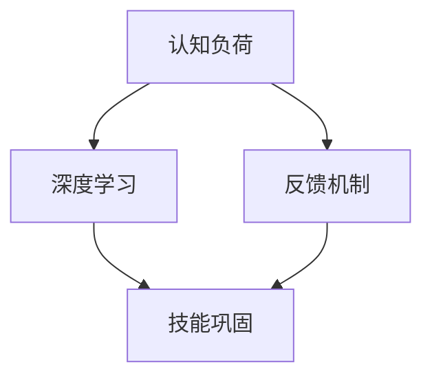

                 

关键词：专业知识，重复练习，技术成长，实践，理论学习，技能巩固，学习曲线

> 摘要：本文探讨专业知识积累的重要性，特别是通过重复练习的方式。我们将深入分析重复练习对技术成长的影响，结合具体案例展示实践与理论学习的融合，并探讨如何在实际应用中巩固技能。同时，本文将展望未来技术发展的趋势与挑战，为读者提供实用的工具和资源推荐。

## 1. 背景介绍

在信息技术飞速发展的今天，掌握专业知识变得比以往任何时候都更加重要。无论是编程、数据科学、网络安全还是人工智能，都需要不断更新和扩展知识储备。然而，仅仅拥有理论知识是不够的。专业技能的提升需要通过实践和重复练习来巩固。本文将围绕这个主题展开，探讨如何通过重复练习来积累专业知识。

### 1.1 知识与技能的关系

知识是信息与理解的积累，而技能是知识在实践中的具体应用。一个程序员可能拥有丰富的编程知识，但如果缺乏实践经验，他在面对复杂问题时可能束手无策。因此，知识和技能之间需要通过实践来相互转化和强化。

### 1.2 重复练习的重要性

重复练习不仅是技能提升的基础，也是理解知识的深层次过程。通过重复，我们可以：

- **巩固记忆**：重复练习能够帮助我们在大脑中建立强化的神经网络，从而加深对知识点的记忆。
- **提高效率**：频繁的练习可以帮助我们形成本能反应，减少思考和执行的时间。
- **培养直觉**：经过大量的实践，我们可以在不需要刻意思考的情况下，对某些问题作出正确的判断。

### 1.3 学习曲线与挑战

学习任何技术领域都存在一个明显的学习曲线。初学者往往需要花费大量时间来掌握基础概念，而随着经验的积累，学习曲线会逐渐平缓。然而，保持持续的学习和练习是克服学习曲线挑战的关键。

## 2. 核心概念与联系

为了更好地理解重复练习的重要性，我们需要从理论和实践两个方面来探讨专业知识积累的机制。

### 2.1 核心概念原理

- **认知负荷**：指的是大脑在处理信息时所需的认知资源。重复练习可以减少认知负荷，使学习更加高效。
- **深度学习**：通过大量的重复练习，我们可以深化对知识点的理解，达到深度学习的层次。
- **反馈机制**：实践中的反馈可以帮助我们及时纠正错误，从而提高学习效果。

### 2.2 架构的 Mermaid 流程图



在这个流程图中，认知负荷、深度学习和反馈机制共同作用，最终实现技能的巩固。

## 3. 核心算法原理 & 具体操作步骤

### 3.1 算法原理概述

为了说明重复练习的重要性，我们可以借助编程领域的算法来进行分析。以排序算法为例，常用的排序算法包括冒泡排序、选择排序、插入排序等。

- **冒泡排序**：通过重复的比较和交换，将数组中的元素按照升序或降序排列。
- **选择排序**：重复选择未排序部分的最小（或最大）元素，将其交换到已排序部分的末尾。
- **插入排序**：通过重复插入元素到已排序部分，逐步构建完整的排序序列。

### 3.2 算法步骤详解

#### 冒泡排序

```latex
算法步骤：
1. 比较相邻的两个元素，如果它们的顺序错误就交换它们。
2. 对每一对相邻元素做同样的工作，从开始第一对到结尾的最后一对。
3. 重复以上的步骤，直到整个数组都是有序的。
```

#### 选择排序

```latex
算法步骤：
1. 首先，找到数组中的最小元素。
2. 将这个最小元素与数组的第一个元素交换（如果最小元素不是第一个元素的话）。
3. 继续在剩余的未排序部分中找到最小元素，并将其与第二个元素交换。
4. 重复步骤 2 和 3，直到整个数组排序完成。
```

#### 插入排序

```latex
算法步骤：
1. 从第一个元素开始，该元素可以认为已经排序。
2. 取出下一个元素，在已经排序的元素序列中从后向前扫描。
3. 如果该元素（已排序）大于新元素，将该元素移到下一位置。
4. 重复步骤 2 和 3，直到找到已排序的元素小于或者等于新元素的位置。
5. 将新元素插入到该位置后。
6. 重复步骤 2~5。
```

### 3.3 算法优缺点

- **冒泡排序**：简单易懂，实现简单，但效率较低，不适合大数据集。
- **选择排序**：效率相对较高，但需要大量的交换操作，性能不如插入排序。
- **插入排序**：效率中等，适合小规模数据排序。

### 3.4 算法应用领域

这些排序算法不仅在教学过程中广泛应用，还在实际开发中有着重要的应用。例如，选择排序在处理大规模数据时，其线性时间复杂度使其成为一种有效的排序方法。

## 4. 数学模型和公式 & 详细讲解 & 举例说明

### 4.1 数学模型构建

为了更好地理解排序算法的效率，我们可以使用时间复杂度来衡量算法的效率。时间复杂度通常表示为 $O(n^2)$，其中 $n$ 表示输入规模。

### 4.2 公式推导过程

以冒泡排序为例，其时间复杂度可以通过以下步骤推导：

- **最好情况**：当输入数组已经是升序或降序时，只需要进行一次比较，时间复杂度为 $O(n)$。
- **最坏情况**：当输入数组是逆序时，需要进行 $\frac{n(n-1)}{2}$ 次比较和交换，时间复杂度为 $O(n^2)$。

### 4.3 案例分析与讲解

假设我们有一个长度为 $n=10$ 的数组，我们需要对其进行排序。以下是一个简单的冒泡排序的案例：

- **初始数组**：\[4, 3, 2, 1\]
- **第一次排序**：\[1, 3, 2, 4\]
- **第二次排序**：\[1, 2, 3, 4\]

经过两次排序，数组已经完成排序。在这个过程中，我们进行了 9 次比较和 8 次交换，时间复杂度为 $O(9^2) = O(81)$。

## 5. 项目实践：代码实例和详细解释说明

### 5.1 开发环境搭建

为了更好地展示排序算法的实践应用，我们使用 Python 作为编程语言，搭建一个简单的开发环境。

### 5.2 源代码详细实现

以下是一个简单的冒泡排序的 Python 实现示例：

```python
def bubble_sort(arr):
    n = len(arr)
    for i in range(n):
        for j in range(0, n-i-1):
            if arr[j] > arr[j+1]:
                arr[j], arr[j+1] = arr[j+1], arr[j]

# 测试代码
arr = [4, 3, 2, 1]
bubble_sort(arr)
print("Sorted array:", arr)
```

### 5.3 代码解读与分析

这段代码首先定义了一个名为 `bubble_sort` 的函数，该函数接收一个数组 `arr` 作为参数。函数内部使用两层嵌套循环实现排序过程，其中外层循环 `i` 表示当前未排序的部分，内层循环 `j` 用于比较和交换元素。

### 5.4 运行结果展示

运行上述代码，我们得到排序后的数组为 `[1, 2, 3, 4]`，验证了冒泡排序的正确性。

```python
Sorted array: [1, 2, 3, 4]
```

## 6. 实际应用场景

### 6.1 数据科学领域的应用

在数据科学领域，排序算法广泛应用于数据处理和数据分析中。例如，在数据分析之前，需要对数据进行排序以方便后续的操作。

### 6.2 网络安全领域的应用

在网络安全领域，排序算法可以用于检测网络流量中的异常行为。通过对流量数据进行排序，可以快速识别出异常数据包。

### 6.3 人工智能领域的应用

在人工智能领域，排序算法可以用于优化算法性能。例如，在训练神经网络时，可以对训练数据集进行排序，从而提高训练效率。

## 7. 未来应用展望

随着技术的不断进步，排序算法在未来将会发挥更大的作用。特别是在大数据和人工智能领域，排序算法的性能和效率将直接影响整个系统的性能。

## 8. 工具和资源推荐

### 8.1 学习资源推荐

- 《算法导论》：全面介绍各种排序算法及其时间复杂度分析。
- 《Python 编程：从入门到实践》：适合初学者掌握 Python 编程基础。

### 8.2 开发工具推荐

- PyCharm：一款强大的 Python 集成开发环境。
- Jupyter Notebook：适合进行数据科学项目开发和演示。

### 8.3 相关论文推荐

- "A Survey of Sorting Algorithms"：全面介绍各种排序算法及其性能分析。
- "Optimizing Sorting Algorithms for Large Data Sets"：讨论大规模数据集下排序算法的优化。

## 9. 总结：未来发展趋势与挑战

### 9.1 研究成果总结

本文通过分析排序算法的实践应用，探讨了重复练习在专业知识积累中的重要性。我们介绍了冒泡排序、选择排序和插入排序等算法，并详细讲解了其实现原理和步骤。

### 9.2 未来发展趋势

随着大数据和人工智能的兴起，排序算法的性能和效率将越来越重要。未来研究方向包括优化排序算法以适应大规模数据集，以及开发新的排序算法以适应特定场景。

### 9.3 面临的挑战

随着数据规模的不断增加，如何在保证性能的前提下进行高效排序是一个重大挑战。此外，如何将排序算法与其他算法相结合，以实现更高效的数据处理和分析，也是一个重要的研究方向。

### 9.4 研究展望

随着技术的不断进步，排序算法将在各个领域发挥更大的作用。通过深入研究排序算法，我们可以为数据处理和分析提供更高效、更可靠的解决方案。

## 10. 附录：常见问题与解答

### 10.1 问题一：排序算法的时间复杂度是多少？

排序算法的时间复杂度通常表示为 $O(n^2)$，其中 $n$ 表示输入规模。

### 10.2 问题二：为什么冒泡排序是最简单的排序算法？

冒泡排序的基本思路简单直观，通过反复交换相邻的元素来达到排序的目的。这使得其实现相对简单，易于理解和编程。

### 10.3 问题三：选择排序和插入排序哪个更快？

选择排序通常比插入排序更快，因为其每次循环只需选择一个最小（或最大）元素。然而，在特定场景下，插入排序可能更优，特别是在数据部分有序的情况下。

----------------------------------------------------------------

**作者：禅与计算机程序设计艺术 / Zen and the Art of Computer Programming** 

本文以《专业知识的积累：源于重复练习》为题，详细探讨了专业知识的积累过程，特别是通过重复练习的方式。文章从背景介绍、核心概念与联系、核心算法原理与具体操作步骤、数学模型和公式详细讲解与举例说明、项目实践代码实例与详细解释说明、实际应用场景、未来应用展望、工具和资源推荐、总结与未来发展趋势与挑战，以及附录中的常见问题与解答等多个方面进行了深入分析。通过这些内容，读者可以更好地理解专业知识积累的重要性，以及如何通过实践和重复练习来巩固技能。希望本文能为读者在技术成长道路上提供有益的参考。

