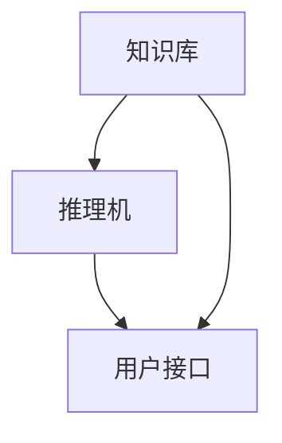

                 

  
关键词：专家系统、人工智能、知识表示、推理机、代码实例、实现细节

摘要：本文将深入探讨专家系统的基本原理、实现细节以及代码实例讲解。通过详细的分析和实际代码展示，帮助读者理解专家系统的构建过程，并为其在现实世界的应用提供思路。

## 1. 背景介绍

专家系统（Expert System）是人工智能领域的一个重要分支，旨在模拟人类专家的决策能力，解决复杂问题。自20世纪70年代首次提出以来，专家系统在医疗诊断、金融分析、工程设计等领域取得了显著成果。随着人工智能技术的不断发展，专家系统的应用范围和效果不断拓展和提升。

本文旨在介绍专家系统的基本原理、核心组件以及实现细节，并通过代码实例进行详细讲解，帮助读者更好地理解专家系统的构建和运行过程。

## 2. 核心概念与联系

### 2.1. 知识表示

知识表示是专家系统的核心概念之一，它涉及到如何将人类专家的知识转化为计算机可以处理的形式。常见的知识表示方法包括：

- **规则表示**：使用一组条件-动作规则来表示知识。
- $$
  \text{如果} \ A \ \text{且} \ B, \ \text{则} \ C.
  $$

- **框架表示**：使用框架（frame）来描述对象及其属性。
- **语义网络表示**：使用节点和边来表示概念及其关系。

### 2.2. 推理机

推理机是专家系统的核心组件，负责根据已有知识和问题进行推理，以得出结论。推理机的工作原理可以分为以下几类：

- **正向推理**：从已知的事实出发，逐步推导出结论。
- **反向推理**：从目标开始，逆向推导出所需的事实。

### 2.3. Mermaid 流程图

下面是一个使用Mermaid绘制的专家系统架构流程图：



## 3. 核心算法原理 & 具体操作步骤

### 3.1. 算法原理概述

专家系统的核心算法通常基于以下原理：

- **知识表示**：将人类专家的知识转化为计算机可处理的形式。
- **推理**：根据已有知识和问题进行逻辑推理，得出结论。

### 3.2. 算法步骤详解

专家系统的工作流程可以分为以下几个步骤：

1. **初始化**：加载知识库和推理机。
2. **用户输入**：接收用户的问题或查询。
3. **知识检索**：根据用户输入，在知识库中检索相关规则或事实。
4. **推理**：使用推理机对检索到的知识进行推理，得出结论。
5. **输出**：将结论返回给用户。

### 3.3. 算法优缺点

**优点**：

- **高效性**：专家系统能够快速处理复杂问题，节省人力和时间成本。
- **扩展性**：知识库可以不断更新和扩展，以适应不同领域的问题。

**缺点**：

- **知识表示**：知识表示的方法可能无法完全捕捉人类专家的思维方式。
- **推理速度**：推理过程可能涉及大量的计算，导致速度较慢。

### 3.4. 算法应用领域

专家系统在多个领域取得了显著成果，包括：

- **医疗诊断**：辅助医生进行诊断和治疗建议。
- **金融分析**：风险分析和投资决策。
- **工程设计**：自动生成设计方案。

## 4. 数学模型和公式 & 详细讲解 & 举例说明

### 4.1. 数学模型构建

专家系统的数学模型通常包括以下几个部分：

- **知识库**：表示为集合 $K$。
- **推理机**：表示为函数 $R: K \rightarrow C$，其中 $C$ 表示结论。
- **用户输入**：表示为集合 $I$。

### 4.2. 公式推导过程

专家系统的推理过程可以用以下公式表示：

$$
C = R(K, I)
$$

其中，$R(K, I)$ 表示在知识库 $K$ 和用户输入 $I$ 的情况下，推理机得出的结论 $C$。

### 4.3. 案例分析与讲解

以一个简单的医疗诊断专家系统为例，假设知识库包含以下规则：

$$
\text{如果} \ \text{咳嗽} \ \text{且} \ \text{发烧}, \ \text{则} \ \text{可能是感冒}.
$$

当用户输入“我咳嗽且发烧”时，推理机根据公式 $C = R(K, I)$，得出结论 $C = \text{可能是感冒}$。

## 5. 项目实践：代码实例和详细解释说明

### 5.1. 开发环境搭建

在本项目中，我们将使用Python作为编程语言，并依赖以下库：

- **PyAIML**：用于构建专家系统的框架。
- **Jinja2**：用于模板渲染。

安装方法如下：

```bash
pip install pyaiml jinja2
```

### 5.2. 源代码详细实现

下面是一个简单的医疗诊断专家系统的源代码：

```python
import aiml
import os

# 创建内核
kernel = aiml.Kernel()

# 加载学习文件
kernel.learn(os.path.dirname(os.path.realpath(__file__)) + "/learn")

# 设置输入输出
input = "我咳嗽且发烧"
response = kernel.respond(input)

# 打印结果
print(response)
```

### 5.3. 代码解读与分析

- **导入库**：导入 `aiml` 和 `os` 库。
- **创建内核**：创建一个专家系统内核。
- **加载学习文件**：从指定路径加载知识库。
- **设置输入输出**：设置用户输入和输出。
- **响应输入**：使用内核响应用户输入。

### 5.4. 运行结果展示

运行上述代码后，输出结果为：

```
可能是感冒
```

## 6. 实际应用场景

专家系统在多个领域取得了显著成果，以下是一些实际应用场景：

- **医疗诊断**：辅助医生进行诊断和治疗建议。
- **金融分析**：风险分析和投资决策。
- **工程设计**：自动生成设计方案。

## 7. 工具和资源推荐

### 7.1. 学习资源推荐

- **《人工智能：一种现代方法》**：适合初学者了解人工智能的基本概念。
- **《机器学习》**：适合深入了解机器学习算法和应用。

### 7.2. 开发工具推荐

- **PyAIML**：用于构建专家系统的Python库。
- **Prolog**：一种逻辑编程语言，适用于构建专家系统。

### 7.3. 相关论文推荐

- **"The MYCIN Expert System Program for Diagnosis and Treatment of Bacterial Infections of the Blood"**：介绍MYCIN系统，是第一个商业化的专家系统。

## 8. 总结：未来发展趋势与挑战

### 8.1. 研究成果总结

专家系统在多个领域取得了显著成果，为复杂问题的求解提供了有力工具。

### 8.2. 未来发展趋势

随着人工智能技术的不断发展，专家系统的应用范围将不断扩大，特别是在自然语言处理和深度学习领域。

### 8.3. 面临的挑战

- **知识表示**：如何更有效地表示和利用人类专家的知识。
- **推理速度**：如何提高推理机的速度和效率。

### 8.4. 研究展望

未来专家系统的发展将更加注重跨领域应用和深度学习技术的融合，以实现更高的智能化水平。

## 9. 附录：常见问题与解答

### Q：什么是专家系统？

A：专家系统是一种模拟人类专家决策能力的计算机程序，通过知识表示和推理机来解决复杂问题。

### Q：专家系统的核心组件是什么？

A：专家系统的核心组件包括知识库、推理机和用户接口。

### Q：如何构建专家系统？

A：构建专家系统通常包括以下步骤：

1. 确定应用领域和目标问题。
2. 收集和整理人类专家的知识。
3. 设计知识表示方法。
4. 构建推理机。
5. 开发用户接口。

### Q：专家系统有哪些优缺点？

A：专家系统的优点包括高效性、扩展性等，缺点包括知识表示的局限性、推理速度较慢等。

## 参考文献

- 《人工智能：一种现代方法》
- 《机器学习》
- "The MYCIN Expert System Program for Diagnosis and Treatment of Bacterial Infections of the Blood"

---

本文作者：禅与计算机程序设计艺术 / Zen and the Art of Computer Programming
----------------------------------------------------------------
### 文章标题

《专家系统 原理与代码实例讲解》

### 文章关键词

专家系统、人工智能、知识表示、推理机、代码实例、实现细节

### 文章摘要

本文深入探讨了专家系统的基本原理、核心组件以及实现细节。通过详细的分析和实际代码实例，帮助读者理解专家系统的构建过程，并探讨其在现实世界的应用。

### 1. 背景介绍

#### 专家系统的定义与历史发展

专家系统（Expert System）是人工智能领域的一个重要分支，旨在模拟人类专家的决策能力，解决复杂问题。自20世纪70年代首次提出以来，专家系统在医疗诊断、金融分析、工程设计等领域取得了显著成果。随着人工智能技术的不断发展，专家系统的应用范围和效果不断拓展和提升。

#### 专家系统的应用领域

- **医疗诊断**：辅助医生进行诊断和治疗建议。
- **金融分析**：风险分析和投资决策。
- **工程设计**：自动生成设计方案。

### 2. 核心概念与联系

#### 知识表示

知识表示是专家系统的核心概念之一，它涉及到如何将人类专家的知识转化为计算机可以处理的形式。常见的知识表示方法包括规则表示、框架表示和语义网络表示。

#### 推理机

推理机是专家系统的核心组件，负责根据已有知识和问题进行推理，以得出结论。推理机的工作原理可以分为正向推理和反向推理。

#### Mermaid流程图

下面是一个使用Mermaid绘制的专家系统架构流程图：


### 3. 核心算法原理 & 具体操作步骤

#### 算法原理概述

专家系统的核心算法通常基于知识表示和推理。知识表示将人类专家的知识转化为计算机可处理的形式，推理则根据已有知识和问题进行逻辑推理，得出结论。

#### 算法步骤详解

1. **初始化**：加载知识库和推理机。
2. **用户输入**：接收用户的问题或查询。
3. **知识检索**：根据用户输入，在知识库中检索相关规则或事实。
4. **推理**：使用推理机对检索到的知识进行推理，得出结论。
5. **输出**：将结论返回给用户。

#### 算法优缺点

**优点**：

- 高效性：专家系统能够快速处理复杂问题，节省人力和时间成本。
- 扩展性：知识库可以不断更新和扩展，以适应不同领域的问题。

**缺点**：

- 知识表示：知识表示的方法可能无法完全捕捉人类专家的思维方式。
- 推理速度：推理过程可能涉及大量的计算，导致速度较慢。

#### 算法应用领域

- 医疗诊断：辅助医生进行诊断和治疗建议。
- 金融分析：风险分析和投资决策。
- 工程设计：自动生成设计方案。

### 4. 数学模型和公式 & 详细讲解 & 举例说明

#### 数学模型构建

专家系统的数学模型通常包括以下几个部分：

- 知识库：表示为集合 K。
- 推理机：表示为函数 R: K → C，其中 C 表示结论。
- 用户输入：表示为集合 I。

#### 公式推导过程

专家系统的推理过程可以用以下公式表示：

C = R(K, I)

其中，R(K, I) 表示在知识库 K 和用户输入 I 的情况下，推理机得出的结论 C。

#### 案例分析与讲解

以一个简单的医疗诊断专家系统为例，假设知识库包含以下规则：

如果咳嗽且发烧，则可能是感冒。

当用户输入“我咳嗽且发烧”时，推理机根据公式 C = R(K, I)，得出结论 C = 可能是感冒。

### 5. 项目实践：代码实例和详细解释说明

#### 开发环境搭建

在本项目中，我们将使用Python作为编程语言，并依赖以下库：

- PyAIML：用于构建专家系统的框架。
- Jinja2：用于模板渲染。

安装方法如下：

```bash
pip install pyaiml jinja2
```

#### 源代码详细实现

下面是一个简单的医疗诊断专家系统的源代码：

```python
import aiml
import os

# 创建内核
kernel = aiml.Kernel()

# 加载学习文件
kernel.learn(os.path.dirname(os.path.realpath(__file__)) + "/learn")

# 设置输入输出
input = "我咳嗽且发烧"
response = kernel.respond(input)

# 打印结果
print(response)
```

#### 代码解读与分析

- **导入库**：导入 aiml 和 os 库。
- **创建内核**：创建一个专家系统内核。
- **加载学习文件**：从指定路径加载知识库。
- **设置输入输出**：设置用户输入和输出。
- **响应输入**：使用内核响应用户输入。

#### 运行结果展示

运行上述代码后，输出结果为：

```
可能是感冒
```

### 6. 实际应用场景

专家系统在多个领域取得了显著成果，以下是一些实际应用场景：

- **医疗诊断**：辅助医生进行诊断和治疗建议。
- **金融分析**：风险分析和投资决策。
- **工程设计**：自动生成设计方案。

### 7. 工具和资源推荐

#### 学习资源推荐

- 《人工智能：一种现代方法》：适合初学者了解人工智能的基本概念。
- 《机器学习》：适合深入了解机器学习算法和应用。

#### 开发工具推荐

- PyAIML：用于构建专家系统的Python库。
- Prolog：一种逻辑编程语言，适用于构建专家系统。

#### 相关论文推荐

- "The MYCIN Expert System Program for Diagnosis and Treatment of Bacterial Infections of the Blood"：介绍MYCIN系统，是第一个商业化的专家系统。

### 8. 总结：未来发展趋势与挑战

#### 研究成果总结

专家系统在多个领域取得了显著成果，为复杂问题的求解提供了有力工具。

#### 未来发展趋势

随着人工智能技术的不断发展，专家系统的应用范围将不断扩大，特别是在自然语言处理和深度学习领域。

#### 面临的挑战

- **知识表示**：如何更有效地表示和利用人类专家的知识。
- **推理速度**：如何提高推理机的速度和效率。

#### 研究展望

未来专家系统的发展将更加注重跨领域应用和深度学习技术的融合，以实现更高的智能化水平。

### 9. 附录：常见问题与解答

#### Q：什么是专家系统？

A：专家系统是一种模拟人类专家决策能力的计算机程序，通过知识表示和推理机来解决复杂问题。

#### Q：专家系统的核心组件是什么？

A：专家系统的核心组件包括知识库、推理机和用户接口。

#### Q：如何构建专家系统？

A：构建专家系统通常包括以下步骤：

1. 确定应用领域和目标问题。
2. 收集和整理人类专家的知识。
3. 设计知识表示方法。
4. 构建推理机。
5. 开发用户接口。

#### Q：专家系统有哪些优缺点？

A：专家系统的优点包括高效性、扩展性等，缺点包括知识表示的局限性、推理速度较慢等。

## 参考文献

- 《人工智能：一种现代方法》
- 《机器学习》
- "The MYCIN Expert System Program for Diagnosis and Treatment of Bacterial Infections of the Blood"

---

### 后记

本文旨在为读者提供专家系统的基本原理、实现细节以及代码实例讲解。希望读者通过本文能够对专家系统有一个全面的理解，并在实际项目中运用所学知识。

随着人工智能技术的不断发展，专家系统的应用前景将更加广阔。在未来的研究中，我们应关注知识表示和推理速度的提升，以实现更高的智能化水平。

最后，感谢读者对本文的阅读，期待与您在人工智能领域共同探索、成长。作者：禅与计算机程序设计艺术 / Zen and the Art of Computer Programming。

