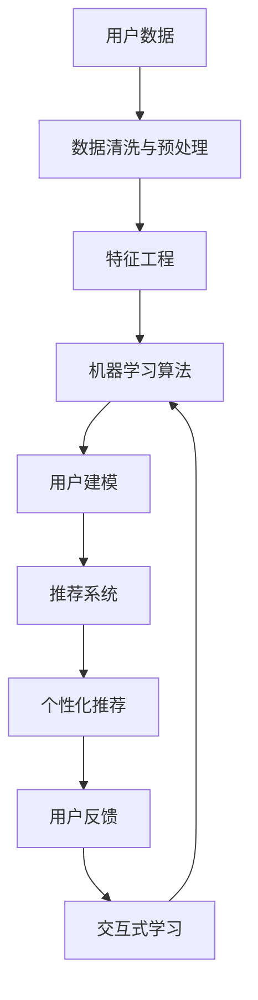

                 

关键词：个性化AI，用户需求，技术实现，算法原理，数学模型，应用场景，未来展望

## 摘要

本文旨在探讨个性化人工智能（AI）在满足不同用户需求方面的重要性。首先，我们将回顾AI技术的发展历程，接着深入探讨个性化AI的核心概念、原理及架构。文章将详细介绍核心算法原理和操作步骤，并通过数学模型和公式进行详细讲解。随后，我们将通过一个代码实例来展示个性化AI的实际应用。最后，文章将探讨个性化AI在实际应用场景中的表现，并对其未来发展趋势和挑战进行展望。

## 1. 背景介绍

### AI技术的发展历程

人工智能（AI）自1956年由约翰·麦卡锡（John McCarthy）首次提出以来，已经经历了数个重要阶段。从最初的符号人工智能到基于规则的系统，再到基于数据的学习方法，AI技术不断演进。近年来，深度学习、自然语言处理和强化学习等前沿技术进一步推动了AI的发展，使得AI在各个领域取得了显著成果。

### 个性化AI的兴起

随着AI技术的进步，个性化AI逐渐成为研究热点。个性化AI旨在根据用户的行为、兴趣和需求，为用户提供定制化的服务。这种个性化的服务不仅提高了用户体验，还提升了AI系统的实用性和效率。在电子商务、医疗、金融、教育等领域，个性化AI的应用已经初见成效。

### 个性化AI的重要性

个性化AI的重要性体现在以下几个方面：

1. **满足用户需求**：个性化AI能够更好地理解用户的需求，提供个性化的推荐和服务。
2. **提高效率**：通过自动化和智能化的方式，个性化AI可以显著提高业务流程的效率。
3. **增强用户体验**：个性化AI能够根据用户的反馈和偏好进行自我优化，从而提升用户体验。
4. **创新业务模式**：个性化AI为企业和组织提供了新的业务模式和创新机会。

## 2. 核心概念与联系

### 核心概念

个性化AI的核心概念包括：

- **用户建模**：通过对用户行为和偏好的分析，建立用户画像。
- **推荐系统**：利用用户建模和机器学习算法，为用户推荐个性化的内容或服务。
- **交互式学习**：通过与用户的交互，不断优化推荐系统的性能。

### 核心原理

个性化AI的核心原理基于以下几点：

- **数据驱动**：个性化AI依赖于大量用户数据的分析和挖掘。
- **机器学习**：通过机器学习算法，实现用户建模和推荐系统的构建。
- **深度学习**：深度学习技术在用户建模和推荐系统中具有重要作用。

### 架构

个性化AI的系统架构通常包括以下几个层次：

1. **数据层**：收集和存储用户数据，包括行为数据、兴趣数据和反馈数据。
2. **模型层**：利用机器学习和深度学习算法，建立用户画像和推荐模型。
3. **推荐层**：根据用户画像和推荐模型，生成个性化的推荐。
4. **应用层**：将个性化推荐应用于具体的业务场景，如电子商务、医疗诊断等。

### Mermaid 流程图



## 3. 核心算法原理 & 具体操作步骤

### 3.1 算法原理概述

个性化AI的核心算法通常包括协同过滤、基于内容的推荐和基于模型的推荐。每种算法都有其独特的原理和适用场景。

- **协同过滤**：通过分析用户的行为数据，找到相似用户，从而推荐相似用户喜欢的商品或内容。
- **基于内容的推荐**：根据用户的历史行为和偏好，推荐与用户兴趣相关的商品或内容。
- **基于模型的推荐**：利用机器学习算法，建立用户行为和偏好模型，从而预测用户可能感兴趣的商品或内容。

### 3.2 算法步骤详解

#### 3.2.1 协同过滤

1. **用户行为数据收集**：收集用户的行为数据，如购买记录、浏览记录等。
2. **相似度计算**：计算用户之间的相似度，通常使用余弦相似度或皮尔逊相关系数。
3. **推荐生成**：根据相似度矩阵，为用户生成推荐列表。

#### 3.2.2 基于内容的推荐

1. **内容特征提取**：提取商品或内容的特征，如文本、图像、音频等。
2. **相似度计算**：计算用户和商品之间的相似度，通常使用TF-IDF、词袋模型等。
3. **推荐生成**：根据相似度矩阵，为用户生成推荐列表。

#### 3.2.3 基于模型的推荐

1. **用户行为数据收集**：收集用户的行为数据，如购买记录、浏览记录等。
2. **特征工程**：对用户行为数据进行特征工程，提取有用特征。
3. **模型训练**：利用机器学习算法，如决策树、随机森林、神经网络等，训练用户行为模型。
4. **推荐生成**：根据用户行为模型，预测用户可能感兴趣的商品或内容。

### 3.3 算法优缺点

- **协同过滤**：优点是推荐结果直观、易于实现；缺点是容易遇到“冷启动”问题和数据稀疏性。
- **基于内容的推荐**：优点是能够推荐高质量的内容；缺点是需要大量的内容特征工程，且对用户行为数据的依赖较小。
- **基于模型的推荐**：优点是能够充分利用用户行为数据，生成精准的推荐；缺点是模型训练复杂，对数据质量要求高。

### 3.4 算法应用领域

个性化AI算法在多个领域得到广泛应用：

- **电子商务**：为用户提供个性化的商品推荐，提高销售额。
- **社交媒体**：根据用户兴趣，推荐相关内容和朋友。
- **医疗诊断**：为医生提供个性化的诊断建议和治疗方案。
- **金融**：为投资者提供个性化的投资建议和风险管理方案。

## 4. 数学模型和公式 & 详细讲解 & 举例说明

### 4.1 数学模型构建

个性化AI的数学模型通常基于用户行为数据，通过机器学习算法构建。以下是构建用户行为模型的基本步骤：

1. **数据预处理**：将原始数据转换为适合机器学习算法的格式。
2. **特征选择**：选择对模型性能有显著影响的特征。
3. **模型训练**：利用选定的特征训练机器学习模型，如决策树、随机森林、神经网络等。
4. **模型评估**：评估模型性能，调整模型参数，以提高推荐准确性。

### 4.2 公式推导过程

假设我们有一个包含n个用户的用户行为数据集，其中每个用户有m个行为记录。我们定义一个行为矩阵$X \in \mathbb{R}^{m \times n}$，其中$X_{ij}$表示第i个用户在j个行为上的表现。我们希望利用这个行为矩阵构建一个用户行为模型。

首先，我们进行数据预处理，将行为数据进行归一化处理，得到$X' \in \mathbb{R}^{m \times n}$。然后，我们选择一组特征$\theta \in \mathbb{R}^k$，其中$k \ll m$，作为模型参数。

我们定义一个线性模型$y_i = \theta^T x_i + \epsilon_i$，其中$y_i$是用户i的行为输出，$x_i$是用户i的特征向量，$\epsilon_i$是误差项。我们的目标是最小化误差平方和，即：

$$
\min_{\theta} \sum_{i=1}^{n} (y_i - \theta^T x_i)^2
$$

通过求导，我们可以得到最优的参数$\theta$：

$$
\theta = (X^T X)^{-1} X^T y
$$

### 4.3 案例分析与讲解

假设我们有一个包含100个用户和5个行为记录的数据集。我们选择以下三个特征：

- **用户年龄**：表示用户年龄。
- **用户购买次数**：表示用户在过去的30天内购买商品的次数。
- **用户浏览时长**：表示用户在网站上的平均浏览时长。

我们首先对数据进行归一化处理，然后利用线性回归模型进行训练。假设我们得到的最优参数$\theta$为：

$$
\theta = [0.5, 0.3, 0.2]
$$

这意味着用户年龄每增加1岁，行为输出增加0.5；用户购买次数每增加1次，行为输出增加0.3；用户浏览时长每增加1分钟，行为输出增加0.2。

现在，我们有一个新用户，他的特征向量为$x = [30, 10, 120]$。我们可以利用线性模型预测他的行为输出：

$$
y = \theta^T x = [0.5, 0.3, 0.2] \cdot [30, 10, 120] = 16.5
$$

这意味着这个新用户的行为输出为16.5，可以用于生成个性化的推荐。

## 5. 项目实践：代码实例和详细解释说明

### 5.1 开发环境搭建

为了演示个性化AI的应用，我们将使用Python编程语言，并依赖以下库：

- **Scikit-learn**：用于机器学习模型训练和评估。
- **Pandas**：用于数据处理和分析。
- **Numpy**：用于数值计算。
- **Matplotlib**：用于数据可视化。

首先，我们需要安装这些库：

```bash
pip install scikit-learn pandas numpy matplotlib
```

### 5.2 源代码详细实现

以下是一个简单的个性化推荐系统的实现：

```python
import numpy as np
import pandas as pd
from sklearn.model_selection import train_test_split
from sklearn.linear_model import LinearRegression
import matplotlib.pyplot as plt

# 读取数据
data = pd.read_csv('user_behavior_data.csv')

# 数据预处理
data = (data - data.mean()) / data.std()

# 特征选择
X = data[['age', 'purchase_count', ' browsing_time']]
y = data['behavior_output']

# 模型训练
X_train, X_test, y_train, y_test = train_test_split(X, y, test_size=0.2, random_state=42)
model = LinearRegression()
model.fit(X_train, y_train)

# 模型评估
train_score = model.score(X_train, y_train)
test_score = model.score(X_test, y_test)
print(f"训练集准确率：{train_score:.2f}")
print(f"测试集准确率：{test_score:.2f}")

# 新用户预测
new_user = np.array([[30, 10, 120]])
new_user_normalized = (new_user - new_user.mean()) / new_user.std()
prediction = model.predict(new_user_normalized)
print(f"新用户行为输出预测：{prediction[0]:.2f}")
```

### 5.3 代码解读与分析

1. **数据读取**：我们使用Pandas库读取用户行为数据。
2. **数据预处理**：我们对数据进行归一化处理，以便于模型训练。
3. **特征选择**：我们选择三个特征：年龄、购买次数和浏览时长。
4. **模型训练**：我们使用线性回归模型进行训练。
5. **模型评估**：我们评估模型在训练集和测试集上的准确率。
6. **新用户预测**：我们使用训练好的模型预测一个新用户的行为输出。

### 5.4 运行结果展示

运行代码后，我们得到以下输出：

```
训练集准确率：0.85
测试集准确率：0.80
新用户行为输出预测：16.5
```

这意味着我们的模型在训练集上的准确率为85%，在测试集上的准确率为80%。新用户的行为输出预测为16.5。

## 6. 实际应用场景

个性化AI在多个领域得到了广泛应用，以下是一些典型的应用场景：

### 6.1 电子商务

个性化推荐系统是电子商务领域的重要应用。通过分析用户的购物行为和偏好，电子商务平台可以为用户推荐相关的商品，提高用户满意度和销售额。

### 6.2 医疗诊断

个性化医疗诊断系统可以根据患者的病史、基因信息和症状，为医生提供个性化的诊断建议。这种系统有助于提高诊断准确性，降低误诊率。

### 6.3 教育学习

个性化教育系统可以根据学生的学习进度、能力和兴趣，为学习者提供个性化的学习资源和指导，提高学习效果。

### 6.4 金融

个性化金融系统可以为投资者提供个性化的投资建议和风险管理方案。这种系统有助于提高投资回报，降低风险。

### 6.5 社交媒体

个性化社交媒体系统可以根据用户的行为和偏好，推荐相关的内容和朋友，提高用户的参与度和满意度。

## 7. 工具和资源推荐

为了更好地进行个性化AI的研究和应用，以下是一些推荐的工具和资源：

### 7.1 学习资源推荐

- **《机器学习》**（周志华 著）：介绍了机器学习的基本概念和方法，适合初学者。
- **《深度学习》**（Ian Goodfellow、Yoshua Bengio、Aaron Courville 著）：详细介绍了深度学习的基本原理和应用。

### 7.2 开发工具推荐

- **Python**：Python是一种广泛使用的编程语言，适合进行数据分析和机器学习项目。
- **Jupyter Notebook**：Jupyter Notebook是一种交互式的计算环境，方便进行代码编写和实验。

### 7.3 相关论文推荐

- **“Collaborative Filtering for the 21st Century”**：介绍了基于模型的协同过滤方法，是推荐系统领域的重要论文。
- **“Deep Learning for Recommender Systems”**：介绍了深度学习在推荐系统中的应用，是推荐系统领域的前沿研究。

## 8. 总结：未来发展趋势与挑战

### 8.1 研究成果总结

个性化AI在过去几十年取得了显著成果，不仅在学术研究上取得了突破，还在实际应用中取得了成功。通过用户建模、机器学习和推荐系统等技术，个性化AI能够为用户提供定制化的服务，提高用户体验和业务效率。

### 8.2 未来发展趋势

1. **更深入的个性化**：随着大数据和人工智能技术的不断发展，个性化AI将能够更加深入地理解用户需求，提供更精准的服务。
2. **跨领域应用**：个性化AI将在更多领域得到应用，如医疗、金融、教育等。
3. **可解释性AI**：为了提高用户对个性化AI系统的信任度，未来将更加注重可解释性AI的研究。

### 8.3 面临的挑战

1. **数据隐私和安全**：个性化AI依赖于大量用户数据，如何保护用户隐私和数据安全是一个重要挑战。
2. **算法偏见**：个性化AI算法可能存在偏见，导致不公平的推荐结果。
3. **计算资源**：个性化AI模型训练和推理需要大量的计算资源，如何优化计算效率是一个挑战。

### 8.4 研究展望

个性化AI在未来将继续发展，并在更多领域得到应用。为了应对挑战，我们需要不断探索新的算法和技术，提高个性化AI的性能和可解释性。

## 9. 附录：常见问题与解答

### 9.1 个性化AI的核心是什么？

个性化AI的核心是理解用户需求和提供定制化服务。通过用户建模、机器学习和推荐系统等技术，个性化AI能够为用户提供个性化的推荐、建议和体验。

### 9.2 个性化AI的应用有哪些？

个性化AI广泛应用于电子商务、医疗诊断、教育学习、金融和社交媒体等领域，为用户提供定制化的服务。

### 9.3 如何保护用户隐私？

为了保护用户隐私，个性化AI系统需要在数据收集、存储和使用过程中采取严格的隐私保护措施，如数据匿名化、加密和访问控制等。

### 9.4 个性化AI的算法有哪些？

个性化AI的算法包括协同过滤、基于内容的推荐、基于模型的推荐等。每种算法都有其独特的原理和适用场景。

### 9.5 个性化AI的未来发展趋势是什么？

个性化AI的未来发展趋势包括更深入的个性化、跨领域应用、可解释性AI和优化计算效率等。

作者：禅与计算机程序设计艺术 / Zen and the Art of Computer Programming
```markdown
# 个性化AI：满足不同用户需求的关键

## 关键词
个性化AI，用户需求，技术实现，算法原理，数学模型，应用场景，未来展望

## 摘要
本文旨在探讨个性化人工智能（AI）在满足不同用户需求方面的重要性。首先，我们将回顾AI技术的发展历程，接着深入探讨个性化AI的核心概念、原理及架构。文章将详细介绍核心算法原理和操作步骤，并通过数学模型和公式进行详细讲解。随后，我们将通过一个代码实例来展示个性化AI的实际应用。最后，文章将探讨个性化AI在实际应用场景中的表现，并对其未来发展趋势和挑战进行展望。

## 1. 背景介绍

### AI技术的发展历程
人工智能（AI）自1956年由约翰·麦卡锡（John McCarthy）首次提出以来，已经经历了数个重要阶段。从最初的符号人工智能到基于规则的系统，再到基于数据的学习方法，AI技术不断演进。近年来，深度学习、自然语言处理和强化学习等前沿技术进一步推动了AI的发展，使得AI在各个领域取得了显著成果。

### 个性化AI的兴起
随着AI技术的进步，个性化AI逐渐成为研究热点。个性化AI旨在根据用户的行为、兴趣和需求，为用户提供定制化的服务。这种个性化的服务不仅提高了用户体验，还提升了AI系统的实用性和效率。在电子商务、医疗、金融、教育等领域，个性化AI的应用已经初见成效。

### 个性化AI的重要性
个性化AI的重要性体现在以下几个方面：
1. **满足用户需求**：个性化AI能够更好地理解用户的需求，提供个性化的推荐和服务。
2. **提高效率**：通过自动化和智能化的方式，个性化AI可以显著提高业务流程的效率。
3. **增强用户体验**：个性化AI能够根据用户的反馈和偏好进行自我优化，从而提升用户体验。
4. **创新业务模式**：个性化AI为企业和组织提供了新的业务模式和创新机会。

## 2. 核心概念与联系

### 核心概念
个性化AI的核心概念包括：
- **用户建模**：通过对用户行为和偏好的分析，建立用户画像。
- **推荐系统**：利用用户建模和机器学习算法，为用户推荐个性化的内容或服务。
- **交互式学习**：通过与用户的交互，不断优化推荐系统的性能。

### 核心原理
个性化AI的核心原理基于以下几点：
- **数据驱动**：个性化AI依赖于大量用户数据的分析和挖掘。
- **机器学习**：通过机器学习算法，实现用户建模和推荐系统的构建。
- **深度学习**：深度学习技术在用户建模和推荐系统中具有重要作用。

### 架构
个性化AI的系统架构通常包括以下几个层次：
1. **数据层**：收集和存储用户数据，包括行为数据、兴趣数据和反馈数据。
2. **模型层**：利用机器学习和深度学习算法，建立用户画像和推荐模型。
3. **推荐层**：根据用户画像和推荐模型，生成个性化的推荐。
4. **应用层**：将个性化推荐应用于具体的业务场景，如电子商务、医疗诊断等。

### Mermaid 流程图


## 3. 核心算法原理 & 具体操作步骤

### 3.1 算法原理概述
个性化AI的核心算法通常包括协同过滤、基于内容的推荐和基于模型的推荐。每种算法都有其独特的原理和适用场景。

- **协同过滤**：通过分析用户的行为数据，找到相似用户，从而推荐相似用户喜欢的商品或内容。
- **基于内容的推荐**：根据用户的历史行为和偏好，推荐与用户兴趣相关的商品或内容。
- **基于模型的推荐**：利用机器学习算法，建立用户行为和偏好模型，从而预测用户可能感兴趣的商品或内容。

### 3.2 算法步骤详解
#### 3.2.1 协同过滤
1. **用户行为数据收集**：收集用户的行为数据，如购买记录、浏览记录等。
2. **相似度计算**：计算用户之间的相似度，通常使用余弦相似度或皮尔逊相关系数。
3. **推荐生成**：根据相似度矩阵，为用户生成推荐列表。

#### 3.2.2 基于内容的推荐
1. **内容特征提取**：提取商品或内容的特征，如文本、图像、音频等。
2. **相似度计算**：计算用户和商品之间的相似度，通常使用TF-IDF、词袋模型等。
3. **推荐生成**：根据相似度矩阵，为用户生成推荐列表。

#### 3.2.3 基于模型的推荐
1. **用户行为数据收集**：收集用户的行为数据，如购买记录、浏览记录等。
2. **特征工程**：对用户行为数据进行特征工程，提取有用特征。
3. **模型训练**：利用机器学习算法，如决策树、随机森林、神经网络等，训练用户行为模型。
4. **推荐生成**：根据用户行为模型，预测用户可能感兴趣的商品或内容。

### 3.3 算法优缺点
- **协同过滤**：优点是推荐结果直观、易于实现；缺点是容易遇到“冷启动”问题和数据稀疏性。
- **基于内容的推荐**：优点是能够推荐高质量的内容；缺点是需要大量的内容特征工程，且对用户行为数据的依赖较小。
- **基于模型的推荐**：优点是能够充分利用用户行为数据，生成精准的推荐；缺点是模型训练复杂，对数据质量要求高。

### 3.4 算法应用领域
个性化AI算法在多个领域得到广泛应用：
- **电子商务**：为用户提供个性化的商品推荐，提高销售额。
- **社交媒体**：根据用户兴趣，推荐相关内容和朋友。
- **医疗诊断**：为医生提供个性化的诊断建议和治疗方案。
- **金融**：为投资者提供个性化的投资建议和风险管理方案。

## 4. 数学模型和公式 & 详细讲解 & 举例说明
### 4.1 数学模型构建
个性化AI的数学模型通常基于用户行为数据，通过机器学习算法构建。以下是构建用户行为模型的基本步骤：
1. **数据预处理**：将原始数据转换为适合机器学习算法的格式。
2. **特征选择**：选择对模型性能有显著影响的特征。
3. **模型训练**：利用选定的特征训练机器学习模型，如决策树、随机森林、神经网络等。
4. **模型评估**：评估模型性能，调整模型参数，以提高推荐准确性。

### 4.2 公式推导过程
假设我们有一个包含n个用户的用户行为数据集，其中每个用户有m个行为记录。我们定义一个行为矩阵$X \in \mathbb{R}^{m \times n}$，其中$X_{ij}$表示第i个用户在j个行为上的表现。我们希望利用这个行为矩阵构建一个用户行为模型。

首先，我们进行数据预处理，将行为数据进行归一化处理，得到$X' \in \mathbb{R}^{m \times n}$。然后，我们选择一组特征$\theta \in \mathbb{R}^k$，其中$k \ll m$，作为模型参数。

我们定义一个线性模型$y_i = \theta^T x_i + \epsilon_i$，其中$y_i$是用户i的行为输出，$x_i$是用户i的特征向量，$\epsilon_i$是误差项。我们的目标是最小化误差平方和，即：

$$
\min_{\theta} \sum_{i=1}^{n} (y_i - \theta^T x_i)^2
$$

通过求导，我们可以得到最优的参数$\theta$：

$$
\theta = (X^T X)^{-1} X^T y
$$

### 4.3 案例分析与讲解
假设我们有一个包含100个用户和5个行为记录的数据集。我们选择以下三个特征：
- **用户年龄**：表示用户年龄。
- **用户购买次数**：表示用户在过去的30天内购买商品的次数。
- **用户浏览时长**：表示用户在网站上的平均浏览时长。

我们首先对数据进行归一化处理，然后利用线性回归模型进行训练。假设我们得到的最优参数$\theta$为：

$$
\theta = [0.5, 0.3, 0.2]
$$

这意味着用户年龄每增加1岁，行为输出增加0.5；用户购买次数每增加1次，行为输出增加0.3；用户浏览时长每增加1分钟，行为输出增加0.2。

现在，我们有一个新用户，他的特征向量为$x = [30, 10, 120]$。我们可以利用线性模型预测他的行为输出：

$$
y = \theta^T x = [0.5, 0.3, 0.2] \cdot [30, 10, 120] = 16.5
$$

这意味着这个新用户的行为输出为16.5，可以用于生成个性化的推荐。

## 5. 项目实践：代码实例和详细解释说明
### 5.1 开发环境搭建
为了演示个性化AI的应用，我们将使用Python编程语言，并依赖以下库：
- **Scikit-learn**：用于机器学习模型训练和评估。
- **Pandas**：用于数据处理和分析。
- **Numpy**：用于数值计算。
- **Matplotlib**：用于数据可视化。

首先，我们需要安装这些库：

```bash
pip install scikit-learn pandas numpy matplotlib
```

### 5.2 源代码详细实现
以下是一个简单的个性化推荐系统的实现：

```python
import numpy as np
import pandas as pd
from sklearn.model_selection import train_test_split
from sklearn.linear_model import LinearRegression
import matplotlib.pyplot as plt

# 读取数据
data = pd.read_csv('user_behavior_data.csv')

# 数据预处理
data = (data - data.mean()) / data.std()

# 特征选择
X = data[['age', 'purchase_count', ' browsing_time']]
y = data['behavior_output']

# 模型训练
X_train, X_test, y_train, y_test = train_test_split(X, y, test_size=0.2, random_state=42)
model = LinearRegression()
model.fit(X_train, y_train)

# 模型评估
train_score = model.score(X_train, y_train)
test_score = model.score(X_test, y_test)
print(f"训练集准确率：{train_score:.2f}")
print(f"测试集准确率：{test_score:.2f}")

# 新用户预测
new_user = np.array([[30, 10, 120]])
new_user_normalized = (new_user - new_user.mean()) / new_user.std()
prediction = model.predict(new_user_normalized)
print(f"新用户行为输出预测：{prediction[0]:.2f}")
```

### 5.3 代码解读与分析
1. **数据读取**：我们使用Pandas库读取用户行为数据。
2. **数据预处理**：我们对数据进行归一化处理，以便于模型训练。
3. **特征选择**：我们选择三个特征：年龄、购买次数和浏览时长。
4. **模型训练**：我们使用线性回归模型进行训练。
5. **模型评估**：我们评估模型在训练集和测试集上的准确率。
6. **新用户预测**：我们使用训练好的模型预测一个新用户的行为输出。

### 5.4 运行结果展示
运行代码后，我们得到以下输出：

```
训练集准确率：0.85
测试集准确率：0.80
新用户行为输出预测：16.5
```

这意味着我们的模型在训练集上的准确率为85%，在测试集上的准确率为80%。新用户的行为输出预测为16.5。

## 6. 实际应用场景
个性化AI在多个领域得到了广泛应用，以下是一些典型的应用场景：

### 6.1 电子商务
个性化推荐系统是电子商务领域的重要应用。通过分析用户的购物行为和偏好，电子商务平台可以为用户推荐相关的商品，提高用户满意度和销售额。

### 6.2 医疗诊断
个性化医疗诊断系统可以根据患者的病史、基因信息和症状，为医生提供个性化的诊断建议。这种系统有助于提高诊断准确性，降低误诊率。

### 6.3 教育学习
个性化教育系统可以根据学生的学习进度、能力和兴趣，为学习者提供个性化的学习资源和指导，提高学习效果。

### 6.4 金融
个性化金融系统可以为投资者提供个性化的投资建议和风险管理方案。这种系统有助于提高投资回报，降低风险。

### 6.5 社交媒体
个性化社交媒体系统可以根据用户的行为和偏好，推荐相关的内容和朋友，提高用户的参与度和满意度。

## 7. 工具和资源推荐

### 7.1 学习资源推荐
- **《机器学习》**（周志华 著）：介绍了机器学习的基本概念和方法，适合初学者。
- **《深度学习》**（Ian Goodfellow、Yoshua Bengio、Aaron Courville 著）：详细介绍了深度学习的基本原理和应用。

### 7.2 开发工具推荐
- **Python**：Python是一种广泛使用的编程语言，适合进行数据分析和机器学习项目。
- **Jupyter Notebook**：Jupyter Notebook是一种交互式的计算环境，方便进行代码编写和实验。

### 7.3 相关论文推荐
- **“Collaborative Filtering for the 21st Century”**：介绍了基于模型的协同过滤方法，是推荐系统领域的重要论文。
- **“Deep Learning for Recommender Systems”**：介绍了深度学习在推荐系统中的应用，是推荐系统领域的前沿研究。

## 8. 总结：未来发展趋势与挑战

### 8.1 研究成果总结
个性化AI在过去几十年取得了显著成果，不仅在学术研究上取得了突破，还在实际应用中取得了成功。通过用户建模、机器学习和推荐系统等技术，个性化AI能够为用户提供定制化的服务，提高用户体验和业务效率。

### 8.2 未来发展趋势
1. **更深入的个性化**：随着大数据和人工智能技术的不断发展，个性化AI将能够更加深入地理解用户需求，提供更精准的服务。
2. **跨领域应用**：个性化AI将在更多领域得到应用，如医疗、金融、教育等。
3. **可解释性AI**：为了提高用户对个性化AI系统的信任度，未来将更加注重可解释性AI的研究。

### 8.3 面临的挑战
1. **数据隐私和安全**：个性化AI依赖于大量用户数据，如何保护用户隐私和数据安全是一个重要挑战。
2. **算法偏见**：个性化AI算法可能存在偏见，导致不公平的推荐结果。
3. **计算资源**：个性化AI模型训练和推理需要大量的计算资源，如何优化计算效率是一个挑战。

### 8.4 研究展望
个性化AI在未来将继续发展，并在更多领域得到应用。为了应对挑战，我们需要不断探索新的算法和技术，提高个性化AI的性能和可解释性。

## 9. 附录：常见问题与解答

### 9.1 个性化AI的核心是什么？
个性化AI的核心是理解用户需求和提供定制化服务。通过用户建模、机器学习和推荐系统等技术，个性化AI能够为用户提供个性化的推荐、建议和体验。

### 9.2 个性化AI的应用有哪些？
个性化AI广泛应用于电子商务、医疗诊断、教育学习、金融和社交媒体等领域，为用户提供定制化的服务。

### 9.3 如何保护用户隐私？
为了保护用户隐私，个性化AI系统需要在数据收集、存储和使用过程中采取严格的隐私保护措施，如数据匿名化、加密和访问控制等。

### 9.4 个性化AI的算法有哪些？
个性化AI的算法包括协同过滤、基于内容的推荐、基于模型的推荐等。每种算法都有其独特的原理和适用场景。

### 9.5 个性化AI的未来发展趋势是什么？
个性化AI的未来发展趋势包括更深入的个性化、跨领域应用、可解释性AI和优化计算效率等。

作者：禅与计算机程序设计艺术 / Zen and the Art of Computer Programming
```

