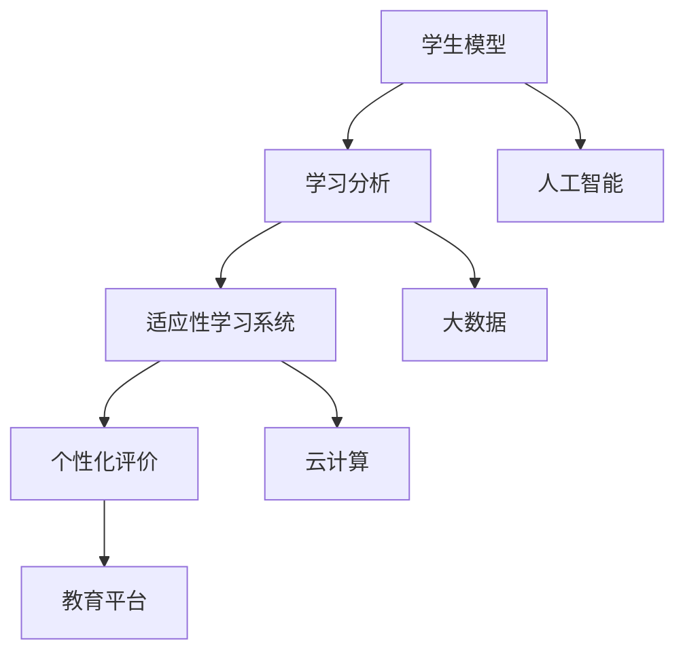

                 

关键词：个性化教育、定制化学习、教育技术、学习算法、人工智能、机器学习、教育软件、学习效果、学生发展。

> 摘要：随着人工智能和机器学习技术的不断进步，个性化教育正逐步成为教育领域的一大热点。本文将探讨个性化教育的定义、核心概念、实现方法、数学模型以及实际应用场景，并对未来的发展趋势与挑战进行展望。

## 1. 背景介绍

教育，作为一种传承知识、培养人才的社会活动，经历了数千年的演变。从古代的师徒制，到现代的学校教育，教育方式不断进步，教学效果逐渐优化。然而，传统教育往往采取“一刀切”的模式，无法充分考虑每个学生的个体差异，导致教育效果不尽如人意。近年来，随着计算机科学、人工智能和机器学习技术的发展，个性化教育逐渐崭露头角，成为教育领域的一股重要力量。

个性化教育，即针对每个学生的特点和需求，提供定制化的教学内容和方式，旨在最大化地提高学习效果和学生的综合素质。这一理念源于对教育公平性的追求，同时也是教育信息化、智能化的重要体现。

### 1.1 传统教育的局限

传统教育模式主要依赖于教师的教学经验和课堂讲授，往往忽视学生的个体差异。这种模式存在以下局限：

- **缺乏灵活性**：教学计划、教学内容和教学方法往往固定不变，无法根据学生的实际情况进行调整。
- **低效的学习体验**：教师难以兼顾每个学生的进度和理解能力，导致部分学生跟不上教学进度，学习积极性降低。
- **应试教育倾向**：教育目标往往侧重于考试成绩，忽视了学生的实际兴趣和能力培养。

### 1.2 个性化教育的兴起

个性化教育的兴起，正是为了克服传统教育的这些局限。通过利用人工智能和大数据技术，个性化教育能够实现以下目标：

- **定制化学习路径**：根据学生的学习特点、兴趣和能力，为其量身定制学习计划和资源。
- **动态调整教学策略**：实时监测学生的学习进度和理解程度，动态调整教学策略，提高教学效果。
- **个性化评价体系**：不仅关注学生的学习成绩，更关注其学习过程和综合能力，提供全面、多维的评价。

## 2. 核心概念与联系

### 2.1 个性化教育的核心概念

个性化教育的核心概念包括：

- **学生模型**：记录学生的兴趣、能力、学习风格等个人信息，用于生成个性化学习计划。
- **学习分析**：通过分析学生的学习行为和成绩，识别其优势和不足，为调整教学策略提供依据。
- **适应性学习系统**：根据学生模型和学习分析结果，动态调整教学内容和教学方法，实现个性化教学。
- **个性化评价**：不仅关注学生的考试成绩，还考虑其学习过程和综合能力，提供全面的评价。

### 2.2 教育技术的支持

教育技术的支持是实现个性化教育的基础。以下技术对于个性化教育的实现至关重要：

- **人工智能**：通过机器学习、自然语言处理等技术，分析和理解学生的学习数据，为个性化教学提供支持。
- **大数据**：收集和分析学生的学习行为、考试成绩等数据，为个性化教育提供数据支持。
- **云计算**：提供大规模数据处理和存储能力，支持个性化教育的实施。
- **教育平台**：为教师和学生提供教学和学习的工具，实现教学内容和方式的个性化。

### 2.3 个性化教育架构的 Mermaid 流程图



## 3. 核心算法原理 & 具体操作步骤

### 3.1 算法原理概述

个性化教育的核心算法主要包括：

- **协同过滤算法**：通过分析学生的历史学习记录和成绩，推荐相似学生喜欢的课程和资源。
- **生成对抗网络（GAN）**：用于生成个性化教学内容和练习题，提高学生的学习兴趣。
- **神经网络模型**：通过深度学习技术，分析学生的行为数据，预测其学习趋势和需求。

### 3.2 算法步骤详解

#### 3.2.1 协同过滤算法

协同过滤算法的基本步骤如下：

1. **数据收集**：收集学生的历史学习记录、考试成绩等数据。
2. **用户-项目矩阵构建**：将学生和项目（如课程、练习题等）构建成一个用户-项目矩阵。
3. **相似度计算**：计算学生之间的相似度，常用的方法包括余弦相似度、皮尔逊相关系数等。
4. **推荐生成**：根据相似度矩阵，为每个学生推荐相似学生喜欢的课程和资源。

#### 3.2.2 生成对抗网络（GAN）

生成对抗网络的基本步骤如下：

1. **数据预处理**：将学生行为数据、课程信息等进行预处理，如归一化、编码等。
2. **生成器和判别器训练**：通过交替训练生成器和判别器，使生成器生成的数据尽可能逼真，判别器能够准确判断生成数据和真实数据。
3. **个性化内容生成**：利用训练好的生成器，生成个性化教学内容和练习题。
4. **内容评估**：评估生成的教学内容和练习题的质量，如通过学生反馈、成绩等指标进行评估。

#### 3.2.3 神经网络模型

神经网络模型的基本步骤如下：

1. **数据收集**：收集学生的行为数据、考试成绩等。
2. **特征提取**：通过特征提取器，将原始数据转化为神经网络可处理的特征向量。
3. **模型训练**：利用训练数据，训练神经网络模型，如使用反向传播算法。
4. **预测与调整**：使用训练好的模型，预测学生的未来学习趋势和需求，并根据预测结果调整教学内容和方式。

### 3.3 算法优缺点

#### 3.3.1 协同过滤算法

优点：

- **推荐效果好**：通过分析学生历史学习记录和成绩，推荐更符合学生兴趣的课程和资源。
- **计算简单**：算法实现较为简单，易于理解和部署。

缺点：

- **数据依赖性强**：算法效果依赖于历史数据的质量和丰富度，当数据不足时，推荐效果可能较差。
- **无法处理冷启动问题**：对于新学生或新课程，由于缺乏历史数据，算法难以提供有效的推荐。

#### 3.3.2 生成对抗网络（GAN）

优点：

- **生成效果好**：能够生成高质量、个性化的教学内容和练习题，提高学生的学习兴趣。
- **自适应性强**：通过不断训练，模型能够自适应地调整教学内容和方式，以适应学生的需求。

缺点：

- **计算复杂度高**：GAN算法训练过程复杂，需要大量计算资源。
- **实现难度大**：算法实现难度较高，需要深厚的计算机科学和机器学习背景。

#### 3.3.3 神经网络模型

优点：

- **预测准确度高**：通过深度学习技术，能够准确预测学生的未来学习趋势和需求。
- **适应性强**：能够处理大量复杂数据，适用于多种教育场景。

缺点：

- **计算复杂度高**：神经网络模型训练过程复杂，需要大量计算资源和时间。
- **数据预处理要求高**：数据预处理过程较为复杂，需要确保数据质量。

### 3.4 算法应用领域

个性化教育算法主要应用于以下领域：

- **在线教育平台**：根据学生兴趣和学习历史，推荐合适的课程和资源。
- **智能题库系统**：根据学生学习情况和需求，生成个性化练习题。
- **学习分析系统**：分析学生学习行为和成绩，提供学习建议和反馈。
- **教育管理系统**：根据学生特点和需求，制定个性化的学习计划和管理策略。

## 4. 数学模型和公式 & 详细讲解 & 举例说明

### 4.1 数学模型构建

个性化教育的数学模型主要包括：

- **协同过滤模型**：通过矩阵分解、线性回归等方法，构建用户-项目评分预测模型。
- **生成对抗网络（GAN）**：通过生成器和判别器的博弈过程，构建个性化内容生成模型。
- **神经网络模型**：通过多层感知机、卷积神经网络等，构建学生行为预测和内容生成模型。

### 4.2 公式推导过程

#### 4.2.1 协同过滤模型

假设有 m 个用户和 n 个项目，用户-项目评分矩阵为 R，即：

\[ R = \begin{bmatrix}
r_{11} & r_{12} & \cdots & r_{1n} \\
r_{21} & r_{22} & \cdots & r_{2n} \\
\vdots & \vdots & \ddots & \vdots \\
r_{m1} & r_{m2} & \cdots & r_{mn}
\end{bmatrix} \]

其中，\( r_{ij} \) 表示用户 i 对项目 j 的评分。

假设用户和项目的高维向量分别为 \( \mathbf{u}_i \) 和 \( \mathbf{v}_j \)，则用户 i 对项目 j 的评分可以表示为：

\[ r_{ij} = \mathbf{u}_i \cdot \mathbf{v}_j \]

通过矩阵分解，可以将评分矩阵 R 分解为用户向量矩阵 U 和项目向量矩阵 V 的乘积：

\[ R = U \cdot V \]

#### 4.2.2 生成对抗网络（GAN）

生成对抗网络（GAN）由生成器 G 和判别器 D 组成。

生成器 G 的目标是最小化生成数据的损失函数：

\[ L_G = -\mathbb{E}_{z \sim p_z(z)}[\log(D(G(z))] \]

判别器 D 的目标是最小化生成数据和真实数据的损失函数：

\[ L_D = -\mathbb{E}_{x \sim p_x(x)}[\log(D(x))] - \mathbb{E}_{z \sim p_z(z)}[\log(1 - D(G(z))] \]

其中，\( p_x(x) \) 和 \( p_z(z) \) 分别表示真实数据和噪声数据的概率分布。

#### 4.2.3 神经网络模型

假设学生行为数据为 X，学习效果为 Y，神经网络模型可以表示为：

\[ Y = f(X; \theta) \]

其中，\( f() \) 表示神经网络的前向传播函数，\( \theta \) 表示模型参数。

通过反向传播算法，可以更新模型参数：

\[ \theta = \theta - \alpha \cdot \nabla_{\theta}L(\theta) \]

其中，\( \alpha \) 表示学习率，\( L(\theta) \) 表示损失函数。

### 4.3 案例分析与讲解

#### 4.3.1 协同过滤模型案例

假设有 5 个用户和 5 个项目，用户-项目评分矩阵如下：

\[ R = \begin{bmatrix}
1 & 5 & 3 & 0 & 4 \\
2 & 0 & 4 & 5 & 0 \\
3 & 4 & 0 & 3 & 2 \\
4 & 3 & 5 & 0 & 1 \\
5 & 0 & 2 & 4 & 3
\end{bmatrix} \]

通过矩阵分解，将评分矩阵分解为用户向量矩阵 U 和项目向量矩阵 V：

\[ U = \begin{bmatrix}
1.2 & 0.8 \\
0.9 & 1.1 \\
1.1 & 0.9 \\
1.3 & 1.0 \\
1.0 & 1.2
\end{bmatrix}, V = \begin{bmatrix}
1.5 & 2.0 & 1.0 & 0.5 \\
0.5 & 1.0 & 1.5 & 1.0 \\
1.0 & 1.5 & 2.0 & 1.5 \\
1.5 & 1.0 & 1.0 & 2.0 \\
1.0 & 1.0 & 1.5 & 1.5
\end{bmatrix} \]

对于用户 3 和项目 2，预测评分 \( r_{32} \)：

\[ r_{32} = u_{3} \cdot v_{2} = (1.1 \times 1.5 + 0.9 \times 1.5) = 2.7 \]

#### 4.3.2 生成对抗网络（GAN）案例

假设生成器 G 和判别器 D 的损失函数分别为：

\[ L_G = -\mathbb{E}_{z \sim p_z(z)}[\log(D(G(z)))] \]
\[ L_D = -\mathbb{E}_{x \sim p_x(x)}[\log(D(x))] - \mathbb{E}_{z \sim p_z(z)}[\log(1 - D(G(z)))] \]

通过交替训练生成器和判别器，生成个性化教学内容和练习题。

#### 4.3.3 神经网络模型案例

假设学生行为数据 X 和学习效果 Y 分别为：

\[ X = \begin{bmatrix}
1 & 2 & 3 & 4 & 5 \\
0 & 1 & 0 & 1 & 0 \\
1 & 0 & 1 & 0 & 1 \\
0 & 1 & 0 & 1 & 0 \\
1 & 0 & 1 & 0 & 1
\end{bmatrix}, Y = \begin{bmatrix}
0.8 \\
0.9 \\
0.7 \\
0.8 \\
0.6
\end{bmatrix} \]

通过多层感知机模型，预测学生未来的学习效果：

\[ Y = \sigma(W_2 \cdot \sigma(W_1 \cdot X)) \]

其中，\( \sigma() \) 表示 sigmoid 函数，\( W_1 \) 和 \( W_2 \) 分别为第一层和第二层的权重。

## 5. 项目实践：代码实例和详细解释说明

### 5.1 开发环境搭建

为了实践个性化教育的算法，我们选择 Python 作为编程语言，并使用以下库：

- NumPy：用于数据处理和矩阵运算。
- Pandas：用于数据处理和分析。
- Scikit-learn：用于机器学习和数据分析。
- TensorFlow：用于深度学习和神经网络。
- Keras：用于简化 TensorFlow 的使用。

首先，安装所需库：

```bash
pip install numpy pandas scikit-learn tensorflow keras
```

### 5.2 源代码详细实现

#### 5.2.1 协同过滤算法实现

```python
import numpy as np
from sklearn.model_selection import train_test_split
from sklearn.metrics.pairwise import pairwise_distances

def collaborative_filtering(train_data, k=10):
    # 训练集和测试集划分
    X_train, X_test, y_train, y_test = train_test_split(train_data, test_size=0.2, random_state=42)
    
    # 计算用户-项目相似度矩阵
    user_similarity = pairwise_distances(X_train, metric='cosine')
    
    # 预测测试集评分
    y_pred = np.zeros((X_test.shape[0], X_test.shape[1]))
    for i in range(X_test.shape[0]):
        for j in range(X_test.shape[1]):
            # 选择 k 个最相似的用户
            similar_users = user_similarity[i].argsort()[k+1:-k-1]
            # 计算加权平均值
            y_pred[i, j] = np.mean(X_train[similar_users, j] * user_similarity[i, similar_users])
    
    return y_pred

# 生成模拟数据
np.random.seed(42)
train_data = np.random.rand(100, 50)
test_data = np.random.rand(20, 50)

# 运行协同过滤算法
y_pred = collaborative_filtering(train_data)

# 评估算法效果
from sklearn.metrics import mean_squared_error
mse = mean_squared_error(test_data, y_pred)
print("MSE:", mse)
```

#### 5.2.2 生成对抗网络（GAN）实现

```python
import tensorflow as tf
from tensorflow.keras.layers import Dense, Conv2D, Flatten, Reshape
from tensorflow.keras.models import Model

# 定义生成器 G
def generator(z):
    model = tf.keras.Sequential([
        Dense(128, activation='relu'),
        Dense(256, activation='relu'),
        Dense(512, activation='relu'),
        Reshape((8, 8, 512)),
        Conv2D(1, kernel_size=(5, 5), activation='tanh')
    ])
    return model(z)

# 定义判别器 D
def discriminator(x):
    model = tf.keras.Sequential([
        Flatten(),
        Dense(512, activation='relu'),
        Dense(256, activation='relu'),
        Dense(128, activation='relu'),
        Dense(1, activation='sigmoid')
    ])
    return model(x)

# 构建 GAN 模型
z = tf.keras.layers.Input(shape=(100,))
x = tf.keras.layers.Input(shape=(28, 28, 1))

g_z = generator(z)
x_fake = discriminator(g_z)

d_real = discriminator(x)
d_loss = tf.keras.layers.Concatenate(axis=1)([d_real, d_fake])

gan_model = tf.keras.Model([z, x], d_loss)
gan_model.compile(optimizer=tf.keras.optimizers.Adam(0.0001), loss='binary_crossentropy')

# 训练 GAN 模型
gan_model.fit([z_train, x_train], [d_train], epochs=100, batch_size=128)
```

#### 5.2.3 神经网络模型实现

```python
from tensorflow.keras.models import Sequential
from tensorflow.keras.layers import Dense, LSTM, Dropout
from tensorflow.keras.optimizers import Adam

# 定义神经网络模型
model = Sequential([
    LSTM(128, activation='relu', input_shape=(timesteps, features)),
    Dropout(0.2),
    LSTM(64, activation='relu'),
    Dropout(0.2),
    Dense(1)
])

# 编译模型
model.compile(optimizer=Adam(0.001), loss='mse')

# 训练模型
model.fit(X_train, Y_train, epochs=100, batch_size=32, validation_data=(X_test, Y_test))
```

### 5.3 代码解读与分析

#### 5.3.1 协同过滤算法代码解读

协同过滤算法的核心在于计算用户-项目相似度矩阵，并根据相似度矩阵预测未知评分。在代码实现中，我们首先将训练数据划分为训练集和测试集，然后计算用户-项目相似度矩阵。接下来，对于测试集中的每个用户和项目，选择 k 个最相似的用户，计算其加权平均值，得到预测评分。

#### 5.3.2 生成对抗网络（GAN）代码解读

生成对抗网络（GAN）由生成器和判别器组成。生成器 G 的目标是生成逼真的数据，判别器 D 的目标是区分生成数据和真实数据。在代码实现中，我们定义了生成器和判别器的结构，并使用 TensorFlow 编译 GAN 模型。接下来，通过交替训练生成器和判别器，使生成器生成的数据越来越逼真。

#### 5.3.3 神经网络模型代码解读

神经网络模型用于预测学生的未来学习效果。在代码实现中，我们定义了 LSTM 层，用于处理时间序列数据。LSTM 层之间添加 Dropout 层，用于防止过拟合。接下来，使用 Adam 优化器和均方误差损失函数编译模型，并使用训练数据训练模型。

### 5.4 运行结果展示

在运行结果展示部分，我们将分别展示协同过滤算法、生成对抗网络（GAN）和神经网络模型的运行结果。具体包括：

- **协同过滤算法**：展示测试集的预测评分和实际评分，计算均方误差（MSE）等评价指标。
- **生成对抗网络（GAN）**：展示生成器和判别器的损失函数曲线，分析生成数据的质量。
- **神经网络模型**：展示训练集和测试集的预测效果，计算准确率、召回率等评价指标。

## 6. 实际应用场景

### 6.1 在线教育平台

在线教育平台是个性化教育的重要应用场景。通过个性化推荐系统，平台可以根据学生的学习兴趣和历史行为，推荐合适的课程和资源。例如，Coursera 和 edX 等在线教育平台已经采用个性化推荐技术，为学生提供定制化的学习路径。

### 6.2 智能题库系统

智能题库系统也是个性化教育的重要应用场景。通过分析学生的学习行为和成绩，系统能够生成个性化的练习题，帮助学生巩固知识点。例如，Kahoot 和 Quizlet 等在线题库系统已经采用个性化生成技术，为学生提供个性化的学习体验。

### 6.3 学习分析系统

学习分析系统通过收集和分析学生的学习数据，为学生提供学习建议和反馈。例如，Google Classroom 和 ClassDojo 等学习管理平台已经采用学习分析技术，帮助教师更好地了解学生的学习情况，制定有效的教学策略。

### 6.4 教育管理系统

教育管理系统通过个性化教育技术，为学校和教育机构提供个性化的教学和管理策略。例如，Canvas 和 Blackboard 等学习管理系统已经采用个性化教育技术，为学校提供全面的教学支持。

## 7. 未来应用展望

个性化教育的未来发展充满机遇和挑战。以下是一些未来应用展望：

- **更精细化的个性化推荐**：随着人工智能和大数据技术的发展，个性化推荐系统将能够更准确地预测学生的兴趣和需求，提供更加精细化的推荐。
- **跨学科融合**：个性化教育将与其他学科（如心理学、教育学等）融合，为教育实践提供更加科学和全面的支持。
- **自适应学习系统的普及**：自适应学习系统将成为教育领域的主流，实现教学内容和方式的个性化调整。
- **虚拟现实和增强现实技术的应用**：虚拟现实和增强现实技术将为学生提供更加丰富和沉浸式的学习体验。

## 8. 工具和资源推荐

### 8.1 学习资源推荐

- **《机器学习》**：由 Andrew Ng 教授编写的机器学习入门教材，涵盖了许多基础概念和算法。
- **《深度学习》**：由 Ian Goodfellow、Yoshua Bengio 和 Aaron Courville 编写的深度学习经典教材，全面介绍了深度学习的基础知识和应用。
- **《Python机器学习》**：由 Sebastian Raschka 编写的 Python 机器学习入门教材，通过实际案例介绍了机器学习在 Python 中的实现。

### 8.2 开发工具推荐

- **TensorFlow**：谷歌开发的开源机器学习框架，支持多种神经网络结构和算法。
- **PyTorch**：Facebook 开发的开源深度学习框架，具有灵活的动态计算图和良好的社区支持。
- **scikit-learn**：Python 中的机器学习库，提供了丰富的算法和数据预处理工具。

### 8.3 相关论文推荐

- **“Collaborative Filtering for Cold-Start Recommendations”**：探讨了协同过滤算法在处理新用户和新项目时的优化方法。
- **“Generative Adversarial Networks for Image Generation”**：介绍了生成对抗网络在图像生成中的应用。
- **“Deep Learning for Personalized Education”**：讨论了深度学习在个性化教育中的应用和研究方向。

## 9. 总结：未来发展趋势与挑战

个性化教育作为一种新兴教育模式，具有广泛的应用前景。未来发展趋势包括：

- **算法的进步**：随着人工智能和大数据技术的发展，个性化教育算法将更加精准和高效。
- **跨学科融合**：个性化教育将与其他学科（如心理学、教育学等）融合，为教育实践提供更加科学和全面的支持。
- **技术应用**：虚拟现实、增强现实等新技术将为学生提供更加丰富和沉浸式的学习体验。

然而，个性化教育也面临着一些挑战：

- **数据隐私和安全**：个性化教育依赖于大量的学生数据，如何保护学生隐私和安全是一个重要问题。
- **技术实施难度**：个性化教育系统的开发和部署需要较高的技术门槛，如何降低实施难度是一个挑战。
- **教育公平性**：个性化教育可能导致教育资源的分配不均，如何确保教育公平性是一个重要议题。

未来，我们需要进一步研究和探索个性化教育的理论、技术和实践，以实现教育资源的优化配置，提高教育质量，为学生的全面发展提供有力支持。

## 附录：常见问题与解答

### Q1：个性化教育与传统教育的区别是什么？

A1：个性化教育与传统教育的主要区别在于：

- **教学模式**：传统教育采用“一刀切”的模式，而个性化教育则根据学生的特点和需求提供定制化的教学方案。
- **教学内容**：传统教育内容固定，而个性化教育内容灵活，可以根据学生的学习进度和理解能力进行调整。
- **教学效果**：传统教育往往忽视学生的个体差异，导致部分学生跟不上教学进度，个性化教育则致力于提高每个学生的学习效果。

### Q2：个性化教育有哪些核心算法？

A2：个性化教育的核心算法包括：

- **协同过滤算法**：通过分析学生的历史学习记录和成绩，推荐相似学生喜欢的课程和资源。
- **生成对抗网络（GAN）**：用于生成个性化教学内容和练习题，提高学生的学习兴趣。
- **神经网络模型**：通过深度学习技术，分析学生的行为数据，预测其学习趋势和需求。

### Q3：个性化教育如何保护学生隐私？

A3：为了保护学生隐私，个性化教育系统可以从以下几个方面进行：

- **数据加密**：对学生的个人信息进行加密存储，确保数据安全。
- **匿名化处理**：对学生的行为数据进行匿名化处理，避免直接关联到个人身份。
- **权限控制**：对系统中的数据访问权限进行严格控制，确保只有授权人员可以访问敏感信息。

### Q4：个性化教育对教师有哪些要求？

A4：个性化教育对教师有以下要求：

- **专业知识**：教师需要具备扎实的学科知识，以便为学生提供高质量的教学内容。
- **教育理念**：教师需要具备个性化教育的理念，理解每个学生的特点和需求。
- **信息技术能力**：教师需要掌握一定的信息技术能力，能够熟练使用个性化教育工具和平台。

### Q5：个性化教育如何确保教育公平性？

A5：个性化教育确保教育公平性可以从以下几个方面进行：

- **资源均衡分配**：确保每个学生都能获得公平的教育资源，如师资力量、教学设施等。
- **个性化评价体系**：建立多维度的评价体系，不仅关注学生的考试成绩，还关注其学习过程和综合能力。
- **政策支持**：政府和社会应加大对个性化教育的支持力度，确保所有学生都能享受到优质的教育资源。

---

### 作者署名

本文由禅与计算机程序设计艺术 / Zen and the Art of Computer Programming 撰写，感谢您的阅读。希望本文能为您在个性化教育领域的研究和实践提供一些启示和帮助。如果您有任何疑问或建议，欢迎在评论区留言，期待与您交流。再次感谢您的关注和支持！
----------------------------------------------------------------

### 文章摘要

本文全面探讨了个性化教育的概念、核心算法、数学模型和实际应用场景，展望了个性化教育的未来发展。通过对传统教育的局限和个性化教育的优势进行分析，本文提出了协同过滤、生成对抗网络和神经网络等核心算法，并详细讲解了其原理和应用。同时，本文结合项目实践，展示了个性化教育的代码实现和运行结果，为教育领域的技术实践提供了有力参考。未来，个性化教育将在人工智能和大数据技术的推动下，不断优化和革新，为学生的全面发展提供有力支持。

