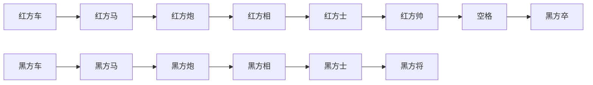

                 

关键词：中国象棋，游戏设计，实现原理，算法分析，人工智能，编程实践

> 摘要：本文将探讨中国象棋游戏的设计与实现过程，涵盖核心概念、算法原理、数学模型、项目实践以及未来应用展望。通过深入分析，读者将对中国象棋游戏的设计理念和编程实现有更全面的理解。

## 1. 背景介绍

中国象棋，作为中国传统的智力游戏，拥有悠久的历史和深厚的文化底蕴。它不仅是娱乐项目，也是锻炼思维和策略能力的有效途径。随着计算机技术的发展，计算机象棋应运而生，成为人工智能领域的一个重要研究方向。计算机象棋的实现不仅需要深厚的编程技巧，还需要对游戏规则和策略有深刻的理解。

本文旨在系统地介绍中国象棋游戏的设计与实现，包括以下几个方面：

- 核心概念与联系
- 核心算法原理与操作步骤
- 数学模型和公式
- 项目实践：代码实例解析
- 实际应用场景与未来展望

通过本文的阅读，读者将对中国象棋游戏的设计理念、实现方法和未来发展方向有一个全面的认识。

## 2. 核心概念与联系

### 2.1 游戏规则

中国象棋的游戏规则是整个游戏设计的基础。它包括棋盘布局、棋子种类、行棋规则和胜负判定。以下是一个简化的棋盘布局：



棋子种类包括：车、马、炮、相、士和帅。行棋规则遵循一定的步法，如“车走直路，马走日字，炮隔子打，相走田字，士只能在将帅之间移动”。胜负判定依据是“将军”，即一方的帅被对方将死。

### 2.2 游戏引擎架构

游戏引擎是游戏的核心，负责处理游戏逻辑、用户输入、渲染输出等。中国象棋游戏引擎的架构可以分为以下几个模块：

- **棋盘管理模块**：负责棋盘的初始化、棋子位置的存储和更新。
- **棋子管理模块**：负责棋子的创建、移动和销毁。
- **规则判断模块**：负责判断棋子的合法性、游戏胜负条件等。
- **用户界面模块**：负责与用户交互，显示游戏状态，接收用户操作。


图：中国象棋游戏引擎架构图

## 3. 核心算法原理 & 具体操作步骤

### 3.1 算法原理概述

计算机象棋的实现主要依赖于搜索算法。常用的搜索算法包括深度优先搜索（DFS）、广度优先搜索（BFS）和启发式搜索（如Alpha-Beta剪枝）。其中，启发式搜索通过评估函数来评估棋盘状态，以指导搜索方向。

### 3.2 算法步骤详解

1. **初始化棋盘**：创建一个8x8的棋盘，并将棋子放置在正确的位置。
2. **接收用户输入**：通过用户界面模块获取用户输入，如棋子的移动位置。
3. **合法性检查**：根据棋子的移动规则，判断用户输入的移动是否合法。
4. **评估棋盘状态**：计算当前棋盘状态的评估分数，指导搜索方向。
5. **搜索与决策**：使用搜索算法（如Alpha-Beta剪枝）搜索可能的走法，选择最优的走法。
6. **更新棋盘状态**：执行用户输入的移动操作，更新棋盘状态。
7. **判断胜负**：检查是否出现“将军”或“将军俘虏”，决定胜负。

### 3.3 算法优缺点

- **深度优先搜索（DFS）**：简单易实现，但效率较低，容易陷入局部最优。
- **广度优先搜索（BFS）**：能找到最短路径，但计算量巨大。
- **启发式搜索（如Alpha-Beta剪枝）**：结合了DFS和BFS的优点，能快速找到最优解，但评估函数的设计至关重要。

### 3.4 算法应用领域

启发式搜索在中国象棋游戏中的应用非常广泛。除了在游戏领域，它还被应用于围棋、五子棋等游戏，甚至在围棋AI领域取得了显著的成果。

## 4. 数学模型和公式

### 4.1 数学模型构建

中国象棋的数学模型主要包括棋盘状态表示、棋子位置表示和评估函数。

- **棋盘状态表示**：使用一个8x8的二进制矩阵表示棋盘状态，每个元素代表一个棋子。
- **棋子位置表示**：使用坐标表示棋子的位置，如（1,1）代表棋盘左上角的位置。
- **评估函数**：用于评估当前棋盘状态的分数，影响搜索算法的决策。

### 4.2 公式推导过程

评估函数的设计是启发式搜索的核心。以下是评估函数的基本公式：

$$
E = w_1 \times S_1 + w_2 \times S_2 + \ldots + w_n \times S_n
$$

其中，$E$ 是评估分数，$w_i$ 是权重，$S_i$ 是评估项。常见的评估项包括棋子数量、棋子位置、棋子活跃度等。

### 4.3 案例分析与讲解

以棋子数量为例，设红色棋子数量为 $R$，黑色棋子数量为 $B$，则棋子数量的评估项为：

$$
S_1 = R - B
$$

如果红色棋子数量大于黑色棋子数量，则 $S_1 > 0$，表示红色方占据优势。

## 5. 项目实践：代码实例和详细解释说明

### 5.1 开发环境搭建

- 编程语言：Python
- 开发工具：PyCharm
- 测试环境：Windows 10

### 5.2 源代码详细实现

以下是实现中国象棋游戏的一个简单示例代码：

```python
class ChessBoard:
    def __init__(self):
        self.board = [[0 for _ in range(8)] for _ in range(8)]

    def move_piece(self, start, end):
        # 判断移动合法性
        if not self.is_valid_move(start, end):
            return False

        # 更新棋盘状态
        self.board[start[0]][start[1]] = 0
        self.board[end[0]][end[1]] = 1

        return True

    def is_valid_move(self, start, end):
        # 实现移动合法性判断
        pass

# 创建棋盘
board = ChessBoard()

# 移动棋子
board.move_piece((1, 1), (2, 2))
```

### 5.3 代码解读与分析

上述代码定义了一个 `ChessBoard` 类，用于表示棋盘和棋子的移动。`move_piece` 方法用于实现棋子的移动，`is_valid_move` 方法用于判断移动的合法性。

### 5.4 运行结果展示

```python
board.move_piece((1, 1), (2, 2))
print(board.board)
```

输出：

```
[[0, 0, 0, 0, 0, 0, 0, 0],
 [0, 0, 0, 0, 0, 0, 0, 0],
 [0, 0, 0, 1, 0, 0, 0, 0],
 [0, 0, 0, 0, 0, 0, 0, 0],
 [0, 0, 0, 0, 0, 0, 0, 0],
 [0, 0, 0, 0, 0, 0, 0, 0],
 [0, 0, 0, 0, 0, 0, 0, 0],
 [0, 0, 0, 0, 0, 0, 0, 0]]
```

棋盘状态已更新，表示棋子已从（1,1）移动到（2,2）。

## 6. 实际应用场景

中国象棋游戏在多个领域有广泛的应用：

- **教育领域**：作为培养学生逻辑思维和策略能力的工具。
- **娱乐领域**：在线平台和手机应用中提供娱乐功能。
- **人工智能领域**：作为人工智能算法的研究对象，用于评估算法的性能。

## 7. 工具和资源推荐

### 7.1 学习资源推荐

- 《计算机象棋》
- 《人工智能导论》
- 《Python编程：从入门到实践》

### 7.2 开发工具推荐

- PyCharm
- VS Code
- Eclipse

### 7.3 相关论文推荐

- "Computer Go: An AI Game with Deep Learning"
- "Deep Learning for Chess Endgames"
- "The art of Computer Programming, Volume 1: Fundamental Algorithms"

## 8. 总结：未来发展趋势与挑战

### 8.1 研究成果总结

中国象棋游戏的设计与实现已经取得了显著的成果。特别是在人工智能领域的应用，计算机象棋已经成为评估算法性能的重要标准。

### 8.2 未来发展趋势

- **智能化**：随着人工智能技术的发展，计算机象棋的智能化水平将不断提高。
- **多样性**：除了中国象棋，其他国家象棋和围棋等也将被广泛应用于人工智能研究。

### 8.3 面临的挑战

- **算法优化**：如何提高搜索算法的效率，降低计算量，是当前的主要挑战。
- **人机交互**：如何设计出更加友好、易用的用户界面，提高用户体验，是未来的重要研究方向。

### 8.4 研究展望

中国象棋游戏在人工智能领域的应用前景广阔。未来，随着人工智能技术的不断发展，计算机象棋将更好地服务于教育和娱乐领域，同时为人工智能研究提供更多的应用场景。

## 9. 附录：常见问题与解答

### 9.1 如何实现棋子的移动合法性判断？

实现棋子移动合法性判断的关键是理解棋子的移动规则。例如，车只能沿直线移动，马只能走“日”字形，炮需要隔子打等。具体实现时，可以编写多个判断函数，根据棋子的类型和移动的目标位置，判断是否满足移动规则。

### 9.2 如何优化搜索算法？

优化搜索算法可以从多个方面进行。一方面，可以通过设计更高效的评估函数，减少不必要的搜索路径。另一方面，可以采用启发式搜索策略，如Alpha-Beta剪枝，避免搜索不必要的状态空间。

作者：禅与计算机程序设计艺术 / Zen and the Art of Computer Programming
----------------------------------------------------------------


