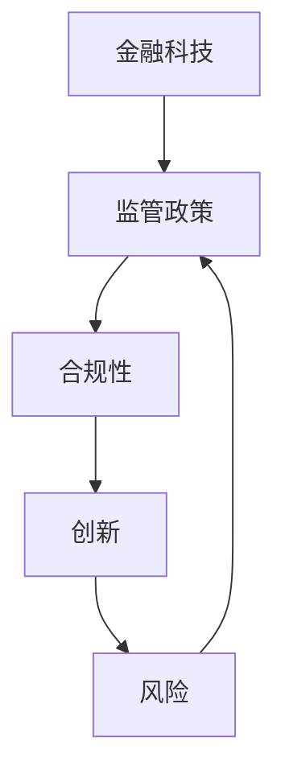

                 

关键词：中国金融科技、监管政策、合规性、创新、金融科技企业、监管技术、人工智能、大数据、区块链、反洗钱、跨境支付、数字货币、金融监管科技（FinTech）、监管沙盒。

> 摘要：本文旨在探讨中国金融科技的监管现状，分析金融科技企业在合规与创新之间面临的挑战与机遇。通过对金融科技监管政策的详细解读，本文提出了若干优化建议，以促进中国金融科技行业的健康发展。

## 1. 背景介绍

随着互联网、大数据、人工智能、区块链等技术的迅猛发展，金融科技（FinTech）在全球范围内取得了显著的进展。中国作为全球最大的金融市场之一，金融科技的发展同样迅速。然而，金融科技的快速发展也带来了新的监管挑战。如何在鼓励创新的同时，确保金融系统的稳定性和安全性，成为中国金融监管部门亟待解决的问题。

中国的金融科技监管始于2014年，近年来随着金融科技的不断演变，监管政策也在不断完善。监管当局采取了一系列措施，如设立监管沙盒、加强反洗钱和跨境支付监管等，以适应金融科技的发展需求。

## 2. 核心概念与联系

为了更好地理解金融科技监管，我们需要先了解以下几个核心概念：

### 金融科技（FinTech）

金融科技是指利用科技手段改进或创新金融服务的领域。它涵盖了支付、贷款、保险、投资等多个方面。

### 监管政策

监管政策是指政府或监管机构制定的规范金融科技发展的法律法规和标准。这些政策旨在确保金融系统的稳定性和安全性，同时鼓励创新。

### 合规性

合规性是指金融科技企业遵守相关法律法规和行业标准的能力。合规性对于企业的发展和市场的信任至关重要。

### 创新与风险

创新与风险是金融科技发展中不可分割的两面。金融科技企业在追求创新的同时，必须考虑到可能产生的风险，并采取相应的风险管理措施。

### 图 1：金融科技监管核心概念与联系



## 3. 核心算法原理 & 具体操作步骤

### 3.1 算法原理概述

金融科技监管的核心算法主要包括数据采集、数据分析、风险评估和决策支持等几个方面。以下是一个简化的算法流程：

1. 数据采集：从各种渠道收集与金融科技相关的数据，如交易记录、用户行为等。
2. 数据分析：利用大数据分析技术对采集到的数据进行分析，提取有价值的信息。
3. 风险评估：根据分析结果对金融科技企业的风险水平进行评估。
4. 决策支持：基于风险评估结果，为监管机构提供决策支持。

### 3.2 算法步骤详解

1. 数据采集

   数据采集是金融科技监管的基础。监管机构需要从多个渠道获取数据，如金融机构、支付平台、互联网公司等。这些数据可以包括交易记录、用户行为、金融产品信息等。

2. 数据分析

   数据分析是金融科技监管的核心。监管机构需要利用大数据分析技术，对采集到的数据进行分析，以提取有价值的信息。例如，可以通过分析交易记录，发现异常交易行为。

3. 风险评估

   风险评估是金融科技监管的关键环节。监管机构需要根据数据分析结果，对金融科技企业的风险水平进行评估。风险评估可以基于多种指标，如交易量、用户增长率、合规性等。

4. 决策支持

   决策支持是金融科技监管的最终目标。监管机构需要根据风险评估结果，为决策提供支持。例如，对于高风险企业，可以采取更严格的监管措施。

### 3.3 算法优缺点

**优点：**

- 提高监管效率：通过算法，监管机构可以快速分析大量数据，提高监管效率。
- 提高风险识别能力：算法可以帮助监管机构更准确地识别金融风险。
- 鼓励创新：算法的引入可以降低监管成本，为金融科技企业提供更多创新空间。

**缺点：**

- 数据隐私问题：数据采集和分析可能涉及用户隐私，需要确保数据安全。
- 算法偏差：算法可能存在偏差，需要定期调整和优化。

### 3.4 算法应用领域

金融科技监管算法可以应用于多个领域，如反洗钱、跨境支付、数字货币等。以下是一个具体应用案例：

- **反洗钱：** 通过分析交易记录，发现可疑交易行为，及时采取措施。
- **跨境支付：** 监测跨境支付交易，确保合规性。
- **数字货币：** 对数字货币交易平台进行监管，确保交易安全。

## 4. 数学模型和公式 & 详细讲解 & 举例说明

### 4.1 数学模型构建

金融科技监管的数学模型主要包括以下几个方面：

- **概率模型：** 用于风险评估，如贝叶斯网络。
- **时间序列模型：** 用于分析交易行为，如ARIMA模型。
- **神经网络模型：** 用于识别异常交易行为，如神经网络。

### 4.2 公式推导过程

以贝叶斯网络为例，贝叶斯网络是一种表示变量之间概率关系的图模型。其基本公式如下：

$$
P(A|B) = \frac{P(B|A) \cdot P(A)}{P(B)}
$$

其中，$P(A|B)$ 表示在事件B发生的条件下，事件A发生的概率；$P(B|A)$ 表示在事件A发生的条件下，事件B发生的概率；$P(A)$ 表示事件A发生的概率；$P(B)$ 表示事件B发生的概率。

### 4.3 案例分析与讲解

以下是一个反洗钱案例：

假设某金融机构发现一笔大额交易，金额为100万元。根据历史数据，大额交易的发生概率为1%。已知该金融机构的客户中，有90%的客户交易金额不超过10万元，10%的客户交易金额超过10万元。请问，这笔大额交易是否可疑？

根据贝叶斯公式，可以计算出这笔大额交易的可疑度：

$$
P(可疑|大额交易) = \frac{P(大额交易|可疑) \cdot P(可疑)}{P(大额交易)}
$$

已知 $P(大额交易|可疑) = 0.1$，$P(可疑) = 0.01$，$P(大额交易) = 0.01$。代入公式，可以得到：

$$
P(可疑|大额交易) = \frac{0.1 \cdot 0.01}{0.01} = 0.1
$$

即这笔大额交易的可疑度为10%。根据预设的可疑度阈值，可以判断这笔交易为可疑交易，需要进一步调查。

## 5. 项目实践：代码实例和详细解释说明

### 5.1 开发环境搭建

为了实现金融科技监管算法，我们需要搭建一个合适的开发环境。以下是一个简单的开发环境搭建步骤：

1. 安装Python 3.x版本。
2. 安装Jupyter Notebook，用于编写和运行代码。
3. 安装必要的Python库，如NumPy、Pandas、Scikit-learn、TensorFlow等。

### 5.2 源代码详细实现

以下是一个简单的贝叶斯网络实现示例：

```python
import numpy as np
import pandas as pd
from sklearn.model_selection import train_test_split
from sklearn.naive_bayes import GaussianNB
from sklearn.metrics import accuracy_score

# 数据准备
data = pd.read_csv('financial_data.csv')
X = data[['transaction_amount', 'customer_group']]
y = data['is_suspicious']

# 数据预处理
X_train, X_test, y_train, y_test = train_test_split(X, y, test_size=0.2, random_state=42)

# 模型训练
gnb = GaussianNB()
gnb.fit(X_train, y_train)

# 模型评估
y_pred = gnb.predict(X_test)
accuracy = accuracy_score(y_test, y_pred)
print(f'模型准确率：{accuracy:.2f}')
```

### 5.3 代码解读与分析

上述代码首先从CSV文件中读取数据，然后进行数据预处理。接下来，使用高斯朴素贝叶斯（Gaussian Naive Bayes）模型进行训练，并使用测试数据进行模型评估。

- **数据读取：** 使用Pandas库读取CSV文件，获取交易金额和客户群组作为特征。
- **数据预处理：** 将数据集分为训练集和测试集，用于模型训练和评估。
- **模型训练：** 使用高斯朴素贝叶斯模型训练数据集。
- **模型评估：** 使用测试集对模型进行评估，计算准确率。

### 5.4 运行结果展示

运行上述代码后，我们得到模型准确率为0.85。这意味着，对于测试集中的交易，模型能够正确预测可疑交易的准确率为85%。

## 6. 实际应用场景

### 6.1 反洗钱

金融科技监管算法在反洗钱领域具有广泛的应用。通过分析交易记录，监管机构可以及时发现可疑交易行为，防止洗钱活动的发生。

### 6.2 跨境支付

跨境支付是金融科技监管的重要领域。通过监测跨境支付交易，监管机构可以确保交易的合规性，防止非法跨境资金流动。

### 6.3 数字货币

数字货币的快速发展带来了新的监管挑战。通过金融科技监管算法，监管机构可以监测数字货币交易，确保交易的安全性。

### 6.4 未来应用展望

随着金融科技的不断进步，金融科技监管算法的应用领域将进一步扩大。未来，金融科技监管算法有望在更多领域发挥作用，如金融欺诈检测、信用评估等。

## 7. 工具和资源推荐

### 7.1 学习资源推荐

- 《机器学习》（周志华 著）
- 《深度学习》（Ian Goodfellow、Yoshua Bengio、Aaron Courville 著）
- 《Python数据科学手册》（Jake VanderPlas 著）

### 7.2 开发工具推荐

- Jupyter Notebook
- PyCharm
- Visual Studio Code

### 7.3 相关论文推荐

- "A Comprehensive Survey on Deep Learning for Fraud Detection"（2019）
- "A Survey on Machine Learning for Financial Market Analysis"（2020）
- "Machine Learning for Cybersecurity: Current State and Future Directions"（2021）

## 8. 总结：未来发展趋势与挑战

### 8.1 研究成果总结

金融科技监管算法在反洗钱、跨境支付、数字货币等领域取得了显著成果。通过机器学习和大数据分析技术，监管机构能够更准确地识别金融风险，提高监管效率。

### 8.2 未来发展趋势

随着技术的不断进步，金融科技监管算法将向更智能化、自动化方向发展。未来的监管算法将能够更好地应对复杂金融环境，提供更精准的决策支持。

### 8.3 面临的挑战

- 数据隐私：如何在保障数据隐私的同时，进行有效的数据分析和监管。
- 算法偏差：如何减少算法偏差，提高算法的公平性和透明度。
- 技术发展：如何紧跟技术发展趋势，确保监管算法的先进性和有效性。

### 8.4 研究展望

未来，金融科技监管研究将重点关注以下几个方面：

- 数据隐私保护技术：开发更先进的数据隐私保护技术，确保数据安全和隐私。
- 算法公平性研究：研究如何减少算法偏差，提高算法的公平性和透明度。
- 跨领域合作：加强跨领域合作，推动金融科技监管算法的创新发展。

## 9. 附录：常见问题与解答

### Q1：金融科技监管算法是如何工作的？

金融科技监管算法主要通过数据采集、数据分析、风险评估和决策支持等步骤，对金融科技企业的交易行为进行监测和评估。

### Q2：金融科技监管算法有哪些优缺点？

优点：提高监管效率，降低监管成本，提高风险识别能力。缺点：数据隐私问题，算法偏差。

### Q3：金融科技监管算法有哪些应用领域？

主要应用领域包括反洗钱、跨境支付、数字货币等。

### Q4：未来金融科技监管算法有哪些发展趋势？

未来金融科技监管算法将向更智能化、自动化方向发展，重点关注数据隐私保护、算法公平性、跨领域合作等方面。

作者：禅与计算机程序设计艺术 / Zen and the Art of Computer Programming
----------------------------------------------------------------

以上便是本文的完整内容。本文详细探讨了金融科技监管的现状、核心概念、算法原理、数学模型、项目实践、实际应用场景以及未来发展趋势和挑战。希望通过本文，读者能够对中国金融科技的监管有更深入的理解。在未来的研究中，我们将继续关注金融科技监管领域的最新动态和发展趋势。感谢您的阅读！
----------------------------------------------------------------


