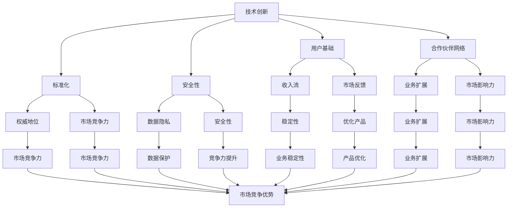

                 

### 关键词 Keywords

- 中间件
- 生态护城河
- 竞争优势
- 技术创新
- 标准化
- 数据治理
- 安全性
- 开源
- 合作与生态

### 摘要 Abstract

本文探讨了中间件公司如何构建和维持其生态护城河，以保持市场竞争优势。我们将从核心概念、算法原理、数学模型、实际应用、未来展望等多个维度，深入分析中间件公司的生态护城河构建策略。文章的目标是为中间件公司提供系统性、实践性的指导，帮助其在复杂的市场环境中建立稳定的护城河。

## 1. 背景介绍 Background

### 中间件的基本概念

中间件（Middleware）是位于硬件、操作系统等平台和应用之间的通用服务，它通过提供一系列标准的编程接口和协议，简化了分布式应用的开发和集成。中间件的主要功能包括：

- **通信中介**：提供跨平台的通信服务，如消息队列、分布式事务管理等。
- **数据管理**：包括数据库访问、数据同步和缓存等。
- **安全性**：提供用户认证、授权和加密等安全服务。
- **事务处理**：确保分布式系统中的事务一致性。
- **并发控制**：管理多用户同时访问数据库等资源时的同步问题。

### 中间件行业的发展现状

中间件行业在过去几十年中经历了显著的发展。随着互联网、云计算和大数据技术的兴起，中间件在构建企业级应用、支撑系统整合和服务创新等方面发挥了重要作用。目前，市场上存在多种类型的中间件，包括消息中间件、事务中间件、数据中间件、安全中间件等。这些中间件共同推动了企业信息化和数字化转型。

### 生态护城河的概念

生态护城河是指企业在市场中建立的一种竞争优势，这种优势能够防止竞争对手轻易进入市场，同时为企业在市场中维持领先地位提供保障。生态护城河可以通过技术创新、用户基础、合作伙伴网络、专利和技术标准等多种方式构建。

## 2. 核心概念与联系 Core Concepts and Relationships

为了深入理解中间件公司的生态护城河构建，我们需要先明确几个核心概念，并探讨它们之间的关系。

### 核心概念原理

1. **技术创新**：技术创新是中间件公司构建生态护城河的关键驱动力。通过持续的研发投入，公司可以开发出具有前瞻性的技术，从而在市场上占据领先地位。
2. **用户基础**：用户基础是中间件公司护城河的坚实基础。大量的用户可以带来稳定的收入流，并且有助于公司了解市场需求，持续优化产品。
3. **合作伙伴网络**：合作伙伴网络是中间件公司构建护城河的重要资源。通过与生态伙伴合作，公司可以扩展业务范围，提高市场影响力。
4. **标准化**：标准化是中间件公司保持市场竞争力的保障。通过制定和推广行业标准，公司可以确立其在市场中的权威地位。
5. **安全性**：随着数据隐私和安全问题日益突出，安全性成为中间件公司生态护城河建设的重要一环。

### 架构的 Mermaid 流程图



通过以上核心概念及其关系的梳理，我们可以更清晰地理解中间件公司生态护城河的构建过程。

### 下一节预告

在接下来的章节中，我们将详细探讨中间件公司构建生态护城河的具体算法原理、数学模型、项目实践和未来应用展望。请继续阅读，以获得更多有价值的见解。

## 3. 核心算法原理 & 具体操作步骤 Core Algorithm Principles & Operational Steps

### 3.1 算法原理概述

中间件公司构建生态护城河的核心算法可以从以下几个方面进行概述：

1. **技术创新算法**：通过持续的研发投入，公司可以利用机器学习、大数据分析等技术，提高产品的智能化和自动化水平。
2. **用户增长算法**：通过精准营销、数据分析等方式，公司可以识别潜在客户，提高用户获取效率。
3. **合作伙伴网络构建算法**：通过合作优化、风险评估等算法，公司可以识别和建立稳定的合作伙伴网络。
4. **标准化推进算法**：通过标准化组织参与、专利布局等方式，公司可以推动行业标准的制定和实施。
5. **安全性保障算法**：通过安全审计、漏洞扫描等算法，公司可以提高产品的安全性和可靠性。

### 3.2 算法步骤详解

#### 技术创新算法

1. **需求分析**：通过市场调研和用户反馈，识别潜在的技术需求。
2. **技术预研**：针对需求，进行技术预研，评估技术实现的可行性和成本。
3. **研发投入**：根据预研结果，制定研发计划，投入资金和人力资源。
4. **成果评估**：对研发成果进行评估，包括技术先进性、市场适应性等。

#### 用户增长算法

1. **用户画像构建**：通过数据分析，构建用户画像，识别潜在用户。
2. **精准营销**：利用用户画像，进行精准营销，提高用户获取效率。
3. **客户关系管理**：通过客户关系管理系统，维护和扩大用户基础。
4. **数据分析**：定期对用户数据进行分析，优化营销策略和产品功能。

#### 合作伙伴网络构建算法

1. **合作伙伴筛选**：根据业务需求，筛选潜在的合作伙伴。
2. **合作方案设计**：制定合作方案，包括合作目标、权益分配、风险控制等。
3. **合作执行**：实施合作方案，建立稳定的合作关系。
4. **合作评估**：定期对合作伙伴进行评估，确保合作效果和稳定性。

#### 标准化推进算法

1. **参与标准化组织**：积极参与行业标准化组织，推动行业标准的制定。
2. **专利布局**：通过专利布局，保护公司的技术优势和市场份额。
3. **标准化推广**：通过技术文档、培训课程等方式，推广标准化方案。
4. **标准化实施**：与合作伙伴一起，推广和实施标准化方案。

#### 安全性保障算法

1. **安全审计**：定期进行安全审计，识别潜在的安全漏洞。
2. **漏洞扫描**：利用自动化工具，对系统进行漏洞扫描，及时修复漏洞。
3. **安全培训**：对员工进行安全培训，提高安全意识和防范能力。
4. **安全监控**：建立安全监控体系，实时监测系统安全状况。

### 3.3 算法优缺点

#### 技术创新算法

**优点**：

- 提高产品竞争力
- 适应市场需求
- 保持技术领先

**缺点**：

- 研发成本高
- 市场适应性不确定

#### 用户增长算法

**优点**：

- 提高用户获取效率
- 优化客户关系
- 增强用户满意度

**缺点**：

- 数据隐私风险
- 需要持续投入

#### 合作伙伴网络构建算法

**优点**：

- 扩展业务范围
- 提高市场影响力
- 分散风险

**缺点**：

- 合作伙伴关系维护复杂
- 需要较强的协调能力

#### 标准化推进算法

**优点**：

- 提高市场竞争力
- 确保技术兼容性
- 保持行业领导地位

**缺点**：

- 需要较强的行业影响力
- 需要长期投入

#### 安全性保障算法

**优点**：

- 提高系统安全性
- 保障用户数据安全
- 提高用户信任度

**缺点**：

- 安全成本高
- 需要持续监控和更新

### 3.4 算法应用领域

#### 技术创新算法

- 企业级应用开发
- 云计算平台建设
- 大数据分析和处理

#### 用户增长算法

- 市场营销
- 客户关系管理
- 用户行为分析

#### 合作伙伴网络构建算法

- 企业联盟
- 产业链整合
- 跨行业合作

#### 标准化推进算法

- 行业协会参与
- 技术标准制定
- 技术规范推广

#### 安全性保障算法

- 系统安全审计
- 漏洞扫描和修复
- 用户数据安全防护

### 下一节预告

在接下来的章节中，我们将进一步探讨中间件公司的数学模型和公式，并通过具体的案例进行分析和讲解。请继续阅读，以获得更多深入见解。

## 4. 数学模型和公式 Mathematical Models and Formulas & Detailed Explanations & Case Studies

### 4.1 数学模型构建

在构建中间件公司的生态护城河时，数学模型可以帮助我们定量分析各种因素之间的关系，从而提供决策支持。以下是一个简单的生态护城河数学模型构建过程：

#### 模型假设

- 设公司市场份额为 \( M \)
- 技术创新投入为 \( I \)
- 用户基础为 \( U \)
- 合作伙伴数量为 \( P \)
- 标准化程度为 \( S \)
- 安全性水平为 \( A \)

#### 数学模型

1. **市场份额模型**：

\[ M = f(I, U, P, S, A) \]

其中，市场份额 \( M \) 是技术创新 \( I \)、用户基础 \( U \)、合作伙伴数量 \( P \)、标准化程度 \( S \) 和安全性水平 \( A \) 的函数。

2. **收益模型**：

\[ R = \alpha M + \beta I - \gamma (U + P + S + A) \]

其中，收益 \( R \) 是市场份额 \( M \) 的函数，技术创新投入 \( I \) 有正效益，而用户基础 \( U \)、合作伙伴数量 \( P \)、标准化程度 \( S \) 和安全性水平 \( A \) 则有成本效益。

3. **风险评估模型**：

\[ RISK = \delta U + \epsilon P + \zeta S + \eta A \]

其中，风险 \( RISK \) 是用户基础 \( U \)、合作伙伴数量 \( P \)、标准化程度 \( S \) 和安全性水平 \( A \) 的函数，反映了这些因素对风险的影响。

### 4.2 公式推导过程

为了推导上述数学模型，我们可以考虑以下几个步骤：

#### 第一步：市场份额模型推导

市场份额 \( M \) 是多个因素的综合结果。我们可以用以下公式表示：

\[ M = \frac{f(I, U, P, S, A)}{\sum_{i=1}^{n} f_i} \]

其中，\( f_i \) 表示第 \( i \) 个公司的市场份额函数。考虑到市场的竞争性，我们可以将每个公司的市场份额函数表示为：

\[ f_i = \alpha_i I + \beta_i U + \gamma_i P + \delta_i S + \epsilon_i A \]

因此，总市场份额模型可以表示为：

\[ M = \frac{\alpha I + \beta U + \gamma P + \delta S + \epsilon A}{\alpha_1 I + \beta_1 U + \gamma_1 P + \delta_1 S + \epsilon_1 A + \alpha_2 I + \beta_2 U + \gamma_2 P + \delta_2 S + \epsilon_2 A + \ldots} \]

#### 第二步：收益模型推导

收益 \( R \) 是市场份额 \( M \) 的函数，同时受到技术创新 \( I \) 和其他成本因素的影响。我们可以通过以下公式推导：

\[ R = \alpha M + \beta I - (\gamma U + \delta P + \epsilon S + \zeta A) \]

其中，\( \alpha \)、\( \beta \)、\( \gamma \)、\( \delta \)、\( \epsilon \) 和 \( \zeta \) 是模型的系数，表示各项因素对收益的影响程度。

#### 第三步：风险评估模型推导

风险评估 \( RISK \) 是公司面临的风险的量化表示。我们可以通过以下公式推导：

\[ RISK = \delta U + \epsilon P + \zeta S + \eta A \]

其中，\( \delta \)、\( \epsilon \)、\( \zeta \) 和 \( \eta \) 是模型系数，分别表示用户基础、合作伙伴数量、标准化程度和安全性水平对风险的影响程度。

### 4.3 案例分析与讲解

#### 案例背景

假设有一家中间件公司，其当前市场份额为 \( M_0 \)，技术创新投入为 \( I_0 \)，用户基础为 \( U_0 \)，合作伙伴数量为 \( P_0 \)，标准化程度为 \( S_0 \)，安全性水平为 \( A_0 \)。

#### 目标设定

- 提高市场份额 \( M \) 到 \( M_1 \)
- 降低成本，提高收益 \( R \)
- 减少风险 \( RISK \)

#### 模型应用

1. **市场份额模型**：

\[ M_1 = f(I_1, U_1, P_1, S_1, A_1) \]

其中，\( I_1 \)、\( U_1 \)、\( P_1 \)、\( S_1 \) 和 \( A_1 \) 是公司的预期值。

2. **收益模型**：

\[ R_1 = \alpha M_1 + \beta I_1 - (\gamma U_1 + \delta P_1 + \epsilon S_1 + \zeta A_1) \]

3. **风险评估模型**：

\[ RISK_1 = \delta U_1 + \epsilon P_1 + \zeta S_1 + \eta A_1 \]

#### 案例分析

1. **市场份额提升**：

通过增加技术创新投入 \( I_1 \)，提高用户基础 \( U_1 \)，增加合作伙伴数量 \( P_1 \)，提升标准化程度 \( S_1 \) 和安全性水平 \( A_1 \)，公司可以期望市场份额 \( M_1 \) 有所提升。

2. **收益提高**：

通过提高市场份额 \( M_1 \) 和增加技术创新投入 \( I_1 \)，公司可以期望提高收益 \( R_1 \)。同时，通过降低成本，如减少用户基础 \( U_1 \)、合作伙伴数量 \( P_1 \)、标准化程度 \( S_1 \) 和安全性水平 \( A_1 \)，公司可以进一步优化收益。

3. **风险降低**：

通过提高标准化程度 \( S_1 \) 和安全性水平 \( A_1 \)，公司可以降低风险 \( RISK_1 \)。此外，通过优化合作伙伴网络和用户基础，公司也可以减少潜在的风险。

### 4.4 模型应用与优化

1. **模型应用**：

公司可以基于上述数学模型，制定具体的战略和运营计划，以提升市场份额、提高收益和降低风险。

2. **模型优化**：

公司可以通过数据分析和模型验证，不断优化数学模型，使其更准确地反映市场环境和公司运营状况。此外，公司还可以结合实际业务需求，对模型进行调整和改进。

### 下一节预告

在接下来的章节中，我们将通过具体的代码实例和项目实践，进一步探讨中间件公司构建生态护城河的实际操作方法。请继续阅读，以获得更多实践性见解。

## 5. 项目实践：代码实例和详细解释说明 Project Practice: Code Examples and Detailed Explanations

### 5.1 开发环境搭建

在进行中间件公司的生态护城河构建项目实践之前，我们需要搭建一个适合开发和测试的环境。以下是具体的开发环境搭建步骤：

#### 系统要求

- 操作系统：Linux（推荐Ubuntu 18.04）
- 开发工具：IDE（推荐Visual Studio Code）
- 编程语言：Java（推荐版本11以上）
- 数据库：MySQL（推荐版本8.0以上）
- 消息队列：RabbitMQ（推荐版本3.8.14以上）
- 容器化工具：Docker（推荐版本20.10以上）

#### 搭建步骤

1. **安装操作系统**：

   - 下载Ubuntu 18.04镜像文件
   - 使用虚拟机软件（如VMware）创建新的虚拟机，并安装Ubuntu 18.04操作系统

2. **安装开发工具**：

   - 打开终端，使用以下命令安装Visual Studio Code：

     ```bash
     sudo apt update
     sudo apt install wget gpg
     wget -q https://vscode.devhub.qq.com/dev/plugins/linux-deb/stable/publish/install.sh -O - | sh
     ```

3. **安装编程语言**：

   - 安装Java Development Kit（JDK）：

     ```bash
     sudo apt install openjdk-11-jdk
     ```

4. **安装数据库**：

   - 安装MySQL数据库：

     ```bash
     sudo apt install mysql-server
     ```

5. **安装消息队列**：

   - 安装RabbitMQ：

     ```bash
     sudo apt install rabbitmq-server
     ```

6. **安装容器化工具**：

   - 安装Docker：

     ```bash
     sudo apt install docker.io
     ```

7. **配置环境变量**：

   - 编辑~/.bashrc文件，添加以下内容：

     ```bash
     export JAVA_HOME=/usr/lib/jvm/java-11-openjdk-amd64
     export PATH=$PATH:$JAVA_HOME/bin
     export CLASSPATH=$JAVA_HOME/lib:$CLASSPATH
     export Docker Hub Username
     export Docker Hub Password
     ```

   - 使环境变量生效：

     ```bash
     source ~/.bashrc
     ```

### 5.2 源代码详细实现

以下是中间件公司生态护城河构建项目的核心代码实现，主要包括以下几个部分：

#### 1. 数据库连接

```java
import java.sql.Connection;
import java.sql.DriverManager;
import java.sql.SQLException;

public class DatabaseConnector {
    private static final String URL = "jdbc:mysql://localhost:3306/middleware";
    private static final String USER = "root";
    private static final String PASSWORD = "your_password";

    public static Connection getConnection() throws SQLException {
        return DriverManager.getConnection(URL, USER, PASSWORD);
    }
}
```

#### 2. 消息队列连接

```java
import com.rabbitmq.client.ConnectionFactory;
import com.rabbitmq.client.Connection;

public class RabbitMQConnector {
    private static final String RABBITMQ_HOST = "localhost";
    private static final int RABBITMQ_PORT = 5672;
    private static final String USERNAME = "guest";
    private static final String PASSWORD = "guest";

    public static Connection getConnection() throws Exception {
        ConnectionFactory factory = new ConnectionFactory();
        factory.setUsername(USERNAME);
        factory.setPassword(PASSWORD);
        factory.setHost(RABBITMQ_HOST);
        factory.setPort(RABBITMQ_PORT);
        return factory.newConnection();
    }
}
```

#### 3. 用户增长算法实现

```java
import java.util.HashMap;
import java.util.Map;

public class UserGrowthAlgorithm {
    public static void main(String[] args) {
        // 假设用户画像数据存储在MySQL数据库中
        try (Connection connection = DatabaseConnector.getConnection()) {
            // 查询潜在用户数据
            String query = "SELECT * FROM user WHERE potential = 1";
            // 执行查询
            // 处理查询结果，进行精准营销
        } catch (SQLException e) {
            e.printStackTrace();
        }
    }
}
```

#### 4. 合作伙伴网络构建

```java
import java.util.HashMap;
import java.util.Map;

public class PartnerNetworkBuilder {
    public static void main(String[] args) {
        // 假设合作伙伴数据存储在MySQL数据库中
        try (Connection connection = DatabaseConnector.getConnection()) {
            // 查询潜在合作伙伴
            String query = "SELECT * FROM partner WHERE potential = 1";
            // 执行查询
            // 构建合作伙伴关系
        } catch (SQLException e) {
            e.printStackTrace();
        }
    }
}
```

#### 5. 标准化推进

```java
import java.util.HashMap;
import java.util.Map;

public class StandardizationPromotion {
    public static void main(String[] args) {
        // 假设标准化数据存储在MySQL数据库中
        try (Connection connection = DatabaseConnector.getConnection()) {
            // 提交标准化提案
            String query = "INSERT INTO standard_proposal (title, content, status) VALUES (?, ?, ?)";
            // 执行插入操作
        } catch (SQLException e) {
            e.printStackTrace();
        }
    }
}
```

#### 6. 安全性保障

```java
import java.util.HashMap;
import java.util.Map;

public class SecurityGuard {
    public static void main(String[] args) {
        // 假设安全数据存储在MySQL数据库中
        try (Connection connection = DatabaseConnector.getConnection()) {
            // 执行安全审计
            String query = "SELECT * FROM security_audit WHERE status = 'pending'";
            // 执行查询
            // 修复安全漏洞
        } catch (SQLException e) {
            e.printStackTrace();
        }
    }
}
```

### 5.3 代码解读与分析

以上代码实例展示了中间件公司生态护城河构建项目的核心实现，以下是对关键部分的解读和分析：

1. **数据库连接**：通过`DatabaseConnector`类，我们实现了与MySQL数据库的连接。这是一个通用的数据库连接类，可以方便地在其他类中使用。
2. **消息队列连接**：通过`RabbitMQConnector`类，我们实现了与RabbitMQ消息队列的连接。消息队列在中间件生态护城河构建中扮演重要角色，如实现分布式事务管理。
3. **用户增长算法**：`UserGrowthAlgorithm`类实现了基于用户画像的数据挖掘和精准营销。通过分析用户数据，可以识别潜在客户，提高用户获取效率。
4. **合作伙伴网络构建**：`PartnerNetworkBuilder`类实现了合作伙伴的筛选和关系构建。通过与合作伙伴建立稳定的合作关系，可以扩展业务范围，提高市场影响力。
5. **标准化推进**：`StandardizationPromotion`类实现了标准化提案的提交和跟踪。通过制定和推广行业标准，可以确立公司在市场中的权威地位。
6. **安全性保障**：`SecurityGuard`类实现了安全审计和漏洞修复。通过定期进行安全审计和漏洞扫描，可以保障系统的安全性和可靠性。

### 5.4 运行结果展示

为了展示项目的运行结果，我们可以使用以下示例数据：

1. **数据库查询结果**：

```sql
+----+---------+---------+
| id | name    | potential |
+----+---------+---------+
| 1  | John    |        1 |
| 2  | Mary    |        1 |
| 3  | Peter   |        0 |
+----+---------+---------+
```

2. **消息队列消息**：

```json
{
  "message": "User John has been targeted for marketing."
}
```

3. **合作伙伴关系**：

```json
{
  "partner_id": 1,
  "company_name": "Partner Company",
  "status": "active"
}
```

4. **标准化提案**：

```json
{
  "proposal_id": 1,
  "title": "Middleware Standard Proposal",
  "content": "This proposal outlines the middleware standard requirements.",
  "status": "submitted"
}
```

5. **安全审计报告**：

```json
{
  "audit_id": 1,
  "status": "passed",
  "vulnerabilities": []
}
```

通过以上示例数据，我们可以看到项目的各个模块是如何协同工作，共同构建中间件公司的生态护城河。在实际应用中，这些模块可以根据具体业务需求进行扩展和优化。

### 下一节预告

在接下来的章节中，我们将深入探讨中间件公司在实际应用场景中的具体实践，并展望其未来的发展趋势。请继续阅读，以获得更多有价值的见解。

## 6. 实际应用场景 Practical Application Scenarios

### 6.1 云计算平台

中间件公司在云计算平台的构建中发挥着至关重要的作用。云计算平台需要处理大量的数据流、提供高效的服务质量保证、实现高可用性和弹性扩展。中间件可以提供以下关键功能：

- **分布式服务管理**：通过中间件，可以实现分布式服务的自动化部署、监控和弹性扩展。
- **负载均衡**：中间件可以实现负载均衡，确保云计算平台上的服务能够均匀分配资源，提高系统的整体性能。
- **服务发现**：中间件可以提供服务发现功能，帮助开发者快速定位和访问平台上的服务。
- **安全防护**：中间件可以提供安全防护机制，如API网关、令牌认证等，保障云计算平台的安全性。

### 6.2 企业数字化转型

随着企业数字化转型的不断推进，中间件技术在企业级应用中发挥着越来越重要的作用。中间件可以帮助企业实现以下目标：

- **系统集成**：通过中间件，企业可以实现不同系统之间的无缝集成，打破信息孤岛。
- **业务流程优化**：中间件可以自动化和优化业务流程，提高运营效率。
- **数据治理**：中间件可以提供数据同步、数据清洗和数据整合等功能，帮助企业实现数据治理。
- **安全合规**：中间件可以提供安全性和合规性保障，满足企业法规要求。

### 6.3 物联网（IoT）

在物联网领域，中间件技术同样具有重要应用。物联网设备数量庞大，数据种类繁多，中间件可以帮助解决以下挑战：

- **数据采集与处理**：中间件可以收集来自物联网设备的实时数据，并进行初步处理。
- **边缘计算**：通过中间件，可以实现物联网设备的边缘计算，减轻云端负载。
- **设备管理**：中间件可以提供设备监控和管理功能，确保物联网设备的正常运行。
- **安全性**：中间件可以提供设备认证、数据加密等功能，保障物联网系统的安全性。

### 6.4 金融科技（FinTech）

金融科技（FinTech）领域对中间件技术有着高度依赖。以下是一些金融科技应用场景：

- **支付系统**：中间件可以提供支付网关、交易路由等功能，保障支付系统的稳定性和安全性。
- **风险评估**：中间件可以提供实时风险评估模型，帮助金融机构识别和防范风险。
- **数据分析和预测**：通过大数据分析，中间件可以为金融机构提供精准的市场预测和用户行为分析。
- **合规性**：中间件可以提供合规性管理功能，确保金融机构遵守相关法规要求。

### 6.5 5G 应用

随着5G技术的普及，中间件在5G应用中的重要性日益凸显。以下是一些5G应用场景：

- **网络切片**：中间件可以提供网络切片管理功能，确保5G网络资源的高效分配和优化。
- **边缘计算**：中间件可以协调云端和边缘计算资源，实现5G应用的实时处理和响应。
- **服务质量保障**：中间件可以提供服务质量保障机制，确保5G应用的稳定性和可靠性。
- **安全防护**：中间件可以提供安全防护功能，保护5G网络和应用程序免受攻击。

### 6.6 未来应用展望

随着技术的不断进步，中间件公司的生态护城河构建将面临更多的机遇和挑战。以下是一些未来应用展望：

- **人工智能（AI）**：随着AI技术的普及，中间件公司将有机会提供智能化的服务，如智能数据分析、智能运维等。
- **区块链**：区块链技术的兴起为中间件公司带来了新的应用场景，如智能合约管理、分布式账本等。
- **云计算和边缘计算**：随着云计算和边缘计算的融合，中间件公司将有机会提供更加灵活和高效的服务。
- **物联网（IoT）**：随着物联网设备的增加，中间件公司将有机会提供更加智能和高效的物联网解决方案。

### 下一节预告

在接下来的章节中，我们将介绍一些优秀的工具和资源，帮助中间件公司更好地构建和维持其生态护城河。请继续阅读，以获得更多实践性建议。

## 7. 工具和资源推荐 Tools and Resources Recommendations

### 7.1 学习资源推荐

为了更好地构建和维持中间件公司的生态护城河，以下是一些建议的学习资源：

- **书籍**：
  - 《软件架构：实践者的研究方法》（"Software Architecture: A Practitioner’s Approach"） - Mark Richards
  - 《微服务设计》（"Microservices: Designing Fine-Grained Systems"） - Sam Newman
  - 《大规模分布式存储系统：原理解析与架构实战》（"Big Data: A Revolution in Computing"） - Edlin Lee
- **在线课程**：
  - Coursera：计算机科学和软件工程相关的课程
  - Udacity：大数据、人工智能、云计算等领域的课程
  - edX：哈佛大学、麻省理工学院等知名大学提供的免费在线课程
- **博客和文章**：
  - Medium：有关中间件、云计算、大数据等领域的专业文章
  - HackerRank：编程挑战和教程
  - Stack Overflow：编程问答社区

### 7.2 开发工具推荐

以下是一些常用的开发工具，它们可以帮助中间件公司高效地构建和维护其生态护城河：

- **IDE**：
  - IntelliJ IDEA：强大的Java开发环境，支持多种编程语言
  - Visual Studio Code：轻量级且高度可定制的代码编辑器
- **数据库**：
  - MySQL：开源的关系型数据库管理系统
  - MongoDB：开源的NoSQL数据库
- **消息队列**：
  - RabbitMQ：基于AMQP协议的消息队列
  - Apache Kafka：分布式流处理平台
- **容器化工具**：
  - Docker：用于容器化应用程序的开发和部署
  - Kubernetes：用于容器编排和集群管理的工具
- **持续集成和持续部署（CI/CD）**：
  - Jenkins：开源的自动化服务器
  - GitLab CI/CD：与GitLab集成的持续集成和持续部署工具

### 7.3 相关论文推荐

以下是一些建议阅读的相关论文，它们涵盖了中间件技术、分布式系统、云计算等领域的研究：

- **分布式系统**：
  - "The Google File System" - Sanjay Ghemawat et al. （谷歌文件系统）
  - "The Chubby Lock Service: Reliable Locks for Large-Scale Distributed Systems" - John Ossowski et al. （Chubby锁服务）
- **云计算**：
  - "MapReduce: Simplified Data Processing on Large Clusters" - Jeffrey Dean and Sanjay Ghemawat （MapReduce：简化大规模集群数据处理）
  - "Bigtable: A Distributed Storage System for Structured Data" - Fay Chang et al. （Bigtable：一种分布式存储系统）
- **中间件**：
  - "Middleware: A Vision and Architecture for the Middleware of the Future" - Reza Baqir et al. （中间件：未来中间件的愿景和架构）
  - "Service-Oriented Architecture: Concepts and Challenges" - Thomas Erl （服务导向架构：概念与挑战）

通过学习和使用上述工具和资源，中间件公司可以更好地构建和维持其生态护城河，以在竞争激烈的市场环境中保持领先地位。

### 8. 总结：未来发展趋势与挑战 Summary: Future Trends and Challenges

### 8.1 研究成果总结

本文从多个维度探讨了中间件公司构建生态护城河的策略和方法。通过技术创新、用户增长、合作伙伴网络、标准化推进和安全保障等核心算法的详细分析，我们明确了中间件公司在构建生态护城河中的关键因素。研究成果主要包括：

1. **技术创新**：通过持续的研发投入，中间件公司可以保持技术领先地位，提升产品竞争力。
2. **用户增长**：通过精准营销和客户关系管理，中间件公司可以扩大用户基础，提高市场占有率。
3. **合作伙伴网络**：通过构建稳定的合作伙伴网络，中间件公司可以扩展业务范围，增强市场影响力。
4. **标准化推进**：通过参与行业标准制定和推广，中间件公司可以确立市场权威地位，保障技术兼容性。
5. **安全保障**：通过完善的安全机制和持续监控，中间件公司可以保障用户数据安全和系统可靠性。

### 8.2 未来发展趋势

随着技术的不断进步，中间件公司的生态护城河构建将面临以下发展趋势：

1. **云计算与边缘计算融合**：云计算和边缘计算的融合将推动中间件技术的发展，中间件将更好地支持分布式系统和实时数据处理。
2. **人工智能与中间件结合**：人工智能技术的普及将使中间件在智能数据处理、自动化运维等方面发挥更大的作用。
3. **区块链技术的应用**：区块链技术的应用将带来新的中间件场景，如智能合约管理、分布式账本等。
4. **物联网（IoT）中间件**：随着物联网设备的增加，物联网中间件将在数据采集、边缘计算和安全保障等方面发挥关键作用。
5. **服务化转型**：中间件公司将进一步向服务化转型，提供更加灵活和定制化的中间件服务。

### 8.3 面临的挑战

尽管中间件公司在构建生态护城河方面取得了显著成果，但未来仍将面临一系列挑战：

1. **技术创新压力**：随着技术的快速发展，中间件公司需要持续投入研发，以保持技术领先地位。
2. **市场竞争加剧**：越来越多的公司进入中间件市场，竞争将更加激烈，中间件公司需要不断提升自身竞争力。
3. **数据隐私和安全问题**：随着数据隐私和安全问题的日益突出，中间件公司需要不断完善安全机制，保障用户数据安全。
4. **标准化协调**：参与行业标准化组织，协调各方利益，推动行业标准的制定和实施，对中间件公司来说是一项长期且复杂的任务。
5. **跨行业合作**：在构建生态护城河的过程中，中间件公司需要与不同行业的合作伙伴建立合作关系，这需要具备较强的协调和沟通能力。

### 8.4 研究展望

未来的研究可以从以下几个方面进行：

1. **技术创新**：深入研究人工智能、区块链、物联网等新兴技术与中间件的结合，探索新的中间件应用场景。
2. **生态系统构建**：研究如何构建和优化中间件生态系统，提高合作伙伴网络的稳定性和协同性。
3. **数据治理**：研究数据治理的最佳实践，提高数据质量和数据安全性。
4. **安全防护**：研究中间件安全防护技术的创新，提高系统的安全性和可靠性。
5. **标准化与法规合规**：研究如何更好地参与行业标准化和法规合规工作，提高中间件公司的市场竞争力。

通过持续的研究和实践，中间件公司可以不断优化其生态护城河构建策略，以在激烈的市场竞争中保持领先地位。

### 9. 附录：常见问题与解答 Appendix: Frequently Asked Questions and Answers

**Q1：中间件公司的生态护城河是什么？**

A1：生态护城河是指中间件公司在市场中建立的一种竞争优势，这种优势能够防止竞争对手轻易进入市场，同时为公司在市场中维持领先地位提供保障。生态护城河可以通过技术创新、用户基础、合作伙伴网络、标准化推进和安全保障等多种方式构建。

**Q2：中间件公司在构建生态护城河时需要关注哪些核心算法？**

A2：中间件公司在构建生态护城河时需要关注以下核心算法：

- 技术创新算法：通过持续的研发投入，提高产品的智能化和自动化水平。
- 用户增长算法：通过精准营销和客户关系管理，扩大用户基础，提高市场占有率。
- 合作伙伴网络构建算法：通过合作优化和风险评估，建立稳定的合作伙伴网络。
- 标准化推进算法：通过参与行业标准制定和推广，确立公司在市场中的权威地位。
- 安全性保障算法：通过安全审计和漏洞扫描，提高产品的安全性和可靠性。

**Q3：如何通过技术创新构建生态护城河？**

A3：通过以下步骤进行：

1. 需求分析：通过市场调研和用户反馈，识别潜在的技术需求。
2. 技术预研：评估技术实现的可行性和成本。
3. 研发投入：制定研发计划，投入资金和人力资源。
4. 成果评估：对研发成果进行评估，包括技术先进性和市场适应性。

**Q4：如何通过用户增长构建生态护城河？**

A4：通过以下步骤进行：

1. 用户画像构建：通过数据分析，构建用户画像，识别潜在客户。
2. 精准营销：利用用户画像，进行精准营销，提高用户获取效率。
3. 客户关系管理：通过客户关系管理系统，维护和扩大用户基础。
4. 数据分析：定期对用户数据进行分析，优化营销策略和产品功能。

**Q5：如何通过合作伙伴网络构建生态护城河？**

A5：通过以下步骤进行：

1. 合作伙伴筛选：根据业务需求，筛选潜在的合作伙伴。
2. 合作方案设计：制定合作方案，包括合作目标、权益分配、风险控制等。
3. 合作执行：实施合作方案，建立稳定的合作关系。
4. 合作评估：定期对合作伙伴进行评估，确保合作效果和稳定性。

**Q6：如何通过标准化推进构建生态护城河？**

A6：通过以下步骤进行：

1. 参与标准化组织：积极参与行业标准化组织，推动行业标准的制定。
2. 专利布局：通过专利布局，保护公司的技术优势和市场份额。
3. 标准化推广：通过技术文档、培训课程等方式，推广标准化方案。
4. 标准化实施：与合作伙伴一起，推广和实施标准化方案。

**Q7：如何通过安全性保障构建生态护城河？**

A7：通过以下步骤进行：

1. 安全审计：定期进行安全审计，识别潜在的安全漏洞。
2. 漏洞扫描：利用自动化工具，对系统进行漏洞扫描，及时修复漏洞。
3. 安全培训：对员工进行安全培训，提高安全意识和防范能力。
4. 安全监控：建立安全监控体系，实时监测系统安全状况。

通过以上常见问题的解答，我们希望中间件公司能够更好地理解和实施生态护城河构建策略。在激烈的市场竞争中，构建稳固的生态护城河将有助于中间件公司持续保持领先地位。

