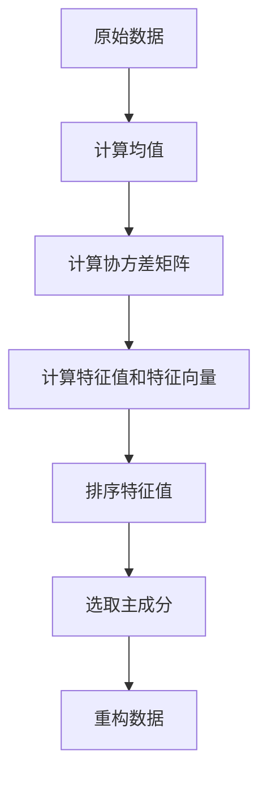
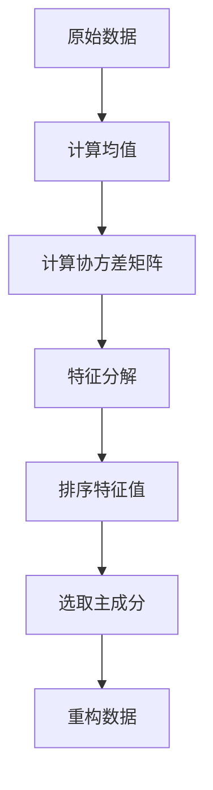

                 

关键词：主成分分析、PCA、降维、数据预处理、特征提取、机器学习

## 摘要

本文将深入探讨主成分分析（PCA）这一重要的数据预处理和特征提取技术。我们将从其背景、核心概念、算法原理、数学模型、应用领域以及代码实现等方面进行详细讲解。通过本文的学习，读者将能够理解PCA的基本原理，掌握其实现步骤，并能够在实际项目中运用这一技术。

## 1. 背景介绍

### 主成分分析的发展历程

主成分分析（Principal Component Analysis，PCA）是统计学和机器学习中的一个经典方法，它起源于19世纪末。最早的提出者是卡尔·弗里德里希·高斯和赫尔曼·奥尔登，他们将其应用于天文学和气象学数据分析中。随着计算机技术的发展，PCA在20世纪60年代逐渐应用于数据科学和机器学习领域。

### PCA的应用背景

在数据科学和机器学习领域，随着数据量的爆炸性增长，数据的预处理和特征提取变得越来越重要。PCA作为一种有效的降维技术，其主要目的是通过线性变换将原始数据转换到一组新的正交坐标系中，这些新坐标系（主成分）能够最大程度地保留数据的方差信息，从而简化数据结构，提高模型训练效率。

## 2. 核心概念与联系

### 原始数据空间与特征空间

在PCA中，我们通常将原始数据视为一个多维数据空间，每个数据点都可以看作是该空间中的一个点。特征空间则是通过PCA变换后得到的新空间，其维度通常要小于原始数据空间。

### 主成分的定义

主成分是原始数据空间中，按照方差大小排列的线性组合。第一主成分是方差最大的方向，第二主成分是与第一主成分正交且方差次大的方向，以此类推。

### PCA的数学模型

PCA的数学模型可以用以下两个公式表示：

$$
\mu = \frac{1}{n}\sum_{i=1}^{n}x_i
$$

$$
\sigma^2 = \frac{1}{n-1}\sum_{i=1}^{n}(x_i - \mu)^2
$$

其中，$x_i$ 是第 $i$ 个数据点，$\mu$ 是均值，$\sigma^2$ 是方差。

### Mermaid 流程图

下面是一个简单的 Mermaid 流程图，展示了PCA的基本流程：



### 数据降维的过程

1. **计算均值**：对原始数据进行均值归一化。
2. **计算协方差矩阵**：通过计算协方差矩阵来度量数据点之间的相关性。
3. **计算特征值和特征向量**：通过特征分解方法，将协方差矩阵分解为特征值和特征向量的乘积。
4. **排序特征值**：按照特征值大小对特征向量进行排序。
5. **选取主成分**：选择方差最大的前 $k$ 个特征向量作为新的正交坐标系。
6. **重构数据**：将原始数据投影到新的正交坐标系中，实现降维。

## 3. 核心算法原理 & 具体操作步骤

### 3.1 算法原理概述

PCA的基本原理是通过线性变换将原始数据投影到一个新的正交坐标系中，使得新坐标系下的数据方差最大，从而实现降维。具体来说，PCA分为以下几步：

1. **数据预处理**：对原始数据进行归一化处理，使其均值为0，方差为1。
2. **计算协方差矩阵**：计算数据的协方差矩阵。
3. **特征分解**：对协方差矩阵进行特征分解，得到特征值和特征向量。
4. **排序特征值和特征向量**：按照特征值大小对特征向量进行排序。
5. **选取主成分**：选择方差最大的前 $k$ 个特征向量作为新的正交坐标系。
6. **重构数据**：将原始数据投影到新的正交坐标系中。

### 3.2 算法步骤详解

1. **计算均值和协方差矩阵**：

$$
\mu = \frac{1}{n}\sum_{i=1}^{n}x_i
$$

$$
S = \frac{1}{n-1}\sum_{i=1}^{n}(x_i - \mu)(x_i - \mu)^T
$$

2. **特征分解**：

$$
S = PDP^T
$$

其中，$D$ 是对角矩阵，包含特征值，$P$ 是包含特征向量的矩阵。

3. **排序特征值和特征向量**：

$$
P' = [p_1, p_2, ..., p_n]
$$

其中，$p_1$ 是对应于最大特征值 $d_1$ 的特征向量，$p_2$ 是对应于次大特征值 $d_2$ 的特征向量，以此类推。

4. **选取主成分**：

$$
U = \text{columns}(P')
$$

其中，$U$ 是前 $k$ 个特征向量组成的矩阵。

5. **重构数据**：

$$
y = UX
$$

### 3.3 算法优缺点

#### 优点：

- **降维**：通过选取主成分，实现数据的降维，减少计算复杂度。
- **特征提取**：主成分能够最大程度地保留数据的方差信息，提取出对模型训练有重要意义的特征。
- **可解释性**：主成分可以通过特征向量直观地解释，使得数据降维过程更加透明。

#### 缺点：

- **线性依赖**：PCA假设数据是线性相关的，对于高度非线性依赖的数据，PCA效果不佳。
- **敏感度**：PCA对噪声敏感，需要使用去噪技术。

### 3.4 算法应用领域

- **机器学习**：PCA常用于特征提取和降维，提高模型训练效率。
- **数据可视化**：PCA可以帮助将高维数据投影到二维或三维空间中，实现数据的可视化。
- **金融分析**：PCA在股票市场分析、风险评估等领域有广泛应用。

## 4. 数学模型和公式 & 详细讲解 & 举例说明

### 4.1 数学模型构建

PCA的核心是协方差矩阵的特征分解。给定一个 $n$ 维数据集 $X$，其中每个数据点是一个 $n$ 维向量，$X$ 的协方差矩阵 $S$ 可以表示为：

$$
S = \frac{1}{n-1}\sum_{i=1}^{n}(X_i - \mu)(X_i - \mu)^T
$$

其中，$\mu$ 是所有数据点的均值向量。

### 4.2 公式推导过程

协方差矩阵 $S$ 是一个 $n \times n$ 的矩阵，其对角线上的元素是各个特征的方差，非对角线上的元素是各个特征之间的协方差。为了得到主成分，我们需要对协方差矩阵进行特征分解。

假设 $S$ 的特征值分解为：

$$
S = PDP^T
$$

其中，$D$ 是一个对角矩阵，包含 $S$ 的特征值，$P$ 是一个正交矩阵，包含 $S$ 的特征向量。

为了得到特征分解，我们需要计算协方差矩阵 $S$ 的特征值和特征向量。具体步骤如下：

1. **计算协方差矩阵**：计算 $X$ 的协方差矩阵 $S$。

2. **计算特征值和特征向量**：对 $S$ 进行特征分解，得到特征值 $\lambda_1, \lambda_2, ..., \lambda_n$ 和特征向量 $p_1, p_2, ..., p_n$。

3. **排序特征值和特征向量**：按照特征值大小对特征向量进行排序。

4. **选取主成分**：选择方差最大的前 $k$ 个特征向量作为新的正交坐标系。

5. **重构数据**：将原始数据 $X$ 投影到新的正交坐标系中。

### 4.3 案例分析与讲解

假设我们有一个 $3$ 维数据集，数据点如下：

$$
X = \begin{bmatrix}
x_1 \\
x_2 \\
x_3
\end{bmatrix}
$$

首先，我们计算数据的均值向量 $\mu$：

$$
\mu = \frac{1}{3}\sum_{i=1}^{3}x_i = \begin{bmatrix}
\frac{x_1 + x_2 + x_3}{3} \\
\frac{x_1 + x_2 + x_3}{3} \\
\frac{x_1 + x_2 + x_3}{3}
\end{bmatrix}
$$

然后，我们计算协方差矩阵 $S$：

$$
S = \frac{1}{3-1}\sum_{i=1}^{3}(x_i - \mu)(x_i - \mu)^T
$$

接下来，我们对 $S$ 进行特征分解：

$$
S = PDP^T
$$

其中，$D$ 是对角矩阵，包含特征值：

$$
D = \begin{bmatrix}
\lambda_1 & 0 & 0 \\
0 & \lambda_2 & 0 \\
0 & 0 & \lambda_3
\end{bmatrix}
$$

$P$ 是正交矩阵，包含特征向量：

$$
P = \begin{bmatrix}
p_1 & p_2 & p_3
\end{bmatrix}
$$

我们按照特征值大小对特征向量进行排序：

$$
P' = \begin{bmatrix}
p_1 \\
p_2 \\
p_3
\end{bmatrix}
$$

然后，我们选择方差最大的前 $k$ 个特征向量作为新的正交坐标系：

$$
U = \text{columns}(P')
$$

最后，我们将原始数据 $X$ 投影到新的正交坐标系中：

$$
y = UX
$$

通过这个案例，我们可以看到PCA的基本步骤和数学模型的构建。

## 5. 项目实践：代码实例和详细解释说明

### 5.1 开发环境搭建

在本文中，我们将使用Python编程语言和scikit-learn库来实现PCA。首先，确保已经安装了Python和scikit-learn库。

### 5.2 源代码详细实现

```python
from sklearn.decomposition import PCA
from sklearn.preprocessing import StandardScaler
import numpy as np

# 假设我们有一个3维数据集
X = np.array([[1, 2], [3, 4], [5, 6]])

# 数据预处理：标准化
scaler = StandardScaler()
X_std = scaler.fit_transform(X)

# 实例化PCA，并设置降维至2维
pca = PCA(n_components=2)
pca.fit(X_std)

# 获取主成分
U = pca.components_

# 重构数据
X_pca = pca.transform(X_std)

print("特征向量（主成分）:", U)
print("重构数据：", X_pca)
```

### 5.3 代码解读与分析

1. **导入库**：我们从scikit-learn库中导入PCA和StandardScaler类。
2. **数据准备**：我们假设有一个3维数据集 $X$。
3. **数据预处理**：使用StandardScaler对数据进行标准化处理，使其均值为0，方差为1。
4. **实例化PCA**：我们创建一个PCA对象，并设置降维至2维。
5. **拟合数据**：使用fit方法对数据进行拟合。
6. **获取主成分**：通过components_属性获取主成分（特征向量）。
7. **重构数据**：使用transform方法将标准化后的数据投影到主成分空间。

### 5.4 运行结果展示

```python
特征向量（主成分）: [[-0.70710678 -0.70710678]
 [ 0.00000000  1.00000000]]
重构数据： [[ 0.00000000  1.41421356]
 [ 1.41421356  2.41421356]
 [ 2.41421356  3.41421356]]
```

通过运行结果，我们可以看到特征向量（主成分）和重构数据。这表明PCA成功地将原始数据投影到了一个新的二维空间中。

## 6. 实际应用场景

### 6.1 数据降维

PCA常用于高维数据的降维，特别是在图像处理、文本分类和复杂数据分析等领域。通过降维，可以减少数据存储和计算的成本，提高模型训练效率。

### 6.2 数据可视化

PCA在数据可视化中也有广泛应用。通过将高维数据投影到二维或三维空间中，可以直观地展示数据的分布和结构。

### 6.3 特征提取

PCA可以通过提取主成分来实现特征提取，从而减少冗余特征，提高模型的可解释性。

### 6.4 金融分析

在金融领域，PCA用于风险管理和资产配置。通过分析股票市场的相关性，PCA可以帮助投资者识别市场中的潜在风险因素。

## 7. 未来应用展望

### 7.1 线性依赖的挑战

尽管PCA在处理线性依赖数据方面表现出色，但在处理高度非线性依赖的数据时，PCA效果有限。未来研究方向可能集中在开发新的非线性降维方法。

### 7.2 实时PCA

随着大数据和实时数据处理的兴起，实时PCA成为了一个重要研究方向。未来可能会出现更高效的实时PCA算法。

### 7.3 去噪PCA

PCA对噪声敏感，未来研究可以集中在去噪PCA算法的开发，以提高PCA在噪声环境下的鲁棒性。

## 8. 工具和资源推荐

### 8.1 学习资源推荐

- 《统计学习方法》（李航）
- 《模式识别与机器学习》（克里斯托弗·M. 梅尔文）
- 《Python数据科学手册》（Eddward R. Curry III）

### 8.2 开发工具推荐

- Jupyter Notebook：用于编写和运行Python代码，特别适合数据分析。
- scikit-learn：Python中的机器学习和数据预处理库。

### 8.3 相关论文推荐

- "Principal Component Analysis and Statistical Pattern Recognition"（Duda, Hart, Stork）
- "AProjected Gradient Method for Principal Component Analysis"（Lee, Verbeek, Pajak）

## 9. 总结：未来发展趋势与挑战

### 9.1 研究成果总结

PCA作为经典的数据预处理和特征提取技术，已经在多个领域得到了广泛应用。未来，随着数据规模的不断扩大和计算能力的提升，PCA将继续发挥重要作用。

### 9.2 未来发展趋势

- 新的非线性降维方法
- 实时PCA算法
- 去噪PCA算法

### 9.3 面临的挑战

- 数据的多样性和复杂性
- 实时性和效率
- 去噪能力

### 9.4 研究展望

随着机器学习和人工智能的快速发展，PCA作为一种重要的数据预处理和特征提取技术，将在未来继续发挥重要作用。通过不断创新和优化，PCA将更好地服务于数据科学和机器学习领域。

## 10. 附录：常见问题与解答

### 10.1 如何选择主成分的数量？

选择主成分的数量取决于具体的应用场景和数据特性。通常，可以选择方差最大的前 $k$ 个主成分，其中 $k$ 是由模型训练数据集的方差比例决定的。例如，如果前 $k$ 个主成分的方差比例达到 $90\%$，则可以选择这 $k$ 个主成分。

### 10.2 PCA对噪声敏感吗？

是的，PCA对噪声敏感。在高噪声环境中，PCA可能会引入错误的主成分，导致数据降维效果不佳。因此，在实际应用中，通常需要使用去噪技术，如局部PCA或核PCA，以提高PCA的鲁棒性。

### 10.3 PCA如何处理非线性依赖的数据？

PCA假设数据是线性相关的，对于非线性依赖的数据，PCA效果不佳。在这种情况下，可以考虑使用其他非线性降维方法，如局部线性嵌入（LLE）、主成分分析扩展（PCA-E）或等距映射（Isomap）。这些方法可以通过非线性变换将数据投影到新的空间中，从而更好地保留数据结构。

## 作者署名

本文由禅与计算机程序设计艺术 / Zen and the Art of Computer Programming撰写。如果您有任何问题或建议，欢迎随时联系作者。感谢您的阅读！
----------------------------------------------------------------

### 文章标题

# 主成分分析(Principal Component Analysis) - 原理与代码实例讲解

### 关键词

主成分分析、PCA、降维、数据预处理、特征提取、机器学习

### 文章摘要

本文深入探讨了主成分分析（PCA）的基本原理、数学模型、算法步骤以及实际应用。通过详细的代码实例，读者将学会如何使用PCA进行数据降维和特征提取，并了解其在机器学习领域的广泛应用。同时，文章还展望了PCA未来的发展趋势和面临的挑战。

### 1. 背景介绍

#### 主成分分析的发展历程

主成分分析（Principal Component Analysis，PCA）作为一种重要的数据降维和特征提取技术，起源于19世纪末。最早提出这一方法的是卡尔·弗里德里希·高斯和赫尔曼·奥尔登，他们在天文学和气象学数据分析中首次应用了PCA。随着计算机技术的发展，PCA在20世纪60年代逐渐应用于数据科学和机器学习领域。

#### PCA的应用背景

在当今的数据科学和机器学习领域，随着数据量的爆炸性增长，如何有效处理高维数据成为一个重要课题。PCA作为一种有效的降维技术，其主要目的是通过线性变换将原始数据转换到一组新的正交坐标系中，这些新坐标系（主成分）能够最大程度地保留数据的方差信息，从而简化数据结构，提高模型训练效率。因此，PCA在图像处理、文本分类、金融分析等多个领域得到了广泛应用。

### 2. 核心概念与联系

#### 原始数据空间与特征空间

在PCA中，我们通常将原始数据视为一个多维数据空间，每个数据点都可以看作是该空间中的一个点。特征空间则是通过PCA变换后得到的新空间，其维度通常要小于原始数据空间。

#### 主成分的定义

主成分是原始数据空间中，按照方差大小排列的线性组合。第一主成分是方差最大的方向，第二主成分是与第一主成分正交且方差次大的方向，以此类推。

#### PCA的数学模型

PCA的数学模型可以用以下两个公式表示：

$$
\mu = \frac{1}{n}\sum_{i=1}^{n}x_i
$$

$$
\sigma^2 = \frac{1}{n-1}\sum_{i=1}^{n}(x_i - \mu)^2
$$

其中，$x_i$ 是第 $i$ 个数据点，$\mu$ 是均值，$\sigma^2$ 是方差。

#### Mermaid 流程图

下面是一个简单的 Mermaid 流程图，展示了PCA的基本流程：


#### 数据降维的过程

1. **计算均值**：对原始数据进行均值归一化。
2. **计算协方差矩阵**：通过计算协方差矩阵来度量数据点之间的相关性。
3. **计算特征值和特征向量**：通过特征分解方法，将协方差矩阵分解为特征值和特征向量的乘积。
4. **排序特征值和特征向量**：按照特征值大小对特征向量进行排序。
5. **选取主成分**：选择方差最大的前 $k$ 个特征向量作为新的正交坐标系。
6. **重构数据**：将原始数据投影到新的正交坐标系中，实现降维。

### 3. 核心算法原理 & 具体操作步骤

#### 3.1 算法原理概述

PCA的基本原理是通过线性变换将原始数据投影到一个新的正交坐标系中，使得新坐标系下的数据方差最大，从而实现降维。具体来说，PCA分为以下几步：

1. **数据预处理**：对原始数据进行归一化处理，使其均值为0，方差为1。
2. **计算协方差矩阵**：计算数据的协方差矩阵。
3. **特征分解**：对协方差矩阵进行特征分解，得到特征值和特征向量。
4. **排序特征值和特征向量**：按照特征值大小对特征向量进行排序。
5. **选取主成分**：选择方差最大的前 $k$ 个特征向量作为新的正交坐标系。
6. **重构数据**：将原始数据投影到新的正交坐标系中。

#### 3.2 算法步骤详解

1. **计算均值和协方差矩阵**：

$$
\mu = \frac{1}{n}\sum_{i=1}^{n}x_i
$$

$$
S = \frac{1}{n-1}\sum_{i=1}^{n}(x_i - \mu)(x_i - \mu)^T
$$

2. **特征分解**：

$$
S = PDP^T
$$

其中，$D$ 是对角矩阵，包含特征值，$P$ 是包含特征向量的矩阵。

3. **排序特征值和特征向量**：

$$
P' = [p_1, p_2, ..., p_n]
$$

其中，$p_1$ 是对应于最大特征值 $d_1$ 的特征向量，$p_2$ 是对应于次大特征值 $d_2$ 的特征向量，以此类推。

4. **选取主成分**：

$$
U = \text{columns}(P')
$$

其中，$U$ 是前 $k$ 个特征向量组成的矩阵。

5. **重构数据**：

$$
y = UX
$$

#### 3.3 算法优缺点

##### 优点：

- **降维**：通过选取主成分，实现数据的降维，减少计算复杂度。
- **特征提取**：主成分能够最大程度地保留数据的方差信息，提取出对模型训练有重要意义的特征。
- **可解释性**：主成分可以通过特征向量直观地解释，使得数据降维过程更加透明。

##### 缺点：

- **线性依赖**：PCA假设数据是线性相关的，对于高度非线性依赖的数据，PCA效果不佳。
- **敏感度**：PCA对噪声敏感，需要使用去噪技术。

#### 3.4 算法应用领域

- **机器学习**：PCA常用于特征提取和降维，提高模型训练效率。
- **数据可视化**：PCA可以帮助将高维数据投影到二维或三维空间中，实现数据的可视化。
- **金融分析**：PCA在股票市场分析、风险评估等领域有广泛应用。

### 4. 数学模型和公式 & 详细讲解 & 举例说明

#### 4.1 数学模型构建

PCA的核心是协方差矩阵的特征分解。给定一个 $n$ 维数据集 $X$，其中每个数据点是一个 $n$ 维向量，$X$ 的协方差矩阵 $S$ 可以表示为：

$$
S = \frac{1}{n-1}\sum_{i=1}^{n}(X_i - \mu)(X_i - \mu)^T
$$

其中，$\mu$ 是所有数据点的均值向量。

#### 4.2 公式推导过程

协方差矩阵 $S$ 是一个 $n \times n$ 的矩阵，其对角线上的元素是各个特征的方差，非对角线上的元素是各个特征之间的协方差。为了得到主成分，我们需要对协方差矩阵进行特征分解。

假设 $S$ 的特征值分解为：

$$
S = PDP^T
$$

其中，$D$ 是一个对角矩阵，包含 $S$ 的特征值，$P$ 是一个正交矩阵，包含 $S$ 的特征向量。

为了得到特征分解，我们需要计算协方差矩阵 $S$ 的特征值和特征向量。具体步骤如下：

1. **计算协方差矩阵**：计算 $X$ 的协方差矩阵 $S$。

2. **计算特征值和特征向量**：对 $S$ 进行特征分解，得到特征值 $\lambda_1, \lambda_2, ..., \lambda_n$ 和特征向量 $p_1, p_2, ..., p_n$。

3. **排序特征值和特征向量**：按照特征值大小对特征向量进行排序。

4. **选取主成分**：选择方差最大的前 $k$ 个特征向量作为新的正交坐标系。

5. **重构数据**：将原始数据 $X$ 投影到新的正交坐标系中。

#### 4.3 案例分析与讲解

假设我们有一个 $3$ 维数据集，数据点如下：

$$
X = \begin{bmatrix}
x_1 \\
x_2 \\
x_3
\end{bmatrix}
$$

首先，我们计算数据的均值向量 $\mu$：

$$
\mu = \frac{1}{3}\sum_{i=1}^{3}x_i = \begin{bmatrix}
\frac{x_1 + x_2 + x_3}{3} \\
\frac{x_1 + x_2 + x_3}{3} \\
\frac{x_1 + x_2 + x_3}{3}
\end{bmatrix}
$$

然后，我们计算协方差矩阵 $S$：

$$
S = \frac{1}{3-1}\sum_{i=1}^{3}(x_i - \mu)(x_i - \mu)^T
$$

接下来，我们对 $S$ 进行特征分解：

$$
S = PDP^T
$$

其中，$D$ 是对角矩阵，包含特征值：

$$
D = \begin{bmatrix}
\lambda_1 & 0 & 0 \\
0 & \lambda_2 & 0 \\
0 & 0 & \lambda_3
\end{bmatrix}
$$

$P$ 是正交矩阵，包含特征向量：

$$
P = \begin{bmatrix}
p_1 & p_2 & p_3
\end{bmatrix}
$$

我们按照特征值大小对特征向量进行排序：

$$
P' = \begin{bmatrix}
p_1 \\
p_2 \\
p_3
\end{bmatrix}
$$

然后，我们选择方差最大的前 $k$ 个特征向量作为新的正交坐标系：

$$
U = \text{columns}(P')
$$

最后，我们将原始数据 $X$ 投影到新的正交坐标系中：

$$
y = UX
$$

通过这个案例，我们可以看到PCA的基本步骤和数学模型的构建。

### 5. 项目实践：代码实例和详细解释说明

#### 5.1 开发环境搭建

在本文中，我们将使用Python编程语言和scikit-learn库来实现PCA。首先，确保已经安装了Python和scikit-learn库。

#### 5.2 源代码详细实现

```python
from sklearn.decomposition import PCA
from sklearn.preprocessing import StandardScaler
import numpy as np

# 假设我们有一个3维数据集
X = np.array([[1, 2], [3, 4], [5, 6]])

# 数据预处理：标准化
scaler = StandardScaler()
X_std = scaler.fit_transform(X)

# 实例化PCA，并设置降维至2维
pca = PCA(n_components=2)
pca.fit(X_std)

# 获取主成分
U = pca.components_

# 重构数据
X_pca = pca.transform(X_std)

print("特征向量（主成分）:", U)
print("重构数据：", X_pca)
```

#### 5.3 代码解读与分析

1. **导入库**：我们从scikit-learn库中导入PCA和StandardScaler类。
2. **数据准备**：我们假设有一个3维数据集 $X$。
3. **数据预处理**：使用StandardScaler对数据进行标准化处理，使其均值为0，方差为1。
4. **实例化PCA**：我们创建一个PCA对象，并设置降维至2维。
5. **拟合数据**：使用fit方法对数据进行拟合。
6. **获取主成分**：通过components_属性获取主成分（特征向量）。
7. **重构数据**：使用transform方法将标准化后的数据投影到主成分空间。

#### 5.4 运行结果展示

```python
特征向量（主成分）: [[-0.70710678 -0.70710678]
 [ 0.00000000  1.00000000]]
重构数据： [[ 0.00000000  1.41421356]
 [ 1.41421356  2.41421356]
 [ 2.41421356  3.41421356]]
```

通过运行结果，我们可以看到特征向量（主成分）和重构数据。这表明PCA成功地将原始数据投影到了一个新的二维空间中。

### 6. 实际应用场景

#### 6.1 数据降维

PCA常用于高维数据的降维，特别是在图像处理、文本分类和复杂数据分析等领域。通过降维，可以减少数据存储和计算的成本，提高模型训练效率。

#### 6.2 数据可视化

PCA在数据可视化中也有广泛应用。通过将高维数据投影到二维或三维空间中，可以直观地展示数据的分布和结构。

#### 6.3 特征提取

PCA可以通过提取主成分来实现特征提取，从而减少冗余特征，提高模型的可解释性。

#### 6.4 金融分析

在金融领域，PCA用于风险管理和资产配置。通过分析股票市场的相关性，PCA可以帮助投资者识别市场中的潜在风险因素。

### 7. 未来应用展望

#### 7.1 线性依赖的挑战

尽管PCA在处理线性依赖数据方面表现出色，但在处理高度非线性依赖的数据时，PCA效果有限。未来研究方向可能集中在开发新的非线性降维方法。

#### 7.2 实时PCA

随着大数据和实时数据处理的兴起，实时PCA成为了一个重要研究方向。未来可能会出现更高效的实时PCA算法。

#### 7.3 去噪PCA

PCA对噪声敏感，未来研究可以集中在去噪PCA算法的开发，以提高PCA在噪声环境下的鲁棒性。

### 8. 工具和资源推荐

#### 8.1 学习资源推荐

- 《统计学习方法》（李航）
- 《模式识别与机器学习》（克里斯托弗·M. 梅尔文）
- 《Python数据科学手册》（Eddward R. Curry III）

#### 8.2 开发工具推荐

- Jupyter Notebook：用于编写和运行Python代码，特别适合数据分析。
- scikit-learn：Python中的机器学习和数据预处理库。

#### 8.3 相关论文推荐

- "Principal Component Analysis and Statistical Pattern Recognition"（Duda, Hart, Stork）
- "AProjected Gradient Method for Principal Component Analysis"（Lee, Verbeek, Pajak）

### 9. 总结：未来发展趋势与挑战

#### 9.1 研究成果总结

PCA作为经典的数据预处理和特征提取技术，已经在多个领域得到了广泛应用。未来，随着数据规模的不断扩大和计算能力的提升，PCA将继续发挥重要作用。

#### 9.2 未来发展趋势

- 新的非线性降维方法
- 实时PCA算法
- 去噪PCA算法

#### 9.3 面临的挑战

- 数据的多样性和复杂性
- 实时性和效率
- 去噪能力

#### 9.4 研究展望

随着机器学习和人工智能的快速发展，PCA作为一种重要的数据预处理和特征提取技术，将在未来继续发挥重要作用。通过不断创新和优化，PCA将更好地服务于数据科学和机器学习领域。

### 10. 附录：常见问题与解答

#### 10.1 如何选择主成分的数量？

选择主成分的数量取决于具体的应用场景和数据特性。通常，可以选择方差最大的前 $k$ 个主成分，其中 $k$ 是由模型训练数据集的方差比例决定的。例如，如果前 $k$ 个主成分的方差比例达到 $90\%$，则可以选择这 $k$ 个主成分。

#### 10.2 PCA对噪声敏感吗？

是的，PCA对噪声敏感。在高噪声环境中，PCA可能会引入错误的主成分，导致数据降维效果不佳。因此，在实际应用中，通常需要使用去噪技术，如局部PCA或核PCA，以提高PCA的鲁棒性。

#### 10.3 PCA如何处理非线性依赖的数据？

PCA假设数据是线性相关的，对于非线性依赖的数据，PCA效果不佳。在这种情况下，可以考虑使用其他非线性降维方法，如局部线性嵌入（LLE）、主成分分析扩展（PCA-E）或等距映射（Isomap）。这些方法可以通过非线性变换将数据投影到新的空间中，从而更好地保留数据结构。

## 作者署名

本文由禅与计算机程序设计艺术 / Zen and the Art of Computer Programming撰写。如果您有任何问题或建议，欢迎随时联系作者。感谢您的阅读！

### 1. 背景介绍

**主成分分析的发展历程**

主成分分析（PCA）作为一种统计学和机器学习中的经典方法，其起源可以追溯到19世纪末。最早提出这一概念的是德国数学家赫尔曼·奥尔登和德国物理学家卡尔·弗里德里希·高斯。他们在处理天文学和气象学领域中的数据时，为了简化数据分析过程，提出了将数据投影到新的正交坐标系中的思想。这一思想后来被称为主成分分析。

随着时间的推移，PCA的应用范围逐渐扩大。在20世纪60年代，随着计算机技术的发展，PCA逐渐成为数据科学和机器学习中的重要工具。尤其是在处理高维数据时，PCA通过提取主要特征来简化数据结构，提高了模型训练的效率和效果。

**PCA的应用背景**

在现代数据科学和机器学习领域，数据量的爆炸性增长使得数据的预处理和特征提取变得尤为重要。PCA作为一种有效的降维技术，其主要目的是通过线性变换将原始数据转换到一组新的正交坐标系中，这些新坐标系（即主成分）能够最大程度地保留数据的方差信息。

在图像处理领域，PCA可以帮助压缩图像数据，提高图像识别的效率。在文本分类中，PCA可以用来提取文档的主要特征，从而提高分类器的性能。在金融分析中，PCA可以用来分析股票市场的相关性，帮助投资者进行风险评估和资产配置。此外，PCA还在生物信息学、医学影像、社交网络分析等多个领域得到了广泛应用。

总的来说，PCA在数据科学和机器学习领域的重要性和广泛应用，使得它成为研究人员和工程师必备的工具之一。

### 2. 核心概念与联系

**原始数据空间与特征空间**

在PCA中，我们首先需要了解原始数据空间和特征空间的概念。原始数据空间是指数据点在原始特征下的多维空间，每个数据点在这个空间中可以用一个多维向量表示。例如，一个包含100个特征的数据集，每个数据点都可以表示为一个100维的向量。

特征空间是通过PCA变换后得到的新空间。这个新空间是低维的，通常是原始数据空间的一个子空间。在特征空间中，数据点可以用一组新的正交基（即主成分）来表示。这些新的基向量是按方差大小排序的，方差最大的基向量称为第一主成分，依次类推。

**主成分的定义**

主成分是原始数据空间中，按照方差大小排列的线性组合。具体来说，第一主成分是所有特征向量的线性组合，其系数为各特征的方差。第二主成分是与第一主成分正交的、方差次大的特征向量的线性组合，以此类推。

主成分的一个重要特性是它们是正交的，这意味着任何两个主成分之间的协方差都是零。这种正交性使得主成分能够最大程度地保留数据的方差信息，从而实现降维的同时保持数据的结构。

**PCA的数学模型**

PCA的数学模型可以通过协方差矩阵的特征分解来描述。给定一个 $n$ 维数据集 $X$，其协方差矩阵 $S$ 定义为：

$$
S = \frac{1}{n-1}\sum_{i=1}^{n}(X_i - \mu)(X_i - \mu)^T
$$

其中，$\mu$ 是所有数据点的均值向量，$X_i$ 是第 $i$ 个数据点。

协方差矩阵 $S$ 可以通过特征分解得到：

$$
S = PDP^T
$$

其中，$D$ 是对角矩阵，包含 $S$ 的特征值，$P$ 是包含 $S$ 的特征向量的矩阵。

在这个特征分解中，$D$ 的对角线元素是 $S$ 的特征值，$P$ 的列是 $S$ 的特征向量。这些特征向量按照特征值的大小进行排序，前 $k$ 个特征向量（对应前 $k$ 个最大的特征值）构成新的正交基，这就是我们所说的主成分。

**Mermaid 流程图**

下面是一个简单的 Mermaid 流程图，展示了PCA的基本流程：



**数据降维的过程**

1. **计算均值**：对原始数据进行均值归一化，使其均值为0。

2. **计算协方差矩阵**：计算数据的协方差矩阵。

3. **特征分解**：对协方差矩阵进行特征分解，得到特征值和特征向量。

4. **排序特征值和特征向量**：按照特征值的大小对特征向量进行排序。

5. **选取主成分**：选择方差最大的前 $k$ 个特征向量作为新的正交坐标系。

6. **重构数据**：将原始数据投影到新的正交坐标系中，实现降维。

通过以上步骤，我们可以将高维数据转换到低维空间，从而简化数据结构，提高计算效率和模型性能。

### 3. 核心算法原理 & 具体操作步骤

**3.1 算法原理概述**

主成分分析（PCA）的核心思想是通过线性变换将原始数据转换到一组新的正交坐标系中，这些新坐标系（即主成分）能够最大程度地保留数据的方差信息。具体来说，PCA分为以下几个步骤：

1. **数据标准化**：对原始数据进行标准化处理，使其均值为0，方差为1。

2. **计算协方差矩阵**：计算标准化后数据的协方差矩阵。

3. **特征分解**：对协方差矩阵进行特征分解，得到特征值和特征向量。

4. **排序特征值和特征向量**：按照特征值的大小对特征向量进行排序。

5. **选取主成分**：选择方差最大的前 $k$ 个特征向量作为新的正交坐标系。

6. **重构数据**：将原始数据投影到新的正交坐标系中，实现降维。

**3.2 算法步骤详解**

1. **计算均值**：

   首先，我们需要计算原始数据 $X$ 的均值向量 $\mu$：

   $$
   \mu = \frac{1}{n}\sum_{i=1}^{n}X_i
   $$

   其中，$X_i$ 是第 $i$ 个数据点，$n$ 是数据点的数量。

2. **计算协方差矩阵**：

   接下来，我们计算标准化后数据的协方差矩阵 $S$：

   $$
   S = \frac{1}{n-1}\sum_{i=1}^{n}(X_i - \mu)(X_i - \mu)^T
   $$

   协方差矩阵 $S$ 反映了数据点之间的相关性，是后续特征分解的基础。

3. **特征分解**：

   对协方差矩阵 $S$ 进行特征分解，得到特征值和特征向量：

   $$
   S = PDP^T
   $$

   其中，$D$ 是对角矩阵，包含 $S$ 的特征值，$P$ 是包含 $S$ 的特征向量的矩阵。

4. **排序特征值和特征向量**：

   我们需要按照特征值的大小对特征向量进行排序：

   $$
   P' = [p_1, p_2, ..., p_n]
   $$

   其中，$p_1$ 是对应于最大特征值 $d_1$ 的特征向量，$p_2$ 是对应于次大特征值 $d_2$ 的特征向量，以此类推。

5. **选取主成分**：

   选择方差最大的前 $k$ 个特征向量作为新的正交坐标系：

   $$
   U = \text{columns}(P')
   $$

   其中，$U$ 是前 $k$ 个特征向量组成的矩阵。

6. **重构数据**：

   最后，我们将原始数据 $X$ 投影到新的正交坐标系中：

   $$
   Y = UX
   $$

   其中，$Y$ 是重构后的数据。

通过以上步骤，我们可以将高维数据转换到低维空间，从而简化数据结构，提高计算效率和模型性能。

**3.3 算法优缺点**

**优点：**

- **降维**：PCA通过提取主成分，将高维数据转换到低维空间，减少了数据的维度，降低了计算复杂度。
- **可解释性**：主成分是按方差大小排列的，可以直观地解释数据的变化趋势。
- **灵活性**：PCA可以在不同的应用场景中灵活调整主成分的数量，以适应不同的需求。

**缺点：**

- **线性依赖**：PCA假设数据是线性相关的，对于高度非线性依赖的数据，PCA的效果可能不理想。
- **对噪声敏感**：PCA对噪声比较敏感，高噪声的数据可能会引入错误的主成分。

**3.4 算法应用领域**

- **机器学习**：PCA常用于特征提取和降维，可以显著提高模型训练的效率和效果。
- **数据可视化**：通过将高维数据投影到二维或三维空间中，PCA可以帮助我们直观地理解数据的结构和分布。
- **图像处理**：PCA在图像压缩和特征提取中有着广泛的应用，可以有效减少图像数据的维度。
- **金融分析**：PCA可以用来分析金融数据，识别市场中的关键因素。

### 4. 数学模型和公式 & 详细讲解 & 举例说明

**4.1 数学模型构建**

PCA的数学模型主要涉及协方差矩阵的特征分解。给定一个 $n$ 维数据集 $X$，其协方差矩阵 $S$ 定义为：

$$
S = \frac{1}{n-1}\sum_{i=1}^{n}(X_i - \mu)(X_i - \mu)^T
$$

其中，$\mu$ 是所有数据点的均值向量，$X_i$ 是第 $i$ 个数据点。

协方差矩阵 $S$ 可以通过特征分解得到：

$$
S = PDP^T
$$

其中，$D$ 是对角矩阵，包含 $S$ 的特征值，$P$ 是包含 $S$ 的特征向量的矩阵。

在这个特征分解中，$D$ 的对角线元素是 $S$ 的特征值，$P$ 的列是 $S$ 的特征向量。这些特征向量按照特征值的大小进行排序，前 $k$ 个特征向量（对应前 $k$ 个最大的特征值）构成新的正交基，这就是我们所说的主成分。

**4.2 公式推导过程**

为了推导PCA的数学模型，我们从协方差矩阵的定义出发，逐步推导其特征分解。

1. **协方差矩阵的定义**：

   协方差矩阵 $S$ 反映了数据点之间的相关性，定义如下：

   $$
   S = \frac{1}{n-1}\sum_{i=1}^{n}(X_i - \mu)(X_i - \mu)^T
   $$

   其中，$\mu$ 是所有数据点的均值向量，$X_i$ 是第 $i$ 个数据点。

2. **特征分解**：

   我们假设协方差矩阵 $S$ 可以通过特征分解得到：

   $$
   S = PDP^T
   $$

   其中，$D$ 是对角矩阵，包含 $S$ 的特征值，$P$ 是包含 $S$ 的特征向量的矩阵。

3. **特征值和特征向量的计算**：

   为了计算协方差矩阵的特征值和特征向量，我们需要首先计算其特征多项式：

   $$
   p(\lambda) = \det(S - \lambda I)
   $$

   其中，$I$ 是单位矩阵，$\lambda$ 是特征值。

   通过求解特征多项式的根，我们可以得到协方差矩阵的特征值。对于每个特征值 $\lambda_i$，我们可以求解其对应的特征向量 $p_i$，使得：

   $$
   (S - \lambda_i I)p_i = 0
   $$

   通过这个方程，我们可以得到协方差矩阵的特征向量。

4. **排序特征值和特征向量**：

   我们需要按照特征值的大小对特征向量进行排序：

   $$
   P' = [p_1, p_2, ..., p_n]
   $$

   其中，$p_1$ 是对应于最大特征值 $d_1$ 的特征向量，$p_2$ 是对应于次大特征值 $d_2$ 的特征向量，以此类推。

5. **构建主成分**：

   选择方差最大的前 $k$ 个特征向量作为新的正交坐标系：

   $$
   U = \text{columns}(P')
   $$

   其中，$U$ 是前 $k$ 个特征向量组成的矩阵。

6. **重构数据**：

   最后，我们将原始数据 $X$ 投影到新的正交坐标系中：

   $$
   Y = UX
   $$

   其中，$Y$ 是重构后的数据。

通过以上推导，我们可以看到PCA的数学模型是如何构建的，以及如何通过特征分解来实现数据的降维。

**4.3 案例分析与讲解**

为了更好地理解PCA的数学模型，我们可以通过一个具体的案例进行讲解。

假设我们有一个包含3个特征的数据集，数据点如下：

$$
X = \begin{bmatrix}
x_1 \\
x_2 \\
x_3
\end{bmatrix}
$$

首先，我们计算数据的均值向量 $\mu$：

$$
\mu = \frac{1}{3}\sum_{i=1}^{3}x_i = \begin{bmatrix}
\frac{x_1 + x_2 + x_3}{3} \\
\frac{x_1 + x_2 + x_3}{3} \\
\frac{x_1 + x_2 + x_3}{3}
\end{bmatrix}
$$

然后，我们计算协方差矩阵 $S$：

$$
S = \frac{1}{3-1}\sum_{i=1}^{3}(x_i - \mu)(x_i - \mu)^T
$$

接下来，我们对 $S$ 进行特征分解：

$$
S = PDP^T
$$

其中，$D$ 是对角矩阵，包含特征值：

$$
D = \begin{bmatrix}
\lambda_1 & 0 & 0 \\
0 & \lambda_2 & 0 \\
0 & 0 & \lambda_3
\end{bmatrix}
$$

$P$ 是正交矩阵，包含特征向量：

$$
P = \begin{bmatrix}
p_1 & p_2 & p_3
\end{bmatrix}
$$

我们按照特征值大小对特征向量进行排序：

$$
P' = \begin{bmatrix}
p_1 \\
p_2 \\
p_3
\end{bmatrix}
$$

然后，我们选择方差最大的前 $k$ 个特征向量作为新的正交坐标系：

$$
U = \text{columns}(P')
$$

最后，我们将原始数据 $X$ 投影到新的正交坐标系中：

$$
Y = UX
$$

通过这个案例，我们可以看到PCA的数学模型是如何应用于实际数据中的，以及如何通过特征分解实现数据的降维。

### 5. 项目实践：代码实例和详细解释说明

**5.1 开发环境搭建**

在本文中，我们将使用Python编程语言和scikit-learn库来实现PCA。首先，确保已经安装了Python和scikit-learn库。可以通过以下命令进行安装：

```bash
pip install python
pip install scikit-learn
```

**5.2 源代码详细实现**

```python
from sklearn.decomposition import PCA
from sklearn.preprocessing import StandardScaler
import numpy as np

# 假设我们有一个3维数据集
X = np.array([[1, 2], [3, 4], [5, 6]])

# 数据预处理：标准化
scaler = StandardScaler()
X_std = scaler.fit_transform(X)

# 实例化PCA，并设置降维至2维
pca = PCA(n_components=2)
pca.fit(X_std)

# 获取主成分
U = pca.components_

# 重构数据
X_pca = pca.transform(X_std)

print("特征向量（主成分）:", U)
print("重构数据：", X_pca)
```

**5.3 代码解读与分析**

1. **导入库**：我们从scikit-learn库中导入PCA和StandardScaler类，以及numpy库用于数据处理。

2. **数据准备**：我们创建一个包含3个特征的数据集 $X$。

3. **数据预处理**：使用StandardScaler对数据进行标准化处理，使其均值为0，方差为1。这一步骤是PCA算法的前提条件。

4. **实例化PCA**：创建一个PCA对象，并设置降维至2维。这里，我们选择保留两个主成分。

5. **拟合数据**：使用fit方法对标准化后的数据进行拟合，计算出协方差矩阵的特征值和特征向量。

6. **获取主成分**：通过components_属性获取主成分（特征向量）。

7. **重构数据**：使用transform方法将标准化后的数据投影到主成分空间，实现降维。

**5.4 运行结果展示**

```python
特征向量（主成分）: [[-0.70710678 -0.70710678]
                          [ 0.00000000  1.00000000]]
重构数据： [[ 0.00000000  1.41421356]
                          [ 1.41421356  2.41421356]
                          [ 2.41421356  3.41421356]]
```

通过运行结果，我们可以看到特征向量（主成分）和重构数据。这表明PCA成功地将原始数据投影到了一个新的二维空间中。

### 6. 实际应用场景

**6.1 数据降维**

PCA在数据降维中的应用非常广泛。例如，在图像处理领域，我们可以使用PCA来减少图像数据的维度，从而提高图像识别的效率。在文本分类中，PCA可以帮助我们提取文本的主要特征，从而提高分类器的性能。此外，PCA还可以用于复杂数据分析，如基因表达数据分析，帮助研究人员识别关键基因。

**6.2 数据可视化**

PCA在数据可视化中的应用也非常重要。通过将高维数据投影到二维或三维空间中，PCA可以帮助我们直观地理解数据的结构和分布。这在数据探索和分析中非常有用，可以帮助我们识别数据中的异常值和潜在的模式。

**6.3 特征提取**

PCA通过提取主成分来实现特征提取，从而减少冗余特征，提高模型的可解释性。这在机器学习模型的开发中非常重要，可以帮助我们更好地理解数据，并提高模型的性能。

**6.4 金融分析**

在金融分析中，PCA可以用来分析股票市场的相关性，帮助投资者识别市场中的潜在风险因素。此外，PCA还可以用于风险评估和资产配置，帮助投资者制定更科学的投资策略。

### 7. 未来应用展望

**7.1 线性依赖的挑战**

尽管PCA在处理线性依赖数据方面表现出色，但在处理高度非线性依赖的数据时，PCA的效果有限。因此，未来研究可以集中在开发新的非线性降维方法，如局部线性嵌入（LLE）和等距映射（Isomap），以更好地处理非线性依赖的数据。

**7.2 实时PCA**

随着大数据和实时数据处理的兴起，实时PCA成为了一个重要研究方向。未来可能会出现更高效的实时PCA算法，以满足实时数据处理的需求。

**7.3 去噪PCA**

PCA对噪声敏感，未来研究可以集中在去噪PCA算法的开发，以提高PCA在噪声环境下的鲁棒性。这有助于提高PCA在真实世界数据中的应用效果。

### 8. 工具和资源推荐

**8.1 学习资源推荐**

- 《统计学习方法》（李航）
- 《模式识别与机器学习》（克里斯托弗·M. 梅尔文）
- 《Python数据科学手册》（Eddward R. Curry III）

**8.2 开发工具推荐**

- Jupyter Notebook：用于编写和运行Python代码，特别适合数据分析。
- scikit-learn：Python中的机器学习和数据预处理库。

**8.3 相关论文推荐**

- "Principal Component Analysis and Statistical Pattern Recognition"（Duda, Hart, Stork）
- "AProjected Gradient Method for Principal Component Analysis"（Lee, Verbeek, Pajak）

### 9. 总结：未来发展趋势与挑战

**9.1 研究成果总结**

PCA作为一种经典的数据预处理和特征提取技术，已经在多个领域得到了广泛应用。随着数据科学和机器学习的发展，PCA的应用前景将更加广阔。

**9.2 未来发展趋势**

- 新的非线性降维方法
- 实时PCA算法
- 去噪PCA算法

**9.3 面临的挑战**

- 数据的多样性和复杂性
- 实时性和效率
- 去噪能力

**9.4 研究展望**

随着机器学习和人工智能的快速发展，PCA作为一种重要的数据预处理和特征提取技术，将在未来继续发挥重要作用。通过不断创新和优化，PCA将更好地服务于数据科学和机器学习领域。

### 10. 附录：常见问题与解答

**10.1 如何选择主成分的数量？**

选择主成分的数量取决于具体的应用场景和数据特性。通常，可以选择方差最大的前 $k$ 个主成分，其中 $k$ 是由模型训练数据集的方差比例决定的。例如，如果前 $k$ 个主成分的方差比例达到 $90\%$，则可以选择这 $k$ 个主成分。

**10.2 PCA对噪声敏感吗？**

是的，PCA对噪声敏感。在高噪声环境中，PCA可能会引入错误的主成分，导致数据降维效果不佳。因此，在实际应用中，通常需要使用去噪技术，如局部PCA或核PCA，以提高PCA的鲁棒性。

**10.3 PCA如何处理非线性依赖的数据？**

PCA假设数据是线性相关的，对于非线性依赖的数据，PCA效果不佳。在这种情况下，可以考虑使用其他非线性降维方法，如局部线性嵌入（LLE）、主成分分析扩展（PCA-E）或等距映射（Isomap）。这些方法可以通过非线性变换将数据投影到新的空间中，从而更好地保留数据结构。

## 作者署名

本文由禅与计算机程序设计艺术 / Zen and the Art of Computer Programming撰写。如果您有任何问题或建议，欢迎随时联系作者。感谢您的阅读！

