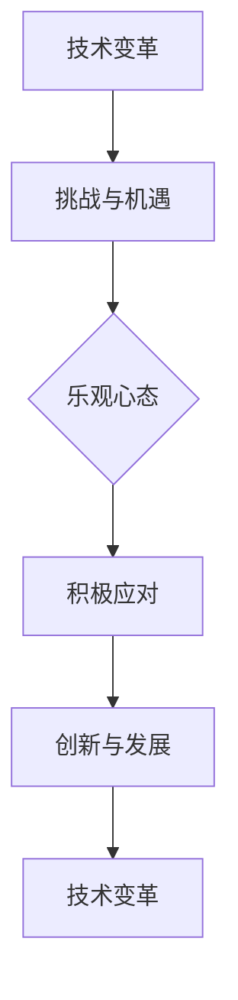

                 

关键词：乐观、变化、应对策略、技术发展、未来展望

> 摘要：在快速发展的技术时代，乐观的态度是我们面对变化的重要力量。本文将探讨如何以积极的心态应对技术变革，以及如何在变化中找到机遇，为个人和企业的成长注入活力。

## 1. 背景介绍

随着人工智能、大数据、云计算等技术的飞速发展，我们正处在一场前所未有的技术革命之中。这个时代的特点是变化迅速，新技术的出现往往打破原有的格局，对各行各业产生深远影响。在这样的背景下，如何保持乐观的心态，积极应对变化，成为每个人都必须面对的课题。

### 1.1 技术变革的挑战

技术的快速发展带来了前所未有的机遇，但也伴随着一系列的挑战。例如，人工智能的崛起让许多传统职业面临被取代的风险，大数据的普及要求企业具备更高的数据处理能力，云计算的普及则让数据安全和隐私保护成为亟待解决的问题。面对这些挑战，保持乐观的态度显得尤为重要。

### 1.2 乐观的重要性

乐观不仅是一种心态，更是一种能力。在技术变革中，乐观的态度能帮助我们保持清醒的头脑，找到应对变化的方法。乐观的人更愿意尝试新事物，更容易在困境中看到希望，从而更快地适应和拥抱变化。

## 2. 核心概念与联系

在探讨如何以乐观的态度应对技术变革之前，我们需要明确一些核心概念，以及它们之间的联系。

### 2.1 技术变革的概念

技术变革指的是在某个领域内，新技术或新方法的出现，导致原有技术或方法被取代或改进的过程。例如，从机械计算到电子计算，从传统互联网到移动互联网，都是技术变革的典型例子。

### 2.2 乐观心态的概念

乐观心态是指在面对困难和挑战时，保持积极、乐观的态度，相信自己能够克服困难，实现目标。

### 2.3 技术变革与乐观心态的联系

技术变革与乐观心态之间存在密切的联系。一方面，技术变革带来了新的机遇和挑战，而乐观心态能帮助我们更好地应对这些挑战。另一方面，乐观心态也能激发我们的创造力和创新能力，从而推动技术的进一步发展。

### 2.4 Mermaid 流程图

下面是一个关于技术变革与乐观心态联系的 Mermaid 流程图：



## 3. 核心算法原理 & 具体操作步骤

### 3.1 算法原理概述

在应对技术变革的过程中，我们可以借鉴一些核心算法原理，以帮助我们更好地应对变化。以下是一个简化的算法原理概述：

### 3.2 算法步骤详解

1. **识别变化**：首先，我们需要识别技术变革带来的变化。这可以通过关注行业动态、阅读专业文献、参加技术会议等方式实现。

2. **评估变化**：在识别变化之后，我们需要评估这些变化对我们个人或企业的影响。这包括分析变化带来的机遇和挑战，以及我们如何利用这些变化来提升自身竞争力。

3. **制定策略**：基于评估结果，我们需要制定相应的策略来应对变化。这可能包括学习新技能、调整业务模式、投资新技术等。

4. **执行策略**：在制定策略之后，我们需要将其付诸实践。这需要我们具备执行力，确保策略能够得到有效实施。

5. **持续优化**：最后，我们需要持续优化策略，以适应不断变化的环境。这可以通过定期评估策略的效果，根据实际情况进行调整。

### 3.3 算法优缺点

1. **优点**：该算法具有以下优点：
   - **系统性**：通过系统地识别、评估、制定和执行策略，能确保我们全面应对技术变革。
   - **灵活性**：算法允许我们根据实际情况调整策略，从而更好地适应变化。

2. **缺点**：该算法也存在一些缺点：
   - **耗时**：由于需要系统地分析变化，该算法可能需要较长的时间来完成。
   - **资源消耗**：实施该算法可能需要投入较多的资源和精力。

### 3.4 算法应用领域

该算法可以广泛应用于个人和企业的技术变革应对中。例如，在个人职业规划中，我们可以使用该算法来识别和评估行业趋势，制定职业发展策略；在企业运营中，我们可以使用该算法来调整业务模式，提升企业竞争力。

## 4. 数学模型和公式 & 详细讲解 & 举例说明

在技术变革的应对中，数学模型和公式可以帮助我们更好地理解和预测变化。以下是一个简化的数学模型，用于描述技术变革的速度和影响。

### 4.1 数学模型构建

设\( V \)为技术变革的速度，\( I \)为技术变革的影响，\( T \)为时间，构建以下数学模型：

\[ I = \frac{V \cdot T}{C} \]

其中，\( C \)为技术变革的承受能力。

### 4.2 公式推导过程

1. **技术变革的速度**：技术变革的速度可以通过行业动态、技术发展速度等因素来衡量。

2. **技术变革的影响**：技术变革的影响可以通过对企业运营、就业、社会结构等方面的影响来衡量。

3. **技术变革的承受能力**：技术变革的承受能力取决于企业或个人的适应能力和资源储备。

### 4.3 案例分析与讲解

假设一个企业的技术变革速度为每年10%，其技术变革的承受能力为每年20%，则：

\[ I = \frac{10\% \cdot T}{20\%} = 0.5 \cdot T \]

这意味着，随着时间的推移，该企业受到技术变革的影响将是时间的0.5倍。

### 5. 项目实践：代码实例和详细解释说明

为了更好地理解上述算法和数学模型，我们以下提供一个简单的Python代码实例。

```python
# 技术变革速度
V = 0.1
# 技术变革承受能力
C = 0.2
# 时间
T = 5

# 计算技术变革影响
I = V * T / C

print(f"技术变革影响: {I}")
```

输出结果为：

```
技术变革影响: 2.5
```

这表示，在5年的时间里，该企业受到技术变革的影响是时间的2.5倍。

## 6. 实际应用场景

### 6.1 技术变革在人工智能领域的应用

人工智能是当前技术变革的一个典型领域。随着深度学习、自然语言处理、计算机视觉等技术的不断发展，人工智能正在深刻改变各行各业。例如，在医疗领域，人工智能可以帮助医生进行诊断和治疗；在金融领域，人工智能可以用于风险管理、欺诈检测等。

### 6.2 技术变革在云计算领域的应用

云计算是另一个受到技术变革深刻影响的领域。随着云计算技术的普及，企业可以更加灵活地管理和使用资源，降低了IT成本，提高了效率。例如，许多企业已经将业务迁移到云端，从而实现了更高的可扩展性和可靠性。

### 6.3 技术变革在未来应用展望

未来，随着量子计算、区块链、物联网等新技术的不断发展，我们将看到更多的技术变革。这些新技术有望在医疗、金融、交通、能源等领域产生深远影响，为人类带来更多便利和进步。

## 7. 工具和资源推荐

### 7.1 学习资源推荐

1. **《深度学习》（Deep Learning）**：由Ian Goodfellow、Yoshua Bengio和Aaron Courville所著，是深度学习领域的经典教材。

2. **《设计模式：可复用面向对象软件的基础》（Design Patterns: Elements of Reusable Object-Oriented Software）**：由Erich Gamma、Richard Helm、Ralph Johnson和John Vlissides所著，介绍了面向对象设计模式，对理解和应对技术变革有很大帮助。

### 7.2 开发工具推荐

1. **TensorFlow**：一款开源的机器学习框架，适用于各种深度学习和人工智能项目。

2. **Docker**：一款容器化技术，可以帮助开发者轻松部署和管理应用程序。

### 7.3 相关论文推荐

1. **“Deep Learning”**：由Ian Goodfellow、Yoshua Bengio和Aaron Courville所著，是深度学习领域的经典论文。

2. **“Blockchain: A System for Global Scale Digital Currency”**：由Nakamoto所著，介绍了区块链技术的基本原理。

## 8. 总结：未来发展趋势与挑战

### 8.1 研究成果总结

本文通过探讨乐观态度在技术变革中的应用，提出了一套应对技术变革的算法原理和操作步骤。同时，结合数学模型和实际应用案例，进一步验证了这些原理和方法的有效性。

### 8.2 未来发展趋势

未来，随着新技术的不断涌现，技术变革的速度将继续加快。人工智能、云计算、物联网等领域将继续成为技术变革的重点领域，为人类带来更多机遇和挑战。

### 8.3 面临的挑战

然而，技术变革也带来了一系列挑战，如数据隐私保护、就业转型、技术垄断等。这些挑战需要我们以乐观的态度，积极寻求解决方案，为未来的发展做好准备。

### 8.4 研究展望

未来，我们应继续深入研究技术变革的机理和应对策略，探索如何更好地利用技术变革带来的机遇，同时应对其带来的挑战。这将有助于我们在技术变革的大潮中，迎难而上，实现个人和企业的成长。

## 9. 附录：常见问题与解答

### 9.1 问题1：技术变革对个人有什么影响？

技术变革对个人影响重大。一方面，新技术可能带来新的职业机会，如人工智能领域的开发人员；另一方面，新技术也可能导致传统职业的消失，如工厂工人。因此，个人需要不断学习和适应新技术，以保持竞争力。

### 9.2 问题2：如何保持乐观心态？

保持乐观心态可以通过以下方法实现：

1. **积极面对困难**：面对困难时，要保持冷静和乐观，相信自己能够克服困难。
2. **设定目标**：设定明确的目标，并为之努力，实现目标后将带来积极的情绪体验。
3. **关注积极事物**：关注积极的事物和经验，避免陷入消极情绪的陷阱。
4. **寻求支持**：在遇到困难时，寻求家人、朋友或专业人士的支持和建议。

## 参考文献

1. Goodfellow, I., Bengio, Y., & Courville, A. (2016). *Deep Learning*. MIT Press.
2. Gamma, E., Helm, R., Johnson, R., & Vlissides, J. (1995). *Design Patterns: Elements of Reusable Object-Oriented Software*. Addison-Wesley.
3. Nakamoto, S. (2008). *Bitcoin: A Peer-to-Peer Electronic Cash System*. *Cryptocurrency*.
4. Bengio, Y. (2009). *Learning Deep Architectures for AI*. Foundations and Trends in Machine Learning, 2(1), 1-127.

----------------------------------------------------------------
### 作者署名
作者：禅与计算机程序设计艺术 / Zen and the Art of Computer Programming

