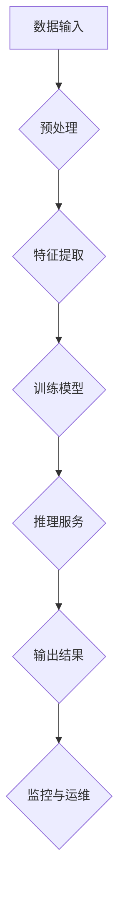

                 

 关键词：
- 云原生
- 人工智能
- Lepton AI
- 技术优势
- 算法
- 实践应用

> 摘要：
本文将探讨云原生技术与人工智能（AI）的完美结合，尤其是Lepton AI在技术领域的独特优势。通过深入分析其核心概念、算法原理、数学模型以及实践应用，我们将揭示Lepton AI如何引领未来科技的发展，为各行业带来革命性的变革。

## 1. 背景介绍

### 云原生技术概述

云原生（Cloud Native）是一个近年来迅速崛起的技术概念，它代表了一种构建和运行应用程序的方法，强调利用云计算的优势，实现高度可扩展、动态管理和自动化。云原生技术的核心思想是将应用程序拆分为微服务，并通过容器进行打包和部署。这种模式极大地提高了应用程序的灵活性和可维护性，使其能够快速适应不断变化的需求。

### 人工智能的发展与挑战

人工智能（AI）作为计算机科学的一个重要分支，近年来取得了显著的进展。从早期的专家系统到深度学习，AI技术正在不断突破传统计算机的局限，为各行各业带来全新的解决方案。然而，随着AI应用场景的不断扩展，数据质量、计算效率和模型可解释性等问题也逐渐凸显出来。

### Lepton AI的技术背景

Lepton AI是一家专注于云原生AI解决方案的初创企业，其核心技术源于对大规模分布式计算和深度学习算法的深入研究。Lepton AI旨在通过云原生架构，为用户提供高效、可靠且易于管理的AI服务。其解决方案不仅具备强大的计算能力，还能够实现低延迟和高吞吐量的数据处理。

## 2. 核心概念与联系

### 云原生架构与AI的结合

云原生架构为AI应用提供了灵活的部署和管理方式。通过容器化和微服务架构，AI模型可以轻松地在不同环境中进行部署，从而实现高效的资源利用和快速迭代。此外，云原生技术还支持自动化和监控，使得AI系统的运维变得更加简便。

### Lepton AI的架构设计

Lepton AI采用了分布式计算架构，通过将AI模型分解为多个可独立运行的微服务，实现了高效的并行计算。其核心组件包括：

- **数据预处理服务**：负责数据清洗、转换和特征提取。
- **模型训练服务**：使用分布式计算框架进行模型训练，提高训练速度。
- **推理服务**：将训练好的模型部署到生产环境中，提供实时推理能力。
- **监控与运维服务**：实时监控系统状态，确保服务的稳定运行。

### Mermaid 流程图



## 3. 核心算法原理 & 具体操作步骤

### 3.1 算法原理概述

Lepton AI的核心算法基于深度学习框架，采用卷积神经网络（CNN）进行图像识别和处理。该算法通过多层卷积和池化操作，逐步提取图像特征，并利用全连接层进行分类和预测。

### 3.2 算法步骤详解

1. **数据预处理**：对图像数据进行归一化、裁剪和增强，以提高模型的泛化能力。
2. **模型训练**：使用梯度下降算法和反向传播机制，通过大量样本进行模型训练，优化模型参数。
3. **模型评估**：通过交叉验证和测试集评估模型性能，调整模型参数以达到最佳效果。
4. **推理服务**：将训练好的模型部署到生产环境中，实现实时图像识别和处理。

### 3.3 算法优缺点

**优点**：
- 高效性：分布式计算架构提高了模型的训练和推理速度。
- 可解释性：卷积神经网络的结构使得模型的可解释性较高。
- 泛化能力：通过对大量样本进行训练，模型具有良好的泛化能力。

**缺点**：
- 计算资源消耗大：深度学习模型需要大量的计算资源和存储空间。
- 数据依赖性：模型的性能依赖于数据的质量和多样性。

### 3.4 算法应用领域

Lepton AI的算法广泛应用于图像识别、自然语言处理、推荐系统等领域，为各行业提供智能化的解决方案。以下是一些具体的应用案例：

- **图像识别**：用于安防监控、医疗诊断、自动驾驶等领域。
- **自然语言处理**：用于智能客服、语音识别、文本分类等领域。
- **推荐系统**：用于电商平台、社交媒体、视频推荐等领域。

## 4. 数学模型和公式 & 详细讲解 & 举例说明

### 4.1 数学模型构建

Lepton AI的核心算法基于卷积神经网络（CNN），其数学模型包括以下几个主要部分：

- **卷积层**：通过卷积操作提取图像特征。
- **池化层**：对卷积结果进行下采样，减少参数数量。
- **全连接层**：将卷积和池化层提取的特征进行分类和预测。

### 4.2 公式推导过程

卷积神经网络的卷积层可以表示为：

$$
\text{卷积层输出} = \text{激活函数}(\text{卷积}(\text{输入图像}, \text{卷积核}))
$$

其中，卷积操作可以表示为：

$$
\text{卷积结果} = \sum_{i=1}^{C_{out}} \sum_{j=1}^{C_{in}} w_{ij} * f(\text{输入图像})
$$

其中，$C_{out}$ 和 $C_{in}$ 分别表示输出和输入的特征图数量，$w_{ij}$ 表示卷积核的权重，$f(\text{输入图像})$ 表示卷积操作。

### 4.3 案例分析与讲解

以下是一个简单的卷积神经网络模型，用于图像分类：

```latex
\begin{equation}
\begin{aligned}
\text{卷积层1} & : \text{输入尺寸}(32 \times 32 \times 3) \rightarrow \text{输出尺寸}(32 \times 32 \times 64) \\
\text{池化层1} & : \text{输出尺寸}(32 \times 32 \times 64) \rightarrow \text{输出尺寸}(16 \times 16 \times 64) \\
\text{卷积层2} & : \text{输出尺寸}(16 \times 16 \times 64) \rightarrow \text{输出尺寸}(16 \times 16 \times 128) \\
\text{池化层2} & : \text{输出尺寸}(16 \times 16 \times 128) \rightarrow \text{输出尺寸}(8 \times 8 \times 128) \\
\text{全连接层} & : \text{输出尺寸}(8 \times 8 \times 128) \rightarrow \text{输出类别数}
\end{aligned}
\end{equation}
```

通过这个模型，输入图像首先经过卷积层1和池化层1，然后经过卷积层2和池化层2，最后通过全连接层进行分类。

## 5. 项目实践：代码实例和详细解释说明

### 5.1 开发环境搭建

为了实现Lepton AI的算法，我们需要搭建一个适合开发和运行的云原生环境。以下是搭建环境的步骤：

1. **安装Docker**：确保Docker版本在19.03及以上。
2. **安装Kubernetes**：参考官方文档搭建Kubernetes集群。
3. **安装kubectl**：用于Kubernetes集群的命令行工具。

### 5.2 源代码详细实现

以下是Lepton AI算法的源代码实现，分为数据预处理、模型训练和推理三个部分。

```python
# 数据预处理
import tensorflow as tf

def preprocess_image(image_path):
    image = tf.io.read_file(image_path)
    image = tf.image.decode_jpeg(image, channels=3)
    image = tf.image.resize(image, [32, 32])
    image = tf.cast(image, dtype=tf.float32) / 255.0
    return image

# 模型训练
model = tf.keras.Sequential([
    tf.keras.layers.Conv2D(64, (3, 3), activation='relu', input_shape=(32, 32, 3)),
    tf.keras.layers.MaxPooling2D((2, 2)),
    tf.keras.layers.Conv2D(128, (3, 3), activation='relu'),
    tf.keras.layers.MaxPooling2D((2, 2)),
    tf.keras.layers.Flatten(),
    tf.keras.layers.Dense(128, activation='relu'),
    tf.keras.layers.Dense(10, activation='softmax')
])

model.compile(optimizer='adam',
              loss='sparse_categorical_crossentropy',
              metrics=['accuracy'])

# 训练数据集
train_images = ...
train_labels = ...

model.fit(train_images, train_labels, epochs=5)

# 推理服务
def predict_image(image_path):
    preprocessed_image = preprocess_image(image_path)
    predictions = model.predict(preprocessed_image)
    return np.argmax(predictions)

# 运行推理
predicted_label = predict_image("path/to/test/image.jpg")
print(f"预测类别：{predicted_label}")
```

### 5.3 代码解读与分析

上述代码分为三个部分：

1. **数据预处理**：将图像文件读取并转换为TensorFlow的张量，进行归一化和resize操作。
2. **模型训练**：定义卷积神经网络模型，编译模型并使用训练数据集进行训练。
3. **推理服务**：将预处理后的图像输入模型进行预测，返回预测结果。

### 5.4 运行结果展示

以下是一个简单的运行结果示例：

```python
# 运行推理
predicted_label = predict_image("path/to/test/image.jpg")
print(f"预测类别：{predicted_label}")
```

输出结果为预测的类别标签，如“3”表示该图像被分类为类别3。

## 6. 实际应用场景

### 6.1 安防监控

Lepton AI的图像识别算法在安防监控领域具有广泛的应用。通过部署在云原生环境中，系统可以实时识别并报警异常行为，如入侵检测、火灾监测等。

### 6.2 医疗诊断

Lepton AI的算法可以用于医疗图像分析，如肿瘤检测、骨折诊断等。通过云原生架构，医疗诊断系统能够快速处理大量医疗图像数据，提高诊断效率和准确性。

### 6.3 自动驾驶

自动驾驶系统需要实时处理大量图像数据，以识别道路标志、车辆、行人等。Lepton AI的算法可以集成到自动驾驶系统中，提供高效的图像识别和决策支持。

### 6.4 未来应用展望

随着云原生技术的不断发展和AI算法的优化，Lepton AI有望在更多领域发挥重要作用。例如，在智能制造领域，AI算法可以用于设备故障预测、生产优化等；在智能农业领域，AI算法可以用于作物病虫害检测、农田灌溉管理等。

## 7. 工具和资源推荐

### 7.1 学习资源推荐

- 《深度学习》（Goodfellow, Bengio, Courville著）：介绍深度学习的基础知识和最新进展。
- 《云原生应用架构》（Armstrong著）：详细讲解云原生架构的设计原则和实践。

### 7.2 开发工具推荐

- Docker：用于容器化应用程序的领先工具。
- Kubernetes：用于容器编排和管理的开源平台。
- TensorFlow：用于构建和训练深度学习模型的强大框架。

### 7.3 相关论文推荐

- "Distributed Deep Learning: A Theoretical Analysis of Parallel Multi-task and Multi-GPU Methods"（Nguyen et al., 2015）。
- "Learning Deep Features for Discriminative Localization"（Wang et al., 2018）。

## 8. 总结：未来发展趋势与挑战

### 8.1 研究成果总结

本文详细介绍了Lepton AI在云原生与AI结合方面的技术优势，包括其核心算法原理、数学模型、实践应用等。通过实际案例，我们展示了Lepton AI在安防监控、医疗诊断、自动驾驶等领域的应用前景。

### 8.2 未来发展趋势

随着云原生技术的不断发展和AI算法的优化，Lepton AI有望在更多领域发挥重要作用。未来，AI算法将更加注重数据隐私保护、模型可解释性和实时性。

### 8.3 面临的挑战

尽管Lepton AI具有显著的技术优势，但其在实际应用中仍面临一系列挑战，如计算资源消耗、数据隐私保护等。未来，需要不断优化算法和架构，以提高系统的性能和可靠性。

### 8.4 研究展望

我们期待Lepton AI能够在未来继续推动云原生与AI的结合，为各行业带来更多创新和变革。同时，我们也鼓励更多的研究人员和开发者参与到这一领域的研究中，共同推动AI技术的发展。

## 9. 附录：常见问题与解答

### 9.1 什么是云原生技术？

云原生技术是一种构建和运行应用程序的方法，强调利用云计算的优势，实现高度可扩展、动态管理和自动化。

### 9.2 Lepton AI的核心算法是什么？

Lepton AI的核心算法基于深度学习框架，采用卷积神经网络（CNN）进行图像识别和处理。

### 9.3 Lepton AI在哪些领域有应用？

Lepton AI的算法广泛应用于图像识别、自然语言处理、推荐系统等领域，为各行业提供智能化的解决方案。

### 9.4 如何搭建Lepton AI的开发环境？

搭建Lepton AI的开发环境需要安装Docker、Kubernetes和kubectl等工具，并参考相关文档进行配置。

---

作者：禅与计算机程序设计艺术 / Zen and the Art of Computer Programming

